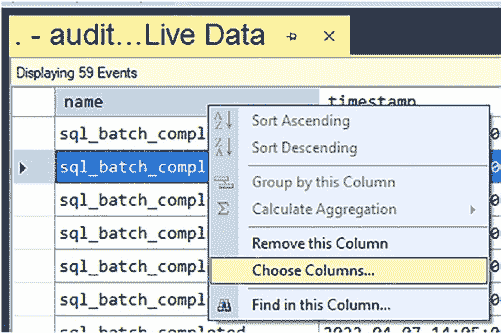
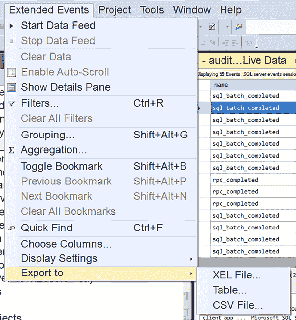
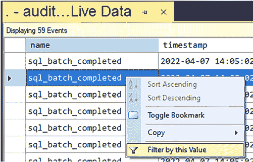
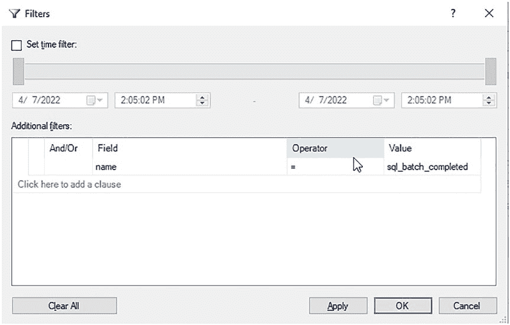
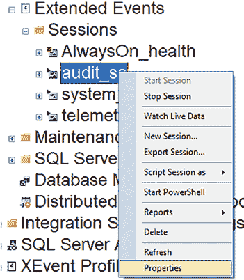
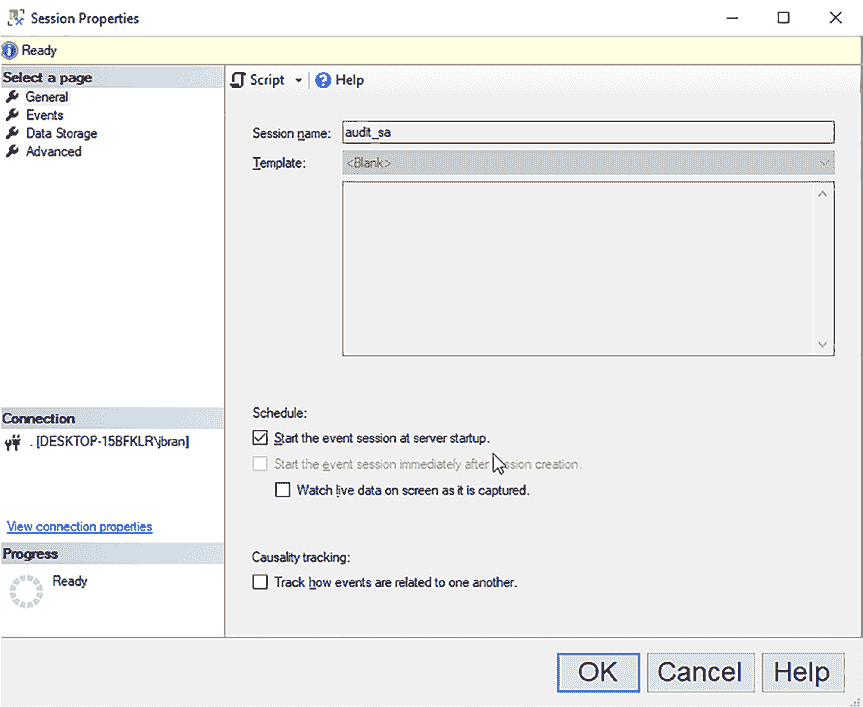
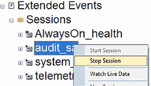
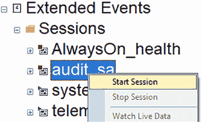
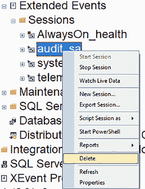

# 第 7 章 通过 GUI 实现扩展事件

图 7-28 展示了如何右键单击详细信息，使该列作为顶部面板的一部分加载。

**图 7-28.** 在“监视实时数据”结果中修改列

一旦你选择了`在表中显示列`，你将在顶部面板中看到该列，如图 7-29 所示。

**图 7-29.** “监视实时数据”结果中修改后的列

你还可以在“监视实时数据”中添加或删除其他列，如图 7-30 所示。

**图 7-30.** “监视实时数据”选项卡及添加或删除列

当`监视实时数据`选项卡打开时，你将在`SSMS`中访问到一个新的菜单项：`扩展事件`。特别是，该菜单通过`导出到`选项使得导出数据变得非常容易，如图 7-31 所示。

**图 7-31.** “监视实时数据”选项卡和“扩展事件”菜单项

你可以通过右键单击某个值并选择`按此值筛选`来进行筛选，如图 7-32 所示。

**图 7-32.** 在“监视实时数据”结果中筛选值

`按此值筛选`将弹出一个对话框，供你设置筛选选项。它会添加你点击`按此值筛选`时所选择的值，如图 7-33 所示。你也可以根据需要在此对话框中设置其他筛选器。

**图 7-33.** “监视实时数据”结果中的“筛选值”对话框

如果你发现查看实时数据时筛选了大量事件数据，你将需要修改扩展事件会话的属性，以便在事件数据被捕获到`.xel`事件文件（如果你使用的是文件目标）之前进行筛选。你可能已经看到，SQL Server 在后台做了大量工作来支持用户执行的操作。现在是讨论修改扩展事件的好时机，因为你可能需要调整一些设置并添加额外的筛选器来限制事件数据。

#### 修改扩展事件

创建扩展事件后，你可以通过右键单击该会话并选择`属性`来修改它，如图 7-34 所示。无论扩展事件是启动还是停止状态，你都可以修改它。

**图 7-34.** 修改扩展事件

**注意** 与`SQL Server 审核`不同，你可以在扩展事件启动时对其进行修改。

在创建扩展事件之后，有些项目是无法更改的，因此它们会显示为灰色（不可用），如图 7-35 所示。当你修改扩展事件时，其对话框外观与新建会话对话框完全相同。

**图 7-35.** “修改扩展事件”对话框

创建后无法更改的项目包括：
- 会话名称
- 模板
- 创建后立即启动（因为你是在修改，而非创建）
- 高级设置

如果你需要更改这些项目中的任何一项，就必须删除并重新创建你的扩展事件。

#### 停止和启动扩展事件

你可以通过在 GUI 中右键单击扩展事件并选择`停止会话`来停止它，如图 7-36 所示。一旦停止，它将不再收集任何事件数据。

**图 7-36.** 停止扩展事件

你可以通过在 GUI 中右键单击扩展事件并选择`启动会话`来启动它，如图 7-37 所示。

**图 7-37.** 启动扩展事件

**注意** 与`SQL Server 审核`不同，即使扩展事件正在审核事件，你也可以停止它。

