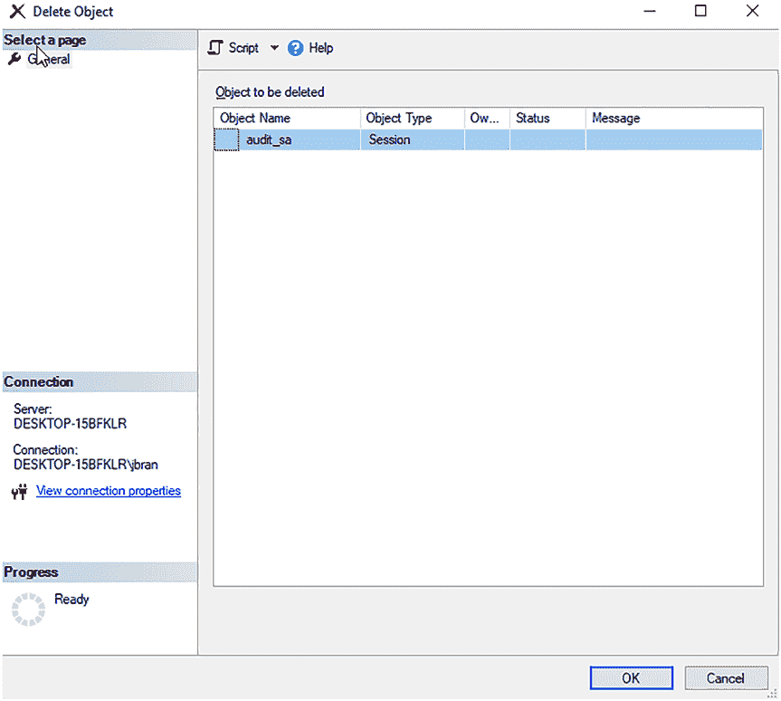

# 第 7 章 通过图形界面实现扩展事件

## **删除扩展事件**

要删除扩展事件，您可以右键单击会话并选择“删除”，如图 7-38 所示。

***图 7-38.** 删除扩展事件*

您将看到如图 7-39 所示的对话框。点击此对话框中的“确定”按钮将删除扩展事件。

***图 7-39.** 删除扩展事件对话框*

当您删除扩展事件时，文件会保留在磁盘上。我删除了扩展事件，以为文件也一并消失了。不，文件仍然在那里。这是为了方便您日后可能需要它们进行审计。您必须手动去删除它们。

在下一章中，您将学习如何通过为您想要部署在服务器上的扩展事件编写脚本来简化工作。

