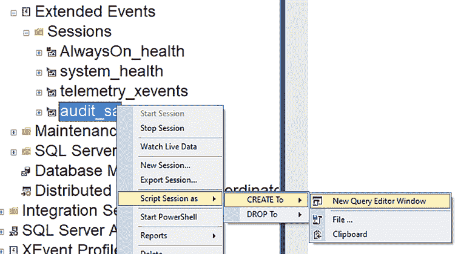

# 第 8 章 通过 SQL 脚本实现扩展事件

要使扩展事件生效，您需要设置一个会话。[第 6 章](https://doi.org/10.1007/978-1-4842-8634-0_6)“什么是扩展事件？”涵盖了构成会话的各个部分。[第 7 章](https://doi.org/10.1007/978-1-4842-8634-0_7)“通过图形界面实现扩展事件”介绍了如何在图形界面中设置会话。在本章中，您将学习如何使用 SQL 脚本设置扩展事件会话。

**注意** 仅仅因为您可以审计一切，并不意味着您应该这样做。如果您审计所有事情，您将很难从中筛选出有用信息，并且可能会导致系统出现性能问题。

#### 为现有扩展事件编写脚本

学习如何为扩展事件编写脚本的一个简单方法是为现有的事件编写脚本。您可以右键单击在[第 7 章](https://doi.org/10.1007/978-1-4842-8634-0_7)“通过图形界面实现扩展事件”中创建的会话，选择“编写脚本为”，然后选择“CREATE 到”，再选择“新建查询编辑器窗口”，如图 8-1 所示。

© Josephine Bush 2022
J. Bush, *Practical Database Auditing for Microsoft SQL Server and Azure SQL*, [`doi.org/10.1007/978-1-4842-8634-0_8`](https://doi.org/10.1007/978-1-4842-8634-0_8#DOI)



***图 8-1.** 为现有的扩展事件会话编写脚本*

这会将您的扩展事件以脚本形式带入 SSMS 中的一个新标签页。本章将介绍如何创建脚本，以便您能更好地理解如何通过脚本来创建、修改和删除扩展事件会话。

#### 设置扩展事件

清单 8-1 展示了如何通过脚本创建审计规范。

***清单 8-1.*** 创建扩展事件

```sql
CREATE EVENT SESSION [audit_sa] ON SERVER
ADD EVENT sqlserver.rpc_completed(
    ACTION(sqlserver.client_app_name,
           sqlserver.client_hostname,
           sqlserver.database_name,
           sqlserver.server_instance_name,
           sqlserver.server_principal_name,
           sqlserver.sql_text)
    WHERE ([sqlserver].[server_principal_name]=N'sa')),
ADD EVENT sqlserver.sql_batch_completed(
    ACTION(sqlserver.client_app_name,
           sqlserver.client_hostname,
           sqlserver.database_name,
           sqlserver.server_instance_name,
           sqlserver.server_principal_name,
           sqlserver.sql_text)
    WHERE ([sqlserver].[server_principal_name]=N'sa'))
ADD TARGET package0.event_file(
    SET filename=N'e:\audits\audit_sa',
    max_file_size=(10),
    max_rollover_files=(5))
WITH (STARTUP_STATE=ON);

ALTER EVENT SESSION [audit_sa] ON SERVER STATE=START;
```

让我们逐一看一下清单 8-1 脚本的各个部分：

- **扩展事件名称**
    ```sql
    CREATE EVENT SESSION [audit_sa] ON SERVER
    ```
    我倾向于用描述性的名称来命名，如果可能的话，在前面加上 `audit`，这样我就知道它审计的是什么。

- **审计事件**
    ```sql
    ADD EVENT sqlserver.rpc_completed
    ADD EVENT sqlserver.sql_batch_completed
    ```
    您可以在这里添加许多不同类型的事件。这是我选择的两个事件...


第 8 章 通过 SQL 脚本实现扩展事件

### 审计事件操作（全局字段）
`ACTION(sqlserver.client_app_name, sqlserver.client_hostname, sqlserver.database_name, sqlserver.server_instance_name, sqlserver.server_principal_name, sqlserver.sql_text)`

你可以在此处添加多种不同类型的操作。这些是我用于审计事件的操作。关于这些操作的更详细描述请参见第 6 章“什么是扩展事件？”。每个事件都需要关联操作，以确保你能看到所需的信息。你可以省略这些操作，但这样你的事件就只剩下默认字段，这些字段对你可能有用，也可能没用。

### 筛选事件
`WHERE ([sqlserver].[server_principal_name]=N'sa'))`

筛选是审计中非常重要的一环。你需要在审计数据写入文件之前进行筛选；否则，过多的审计数据可能会让你不堪重负。我倾向于根据用户或数据库进行筛选。审计整个数据库时需要谨慎。我通常只在试图确定数据库是否真的在被使用时才这样做，因此审计数据很可能非常少。

### 将事件写出到磁盘
`filename=N'e:\audits\audit_sa', max_file_size=(10), max_rollover_files=(5))`

将事件数据从扩展事件中写出有很多不同的选项。这些在第 6 章“什么是扩展事件？”中有更详细的介绍。此脚本将事件写入磁盘。这将写入到 `e:\audits\audit_sa`，最大文件大小为 10 MB，保留 5 个滚动文件。这意味着你的事件总共将有 50 MB 的存储空间。

以下是一些关于文件存储的建议：
- 不要将文件存储在 C 盘或 SQL Server 用于数据和日志文件的其他驱动器上。
- 将最大文件大小设置为较小的值，如 10 MB，并启用 5-10 个文件的滚动。如果你设置了较大的文件大小和很多滚动文件，它们将几乎无法查询。

**注意** 如果你的文件很大并且滚动文件很多，它们可能会变得巨大无比，几乎无法查询。

### 高级选项
`WITH (STARTUP_STATE=ON);`

在高级选项中你可以设置更多选项，但我倾向于不更改其中任何设置。更改这些设置可能会导致数据库服务器出现性能问题。高级选项在第 6 章“什么是扩展事件？”中有更详细的介绍。我唯一设置的高级选项是 `STARTUP_STATE=ON`，这意味着在 SQL Server 任何重启之后，扩展事件会再次启动。

### 启动你的扩展事件会话
`ALTER EVENT SESSION [audit_sa] ON SERVER STATE=START;`

当扩展事件会话停止时，它不会收集任何数据。这就是为什么我在创建后总是会启动它。

#### 查询系统表和视图
你可以查询系统视图以查看有哪些事件和操作可供使用。清单 8-2 展示了这些查询。

**清单 8-2.** 查询系统表以列出扩展事件可用的事件和操作

```
SELECT name, description
FROM sys.dm_xe_objects
WHERE object_type ='Event'
ORDER BY name
```

```
SELECT name, description
FROM sys.dm_xe_objects
WHERE object_type ='Action'
ORDER BY name
```

对 `sys.dm_xe_objects` 应用 'Event' 过滤器，将列出你可以在扩展事件会话中使用的事件。清单 8-2 查询结果的一个横截面如图 8-2 所示。SQL Server 2019 中有超过 1800 个可用事件。可用事件的数量取决于你的 SQL Server 版本。

**图 8-2.** 扩展事件的事件列表


