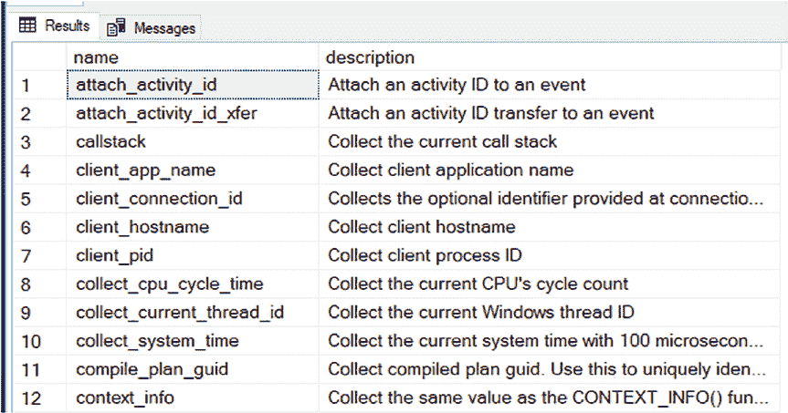
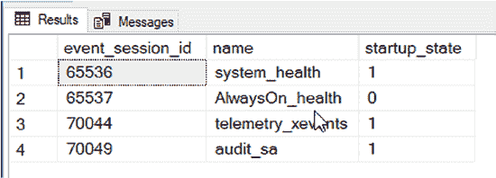
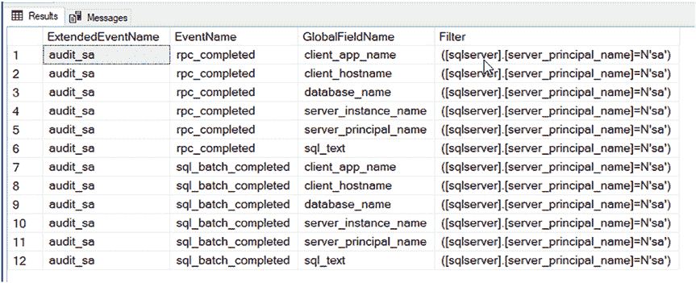
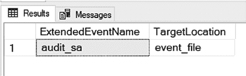

# 第 8 章 通过 SQL 脚本实现扩展事件

`sys.dm_xe_objects` 系统视图，若筛选条件为 ‘Event’，将列出可在扩展事件会话中使用的操作。图 8-3 展示了代码清单 8-2 中查询结果的一个片段。在 SQL Server 2019 中，有 68 种可用的操作。可用操作的具体数量取决于你所使用的 SQL Server 版本。





**图 8-3.** 扩展事件操作列表

你也可以通过查询系统视图来查看扩展事件会话的设置。这比必须通过图形界面（GUI）提示进入查看要方便得多。代码清单 8-3 提供了查询以获取扩展事件及其部分设置的列表。`sys.server_event_sessions` 中包含更多列，但它们是高级设置，我建议你永远不要修改。

**代码清单 8-3.** 查询系统表以列出扩展事件

```sql
SELECT event_session_id, name, startup_state
FROM sys.server_event_sessions;
```

图 8-4 显示了 `sys.server_event_sessions` 查询的结果。根据你的 SQL Server 版本不同，你可能会有不同的扩展事件列表。

**图 8-4.** 扩展事件列表



一旦你从代码清单 8-3 的查询中获得了 `audit_sa` 扩展事件的 `event_session_id`，你就可以将其放入代码清单 8-4、8-5 和 8-6 查询的 `WHERE` 子句中。

**代码清单 8-4.** 查询系统表以列出扩展事件详细信息

```sql
SELECT es.name AS ExtendedEventName,
se.name AS EventName,
sa.name AS GlobalFieldName,
se.predicate AS Filter
FROM sys.server_event_session_events se
INNER JOIN sys.server_event_sessions es
ON se.event_session_id = es.event_session_id
INNER JOIN sys.server_event_session_actions sa
ON sa.event_session_id = es.event_session_id
AND sa.event_id = se.event_id
WHERE es.event_session_id = 70049;
```

代码清单 8-4 返回了扩展事件会话配置的事件、全局字段和筛选器的设置结果。图 8-5 显示了代码清单 8-4 查询的返回结果。

**图 8-5.** 扩展事件关于事件及其全局字段和筛选器的详细信息



图 8-5 显示，名为 `audit_sa` 的扩展事件关联了两个事件。这些事件各自关联了六个全局字段。此外，每个事件都有一个筛选器，以确保仅捕获由 `sa` 用户执行的事件操作。代码清单 8-5 展示了如何查询扩展事件的目标。

**代码清单 8-5.** 查询系统表以列出扩展事件目标

```sql
SELECT es.name AS ExtendedEventName,
st.name AS TargetLocation
FROM sys.server_event_session_targets st
INNER JOIN sys.server_event_sessions es
ON st.event_session_id = es.event_session_id
WHERE es.event_session_id = 70049;
```

图 8-6 显示了代码清单 8-5 查询的返回结果。

**图 8-6.** 扩展事件目标

图 8-6 显示，名为 `audit_sa` 的扩展事件的目标位置是 `event_file`。代码清单 8-6 展示了如何查询扩展事件的附加设置，例如文件名和最大文件大小。

**代码清单 8-6.** 查询系统表以列出扩展事件设置

```sql
SELECT es.name AS ExtendedEventName,
sf.name AS SettingName,
sf.value AS SettingValue
FROM sys.server_event_session_fields sf
INNER JOIN sys.server_event_sessions es
ON sf.event_session_id = es.event_session_id
WHERE es.event_session_id = 70049;
```


