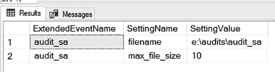
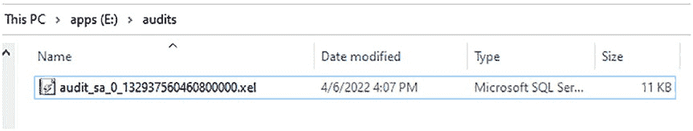
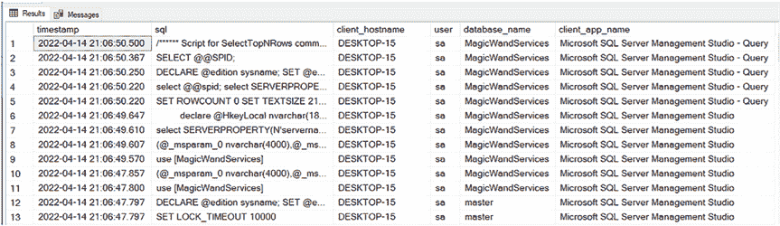

# 第 8 章 通过 SQL 脚本实现扩展事件





图 8-7 向你展示了代码清单 8-4 中的查询返回的结果。

**图 8-7.** 扩展事件附加设置

图 8-7 显示，名为 `audit_sa` 的扩展事件在系统视图中有两个设置。`filename` 显示了文件的存储位置。`max_file_size` 显示其被设置为 10 MB。

**提示** 要获取扩展事件系统视图中所有列的说明，请访问 [`docs.microsoft.com/en-us/sql/relational-databases/extended-events/xevents-references-system-objects?view=sql-server-ver15#system-catalog-views`](https://docs.microsoft.com/en-us/sql/relational-databases/extended-events/xevents-references-system-objects?view=sql-server-ver15#system-catalog-views)

#### 扩展事件文件

如果你为扩展事件选择了文件目标，那么在启用扩展事件后，`.xel` 文件将被放置在磁盘上，如图 8-8 所示。这就是事件数据将要存储的地方。

**图 8-8.** 磁盘上的扩展事件文件

随着数据的收集，该文件将增长到扩展事件中指定的大小。然后，它将根据配置中指定的文件数量创建另一个文件。一旦最后一个文件被写满，它将删除最旧的文件并创建一个新的文件。你需要了解文件被写满的速度，以便在它们被删除之前不会错过从中收集数据。

#### 查询扩展事件数据

你可以使用 SQL Server 系统函数 `sys.fn_xe_file_target_read_file` 来查询你的扩展事件会话。这将为你提供大量关于扩展事件及其关联元数据的不同信息。代码清单 8-7 提供了一个查询，用于获取过去一小时内审计返回的最相关列。XML 中还有更多字段，但它们需要以类似我在代码清单 8-7 中解析字段的方式进行解析。

**代码清单 8-7.** 查询扩展事件会话

```sql
SELECT n.value('(@timestamp)[1]', 'datetime') as timestamp,
       n.value('(action[@name="sql_text"]/value)[1]', 'nvarchar(max)') as [sql],
       n.value('(action[@name="client_hostname"]/value)[1]', 'nvarchar(50)') as [client_hostname],
       n.value('(action[@name="server_principal_name"]/value)[1]', 'nvarchar(50)') as [user],
       n.value('(action[@name="database_name"]/value)[1]', 'nvarchar(50)') as [database_name],
       n.value('(action[@name="client_app_name"]/value)[1]', 'nvarchar(50)') as [client_app_name]
FROM (SELECT CAST(event_data as XML) as event_data
      FROM sys.fn_xe_file_target_read_file('e:\audits\audit_sa*.xel', NULL, NULL, NULL)) ed
CROSS APPLY ed.event_data.nodes('event') as q(n)
WHERE n.value('(@timestamp)[1]', 'datetime') >= DATEADD(HOUR, -1, GETDATE())
ORDER BY timestamp DESC;
```

图 8-9 向你展示了来自代码清单 8-6 查询结果的一个横截面。



**图 8-9.** 扩展事件查询结果

**提示** 通过访问 [`docs.microsoft.com/en-us/sql/relational-databases/system-functions/sys-fn-xe-file-target-read-file-transact-sql?view=sql-server-ver15`](https://docs.microsoft.com/en-us/sql/relational-databases/system-functions/sys-fn-xe-file-target-read-file-transact-sql?view=sql-server-ver15) 了解关于 `sys.fn_xe_file_target_read_file` 的更多信息。


[sql?view=sql-server-ver15](https://docs.microsoft.com/en-us/sql/relational-databases/system-functions/sys-fn-xe-file-target-read-file-transact-sql?view=sql-server-ver15)

可能没有任何列表项，因为尚未发生任何可审核的事件。也可能有很多审核数据，因为后台发生了很多你没有意识到的事情。SQL Server 有很多内部进程可能会被你的扩展事件收集。在会话设置中尽可能多地过滤掉不必要的事件，以避免产生大量的事件数据。

> **注意** 扩展事件数据存储在 UTC 时区。

#### 修改扩展事件

创建扩展事件后，你可以对其进行修改以更改其设置。你可以在扩展事件启动或停止时对其进行修改。清单 8-8 展示了如何修改你的扩展事件会话以添加一个事件。

### 第 8 章 通过 SQL 脚本实现扩展事件

**清单 8-8.** 修改扩展事件

```sql
ALTER EVENT SESSION [audit_sa] ON SERVER
ADD EVENT sqlserver.sql_transaction(
    ACTION(
        sqlserver.client_app_name,
        sqlserver.client_hostname,
        sqlserver.database_name,
        sqlserver.server_instance_name,
        sqlserver.server_principal_name,
        sqlserver.sql_text)
    WHERE ([sqlserver].[server_principal_name]=N'sa'));
```

> **注意** 与 `SQL Server 审核` 不同，你可以在扩展事件启动时对其进行修改。

创建后，你无法更改这些项目：
- 会话名称
- 模板
- 创建后立即启动（因为你不是在创建，而是在修改）
- 高级设置

如果你需要更改任何这些项目，你将不得不删除并重新创建你的扩展事件。

> **提示** 有关修改扩展事件的更多信息，请[访问 https://docs.microsoft.com/en-us/sql/t-sql/statements/alter-event-session-transact-sql?view=sql-server-ver15](https://docs.microsoft.com/en-us/sql/t-sql/statements/alter-event-session-transact-sql?view=sql-server-ver15)。

#### 停止和启动扩展事件

你可以通过执行清单 8-9 中的查询来停止扩展事件。一旦停止，它将不再收集任何事件数据。

**清单 8-9.** 停止扩展事件

```sql
ALTER EVENT SESSION [audit_sa]
ON SERVER STATE = STOP;
```

你可以通过执行清单 8-10 中的查询来启动扩展事件。

**清单 8-10.** 启动扩展事件

```sql
ALTER EVENT SESSION [audit_sa]
ON SERVER STATE = START;
```

> **注意** 与 `SQL Server 审核` 不同，即使扩展事件正在审核事件，你也可以将其停止。

#### 删除扩展事件

要删除扩展事件，你可以执行清单 8-11 所示的查询。

**清单 8-11.** 删除扩展事件

```sql
DROP EVENT SESSION [audit_sa] ON SERVER;
```

当你删除扩展事件时，文件仍保留在磁盘上。我曾删除扩展事件并以为文件也一起删除了。不，文件仍然在那里。这是为了方便你以后可能需要它们用于审核目的。你必须手动删除它们。

在下一章中，你将学习如何从 SQL Server 日志中跟踪配置更改。如果你正在使用 `SQL Server 审核` 来审核更改，这将特别有用。`SQL Server 审核` 不擅长捕获所做的配置更改，因此从 SQL Server 日志中收集它们可以帮助你跟踪这些更改。

