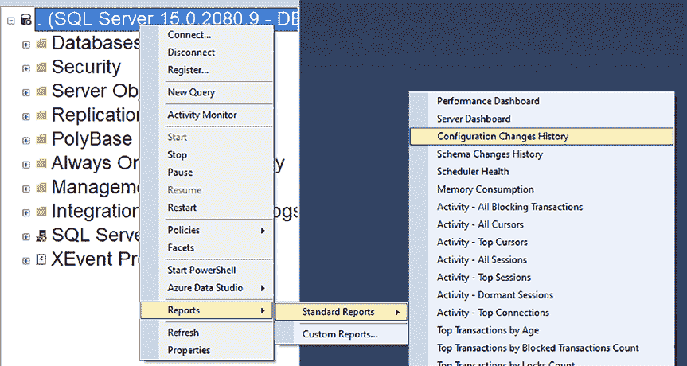
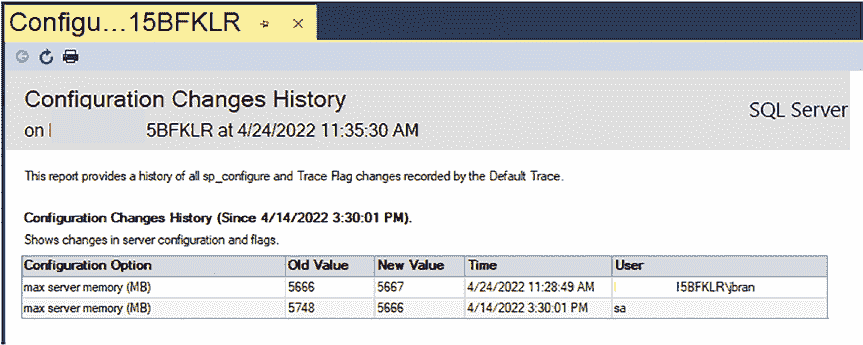
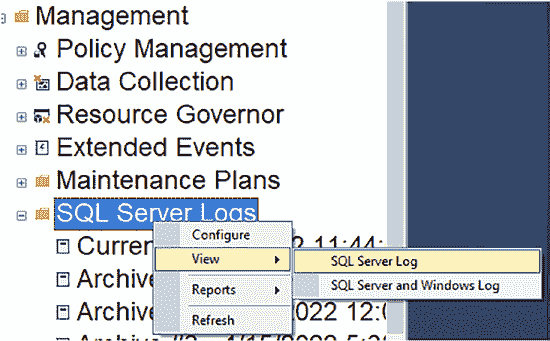
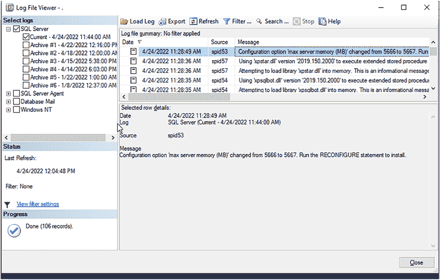
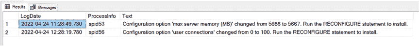

# 第 9 章 追踪 SQL Server 配置变更

配置变更还可能包括修改最大和最小内存等操作。配置设置种类繁多。大多数服务器配置选项可通过 `SSMS` 获取。部分选项只能通过 `sp_configure` 访问。

**提示** 要查看配置选项列表，请访问 [`docs.microsoft.com/en-us/sql/database-engine/configure-windows/server-configuration-options-sql-server?view=sql-server-ver15#configuration-options-table`](https://docs.microsoft.com/en-us/sql/database-engine/configure-windows/server-configuration-options-sql-server?view=sql-server-ver15#configuration-options-table)

© Josephine Bush 2022

J. Bush, *Microsoft SQL Server 与 Azure SQL 实用数据库审计*, [`doi.org/10.1007/978-1-4842-8634-0_9`](https://doi.org/10.1007/978-1-4842-8634-0_9)





#### 在 SSMS 中查看配置变更历史

要在 `SSMS` 中查看配置变更历史，请右键单击服务器连接。然后导航至 报表 ➤ 标准报表 ➤ 配置变更历史记录，如图 9-1 所示。

### 图 9-1. 配置变更历史记录导航

配置变更历史记录报表打开后，您将看到最近的变更。图 9-2 中的屏幕截图展示了此报表。需要注意的是，您可能不会像我的报表中那样看到十天的历史记录。这取决于写入默认跟踪的信息量以及这些文件的轮换速度。`SQL Server` 默认启用默认跟踪。它会收集包括配置变更在内的大量活动日志。不过，我不建议您查询它，因为根据 Microsoft 说明，此功能将在未来版本的 `SQL Server` 中被移除。

### 图 9-2. 配置变更历史记录报表



图 9-2 显示，最大服务器内存（MB）被 `sa` 更改为 5666。还显示它被另一个用户更改为 5667。此报表对于快速查看近期变更很有用，但从长远来看，它并不是追踪变更的理想方式。

#### 在 SQL Server 日志中查询配置变更

您也可以在 `SQL Server 日志` 中查看配置变更。要访问此日志，请右键单击"管理"下的 `SQL Server 日志`。然后选择 查看 ➤ `SQL Server 日志`，如图 9-3 所示。

### 图 9-3. SQL Server 日志导航

图 9-4 显示了包含最后一次内存配置变更的日志。此信息的可用性取决于日志填满所需的时间以及您保留的日志文件数量。



### 图 9-4. 显示配置变更的 SQL Server 日志

还有一种方法可以通过 `SQL` 脚本查询日志。使用清单 9-1 中的查询来检索配置变更的日志记录。查询中包含的注释可帮助您理解每个值的含义。

### 清单 9-1. 查询配置变更日志

```
USE master;

EXEC sys.xp_readerrorlog
0, --0 = 当前日志文件, 1 = 归档文件 #1, 等等
1, --1 或 NULL = 错误日志, 2 = SQL Agent 日志
N'Configuration option', --要查找的字符串
NULL, --可用于进一步筛选结果的字符串
NULL, --开始时间
NULL, --结束时间
N'asc'; --结果排序方式 asc = 升序, desc = 降序
```




