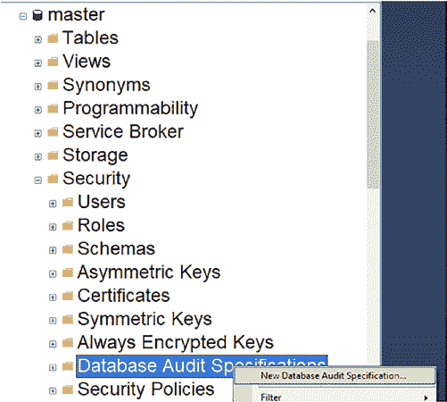
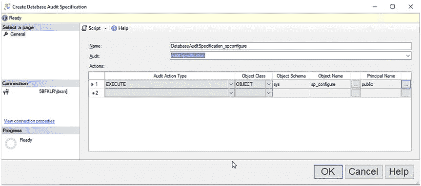

# 第 9 章 跟踪 SQL Server 配置变更

图 9-5 显示了代码清单 9-1 的查询结果。我做了一个额外的配置变更。这样，你可以看到配置变更会以 "Configuration option" 开头出现在 `Text` 字段中。

`图 9-5.` SQL Server 日志查询结果*

此查询一次只会获取一个日志文件。虽然有办法循环遍历它们，但更好的捕获方式是使用 SQL Server 审核。

## 使用 SQL Server 审核捕获配置变更

要了解如何设置 SQL Server 审核，请阅读[第 4 章](https://doi.org/10.1007/978-1-4842-8634-0_4)，“通过 GUI 实现 SQL Server 审核”。这将展示如何创建一个审核，本节中的数据库审核将使用该审核。

要审核配置变更，你需要审核存储过程 `sp_configure`。该存储过程位于 `master` 数据库中。当你使用 `SSMS GUI` 进行更改时，就会调用此存储过程。你也可以自己从查询窗口调用它。

要审核 `sp_configure`，你需要在 `master` 数据库上设置一个数据库审核。为此，右键单击 `master` 数据库中 `Security`（安全性）下的 `Database Audit Specifications`（数据库审核规范），如图 9-6 所示。

第 9 章 跟踪 SQL Server 配置变更

`图 9-6.` `master` 数据库中的数据库审核规范菜单

这将打开一个对话框，你需要按照图 9-7 所示填写选项。

`图 9-7.` 在 `master` 数据库中设置数据库审核规范

第 9 章 跟踪 SQL Server 配置变更

`注意` 我将这个数据库审核规范与同时包含我的服务器审核规范的审核关联了起来。该服务器审核规范捕获 SQL Server 上的权限和对象变更。这在[第 4 章](https://doi.org/10.1007/978-1-4842-8634-0_4)，“通过 GUI 实现 SQL Server 审核”中有介绍。通过将 `sp_configure` 数据库审核与包含我服务器审核的审核关联起来，我可以确保在一个审核中捕获所有的服务器变更。

要在 `master` 中配置数据库审核规范，你需要以下几部分：

- `名称 –` `DatabaseAuditSpecification_spconfigure`。我喜欢根据审核的具体内容来命名。
- `审核 –` 你需要将其与你的审核关联。有一个下拉菜单列出了你的审核。你需要这种关联，因为这是你的审核数据存放的地方。此审核设置在[第 4 章](https://doi.org/10.1007/978-1-4842-8634-0_4)，“通过 GUI 实现 SQL Server 审核”中有介绍。
- `审核操作类型 –` [第 3 章](https://doi.org/10.1007/978-1-4842-8634-0_3)，“什么是 SQL Server 审核？”有一节关于数据库审核操作组，帮助你确定每个操作审核的内容。在本例中，我们只使用 `EXECUTE`（执行）。这审核谁执行了存储过程，或在特定架构或数据库上执行了操作。
- `对象类 –` 这里你将选择 `OBJECT`（对象）。[第 4 章](https://doi.org/10.1007/978-1-4842-8634-0_4)，“通过 GUI 实现 SQL Server 审核”中更详细地介绍了其他选项。选择 `OBJECT` 可查看使用特定表、视图、存储过程或函数的查询。
- `对象架构 –` 对于 `OBJECT` 类是必需的，在本例中是 `sys`。
- `对象名称 –` 对于 `OBJECT`、`SCHEMA`（架构）和 `DATABASE`（数据库）类是必需的。在本例中是 `sp_configure`。
- `主体名称 –` 对于 `OBJECT`、`SCHEMA` 和 `DATABASE` 类是必需的。如果你想审核所有人，请使用 `public`。如果你想审核多个用户，则需要为每个用户设置一行。我在这里使用 `public`，因为我想捕获任何人进行配置变更的任何时候。

第 9 章 跟踪 SQL Server 配置变更

`注意` 所有审核在创建时都是禁用的。请确保启用它，以便收集审核数据。

你也可以通过脚本设置数据库审核规范，如

