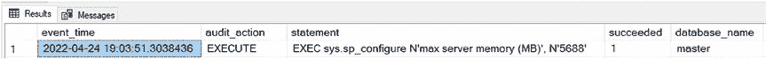

# 第 9 章 追踪 SQL Server 配置变更

## 清单 9-2. 使用 SQL 脚本创建数据库审计规范

```sql
USE [master];

CREATE DATABASE AUDIT SPECIFICATION [DatabaseAuditSpecification_spconfigure]
FOR SERVER AUDIT [AuditSpecification]
ADD (EXECUTE ON OBJECT::[sys].[sp_configure] BY [public])
WITH (STATE = ON);
```

虽然可以通过图形用户界面查询审计（这在第 4 章“通过图形用户界面实现 SQL Server 审计”中已涵盖），但让我们使用 SQL 脚本来查询审计数据（这在第 5 章“通过 SQL 脚本实现 SQL Server 审计”中已涵盖）。首先进行配置更改，然后执行清单 9-3 中的脚本。

## 清单 9-3. 使用 SQL 脚本查询审计

```sql
USE master;
SELECT DISTINCT
    event_time,
    aa.name as audit_action,
    statement,
    succeeded,
    database_name,
    server_instance_name,
    schema_name,
    session_server_principal_name,
    server_principal_name,
    object_Name,
    file_name,
    client_ip,
    application_name,
    host_name,
    file_name
FROM sys.fn_get_audit_file ('E:\audits\*.sqlaudit',default,default) af
INNER JOIN sys.dm_audit_actions aa
    ON aa.action_id = af.action_id
WHERE event_time > DATEADD(HOUR, -4, GETDATE())
ORDER BY event_time DESC;
```



**图 9-8.** 在 master 数据库中设置数据库审计规范

图 9-8 展示了清单 9-3 的查询结果。请确保你在创建审计规范**之后**进行配置更改。数据库审计规范不会拾取在它创建之前的更改。即使你通过 SSMS 图形用户界面进行更改，它仍然会在后台使用 `sp_configure`，因此该操作会以这种方式显示在审计中。

下一章，你将了解额外的 SQL Server 审计选项，如通用准则合规性、C2 审计跟踪、变更数据捕获、成功/失败登录以及 DDL 触发器。

