# 第 10 章 其他 SQL Server 审计与跟踪方法

在本章中，你将了解额外的 SQL Server 审计选项。我很少（如果有的话）使用其中大部分。它们可能导致性能问题，或产生过多数据而无法梳理。我希望向你展示这些选项，以帮助你就在是否使用它们上做出明智决定。根据你的用例，谨慎使用时，它们可能被证明是有价值的。

#### 通用准则合规性

如果你没有审计员要求你开启此功能，请保持关闭。它可能对服务器性能产生很大影响。即使审计员认为你需要它，也要与他们沟通，解释开启它的影响。

我在此仅简要提及 C2 审计模式，因为 C2 将在未来版本的 SQL Server 中被移除。微软建议使用通用准则合规性。

通用准则合规性由欧盟开发。它是一套国际认可的安全指南。SQL Server 的此功能仅在 Enterprise 和 Datacenter 版本中可用。

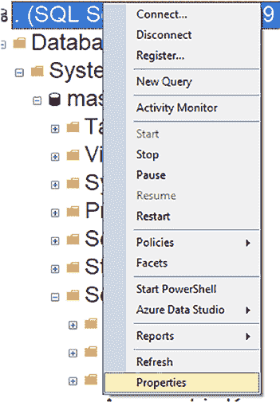

**图 10-1.** 打开服务器属性

启用通用准则合规性后：
*   内存分配在重新分配给新资源前，会被已知的比特模式覆盖。这可能导致性能缓慢。
*   登录审计被启用。可以通过查询 `sys.dm_exec_sessions` 视图查看登录统计信息。
*   表级别的 `DENY` 优先于列级别的 `GRANT`。

要启用通用准则合规性，请右键单击服务器连接并选择“属性”，如图 10-1 所示。

### 第 10 章：其他 SQL Server 审计与跟踪方法

## 更改跟踪

一旦属性对话框打开，点击“安全”页面。然后勾选“启用公共标准合规性”复选框，如图 10-2 所示。

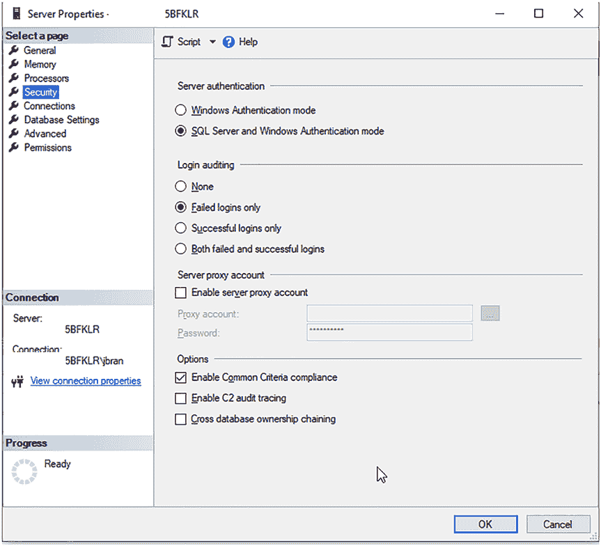

***图 10-2.** 勾选“启用公共标准合规性”复选框*

当你在对话框上点击“确定”时，会收到一个弹出消息，警告你需要重启 SQL Server，如图 10-3 所示。

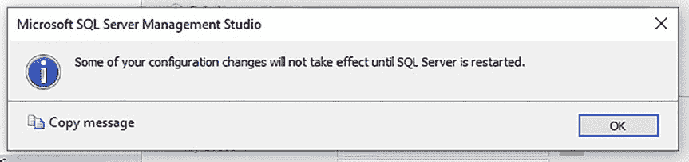

***图 10-3.** 弹出警告：某些配置更改直到 SQL Server 重启后才会生效*

重启 SQL Server 服务后，公共标准合规性功能即被启用。

**变更跟踪**

变更跟踪是一种跟踪 DML 变更的轻量级方法。通常由应用程序用来查询数据库变更。变更跟踪已经过优化以最小化性能影响，但仍有开销，因此在实施时需谨慎，特别是在变更频繁的表上。此外，当变更跟踪清理发生时，可能会导致锁定和阻塞。换句话说，在启用前请仔细考虑。

在使用变更跟踪之前，你需要在数据库级别启用它，如图 10-4 所示。你可以通过右键单击数据库并选择“属性”来访问此对话框。“保留期”、“保留期单位”和“自动清理”选项保留默认值即可。

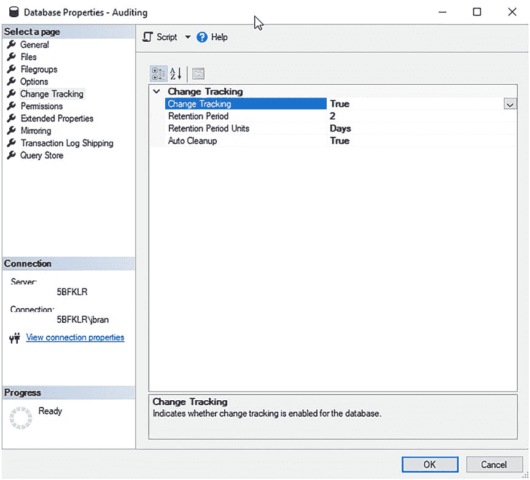

***图 10-4.** 在数据库级别启用变更跟踪*

你也可以通过 SQL 脚本启用变更跟踪，如清单 10-1 所示。

***清单 10-1.*** 在数据库级别启用变更跟踪

```sql
USE [master];
ALTER DATABASE [YourDBName] SET CHANGE_TRACKING = ON
(CHANGE_RETENTION = 2 DAYS, AUTO_CLEANUP = ON);
```

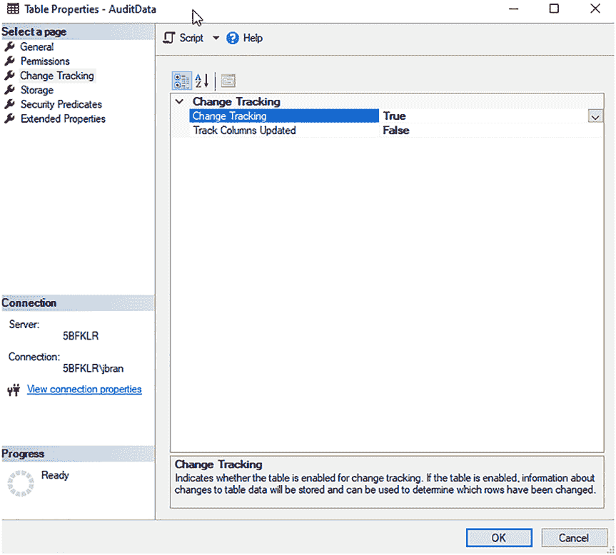

**注意**：Microsoft 建议任何启用了变更跟踪的数据库都应处于快照隔离级别。这确保了变更跟踪的一致性。更改隔离级别时需谨慎，因为它可能产生意想不到的后果。

在数据库级别启用变更跟踪后，你必须为要跟踪的每个表启用它。图 10-5 展示了如何启用。你可以通过右键单击表并选择“属性”来访问此对话框。

***图 10-5.** 在表级别启用变更跟踪*

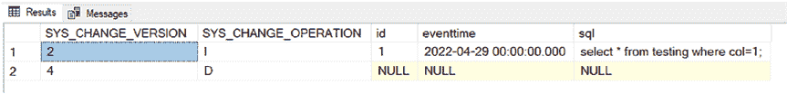

**注意**：任何你想使用变更跟踪的表都需要有一个主键。

你也可以通过 SQL 脚本启用变更跟踪，如清单 10-2 所示，确保将数据库和表名更改为你要使用的名称。

***清单 10-2.*** 通过脚本在表级别启用变更跟踪

```sql
USE [YourDBName];
ALTER TABLE [dbo].[YourTableName] ENABLE CHANGE_TRACKING
WITH (TRACK_COLUMNS_UPDATED = OFF);
```

**注意**：`TRACK_COLUMNS_UPDATED` 会使用额外的存储空间。因此，默认情况下它是禁用的。

要查看变更跟踪数据，请执行清单 10-3 中的查询。

***清单 10-3.*** 查询变更跟踪数据

```sql
USE YourDBName;
SELECT CT.SYS_CHANGE_VERSION,
CT.SYS_CHANGE_OPERATION, EM.*
FROM CHANGETABLE
(CHANGES [AuditData],0) as CT
LEFT JOIN [dbo].[AuditData] EM
ON CT.ID = EM.ID
ORDER BY SYS_CHANGE_VERSION;
```

清单 10-3 返回启用了变更跟踪的表的更改结果。这些结果显示在图 10-6 中。你的结果会有所不同。

***图 10-6.** 变更跟踪查询结果*


图 10-6 显示插入了一行，由`SYS_CHANGE_OPERATION = I`标明。

它也显示删除了一行，由`SYS_CHANGE_OPERATION = D`标明。

**提示** 关于变更跟踪的更多信息，请访问[`docs.microsoft.com/en-us/sql/relational-databases/track-changes/work-with-change-tracking-sql-server?view=sql-server-ver15`](https://docs.microsoft.com/en-us/sql/relational-databases/track-changes/work-with-change-tracking-sql-server?view=sql-server-ver15)。

变更跟踪无法让你查看数据被更改的次数或每次更改的值。如果你需要确切知道做了哪些更改以及更改发生的频率，那么你需要使用变更数据捕获。

**提示** 关于变更跟踪和变更数据捕获的比较，请访问[`docs.microsoft.com/en-us/sql/relational-databases/track-changes/track-data-changes-sql-server?view=sql-server-ver15#feature-differences-between-change-data-capture-and-change-tracking`](https://docs.microsoft.com/en-us/sql/relational-databases/track-changes/track-data-changes-sql-server?view=sql-server-ver15#feature-differences-between-change-data-capture-and-change-tracking)。

**变更数据捕获**

变更数据捕获（CDC）使用 SQL Server 代理来跟踪对表进行的 DML 更改。这使你可以查看对数据所做的更改，其细节以一种易于使用的格式呈现。这对于提取、转换和加载（ETL）应用程序或过程特别有用。

CDC 已经过优化以最小化性能影响，但仍存在开销，因此在实施时需谨慎，尤其是在更改频繁的表上。换句话说，在启用前要仔细考虑。它还会占用数据库中的存储空间，因此你需要仔细跟踪存储使用情况。

要确定数据库上是否启用了 CDC，请执行清单 10-4 中的查询。

***清单 10-4.*** 确定 CDC 是否已启用

```sql
SELECT name, is_cdc_enabled
FROM sys.databases;
```

如果已启用，你会看到`is_cdc_enabled = 1`；否则为 0。

**注意** CDC 需要独占使用`cdc`架构和用户，因为它们是 CDC 进程的一部分。CDC 还需要使用 SQL 代理，请确保该服务正在运行，并且代理已启用并启动。

要启用 CDC，请执行清单 10-5 中的查询，确保使用你希望在其上启用 CDC 的数据库名称。

***清单 10-5.*** 在数据库级别启用 CDC

```sql
USE YourDBName;
EXEC sys.sp_cdc_enable_db;
```

在数据库上启用 CDC 后，你可以使用清单 10-6 中的查询在表上启用它。

***清单 10-6.*** 在表级别启用 CDC

```sql
USE [YourDBName];
EXEC sys.sp_cdc_enable_table
    @source_schema = N'dbo',
    @source_name = N'YourTableName',
    @role_name = NULL,
    @filegroup_name = NULL,
    @supports_net_changes = 0;
```

要确定表上是否启用了 CDC，请执行清单 10-7 中的查询。

***清单 10-7.*** 确定哪些表上启用了 CDC


使用 `YourDBName`;

```sql
SELECT name, is_tracked_by_cdc
FROM sys.tables
WHERE is_tracked_by_cdc = 1;
```

如果已启用，你将看到 `is_cdc_enabled = 1`；如果未启用，则显示为 `0`。

## 第 10 章 补充的 SQL Server 审计与跟踪方法

**提示** 要理解清单 10-6 中的选项，[请访问 Microsoft 关于为表启用 CDC 的文档](https://docs.microsoft.com/en-us/sql/relational-databases/track-changes/enable-and-disable-change-data-capture-sql-server?view=sql-server-ver15#enable-for-a-table)。

一旦你在某个表上启用了 CDC，你会看到与之关联的几个项目：

*   **`YourDBName` 中的系统表**
    *   `cdc.captured_columns` – 为捕获实例中跟踪的每一列返回一行。
    *   `cdc.change_tables` – 为数据库中每个变更表返回一行。
    *   `cdc.dbo_YourTableName_CT` – 为关联源表中被捕获列的每一次变更返回一行。
    *   `cdc.ddl_history` – 为已启用变更数据捕获的表上发生的每次数据定义语言（DDL）变更返回一行。
    *   `cdc.index_columns` – 为与变更表关联的每个索引列返回一行。
    *   `cdc.lsn_time_mapping` – 为在变更表中拥有行的每个事务返回一行。此表用于映射日志序列号（LSN）提交值与事务提交时间。
*   **存储在 `MSDB` 中的系统表**
    *   `dbo.cdc_jobs` – 返回变更数据捕获代理作业的配置参数。
*   **用于捕获和清理 CDC 数据的两个代理作业**
    *   `cdc.YourDBName_capture` – 执行存储过程 `sp_MScdc_capture_job`，该过程负责捕获 CDC 数据。
    *   `cdc.YourDBName_cleanup` – 执行存储过程 `sp_MScdc_cleanup_job`，该过程首先从 `msdb.dbo.cdc_jobs` 中提取清理作业的保留期和阈值配置。

**提示** 要了解更多关于 CDC 代理作业的信息，[请访问 Microsoft 关于管理和监视 CDC 的文档](https://docs.microsoft.com/en-us/sql/relational-databases/track-changes/administer-and-monitor-change-data-capture-sql-server?view=sql-server-ver15)。

要了解更多关于 CDC 系统表的信息，请访问[Microsoft 关于变更数据捕获表的文档](https://docs.microsoft.com/en-us/sql/relational-databases/system-tables/change-data-capture-tables-transact-sql?view=sql-server-ver15)。


### 第 10 章：其他 SQL Server 审计与跟踪方法

## 清单 10-8. 查询 CDC 数据

```sql
USE YourDBName;

DECLARE @from_lsn binary(10), @to_lsn binary(10);

SET @from_lsn = sys.fn_cdc_get_min_lsn('dbo_YourTableName');

SET @to_lsn = sys.fn_cdc_get_max_lsn();

SELECT *

FROM cdc.fn_cdc_get_all_changes_dbo_AuditData

(@from_lsn, @to_lsn, N'all');
```

**注意：** CDC 要捕获数据，需要启用并启动 SQL Server 代理。

查询结果会根据表上发生的变化而有所不同。图 10-7 展示了结果可能的样子。

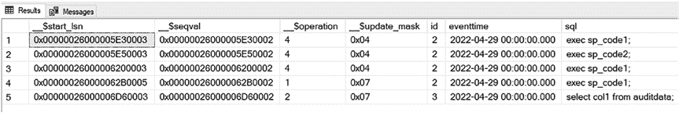

### 图 10-7. CDC 查询结果

`__$operation` 列的值含义如下：

*   **1** – 删除。
*   **2** – 插入。
*   **3** – 更新。这将返回旧值。仅当指定了行过滤选项 `'all update old'` 时有效。要设置此选项，你需要在清单 10-8 中指定 `N'all update old'` 而不是 `N'all'`。
*   **4** – 更新，但仅包含更新后的列值。

**提示：** 要获取关于 `cdc.fn_cdc_get_all_changes` 函数的更多信息，请访问 [`https://docs.microsoft.com/en-us/sql/relational-databases/system-functions/cdc-fn-cdc-get-all-changes-capture-instance-transact-sql?view=sql-server-ver15`](https://docs.microsoft.com/en-us/sql/relational-databases/system-functions/cdc-fn-cdc-get-all-changes-capture-instance-transact-sql?view=sql-server-ver15)。

#### 时态表

此内置数据库功能允许你查看表中任何时间点存储的数据。它是一个系统版本控制表，保存了数据变更的完整历史。每一行的有效性由系统（即数据库引擎）管理。版本控制通过一对表（当前表和历史表）实现。每个表都有两个 `datetime2` 类型的列，用于定义每行的有效期。它们被称为期间列（PERIOD columns）。当前表包含每行的当前值。历史表包含每行的每个先前值及其有效的开始时间和结束时间。

##### 创建时态表

要创建带有默认历史表的时态表，请使用清单 10-9 中的脚本。

#### 清单 10-9. 创建带有默认历史表的时态表

```sql
CREATE TABLE dbo.AuditChangesTemporal
(
    AuditID INT NOT NULL PRIMARY KEY CLUSTERED IDENTITY(1,1),
    [event_time] datetime2 NOT NULL,
    [statement] nvarchar NULL,
    ValidFrom DATETIME2 GENERATED ALWAYS AS ROW START NOT NULL,
    ValidTo DATETIME2 GENERATED ALWAYS AS ROW END NOT NULL,
    PERIOD FOR SYSTEM_TIME (ValidFrom, ValidTo)
)
WITH (SYSTEM_VERSIONING = ON (HISTORY_TABLE = dbo.AuditChangesTemporalHistory));
```

清单 10-9 中的脚本将创建一个时态表，其历史表可以从该表下访问，如图 10-8 所示。

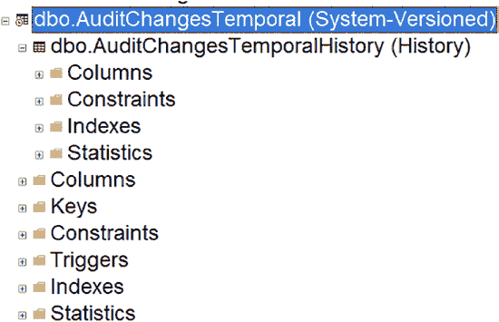

#### 图 10-8. 带有历史表的时态表

##### 修改时态表中的数据

如果你不隐藏期间列 `ValidTo` 和 `ValidFrom`，那么在修改数据时需要考虑它们。你可以通过仅指定要 `INSERT` 的列来做到这一点，如清单 10-10 所示。这将为你设置 `ValidTo` 和 `ValidFrom` 的默认值。

#### 清单 10-10. 向时态表中插入数据

```sql
INSERT INTO Auditing.dbo.AuditChangesTemporal
    (event_time, statement)
SELECT DATEADD(mi, DATEPART(TZ, SYSDATETIMEOFFSET()), event_time) as event_time, statement
FROM sys.fn_get_audit_file ('e:\sqlaudit\*.sqlaudit',default,default) af
WHERE DATEADD(mi, DATEPART(TZ, SYSDATETIMEOFFSET()), event_time) > DATEADD(HOUR, -4, GETDATE());
```

如果你隐藏了期间列 `ValidTo` 和 `ValidFrom`，那么在修改数据时就不需要考虑它们。换句话说，你可以在不必指定列的情况下进行 `INSERT`。

**注意：** 修改时态表中的数据还有更多规则，例如更新和删除操作。有关在时态表中修改数据的更多信息，请访问 [`https://docs.microsoft.com/en-us/sql/relational-databases/tables/modifying-data-in-a-system-versioned-temporal-table?view=sql-server-ver16`](https://docs.microsoft.com/en-us/sql/relational-databases/tables/modifying-data-in-a-system-versioned-temporal-table?view=sql-server-ver16)。

##### 查询时态表

当你想要获取时态表中的当前数据时，可以像查询任何其他表一样查询它，如图 10-9 所示。

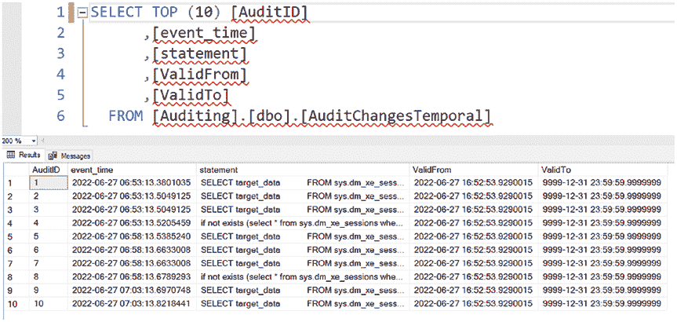

#### 图 10-9. 查询时态表中的当前数据

如果你想查询历史数据，则需要指定 `FOR SYSTEM_TIME AS OF` 子句，如清单 10-11 所示。

#### 清单 10-11. 查询时态表的历史数据

```sql
SELECT TOP (10) *
FROM [Auditing].[dbo].[AuditChangesTemporal]
FOR SYSTEM_TIME AS OF '2022-06-01 T10:00:00.7230011';
```

根据该 `SYSTEM_TIME` 的历史数据中是否确实存在内容，此查询可能不返回任何行。

**注意：** 有关时态表的更多信息，请访问 [`https://docs.microsoft.com/en-us/sql/relational-databases/tables/getting-started-with-system-versioned-temporal-tables?view=sql-server-ver16`](https://docs.microsoft.com/en-us/sql/relational-databases/tables/getting-started-with-system-versioned-temporal-tables?view=sql-server-ver16)。

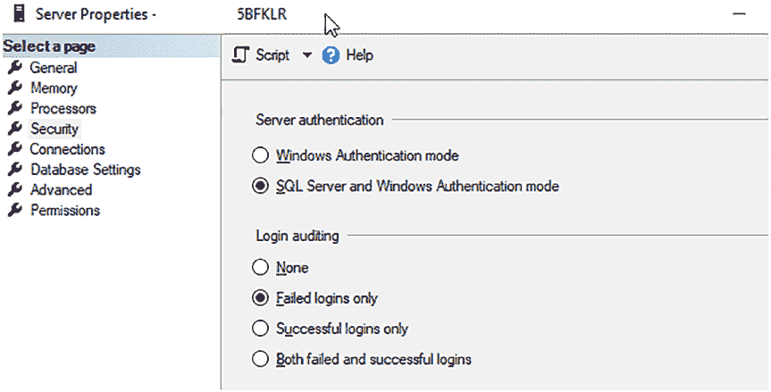

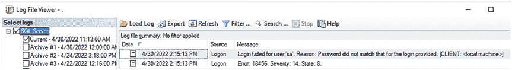

## 成功与失败的登录

审计成功和/或失败登录的一种方法是在 SSMS 中启用登录审计，这将把信息写入 SQL Server 日志。你可以在 SSMS 中右键单击服务器连接并选择“属性”，然后点击“安全性”页面来启用此功能，如图 10-10 所示。


#### 图 10-10. 登录审计配置

此服务器仅捕获失败的登录。如果更改此设置，你需要重启 SQL Server。图 10-11 展示了日志中失败登录消息的样子。


#### 图 10-11. SQL Server 日志中的失败登录

你也可以查询日志以提取其中的记录，这将在下文涵盖...


