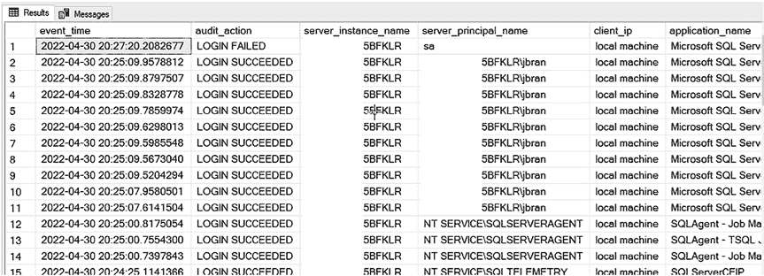

# 第 10 章 附加的 SQL Server 审计与跟踪方法

##### 用于成功和失败登录审计的 SQL Server 审计

在第 9 章“跟踪 SQL Server 配置更改”中有所涉及。然而，日志并不是跟踪登录的最佳方式。跟踪成功和失败登录的更好方法是使用 SQL Server 审计或扩展事件。

SQL Server 审计（在第 3 章“什么是 SQL Server 审计？”到第 5 章“通过 SQL 脚本实现 SQL Server 审计”中有更详细的介绍）允许你审计成功和失败的登录。你需要一个审计来存储审计数据，以及一个服务器审计规范来收集登录信息。服务器审计规范如清单 10-12 所示。

***清单 10-12.*** 用于捕获成功和失败登录的服务器审计规范

```sql
USE [master];

CREATE SERVER AUDIT SPECIFICATION [ServerAuditSpecification]
FOR SERVER AUDIT [AuditSpecification]
ADD (FAILED_LOGIN_GROUP),
ADD (SUCCESSFUL_LOGIN_GROUP)
WITH (STATE = ON);
```

你可以使用清单 10-13 中的查询来查看你的审计结果。

***清单 10-13.*** 查看审计结果的查询

```sql
USE master;
SELECT
    event_time,
    aa.name as audit_action,
    server_instance_name,
    server_principal_name,
    client_ip,
    application_name,
    host_name
FROM sys.fn_get_audit_file ('E:\audits\*.sqlaudit',default,default) af
INNER JOIN sys.dm_audit_actions aa
    ON aa.action_id = af.action_id
WHERE event_time > DATEADD(HOUR, -4, GETDATE())
ORDER BY event_time DESC;
```

在发生一些成功和失败的登录后，你的审计结果将类似于图 10-12。



***图 10-12.*** SQL Server 审计成功和失败登录结果

你只会看到有关登录来源的信息，例如 `client_ip` 和 `hostname`，但这些信息仅在较新版本的 SQL Server 中可用。然而，确定登录来源是审计的重要组成部分。如果你使用的 SQL Server 版本低于 2016 SP1，你可能需要考虑改用扩展事件。

##### 用于成功和失败登录审计的扩展事件

扩展事件（在第 6 章“什么是扩展事件？”到第 8 章“通过 SQL 脚本实现扩展事件”中有更详细的介绍）同样允许你审计成功和失败的登录。扩展事件的好处是，无论你使用哪个版本的 SQL Server，你都可以获取客户端主机名。

你需要创建一个使用 `login` 事件和 `error_reported` 事件的会话，如清单 10-14 所示。

***清单 10-14.*** 创建扩展事件以捕获成功和失败登录

```sql
CREATE EVENT SESSION [AuditLogins] ON SERVER
ADD EVENT sqlserver.error_reported(
    ACTION(sqlserver.client_app_name,
           sqlserver.client_hostname,
           sqlserver.server_principal_name)
    WHERE ((([severity]=(14))
        AND ([error_number]=(18456)))
        AND ([state]>(1)))),
ADD EVENT sqlserver.login(
    ACTION(sqlserver.client_app_name,
           sqlserver.client_hostname,
           sqlserver.server_principal_name))
ADD TARGET package0.event_file(
    SET filename=N'E:\audits\AuditLogins.xel',
        max_file_size=(10),
        max_rollover_files=(10))
WITH (STARTUP_STATE=ON);

ALTER EVENT SESSION [AuditLogins] ON SERVER
STATE=START;
```

在发生一些成功和失败的登录后，你可以执行清单 10-15 中的查询来查询你的扩展事件。

***清单 10-15.*** 查询你的扩展事件

```sql
SELECT
    n.value('(@timestamp)[1]', 'datetime') as timestamp,
    n.value('(@name)[1]', 'nvarchar(15)') as name,
    n.value('(action[@name="client_hostname"]/value)[1]',
             'nvarchar(50)') as [client_hostname],
    n.value('(action[@name="server_principal_name"]/value)[1]',
```


