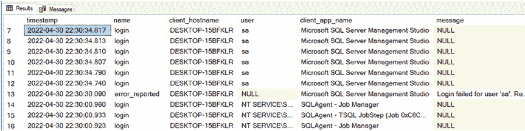

# 第十章 其他 SQL Server 审计与跟踪方法

`清单 10-15`中的查询将产生类似`图 10-13`中的结果。请注意，`error_reported`事件（即失败的登录）没有用户，但有一条消息。而登录事件确实有用户，但没有消息，因为成功的登录没有错误消息。

```sql
'nvarchar(50)') as [user],
n.value('(action[@name="client_app_name"]/value)[1]',
'nvarchar(50)') as [client_app_name],
n.value('(data[@name="message"]/value)[1]', 'nvarchar(50)') as
[message]
FROM (SELECT CAST(event_data as XML) as event_data
FROM sys.fn_xe_file_target_read_file('e:\audits\AuditLogins*.xel', NULL,
NULL, NULL)) ed
CROSS APPLY ed.event_data.nodes('event') as q(n)
WHERE n.value('(@timestamp)[1]', 'datetime') >= DATEADD(HOUR, -1,
GETDATE())
ORDER BY timestamp DESC;
```



`图 10-13.` 审计结果

#### DDL 触发器

DDL 触发器可用于阻止更改、响应更改执行某些操作以及记录更改。您可以在服务器级别或数据库级别执行此操作。触发器在阻止更改或响应更改执行某些操作方面非常有用。但用于记录更改则不太有效。我建议对这些更改使用 SQL Server 审计或扩展事件。

`提示` 要了解有关 DDL 触发器的更多信息，请访问 [`docs.microsoft.com/en-us/sql/relational-databases/triggers/ddl-triggers?view=sql-server-ver15`](https://docs.microsoft.com/en-us/sql/relational-databases/triggers/ddl-triggers?view=sql-server-ver15)。

在下一章中，我将向您展示如何集中您的 SQL Server 审计和扩展事件数据。这将使查询和报告变得容易得多，因为它集中在一个位置。

