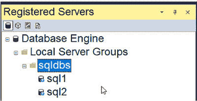
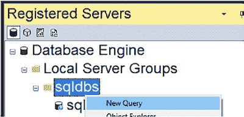

# 第十一章 集中审计数据

审计的一个重要部分是能够轻松查询和报告来自多台服务器的审计数据。在本章中，您将学习如何使用 SQL Server 代理和链接服务器来集中审计数据。您还将学习如何使用已注册的服务器列表在多台服务器上设置审计。

要集中审计数据，您需要以下项目：

-   **集中审计数据库** – 用于存储所有受审核服务器的审计数据。
-   **中心服务器上的审计用户** – 此用户将用于在链接服务器上连接回中心服务器。
-   **受审核服务器上的链接服务器** – 链接到包含审计数据库的中心服务器。
-   **受审核服务器上的 SQL Server 代理审计收集作业** – 通过链接服务器将审计数据发送到集中审计数据库。
-   **集中审计数据库上用于清理审计数据的 SQL Server 代理作业** – 确保您设置并强制执行保留策略。

#### 在多台服务器上设置审计

使用已注册的服务器列表，可以在多台服务器上轻松设置审计。`图 11-1` 显示了一个已注册服务器列表的示例。

`图 11-1.` 已注册服务器列表

设置好列表后，您可以右键单击包含所有要审计服务器的文件夹，然后选择“新建查询”，如`图 11-2`所示。

`图 11-2.` 已注册服务器列表 新建查询

我喜欢将我所有审计服务器的审计数据放在相同的驱动器号上。确保不要将审计文件放在 C 盘上。我不建议将

© Josephine Bush 2022
J. Bush, *Microsoft SQL Server 和 Azure SQL 的实用数据库审计*, [`doi.org/10.1007/978-1-4842-8634-0_11`](https://doi.org/10.1007/978-1-4842-8634-0_11)

