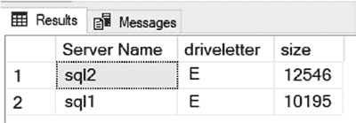
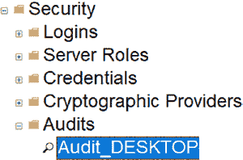
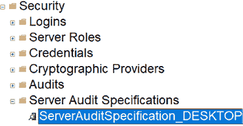

# 第 11 章 集中审计数据

也不要将审计文件放在数据驱动器或日志驱动器上。我工作的地方有一个用于应用程序的 E 盘。对于审计文件来说，那是个很棒的存放位置。

一旦已注册服务器列表查询窗口打开，你需要检查你的服务器上有哪些可用驱动器，如 `Listing 11-1` 所示。

### 清单 11-1. 检查磁盘

```sql
DECLARE @drives TABLE
(driveletter VARCHAR(1), size INT);

INSERT INTO @drives
EXEC MASTER..xp_fixeddrives;

SELECT * FROM @drives
WHERE driveletter = 'E';
```



你会看到类似 `Figure 11-3` 中的结果。你可能没有 E 盘。在这种情况下，你可能需要考虑为你的审计文件添加一个小驱动器。

### 图 11-3. 已注册服务器上的驱动器空间

`Listing 11-1` 的查询结果不会显示你有多少可用磁盘空间。如果你遵循第 5 章 “通过 SQL 脚本实现 SQL Server 审计” 中的指导，你不会使用太多空间，最多 200 MB。我建议在你的驱动器上创建一个文件夹来存放审计文件。你需要手动创建这个文件夹。如果你想自动化这个过程，也许可以使用 `PowerShell` 来完成。

一旦驱动器文件夹准备就绪，你就可以使用已注册服务器列表查询添加审计组件，如 `Listing 11-2` 所示。此脚本将使用字符串 `_servername` 动态命名你的审计，其中服务器名称将是服务器的实际名称。

### 清单 11-2. 在所有服务器上设置审计

```sql
USE [master];

DECLARE @statement NVARCHAR(max);
DECLARE @servername VARCHAR(50);
SET @servername = @@servername;

SELECT @statement = '
CREATE SERVER AUDIT [Audit_'+@servername+']
TO FILE
( FILEPATH = N''E:\sqlaudit\''
,MAXSIZE = 50 MB
,MAX_ROLLOVER_FILES = 4
,RESERVE_DISK_SPACE = OFF
)
WITH
( QUEUE_DELAY = 1000
,ON_FAILURE = CONTINUE
)
ALTER SERVER AUDIT [Audit_'+@servername+'] WITH (STATE = ON);';

EXEC sp_executesql @statement;
```



`Figure 11-4` 显示了审计名称可能的样子。这取决于你的服务器是如何命名的。

### 图 11-4. 通过脚本在服务器上设置审计

接下来，你需要使用 `Listing 11-3` 中的脚本在所有服务器上设置服务器审计规范。此脚本将使用字符串 `_servername` 动态命名你的服务器审计规范。

### 清单 11-3. 在所有服务器上设置服务器审计规范

```sql
USE [master];

DECLARE @statement NVARCHAR(max)
DECLARE @servername VARCHAR(50)
SET @servername = @@servername

SELECT @statement = 'CREATE SERVER AUDIT SPECIFICATION
[ServerAuditSpecification_'+@servername+']
FOR SERVER AUDIT [Audit_'+@servername+']
ADD (DATABASE_CHANGE_GROUP),
ADD (AUDIT_CHANGE_GROUP),
ADD (APPLICATION_ROLE_CHANGE_PASSWORD_GROUP),
ADD (DATABASE_OBJECT_CHANGE_GROUP),
ADD (DATABASE_OWNERSHIP_CHANGE_GROUP),
ADD (DATABASE_PERMISSION_CHANGE_GROUP),
ADD (DATABASE_PRINCIPAL_CHANGE_GROUP),
ADD (DATABASE_ROLE_MEMBER_CHANGE_GROUP),
ADD (LOGIN_CHANGE_PASSWORD_GROUP),
ADD (SCHEMA_OBJECT_CHANGE_GROUP),
ADD (SCHEMA_OBJECT_OWNERSHIP_CHANGE_GROUP),
ADD (SCHEMA_OBJECT_PERMISSION_CHANGE_GROUP),
ADD (SERVER_OBJECT_CHANGE_GROUP),
ADD (SERVER_OBJECT_OWNERSHIP_CHANGE_GROUP),
ADD (SERVER_OBJECT_PERMISSION_CHANGE_GROUP),
ADD (SERVER_OPERATION_GROUP),
ADD (SERVER_PERMISSION_CHANGE_GROUP),
ADD (SERVER_PRINCIPAL_CHANGE_GROUP),
ADD (SERVER_ROLE_MEMBER_CHANGE_GROUP),
ADD (SERVER_STATE_CHANGE_GROUP),
ADD (USER_CHANGE_PASSWORD_GROUP)
WITH (STATE = ON);'

exec sp_executesql @statement;
```



`Figure 11-5` 显示了服务器审计规范名称可能的样子。这取决于你的服务器是如何命名的。

### 图 11-5. 通过脚本在服务器上设置服务器审计规范


