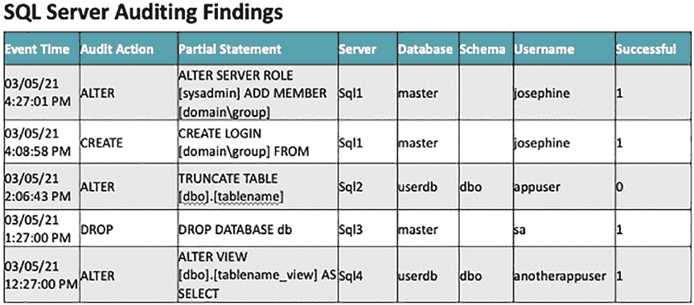

# 第 12 章 从审计数据创建报告

## 用于审计报告的 SQL Server 代理作业

`/* DON'T CHANGE ANYTHING BELOW HERE */`

`DROP TABLE IF EXISTS ##tempvariables;`

`DECLARE @sql varchar(max);`

`SET @sql = N'IF (select count(event_time)`
`FROM [Auditing].[dbo].[AuditChanges]`
`WHERE event_time > getdate()-1) > 0`
`BEGIN`
`DECLARE @tableHTML NVARCHAR(MAX) ;`
`SET @tableHTML =`
`N''<style type="text/css">`
`#box-table`
`{`
`font-family: "Lucida Sans Unicode", "Lucida Grande", Sans-Serif;`
`font-size: 12px;`
`text-align: left;`
`border: #aaa;`
`}`
`#box-table th`
`{`
`font-size: 13px;`
`font-weight: normal;`
`background: #f38630;;`
`border: 2px solid #aaa;`
`text-align: left;`
`color: #039;`
`cellpadding: 10px;`
`cellspacing: 10px;`
`}`
`#box-table td`
`{`
`border-right: 1px solid #aabcfe;`
`border-left: 1px solid #aabcfe;`
`border-bottom: 1px solid #aabcfe;`
`cellpadding: 10px;`
`cellspacing: 10px;`
`}`
`tr:nth-of-type(odd)`
`{ background-color:#aaa; color: #ccc }`
`tr:nth-of-type(even)`
`{ background-color:#ccc; color: #aaa }`
`</style>''+`
`N''<H2>SQL Server Auditing Findings</H2>'' +`
`N''<table border="1" id="box-table">'' +`
`N''<tr><th>Event Time</th><th>Partial Statement</th>'' +`
`N''<th>Server</th><th>Database</th><th>Schema</th>'' +`
`N''<th>User</th><th>Successful</th></tr>'' +`
`CAST ( (`
`SELECT td = convert(varchar, [event_time], 22), '''',`
`td = [audit_action], '''',`
`td = left([statement], 50), '''',`
`td = [server_instance_name], '''',`
`td = [database_name], '''',`
`td = [schema_name], '''',`
`td = [session_server_principal_name] '''',`
`td = [succeeded]`
`FROM [Auditing].[dbo].[AuditChanges]`
`WHERE event_time > getdate()-1`
`ORDER BY event_time ASC`
`FOR XML PATH(''tr''), TYPE) AS NVARCHAR(MAX) ) +`
`N''</table>'' ;`
`EXEC msdb.dbo.sp_send_dbmail`
`@recipients='+@mailrecipients+',`
`@subject = ''Audit Findings - Changes on Production Servers Last 24`
`Hours'',`
`@body = @tableHTML,`
`@profile_name = '+@profilename+',`
`@body_format = ''HTML'';`
`END';`
`SELECT @sql as stepsql`
`into ##tempvariables;`
`USE [msdb]`
`GO`
`BEGIN TRANSACTION`
`DECLARE @ReturnCode INT`
`SELECT @ReturnCode = 0`
`IF NOT EXISTS (SELECT name FROM msdb.dbo.syscategories WHERE`
`name=N'[Uncategorized (Local)]' AND category_class=1)`
`BEGIN`
`EXEC @ReturnCode = msdb.dbo.sp_add_category @class=N'JOB', @type=N'LOCAL',`
`@name=N'[Uncategorized (Local)]'`
`IF (@@ERROR <> 0 OR @ReturnCode <> 0) GOTO QuitWithRollback`
`END`
`DECLARE @jobId BINARY(16)`
`EXEC @ReturnCode = msdb.dbo.sp_add_job`
`@job_name=N'Audit Daily Email of Database Server Changes',`
`@enabled=1,`
`@notify_level_eventlog=0,`
`@notify_level_email=2,`
`@notify_level_netsend=0,`
`@notify_level_page=0,`
`@delete_level=0,`
`@description=N'No description available.',`
`@category_name=N'[Uncategorized (Local)]',`
`@owner_login_name=N'sa',`
`@job_id = @jobId OUTPUT`
`IF (@@ERROR <> 0 OR @ReturnCode <> 0) GOTO QuitWithRollback`
`DECLARE @stepsql varchar(max);`
`SET @stepsql = (SELECT stepsql from ##tempvariables);`
`EXEC @ReturnCode = msdb.dbo.sp_add_jobstep`
`@job_id=@jobId,`
`@step_name=N'audit findings of changed items on prod servers',`
`@step_id=1,`
`@cmdexec_success_code=0,`
`@on_success_action=1,`
`@on_success_step_id=0,`
`@on_fail_action=2,`
`@on_fail_step_id=0,`
`@retry_attempts=0,`
`@retry_interval=0,`
`@os_run_priority=0,`
`@subsystem=N'TSQL',`
`@command=@stepsql,`
`@database_name=N'master',`
`@flags=0`
`IF (@@ERROR <> 0 OR @ReturnCode <> 0) GOTO QuitWithRollback`
`EXEC @ReturnCode = msdb.dbo.sp_update_job @job_id = @jobId, @start_step_id = 1`
`IF (@@ERROR <> 0 OR @ReturnCode <> 0) GOTO QuitWithRollback`
`EXEC @ReturnCode = msdb.dbo.sp_add_jobschedule @job_id=@jobId,`
`@name=N'daily 11am auditing findings',`
`@enabled=1,`
`@freq_type=4,`
`@freq_interval=1,`
`@freq_subday_type=1,`
`@freq_subday_interval=0,`
`@freq_relative_interval=0,`
`@freq_recurrence_factor=0,`
`@active_start_date=20190812,`
`@active_end_date=99991231,`
`@active_start_time=110000,`
`@active_end_time=235959,`
`@schedule_uid=N'8ed67b50-2fa6-4683-a714-9c4518fc1453'`
`IF (@@ERROR <> 0 OR @ReturnCode <> 0) GOTO QuitWithRollback`
`EXEC @ReturnCode = msdb.dbo.sp_add_jobserver @job_id = @jobId, @server_name = N'(local)'`
`IF (@@ERROR <> 0 OR @ReturnCode <> 0) GOTO QuitWithRollback`
`COMMIT TRANSACTION`
`GOTO EndSave`
`QuitWithRollback:`
`IF (@@TRANCOUNT > 0) ROLLBACK TRANSACTION`
`EndSave:`
`GO`

## 使用说明与注意事项

对于清单 12-4 中的脚本，有以下几点需要注意或需要更新：

*   通过电子邮件发送的 SQL 语句将仅包含前 50 个字符。否则，HTML 格式将无法正常工作。完整的语句存储在数据库中，以供需要时参考。
*   更新脚本顶部的变量：
    *   `@profilename` – 这是你的数据库邮件配置文件的名称。
    *   `@mailrecipients` – 这将是接收此审计报告电子邮件的人员。



电子邮件将类似于图 12-1 中的表格。具体结果将根据数据库服务器上发生的情况而有所不同。

*图 12-1. SQL Server 代理作业审计报告示例*

#### 使用 PowerShell 生成 HTML 报告

如果你想用审计查询结果创建 HTML 文件。你可以改用 PowerShell。清单 12-5 提供了一个 PowerShell 脚本示例。此脚本将捕获过去七天的所有审计数据。

*清单 12-5. 使用 PowerShell 通过电子邮件创建并发送 HTML 文档*

```powershell
# 将这些变量更新为你的值
$OutputFile = "E:\powershell\sqlserverauditfindings.html"
$CentralServerName = "yourcentralserver"
$SendEmailFrom = "youremail@domain.com"
$SendEmailTo = "recipient@domain.com"
$SMTPServer = "smtp.domain.com"
$EmailSubject = "审计结果 - 过去 7 天 SQL Server 生产服务器上的变更"

# 请勿更改下方任何内容
$Header = @"
<style>
TABLE {border-width: 1px; border-style: solid; border-color: black; border-collapse: collapse;}
TD {border-width: 1px; padding: 3px; border-style: solid; border-color: black;}
TH {border-width: 1px; padding: 3px; border-style: solid; border-color: black; text-align: left;}
BODY {width:800px;}
td:nth-child(2) {max-width: 400px;}
</style>
"@

# 如果由于某种原因文件仍然存在（来自之前的运行），则将其删除
if (Test-Path $OutputFile){ Remove-Item -Path $OutputFile -Force}

# 确保查询至少返回一行
$querycount = Invoke-Sqlcmd -Query "SELECT count(event_time) as count FROM [Auditing].[dbo].[AuditChanges] a WHERE event_time > getdate()-7" -ServerInstance $CentralServerName

# 如果至少有一行，则查询审计数据并创建 HTML 文件
if($querycount.count -gt 0) {
    #查询过去 7 天的审计事件并转换为 html 文件
    Invoke-Sqlcmd -Query "SELECT convert(varchar, MAX([event_time]), 22) as event_time, [audit_action], [succeeded], [statement], [server_instance_name], [database_name],[schema_name], [session_server_principal_name] FROM [Auditing].[dbo].[AuditChanges] a WHERE event_time > getdate()-7 GROUP BY [audit_action], [succeeded], [statement], [server_instance_name], [database_name], [schema_name], [session_server_principal_name] ORDER BY server_instance_name, database_name, schema_name, session_server_principal_name DESC" `
    -ServerInstance $CentralServerName | ConvertTo-HTML `
    -Head $Header `
    -Property event_time,audit_action,succeeded,statement,server_instance_name,database_name,schema_name,session_server_principal_name,name_in_ad `
    | Out-File $OutputFile -Encoding utf8

    # 通过电子邮件发送文件
    Send-MailMessage -From $SendEmailFrom `
    -To $SendEmailTo `
    -Subject $EmailSubject `
    -Attachments $OutputFile `
    -SmtpServer $SMTPServer

    # 删除 HTML 文件
    Remove-Item –path $OutputFile
}
```


