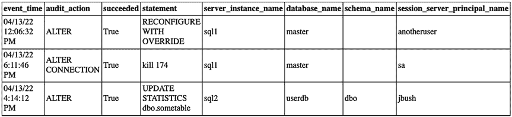
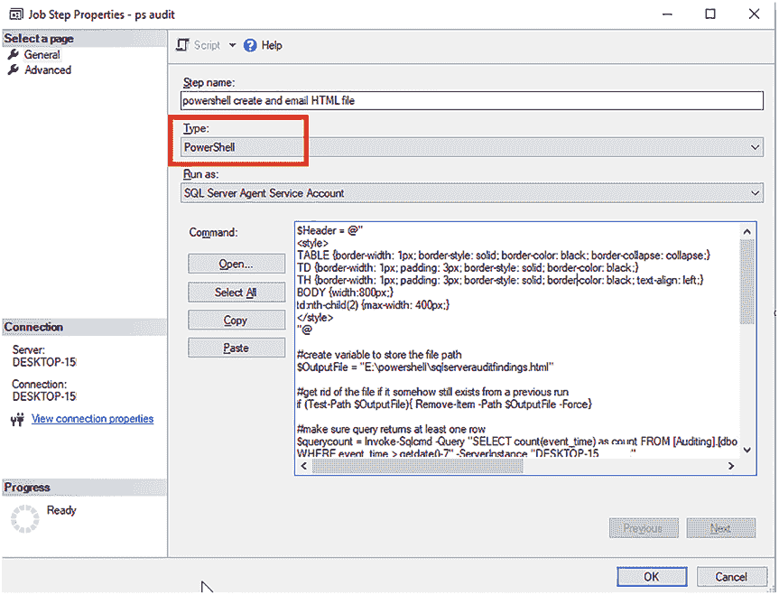

# 无审计行时，不会创建文件

```powershell
else {
    Write-Output "nothing happened bc there were zero rows"
}
```

脚本清单 12-5 中唯一需要更新的是顶部的变量：

*   `$OutputFile` – 需要设置为您服务器上的一个路径
*   `$ServerInstance` – 需要指向您的中央审计数据库服务器（在第 11 章“集中审计数据”中设置）
*   `$SendEmailFrom` – 设置为您发送邮件的邮箱地址
*   `$SendEmailTo` – 设置为您要发送到的邮箱地址
*   `$SMTPServer` – 设置为您正在使用的 SMTP 服务器
*   `$EmailSubject` – 设置为您想要的邮件主题，我已包含我惯用的主题

生成的 HTML 文件将如图 12-2 所示。您的结果可能会根据数据库服务器上发生的情况而有所不同。除非您在`$OutputFile`变量中更改它，否则文件将被命名为`sqlserverauditfindings.html`。


*图 12-2. PowerShell HTML 文件示例*

通过电子邮件发送审计结果，可以轻松掌握数据库服务器上发生的变化。以下是我设定的审计报告发送计划：

*   **SQL Server 代理作业计划** – 每日发送电子邮件，包含过去 24 小时的审计结果和部分 SQL 语句
*   **PowerShell 计划** – 每周向我们的工单系统发送一封邮件，附件为 HTML 文件，包含过去七天的审计结果和完整的 SQL 语句

您可以使用 SQL Server 代理作业来安排 PowerShell 脚本的执行。图 12-3 展示了 PowerShell 代理作业步骤的样子。请确保类型选择为 PowerShell。


*图 12-3. PowerShell 代理作业步骤*

**提示** 要了解更多关于创建 PowerShell 作业步骤的信息，请访问：
[`docs.microsoft.com/en-us/sql/powershell/run-windows-powershell-steps-in-sql-server-agent?view=sql-server-ver15#PShellJob`](https://docs.microsoft.com/en-us/sql/powershell/run-windows-powershell-steps-in-sql-server-agent?view=sql-server-ver15#PShellJob)

在下一章中，您将学习如何审核 Azure SQL 数据库，以及如何在 Azure 中集中和报告审计数据。

