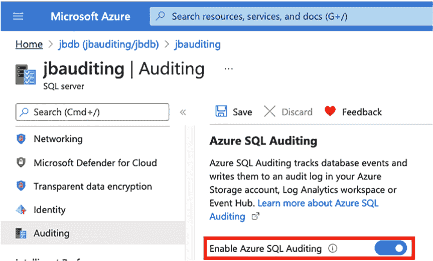

# 第 13 章 审核 Azure SQL 数据库

本章将向您展示如何审核 Azure SQL 数据库。在某些方面，它与 SQL Server 审核非常相似，而在其他方面则存在显著差异。

表 13-1 对 Azure 审核与 SQL Server 审核进行了高层比较。
*表 13-1. SQL Server 与 Azure SQL 审核对比*

| 云解决方案 | SQL Server 审核 | 扩展事件 | 审核差异 |
| :--- | :--- | :--- | :--- |
| **SQL Server VM** | 是 | 是 | 与本地使用 SQL Server 相同 |
| **Azure SQL 数据库** | 否 | 是 | Azure 门户中提供等效的 SQL 审核功能 |

请阅读本书前面章节，以获取更多关于在虚拟机上使用 SQL Server 审核和扩展事件的指导。

#### 通过门户审核 Azure SQL 数据库

要审核 Azure SQL 数据库，您需要导航到 Azure 门户：[`portal.azure.com`](https://portal.azure.com)。审核功能已内置在门户中。

您可以选择在服务器级别或数据库级别审核数据库。如果启用服务器级审核，将审核该服务器下的所有数据库。如果启用数据库级审核，则仅审核指定的那个数据库。请勿在服务器和数据库上同时启用审核。

© Josephine Bush 2022

J. Bush, *Microsoft SQL Server 与 Azure SQL 实用数据库审计*,

[`doi.org/10.1007/978-1-4842-8634-0_13`](https://doi.org/10.1007/978-1-4842-8634-0_13#DOI)

