# 第 13 章 审计 Azure SQL 数据库

你可以在服务器级别和数据库级别启用审计。这将导致审计数据重复。我在服务器级别启用它，因为我希望查看所有数据库的审计数据。

**注意** 审计功能在特定的定价层中可用。

默认情况下，Azure 审计将捕获 Azure SQL 数据库上发生的所有活动。这可能会产生大量审计数据。我将向你展示如何修改默认策略。这样，你就可以指定哪些操作需要审计，哪些不需要。首先，让我们看看如何启用审计。

## 启用与配置审计

图 13-1 展示了如何在服务器级别启用审计。要访问审计页面，你需要导航到数据库所在的 SQL Server，然后在页面左侧的菜单中点击“Auditing”。

***图 13-1.** 在 Azure SQL 中启用服务器级别审计*

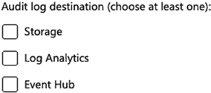

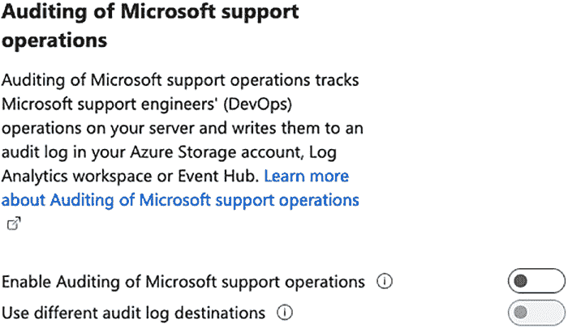

进入审计页面后，你会看到一个单选按钮。它默认设置为“关闭”，你需要将其打开以启用审计，如图 13-1 所示。

如图 13-2 所示，你将看到多个用于存储审计数据的位置选项。

***图 13-2.** Azure SQL 审计的日志存储目标*

你可以选择一个或多个选项来存储审计数据。如果将审计数据存储在多个位置，你将需要为这些位置的重复数据付费。我建议你选择最喜欢的一个。

你还可以审计 Microsoft 支持操作，如图 13-3 所示。

***图 13-3.** 审计 Microsoft 支持操作*

你可以选择启用此功能，并将其与其他审计数据存储在相同或不同的位置。我倾向于启用它并与审计数据存储在同一位置，以便在一个地方轻松查询所有内容。

对于审计日志目标，你有三种选择：

*   **存储** – 这指的是一个存储账户。你的文件将以 `.xel` 格式存储在一个文件夹结构中。更多信息，请访问 [`docs.microsoft.com/zh-cn/azure/azure-sql/database/auditing-overview?view=azuresql#audit-storage-destination`](https://docs.microsoft.com/zh-cn/azure/azure-sql/database/auditing-overview?view=azuresql#audit-storage-destination)。
*   **Log Analytics** – 此选项将所有审计数据存储在 Log Analytics 工作区中，你可以使用 Kusto 查询语言 (`Kusto`) 进行查询。
*   **事件中心** – 你需要设置一个流来消费事件并将其写入目标。它们使用 JSON 格式存储。更多信息，请访问 [`docs.microsoft.com/zh-cn/azure/azure-sql/database/auditing-overview?view=azuresql#audit-event-hub-destination`](https://docs.microsoft.com/zh-cn/azure/azure-sql/database/auditing-overview?view=azuresql#audit-event-hub-destination)。

我最喜欢的是 Log Analytics，起初它可能看起来不是最简单的选择，因为你必须学习 `Kusto`，但如果你已经了解 `SQL`，那么 `Kusto` 很容易学会。此外，它使得集中化审计数据和生成报告变得容易。这是因为你可以将大部分（如果不是全部）审计数据存储在同一个 Log Analytics 工作区中。


在开始选择审计日志目标之前，您需要设置一个 Log Analytics 工作区。在 Azure 门户中，搜索 Log Analytics 工作区。创建一个工作区，最好位于您的 Azure SQL 数据库所在区域。如果还有辅助数据库，请选择大多数主数据库所在的区域。

`Tip` 有关如何创建 Log Analytics 工作区，请访问 [`docs.microsoft.com/en-us/azure/azure-monitor/logs/quick-create-workspace`](https://docs.microsoft.com/en-us/azure/azure-monitor/logs/quick-create-workspace)。

创建 Log Analytics 工作区后，设置数据保留期非常重要。您可以通过在工作区中单击“使用情况和预估成本”，然后单击“数据保留”来完成此操作，如图 13-4 所示。

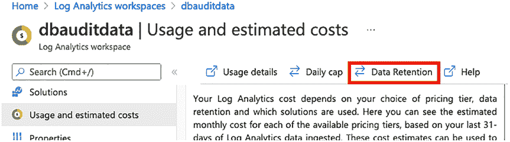

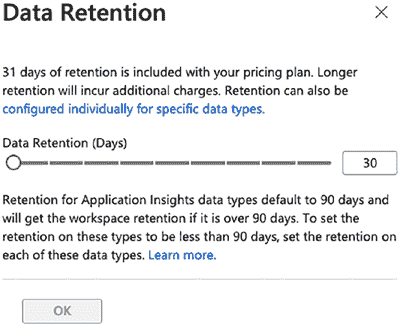

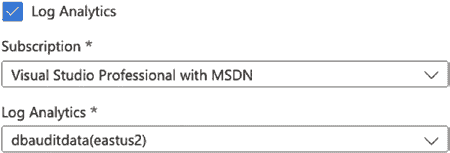

第 13 章 审核 Azure SQL 数据库

***图 13-4.** 访问数据保留设置*

默认情况下，您的定价计划中包含 31 天的保留期，如图 13-5 所示。您可以选择将文件保留最多 730 天，但需要额外付费。我保留默认的 31 天。我不需要超过此期限的审计数据，并且我会每天报告它，因此在 31 天过去之前我就能看到它。

***图 13-5.** 数据保留设置*

返回服务器审核选项，选择 `Log Analytics`，然后选择您的订阅和工作区，如图 13-6 所示。

***图 13-6.** 为 Azure SQL 审核选择 Log Analytics 工作区*

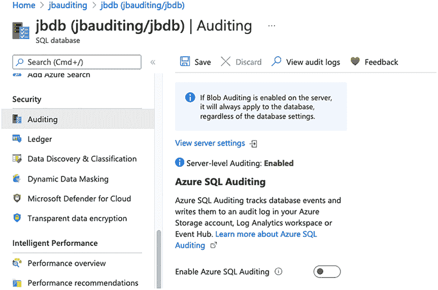

第 13 章 审核 Azure SQL 数据库

选择 Log Analytics 工作区后，单击页面顶部的 `Save`。

`Note` 有时，审计数据写入 Log Analytics 工作区的速度很快，有时，我见过 Kusto 查询会出错一段时间。如果看到错误，请等待一段时间，或尝试禁用并重新启用审核。

如果您只想审核一个 Azure SQL 数据库，可以在数据库级别启用它。导航到数据库，然后选择“审核”选项。这将显示一个页面，用于在数据库级别启用审核。它还会显示服务器审核是否已启用，如图 13-7 所示。

***图 13-7.** 启用数据库级别审核*

如果已启用服务器级别的审核，请不要在数据库级别启用它。如果您想在数据库上审核不同的内容或将其存储在不同的位置，则可以在数据库级别开启它。不过，您可能仍然会得到重复的审计数据，因此使用此选项时要谨慎。

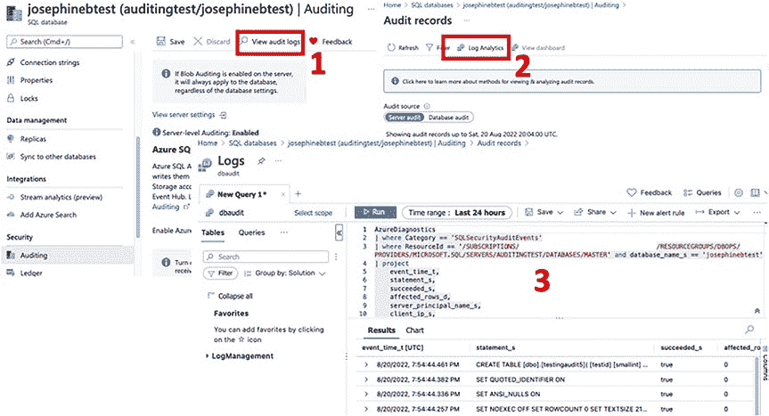

第 13 章 审核 Azure SQL 数据库

**`查看审计数据`**

有两种方法可以在 Log Analytics 工作区中查看审计数据。您可以进入每个数据库，然后按照图 13-8 中的步骤单击“审核”页面。

`Tip` 您需要先触发事件才能进行审核。由于您在上一节中开启了审核，它将审核发生的所有事情。您可以使用 `SSMS` 或 `Azure Data Studio` 登录到 SQL 数据库，这些事件将被审核。

***图 13-8.** 从 Azure SQL 数据库访问审核日志*

`Note` 审核数据可能需要一段时间才会出现在您的 Log Analytics 工作区中。如果您没有立即看到审计数据，请记住这一点。可能需要一个小时以上，在此时间段内，它可能没有捕获任何可审核的事件。

您还可以转到 Log Analytics 工作区查看审核日志。这是一个更好的选择，因为这里有摘要和一种深入探究数据的简便方法。导航到您的 Log Analytics 工作区，然后单击“工作区摘要”，如图 13-9 所示。

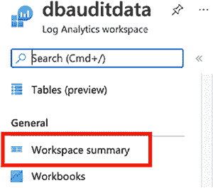

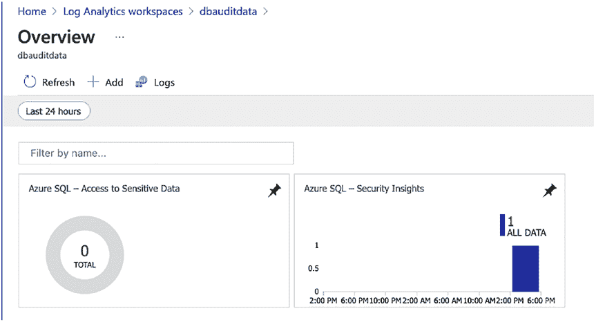


## 第 13 章 审计 Azure SQL 数据库

**图 13-9.** Log Analytics 导航至工作区摘要

进入工作区摘要页面后，你将看到几个选项，例如 **Azure SQL – 访问敏感数据** 和 **Azure SQL – 安全见解**，如图 13-10 所示。

**图 13-10.** Log Analytics 工作区摘要选项

为简化起见，我建议在此工作区中仅存储 Azure SQL 审计数据。点击 **Azure SQL – 安全见解** 框。

这将为你提供 Log Analytics 工作区中审计数据的仪表板视图，如图 13-11 所示。

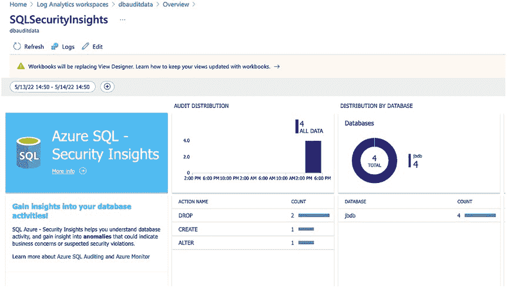

**图 13-11.** Log Analytics 的 SQLSecurityInsights

你将看到许多审计数据类别：

*   **审计分布** – 显示已采取的审计操作以及每个操作的计数
*   **按数据库分布** – 显示哪些数据库有审计操作以及每个数据库的操作计数
*   **按 IP 分布** – 显示哪些 IP 地址有审计操作以及每个 IP 地址的操作计数
*   **按主体分布** – 显示哪些主体有审计操作以及每个主体的操作计数
*   **按成功状态分布** – 显示成功和失败的审计操作计数

你可以点击这些框中的任何一个以深入了解更多信息。这将带你到一个预先为你填充了 Kusto 查询的屏幕。这为你提供了关于每个类别的良好信息。要整体查询审计数据，我建议点击页面顶部附近的 **日志** 按钮，如图 13-12 所示。

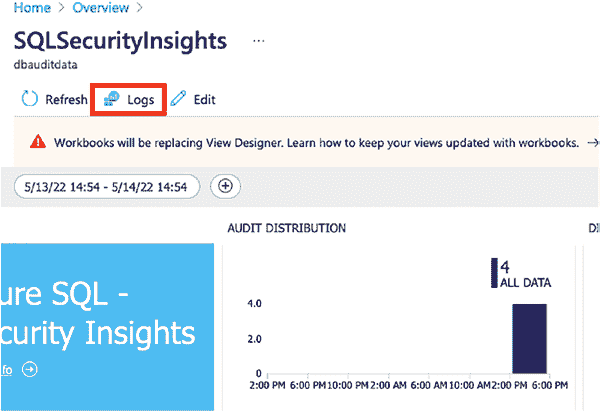

**图 13-12.** Log Analytics SQLSecurityInsights 的“日志”按钮

点击“日志”后，你将看到一个包含建议查询的页面。你可以关闭它，因为那些查询都无法帮助你查询审计数据。

使用清单 13-1 中的 Kusto 查询来获取你的审计数据。

**清单 13-1.** Log Analytics Kusto 查询

```
AzureDiagnostics
| where Category == 'SQLSecurityAuditEvents'
    and TimeGenerated > ago(1d)
| project
    event_time_t,
    database_name_s,
    statement_s,
    server_principal_name_s,
    succeeded_s,
    client_ip_s,
    application_name_s,
    additional_information_s,
    data_sensitivity_information_s
| order by event_time_t desc
```

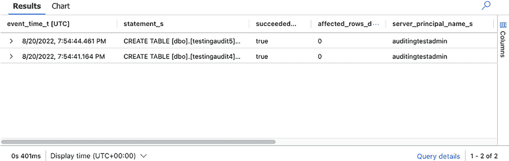

**提示** 关于 Kusto 的更多信息，请访问 [Kusto 查询语言概述](https://docs.microsoft.com/en-us/azure/data-explorer/kusto/query/)

Kusto 查询将返回如图 13-13 所示的结果。结果将取决于你的被审计系统上发生的情况。

**图 13-13.** Log Analytics Kusto 查询结果

虽然我不推荐在 SQL Server 审计中这样做，但我建议在审计数据被捕获到你的 Log Analytics 工作区之后，使用 Kusto 查询进行筛选。这是因为 Azure 中的审计功能不允许你在收集数据之前进行筛选。例如，你可能只想在审计中查看特定用户的操作。你可以通过添加另一个 `where` 子句来使用 Kusto 进行筛选，例如 `and server_principal_name_s == 'josephine'`。

清单 13-2 展示了一个带有该筛选器的 Kusto 查询示例。

**清单 13-2.** 带有附加筛选器的 Kusto 查询

```
AzureDiagnostics
| where Category == 'SQLSecurityAuditEvents'
    and TimeGenerated > ago(1d)
    and server_principal_name_s == 'josephine'
| project
    event_time_t,
    database_name_s,
    statement_s,
    server_principal_name_s,
    succeeded_s,
    client_ip_s,
    application_name_s,
    additional_information_s,
    data_sensitivity_information_s
| order by event_time_t desc
```

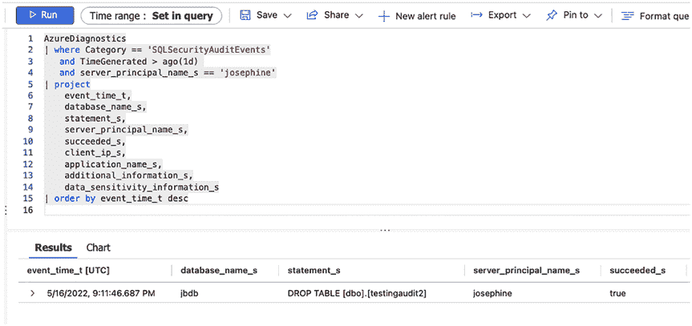


