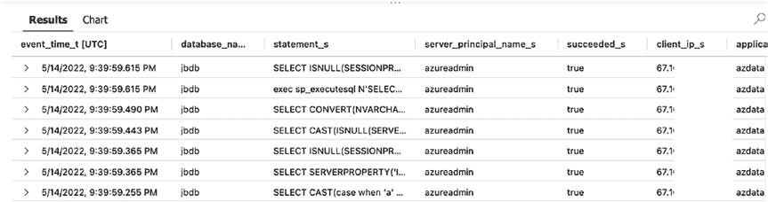
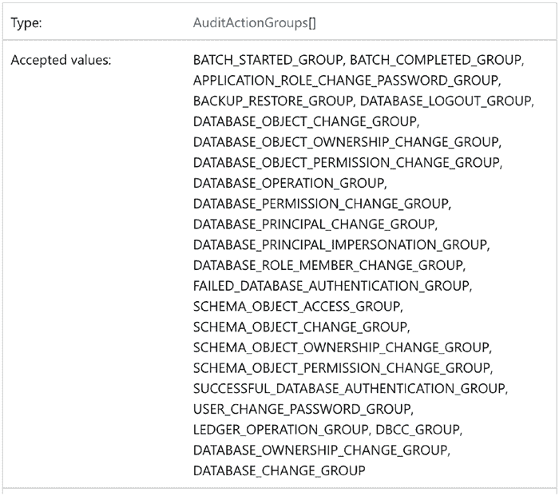
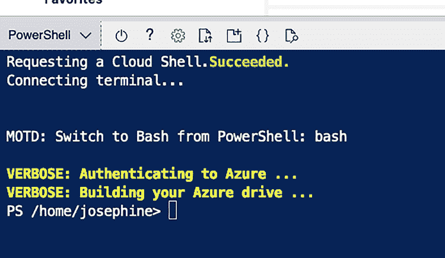
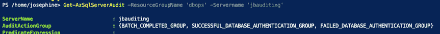
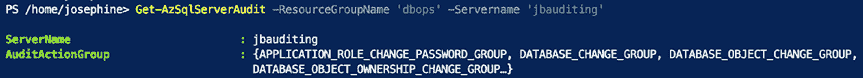
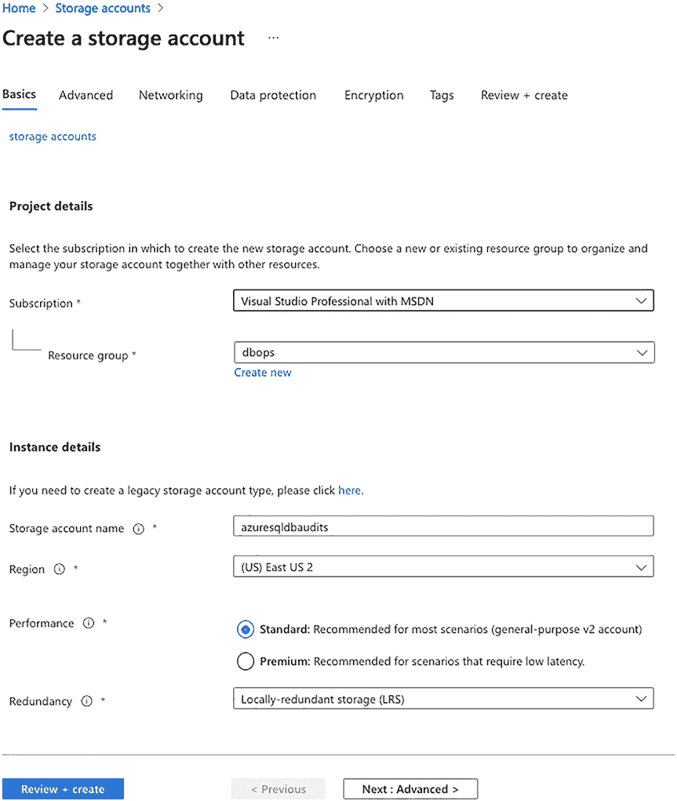
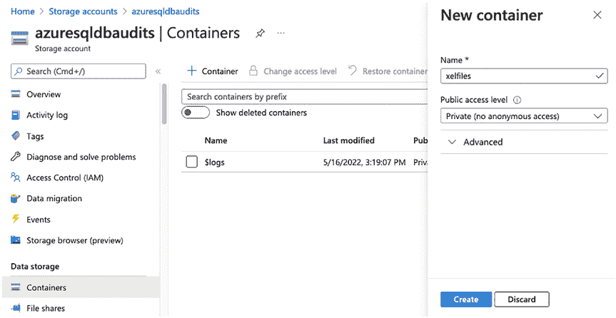

# 第 13 章 审计 Azure SQL 数据库

现在你只能看到该用户执行的操作，如图 13-14 所示。

**图 13-14。** 带附加过滤器的 Kusto 查询结果

#### 修改 Azure SQL 数据库审计设置

你在图 13-13 中看到的结果之所以如此，是因为我修改了默认的审计策略。否则，你会得到海量的审计数据，很难从中筛选出你想看或需要看的内容。使用默认审计设置时，你看到的内容会更像图 13-15。



**图 13-15。** 未经过滤的审计结果

请注意，在图 13-15 中，审计到的语句要多得多。我们希望在数据写入审计日志之前就进行过滤。

默认情况下，所有 Azure SQL 数据库都会启用以下审计操作组：
*   `BATCH_COMPLETED_GROUP`
*   `SUCCESSFUL_DATABASE_AUTHENTICATION_GROUP`
*   `FAILED_DATABASE_AUTHENTICATION_GROUP`

这些审计操作组将审计针对数据库执行的所有查询和存储过程，以及所有成功和失败的登录尝试。正如你所想的，这会产生大量的审计数据。我主要关注的是架构或权限等方面的更改。若要仅捕获这些更改，你需要将默认审计策略更改为使用不同的审计操作组。

如果你熟悉 SQL Server 审计，其中一些审计操作组是相同的，但有些则不同。图 13-16 展示了 Azure 中审计操作组的可接受值。




**图 13-16。** Azure 中的审计操作组

#### 获取和设置审计策略

我们来看看可以用来查看和更改审计策略的 PowerShell 命令：
*   `Get-AZSqlServerAudit` – 此命令用于查看当前策略。
*   `Set-AZSqlServerAudit` – 此命令用于更改当前策略。

要使用这些 PowerShell 命令，你需要 Azure CLI。在 Azure 门户中，点击页面右上角附近的 Cloud Shell 按钮，如图 13-17 所示。

**图 13-17。** 访问 Cloud Shell



**提示** 要了解更多关于在 Azure CLI 中使用 PowerShell 的信息，请[访问 https://docs.microsoft.com/zh-cn/azure/cloud-shell/quickstart-powershell](https://docs.microsoft.com/zh-cn/azure/cloud-shell/quickstart-powershell)。

在浏览器底部会显示一个类似图 13-18 的框。请确保你使用的是 PowerShell，而不是 Bash。

**图 13-18。** 使用 PowerShell 的 Cloud Shell

要获取审计策略，你需要指定 `ResourceGroupName` 和 `Servername`，如清单 13-3 所示。

**清单 13-3。** 获取当前审计策略

```
Get-AzSqlServerAudit -ResourceGroupName 'yourresourcegroup' -Servername 'yourservername'
```

请务必将变量更改为你的 Azure 账户中正确的资源组和服务器名称。

图 13-19 显示了在你的 Azure 门户中执行 `Get-AzSqlServerAudit` 命令的结果。



**图 13-19。** 获取当前审计策略的结果

此数据库服务器上仍应用着默认的审计策略。我建议更改策略，仅捕获以下操作以减少审计数据量：
*   `APPLICATION_ROLE_CHANGE_PASSWORD_GROUP`
*   `DATABASE_CHANGE_GROUP`
*   `DATABASE_OBJECT_CHANGE_GROUP`
*   `DATABASE_OBJECT_OWNERSHIP_CHANGE_GROUP`
*   `DATABASE_OBJECT_PERMISSION_CHANGE_GROUP`
*   `DATABASE_OWNERSHIP_CHANGE_GROUP`
*   `DATABASE_PERMISSION_CHANGE_GROUP`
*   `DATABASE_PRINCIPAL_CHANGE_GROUP`
*   `DATABASE_PRINCIPAL_IMPERSONATION_GROUP`
*   `DATABASE_ROLE_MEMBER_CHANGE_GROUP`
*   `SCHEMA_OBJECT_CHANGE_GROUP`


## 第 13 章 审计 Azure SQL 数据库

### 数据库级别的审计操作组

-   `SCHEMA_OBJECT_OWNERSHIP_CHANGE_GROUP`
-   `SCHEMA_OBJECT_PERMISSION_CHANGE_GROUP`
-   `USER_CHANGE_PASSWORD_GROUP`

**提示** 要获取有关这些审计操作组的更多信息，[请访问 https://docs.microsoft.com/en-us/sql/relational-databases/security/auditing/sql-server-audit-action-groups-and-actions?view=sql-server-ver15#database-level-audit-action-groups](https://docs.microsoft.com/en-us/sql/relational-databases/security/auditing/sql-server-audit-action-groups-and-actions?view=sql-server-ver15#database-level-audit-action-groups)

这些审计操作将捕获架构和安全性的更改。要使用这些审计操作，您需要执行清单 13-4. 中的脚本。



### 清单 13-4. 修改审计策略

```powershell
Set-AzSqlServerAudit -ResourceGroupName 'yourresourcegroup' -Servername 'yourservername' -AuditActionGroup APPLICATION_ROLE_CHANGE_PASSWORD_GROUP, DATABASE_CHANGE_GROUP, DATABASE_OBJECT_CHANGE_GROUP, DATABASE_OBJECT_OWNERSHIP_CHANGE_GROUP, DATABASE_OBJECT_PERMISSION_CHANGE_GROUP, DATABASE_OWNERSHIP_CHANGE_GROUP, DATABASE_PERMISSION_CHANGE_GROUP, DATABASE_PRINCIPAL_CHANGE_GROUP, DATABASE_PRINCIPAL_IMPERSONATION_GROUP, DATABASE_ROLE_MEMBER_CHANGE_GROUP, SCHEMA_OBJECT_CHANGE_GROUP, SCHEMA_OBJECT_OWNERSHIP_CHANGE_GROUP, SCHEMA_OBJECT_PERMISSION_CHANGE_GROUP, USER_CHANGE_PASSWORD_GROUP
```

请确保将变量更正为您 Azure 帐户中的正确资源组和服务器名称。

图 13-20 展示了修改审计策略后执行 `Set-AzSqlServerAudit` 的结果。

**图 13-20.** 修改后获取当前审计策略结果

您可以选择保留默认的审计策略。根据您希望通过审计捕获的内容，这可能对您来说是个不错的选择。我不希望看到所有发生的事情，并且认为这种修改后的策略是更好的审计方式。

#### 使用扩展事件审计 Azure SQL 数据库

审计 Azure SQL 数据库的另一种方法是使用扩展事件。您可以通过 SSMS 设置扩展事件。SQL Server 和 Azure SQL Database 上的扩展事件的主要区别在于存储位置。

##### 创建存储账户和容器

对于 Azure SQL Database，您需要将 `.xel` 文件存储在存储账户中，然后设置凭据以访问该存储账户。在 Azure 门户中，搜索存储账户。单击**创建**。此时，您需要选择以下内容：

-   **订阅** – 选择一个订阅。
-   **资源组** – 您可能希望将其放在与 SQL 数据库相同的资源组中。
-   **存储账户名称** – 必须在 Azure 中唯一。
-   **区域** – 我建议将此存储账户放在与数据库相同的区域。
-   **性能** – **标准**性能即可。
-   **冗余** – 根据审计数据对您的重要性进行选择。

单击**审阅 + 创建**。然后单击**创建**。图 13-21 展示了我所选设置的示例。



**图 13-21.** 配置存储账户



**注意** 您需要为存储账户设置生命周期管理。这可以确保您不会永远存储大量文件。


