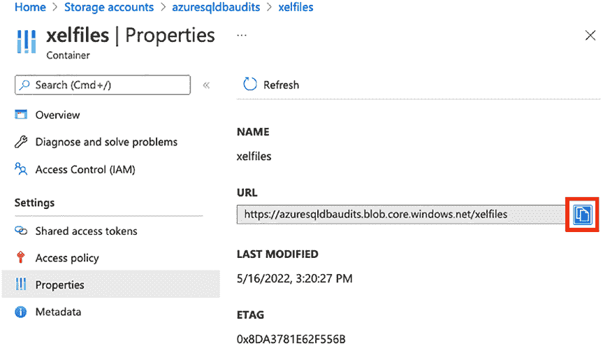
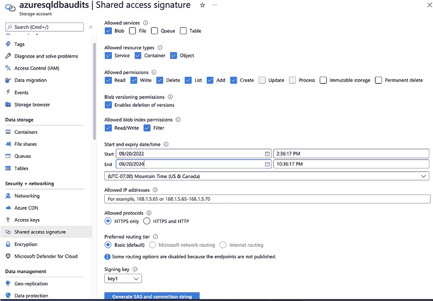
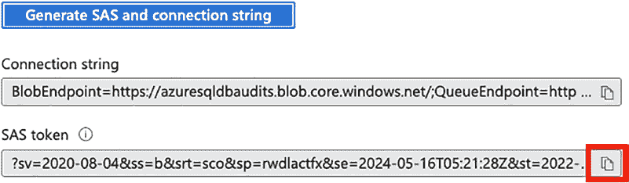

# 第 13 章 审计 Azure SQL 数据库

要了解如何执行此操作，[请访问 Azure 生命周期管理文档](https://docs.microsoft.com/en-us/azure/storage/blobs/lifecycle-management-policy-configure?tabs=azure-portal)。

## 为审计文件创建容器

创建存储账户后，您需要创建一个容器来存放审计文件。导航到存储账户并点击 `Containers`。然后点击 `+ Container` 按钮。为容器命名，并将公共访问级别保留为 `Private (no anonymous access)`。点击 `Create`。如图 13-22 所示。

**图 13-22.** 创建容器


点击 `Create` 后，您将看到列出的容器。点击该容器并选择 `Properties`。复制 URL 以供后续步骤使用，如图 13-23 所示。

**图 13-23.** 复制容器 URL


## 生成共享访问签名 (SAS)

然后导航回存储账户，点击 `Shared access signature`。请务必根据图 13-24 中的截图为此密钥创建您的设置。

**图 13-24.** 创建共享访问签名


我为共享访问签名选择的设置是：

*   **允许的服务** – `Blob`。
*   **允许的资源类型** – `Service`、`Container`、`Object`。
*   **允许的权限** – `Read`、`Write`、`Delete`、`List`、`Add`、`Create`。
*   **Blob 版本控制权限** – 允许删除版本。
*   **允许的 Blob 索引权限** – `Read/Write`、`Filter`。
*   **开始和过期日期/时间** – 如果过期，您的托管实例将无法再访问容器。您需要生成一个新的共享访问签名，然后使用新令牌更新托管实例凭据。我倾向于将过期时间设置为几年后，以避免无法访问存储账户的问题。
*   **允许的协议** – `HTTPS only`。
*   **首选路由层** – `Basic (default)`。
*   **签名密钥** – `Key 1`。

点击 `Generate SAS and connection string`。SAS 令牌将在该页面加载。请不要离开此页面。您无法再次获取该 SAS 令牌。如果需要新令牌，必须重新生成一个新的 SAS 设置。复制 SAS 令牌以供后续步骤使用，如图 13-25 所示。

**图 13-25.** 复制 SAS 令牌

**注意：** 将其添加到 SQL Server 凭据时，需要从令牌开头移除问号 (`?`)。

##### 创建数据库凭据

在 SSMS 中连接到您的 Azure SQL 数据库。您需要一个主密钥。您的数据库可能已有一个，因此如果收到错误提示主密钥已存在，您可以直接进行到清单 13-6 中的脚本。清单 13-5 中的脚本需要在要审计的数据库上执行，而不是在 `master` 数据库中。

**清单 13-5.** 创建主密钥加密
```sql
CREATE MASTER KEY ENCRYPTION
BY PASSWORD='Testing1234!';
```

您需要创建一个凭据，以便您的数据库可以访问您的存储账户，如清单 13-6 所示。这也需要在要审计的数据库上执行，而不是在 `master` 数据库中。URL 周围需要方括号。例如，`[https://whateveryourazurebloburlis]` 将是数据库范围凭据名称的正确语法。

**清单 13-6.** 创建凭据
```sql
CREATE DATABASE SCOPED CREDENTIAL [来自图 13-23 的 URL，并保留这些方括号]
WITH IDENTITY='SHARED ACCESS SIGNATURE'
,SECRET = '来自图 13-25 的令牌';
```


