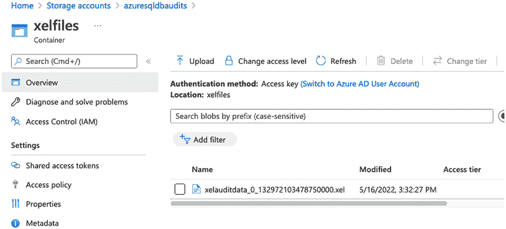
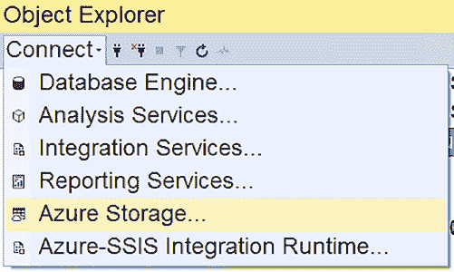
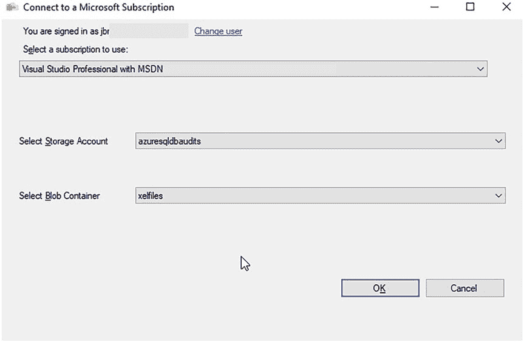
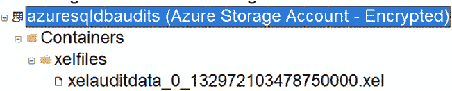
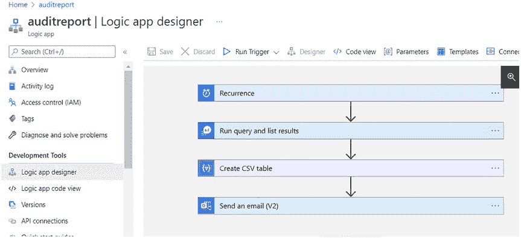
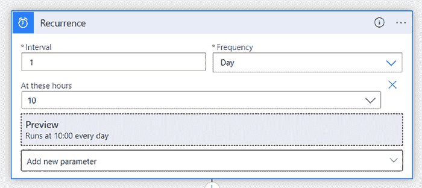
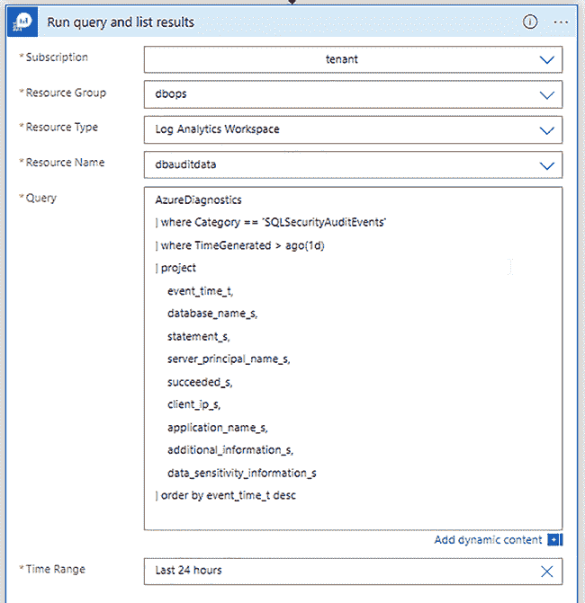
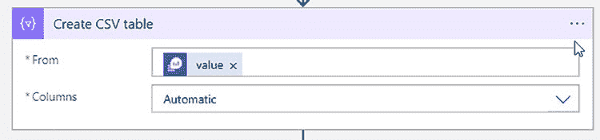
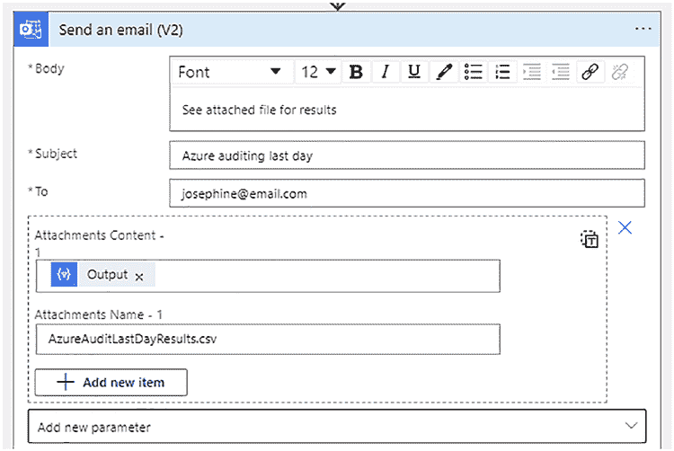

# 第 13 章 审计 Azure SQL 数据库

##### 创建扩展事件

现在，您已准备好使用清单 13-8 中的脚本来设置您的扩展事件。这也需要在您想要审计的数据库上执行，而非`master`数据库。请确保将文件名更新为图 13-23 中所示的存储帐户 URL。

**清单 13-8.** 创建扩展事件

```sql
CREATE EVENT SESSION [auditxel] ON DATABASE
ADD EVENT sqlserver.rpc_completed(
    ACTION(sqlserver.client_app_name,sqlserver.client_hostname,sqlserver.database_name,sqlserver.sql_text,sqlserver.username)
    WHERE ([sqlserver].[username]=N'josephine')
),
ADD EVENT sqlserver.sql_batch_completed(
    ACTION(sqlserver.client_app_name,sqlserver.client_hostname,sqlserver.database_name,sqlserver.sql_text,sqlserver.username)
    WHERE ([sqlserver].[username]=N'josephine')
)
ADD TARGET package0.event_file(SET filename=N'https://azuresqldbaudits.blob.core.windows.net/xelfiles/xelauditdata.xel',max_file_size=(10),max_rollover_files=(5))
WITH (MAX_MEMORY=4096 KB,EVENT_RETENTION_MODE=ALLOW_SINGLE_EVENT_LOSS,MAX_DISPATCH_LATENCY=30 SECONDS,MAX_EVENT_SIZE=0 KB,MEMORY_PARTITION_MODE=NONE,TRACK_CAUSALITY=OFF,STARTUP_STATE=ON);

ALTER EVENT SESSION [auditxel] ON DATABASE
STATE=START;
```

一旦扩展事件启动，它会在 Azure 存储帐户中放置一个文件，如图 13-26 所示。根据清单 13-6 中脚本的指定，那里将存放最多五个、每个大小为 10 MB 的文件。





**图 13-26.** Azure 存储帐户中的 .xel 文件

##### 查询扩展事件

要查询 .xel 文件，您需要知道确切的文件名。您可以使用 SSMS 中的 Azure 存储连接来查找名称，如图 13-27 所示。

**图 13-27.** Azure 存储连接

登录 Azure，并从下拉列表中选择正确的存储帐户和容器，如图 13-28 所示。





**图 13-28.** 登录 Azure 并选择存储帐户和容器

点击“确定”。这将连接到此存储帐户并列出容器中的文件，如图 13-29 所示。

**图 13-29.** 容器的文件列表

一旦您知道了文件名，就可以使用清单 13-9 中的脚本来查询它们。

**清单 13-9.** 查询 .xel 文件

```sql
SELECT
    n.value('(@timestamp)[1]', 'datetime') as timestamp,
    n.value('(action[@name="sql_text"]/value)[1]', 'nvarchar(max)') as [sql],
    n.value('(action[@name="client_hostname"]/value)[1]', 'nvarchar(50)') as [client_hostname],
    n.value('(action[@name="username"]/value)[1]', 'nvarchar(50)') as [user],
    n.value('(action[@name="database_name"]/value)[1]', 'nvarchar(50)') as [database_name],
    n.value('(action[@name="client_app_name"]/value)[1]', 'nvarchar(50)') as [client_app_name]
FROM
    (SELECT CAST(event_data as XML) as event_data
     FROM sys.fn_xe_file_target_read_file('https://azuresqldbaudits.blob.core.windows.net/xelfiles/xelauditdata_0_132972103478750000.xel', NULL, NULL, NULL)) as ed
    CROSS APPLY ed.event_data.nodes('event') as q(n)
WHERE n.value('(@timestamp)[1]', 'datetime') >= DATEADD(HOUR, -4, GETDATE())
ORDER BY timestamp DESC;
```

清单 13-7 中的查询将返回图 13-30 所示的结果。

**图 13-30.** .xel 文件结果

我不建议在 Azure SQL 数据库中使用扩展事件来审计任何您想要轻松查询和报告的内容。我建议使用 Azure SQL 审计功能，


### 第 13 章：审核 Azure SQL 数据库

#### 集中与报告 Azure SQL 审核数据

集中化就像将所有审核数据放在同一个 Log Analytics 工作区中一样简单。这便于对审核数据进行查询和报告。

为了报告数据，我使用了一个 Logic App。这样，我就可以每天发送一封包含审核捕获的任何更改的电子邮件附件。图 13-31 向您展示了 Logic App 的高层设置。

*图 13-31. 用于报告审核数据的逻辑应用*



**提示** 要了解如何创建逻辑应用，请[访问 https://docs.microsoft.com/en-us/azure/logic-apps/quickstart-create-first-logic-app-workflow](https://docs.microsoft.com/en-us/azure/logic-apps/quickstart-create-first-logic-app-workflow)。



该逻辑应用包含四个步骤。让我们逐步进行讲解。循环步骤（Recurrence）决定了此应用运行的频率，如图 13-32 所示。此逻辑应用将在 UTC 时间每天 10 点运行一次。如果您希望它在其他时区的 10 点运行，请务必考虑时区差异。

*图 13-32. 循环步骤*

运行查询并列出结果步骤（Run query and list results）运行了我在代码清单 13-1 中提到的 Kusto 查询。此步骤如图 13-33 所示。





*图 13-33. 运行查询并列出结果步骤*

创建 CSV 表步骤（Create CSV table）会将结果创建为 CSV 文件，如图 13-34 所示。CSV 的内容来自上一步。我创建 CSV 文件是因为 Kusto 查询结果不易格式化到电子邮件正文中。

*图 13-34. 创建 CSV 表步骤*



**注意** 如果您收集了大量审核数据，数据量可能过大而无法通过每日电子邮件发送。我的建议是精简您的审核内容，只保留必需项。例如，我希望看到架构或权限发生更改的时间，而不是所有无关紧要的事件。

发送电子邮件 (V2) 步骤（Send an email (V2)）允许您将 CSV 文件发送到特定的电子邮件地址，如图 13-35 所示。

*图 13-35. 发送电子邮件 (V2)*

在下一章中，您将学习如何使用 Azure SQL 托管实例进行审核。您还将学习如何集中和报告该审核数据。

### 第 14 章：审核 Azure SQL 托管实例

本章将向您展示如何审核您的 Azure SQL 托管实例。在某些情况下，它与 SQL Server 审核类似，而在其他情况下则有所不同。让我们首先从高层次比较 Azure 审核与 SQL Server 审核。

*表 14-1. SQL Server 与 Azure SQL 审核对比*

| 云解决方案 | SQL Server 审核 | 扩展事件 | 审核差异 |
| :--- | :--- | :--- | :--- |
| **SQL Server 虚拟机** | 是 | 是 | 与您在本地使用 SQL Server 时相同 |
| **Azure SQL 托管实例** | 是 | 是 | 需要使用存储账户来保存您的审核文件 |

请阅读本书前面的章节，以获取有关在虚拟机上使用 SQL Server 审核和扩展事件的更多指导。

#### 使用诊断设置审核 Azure SQL 托管实例

启用诊断设置是审核 Azure SQL 托管实例的最简单方法。如果您之前没有使用过诊断设置，则必须为您想要审核的每个服务器启用它们。

© Josephine Bush 2022
J. Bush, *Practical Database Auditing for Microsoft SQL Server and Azure SQL*,


