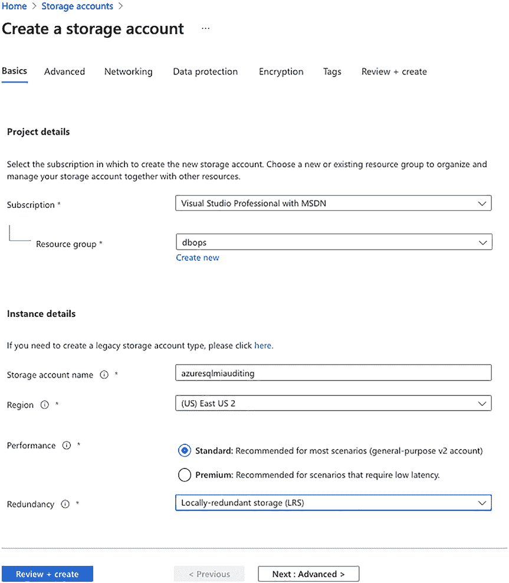
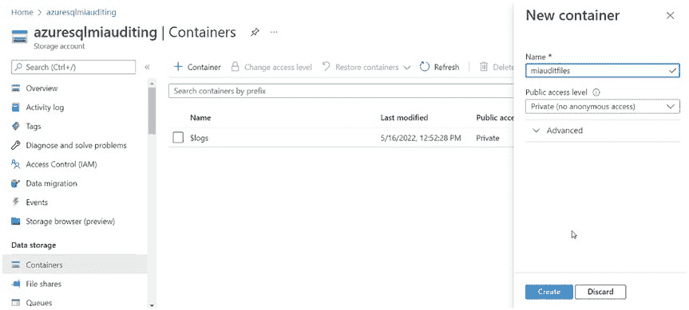
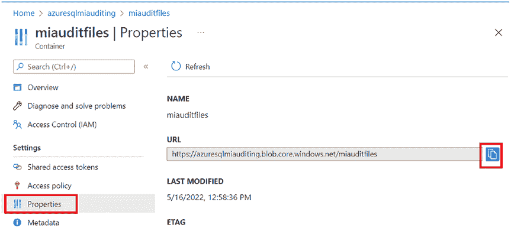
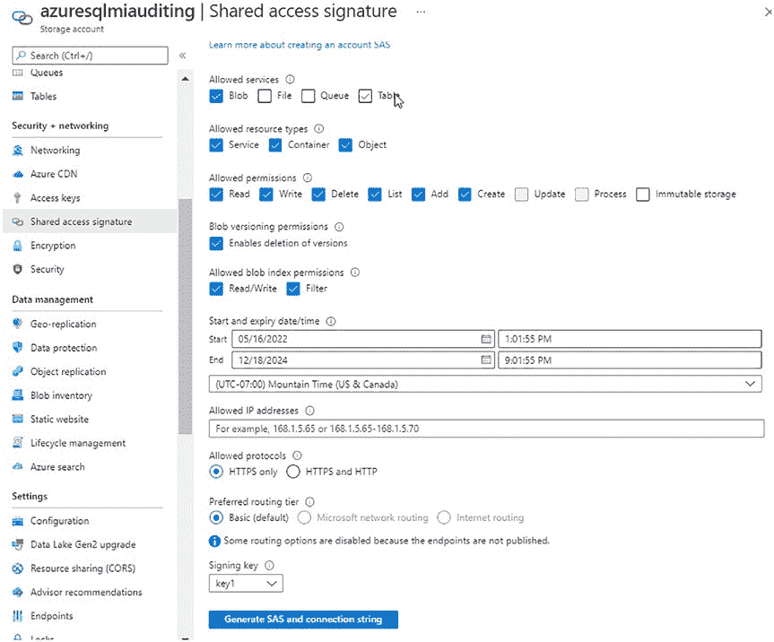

# 第 14 章 审计 Azure SQL 托管实例

## 启用并配置诊断设置

在 Azure 门户中导航到你的托管实例，然后转到“诊断设置”。你需要点击 **+ 添加诊断设置** 来添加一个诊断设置，如图 14-1 所示。

**图 14-1.** 添加诊断设置

为你的诊断设置命名，然后选择 `SQLSecurityAuditEvents`。如果你还想要审计 Microsoft 在你的托管实例上执行的操作，可以选择 `DevOpsOperationsAudit`。选择你的目标详细信息。在这个例子中，我将数据存放在一个 Log Analytics 工作区中，如图 14-2 所示。

**图 14-2.** 配置诊断设置

点击 **保存**，你将看到你的诊断设置已列出，如图 14-3 所示。

**图 14-3.** 诊断设置已保存

## 创建并配置 SQL Server 审计

配置好诊断设置后，你需要在你的托管实例上设置一个 SQL Server 审计。首先，你需要使用代码清单 14-1 中的脚本来设置审计。

**代码清单 14-1.** 设置审计
```
USE [master];
CREATE SERVER AUDIT [miaudit] TO EXTERNAL_MONITOR;
ALTER SERVER AUDIT [miaudit] WITH (STATE = ON);
```

然后，你需要使用代码清单 14-2 中的脚本创建一个与你的审计关联的服务器审计规范。

**代码清单 14-2.** 设置服务器审计规范
```
USE [master];
CREATE SERVER AUDIT SPECIFICATION [miserveraudit]
FOR SERVER AUDIT [miaudit]
ADD (DATABASE_OBJECT_ACCESS_GROUP),
ADD (SCHEMA_OBJECT_ACCESS_GROUP),
ADD (AUDIT_CHANGE_GROUP),
ADD (SERVER_OPERATION_GROUP)
WITH (STATE = ON);
```

**注意** 这些审计操作组可能会产生大量审计数据：`DATABASE_OBJECT_ACCESS_GROUP`、`SCHEMA_OBJECT_ACCESS_GROUP`、`SERVER_OPERATION_GROUP`。我使用它们作为示例，是为了确保你能看到一些审计数据产生。除非你正在仔细地过滤审计数据，否则我不建议使用它们。SQL Server 审计和过滤将在第 4 章“通过 GUI 实现 SQL Server 审计”中介绍。

##### 查询审计数据

要访问审计数据，你需要转到在诊断设置中选择的 Log Analytics 工作区，然后点击 **工作区摘要**。此摘要如图 14-4 所示。

**图 14-4.** Log Analytics 工作区摘要

**注意** 有关如何访问和使用 Log Analytics 工作区的更多信息，请回顾第 13 章“审计 Azure SQL 数据库”。

你可以点击这些框中的任何一个以深入查看更多信息。这将带你到一个预先为你填好了 Kusto 查询的屏幕。它会为你提供每个类别的详细信息。要整体查询审计数据，我建议点击页面顶部的 **日志** 按钮，如图 14-5 所示。

**图 14-5.** Log Analytics `SQLSecurityInsights` 日志按钮

点击 **日志** 后，你将看到一个包含建议查询的页面。你可以关闭它，因为那些查询都无助于你查询审计数据。使用代码清单 14-3 中的 Kusto 查询来查看你的审计数据。

**代码清单 14-3.** Log Analytics Kusto 查询
```
AzureDiagnostics
| where Category == 'SQLSecurityAuditEvents'
and TimeGenerated > ago(1d)
| project
    event_time_t,
    database_name_s,
    statement_s,
    server_principal_name_s,
    succeeded_s,
    client_ip_s,
    application_name_s,
    additional_information_s,
```


`data_sensitivity_information_s`

`| order by event_time_t desc`

**提示** 有关 Kusto 的更多信息，请[访问 https://docs.microsoft.com/en-us/azure/data-explorer/kusto/query/](https://docs.microsoft.com/en-us/azure/data-explorer/kusto/query/)。

Kusto 查询将返回如图 14-6 所示的结果。具体结果将取决于被审计系统上发生的情况。

**图 14-6.** Log Analytics Kusto 查询结果

由于我让你按照清单 14-2 的方式配置审计，审计结果将会非常多。如果你只想查看架构和权限的更改，你需要按照清单 14-4 来设置服务器审计。更多细节将在第 5 章“通过 SQL 脚本实现 SQL Server 审计”中介绍。

**清单 14-4.** SQL Server 审计

```
USE [master];

CREATE SERVER AUDIT SPECIFICATION [miserveraudit]
FOR SERVER AUDIT [miaudit]
ADD (DATABASE_OBJECT_ACCESS_GROUP),
ADD (SCHEMA_OBJECT_ACCESS_GROUP),
ADD (DATABASE_ROLE_MEMBER_CHANGE_GROUP),
ADD (SERVER_ROLE_MEMBER_CHANGE_GROUP),
ADD (AUDIT_CHANGE_GROUP),
ADD (DBCC_GROUP),
ADD (DATABASE_PERMISSION_CHANGE_GROUP),
ADD (SCHEMA_OBJECT_PERMISSION_CHANGE_GROUP),
ADD (SERVER_OBJECT_PERMISSION_CHANGE_GROUP),
ADD (SERVER_PERMISSION_CHANGE_GROUP),
ADD (DATABASE_CHANGE_GROUP),
ADD (DATABASE_OBJECT_CHANGE_GROUP),
ADD (DATABASE_PRINCIPAL_CHANGE_GROUP),
ADD (SCHEMA_OBJECT_CHANGE_GROUP),
ADD (SERVER_OBJECT_CHANGE_GROUP),
ADD (SERVER_PRINCIPAL_CHANGE_GROUP),
ADD (SERVER_OPERATION_GROUP),
ADD (APPLICATION_ROLE_CHANGE_PASSWORD_GROUP),
ADD (LOGIN_CHANGE_PASSWORD_GROUP),
ADD (SERVER_STATE_CHANGE_GROUP),
ADD (DATABASE_OWNERSHIP_CHANGE_GROUP),
ADD (SCHEMA_OBJECT_OWNERSHIP_CHANGE_GROUP),
ADD (SERVER_OBJECT_OWNERSHIP_CHANGE_GROUP),
ADD (USER_CHANGE_PASSWORD_GROUP)
WITH (STATE = ON);
```

**使用 SQL Server 审计审计 Azure SQL 托管实例**

在 Azure SQL 托管实例上使用 SQL Server 审计与在虚拟机上运行的 SQL Server 非常相似。主要区别在于存储位置。你需要使用一个存储账户来写入审计文件。除此之外，设置与 SQL Server 相同。请参阅本书前面章节中关于如何设置 SQL Server 审计的内容。

**创建存储账户和容器**

在 Azure 门户中，搜索存储账户。点击创建。此时，你需要选择：

• **订阅** – 选择一个订阅。
• **资源组** – 你可能希望将其放在与托管实例相同的资源组中。
• **存储账户名称** – 必须在 Azure 中唯一。
• **区域** – 我建议将此存储账户放在与数据库相同的区域。
• **性能** – 标准性能即可。
• **冗余** – 根据审计数据对你的重要性进行选择。

点击“查看 + 创建”。然后点击“创建”。图 14-7 显示了我所选设置的一个示例。



**图 14-7.** 创建存储账户



**注意** 你需要为你的存储账户设置生命周期管理。这将确保你不会永远存储成吨的文件。要了解如何操作，请访问 [`docs.microsoft.com/en-us/azure/storage/blobs/lifecycle-management-policy-configure?tabs=azure-portal`](https://docs.microsoft.com/en-us/azure/storage/blobs/lifecycle-management-policy-configure?tabs=azure-portal)。

创建存储账户后，你需要创建一个容器来保存


### 第 14 章：审核 Azure SQL 托管实例

## 导航到存储帐户容器

导航到你的审核文件。导航到你刚创建的存储帐户并点击 `容器`。

然后点击 **+ 容器** 按钮。为容器命名，并将 **公共访问级别** 保留为 **专用（无匿名访问）**。点击 **创建**。如图 14-8 所示。

### 图 14-8. 容器创建

点击 **创建** 后，你将看到你的容器被列出。点击该容器并选择 **属性**。复制 URL 以供后续步骤使用，如图 14-9 所示。



## 配置共享访问签名

导航回到存储帐户并点击 **共享访问签名**。请务必根据图 14-10 中的屏幕截图为此密钥创建你的设置。如果你想将此存储帐户用于审核文件的时间超过默认的八小时，你需要将过期日期设置得更长一些。



我为我的共享访问签名选择的设置是：

*   **允许的服务** – `Blob`。
*   **允许的资源类型** – `服务`、`容器`、`对象`。
*   **允许的权限** – `读取`、`写入`、`删除`、`列表`、`添加`、`创建`。
*   **Blob 版本控制权限** – 允许删除版本。
*   **允许的 Blob 索引权限** – `读取/写入`、`筛选`。
*   **开始和过期日期/时间** – 如果过期，你的托管实例将无法再访问容器。你需要生成一个新的共享访问签名。然后使用新令牌更新你的托管实例凭据。我倾向于将过期时间设置为几年后，以避免无法访问存储帐户的问题。
*   **允许的协议** – `仅 HTTPS`。
*   **首选路由层** – `基本（默认）`。
*   **签名密钥** – `密钥 1`。

点击 **生成 SAS 和连接字符串**。SAS 令牌将加载在该页面上。请不要离开此页面。你将无法再次获取该 SAS 令牌。如果需要新令牌，你必须生成一个新的 SAS 配置。复制 SAS 令牌以供后续步骤使用，如图 14-11 所示。

**注意：** 将其添加到 SQL Server 凭据时，你需要从令牌开头移除问号 (`?`)。

### 图 14-11. 复制 SAS 令牌

##### 创建数据库凭据

在 `SSMS` 中连接到你的托管实例。你需要创建一个凭据，以便你的托管实例可以访问你的存储帐户，如清单 14-5 所示。

### 清单 14-5. 在 SSMS 中创建凭据

```sql
CREATE CREDENTIAL [来自图 14-9 的 URL]
WITH IDENTITY='SHARED ACCESS SIGNATURE',
SECRET = '来自图 14-11 的令牌';
```

## 创建 SQL Server 审核

你可以使用清单 14-6 中的脚本创建你的 SQL Server 审核。

### 清单 14-6. 在 SSMS 中创建审核

```sql
CREATE SERVER AUDIT miauditstorage
TO URL
(
    PATH = '来自图 14-9 的 URL',
    RETENTION_DAYS = 30
);

ALTER SERVER AUDIT [miauditstorage] WITH (STATE = ON);
```

`RETENTION_DAYS = 30` 意味着存储帐户将仅存储 30 天的审核文件，之后它们将被删除。`0` 表示永久。我喜欢 30 天，因为这给了我足够的时间在审核数据消失前进行分析。

在你设置服务器或数据库审核之前，不会收集任何审核数据。你可以使用清单 14-7 中的脚本设置服务器审核。

### 清单 14-7. 在 SSMS 中创建服务器审核

```sql
USE [master];
CREATE SERVER AUDIT SPECIFICATION [miserverauditstorage]
FOR SERVER AUDIT [miauditstorage]
ADD (DATABASE_OBJECT_ACCESS_GROUP),
ADD (SCHEMA_OBJECT_ACCESS_GROUP),
ADD (AUDIT_CHANGE_GROUP),
ADD (SERVER_OPERATION_GROUP)
WITH (STATE = ON);
```

## 查询 SQL Server 审核文件

这开始将 `.xel` 文件写入你的 Azure 存储帐户，如图 14-12 所示。

