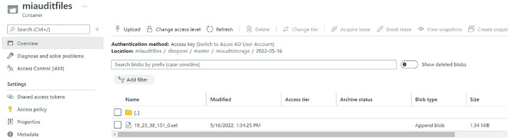
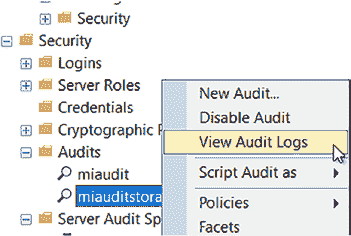
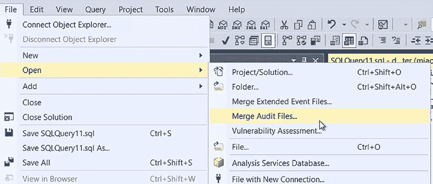
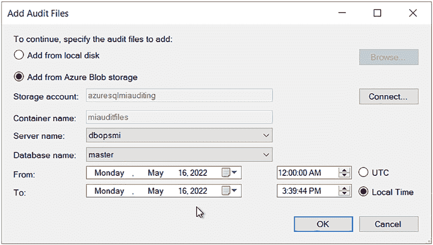
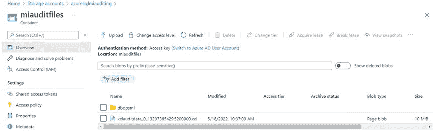
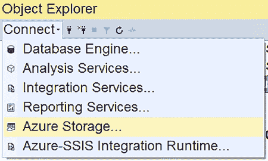
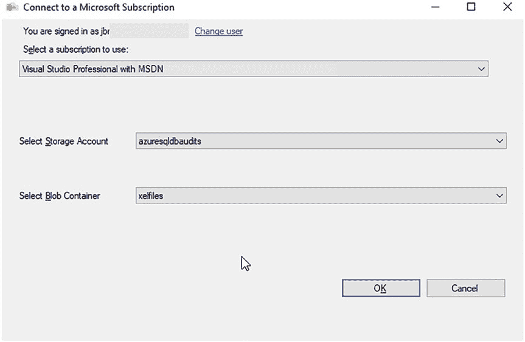

# 第 14 章：审计 Azure SQL 托管实例





**图 14-12.** Azure 存储账户中的 SQL 审计文件

您会看到它们被保存为 `.xel` 文件，而在虚拟机上的 SQL Server 中，它们会保存为 `.sqlaudit` 文件。另外，请注意文件按服务器、数据库、容器和日期组织成了文件夹结构。查询多个文件很困难，因为您必须循环遍历它们。

与虚拟机上的 SQL Server 一样，您可以右键单击审计项以查看审计日志，如图 14-13 所示。

**图 14-13.** 查看审计日志

有一种方法可以通过单击 `文件` ➤ `打开` ➤ `合并审计文件` 来合并审计文件，如图 14-14 所示。





**图 14-14.** “合并审计文件”菜单项

`合并审计文件` 将打开一个对话框。单击 `添加`。这将打开另一个对话框，您可以在其中添加您的审计文件，如图 14-15 所示。

**图 14-15.** 合并审计文件

您只能合并一个数据库的审计文件。如果您正在审计多个数据库，这可能不是很有用。这就是为什么我喜欢诊断设置，它允许您将审计数据存储在 Log Analytics 工作区中。这样便于跨多个数据库或服务器进行轻松查询。

#### 使用扩展事件审计 Azure SQL 托管实例

Azure SQL 托管实例上的扩展事件与虚拟机上的 SQL Server 非常相似。主要区别在于存储位置。您需要使用存储帐户来写入审计文件。除此之外，设置与 SQL Server 相同。有关如何设置扩展事件，请参阅本书前面的章节。

您需要创建一个存储帐户和容器来保存您的审计文件。可以使用上一节中的存储帐户、容器、容器 URL、SAS 令牌和凭据。此设置将与上一节中 SQL Server 审计的设置相同。

在创建扩展事件时，您需要在文件名中指定 URL，如代码清单 14-8 所示。

**代码清单 14-8.** 在 SSMS 中创建服务器审计

```sql
CREATE EVENT SESSION [auditxel] ON SERVER
ADD EVENT sqlserver.rpc_completed(
    ACTION(sqlserver.client_app_name, sqlserver.client_hostname, sqlserver.database_name, sqlserver.sql_text, sqlserver.username)
    WHERE ([sqlserver].[username]=N'josephine')),
ADD EVENT sqlserver.sql_batch_completed(
    ACTION(sqlserver.client_app_name, sqlserver.client_hostname, sqlserver.database_name, sqlserver.sql_text, sqlserver.username)
    WHERE ([sqlserver].[username]=N'josephine'))
ADD TARGET package0.event_file(SET filename=N'https://azuremiauditing.blob.core.windows.net/miauditfiles/xelauditdata.xel', max_file_size=(10), max_rollover_files=(5))
WITH (MAX_MEMORY=4096 KB, EVENT_RETENTION_MODE=ALLOW_SINGLE_EVENT_LOSS, MAX_DISPATCH_LATENCY=30 SECONDS, MAX_EVENT_SIZE=0 KB, MEMORY_PARTITION_MODE=NONE, TRACK_CAUSALITY=OFF, STARTUP_STATE=ON);

ALTER EVENT SESSION [auditxel] ON SERVER STATE=START;
```





请务必将 `filename` 更新为您的存储帐户和容器的路径。这应该是您为其设置了凭据的那个。有关更多详情，请参阅本章中的 SQL Server 审计部分。

一旦扩展事件启动，它将把一个文件放入 Azure 存储帐户，如图 14-16 所示。将放置五个每个最大 10 MB 的文件，因为这是代码清单 14-8 脚本中指定的。

**图 14-16.** Azure 存储账户中的 `.xel` 文件

要查询 `.xel` 文件，您需要知道确切的文件名。您可以使用 SSMS 中的 Azure 存储连接来查明名称，如图 14-17 所示。

**图 14-17.** Azure 存储连接




