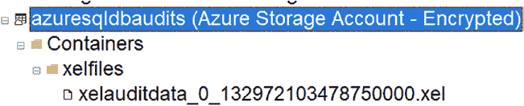
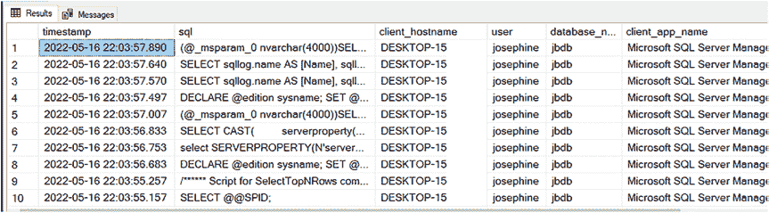
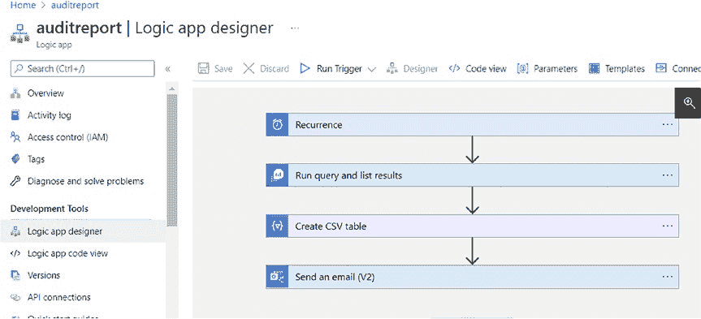
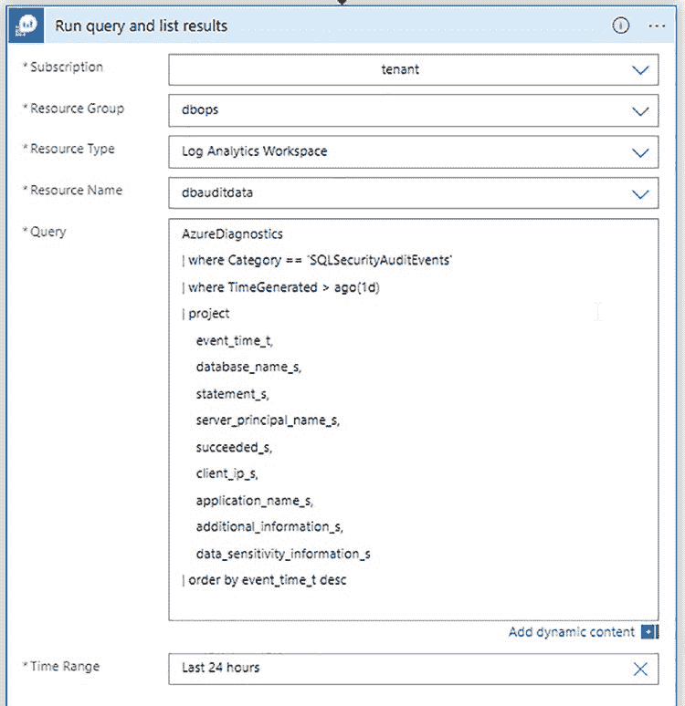
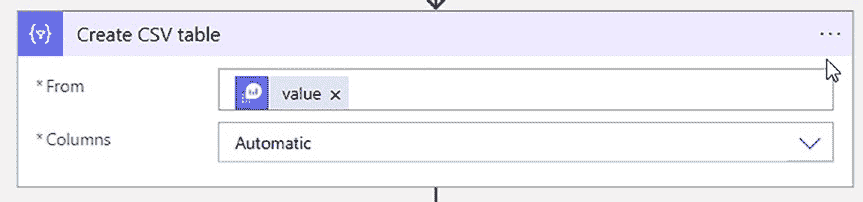
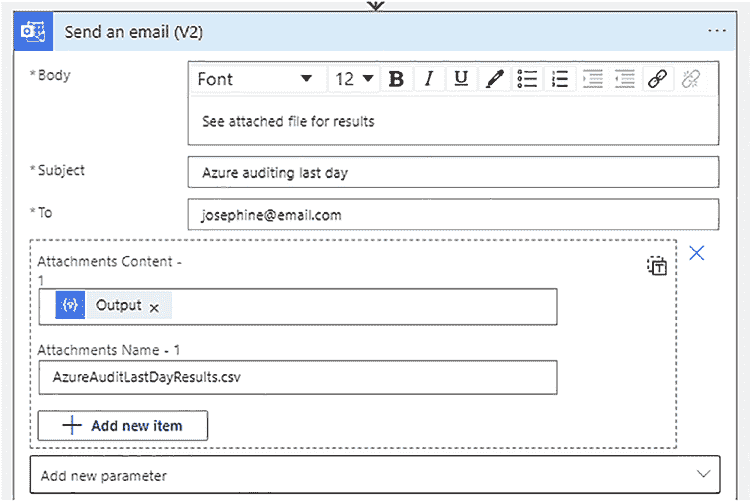

# 第 14 章 审核 Azure SQL 托管实例



登录 Azure，并从下拉菜单中选择正确的存储帐户和容器，如图 14-18 所示。

**图 14-18.** 登录 Azure 并选择存储帐户和容器

点击"确定"。这会将你连接到该存储帐户，并列出容器中的文件，如图 14-19 所示。

**图 14-19.** 容器文件列表



一旦知道文件名，你就可以使用列表 14-9 中的脚本进行查询。

**列表 14-9.** 查询 .xel 文件

```sql
SELECT n.value('(@timestamp)[1]', 'datetime') as timestamp,
    n.value('(action[@name="sql_text"]/value)[1]', 'nvarchar(max)') as [sql],
    n.value('(action[@name="client_hostname"]/value)[1]', 'nvarchar(50)') as [client_hostname],
    n.value('(action[@name="username"]/value)[1]', 'nvarchar(50)') as [user],
    n.value('(action[@name="database_name"]/value)[1]', 'nvarchar(50)') as [database_name],
    n.value('(action[@name="client_app_name"]/value)[1]', 'nvarchar(50)') as [client_app_name]
FROM (SELECT CAST(event_data as XML) as event_data
      FROM sys.fn_xe_file_target_read_file(N'https://azuremiauditing.blob.core.windows.net/miauditfiles/xelauditdata_0_132972103478750000.xel', NULL, NULL, NULL)) ed
CROSS APPLY ed.event_data.nodes('event') as q(n)
WHERE n.value('(@timestamp)[1]', 'datetime')
    >= DATEADD(HOUR, -4, GETDATE())
ORDER BY timestamp DESC;
```

列表 14-9 中的查询将返回类似图 14-20 的结果。

**图 14-20.** .xel 文件查询结果



查询 `.xel` 文件很困难，因为你需要知道确切的文件名。你无法轻松地同时查询多个 `.xel` 文件。这就是为什么我喜欢诊断设置，它允许你将审计数据存储在 `Log Analytics 工作区`中。这样可以轻松地跨多个数据库或服务器进行查询。

## 集中和报告 Azure SQL 托管实例的审计数据

集中存储就像将所有审计数据放入同一个 `Log Analytics 工作区`一样简单。这便于对审计数据进行查询和报告。

为了报告数据，我使用了一个 `逻辑应用`。这样，我就可以通过电子邮件附件发送审计捕获到的任何变更。图 14-21 向你展示了 `逻辑应用`的高级设置。

**图 14-21.** 用于报告审计数据的逻辑应用


**提示** 要了解如何创建逻辑应用，请[访问 https://docs.microsoft.com/en-us/azure/logic-apps/quickstart-create-first-logic-app-workflow](https://docs.microsoft.com/en-us/azure/logic-apps/quickstart-create-first-logic-app-workflow)。

该逻辑应用包含四个步骤。让我们逐一介绍它们。`定期执行`步骤决定了此应用运行的频率，如图 14-22 所示。此逻辑应用将在 UTC 时间每天 10 点运行一次。因此，如果你想让它在其他时区的 10 点运行，请务必考虑时区因素。

**图 14-22.** 定期执行步骤

`运行查询并列出结果`步骤运行我在列表 14-3 中提到的 Kusto 查询。此步骤如图 14-23 所示。



**图 14-23.** 运行查询并列出结果步骤

`创建 CSV 表`步骤将查询结果创建为 CSV 文件，如图 14-24 所示。CSV 的内容来自上一步。我创建 CSV 文件是因为 Kusto 查询结果不容易直接格式化到电子邮件正文中。






