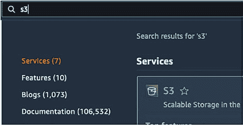
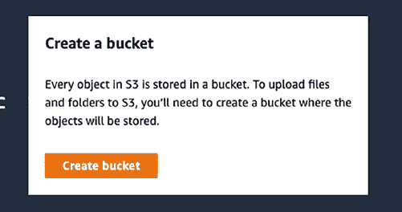

# 第 15 章 其他云服务提供商审计选项

由于并非每个人都使用 Azure 作为其云数据库，本章将介绍亚马逊云科技关系型数据库服务和谷歌云的审计选项。

#### AWS RDS SQL Server 审计

在 AWS RDS SQL Server 实例上使`SQL Server Audit`正常工作需要几个组件：

• **S3 bucket** – 用于存储审计文件。
• **Option group** – 用于允许 RDS SQL Server 使用审计功能。这也决定了使用哪个 S3 bucket 和 IAM 角色。
• **IAM role** – 这将允许你的 RDS 实例访问你的 S3 bucket。
• **SQL Server Audit 以及 Server 或 Database Audit** – 用于审计 SQL Server 上的操作。

## 创建 S3 bucket

如果你还没有 S3 bucket，你需要创建一个来存储审计文件。搜索并点击`S3`，如图 15-1 所示。

© Josephine Bush 2022

J. Bush, *Practical Database Auditing for Microsoft SQL Server and Azure SQL*,
[`doi.org/10.1007/978-1-4842-8634-0_15`](https://doi.org/10.1007/978-1-4842-8634-0_15#DOI)

