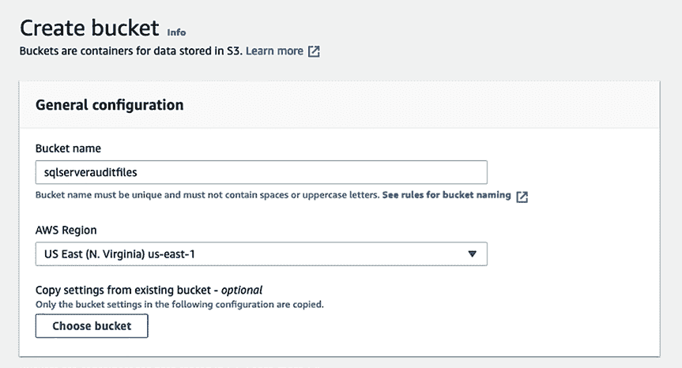
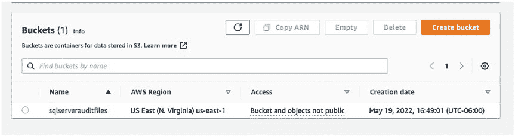

# 第 15 章 其他云服务提供商审计选项

**图 15-1.** 在搜索结果中搜索并点击 S3

点击`Create bucket`按钮，如图 15-2 所示。

**图 15-2.** 创建 S3 bucket

**注意** 有关创建 S3 bucket 的更多信息，请[访问 https://docs.aws.amazon.com/AmazonRDS/latest/UserGuide/Appendix.SQLServer.Options.Audit.html#Appendix.SQLServer.Options.Audit.S3bucket](https://docs.aws.amazon.com/AmazonRDS/latest/UserGuide/Appendix.SQLServer.Options.Audit.html#Appendix.SQLServer.Options.Audit.S3bucket)。

这将打开一个`创建 bucket`页面，如图 15-3 所示。你需要为其命名一个在整个 AWS 中唯一的名称。此 bucket 必须与数据库位于同一区域。

