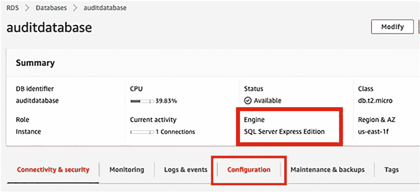

# 第 15 章 其他云服务提供商审计选项

**图 15-3.** 创建 bucket 设置

你可以在`创建 bucket`页面的其余部分保留所有默认设置，然后点击`创建 bucket`。

**注意** 你的 S3 bucket 不能对公众开放，也不能为审计文件使用 S3 对象锁定。

你将在门户中看到新列出的 bucket，如图 15-4 所示。

**图 15-4.** S3 bucket 列表

