# 第 15 章 其他云提供商审计选项

**注意**，如果您已经有一个选项组在处理数据库备份，您可以将审计功能添加到其中。

要创建一个新的选项组，请搜索并点击 RDS。您需要知道数据库引擎及其版本才能创建新的选项组。首先，让我们查看一下您的 RDS 实例的引擎。点击您的 RDS 实例。在"摘要"部分，您将看到引擎信息，如图 15-5 所示。请记下该引擎。然后点击图 15-5 中所示的"配置"。

***图 15-5.** RDS 配置*

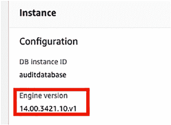

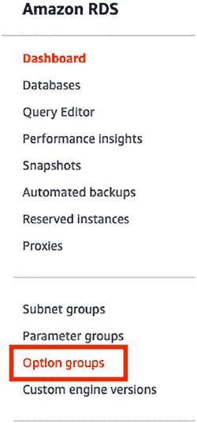

记下您的引擎版本，如图 15-6 所示。

***图 15-6.** 引擎版本*

要设置一个新的选项组，请点击图 15-7 中所示的"选项组"。

***图 15-7.** 选项组菜单项*

由于我目前只有默认选项组，我将创建一个新的选项组。点击图 15-8 中所示的"创建组"按钮。

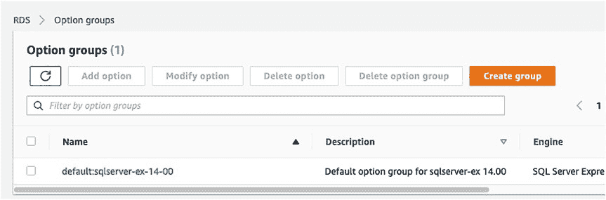

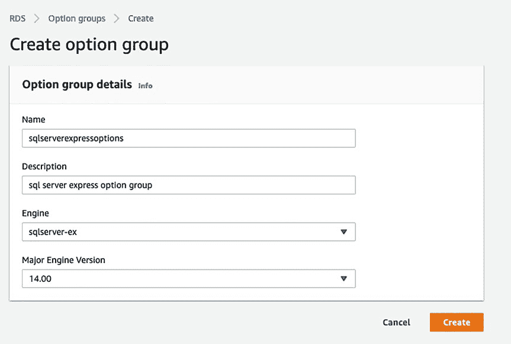

***图 15-8.** "创建组"按钮*

进入"创建组"页面后，您将需要填写四个字段，如图 15-9 所示。

***图 15-9.** 创建选项组设置*

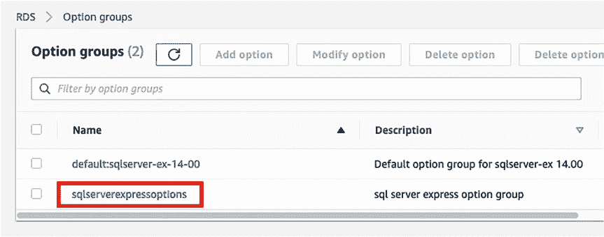

关于"创建选项组"页面上的设置：

• **名称** – 您可以随意命名。最好是起一个足够描述性的名字，以便您能知道它的用途。不过，一个组中可以有多个选项，所以您不必在名称中包含"审计"。

• **描述** – 用于帮助您确定选项组的内容。

• **引擎** – 选择您从图 15-5 的 RDS 摘要中获得的引擎。

• **主要引擎版本** – 选择您从图 15-6 的引擎版本配置设置中获得的主要引擎版本。

点击"创建"。现在您的选项组已准备好添加选项。

## 将审计选项添加到新的选项组

创建完成后，在列表中点击它，如图 15-10 所示。

***图 15-10.** 点击新的选项组*

向下滚动到"选项"框，并点击"添加选项"，如图 15-11 所示。

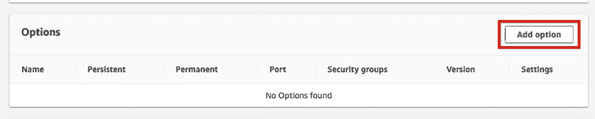

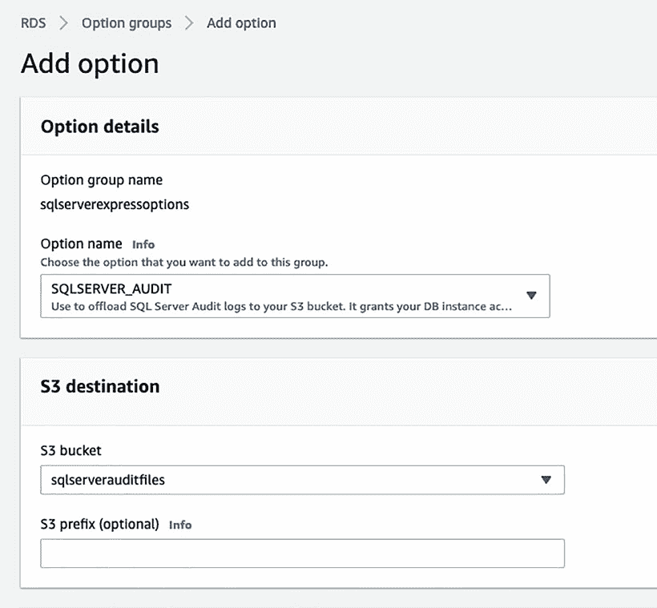

***图 15-11.** "添加选项"按钮*

在"添加选项"页面上，您需要选择 `SQLSERVER_AUDIT` 和您的 `S3` 存储桶，如图 15-12 所示。您可以为 `S3` 存储桶选择一个前缀。如果您不输入前缀，审计文件将被放置在存储桶的根文件夹中。

***图 15-12.** 添加选项设置*

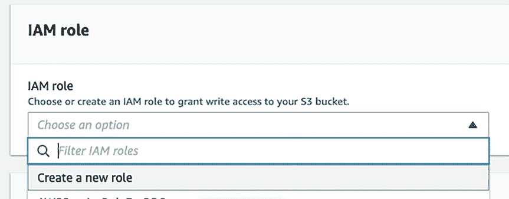

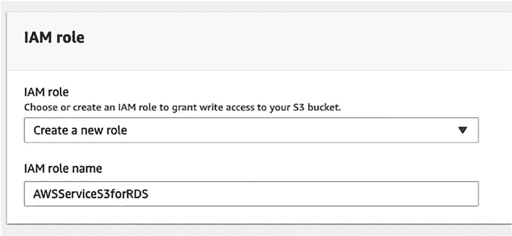

您将需要一个 `IAM` 角色。如果您还没有一个 `S3` 角色，请立即创建一个。这个角色将允许您的 RDS 实例与存储桶进行通信。在 `IAM` 角色下拉菜单中选择"创建新角色"，如图 15-13 所示。

***图 15-13.** 创建新的 `IAM` 角色*

您可以为新角色命名，比如 `AWSServiceS3forRDS`，如图 15-14 所示。

***图 15-14.** 创建 `IAM` 角色名称*

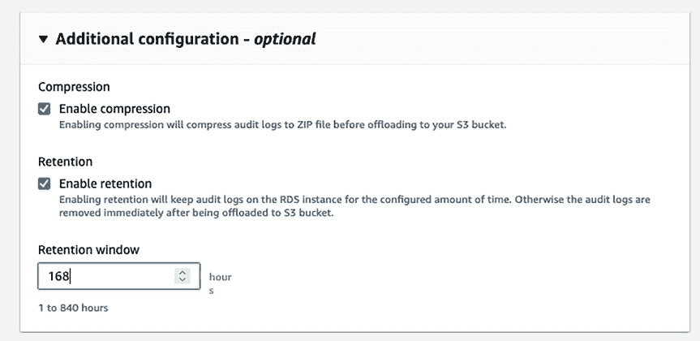

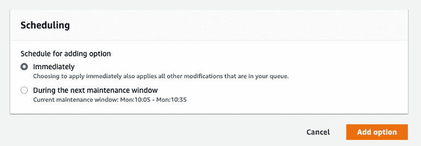

展开"其他配置"部分。保持压缩功能启用，并启用保留设置，如图 15-15 所示。您可以保留 1 到 840 小时的审计日志。如果禁用保留，审计日志在从您的 RDS 实例卸载后将立即被删除。我将其设置为一周，这样我就可以在那一周过去之前查询所有的审计数据。

***图 15-15.** 压缩和保留设置*


然后，您可以选择立即应用此更改，或等待维护窗口。

如`图 15-16`所示，点击**添加选项**。

`图 15-16.` 安排并添加选项

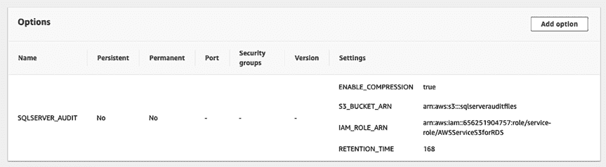

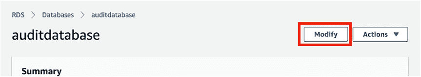

点击**添加选项**后，您将返回到选项组列表页面。点击您刚创建的选项组，并验证您实施的设置，如`图 15-17`所示。

`图 15-17.` 验证新选项组设置

##### 将新选项组添加到 RDS 实例

导航到您的 RDS 实例。您需要修改它以使用这个新的选项组。如`图 15-18`所示，点击数据库实例上的**修改**。

`图 15-18.` 修改 RDS 实例

向下滚动到数据库选项设置。将选项组更改为您刚创建的新组，如`图 15-19`所示。

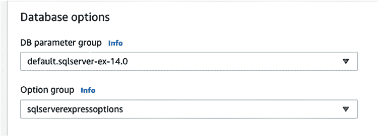

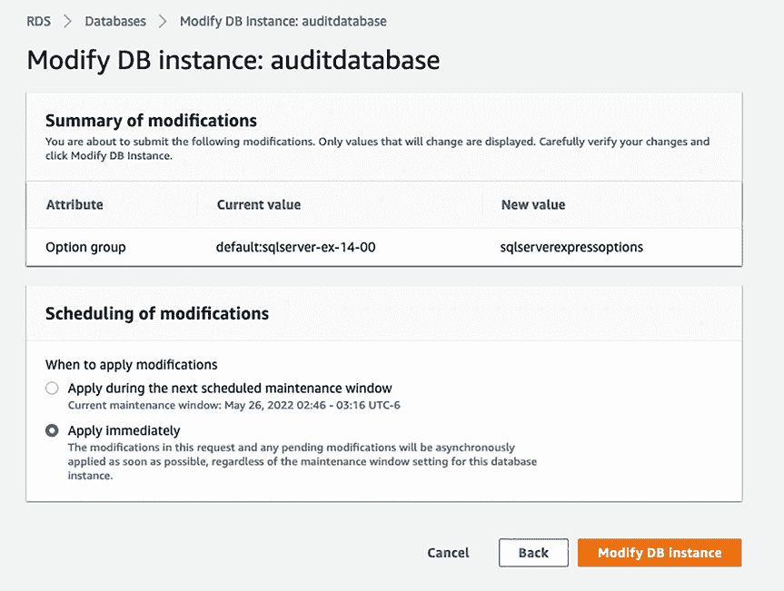

`图 15-19.` 选择新选项组

向下滚动并点击**继续**。选择是在下一个维护窗口应用更改，还是立即应用。然后如`图 15-20`所示，点击**修改数据库实例**。

`图 15-20.` 立即使用新选项组修改 RDS 实例

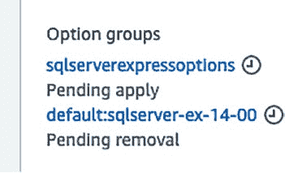

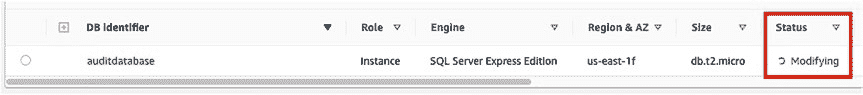

**注意**：立即应用可能会导致您的数据库在更改应用期间暂时不可用。

点击返回到 RDS 实例的**配置**页面。您将看到新选项组的状态为`待应用`，如`图 15-21`所示。

`图 15-21.` 选项组待应用

在数据库列表页面上，您将看到数据库的状态为`正在修改`，如`图 15-22`所示。

`图 15-22.` RDS 实例正在修改以应用新选项组

一旦数据库状态变为`可用`，您就可以继续设置 SQL Server 审计。

## 设置 SQL Server 审计

在 RDS 实例上设置 SQL Server 审计时，需要遵循一些准则。这些是本书前几章中关于 SQL Server 审计的任何其他指导之外的补充要求。

*   不要在服务器审计名称中使用 `RDS_` 作为前缀。
*   对于 `FILEPATH`，请指定为 `D:\rdsdbdata\SQLAudit`。这是 AWS 要求的路径，其他任何路径都不行。
*   对于 `MAXSIZE`，请指定一个介于 2 MB 和 50 MB 之间的大小。
*   不要配置 `MAX_ROLLOVER_FILES` 或 `MAX_FILES`。这是不允许的，如果您尝试配置将会收到错误。请将 `MAX_ROLLOVER_FILES` 保留设置为 `2147483647`。完全不要使用 `MAX_FILES`。这就是为什么特别重要的一点是，不要审计所有内容。审计文件越多，查询审计数据就越困难。
*   不要配置 SQL Server 在无法写入审计记录时关闭数据库实例。我通常也不建议这样做，但在 AWS 中绝对不要这样做。

**注意**：RDS 中的 SQL Server 审计功能适用于任何版本的 SQL Server，包括 Express 版。

要设置 SQL Server 审计，您需要使用 SSMS 连接到您的 RDS 实例。我建议使用`清单 15-1`中的脚本来设置审计。

`清单 15-1.` 创建服务器审计
```sql
USE [master];

CREATE SERVER AUDIT [AuditSpecification]
TO FILE
(   FILEPATH = N'D:\rdsdbdata\SQLAudit\'
    ,MAXSIZE = 10 MB
    ,MAX_ROLLOVER_FILES = 2147483647
    ,RESERVE_DISK_SPACE = OFF
) WITH (QUEUE_DELAY = 1000, ON_FAILURE = CONTINUE)
WHERE ([database_name]<>'rdsadmin');
```

接下来，您需要设置一个服务器或数据库审计规范，以便收集审计数据，如`清单 15-2`所示。

`清单 15-2.` 创建服务器审计规范
```sql
USE [master];

CREATE SERVER AUDIT SPECIFICATION [ServerAuditSpecification]
FOR SERVER AUDIT [AuditSpecification]
```


