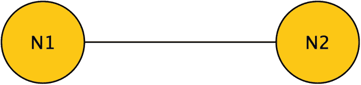
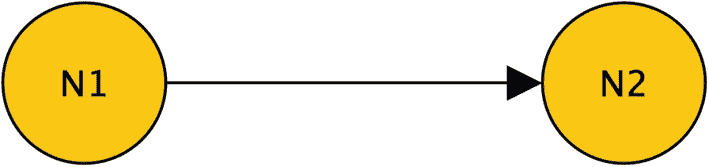
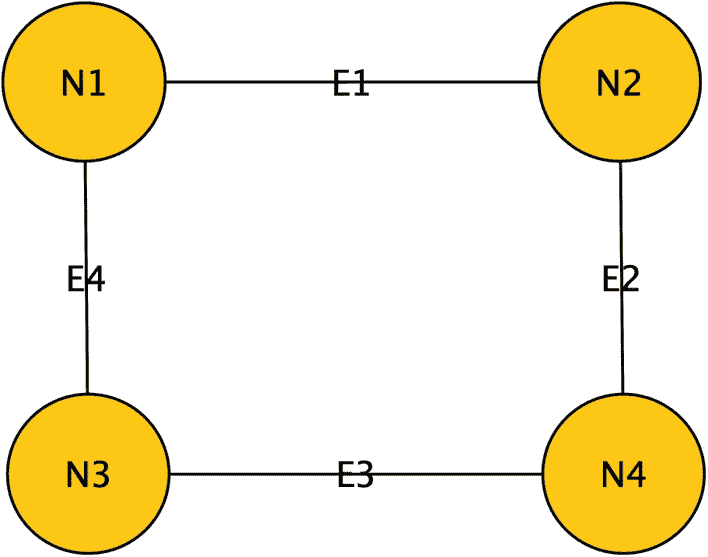
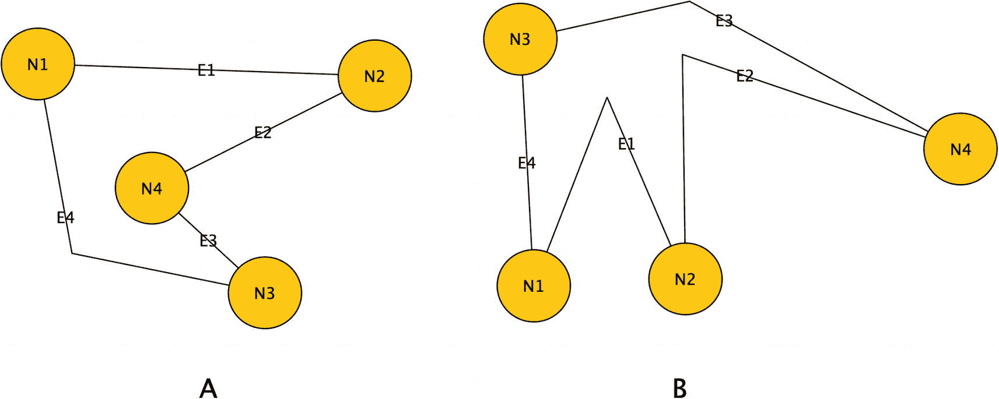
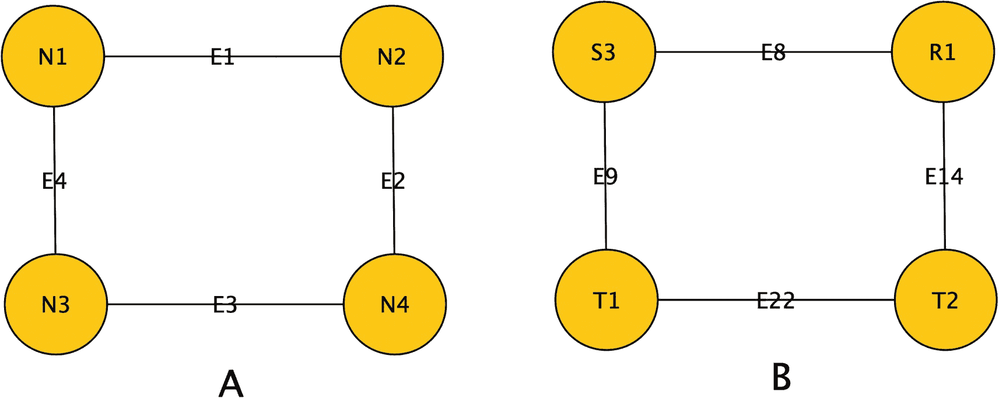
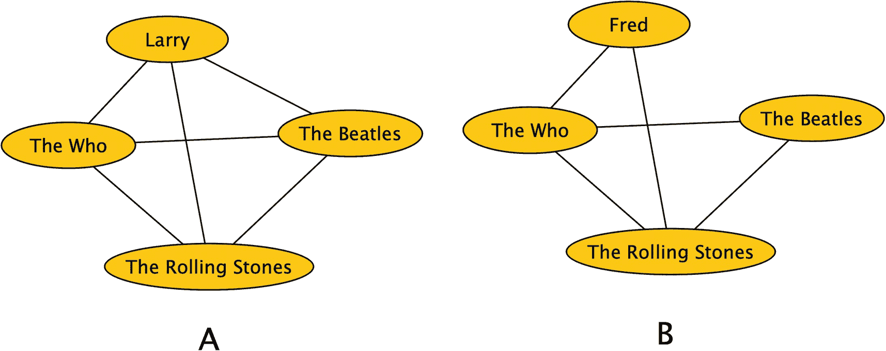

# 1. 图论简介

*能力越大，责任就越大。*——伏尔泰（以及蜘蛛侠的本叔叔）

从本质上讲，图数据结构只是一个模型，用于表示一个事物与另一个事物之间的连接，然后这些事物再与更多的其他事物相连。从根本上说，图数据库是将基于多对多关系的数据库形式化，并将其作为核心关系。

每一个曾经为关系数据库建模的人，要么是有意地、要么是无意地建模过一个图，因为当你向数据模型中添加更多概念时，多对多关系就开始出现。你将看到的一个巨大差异是，关系型数据库的实现（在理想情况下）是严格建模的。

在决定是为关系数据库还是图结构建模多对多关系时，经常使用的术语是数据是否**高度关联**。使用图数据库结构，你可以将许多表连接到许多其他表，并以与查询关系数据库不同（但非常相似）的方式查询该结构。

图的例子有很多，但你可能听说过的一些最常见的例子包括：

*   社交网络，你在其中记录从一个人到另一个人的关系。
*   建议处理系统，例如在线零售商用来记录一个人与他们查看和订购的产品之间的关系，以及该关系如何与其他有相似兴趣的人相匹配。
*   经理-员工关系，其中员工有一位经理，该经理又有一位经理，而这位经理很可能又被另一个人管理。

有了这些信息，你就可以根据一个对象的关系及其与其他实体关系的相似性，发现关于该对象的有趣事情。

大多数人听说过的最著名的图，可能是“凯文·贝肯六度空间”这个客厅游戏的基础。这个游戏表明，每个人（包括凯文·贝 bacon——而不仅仅是指你最喜欢的早餐肉是培根）与任何其他人之间的联系都不会超过六层。

图是非常自然的数据结构，这一事实并不意味着它们易于使用。因为它们是比关系表更不僵化的数据结构，这种灵活性使得处理它们变得相当复杂（尤其是在数据库引擎中）。图对象可以表示一个非常混乱的现实，你建模的数据越复杂，处理起来就越复杂。当然，这种复杂性的回报是，你创建的解决方案往往非常强大。

和许多计算机科学主题一样，图也是一个基本的数学概念。一旦我们开始分析数据，从图的数学原理中获得的一些见解将会有所帮助。因此，在本书关于图的开篇，我将提供一些非常粗略的数学概念概述，同时定义什么是图以及它如何在软件中使用。

请注意，本章中的概念来自许多资源，并且通常是常识。然而，当我寻找关于图概念介绍的资料时，包括这些概念的数学证明（本书中都不会涉及，所以不用担心！），其中之一是理查德·J·特鲁多（Richard J. Trudeau）于 1993 年由多佛出版社出版的*《图论导论》*。它远比本章深入，绝对超出了你学习使用 SQL Server 图数据库扩展进行编码所需，并且数学证明一直是我的“氪石”（软肋）！不过，我强烈推荐这本书，作为超越我将在本书中展示的内容、达到更高水平的起点。

本章将是对你在本书和许多其他资源中会发现的众多主题的一个快速、高层次的概述，此外还有一些想法，你可能希望在开始构建图表对象后，在我将介绍的图对象中使用这些想法。本书本身将主要侧重于非常实际的应用以及如何编写特定类型的代码，但我发现了解一些图的基础知识确实帮助我构想出我试图实现的目标。

## 图的基础知识

虽然大多数读者的明确目标是将图应用于他们试图解决的特定问题，但最好从头开始，讨论纯粹意义上的图是什么。（如果你不关心，可以跳到第 3 章，那里开始讲 T-SQL 代码！）学习基础知识将有助于你摆脱先入为主的观念。也许更重要的是，你可以忽略你可能希望解决的工具和特定问题集的限制，而只是思考整个问题集。

在数学中，有“纯”数学和“应用”数学的概念。纯数学是数学本身的数学。它的存在是为了问“用一个结构能做什么？”而不问“这是解决我问题的有用代码吗，或者更重要的是，能解决任何问题吗？”这种限制性问题。应用数学或多或少是我们这些典型的计算机架构师/程序员通常感兴趣的那种东西，因为我们有一个问题，并想找到能帮助我们解决这个问题的东西（并且是立即找到）。大多数时候，解决方案只有在能解决我们当前已知的具体问题，并且有经理在背后督促时，才会引起兴趣。

然而，我总是更喜欢先尝试看看用一个新工具能完成什么，然后再实际动手（当然是比喻性的；作为一名程序员，除非当天的零食包括巧克力，否则我的手在工作中永远不会弄脏）。

我将讨论的一些内容，会帮助你理解在数据中寻找模式并最终转化为算法时，我们可能会做什么。由于 SQL Server（或任何图数据库平台）当前的计算限制，或者在 2023 年写作时合理的硬件限制，某些设计可能无法实际实现。自从我在 2000 年写了我的第一本书以来，23 年后坐在这里，面前桌上的计算机拥有比我第一次编写 T-SQL 时中大型公司运行的计算机更强大的能力，这句话给我的感觉是多么不同，这让我感到震惊。

在我可以下载的一个示例数据库中，仅一个表中就有数百万行数据，而我可以在我的台式计算机上用几分钟时间处理合理的查询。限制总是存在的，但随着每一代计算机架构的过去，限制越来越少。

我在第一章（在很大程度上也包括第二章）的目标是简单地介绍一些围绕图的术语和概念，以帮助你理解图是如何构建并最终被处理的。

## 关于作者

我在 Redgate 的新同事们。我与 Redgate 是多年的朋友（同时也是 Friends of Redgate 的成员），为他们写作。我的新经理和团队成员都非常棒。

## 关于技术审校

感谢 Amber Davis 给了我成为多莱坞（Dollywood）内部人士的机会。显然，成为多莱坞内部人士与本书关系不大，但我只是想再说一遍（她可能永远也看不到！）因为我在多莱坞 Dreammore 大厅里写致谢。我从她身上学到了很多，这对撰写本书的某些部分以及我在 Redgate 担任 Simple-Talk 编辑的新工作都很有用。

### 定义

图基于两种主要数据结构：`节点`（或在数学术语中，顶点）和`边`。节点代表一个可能值得关注的“事物”，类似于关系数据库中的表。边在恰好一个或两个节点之间建立连接（当节点数为一时，意味着该节点与自身相关）。图被定义为一组节点和一组边的集合。

在图数据库中，节点类似于大多数带有属性的表，这些属性描述了节点所代表的内容。边则类似于一个多对多关系表，至少包含表示关系“来自”哪个节点以及“指向”哪个节点的属性。你会看到，有两个主要方面使这些新概念有别于关系型实现。

首先，边中的`来自`和`指向`通常可以来自任何节点对象。而关系型表中用于引用另一个表值的列，传达的信息是它来自表 X 的外键，仅此而已；边的`来自`和`指向`属性，如果你需要，可以来自多个不同的节点类型。

提示

我完全清楚你*可以*在列中放入任何值，因此一个列中的外键值不一定都来自同一个表。但这*不应该*是常规做法，因为列可以代表多种含义的数据在关系型表中会非常混乱。图结构的工作方式与关系表非常相似，但它们具有特殊属性，允许两行包含来自多个来源的数据而不会让用户/引擎感到困惑。

其次，为了利用这些灵活的结构，图引擎启用了一套特殊操作，使我们能比使用`SQL`更轻松地访问关系的含义。关于这些操作和基本算法的更多细节请见第 2 章和第 3 章。

来看第一个例子，考虑图 1-1 所表示的简单图——两个节点由一条边连接。如果节点的类型很重要，将使用不同的形状来表示。

圆形节点 `N1` 和 `N2` 的表示，它们通过一条边（一条线）相互连接。

**图 1-1**

简单图

在绘制图时，边也可能具有方向性属性。方向表示关系不是互惠的。例如，考虑图 1-2。

圆形节点 `N1` 和 `N2` 通过一个前向链接连接的表示。

**图 1-2**

简单有向图

在这个图中，`N1` 连接到 `N2`，但 `N2` 并未连接到 `N1`。这类似于社交媒体关系，比如我关注了保罗·麦卡特尼，但保罗·麦卡特尼没有关注我！由于某些关系的非对称性，理解方向的价值通常非常重要。麦卡特尼先生不会突然希望收到关于我在哪里进行会议演讲的任何通知，但我希望了解他的音乐会和新音乐发布信息。

在 `SQL Graph` 和其他图产品中，边几乎总是有向的。这一点稍后会变得重要，但现在讨论只会使我们对图概念的讨论复杂化，所以首先，让我们忽略边的有向性。

在我第一个例子图 1-1 中，我有两个节点和一条边。这是一个非常简单的图，但还不是最简单的图。最简单的图是具有 0 条边和 0 个节点的图，也称为`空图`。你还可以有一个只有一个节点且没有边的图，以及只有一个节点和一条边的图，等等。（你不可能有没有节点的边。）

就像为关系数据库建模一样，将图仅仅视为一幅图画而不是一个复杂的数据结构，存在固有的危险。考虑一个具有图 1-3 中所示节点和边的图。

四个相连节点及边的方形表示。`N1` 通过 `E1` 到 `N2`，`N2` 通过 `E2` 到 `N4`，`N4` 通过 `E3` 到 `N3`，`N3` 通过 `E4` 到 `N1`。

**图 1-3**

有四个边和四个节点的图

这个图可以用以下方式表示为节点和边的集合：

`节点: {N1,N2,N3,N4}; 边: {E1:{N1,N2}; E2:{N2,N4}; E3:{N3,N4}; E4:{N1,N3}}`

根据定义，所有节点和边必须是唯一的，就像表需要唯一的行一样。而且就像表一样，集合中元素的顺序并不重要。下面的图与本段之前图示和定义的图是相同的：

`节点: {N2,N3,N1,N4}; 边: {E2:{N2,N4}; E1:{N1,N2}; E4:{N1,N3}; E3:{N3,N4}}`

当将图绘制为图像时，有一个非常相似的考虑因素。任何有技能的程序员都经常在白板上画结构图。如果你在白板上画一个圆形、一个三角形和一个正方形，本能地你会认为它们是不同的东西。即使你画一个矩形、一个正方形和一个菱形（都是四边形），你也不会认为它们是相同的。

但是，在图术语中（就像在绘制表时一样），图 1-4 中的两个图彼此相同，并且与图 1-3 中的图相同，它们被认为是“相等的”。

两个不规则多边形表示的四个相连节点及边。在 A 中，`N1` 通过 `E1` 到 `N2` 通过 `E2` 到 `N4`，`N4` 通过 `E3` 到 `N3`，`N3` 通过 `E4` 到 `N1`。边 `E4` 有一个倾斜的弯曲。在 B 中，边 `E1`、`E2` 和 `E3` 有弯曲。

**图 1-4**

两个相同的图结构

图 1-4 中的两个图是同一图的副本。下一个概念与此相关，我们将研究具有相同形状但不同节点的图。当一个图具有相同的节点和边形状（指相同的节点和边，而不是绘图形状）时，这些图被称为`同构图`。例如，图 1-5 中的两个图并不相等，但它们是同构的，因为它们的数据集具有相同的形状（无论你是否将它们画成正方形）。

两个正方形表示的四个相连节点及边。a. `N1` 通过 `E1` 到 `N2`，`N2` 通过 `E2` 到 `N4`，`N4` 通过 `E3` 到 `N3`，`N3` 通过 `E4` 到 `N1`。b. `S3` 通过 `E8` 到 `R1`，`R1` 通过 `E14` 到 `T2`，`T2` 通过 `E22` 到 `T1`，`T1` 通过 `E9` 到 `S3`。

**图 1-5**

两个同构的图结构

这个同构的概念，即使不确切使用这个术语，在你偶尔使用图时也会很有趣。考虑图 1-6 中的节点集合。

两个带有边的图结构。A. 节点 Larry 分支到 The Who 和 The Beatles，它们都汇聚到 The Rolling Stones。Larry 连接了 The Rolling Stones 和 The Who 以及 The Beatles。B. Larry 被 Fred 取代。Fred 和 The Beatles 没有连接。

**图 1-6**

用于比较的示例图

