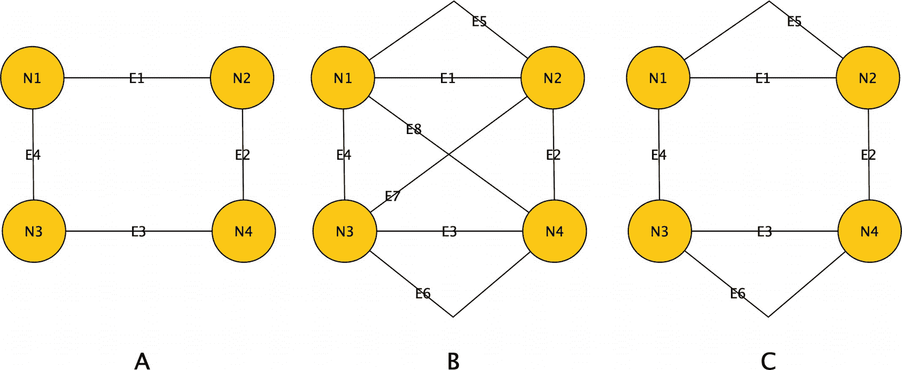
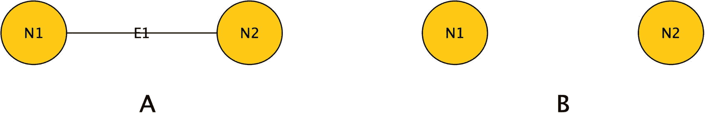
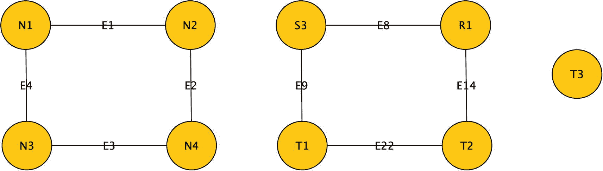
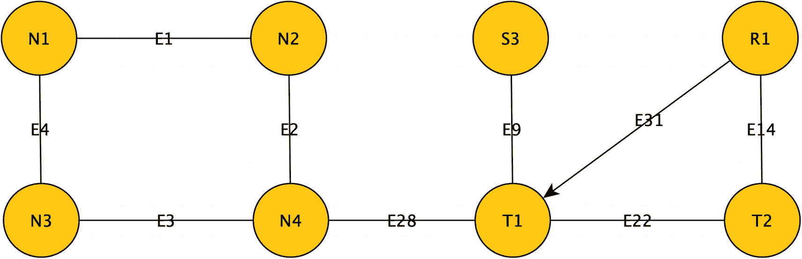

# 图论核心概念：子图、行走与连通性

## 子图

现在，考虑节点集合 `{Larry, The Who, Rolling Stones}`，它构成了更完整图的一个 **子图**（即图的一部分，包含节点和边），并且与 `{Fred, The Who, Rolling Stones}` 是同构的。不难看出，既然 Fred 和 Larry 都连接到两个相似的节点，那么为 Fred 添加一条边 `{Fred, Beatles}` 可能是合理的。因此，公司可能希望推荐：“你听过披头士乐队吗（或者你住在石头底下吗）？” 当然，Fred 可能不喜欢 John, Paul, George 和 Ringo；但许多图的目标是寻找共同特征，然后建议使它们变得更普遍的方法。进一步延伸，你可能会发现来自完全不同子图的模式，这些模式可能表明一种可重复的模式。

## 行走与路径

子图中的一个重要概念是图中的 **行走**。它指的是你如何从一个节点遍历到另一个节点。例如，在图 1-6 的第一个图中，从 Larry 出发，你可以找到一条行走路径：`Larry -> TheWho -> Rolling Stones -> Beatles -> Larry`。你还可以在这个示例图中找到从任何节点到任何节点的许多其他行走路径，因为图中的每个节点都与其他每个节点相连。行走的另一个术语是 **路径**，这个术语可能更常见，因为你将在 SQL Server 2019 及更高版本中使用的用于查找路径的操作符被命名为 `SHORTEST_PATH`。

你经常会使用行走的概念来确定一个节点距离另一个节点有多近。例如，在图的第二个变体中，从 Fred 到 The Who 和 Rolling Stones 的距离是 1，到 Beatles 的距离是 2。如果你是 LinkedIn 的用户，当你看到你是一级连接或二级及以上连接时，你就看到了这个概念。二级连接意味着你通过一个中间节点连接。

## 欧拉行走

一个有趣但在编程典型图结构时可能并非特别必要的概念是 **欧拉行走**。一个欧拉行走要求起始节点被触及两次，图中的每条边恰好被触及一次。例如，考虑图 1-7 中的图。

图 1-7：演示行走的图示

> **注意**
> 这在文本中有点难以表达！

在图 1-7A 中，你可以从 `N1` 遍历并回到 `N1`，路径为：`E1->N2->E2->N4->E3->N3->E4`。在 1-7B 中，你可以从 `N1` 开始并结束，路径为：`E1->N2->E5->N1->E4->N3->E6->E3->N3->E7->N2->E2->N4->E8`。然而，在 1-7C 中，这是不可能的，因为如果你从 `N1` 开始一条行走，例如 `N1->E1->N2->E5->N1->E4`，你将永远无法返回到 `N1`。事实证明，一个图要存在欧拉行走，所有节点的 **度** 必须是偶数（节点的度表示连接到该节点的边的数量）。

> **注意**
> 像 1-7B 和 1-7C 这样的图是一个 **多重图**。多重图允许我们在相同的两个节点之间有多条边。随着复杂度增加，我们看到边通常表示节点在关系中扮演的角色。有些边没有意义，比如在相同节点之间有多条边；而另一些则可能完全合理。请记住我之前说过节点之间的边必须是唯一的。这些边可能不相等，而是描述节点之间关系的两种不同情况，就像图 1-7b 中 `N1->N2` 有 `E1` 和 `E5`。一条边可能代表家庭关系，另一条代表社交网络连接，你可能不希望因为需要遍历特定类型的边而将它们视为同一条边。

实际上，限制将归结于所有建模决策的最终因素：**语义**。这个关系意味着什么？它将如何被用来表示一种或多种关系？例如，你可能只在逻辑上设定一个人与另一个人之间有一条边，表示该人是另一个人的生物学父母；另一方面，人与电影之间的多条边可能是有意义的：一条表示演员，一条表示制片人，一条表示导演，等等。

## 连通图与桥边

我想介绍的最后一个图论概念是 **连通** 图。在连通图中，图中的每个节点到其他每个节点都存在一条行走路径。在 **非连通图** 中，图将分成一个或多个部分。在图 1-8 中，1-8A 展示了最简单的多节点连通图，1-8B 展示了最简单的非连通图。1-8A 中的图被称为在一个块中，而 1-8B 中的图在两个块中。

图 1-8：简单连通图与非连通图

在图 1-9 中，我们有一个更复杂的图，它分成了三个 **块**。

图 1-9：分成三个块的单一图

当你有一个连通图，并且移除一条边会导致它分裂成更多块时，这条边被称为 **桥边**。考虑图 1-10 中的图。

图 1-10：演示桥边的图

这个图中有两条桥边。最明显的是 `E28`。如果你移除它，你将剩下两个多节点块。那条不太明显的边是 `E9`。移除 `E9` 会使 `S3` 孤立，从而给图增加一个块。当一个节点的度为 2 时，移除任何一条边都会使剩余的边成为一条桥边。

