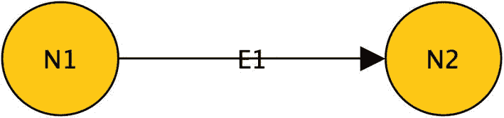
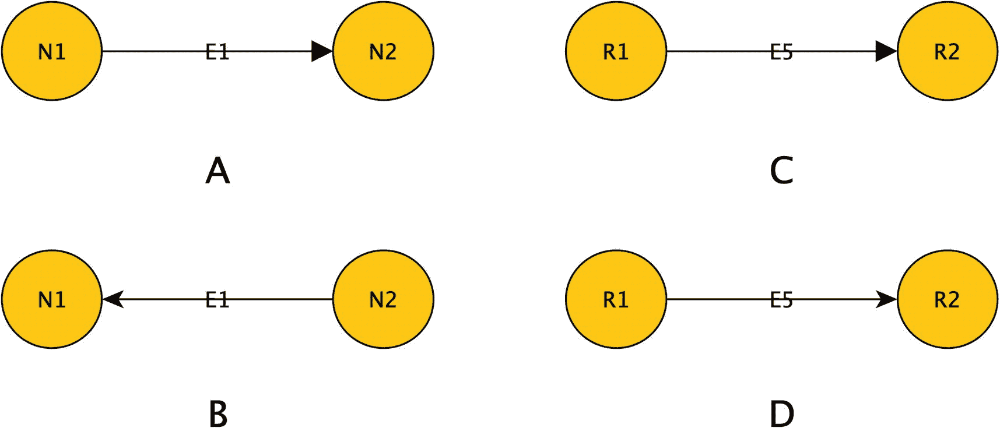
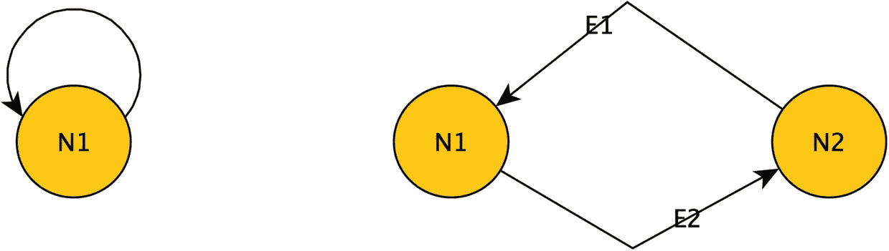
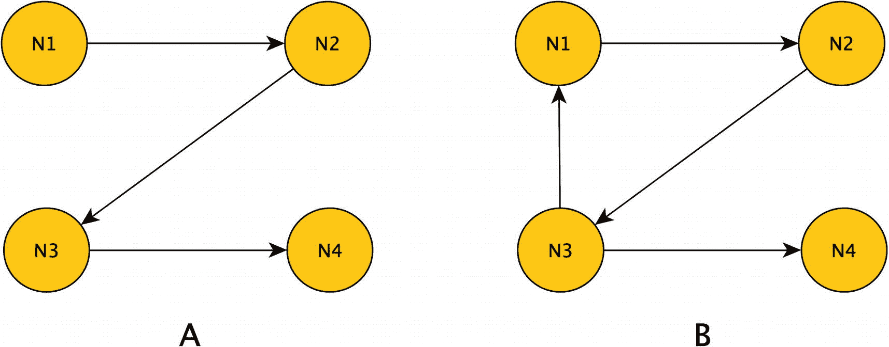
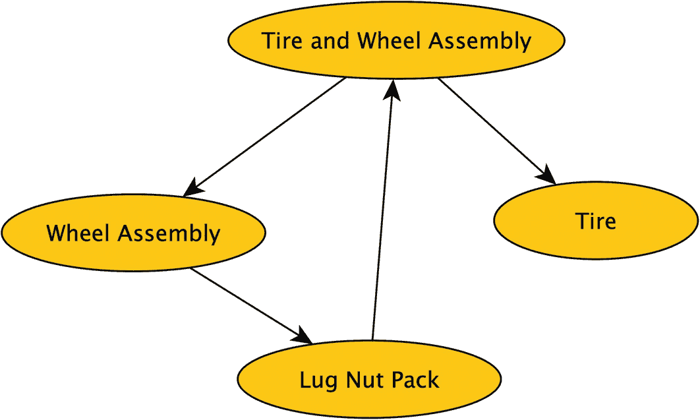

# 计算中的图/有向图

既然我已经介绍了图的术语和形状的一个子集，现在是时候转向您将使用 SQL Server 的 SQL Graph 功能（或任何主流图产品）构建和使用的图的机制了。前面提到的所有概念仍然成立，但有一个主要区别。在计算术语中，边通常是单向的。只指向一个方向的边被称为 `有向边`，整个图被称为 `有向图`。我不会用有向图的概念重新定义之前介绍的所有概念，因为涵盖这些主题的目的是让您思考图结构以及它们如何组合在一起。我会在有意义时讨论它们的适用性。

有向图中的关系形式如图 1-11 所示。



节点 `N1` 和 `N2` 通过前向链接 `E1` 连接的表示。

**图 1-11** `有向边`

而在之前的图示例中，`N1` 和 `N2` 之间的边表示 `N1` 连接到 `N2`，`N2` 也连接到 `N1`，现在边 `E1` 仅表示 `N1` 连接到 `N2`，而不是相互的。之前涵盖的所有概念仍然成立，但存在一个明显的复杂性：在确定两个图是否相等或同构，以及可能存在哪些路径时，必须考虑边的方向。例如，考虑图 1-12 中的图。



两连接节点的 4 个图解说明。A. `N1` 和 `N2` 带有前向链接 `E1`。B. `N1` 和 `N2` 带有后向链接 `E1`。C. `R1` 和 `R2` 带有前向链接 `E5`。D. `R1` 和 `R2` 带有前向链接 `E5`。

**图 1-12** 用于演示有向图的相等性和同构性的图示例

1-12A 和 1-12B 不相等，但 1-12B 是同构的，因为边的方向不同，但基本结构是由一条有向边连接的两个节点。

1-12A 和 1-12D 也不相等，因为节点不同，但它们是同构的，因为结构上是相同的。1-12C 和 1-12D 完全相同，所以它们相等。

在指定有向图时，您仍然可以使用相同的集合表示法，只是需要为节点标注顺序。因此，图 1-12A 可以表示为

```
节点: {N1, N2}; 有向边: {E1:{N1, N2}}
```

您可以通过始终在每对节点之间设置两条边来模拟无向图的双向特性：

```
节点: {N1, N2}; 有向边: {E1:{N1, N2}, E2:{N2, N1}}
```

## 环状图与非环状图

对于有向图，有一个非常重要的概念将在我们实践中使用图的所有部分中发挥主要作用：`环`。图环指的是一个有向图，从给定节点出发的一条路径可以经过同一节点两次。这与欧拉路径的概念类似，但在这种情况下，您只能根据边的方向遍历图。

例如，最简单的环状图是一个节点与自身有关系，次简单的是两个节点，两条边相互进出，如图 1-13 所示。



2 个图解表示。A. 节点 `N1` 有自环箭头。B. 节点 `N1` 和 `N2` 以环状形式通过弯曲的链接 `E1` 和 `E2` 连接。

**图 1-13** 环状图示例

环状图的概念很重要，有几个原因。首先，让我们考虑编程方面的问题。某些算法在非环状图上运行良好，但在环状图上则无法工作。最大的问题在于处理过程。考虑图 1-14 中的两个图。



两个结构。A, 节点 `N1` 到 `N4` 以 Z 形通过箭头链接。B, 节点 `N1` 到 `N4` 以 Z 形链接，并且还有一条从 `N3` 到 `N1` 的额外链接。

**图 1-14** 用于演示处理非环状和环状有向图的图示例

在图 1-14A 中，这是一个非环状图，您可以使用简单的节点遍历算法直接从 `N1->N2->N3->N4` 遍历图，毫无问题地接触所有节点。但在图 1-14B 中，节点遍历算法因 `N1->N2->N3->N1` 而变得困难，因为接下来该怎么做？再次循环遍历节点？还是停止处理？从 `N1` 开始的所有结果都会重复，但这对于您正在建模的图意味着什么？手动追踪时您可以在脑海中记住这一点，但如果您面对数百万或数十亿个节点，编程会变得更加复杂（并非不可能，只是更复杂）。

这种能够在图中找到两个节点之间的简单连接/路径的能力被称为 `传递闭包`。一旦掌握了这种能力，您就可以用图做各种有趣的事情，例如确定您是否与凯文·贝肯有联系，以及当贝肯兄弟来到您所在城镇开演唱会时，您需要通过您认识的人中的哪条最短路径去找他们要票。

在更侧重于数据库设计的考虑中，可以考虑用非环状图与环状图可以建模什么。第 2 章将详细介绍更多内容，但如果您正在建模包含关系，例如物料清单（一种用于包装/组装物品的数据结构，其中作为其他产品组成部分的产品使用图来建模），图中的环可能会导致奇怪的结果。考虑图 1-15 中的图。



轮胎和车轮组件与轮胎和车轮组件相连的表示。车轮组件链接到螺母包，并又链接回轮胎和车轮组件。

**图 1-15** 不合逻辑建模的物料清单

如果轮胎和车轮组件包含一个车轮组件，而该车轮组件又包含螺母，然后螺母又包含一个轮胎和车轮组件……您可以看到这里固有的问题。如果您正在建模类似社交网络的东西，环不仅有意义，而且您可以从中找到重要信息（从显示两个人有联系的简单互惠关系开始）。在第 2 章，我将讨论一些您可以使用图结构建模的不同构造。

像这样的非环状图通常被称为一种称为层次结构的数据结构类。在物料清单结构的情况下，它被称为 `多重层次结构`。多重层次结构中的一个节点可以是多条边中的“终点”伙伴，但图必须是非环状的。这样，可以将螺母包视为一个独立的物品，或作为车轮的一部分（在现实世界中，螺母本身会是一个独立的零件！），但出于显而易见的原因，螺母包不能将车轮或车轮组件作为其零件列表的一部分。

## 总结

在本章中，目标是介绍讨论图主题时使用的一些核心概念。其中许多主题可能会贯穿全书，但有些可能不会。本章的目标是简要介绍这些概念，帮助您在开始使用图解决复杂问题时，设想图是什么以及图可能如何被使用。


