# 2. 数据结构与算法

在本章中，我将介绍你可以使用 SQL Server 中的对象创建的常见图配置。我将从定义几乎所有图结构在关系型（或实际上任何）数据库中的存储基础知识开始。创建用于保存图结构的表相当直接；复杂之处在于处理数据时。

对于我将介绍的每一种数据结构配置，我都会包含一个关于处理它们所用算法的高级解释。这将使后续章节可以专注于构建代码来处理数据结构中的数据。

## 基本实现

如前一章所讨论的，图的基本构建块是节点和边。节点基本上与任何表示特定概念的数据库关系表相同。边表示这些表中两行之间的链接，非常像关系型数据库中典型的多对多解析表。

所以，假设你有如图 2-1 所示的图。

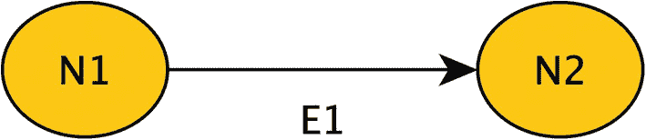

一幅插图，左侧和右侧分别是两个节点 `N1` 和 `N2`，由 `E1` 连接。

**图 2-1**

简单图

你需要一个表来保存 `N1` 和 `N2` 节点。这些节点可以是相同类型，也可以是不同类型。例如，他们可以是互为朋友或家人的两个人，或者一个人是某个足球队的球迷。在这个例子中，我们假设它们是相同类型（将来，如果我想要它们是两种不同类型的对象，我会相应地标记节点）。

对于我的示例，我将使用在大多数关系表中都很常见的数据，因为你通常会这样思考数据。在接下来的两章中，我将阐述 SQL Server 如何实现图结构，但现在，你可以认为数据结构基本上就像你以前在 SQL Server 表中构建的那样。为了实现图 2-1 的结构，假设你有如下行在表中表示两个节点：

```
Node
----
N1
N2
```

现在你需要一个表示边的数据结构，像这样：

```
FromNode  ToNode
--------  -------
N1        N2
```

这种数据结构的一个常见术语是 `adjacency list`（邻接表）。其目标是存储图中彼此相邻的节点列表。除了一种非常特殊（且相当常见）的图数据结构（树，我将在本章后面定义）外，这就是在数据库中实现图的方式。即使是 Microsoft SQL Server 的图对象，`internally`（在内部）也是这样实现的。通常使用术语 `neighbor`（邻居）或 `parent/child`（父/子）来描述节点之间的关系。父和子在非循环关系中非常常见，而邻居用于记录两个节点彼此相邻且关系允许循环的情况。关系中的子/邻居节点是在 `ToNode` 列中表示的那个。

在实践中，除了键值，你的节点表中总是会有额外的列，边表中通常也如此。利用边数据结构的 `from` 和 `to` 列，再加上其他列，你可以通过对不同列应用一个或多个唯一索引，以及使用其他方法来限制可放入列的数据类型，从而创建许多不同形状的图。这就是我在本章剩余部分将要介绍的内容。

我将讨论两种主要的图配置类型：`acyclic`（无环）和 `cyclic`（有环）。从第一章来看，希望清楚它们之间的主要区别在于一个允许边中存在环，而另一个不允许。当然，另一个区别是这些数据结构适用的情况类型。

无环图通常用于定义结构非常规整的东西，而有环图则适用于更有机的场景。在每个主要部分中，这一点将变得更加清晰。


## 无环图

在关系型数据库中处理起来最简单的图是无环图。原因在于在关系型环境中处理图所采用的方法，即 `广度优先算法`（或 `关系递归`）。该算法是为关系型处理而创建的，因为用于处理这些数据结构的典型递归方式与关系型数据库基于集合的本质不太契合。

例如，考虑图 2-2 中的图。

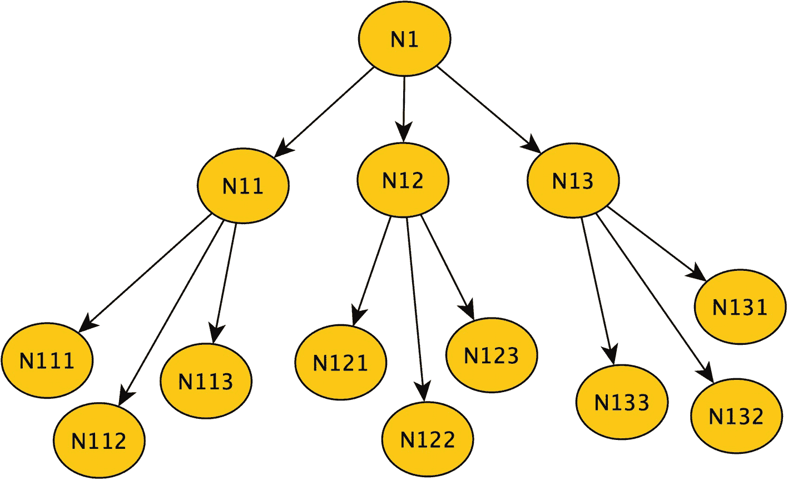

一个图形结构。N1 分支出 N11、N12 和 N13。N11 分支出 N111、N112 和 N113，而 N12 分支出 N121、N122 和 N123。N13 被细分为 N133、N132 和 N131。

### 图 2-2

示例图结构

使用典型的递归方式处理此图时，你选择 N1 作为起点，然后检查该节点是否有一个未处理的子节点。它确实有，于是获取 N11。检查 N11 是否有未处理的子节点。是的，N111。N111 没有未处理的子节点，因此无论你对该节点的数据执行什么操作，你都会将其添加到一个输出数据结构中。然后退回到 N11 并获取下一个子节点。如此继续。这被称为 `深度优先算法`。

常见的操作包括计算节点数、汇总该节点的销售额等。对于你的例子，假设你只是在计算子节点数量。因此，你递归回到 N11，并将子节点计数加 1。然后你检查是否还有更多子节点，确实还有。一遍又一遍。直到以起点开始的子图中的每个节点都被处理完毕，你才停止。

这对于某些编程语言来说效果很好，但对于关系型语言来说就很糟糕，因为关系型语言明显期望的处理方式是基于集合的处理。它处理的是数据集合，因此针对关系引擎工作方式而设计的图处理方法就是这种类型。

对于 `广度优先算法`，你不是深入结构内部，而是取一个起点，然后获取该节点的所有子节点。接着一次性获取这些节点的子节点。还是用同一张图，让我们将其分解为数据上的三个连续查询，如图 2-3 所示。

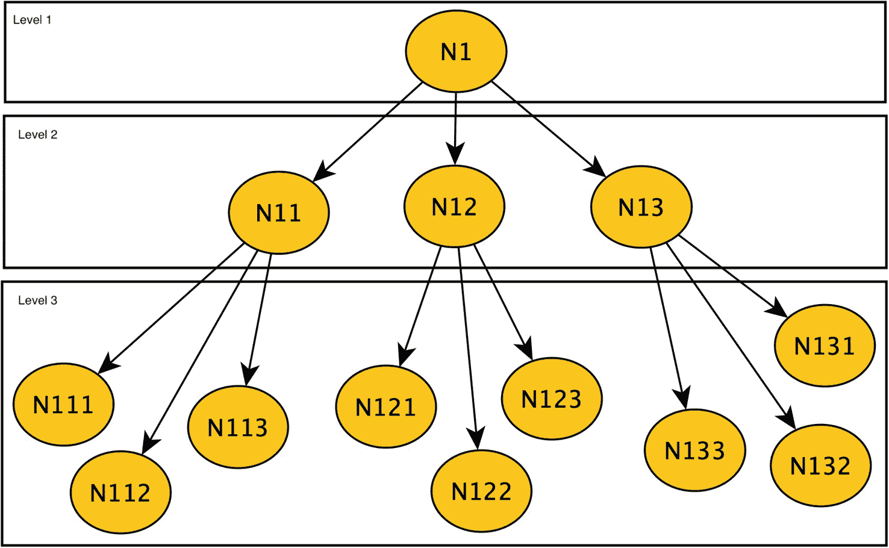

一个图形结构展示了在广度优先查询中获取的层级。第 1 层。N1 在第 2 层分支为 N11、N12 和 N13，它们在第 3 层分别拥有自己的分支：N111、N112、N113；N121、N122、N123；以及 N133、N132、N131。

### 图 2-3

指示在广度优先查询中将获取的不同层级的示例图

你查询起点。在此例中，它是一个节点，但它可以是任意数量的节点（实际上，本书中一些代码的基础就是做类似从每个节点同时开始的事情！）。你的广度优先算法是进行查询：

```sql
SELECT GraphId
FROM   GraphObject
WHERE GraphId = @startingPoint --起点 = N1
```

下一步是获取该数据集并查询：

```sql
SELECT GraphId
FROM  GraphObject
WHERE GraphId in (上一次查询得到的 GraphId 值)
```

从图中看，这会给你一个包含 N11、N12、N13 的集合。下一次查询执行相同的连接，但上一次查询的 `GraphId` 现在是这三个节点。你可以在每次循环数据时进行求和/计数等操作。显然，这里面还有更多内容，当我实现非伪代码时会变得更清晰，但这就是该算法的要点。

这个过程对于无环图来说相当简单，但你可能已经开始看到在处理有环图结构时的困难了，因为如果你有图 2-4 中的图，它将会无限循环。

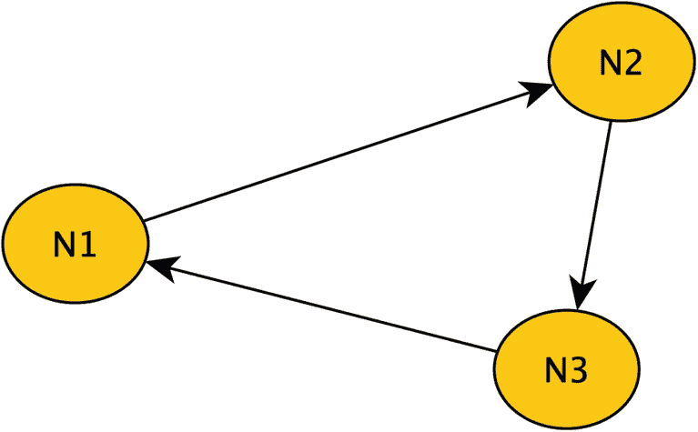

一个有环的图结构。节点 N1 链接到 N2，N2 链接到 N3，N3 又链接回 N1。

### 图 2-4

带有环的示例图

许多操作变得没有意义，因为使用简单的嵌套循环算法处理时，你会陷入无限循环。

需要注意的一点是：如果你被反复教导关系型处理应该避免迭代代码，这可能会让你有点惊讶。几乎所有的图处理都是迭代的。你编写的任何代码，以及微软用于实现其图结构的任何代码，都是迭代的。诀窍在于确保迭代的次数尽可能少，并尽可能高效。在处理树算法时，有一些替代的处理方法，其中一种将在第 6 章中介绍。


### 树

多年来，在关系型数据库中实现的最常见图形就是**树**。树是一种结构，它要求每个节点要么有零个父节点，要么有一个父节点，不能更多。想象一棵真实的树（或者如图 2-5 所示，迪士尼动物王国主题公园中一棵宏伟的树的复制品）。


一张拥有粗壮树干和多片树叶的树枝的树的照片。

图 2-5
一棵并非完全鲜活的树，作为树结构的类比

它有一个插入地面的树干。无论朝哪个方向出去（向下到根部或向上到树枝），你都可以看到这个类比。任何树枝都可以来自树干或其他树枝，但它只能是其中之一。树枝不会一起生长并重新合并成一个。（至少通常不会，而且这不是植物学课！）没有任何子节点的节点被称为叶节点，就像树枝上的叶子是独立的一样。

我的广度优先示例结构是一棵树，重新包含为图 2-6。


一个图形结构。`N 1` 分裂为 `N 11`、`N 12` 和 `N 13`。`N 11` 分裂为 `N 111`、`N 112` 和 `N 113`，而 `N 12` 分裂为 `N 121`、`N 122` 和 `N 123`。`N 13` 被细分为 `N 133`、`N 132` 和 `N 131`。

图 2-6
重复的示例树

要在邻接表结构中表示这一点，你需要类似这样的行：

```
From   To
———-   ———-
N1     N11
N11    N111
N11    N112
N11    N113
N1     N12
```

以此类推。为了确保该结构始终是一棵树，你需要保护一个主要条件：唯一的 `to` 值。因为在树中一个子行只能有一个父行，所以在邻接表的该列上设置唯一性约束可以确保它是一棵树。

你通常还需要做的另一件事是包含某种约束，以确保 `from` 值不等于 `to` 值。这是唯一性约束无法阻止的循环（尽管重复的 `to` 和 `from` 值基本上会使该行成为根和叶，并且很可能被迅速发现……但我的座右铭之一是 *如果坏数据根本不发生，它就不会发生*）。

虽然所有树结构都需要单个根，但这样的表结构可以包含多个树结构。在某些情况下，一个值为 `NULL, N1` 的行可以在创建树时作为起点包含在结构中。你可以使用唯一索引来确保只有一个根节点，唯一索引只允许一个 `NULL` 值。（SQL Server 在索引中将 `NULL` 值视为不同的值，不像在比较中，因此这将确保你只有一个根节点。）。你可以通过使用忽略 `NULL` 值的过滤 `UNIQUE` 索引来允许多于一个根节点。如果你想确保 `NULL` 行永远不会被删除，可以使用触发器对象，如果你的用户可以即兴删除行，这尤其有用。

如果你需要为多个树结构建模，只需创建多个边对象，每个对象都有不同的用途。例如，考虑一个公司的汇报结构。有多个项目正在进行，其中某人处于项目管理层次结构中，通常还有一个处理人力资源类事情的层次结构。所以，你可以创建：

```
ManagementEdge (FromEmployee, ToEmployee)
```

你也可以为每个项目再次创建相同的表。

```
Project1 (FromEmployee, ToEmployee)
Project2 (FromEmployee, ToEmployee)
```

或者，你可以将其建模为一个允许许多树共存于同一结构中的结构。

```
ReportingHierarchy (FromEmployee, ToEmployee, HierarchyName)
```

为通用树结构讨论的所有索引仍然有意义，但你会在对象中包含 `HierarchyName`，因为如果一个员工可以参与多个项目，那么唯一性仅针对一个项目成立。

也许将 `ManagementEdge` 按上述方式建模，然后让项目层次结构位于其自己的 `ProjectManagementEdge` 中是合理的，因为它们服务于不同的目的。如何为你的图建模与任何数据库的挑战基本相同：使结构与你的需求相匹配，既要严格到可以防止坏数据，又要灵活到能做客户想做的事情。

最后，请注意，你可以实现父节点基数的变体来实现严格的树类型。例如，**二叉树**或**简单树**被定义为每个节点只能有两个子节点的树。考虑图 2-7。

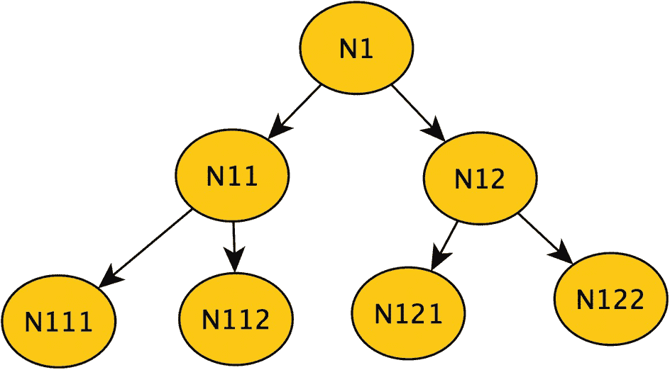

一棵二叉树从 `N 1` 开始，分支为 `N 11` 和 `N 12`。进一步地，它分别分支为 `N 111` 和 `N 112`，以及 `N 121` 和 `N 122`。

图 2-7
示例二叉树

为创建二叉树（或实际上任何有限的子行基数）必须考虑的一个问题是，如何确保不会创建违反结构子节点的节点。有几种有效的方法。使用触发器来计算节点数量是一种方法，另一种是添加节点编号并使用检查约束只允许值 1 和 2，并在 `from` 项上设置唯一索引。

所以：

```
BinaryTree (FromNode, ToNode, NodeNumber (Values IN 1, 2), UNIQUE (From, NodeNumber);
```

缺点是，你有了一个似乎指示节点顺序很重要的列。（在某些系统中，你可能需要这种排序，也许是引导用户的方向或对节点进行排序。）

也可以认为，某种数据完整性可以延迟检查，你只是在进行更改后检查并在之后修复问题，特别是当你的需求变得更加复杂时。无论你*如何*确保完整性得到实施，它都需要被实施。

处理树时的另一个重要概念是树的**平衡**程度。例如，考虑图 2-8。

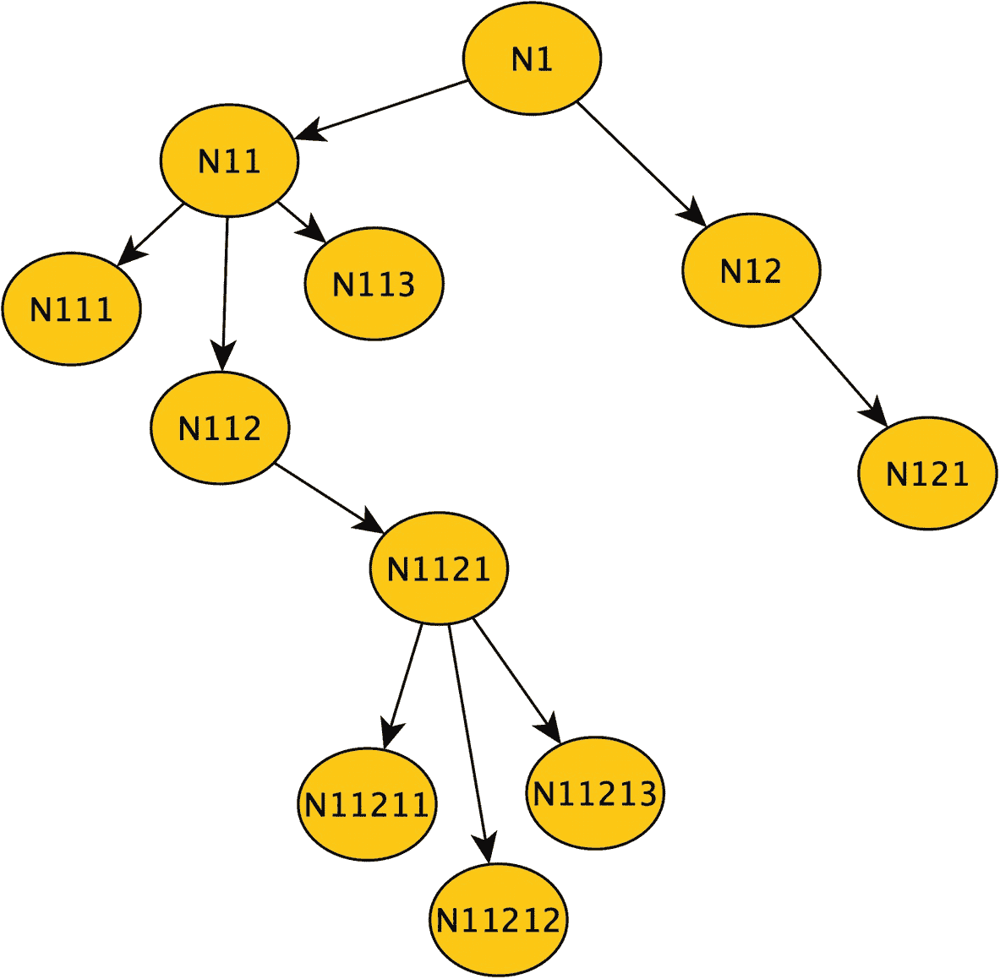

一个不平衡结构的示意图。`N 1` 被划分为 `N 11` 和 `N 12`。`N 11` 被细分为 `N 111`、`N 112` 和 `N 113`。`N 112` 链接到 `N 1121`，然后又被细分为 `N 11211`、`N 11213` 和 `N 11212`。`N 12` 链接到 `N 121`。

图 2-8
一棵不平衡的树

当使用广度优先算法时，一个非常平衡的、**浅**（即从根到叶节点的跳跃次数较少）的结构处理速度更快，因为你需要进行的迭代次数更少。如果你正在创建一个树来搜索索引到某些数据，或者仅仅是表示现实世界中本身就如此的事物时，这可能非常重要。

> 注意
> 在第[6]章中，我将介绍并演示一种实现树结构的替代方法，这种方法得益于其结构的刚性。


### 其他类型的非循环图

尽管树结构使用基本的邻接表格式实现起来相当直接（包括确保数据严格符合仅有一个父节点且无循环的要求），但其他类型的非循环图则不那么简单，因为它们的结构更加灵活。

我们通常会遇到的常见非循环图示例包括 `bills of materials`（物料清单）、`geographies`（地理结构）和 `classifications`（分类体系）。地理结构在许多方面都很有用。例如，你可以将世界建模为根节点，然后是大洲、地区等等。或者从国家开始，再到州、省，最后到城市或邮政编码。

非树结构的非循环图中，一个更为普遍的例子是 `bill of materials`（物料清单）。这种数据结构是一个非常简单、直观的例子，我们都能想象得到。`bill of materials` 是构成某个产品的所有零部件的分解清单。在第 7 章，我将实现一个包含虚构的架子产品零部件的 `bill of materials`。

例如，当你购买一辆汽车时，你购买的是一个单独的物品。但这辆汽车由许多零件组成，共同构成了这个单一的购买单元。为简单起见，让我们从发动机开始。发动机是由包含其他零件的众多零件组成的集合体。而这些零件通常又由其他零件构成，通常一直细分到螺钉、垫圈、螺栓和螺母。组成这辆汽车的许多零件也作为单独的备件出售。

汽车的分解结构本身可以是一棵树。但许多零件和组件可以存在于不止一种车辆类型中。

举一个非常简单的例子，考虑一家制造相框的公司。他们有一个 11 英寸的相框和一个 10 英寸的相框，它们都使用相同的挂装套件。见图 2-9。

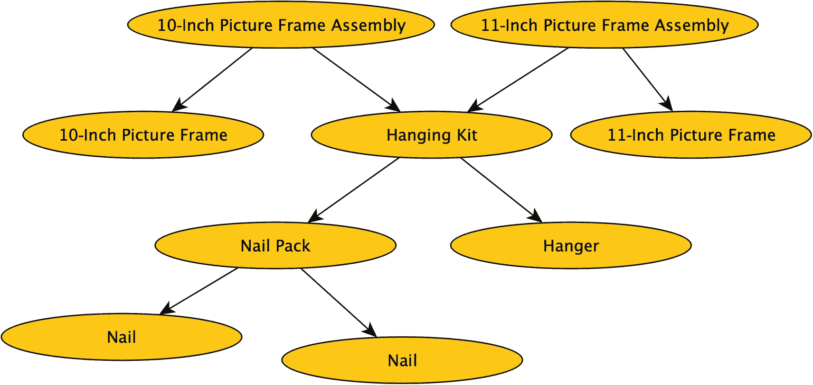

一个树状图。10 英寸相框组件和 11 英寸相框组件分别链接到 10 英寸相框和 11 英寸相框，并共同链接到挂装套件。钉包和挂钩是挂装套件的独立组件。钉包又分解为钉子和钉子。

图 2-9. 简单的物料清单

虽然图中的项目可以有多个前驱节点（在图 2-9 中，你可以看到“挂装套件”有两个前驱节点），但你选取的任何一个起始节点都可以被视为一棵树的根节点。从“挂装套件”开始，你会得到一棵树，其下一层级的节点是“挂钩”和“钉包”。“钉包”包含两个“钉子”（在你的实际实现中，你会在“钉包”到“钉子”的边上使用一个数量（magnitude）来表示倍数。关于边的数量，我将在第 3 章中进一步讨论，因为这对某些设计很重要）。

因此，当你遍历/处理一个 `bill of materials`（或任何非循环图）时，在获取子行数据时，你通常可以将其视为一棵树，而无需担心循环问题。而在加载 `bill of materials` 结构时，你才必须确保不引入循环。与树结构可以通过索引限制一个节点仅存在于一个父行中不同，在这种情况下，你无法通过一个简单的约束来防止循环。

请注意，根据你所使用的工具，如果你需要查看整个结构，将 `bill of materials` 的部分结构视为树的想法可能会失效，这取决于某些图代码的工作方式。这在第 3 章和第 7 章中会更加清晰。

当你向多重继承结构（polyhierarchy）中添加节点时，你需要执行一个查询来搜索循环。就像之前在图 2-4 中的例子（重复为图 2-10），考虑在添加 N3 和 N1 之间的边之前的这个图。


一个循环图结构。节点 N1 链接到 N2，N2 链接到 N3，N3 链接到 N1。

图 2-10. 存在循环的图

一切本来都没问题。但是那条从 N3 到 N1 的新边创建了一个循环。查找循环条件基本上会使用之前讨论的广度优先算法，但在这里，你的查询是寻找与起始节点匹配的节点。因此，在每次迭代中，你都在查找 `FirstNodeId = CurrentNodeId;`，如果找到，那么这就不再是一个非循环图（并且你将不得不采取适当的措施，比如回滚那条边的插入操作）。

这可以在存储过程甚至触发器中完成，如果你想完全防止循环发生的话。当然，如果你需要最佳性能，可能不得不延迟进行循环检查（特别是对于非常大的图），尽管如果数据也被频繁查询，这样做也有缺点。

在本书的示例中，我将经常使用存储过程来管理和查询新节点，因为用户键值很少是你用于代理键的内部值。因此，用户只需要知道 Fred 和 Bob 是朋友，而不需要知道任何内部细节。这也很有用，因为你编写的一些代码可能需要在你开始处理非常大的图时进行调优。

## 循环图

循环图，顾名思义，允许在图中出现环。环的允许通常意味着你不会对节点做太多数学运算，比如汇总子节点的销售额；相反，更可能用于探索节点之间的关系。

你每天使用的几个令人难忘的图的例子，比如在订购产品的网站上。它们用图结构捕捉你的购买历史，并利用你与其他用户的相似性，看看是否能通过告诉你其他像你一样的人订购了什么，让你变得更像他们。

你可能听说过的最著名的图是电影/戏剧《*六度分隔*》的基础。该理论认为，地球上的每个人与其他任何人的朋友联系都不超过六层。其中最著名的是凯文·贝肯。

你会开始注意到许多存储在关系数据库中的设计的一个特点是，你会发现很多关系可以被建模为节点到节点的关系。例如，想一想图 2-11 概念模型中所示的典型销售订单系统。

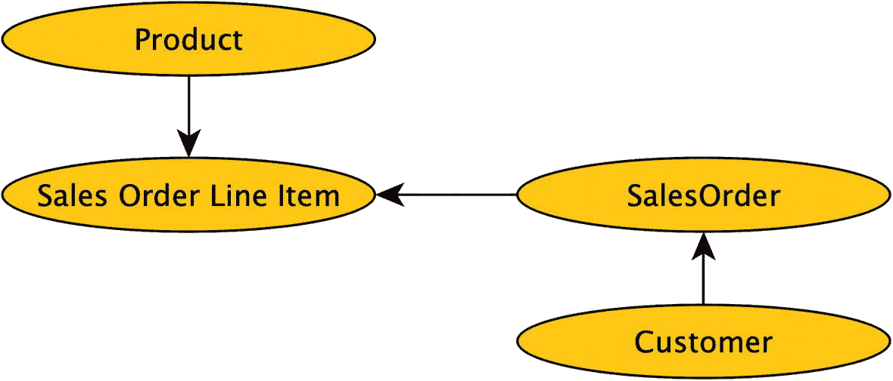
**图 2-11** 销售系统的概念模型

当你分析客户兴趣时，了解他们订购、退回、查看过什么产品等是非常有用的。你可以将这种产品-订单关系放到几个节点中，如图 2-12 所示。

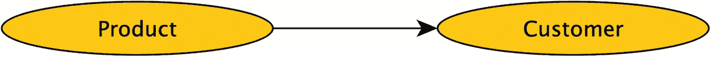
**图 2-12** 将产品与客户关联的图片段

你可以将关系定义为从客户到产品，或从产品到客户（或者两者兼有，我们稍后讨论）。软件通常可以在两个方向上遍历关系，尽管通常不能同时进行。（我们将在无向图部分讨论这个概念）。关键是要始终仔细地命名边，以表明关系是什么，例如 `产品-已购买->客户` 或 `客户-订购（或曾感兴趣）->产品`。

我提到过，在实现有向图时，你只需在同一路径中查找新插入（或更新）的节点，就能确保没有环。考虑图 2-13，它有多个环。

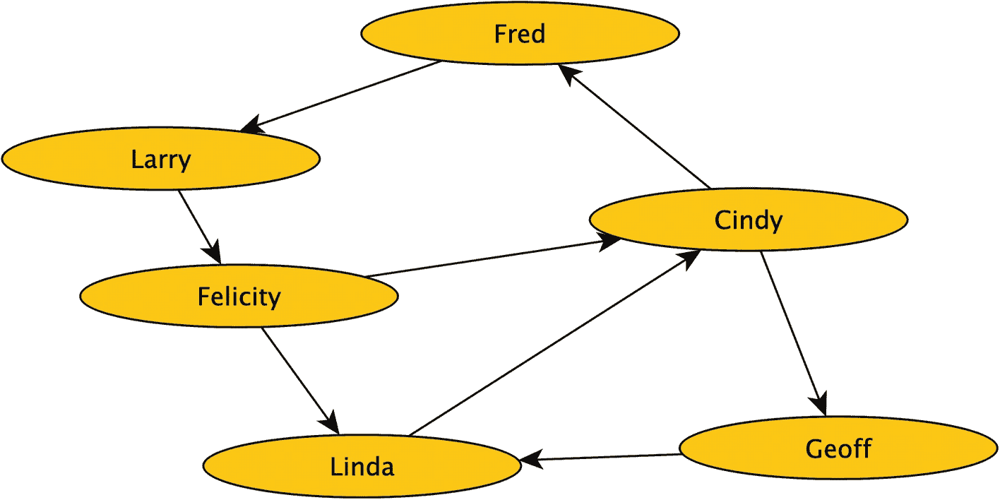
**图 2-13** 包含环的示例图

在编写代码处理此图以查找与 Fred 的连接时，你会看到每个节点都是连接的，并且图中有几个环，其中两个环会回到 Fred，如图 2-14 和图 2-15 所示。

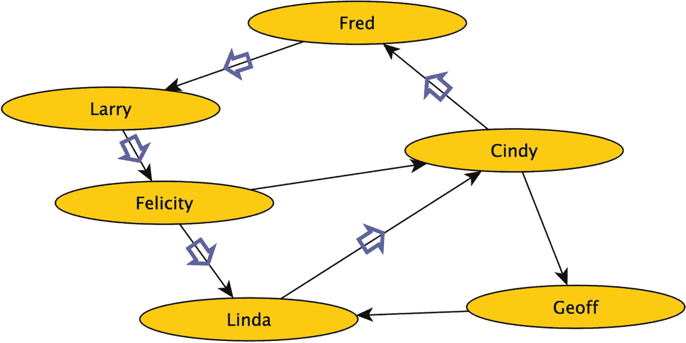
**图 2-15** 从 Fred -> Larry -> Felicity -> Linda -> Cindy -> Fred 的环

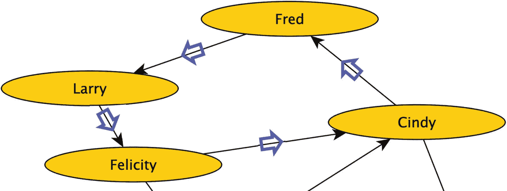
**图 2-14** 从 Fred -> Larry -> Felicity -> Cindy -> Fred 的环

这些回到 Fred 的环，每一个都有一个明显的停止点。

你也已经两次访问了 Cindy 节点。这不一定是一个环，因为你碰到了同一个节点两次。然而，这确实意味着你将开始重复结果，因为重复节点之后的后续树遍历总是相同的。通常，你希望终止其中一个处理路径，因为它会产生重复结果并浪费处理时间。

注意：我不会在本章深入探讨这一点，但在这样的图中，边可以有不同的定义。`Fred -> Larry` 可以是 `喜欢`，而 `Larry -> Felicity` 可以是 `不喜欢`。这是否构成环，取决于你需要如何遍历结构。

但在图 2-16 中，这个环更具挑战性。

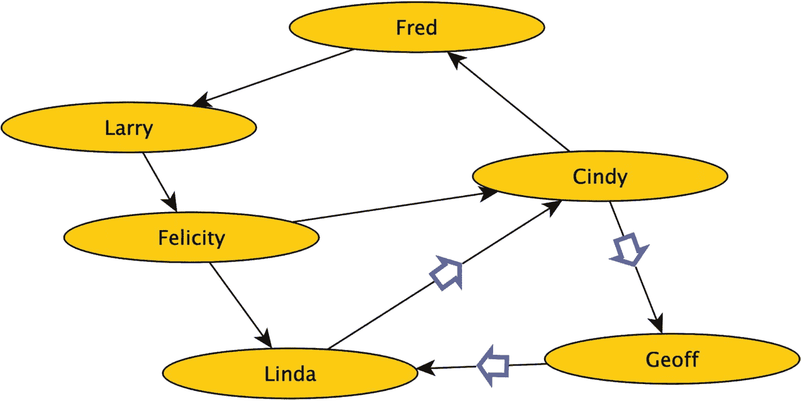
**图 2-16** 从 Cindy -> Geoff -> Linda -> Cindy 的环，未回到起始节点

现在，你不仅需要确保在环回到起始节点时停止处理，还需要确保在图中任何地方出现环时都停止处理。（注意，这在有向图中查找环时不是问题，因为你只处理添加一条边。）如果你开始一次添加多条边，你可能还需要注意在处理中可能产生的这种无限循环。

这一切都引出了对于此类网络最常见的操作：在任意两个节点之间找到一条 `最短路径`，在最后一个例子中就是 `Fred` 到 `Geoff`。从 `Fred` 到 `Geoff` 有两条路径：

*   `Fred -> Larry -> Felicity -> Cindy -> Geoff`
*   `Fred -> Larry -> Felicity -> Linda -> Cindy -> Geoff`

第一条显然是两个节点之间最短的路径，长度为 4。在某些情况下，你可能还想看看最长的路径（风景路线）。

## 加权边

在某些情况下，你可能希望有 `加权节点`。例如，考虑构建一个地图类解决方案的情况。假设你有图 2-17 中的图，它实现了一个从入口节点到目的地节点的地图。

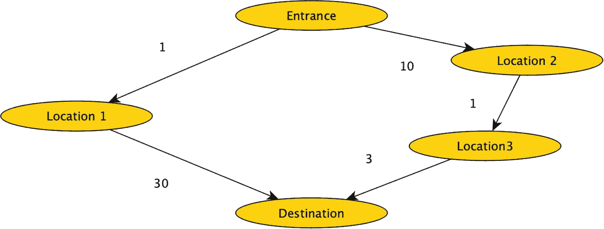
**图 2-17** 具有加权边的图

当你有加权边（如距离）时，基于跳数的最短路径可能并不总是遍历图的最短或最便宜的路径。你也不能开始消除非交叉路径，因为如你在此例中所见，从 `Entrance` 到 `Location 1` 是 1 个单位，但到 `Location 2` 是 10 个单位。然而，从 `Location 1` 出发的下一跳是 30 个单位，而从 `Location 2` 通过 `3` 到 `Destination`，这只有 4 个单位。因此，最短加权路径是跳数更长的那条路径。


### 无向图

有向图的边只表示单向关系。Fred -> Follows -> Bob。这确实表示 Fred 关注了 Bob，但并未说明 Bob 也关注了 Fred。而在无向图中，每条边都表示一种双向关系。

虽然在实现层面通常只能处理有向图，但有时你希望其行为表现得如同每条边都不是有向的——即如果 Fred 连接到 Bob，那么 Bob 也连接到 Fred。在这种情况下，你需要确保每对相关节点之间都有两条方向相反的有向边。这当然会比普通图引入更多的循环，原因有几个。请参考图 2-18 中的示例。

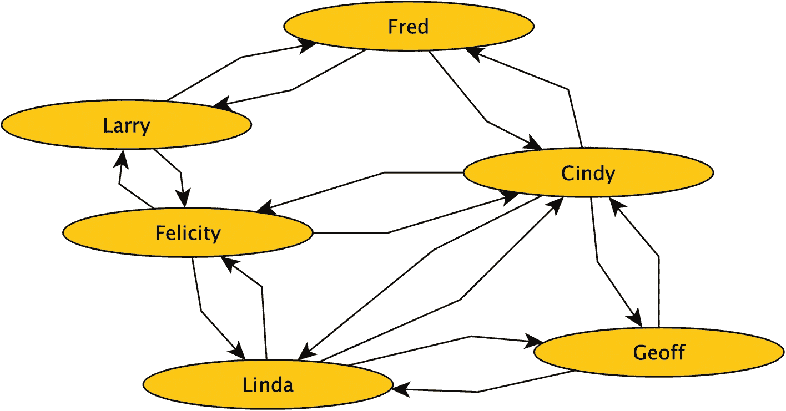

一个图形结构。节点 Fred、Larry、Felicity 和 Cindy 之间，Felicity、Linda、Geoff 和 Cindy 之间，以及 Linda 和 Cindy 之间，链接都是双向的。

图 2-18

来自图 2-13 的图，具有模拟的无向边

在有向形式中，你有三个主要循环。而在这个图中，节点之间的每个关系都是一个循环。然后，每条路径又会产生更多循环。

这看起来似乎是你不想做的事情，但这与“六度分隔”理论的例子将如何体现是类似的。这是因为你将要处理的主要图是`Person -> Worked With -> Person`（或者更具体地说，`Person -> Performed On -> Person <- Performed On <- Person`）。如果 John Wayne 与 Lucille Ball 在*I Love Lucy*上合作过，那么反过来也是成立的，即 Lucille Ball 与 John Wayne 合作过。（或者，如前所述，它将被实现为类似 Lucille Ball 在*I Love Lucy*剧集“Lucy and Harpo Marx”中演出，而 Harpo Marx 也参演了该集。）

在设计图解决方案时，认识到这一点很重要，要注意你正在实现的关系是否确实应该表示一种互惠关系（并确保你的软件将插入、删除和更新两条边行作为一个组）。

## 本章小结

在本章中，你对本书中将要构建示例代码的各种算法进行了高层概览。你首先探索了将定义本书大量代码的算法，无论是内部使用专门的图数据库语法，还是在你需要编写代码以进行专门操作时。（这在下一章讨论如何使用图对象时会更清晰。）

然后你学习了不同类型图的定义，以及你将如何使用它们对不同场景建模并实现它们的基础知识。无环图适用于像树这样的结构，用于定义像文件系统、管辖区域和家谱这样的刚性结构。另一个例子是物料清单（BOM），其中一行在结构中可能有多个前置项，但在结构中出现循环没有意义（因为 BOM 定义了构成其他部件和产品的零件，循环会违背物理定律）。

关系数据库中的循环图实现并不是真正的新事物（大多数多对多关系实际上就是伪装形式的循环图），但它们将这些作为图来处理，并同时使用多个多对多关系（你将在下一章看到）。

最后，你了解了几种可以用来优化树结构处理速度的优化方法。这可能很有帮助，因为树经常涉及报告或检查层次结构的安全性等场景。

