# 3. SQL 图表基础

在本章（以及下一章），是时候开始用 Transact-SQL 代码编写图节点表和边表了。我将带你了解本书剩余部分以及构建你自己的图解决方案所需的所有图语法和技术。

SQL Server 的图扩展语法，甚至图对象创建的内部机制，对你来说可能都显得陌生。对我来说也（现在仍然是）如此。其中一些是基于标准图语法，如果你对 SQL Server 之外的图数据库代码并不陌生，你可能已经接触过。在本书中，我将以 SQL Server 引擎作为你在计算机上实现图的唯一且所需引擎的方式来讲解代码。实际情况并非如此，如果你试图实现一个基本上只有图的数据库，你应该阅读纯图数据库并考虑将其作为替代方案。

我对本书的期望是，你通常了解 T-SQL 语言，知道关系数据库的基础知识，并希望用图数据库的元素来扩展你的关系数据库。

> 注意
> 如果你想了解更多关于设计关系数据库的知识，请查看我的书 *Pro SQL Server Relational Database Design and Implementation*，该书同样由 Apress 出版。

在本书后面，我将提供额外的工具来实现图和树结构（单父有向无环图 (DAG)，缩写是因为 acyclic 这个词很难拼写！），但这关于 SQL Server 图语法的两章介绍将作为本书其余部分的起点。

在本章中，你将实现一个简单的图对象集，加载它们，并学习如何编写代码。下一章将介绍一些使加载和调整对象更容易的技术。本章及所有章节的代码可在 [`https://github.com/Apress/practical-graph-structures`](https://github.com/Apress/practical-graph-structures) 下载。


## 对象创建

在下载文件中，你从一个未指定任何参数创建的数据库开始（因此它基本上与你模型数据库中的状态一致）。你在此数据库中进行的任何操作都完全不需要进行性能调优。

```
CREATE DATABASE TestGraph
GO
USE TestGraph
GO
```

你将开始使用的图具有图 3-1 所示的形状。每个节点代表一个你将实现的“关注”关系。稍后，你将通过示例向该图中添加几种其他类型的节点和边。（图中“人物”的命名是为了让名字易于记忆，并非指代现实世界中的任何个人。）

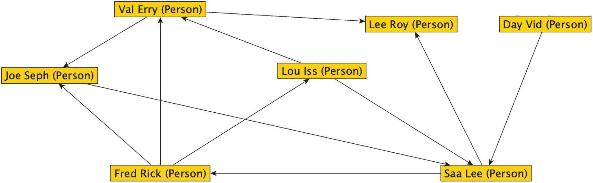

一个由人名组成的图形结构。Val Erry 连接 Lee Roy 和 Joe Seph，Fred Rick 连接 Joe Seph、Val Erry 和 Lou Iss。Joe Seph、Lou Iss 和 Day Vid 连接 Saa Lee。Saa Lee 连接 Fred Rick 和 Lee Roy。

图 3-1

由“关注”边连接“人物”节点的图

在 SQL Server 中创建你的节点和边对象与创建任何其他表完全相同。语法基本相同，只有一点不同：你需要告诉每个对象它是一个节点还是一个边。在下面的脚本中，你将创建实现此图所需的对象。

首先，创建一个架构，因为你通常不希望将任何对象放在 `dbo` 架构中。为你的对象使用特定的架构有利于对象分段，并且绝不会意外地在你的 `master` 数据库中创建一堆对象。

```
IF SCHEMA_ID('Network') IS NULL
EXEC ('CREATE SCHEMA Network');
```

对于人员表，你给一个人赋予 `FirstName` 和 `LastName` 属性，以及一个用于保存两个名字连接的计算列。我经常在示例中使用 `Name` 属性，但我确实想展示一些在 Transact-SQL 代码中需要获取多个属性的情况。前两个对象还有一个 `Value` 列，我将用它来演示数学聚合。

```
CREATE TABLE Network.Person
(
PersonId  int IDENTITY CONSTRAINT PKPerson PRIMARY KEY,
FirstName nvarchar(100) NULL,
LastName  nvarchar(100) NOT NULL,
Name      AS (CONCAT(FirstName + ' ', LastName))PERSISTED,
Value     int NOT NULL
CONSTRAINT DFLTPerson_Value DEFAULT(1),
CONSTRAINT AKPerson UNIQUE(FirstName,LastName)
) AS NODE;
```

只需在典型的表声明中添加 `AS NODE`，这现在就是一个 `NODE` 对象。几页之后，你将探讨这在内部到底意味着什么。接下来，创建你将开始使用的 `EDGE` 对象：

```
CREATE TABLE Network.Follows
(Value INT NOT NULL
CONSTRAINT DFLTFollows_Value DEFAULT(1)
) AS EDGE;
```

请注意，你完全不需要任何列，因此下面也是一个可接受的表声明：

```
CREATE TABLE Network.Follows
AS EDGE;
```

你可以在 `sys.tables` 系统视图中列出 `NODE` 和 `EDGE` 对象：

```
SELECT OBJECT_SCHEMA_NAME(tables.object_id) AS schema_name,
tables.name AS table_name,
tables.is_edge,
tables.is_node
FROM   sys.tables
WHERE  tables.is_edge = 1
OR tables.is_node = 1;
```

执行这些脚本后（这些脚本也可在本书的官方 GitHub 仓库 [`https://github.com/Apress/practical-graph-structures`](https://github.com/Apress/practical-graph-structures) 找到），此语句的输出是

```
schema_name       table_name     is_edge is_node
----------------- -------------- ------- -------
Network           Person         0       1
Network           Follows        1       0
```

此时，你已准备好对象，可以进行下一步：添加一些数据。请注意，本书中的示例仅用 T-SQL 代码完成，但你可以在 Management Studio 的对象资源管理器中找到这些对象，如图 3-2 所示。

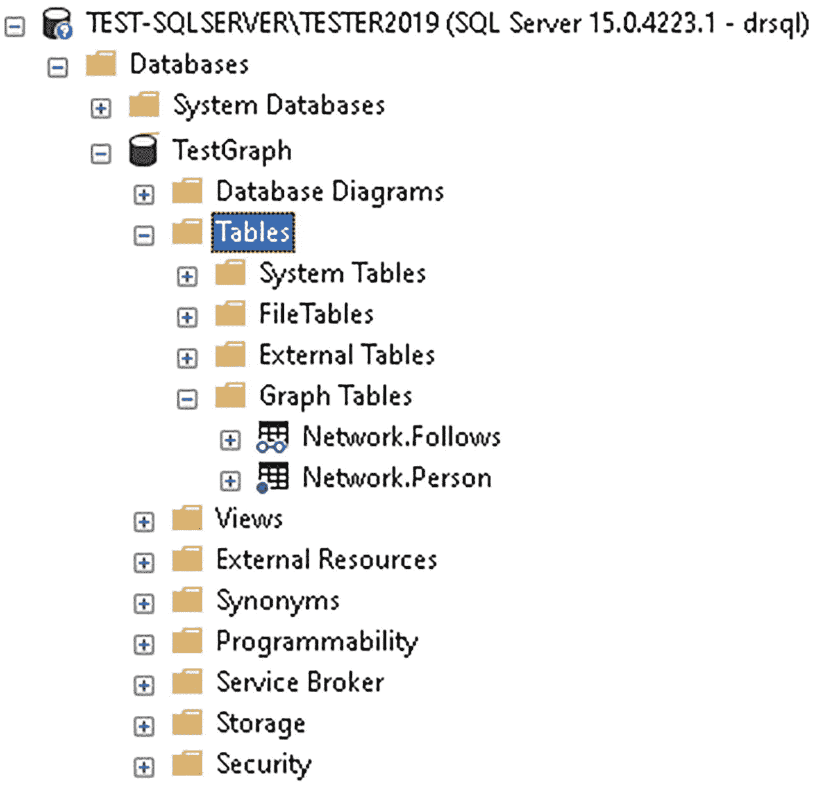

TEST S Q L SERVER TESTER 2019、数据库、系统数据库、Test Graph 的文件夹和文件列表截图，其中高亮显示了包含数据库关系图和表的文件夹。一些子文件夹是系统表和图表，包含 network.follows 和 network.person 文件。

图 3-2

Management Studio 中“图表格”文件夹的位置

如果你使用的是 Azure Data Studio，图表格会像关系表一样显示在列表中。


## 创建数据

当需要向表中添加行时，向 `NODE`（节点）对象添加行与向任何普通表添加行完全一样。你可以使用任何在基础关系表中创建数据所用的语法。所有的内部图形列都将被自动管理（除非你直接管理它们的值，这将在第 4 章中介绍）。

让我们在 `Network.Person` 对象中创建一些数据：
```sql
INSERT INTO Network.Person(FirstName, LastName)
VALUES('Fred', 'Rick'),
('Lou', 'Iss'),
('Val', 'Erry'),
('Lee', 'Roy'),
('Saa', 'Lee'),
('Joe', 'Seph'),
('Day', 'Vid');
```

接下来，让我们使用 `SELECT *` 从表中查看一些数据以获取所有列：
```sql
SELECT *
FROM   Network.Person
WHERE  Person.FirstName = 'Fred'
AND Person.LastName = 'Rick';
```

结果很有趣。你不仅会看到一些额外的列，而且这些列的名称也确实很难处理。第一个输出的列看起来像这样：
```
$node_id_C580185613BB42EF81F4A68F6FA539DC

{"type":"node","schema":"Network","table":"Person","id":0}
```

这个值是对几个内部列的编码（我稍后会讲到），但从 `JSON` 视图中你可以看出这是一个节点，包含模式名、表名，以及一个内部 id 值。该内部 id 是图形数据库引擎的一部分。它与你表中的标识列不同，但非常相似。（不过，正如你将看到的，向其中插入你自己的值要容易得多！）

表的其余部分如你所料：
```
PersonId    FirstName    LastName       Name             Value
----------- ------------ -------------- ---------------- --------
1           Fred         Rick           Fred Rick        1
```

你可以在查询中使用这个复杂的列名（用方括号括起来，因为 `$` 作为首字符告诉 SQL Server 这是一个伪列）：
```sql
SELECT [$node_id_C580185613BB42EF81F4A68F6FA539DC]
FROM   Network.Person
WHERE [$node_id_C580185613BB42EF81F4A68F6FA539DC]  =
'{"type":"node","schema":"Network","table":"Person","id":0}';
```

这段代码返回了与之前相同的 JSON。如果去掉方括号，你会得到以下错误：
```
Msg 126, Level 15, State 2, Line 69
Invalid pseudocolumn "$node_id_3949CAAFE93D496C9A4CF1F33767B666".
```

伪列是 SQL Server 的一个构造，它允许你在不知道确切名称的情况下使用一个值。在其他地方，尤其是在分区中，还有其他的伪列。在这里，你使用 `$node_id` 来代替这个值（当你在你的机器上创建这个表时，这个值很可能会改变）：
```sql
-- 不在方括号中，因为这不是列名
SELECT Person.$node_id
FROM   Network.Person
WHERE  Person.$node_id = '{"type":"node","schema":"Network","table":"Person","id":0}';
```

对于你创建的边，有几个更复杂的列名，你将使用伪列来处理它们，执行以下代码后你就可以看到：
```sql
SELECT *
FROM   Network.Follows;
```

这将返回以下输出（你还没有加载任何数据，所以只是查看结构）：
```
$edge_id_3E64B3D47C09432595C25D1FB2146A35

$from_id_AA09B7FBEA714F918B3C0D19A8B24A0A

$to_id_4E49D534C24E4F4D8E0E0D207237A425

```

此外，边上还添加了一个 `Value` 列供后续使用。

这些列名分别被简写为 `$edge_id`、`$from_id`、`$to_id`。后两者需要输入来自节点的 `$node_id` 来标识关系中的起始节点和终止节点。在输入数据时，基本模式类似于以下形式（在下一章，我将展示一些其他的数据创建模式）。基本格式是需要在子查询中查找 `$from_id` 和 `$to_id` 的值：
```sql
INSERT INTO Network.Follows($from_id, $to_id)
SELECT (   SELECT Person.$node_id
FROM   Network.Person
WHERE  Person.FirstName = 'Fred'
AND Person.LastName = 'Rick') AS from_id,
(   SELECT Person.$node_id
FROM   Network.Person
WHERE  Person.FirstName = 'Joe'
AND Person.LastName = 'Seph') AS to_id;
-- from_id 和 to_id 只是为了在调试时更容易查看而起的名字。
-- 可以是任意名称。
```

现在查看这些数据，你可以看到：
```sql
SELECT *
FROM   Network.Follows;
```

输出有四列。注意你的列名几乎肯定会不同，并且你可能也有不同的 id 值。
```
$edge_id_3E64B3D47C09432595C25D1FB2146A35

{"type":"edge","schema":"Network","table":"Follows","id":0}
$from_id_AA09B7FBEA714F918B3C0D19A8B24A0A

{"type":"node","schema":"Network","table":"Person","id":0}
$to_id_4E49D534C24E4F4D8E0E0D207237A425

{"type":"node","schema":"Network","table":"Person","id":5}
```

你也可以像处理任何其他表一样，使用文本值来插入数据。（首先，清空表，因为你还没有防止重复，这将在下一章介绍。）
```sql
TRUNCATE TABLE Network.Follows;
-- 使用 truncate 是为了让 id 值重置，只是为了在我的示例中更清晰。
-- 在实际使用中不需要这样做，在这种情况下这也不那么重要。
```

现在你可以直接使用文本值再次插入行：
```sql
INSERT INTO Network.Follows($from_id, $to_id) VALUES ('{"type":"node","schema":"Network","table":"Person","id":0}',
'{"type":"node","schema":"Network","table":"Person","id":5}');
```

注意，这些项目是可以直接输入的值，但它们并不是存储在 SQL Server 中的实际值。内部有几列 `bigint` 类型被表示出来。（在下一章，我将向你展示更多关于数据在内部如何格式化的信息，以及当从外部源加载数据时，如何利用这种文本格式的优势。）

在下载文件中，剩余的行将使用第一种基于查找的格式插入，`SELECT` 语句由 `UNION ALL` 运算符分隔。接下来，让我们展示已创建的数据。

以下查询是你很少想要执行的，因为目标将是尽量不直接获取内部值。在接下来的几页中，我将开始介绍如何使用 SQL 图形运算符来查询这些数据。然而，这个查询与我们最简单的图形查询直接类似，并且了解如何执行此操作是有用的，因为在使用 SQL 图形运算符时，没有什么像 `OUTER JOIN` 这样的东西。
```sql
SELECT Person.Name AS PersonName,
FollowedPerson.Name AS FollowedPersonName
FROM   Network.Person
JOIN Network.Follows
ON Person.$node_id = Follows.$from_id
JOIN Network.Person AS FollowedPerson
ON FollowedPerson.$node_id = Follows.$to_id;
```

此查询的输出是你创建的每一条边，显示人物的姓名和他们关注的人的姓名：
```
PersonName     FollowedPersonName
-------------- ----------------------
Fred Rick      Joe Seph
Fred Rick      Lou Iss
Joe Seph       Saa Lee
Saa Lee        Lee Roy
Val Erry       Joe Seph
Val Erry       Lee Roy
Lou Iss        Saa Lee
Lou Iss        Val Erry
Saa Lee        Fred Rick
Fred Rick      Val Erry
Day Vid        Saa Lee
```

如果你回头查看图 3-1，你可以追踪列表中从没有箭头的末端到有箭头末端的每一条线。

## 查询数据

使用 SQL 图形运算符查询数据有点复杂，但它所替代的代码也很复杂。在上一节中，你使用 `JOIN` 运算符查询数据，但在接下来的章节中，这些代码将以一种更紧凑的方式表达。这种紧凑性伴随着一定程度的复杂性。

你将查看两个级别的数据查询。首先，你将查看直接的节点到节点查询，即你知道要在路径上查找多远来匹配。其次，你将查看遍历所有可能的路径，寻找连接相隔可变长度的节点的方法。


### 节点到节点查询

使用 SQL 图对象进行编码时，首要任务是理解查询的工作原理。它们有时与你可能写过的常规 SQL 查询大不相同。最大的区别在于，你将查询图引擎，该引擎是专门为处理单一数据类型而编写的。数据虽然复杂，但由于它遵循特定模式，其语法要通用得多。

你将使用的语法是 `MATCH` 表达式。它基本上在内部返回一个连接（join）或一组连接的布尔值 TRUE 或 FALSE。例如，以下是几页前的查询使用 `MATCH` 表达式的重写版本：

```sql
SELECT      Person.Name AS PersonName,
            FollowedPerson.Name AS FollowedPersonName
FROM        Network.Person,
            Network.Follows,
            Network.Person AS FollowedPerson
WHERE MATCH(Person-(Follows)->FollowedPerson);
```

此查询的输出与之前的查询结果相同（可能排序不同，因为没有 `ORDER BY` 子句）。让我详细解释一下。

```sql
FROM        Network.Person,
            Network.Follows,
            Network.Person AS FollowedPerson
```

图查询语法最奇怪的特点之一是，当你使用 `MATCH` 表达式时，不能在查询中使用任何 `ANSI-92` 风格的连接，甚至不能使用逗号等效的 `CROSS JOIN`。尝试下面的查询：

```sql
SELECT      CAST(Person.Name AS nvarchar(20)) AS PersonName,
            FollowedPerson.Name AS FollowedPersonName
FROM        Network.Person
CROSS JOIN  Network.Follows
CROSS JOIN  Network.Person AS FollowedPerson
WHERE MATCH(Person-(Follows)->FollowedPerson);
```

你将看到以下错误：

```
Msg 13920, Level 16, State 1, Line 221
Identifier 'Follows' in a MATCH clause is used with a JOIN clause or APPLY operator. JOIN and APPLY are not supported with MATCH clauses.
```

你还会看到针对 `Person` 和 `FollowedPerson` 的另外两条错误消息。任何用于获取额外数据的其他连接都需要以不同的方式获取（后面会有示例）。

```sql
FROM        Network.Person,
            Network.Follows,
            Network.Person AS FollowedPerson
WHERE MATCH(Person-(Follows)->FollowedPerson);
```

现在来看 `MATCH` 子句。使用一种 `ASCII` 艺术来表示，最基本的 `MATCH` 子句具有 `ObjectName-(Edge)->OtherObjectName` 形式，大致可翻译为将 `ObjectName` 连接到 `Edge`，再将 `Edge` 连接到 `OtherObjectName`。如果你使用 SQL 图的唯一目的是实现单一的多对多关系，那么可能不值得使用这些对象。然而，正如我将在本章及本书后续部分展示的，你可以通过多个边和节点编写一些非常复杂的连接，以一种实际上更易于理解的方式（一旦你理解了 `MATCH` 表达式相当复杂的本质）来提出复杂的问题。

如前所述，你不能在图表查询中执行任何 `ANSI` 风格的连接，因此你有两种选择。你可以使用一个 `CTE` 来获取图结果，然后连接你的额外结果，如下所示：

```sql
WITH GraphPart AS (
    SELECT      Person.Name AS PersonName,
                FollowedPerson.Name AS FollowedPersonName,
                Person.FirstName
    FROM        Network.Person,
                Network.Follows,
                Network.Person AS FollowedPerson
    WHERE MATCH(Person-(Follows)->FollowedPerson))
SELECT GraphPart.PersonName, GraphPart.FollowedPersonName,
       Colors.ColorName
FROM   GraphPart
--这也可以是一个 CTE 或一个实际的表
JOIN (SELECT 'blue' AS ColorName
      UNION ALL
      SELECT 'red') AS Colors
ON CASE WHEN GraphPart.FirstName = 'Fred'
         THEN 'blue'
         ELSE 'red'
    END = Colors.ColorName;
```

或者，你可以在 `FROM` 子句的逗号分隔列表中直接分离出其他表、视图或（如我所使用的）派生表：

```sql
SELECT      CAST(Person.Name AS nvarchar(20)) AS PersonName,
            FollowedPerson.Name AS FollowedPersonName,
            Colors.ColorName
FROM        Network.Person,
            Network.Follows,
            Network.Person AS FollowedPerson,
            (   SELECT 'blue' AS ColorName
                UNION ALL
                SELECT 'red') AS Colors
WHERE MATCH(Person-(Follows)->FollowedPerson)
--到派生表的连接子句
AND CASE WHEN Person.FirstName = 'Fred'
         THEN 'blue'
         ELSE 'red'
     END = Colors.ColorName;
```

由于无法使用 `ANSI-92` 连接语法，因此无法执行 `OUTER JOIN`，所以你需要小心编写连接条件，以避免意外丢失想要返回的数据。

#### 过滤输出

当你想使用基础的 `MATCH` 表达式过滤查询输出时，可以像在任何查询中一样进行过滤。因此，要只查看 `Lou Iss` 关注的人，

```sql
SELECT Person.Name AS PersonName,
       FollowedPerson.Name AS FollowedPersonName
FROM   Network.Person,
       Network.Follows,
       Network.Person AS FollowedPerson
WHERE  Person.FirstName = 'Lou'
  AND  Person.LastName = 'Iss'
  AND  MATCH(Person-(Follows)->FollowedPerson);
```

这将只返回 `PersonName` 为 `Lou Iss` 的人。在 图 3-3 中，你可以看到遍历的路径。

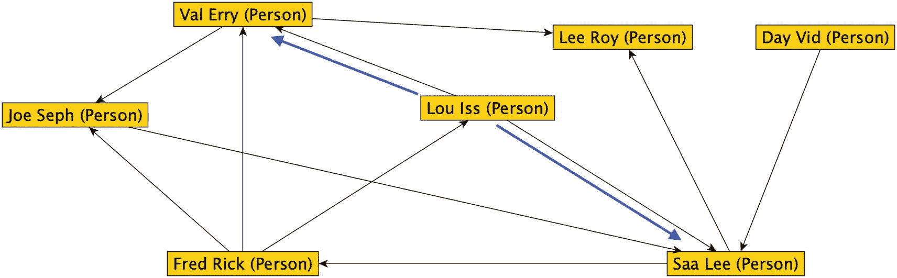

图 3-3
在 MATCH 子句中从 Lou Iss 到直接相关人物的遍历路径

查询结果如下：

```
PersonName           FollowedPersonName
-------------------- ---------------------
Lou Iss              Saa Lee
Lou Iss              Val Erry
```

第一个查询给出了一个人关注的人。要找到关注某个人的人，请反转 `MATCH` 操作符中的箭头方向：

```sql
SELECT FollowedPerson.Name AS Person, Person.Name AS Follows
FROM   Network.Person,
       Network.Follows,
       Network.Person AS FollowedPerson
WHERE  Person.FirstName = 'Lou'
  AND  Person.LastName = 'Iss'
  AND  MATCH(Person<-(Follows)-FollowedPerson);
```

这将反向遍历图，如你在 图 3-4 中所见。

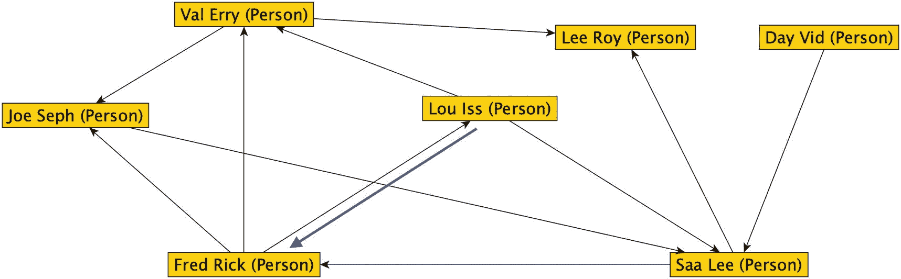

图 3-4
使用 MATCH 子句反向遍历图，获取 Lou Iss 的父行

正如预期，查询返回：

```
Person    Follows
--------- ----------
Fred Rick Lou Iss
```

从图的任意给定点开始查询，是你在示例代码中会非常频繁使用的操作，特别是用于查找节点的子行，并经常用于计数或求和其数据。在某些情况下，你甚至会从每个节点开始，查找与每个其他节点的关系。


### 多个 MATCH 表达式

你最初使用的是一个简单的 `MATCH` 表达式，但在同一个查询中，你可以执行多个 `MATCH` 表达式。为了更方便地演示这一点，让我们向图中添加一种新的节点类型——编程语言，如图 3-5 所示。三个颜色较浅、后缀为 `ProgrammingLanguage` 的节点就是新增加的。边 `ProgramsWith` 记录了一个人使用某种编程语言进行编程的时机。（为了清晰起见，我未在图上标注边的名称。）

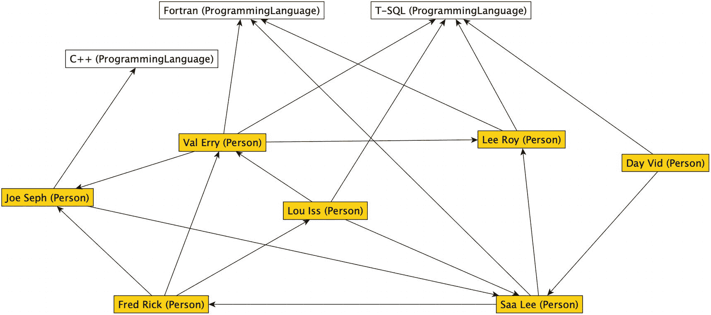

一个图形化表示，显示名为 Val Erry、Lee Roy、Day Vid、Joe Seph、Lou Iss、Fred Rick 和 Saa Lee 的人物彼此链接。Joe Seph 链接到 C++，Val Erry、Saa Lee 和 Lee Roy 链接到 Fortran，而 Val Erry、Lou Iss、Lee Roy 和 Day Vid 链接到 T-SQL 编程语言。

图 3-5：在示例图中引入 `ProgrammingLanguage`

```sql
CREATE TABLE Network.ProgrammingLanguage
(
    Name nvarchar(30) NOT NULL
) AS NODE;
--加载节点值
INSERT INTO Network.ProgrammingLanguage(Name)
VALUES('C++'),
      ('T-SQL'),
      ('Fortran');
```

接下来，创建 `EDGE` 对象。在这种情况下，你不会添加任何列，因此该对象中唯一的列将来自图数据库。

```sql
CREATE TABLE Network.ProgramsWith AS EDGE;
```

和之前一样，使用两个查询向两个不同的对象添加行：

```sql
INSERT INTO Network.ProgramsWith($from_id, $to_id)
SELECT (SELECT $node_id
        FROM   Network.Person
        WHERE  FirstName = 'Lou'
        AND    LastName = 'Iss') AS from_id,
       (SELECT $node_id
        FROM  Network.ProgrammingLanguage
        WHERE Name = 'T-SQL') as to_id;
```

其余的数据加载语句可在下载内容中找到。

首先，让我们查看使用编程语言进行编程的人：

```sql
SELECT      Person.Name AS Person,
            ProgrammingLanguage.Name AS ProgrammingLanguage
FROM        Network.Person AS Person,
            Network.ProgramsWith AS ProgramsWith,
            Network.ProgrammingLanguage AS ProgrammingLanguage
WHERE MATCH(Person-(ProgramsWith)->ProgrammingLanguage)
ORDER BY    Person.Name;
```

返回结果：

```text
Person          ProgrammingLanguage
--------------- -------------------
Day Vid         T-SQL
Joe Seph        C++
Lee Roy         Fortran
Lee Roy         T-SQL
Lou Iss         T-SQL
Saa Lee         Fortran
Val Erry        Fortran
Val Erry        T-SQL
```

在图 3-5 中，你可以看到 `Val` 和 `Lee` 都有多条链接，因此它们在输出中有多个行。Fred 没有链接任何语言，因此他不会出现在列表中。如果不添加一个“不是程序员”的节点并链接到他，或者不使用 `UNION ALL` 结合类似以下的查询，就无法让 Fred 出现在此列表中：

```sql
SELECT Person.Name AS PersonName,
       NULL AS ProgrammingLanguage
FROM   Network.Person
WHERE  $node_id NOT IN (SELECT $from_id
                        FROM   Network.ProgramsWith);
```

这将返回没有编程语言的行：

```text
PersonName      ProgrammingLanguage
--------------- -------------------
Fred Rick       NULL
```

现在，你可以使用 `MATCH` 表达式来查找共享编程语言技能的人。为此，使用 `Person` 的两个虚拟副本和边的两个虚拟副本（在 `MATCH` 表达式中，一条边不能被多次使用，但表可以重复使用，如果合理的话。）。图 3-6 显示了与 `Lou Iss` 相连的 `ProgrammingLanguage` 节点以及连接到该语言的其他 `Person` 节点的子图。

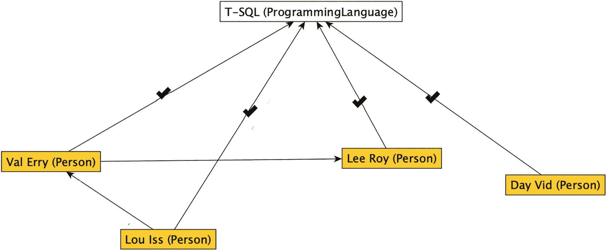

一个图形化表示，显示名为 Val Erry、Lee Roy、Day Vid 和 Lou Iss 的人物指向 T-SQL 编程语言，链接上有勾号标记。Lou Iss 链接到 Val Erry，而 Val Erry 链接到 Lee Roy。

图 3-6：展示与 Lou Iss 共享编程语言技能的交集人员的图示

以下查询通过本质上将此集合与自身连接并使用两个过滤器来实现这一点。你将它们连接起来得到四个输出行。然后过滤掉 `Lou Iss` 与自身匹配的那一行，得到三个匹配项。

```sql
SELECT      Person.Name AS Person,
            Person2.Name AS Person2,
            ProgrammingLanguage.Name AS ProgrammingLanguage
FROM        Network.Person AS Person,
            Network.Person AS Person2,
            Network.ProgramsWith AS ProgramsWith,
            Network.ProgrammingLanguage AS ProgrammingLanguage,
            Network.ProgramsWith AS ProgramsWith2
WHERE MATCH(Person-(ProgramsWith)->ProgrammingLanguage)
  AND MATCH(Person2-(ProgramsWith2)->ProgrammingLanguage)
--每个人都会匹配自身
  AND Person2.PersonId <> Person.PersonId
  AND Person.Name = 'Lou Iss'
ORDER BY    Person.Name, Person2.Name;
```

此查询的输出如描述所示（三行）：

```text
Person        Person2     ProgrammingLanguage
------------- ----------- -------------------
Lou Iss       Day Vid     T-SQL
Lou Iss       Lee Roy     T-SQL
Lou Iss       Val Erry    T-SQL
```

你可以使用这种 `MATCH` 表达式的其他格式。事实上，你可以将 `Person` 到 `ProgrammingLanguage` 的两个 `MATCH` 表达式在一个 `ASCII` 艺术版本的查询中表达，像这样：

```sql
WHERE MATCH(Person-(ProgramsWith)->ProgrammingLanguage<-(ProgramsWith2)-Person2)
```

另一种变体是，在单个 `MATCH` 表达式中表达了等式的两侧。最后，既然你可能无法像那样将所有内容组合到一个 `MATCH` 表达式中，你可以在 `MATCH` 表达式中直接使用 `AND`：

```sql
WHERE  MATCH(Person-(ProgramsWith)->ProgrammingLanguage
        AND Person2-(ProgramsWith2)->ProgrammingLanguage)
```

你甚至可以将 `Person` 到 `Person2` 的关系也纳入 `MATCH` 表达式中！

```sql
WHERE MATCH(Person-(ProgramsWith)->ProgrammingLanguage<-(ProgramsWith2)-Person2)
```

是否要将所有内容塞进一个长长的 `ASCII` 艺术表达式是另一个讨论话题，因为这可能难以处理（尤其是在对一个未提供预期结果的查询进行故障排除时）。

在下一个查询中，让我们寻找彼此关注（follow）并且共享编程语言的人。这类查询，结合通用的多对多表，是 SQL 图对象强大功能的一部分。

```sql
SELECT      Person.Name AS Person,
            Person2.Name AS Person2,
            ProgrammingLanguage.Name
FROM        Network.Person AS Person,
            Network.Person AS Person2,
            Network.ProgramsWith AS ProgramsWith,
            Network.ProgrammingLanguage AS ProgrammingLanguage,
            Network.ProgramsWith AS ProgramsWith2,
            Network.Follows AS Follows
WHERE MATCH(Person-(ProgramsWith)->ProgrammingLanguage)
  AND MATCH(Person2-(ProgramsWith2)->ProgrammingLanguage)
  AND MATCH(Person-(Follows)->Person2)
  AND Person2.PersonId <> Person.PersonId
  AND Person.Name = 'Lou Iss'
ORDER BY    Person, Person2, Name;
```

这将集合进一步向下过滤，如图 3-7 所示。在那些也使用 Lou Iss 所用编程语言进行编程的人的子集中，`Lou Iss` 只关注了 `Val Erry`。

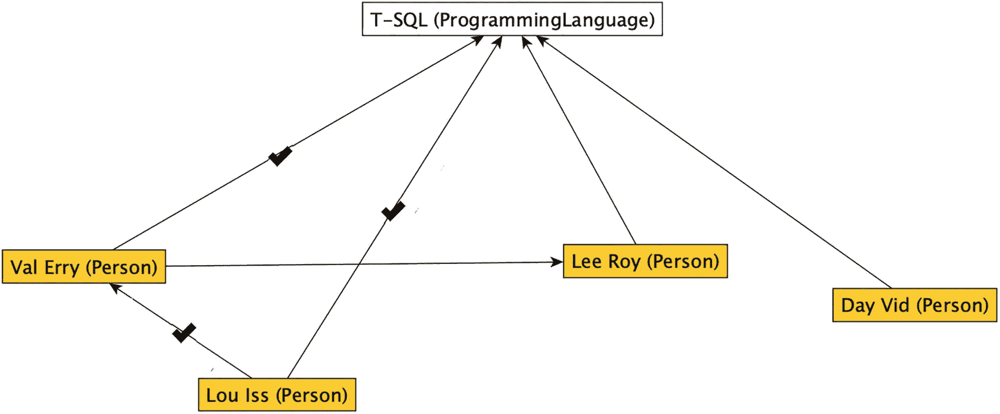

一个图形化表示，显示人物名称。勾号标记位于 Lou Iss 到 Val Erry 的链接上，以及 Val Erry 和 Lou Iss 到 T-SQL 编程语言的链接上。Lee Roy 和 Day Vid 链接到 T-SQL 编程语言，而 Val Erry 链接到 Lee Roy。

图 3-7：在之前的查询中添加额外的关注关系

查询返回 Lou Iss 所关注的、同时也使用 T-SQL 编程的那一个人：

```text
Person       Person2       ProgrammingLanguage
------------ ------------- ------------------------------
Lou Iss      Val Erry      T-SQL
```

你可以利用多层的 `MATCH` 表达式将边和节点绑定在一起，从而创建丰富的查询，以多种方式查找节点之间的相似之处。


### 遍历变量层级路径

到目前为止，我已经介绍了如何在数据结构中进行单次跳跃。虽然 `MATCH` 子句使得编写多重连接变得更容易，但图结构的强大之处通常在于查询更长的路径，以了解节点是如何连接的。

例如，假设你想查找图中所有与 `Day Vid` 在任意层级遍历中相连的人。从 `Day Vid` 到 `Saa Lee` 只有一个直接连接，但 `Saa` 与几个人相连，并且在图的第三次遍历中，`Fred Rick` 又与另外三个人相连，如图 3-8 所示。

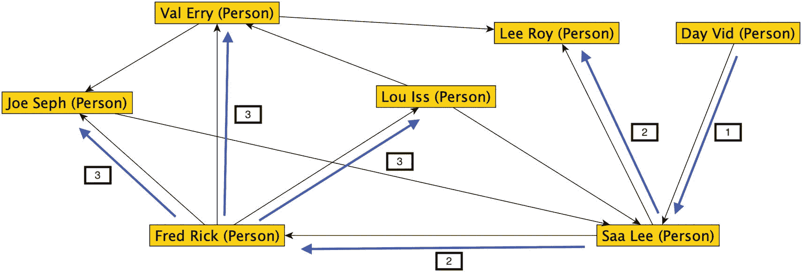

图 3-8：与 Day Vid 相连的所有人

当所有节点都被触达后，我就停止了遍历。例如，我没有从 `Val Erry` 继续到 `Joe Seph`，因为 `Joe` 已经被到达过了。这是因为我们已经有了从 `Day Vid` 到 `Joe Seph` 的最短行走/路径。而且从 `Joe Seph` 到 `Saa Lee` 的路径会形成一个环路。任何环路都不能经过我们的起始节点，但当节点的度数非常高时（例如，`Saa Lee` 有五个连接，三个传入，两个传出），图中总是很可能存在环路。

当你需要以这种方式处理图时，SQL Server 在 `MATCH` 表达式中实现了一个 `SHORTEST_PATH` 子句，用于（毫不奇怪地）找到两个节点之间尽可能最短的路径。它是一条（据我们所知）随机的路径，因为如果通过图有多条路径，它只会选择一条。（当我讨论如何处理加权图时，这一点将再次演示，截至 SQL Server 2022，SQL Server 在语法中并未实现加权图。）

使用 `SHORTEST_PATH` 的语法有点棘手，有些语法部分我花了相当多功夫才学会。（每次编写最短路径查询时，我仍然需要查阅确切的细节，而且我并不为此感到羞愧！）

#### 显示路径中的最后一个节点

在下一个查询中，你将执行一个最小化的查询，以获取从 `Lou Iss` 节点到任何其他相连节点的最短路径。在展示查询和结果后，我将分解其语法。

```sql
SELECT Person.Name,
LAST_VALUE(FollowedPerson.Name) WITHIN GROUP (GRAPH PATH)
AS ConnectedPerson
FROM   Network.Person AS Person,
Network.Follows FOR PATH AS Follows,
Network.Person FOR PATH AS FollowedPerson
WHERE  Person.FirstName = 'Lou'
AND Person.LastName = 'Iss'
AND MATCH(SHORTEST_PATH(Person(-(Follows)->FollowedPerson)+));
```

此查询的输出是除 `Day Vid` 之外的每个节点：

```text
Person        ConnectedPerson
------------- ---------------
Lou Iss       Val Erry
Lou Iss       Saa Lee
Lou Iss       Fred Rick
Lou Iss       Lee Roy
Lou Iss       Joe Seph
Lou Iss       Lou Iss
```

你可以在图 3-9 中看到为获取 `ConnectedPerson` 输出中的每个值所遵循的不同路径。例如，`Joe Seph` 被包含在内，是因为你可以遵循从 `Lou Iss` 到 `Val Erry` 再到 `Joe Seph` 的路径。

要获得该输出，只需遍历图并添加找到的每个节点。在第一次遍历时，你添加 `Val Erry` 和 `Saa Lee`。在第二次遍历时，添加 `Lee Roy` 和 `Fred Rick`，依此类推。输出不包含任何额外细节，因此你只需到达该节点即可。不会有任何重复项，因为你找到的是节点之间的最短路径，如果存在多条路径，它只返回其中一条。

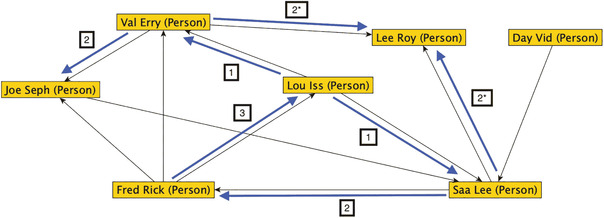

图 3-9：查找 Lou Iss 与其他节点之间的最短路径

请注意，`Lou Iss` 的节点出现在输出中，因为在广度优先算法的第三次迭代中它被到达了。

在查询中，包含了一些新内容。首先看 `FROM` 子句，你在用于计算路径的边和节点对象中添加了 `FOR PATH`。锚对象，在这个例子中是 `Network.Person` 的一个副本，可以直接在查询输出中使用，就像查询输出中的 `Person.Name` 一样。带有 `FOR PATH` 的对象只能用于图聚合函数，例如 `LAST_VALUE` 函数。

```sql
FROM   Network.Person AS Person,
Network.Follows FOR PATH AS Follows,
Network.Person FOR PATH AS FollowedPerson
```

`MATCH` 表达式也包含更多内容：

```sql
AND MATCH(SHORTEST_PATH(Person(-(Follows)->FollowedPerson)+));
```

你可以看到 `SHORTEST_PATH` 位于 `MATCH` 表达式内部，它本身又接收锚对象作为输入，然后是与之前相同的路径对象语法。`+` 号表示你需要所有层级。你可以使用 `{1-N}` 指定要处理多少层级。你总是从第一级开始，但然后可以指定沿路径向下处理多远。当你需要处理一个巨大的图并且不一定需要查看距离锚点 1,000 跳之外的项目时，这可能是至关重要的。`SHORTEST_PATH` 表达式可以更复杂（我将演示！），并且你也可以包含其他 `MATCH` 条件。

```sql
LAST_VALUE(FollowedPerson.Name) WITHIN GROUP (GRAPH PATH)
AS ConnectedPerson
```

在使用 `SHORTEST_PATH` 时，`LAST_VALUE` 可能是你可以使用的图函数中最重要的一个，因为它的输出来自连接节点的一个值。它通常将是你用来向用户显示信息片段或获取键值以连接到其他对象的值。

你可以在查询中使用 `LAST_VALUE` 函数（以及大多数其他函数），就像使用任何列一样（尽管在书籍文本中展示要复杂得多！）。例如，如果你没有连接的名字列，你可以使用以下语法输出名字：

```sql
CONCAT(
LAST_VALUE(FollowedPerson.Firstname) WITHIN GROUP (GRAPH PATH),
' ',
LAST_VALUE(FollowedPerson.LastName) WITHIN GROUP (GRAPH PATH))
AS Name
```


#### 路径聚合

现在，你已经掌握了基本概念。（请相信我；你可能需要反复尝试很多次才能真正消化吸收！）那么，让我们看看可以为输出添加的其他功能。你可以执行诸如 `COUNT` 之类的聚合操作。`COUNT` 是获取节点间跳数（hops）的标准方法。例如：

```sql
SELECT Person.Name AS Person,
LAST_VALUE(FollowedPerson.Name) WITHIN GROUP
(GRAPH PATH) as ConnectedPerson,
COUNT(FollowedPerson.PersonId) WITHIN GROUP
(GRAPH PATH) as Level
FROM   ...
```

当使用这个 `SELECT` 子句时，`COUNT` 聚合会计算每次节点之间发生跳跃的次数。在输出中，你可以看到 `Val` 和 `Saa` 直接连接到 `Lou`，所以是一跳。`Fred`、`Joe` 和 `Lee` 是两跳。而返回到 `Lou` 则需要三跳。

```
Person        ConnectedPerson   Level
------------- ----------------- -----------
Lou Iss       Val Erry          1
Lou Iss       Saa Lee           1
Lou Iss       Fred Rick         2
Lou Iss       Lee Roy           2
Lou Iss       Joe Seph          2
Lou Iss       Lou Iss           3
```

接下来要添加的是实际遍历以达到输出的 `LAST_VALUE` 值的路径。这是在调试此代码并向用户显示输出时最有用的工具之一。最短路径输出中表示的每个节点的节点标签。

这是使用 `STRING_AGG` 完成的，它最清晰地展示了此算法如何执行广度优先查询。对于每次迭代，`FollowedPerson.Name` 的值都会被添加到列表中（并且只有在存在另一次迭代时，它才会包含 `'->'` 值，因为在 `STRING_AGG` 函数中，第二个参数是分隔符）。

```sql
SELECT Person.Name,
STRING_AGG(FollowedPerson.Name, '->') WITHIN GROUP
(GRAPH PATH) AS Path
FROM...
```

此查询的输出是

```
Name        Path
----------- ---------------------------------
Lou Iss     Val Erry
Lou Iss     Saa Lee
Lou Iss     Saa Lee->Fred Rick
Lou Iss     Val Erry->Lee Roy
Lou Iss     Val Erry->Joe Seph
Lou Iss     Saa Lee->Fred Rick->Lou Iss
```

请注意，从 `Lou` 到 `Lee` 的路径只经过了 `Val`。在图表上，它还经过了 `Saa`。本章后面，我将演示如何在输出中包含所有路径。（它不会像这些查询那样整洁有序！）

在许多情况下，所选路径包含哪些节点对你的输出应该没有太大影响。也就是说，除非你开始对路径中的节点进行聚合操作，或者想从多条路径中进行选择。那样就会变得稍微复杂一些。

我在创建图时，在每个边和节点上都包含了值列，以便我们将其与 `COUNT` 输出进行比较，因为每个值都是 `1`。

```sql
SELECT STRING_AGG(FollowedPerson.Name, '->')WITHIN GROUP
(GRAPH PATH) AS PATH,
COUNT(FollowedPerson.PersonId) WITHIN GROUP (GRAPH PATH)
AS Level,
SUM(FollowedPerson.Value) WITHIN GROUP (GRAPH PATH)
AS SumNodeValues,
SUM(Follows.Value) WITHIN GROUP (GRAPH PATH)
AS SumEdgeValues
FROM ...
```

此查询的输出有两个新列，其值各自与层级（Level）相同。在下面的输出中，我添加了额外的值，你可以看到总和不包括基础节点：

```
Path                      Level       SumNodeValues SumEdgeValues
------------------------- ----------- ------------- -------------
Val Erry                  1           1             1
Saa Lee                   1           1             1
Saa Lee->Fred Rick        2           2             2
Val Erry->Lee Roy         2           2             2
Val Erry->Joe Seph        2           2             2
Saa Lee->Fred Rick->Lou.. 3           3             3
```

这与你在路径中看到的一致。你只看到被链接的节点。再想想到达此位置所经过的边，例如 `Saa Lee->Fred Rick`。在 `Lou Iss` 和 `Fred Rick` 之间有两条边，因此对这些值求和得到 2，正如你在结果中看到的。而且，在基础节点之后的链中有两个节点。再次提醒，在聚合边和中间节点时要小心，因为总和是基于所采取的路径，而其他路径可能有不同的值。只有当你对随机选择的路径值感到满意时，这才有意义，这在查看结果时可能很难记住。

例如，考虑图 3-10 中的子图。从 `Fred Rick` 到 `Saa Lee` 的直接路径具有最高的量级值，但使用 `SHORTEST_PATH` 语法，这是你能选择的唯一路径。

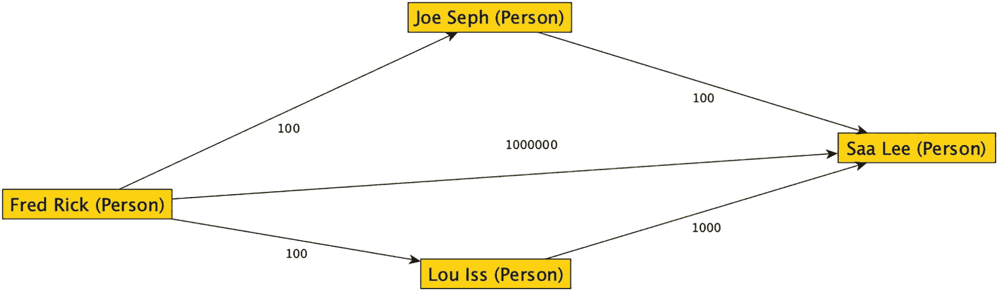

一个图结构。Fred Rick 以量级值 100 链接到 Joe Seph 和 Lou Iss，两者又以 100 链接到 Saa Lee。Fred Rick 以 1000000 链接到 Saa Lee。

图 3-10

边上带有量级值的示例子图

本章后面，我将演示如何以不同的方式获取路径，这种方式会复杂得多，但将允许你获取两个节点之间的每条路径，并在需要时进行比较。

#### 控制处理深度

在一个非常大的图中，你可能不希望遍历图的每一层。因此，有时你需要限制要处理的距离。你可以在 `SHORTEST_PATH` 语法中控制要搜索的层数。在之前的例子中，你使用了以下 `MATCH` 表达式：

```sql
MATCH(SHORTEST_PATH(Person(-(Follows)->FollowedPerson)+))
```

语法中的加号 (`+`) 是你控制处理迭代次数的地方。将 `+` 改为 `{1,Depth}` 来控制深度。数字 1 表示你开始的层级，但你不能从更深的层级开始。如果第一个数字不是 1，你会得到以下错误：

```
Msg 13942, Level 15, State 2, Line 556
The initial recursive quantifier must be 1: {1, ... }.
```

要显示层级 1 或 2 上的所有连接人员及其路径，你可以使用以下查询：

```sql
SELECT STRING_AGG(FollowedPerson.Name, '->') WITHIN GROUP
(GRAPH PATH) AS Path,
COUNT(FollowedPerson.PersonId) WITHIN GROUP (GRAPH PATH)
AS LEVEL
FROM   Network.Person AS Person,
Network.Follows FOR PATH AS Follows,
Network.Person FOR PATH AS FollowedPerson
WHERE  Person.FirstName = 'Lou'
AND Person.LastName = 'Iss'
AND MATCH(
SHORTEST_PATH(Person(-(Follows)->FollowedPerson){1,2}));
```

此查询的输出是

```
Path                     Level
------------------------ -----------
Val Erry                 1
Saa Lee                  1
Saa Lee->Fred Rick       2
Val Erry->Lee Roy        2
Val Erry->Joe Seph       2
```

你可以看到所有层级值都在 1 和 2 之间。使用 `+` 或甚至 `{1,3}` 重新执行查询，你将看到的区别是多了一行，其路径为 `Saa Lee->Fred Rick->Lou Iss`，层级值为 3。

如果你想在低端限制层级，例如想查看层级 2 和 3，你需要使用一个 CTE。考虑到分组等因素，你可能认为 `HAVING` 子句会起作用，但它不可用。

```sql
WITH BaseRows AS (
SELECT STRING_AGG(FollowedPerson.Name, '->') WITHIN GROUP
(GRAPH PATH) AS Path,
COUNT(FollowedPerson.PersonId) WITHIN GROUP (GRAPH PATH)
AS LEVEL
FROM   Network.Person AS Person,
Network.Follows FOR PATH AS Follows,
Network.Person FOR PATH AS FollowedPerson
WHERE  Person.FirstName = 'Lou'
AND Person.LastName = 'Iss'
AND MATCH(
SHORTEST_PATH(Person(-(Follows)->FollowedPerson){1,3}))
)
SELECT *
FROM   BaseRows
WHERE  Level BETWEEN 2 AND 3;
```

此查询的输出与使用 + 时相同，但现在，锚定节点与匹配项之间只有一跳的两行已经被过滤掉了。


#### 过滤特定路径

在公共表表达式（`CTE`）中需要处理多个过滤器。其中一个你可能会经常使用的，就是过滤出你正在寻找的那条路径。例如，假设你想查看从 `Lou Iss` 到 `Lee Roy` 的路径。你可以将锚点节点表过滤到只剩一行，即 `Lou Iss` 那一行。基础查询被放入一个非递归的 `CTE` 中，然后你在 `CTE` 内部的查询中过滤起始点，在外部查询中过滤你希望看到匹配结果的行：

```sql
WITH BaseRows AS (
SELECT LAST_VALUE(FollowedPerson.Name) WITHIN GROUP (GRAPH PATH)
AS ConnectedPerson,
STRING_AGG(FollowedPerson.Name, '->') WITHIN GROUP
(GRAPH PATH) AS Path
FROM   Network.Person AS Person,
Network.Follows FOR PATH AS Follows,
Network.Person FOR PATH AS FollowedPerson
WHERE  Person.FirstName = 'Lou'
AND Person.LastName = 'Iss'
AND MATCH(
SHORTEST_PATH(Person(-(Follows)->FollowedPerson){1,3}))
)
SELECT Path
FROM   BaseRows
WHERE ConnectedPerson = 'Lee Roy';
--在生产代码中，这里可能应该使用代理键或名字组成部分
```

此查询的输出仅仅是 `Lou Iss` 到 `Lee Roy` 的路径，该路径经过了 `Saa Lee`：

```sql
Path

Saa Lee->Lee Roy
```

#### 查找节点间的所有路径

接下来的代码可能是本书中最复杂的。这种基本的查询模式在后面的章节中会重复出现几次，因为它是一项必备技能。但实现起来确实非常复杂。

其思路是，你实现 Microsoft 使用 `SHORTEST_PATH` 构建的基本查询模式，但稍作改动。除了结构中出现循环的情况外，你不会因任何其他原因而停止处理。

使用当前的图，如果你想找出两个节点之间的所有路径，可以使用下面的代码。我在代码中加入了一些有用的注释，来指出代码的工作原理。但核心思想是，使用一个递归的 `CTE`，你通过一种广度优先算法不断迭代集合，但你会保留输出的每一个分支，即使你已经找到了查询中的目标节点。你稍后再对输出进行过滤。

```sql
--获取起始点
DECLARE @FirstName NVARCHAR(100) = N'Lou';
DECLARE @LastName NVARCHAR(100) = N'Iss';
--过滤终点
DECLARE @ToFirstName NVARCHAR(100) = N'Lee';
DECLARE @ToLastName NVARCHAR(100) = N'Roy';
--对于较大的图，这可能需要设置以防止过度递归
DECLARE @MaxLevel INT =10;
WITH BaseRows
AS (
--CTE 锚点只是起始节点
SELECT Person.PersonId,
Person.PersonId AS FollowsPersonId,
Person.Name,
--包含我们已在所有示例中构建的可读路径，锚点包含在内
CAST(Person.Name AS NVARCHAR(4000)) AS Path,
--此路径用于阻止循环。如果路径中已经找到该 PersonId，则递归将停止
CAST(CONCAT('\', Person.PersonId, '\')
AS VARCHAR(8000)) AS IdPath,
0 AS level --层级
FROM Network.Person
WHERE Person.FirstName = @FirstName --在这里过滤锚点
AND Person.LastName = @LastName
UNION ALL
--非常典型的一层图查询：
SELECT Person.PersonId AS PersonId,
FollowedPerson.PersonId AS FollowsPersonId,
FollowedPerson.Name,
BaseRows.Path + '>' + FollowedPerson.Name,
BaseRows.IdPath +
CAST(FollowedPerson.PersonId AS VARCHAR(10)) + '\',
BaseRows.level + 1
FROM Network.Person,
Network.Follows,
Network.Person AS FollowedPerson,
BaseRows
WHERE MATCH(Person-(Follows)->FollowedPerson)
--这将锚点连接到查询的递归部分
AND BaseRows.FollowsPersonId = Person.PersonId
--这是阻止递归的部分，将字符串值视为数组处理
AND NOT BaseRows.IdPath LIKE CONCAT('%\',
FollowedPerson.PersonId, '\%')
AND BaseRows.level <= @MaxLevel)
SELECT BaseRows.Path
FROM BaseRows
WHERE BaseRows.Name = 'Lee Roy';
```

此查询的输出如下（我手动添加了编号以对应图 3-11）

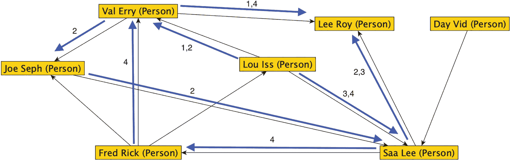

一个图形结构。`Val Erry` 链接了 `Lee Roy` 和 `Joe Seph`，`Fred Rick` 链接了 `Joe Seph`、`Val Erry` 和 `Lou Iss`。`Joe Seph`、`Lou Iss` 和 `Day Vid` 链接了 `Saa Lee`。`Saa Lee` 链接了 `Fred Rick` 和 `Lee Roy`。除了 `Day Vid` 到 `Saa Lee`，以及 `Fred Rick` 到 `Joe Seph` 和 `Lou Iss` 的路径外，所有路径都有额外的编号箭头。

图 3-11

在示例图中追踪从 `Lou Iss` 到 `Lee Roy` 的路径

```sql
Path

1 Lou Iss>Val Erry>Lee Roy
2 Lou Iss>Val Erry>Joe Seph>Saa Lee>Lee Roy
3 Lou Iss>Saa Lee>Lee Roy
4 Lou Iss>Saa Lee>Fred Rick>Val Erry>Lee Roy
```

你可以在图 3-11 上追踪这些不同的路径。

即使在这个相当小的例子中，你也能看到，原本可能在两个迭代步骤中找到的一个结果，现在扩展到了四个，还多了一个步骤。

如果你的用户想要回答诸如“是否存在一条从 `Lou Iss` 到 `Lee Roy` 的路径，同时包含 `Fred Rick`？”这样的问题，这种解决方案将是必要的。在大多数循环图中，没有简单的方法来回答这个问题，因为其结构完全不可预测。对于有向图，可能会更容易一些（对于树结构则容易得多），但如果你需要非常具体地指定路径，那么处理过程预计会更加复杂。


## 加权图计算

在上一节中，你学习了查找两个节点之间所有路径的方法。这对于进行加权图计算的过程至关重要。本章的示例代码将直接使用我们已创建的图及其预设值（为简化起见，所有值均为 1）。

在以下代码中，我重点展示了它与上一节“查找节点间所有路径”查询的不同之处：

```sql
DECLARE @FirstName NVARCHAR(100) = N'Lou';
DECLARE @LastName NVARCHAR(100) = N'Iss';
DECLARE @ToFirstName NVARCHAR(100) = N'Lee';
DECLARE @ToLastName NVARCHAR(100) = N'Roy';
DECLARE @MaxLevel INT = 10;
WITH BaseRows
AS (SELECT Person.PersonId,
    Person.PersonId AS FollowsPersonId,
    Person.Name,
    CAST(Person.Name AS NVARCHAR(4000)) AS Path,
    CAST(CONCAT('\', Person.PersonId, '\') AS VARCHAR(8000)) AS IdPath,
    0 AS level,
    0 AS WeightedCost, --边的值总和
    Person.Value AS NodeSum --节点的值总和
FROM Network.Person
WHERE Person.FirstName = @FirstName
AND Person.LastName = @LastName
UNION ALL
SELECT Person.PersonId AS PersonId,
    FollowedPerson.PersonId AS FollowsPersonId,
    FollowedPerson.Name,
    BaseRows.Path + '>' + FollowedPerson.Name,
    BaseRows.IdPath + CAST(FollowedPerson.PersonId AS VARCHAR(10)) + '\',
    BaseRows.level + 1,
    --在每次迭代中增加值
    --边的值（比节点数少一个值）
    BaseRows.WeightedCost + Follows.Value,
    --节点，包括锚点
    BaseRows.NodeSum + FollowedPerson.Value
FROM Network.Person,
    Network.Follows,
    Network.Person AS FollowedPerson,
    BaseRows
WHERE MATCH(Person-(Follows)->FollowedPerson)
AND BaseRows.FollowsPersonId = Person.PersonId
AND NOT BaseRows.IdPath LIKE CONCAT('%\', FollowedPerson.PersonId, '\%')
AND BaseRows.level < 10)
SELECT BaseRows.Path,
    BaseRows.WeightedCost,
    BaseRows.NodeSum
FROM BaseRows
WHERE BaseRows.Name = 'Lee Roy';
```

此查询的输出结果是：

```
Path                                         WeightedCost NodeSum
-------------------------------------------- ------------ -------
Lou Iss>Val Erry>Lee Roy                     2            3
Lou Iss>Val Erry>Joe Seph>Saa Lee>Lee Roy    4            5
Lou Iss>Saa Lee>Lee Roy                      2            3
Lou Iss>Saa Lee>Fred Rick>Val Erry>Lee Roy   4            5
```

由于每个节点和边的值都是 1，你可以看到成本和总和基本上等于处理该路径时所触及的节点和边的数量。如果你想进行不同的聚合计算，需要自行编写相应的代码。例如，要计算平均值，需保留总和与计数，以便在输出查询中计算平均值。对于类似 `MIN` 或 `MAX` 的输出，你需要在每次迭代中比较该值。

利用这个结果表，你可以轻松修改查询，通过 `TOP 1`（或 `TOP 1 WITH TIES` 以查看所有并列项）来获取成本最低或最高的路径。假设你想要最短路径，可以使用 CTE 将查询更改为：

```sql
SELECT TOP 1 WITH TIES BaseRows.Path,
    BaseRows.WeightedCost,
    BaseRows.NodeSum
FROM   BaseRows
WHERE  BaseRows.Name = 'Lee Roy'
ORDER BY BaseRows.WeightedCost ASC;
```

你的结果将只包含上一查询结果的前两行。

## 对匹配项检查条件

找到所有可到达的节点只是许多查询的第一步。有时，你想找到在某个层面上与你有联系、且具备某些特征的所有人。

举例来说，假设 `Lou Iss` 正在寻找一位与他有联系、并且使用 `C++` 编程的人。你可以分两步完成：首先获取 `Lou Iss` 连接到的所有人，然后将这些项目（可能放在临时表或 CTE 中）与 `ProgramsWith` 边中的匹配项进行查找。图 3-12 展示了这一过程，图中用方框标出了 `Lou Iss` 在某个层面有连接的所有节点，并指出了那个与 `C++` 有连接的节点。

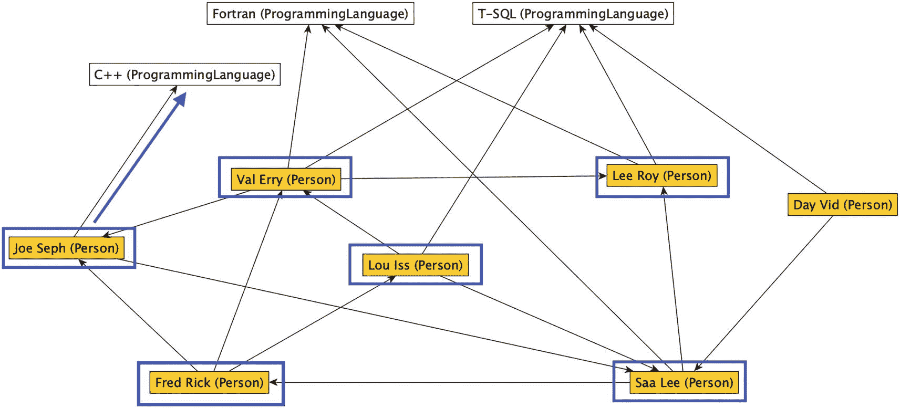

一个包含人名 Val Erry、Lee Roy、Day Vid、Joe Seph、Lou Iss、Fred Rick 和 Saa Lee 的关系图，他们彼此相互连接。Joe Seph 还有一条额外的箭头指向 C++；Val Erry、Saa Lee 和 Lee Roy 指向 Fortran；Val Erry、Lou Iss、Lee Roy 和 Day Vid 指向 TSQL 编程语言。

图 3-12

图中与 Lou Iss 有关系并且也与 C++ 有关系的节点

使用 `MATCH` 语法上的 `LAST_NODE` 扩展，你可以通过一个（相对）简单的查询来完成此操作。在下面的查询中，我高亮显示了使我们能够获取最短路径返回的节点、然后将它们连接到 `ProgrammingLanguage` 节点的语法：

```sql
SELECT  LAST_VALUE(FollowedPerson.Name)
        WITHIN GROUP (GRAPH PATH) AS ConnectedPerson,
        STRING_AGG(FollowedPerson.Name, '->')
        WITHIN GROUP (GRAPH PATH) AS Path
FROM   Network.Person AS Person,
       Network.Follows FOR PATH AS Follows,
       Network.Person FOR PATH AS FollowedPerson,
       Network.ProgramsWith AS ProgramsWith,
       Network.ProgrammingLanguage
WHERE  Person.FirstName = 'Lou'
AND Person.LastName = 'Iss'
AND MATCH(SHORTEST_PATH(Person(-(Follows)->FollowedPerson)+)
       --注意，这是有效的语法。-> 可以位于不同行
       AND LAST_NODE(FollowedPerson)-(ProgramsWith)
       ->ProgrammingLanguage)
AND ProgrammingLanguage.NAME = 'C++';
```

这会返回：

```
ConnectedPerson   Path
----------------- -----------------------
Joe Seph          Val Erry->Joe Seph
```

请注意几点。首先，尽管 `Network.ProgramsWith` 和 `Network.ProgrammingLanguage` 在带有 `SHORTEST_PATH` 的查询中被使用，并且它们不是锚点表，但你并不需要使用 `FOR PATH`，因为它们在查询中不涉及路径部分。如果在任一编程对象后面加上 `FOR PATH`，将会导致错误，例如：

```
Msg 13949, Level 16, State 2, Line 929
The table name or alias 'ProgramsWith' was marked as FOR PATH but was not used in the recursive section of a SHORTEST_PATH clause.
```

`LAST_NODE` 图函数为你提供对 `SHORTEST_PATH` 最后一个节点中图结构的引用。它类似于 `LAST_VALUE`，但 `node` 给你的是一个引用而不是值。从那里，你可以查找匹配项，并且可以设计一些复杂的查询来为你的用户解答非常复杂的问题。

## 总结

在本章中，你学习了在 SQL Server 的图表中创建和查询数据的基本语法。它们与典型的关系表有许多异同点，但要使用这些对象，你需要了解其中的许多差异。

你学习了如何创建对象，然后以最简单的方式向表中加载新数据。在下一章中，我将扩展这两个主题，包括如何保护你的对象免受不良数据影响，以及使数据加载更简便的方法。

在创建了一些数据之后，你学习了查询图中数据所需的大部分语法。该语法以 `MATCH` 表达式为核心，并包含用于查询图中多层级数据的 `SHORTEST_PATH` 扩展。

所有这些主题都是本书中你将要创建和查询的大多数图的基础。


