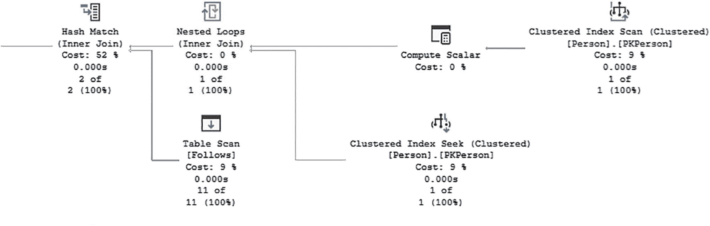
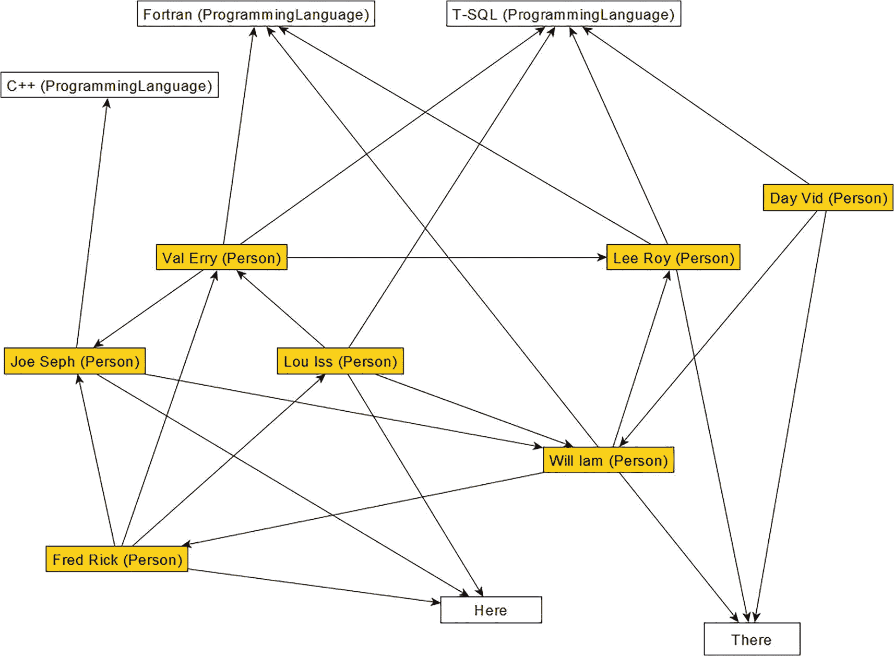

# 4. SQL 图形表：高级主题

在第 3 章中，我介绍了使用 SQL Server 图表的基本知识。在很多方面，它们类似于典型的具有行和列的 SQL Server 表，使用`SELECT`语句访问数据等。但有些部分非常不同，特别是内部图数据库的结构方式。使用伪列可能是一个新概念，除非您处理过分区（而且它们在分区中的使用不像使用`$node_id`、`$from_id`等那样面向用户）。

在本章中，我将超越基础知识，为您提供使用约束、索引和触发器构建接口和保护数据的工具。您还将深入研究元数据，当您获取一个 SQL Server 数据库并想了解存在哪些图表以及它们的详细信息时，您通常需要检查这些元数据。

本章的目标是完成设置所有技术，您将在本书的后半部分使用这些技术来演示如何使用 SQL Server 图对象构建有用的数据库。

您将在本章中使用的数据库与第 3 章结束时处于相同状态。如果您是从本章开始（为了复习我将在本章中介绍的技能，下载文件中有一个名为 [`https://github.com/Apress/practical-graph-structures`](https://github.com/Apress/practical-graph-structures) 的备份文件，它将让您在开始本章时精确创建应有的数据库。）

## 高级数据创建技术

在本节中，我将展示两种超越第 1 章所涵盖内容的技术。如果您正在构建一次加载多行数据的接口，这些技术将帮助您以更快的方式将数据加载到图对象中。

首先，我介绍一个接口层，它允许您使用表中的常规键值将数据插入到视图中。这是通过使用`INSTEAD OF`触发器对象为您完成图数据库转换工作来实现的。

第二部分向您展示如何使用可组合的 JSON 标签直接将数据插入到图列中。这样，您可以利用已有的`id`值数据，而不是让 SQL Server 决定这些值是什么，然后再去查找它们。

### 构建接口层

在上一章中，所有创建边数据的示例都遵循相同的基本模式：

```sql
INSERT INTO Network.Follows($from_id, $to_id)
--查找 $from_id
SELECT (   SELECT Person.$node_id
FROM   Network.Person
WHERE  Person.FirstName = 'Fred'
AND Person.LastName = 'Rick') AS from_id,
--仅用于调试时更容易查看的名称
--查找 to_id
(   SELECT Person.$node_id
FROM   Network.Person
WHERE  Person.FirstName = 'Joe'
AND Person.LastName = 'Seph') AS to_id;
```

您在两个子查询中查找两个`$node_id`值，它们共同构成一个`$from_id`、`$to_id`对，然后插入这些值。这是在存储过程中加载单行时可能使用的模式，但如果您想加载数千行，或者想将关系数据库转换为图进行分析而没有整数键可用时，它就显得很笨重。（关于可组合 JSON 标签的更多信息将在后面的章节中介绍。）

#### INSERT

在本节中，您将构建一个接口，允许您使用自然键值插入相同的数据：

```sql
INSERT INTO Network.Follows (FromFirstName, FromLastName,
ToFirstName, ToLastName)
VALUES ('Fred', 'Rick','Joe', 'Seph)
```

此方法使用带有`INSTEAD OF`触发器对象的视图对象来允许在内部完成对`$from_id`和`$to_id`的查找。

> 注意
> 在这些示例中，您将使用`Name`列来简化本书的代码。加载大量数据时，请始终尝试使用具有索引以便连接的值。

对于此示例，创建另一个支持用户数据接口的架构，称为`NetworkUI`：

```sql
IF SCHEMA_ID('Network_UI') IS NULL
EXEC ('CREATE SCHEMA Network_UI');
```

您创建的视图将仅允许您使用一个特定键（主键或替代键）将数据从一个特定节点表插入到另一个特定节点表。因此，您需要为希望使用此技术的每个关系重复此过程。

在您的案例中，您将通过`Network.Follows`边实现`Network.Person`与`Network.Person`之间的关系。基本视图很简单。它只是对表的查询，返回您想向用户展示的节点中的两个键值。完全根据您的需求决定是使用自然键还是代理键。唯一的要求是您向用户展示的值能够唯一标识他们可以知道值的两个行之间的关系。

如果您希望能够使用您知道的键手动键入`INSERT`语句，请使用自然键。在此示例中，使用代理键来匹配源数据中的数据。

以下是视图的代码：

```sql
CREATE OR ALTER VIEW Network_UI.Person_Follows_Person
AS
SELECT Person.PersonId AS PersonId,
FollowedPerson.PersonId AS FollowsPersonId,
Follows.Value AS Value
FROM Network.Person,
Network.Follows,
Network.Person AS FollowedPerson
WHERE MATCH(Person-(Follows)->FollowedPerson);
```

使用该视图执行以下查询：

```sql
SELECT Person_Follows_Person.PersonId,
Person_Follows_Person.FollowsPersonId,
Person_Follows_Person.Value
FROM  Network_UI.Person_Follows_Person;
```

输出如下所示（仅显示 11 行中的前 3 行）：

```
PersonId    FollowsPersonId Value
----------- --------------- -----------
1           6               1
1           2               1
6           5               1
```

现在，您将创建一个`INSTEAD OF`触发器对象，它将把这三列作为输入，并将它们转换为内部图标识符值。然后使用图值，将行插入到表中。这使得将大量数据加载到表中变得容易得多，而无需处理所有到图键值的转换。它特别使即席插入变得更容易，因为您永远不需要查找内部值。

> 注意
> 本节中的一些示例看起来并没有节省太多工作量，因为您仍然需要像查找图值一样查找常规键。当将常规的多对多关系转换为图边时，此技术将特别有用。

```sql
CREATE OR ALTER TRIGGER Network_UI.Person_FollowsPerson_$InsteadOfInsertTrigger
ON Network_UI.Person_Follows_Person
INSTEAD OF INSERT
AS
SET NOCOUNT ON;
--如果您添加更多代码，则应添加错误处理代码。
BEGIN
INSERT INTO Network.Follows($from_id, $to_id, Value)
SELECT Person.$node_id, FollowedPerson.$node_id,
inserted.Value
FROM Inserted
JOIN Network.Person
ON Person.PersonId = Inserted.PersonId
JOIN Network.Person AS FollowedPerson
ON FollowedPerson.PersonId = Inserted.FollowsPersonId;
END;
```

使用`Network_UI.Person_Follows_Person`视图，您可以使用键值通过常规连接编写快速查询。例如，您可以将视图连接回`Network.Person`以获取名称，如下所示：


#### SQL 查询与图数据库操作

```sql
SELECT Person.Name, FollowedPerson.Name AS FollowedPerson
FROM   Network_UI.Person_Follows_Person as Follows
JOIN Network.Person
ON Person.PersonId = Follows.PersonId
JOIN Network.Person AS FollowedPerson
ON FollowedPerson.PersonId = Follows.FollowsPersonId
WHERE  Person.Name = 'Lou Iss';
```

请注意，虽然这在小数据集上会很快，但您可能需要对查询进行一些调优。尽可能多地使用 `MATCH` 表达式和您的图谱表。执行此查询，您将得到以下结果：

```
Name              FollowedPerson
----------------- ----------------------
Lou Iss           Saa Lee
Lou Iss           Val Erry
```

如果您在 SSMS 中查看此查询的执行计划，您会看到类似于图 4-1 的内容。



一个部分查询计划。聚集索引扫描流向计算标量、到嵌套循环、内部联接，同时与聚集索引查找和哈希匹配、内部联接，同时与表扫描相结合。

**图 4-1**

部分查询计划显示您正在将 `Person` 表联接到 `Follows` 表。查询计划的其余部分将显示另一个到 `Person` 的哈希联接。

查看查询计划，您会注意到带有边对象的查询使用了 `HASH JOIN` 运算符。在本章后面，您将了解如何向节点和边对象添加索引以可能提高性能（请注意，像您现在使用的较小数据集可能会为查询生成非常简单的计划，随着数据集增长，计划会发生变化）。

虽然处理节点和边对象的方式有很多不同，但也有很多相似之处，您需要根据对象的使用方式对性能调优采取一些控制。如前所述，使用此视图对于查询没有太大价值，但如果您有一个包含 id 值的表要转换为图，那将非常强大。

为了演示，请运行以下查询以找到代理键值，然后插入一行：

```sql
SELECT Person.PersonId  AS PersonId
FROM Network.Person
WHERE Person.Name = 'Lou iss';
SELECT Person.PersonId  AS FollowsPersonId
FROM Network.Person
WHERE Person.Name = 'Joe Seph';
```

获取返回的值并用于以下查询。对于示例集，值是 2 和 6。因此您可以使用以下语句插入新行：

```sql
INSERT INTO Network_UI.Person_Follows_Person
(PersonId,FollowsPersonId,Value)
VALUES (2, 6, 10);
```

执行以下查询：

```sql
SELECT Person.Name, FollowsPerson.Name AS FollowedPerson
FROM  Network.Person, Network.Follows,
Network.Person AS FollowsPerson
WHERE MATCH(Person-(Follows)->FollowsPerson)
AND Person.Name = 'Lou Iss';
```

您将看到结果集中现在包含一行，其 `FollowedPerson` 为 `Joe Seph`。

#### UPDATE

正如我在本书前面所说，边对象的 `$from_id` 或 `$to_id` 值无法更新。这很有道理。但假设您想将值更新为 `1`，以匹配您的所有其他数据。

```sql
UPDATE Network_UI.Person_Follows_Person
SET Person_Follows_Person.Value = 1
WHERE PersonId = (SELECT Person.PersonId
FROM Network.Person
WHERE Person.Name = 'Lou iss')
AND Person_Follows_Person.FollowsPersonId =
(SELECT Person.PersonId
FROM Network.Person
WHERE Person.Name = 'Joe Seph');
```

这很有效，因为您只在更新语句中更新一个表中的数据。任何尝试同时更改键值和值的操作都将失败，例如

```sql
UPDATE Network_UI.Person_Follows_Person
SET Person_Follows_Person.Value = 1,
Person_Follows_Person.PersonId = 0
```

会返回错误：

```
Msg 4405, Level 16, State 1, Line 85
View or function 'Network_UI.Person_Follows_Person' is not updatable because the modification affects multiple base tables.
```

如果您只尝试更新一个键值（该值只存在于一个表中），像这样

```sql
UPDATE Network_UI.Person_Follows_Person
SET Person_Follows_Person.PersonId = 0;
```

系统确实会尝试更新，但该值会链接回 `Network.Person` 对象的标识值，因此您会得到此错误：

```
Msg 8102, Level 16, State 1, Line 105
Cannot update identity column 'PersonId'.
```

如果您希望更新 `$from_id` 和 `$to_id` 值，在 `INSTEAD OF` 触发器对象中是可以实现的（需要删除和插入操作，如果您正在构建生产代码，这肯定需要更复杂的错误处理），但我只建议在您创建用于临时操作的表时使用此方法。直接让您的代码执行删除和插入操作。当您将树实现为重新指定父节点的操作时会用到此操作，这从技术上说会更改关系。

> **注意**
>
> 在第 4 章的下载文件中，有一个代码生成器可以为您生成视图和 `INSTEAD OF` 触发器对象。其中包含一个名为 `InterfaceViewCodeGenerator.sql` 的更新生成器。代码有详细文档，虽然需要进行很多设置，但它会生成整个接口的基本框架。


#### 删除（DELETE）

根据你的应用程序需求，使用自然键进行删除操作可能非常合理（尤其是用户手动操作数据时）。通过用户界面表执行删除操作还需要一个触发器，将 ID 值转换为对应边行的键值。

```sql
DELETE FROM Network_UI.Person_Follows_Person
WHERE PersonId = (SELECT Person.PersonId
FROM Network.Person
WHERE Person.Name = 'Lou iss')
AND Person_Follows_Person.FollowsPersonId =
(SELECT Person.PersonId
FROM Network.Person
WHERE Person.Name = 'Joe Seph');
```

正如之前的更新操作一样，你会遇到相同的 `Error 4405`。因此，让我们来构建一个简单的 `INSTEAD OF DELETE` 触发器对象。这里有个奇怪的问题：被删除的列将包含什么内容？因为与插入触发器（你在其中提供值）不同，接下来的触发器将执行查询。所以，首先，你将在一个查询中直接返回被删除对象中的行。

```sql
CREATE OR ALTER TRIGGER Network_UI.Person_Follows_Person$InsteadOfDeleteTrigger
ON Network_UI.Person_Follows_Person
INSTEAD OF DELETE
AS
SET NOCOUNT ON;
--If you add more code, you should add error handling code.
BEGIN
SELECT *
FROM Deleted;
END;
```

**注意**

如果这对您不起作用，请检查本文档中提到的设置：[`https://learn.microsoft.com/sql/database-engine/configure-windows/disallow-results-from-triggers-server-configuration-option`](https://learn.microsoft.com/sql/database-engine/configure-windows/disallow-results-from-triggers-server-configuration-option)。显然，最好不要让普通触发器返回结果，但在开发案例中，能够看到输出内容非常有用。

执行以下语句，你将看到 `deleted` 表包含了来自视图的数据，因为触发器的主体代码仅仅是返回 `deleted` 虚拟表的内容：

```sql
DELETE FROM Network_UI.Person_Follows_Person
WHERE PersonId = (   SELECT Person.PersonId
FROM   Network.Person
WHERE  Person.Name = 'Lou iss')
AND Person_Follows_Person.FollowsPersonId =
(   SELECT Person.PersonId
FROM   Network.Person
WHERE  Person.Name = 'Joe Seph');
```

这将返回以下结果，显示 `deleted` 表的结构与你根据视图结构所预期的完全一致：

```sql
PersonId    FollowsPersonId Value
----------- --------------- -----------
2           6               1
```

因此，你可以这样编写触发器：

```sql
CREATE OR ALTER TRIGGER Network_UI.Person_Follows_Person$InsteadOfDeleteTrigger
ON Network_UI.Person_Follows_Person
INSTEAD OF DELETE
AS
SET NOCOUNT ON;
--If you add more code, you should add error handling code.
BEGIN
DELETE FROM Network.Follows --FollowedPerson)
and  deleted.PersonId = Person.PersonId
and  deleted.FollowsPersonId = FollowedPerson.PersonId
END;
```

现在，你可以直接地删除数据，就像操作一个内部没有特殊列的表一样：

```sql
DELETE FROM Network_UI.Person_Follows_Person
WHERE Person_Follows_Person.PersonId = 2
AND Person_Follows_Person.FollowsPersonId = 6;
```

删除行后，你可以看到该行已消失。在构建触发器时，请务必使用创建和删除多行数据的方式进行测试。

```sql
SELECT Person.Name AS PersonName,
FollowedPerson.Name AS FollowsPersonName
FROM   Network.Person,
Network.Follows,
Network.Person AS FollowedPerson
WHERE  MATCH(Person-(Follows)->FollowedPerson)
AND  Person.Name = 'Lou Iss';
```

### 使用可组合 JSON 标签加载数据

在下一节中，你将切换到另一个名为 `AdventureWorksLT` 的公开可用数据库。我使用了 Microsoft Learn 站点上提供的 2019 版本：[`https://learn.microsoft.com/sql/samples/adventureworks-install-configure`](https://learn.microsoft.com/sql/samples/adventureworks-install-configure)。请使用 LT 版本，因为它具有整数键值，这使得此过程容易得多。如果你要从具有 GUID 键值甚至多部分键值的数据库加载数据，你需要在 `tempdb` 中创建临时暂存表，使用标识键值进行临时映射（并创建一个包含 `sourceKey` 和 `identityKey` 的表来从源表加载）。亲爱的读者，这部分内容就留给你自己完成，它并非难事，但肯定会增加阅读示例代码的难度。

好的，一旦你恢复了该数据库，请根据数据创建一个简单的 `Customer-Purchased->Product` 图。为每个节点包含一个 `Label` 列，并在边上包含购买日期。不要在边上设置唯一性约束，因为此示例的主要目的是展示加载方法。

首先，创建一个新架构来容纳你的新对象：

```sql
CREATE SCHEMA SalesGraph;
```

接下来，你将创建节点表对象。在这些对象中，你将包含来自关系表的代理键，这在获取一组数据后用于获取附加信息非常有用。如果你将图形数据与关系数据副本放在同一个数据库中，可以根据需要调整图形表中所需的数据量。

```sql
CREATE TABLE SalesGraph.Customer
(
CustomerId int NOT NULL
CONSTRAINT PKCustomer PRIMARY KEY,
Label nvarchar(100) NOT NULL
CONSTRAINT AKCustomer UNIQUE
) AS NODE;
CREATE TABLE SalesGraph.Product
(
ProductId int NOT NULL
CONSTRAINT PKProduct PRIMARY KEY,
Label nvarchar(100) NOT NULL
CONSTRAINT AKProduct UNIQUE
) AS NODE;
```

接下来是创建边。在边中，包含了源数据表中来源的键，以及商品的购买时间，这在你的分析中肯定很有用。

```sql
CREATE TABLE SalesGraph.Purchased
(
SalesOrderDetailId int NOT NULL
CONSTRAINT AKPurchased UNIQUE,
PurchaseTime datetime2(0) NOT NULL
) AS EDGE;
```

你可以简单地获取源数据中存在的行，进行少量转换，然后使用简单的插入语句加载数据：

```sql
--customerID added to label for uniqueness... why there
--is duplication is beyond this exercise's needs
INSERT INTO SalesGraph.Customer WITH (TABLOCKX)
(
CustomerId, Label
)
SELECT CustomerID,
CONCAT(FirstName, ' ', LastName, ' ', CustomerID) AS Label
FROM SalesLT.Customer
ORDER BY Label;
```

查看输出的几行，你会看到：

```sql
SELECT TOP 2
$node_id,
CustomerId
FROM SalesGraph.Customer;
```

前两行的 ID 值为 0 和 1：

```sql
$node_id_06C54C432DE544E8995B29AFDAD55455

{"type":"node","schema":"SalesGraph","table":"Customer","id":0}
{"type":"node","schema":"SalesGraph","table":"Customer","id":1}
CustomerId

```

这些 ID 值与 `CustomerId` 列的值并不匹配。从某种程度上说，这是一件好事。你几乎永远不会希望使用 `$node_id` 值进行任何操作，但在加载边行时，如果你能预测这些值，就不需要查找它们，从而可以更快地加载数据。

幸运的是，你可以自己组合 JSON，并且 Microsoft 作为图形功能的一部分提供了相应的工具。假设你正在加载数据副本（可能用于分析，也可能是首次加载），并且不使用接近 `bigint` 最大值的值（这确实是一个非常大的数字），那么你可以使用以下技术节省大量处理时间。我经常在示例数据中使用这种技术，因为我可以非常快速地加载具有不同数据集的数据库。为了演示这一点，首先截断 `SalesGraph.Customer` 表中的数据。


#### 使用 `NODE_ID_FROM_PARTS` 函数构建图形数据

```
TRUNCATE TABLE SalesGraph.Customer;
```

`NODE_ID_FROM_PARTS` 函数接受节点表的 `object_id` 和一个将成为图 ID 值的整数。以下查询展示了 `CustomerId` 现在与图 ID 相匹配。传入的 `object_id` 必须与图表中的 `object_id` 匹配，否则输出将为 `NULL`，因此你无法用此方法制造错误数据：

```
SELECT NODE_ID_FROM_PARTS(OBJECT_ID('SalesGraph.Customer'),
CustomerID),
CustomerID,
CONCAT(FirstName, ' ', LastName, ' ', CustomerID) AS LABEL
FROM SalesLT.Customer;
```

查看输出，你会发现数据是代理键对代理键的匹配：

```

{"type":"node","schema":"SalesGraph","table":"Customer","id":1}
{"type":"node","schema":"SalesGraph","table":"Customer","id":2}
{"type":"node","schema":"SalesGraph","table":"Customer","id":3}
CustomerId  Label
----------- -----------------------
1          Orlando Gee 1
2          Keith Harris 2
3          Donna Carreras 3
```

现在你可以将值插入到 `$node_id` 列以及其他两个列中：

```
INSERT INTO SalesGraph.Customer
(
$Node_id, CustomerId,Label
)
SELECT NODE_ID_FROM_PARTS(OBJECT_ID('SalesGraph.Customer'),
CustomerID),
CustomerID,
CONCAT(FirstName, ' ', LastName, ' ', CustomerID) AS LABEL
FROM SalesLT.Customer;
```

接下来，对产品执行相同的操作（与客户相同的重复名称问题，因此添加 `ProductId` 作为后缀）：

```
INSERT INTO SalesGraph.Product
(
$Node_id, ProductId, Label
)
SELECT NODE_ID_FROM_PARTS(OBJECT_ID('SalesGraph.Product'),
ProductID),
ProductID,
CONCAT(Name, ' ', ProductID) AS LABEL
FROM SalesLT.Product;
```

现在运行以下查询，通过连接 `SalesLT.SalesOrderHeader` 表来获取购买的客户和产品：

```
SELECT SalesOrderDetail.SalesOrderDetailID,
OrderDate AS PurchaseTime,
ProductID,
CustomerID
FROM SalesLT.SalesOrderHeader
JOIN SalesLT.SalesOrderDetail
ON SalesOrderHeader.SalesOrderID =
SalesOrderDetail.SalesOrderID;
```

现在你可以使用组合的 JSON 值，在 `SalesGraph.Purchased` 边表中创建数据，并引用加载节点数据的表：

```
INSERT INTO SalesGraph.Purchased
(
SalesOrderDetailId, PurchaseTime,
$from_id,$to_id
)
SELECT SalesOrderDetail.SalesOrderDetailID,
OrderDate AS PurchaseTime,
NODE_ID_FROM_PARTS(OBJECT_ID('SalesGraph.Customer'),
CustomerID),
NODE_ID_FROM_PARTS(OBJECT_ID('SalesGraph.Product'),
ProductID)
FROM SalesLT.SalesOrderHeader
JOIN SalesLT.SalesOrderDetail
ON SalesOrderHeader.SalesOrderID = SalesOrderDetail.SalesOrderID;
```

最后，执行此 SQL，你就可以看到所有已加载的数据：

```
SELECT Customer.Label, Product.Label
FROM   SalesGraph.Customer,
SalesGraph.Purchased,
SalesGraph.Product
WHERE MATCH(Customer-(Purchased)->Product)
```

**注意事项**：你创建的用于插入数据的图形查询可以以任何顺序执行（或对于更大的加载量同时执行）。缺少父节点数据会导致令人困惑的查询，但这并非非法操作。例如，清空 `SalesGraph.Customer` 和 `SalesGraph.Product` 对象：

```
TRUNCATE TABLE SalesGraph.Customer;
TRUNCATE TABLE SalesGraph.Product;
```

然后重新运行你刚执行的带有 `MATCH` 子句的 `SELECT` 语句。你仍然会得到相同数量的行，但现在所有的标签值都是 `NULL`。在最初使用你自己的键值加载数据后，强烈建议添加边约束来清理/防止悬空引用（这将在本章后面介绍）。

如果你清空 `SalesGraph.Purchased` 对象中的数据，情况会得到清理。但请注意，你可以只运行创建边行的 `INSERT` 语句，它不会验证 ID 值是否有效。进行的主要验证是检查 `$node_id` 值中使用的 `object_id` 值是否真实存在。

虽然你可以在没有相关节点行的情况下创建边行，但节点表必须存在。作为本节的最后一个示例，清空边并删除两个节点表。然后继续删除客户和产品表。

```
TRUNCATE TABLE SalesGraph.Purchased;
DROP TABLE IF EXISTS SalesGraph.Customer, SalesGraph.Product;
```

现在，如果你尝试将数据插入到边中，如下所示：

```
INSERT INTO SalesGraph.Purchased
(
SalesOrderDetailId,
PurchaseTime,
$from_id,
$to_id
)
SELECT SalesOrderDetail.SalesOrderDetailID,
OrderDate AS PurchaseTime,
NODE_ID_FROM_PARTS(OBJECT_ID('SalesGraph.Customer'),
CustomerID),
NODE_ID_FROM_PARTS(OBJECT_ID('SalesGraph.Product'),
ProductID)
FROM SalesLT.SalesOrderHeader
JOIN SalesLT.SalesOrderDetail
ON SalesOrderHeader.SalesOrderID =
SalesOrderDetail.SalesOrderID;
```

你会得到以下错误：

```
Msg 515, Level 16, State 2, Line 125
Cannot insert the value NULL into column 'from_obj_id_75C28A838F1D4D618BB8C1957919208E', table 'AdventureWorksLT2019.SalesGraph.Purchased'; column does not allow nulls. INSERT fails.
```

第一次遇到这个错误可能会有些令人困惑。它仅仅意味着它尝试插入两个值，但提供的对象名没有引用到现有的节点表。

它必须是一个节点表；随便一张表是不行的，如果你执行以下引用源关系表而非图形对象的语句，就可以看到这一点：

```
SELECT OBJECT_ID('SalesLT.Customer'),
NODE_ID_FROM_PARTS(OBJECT_ID('SalesLT.Customer'), 1)
```

你会看到 `NODE_ID_FROM_PARTS` 调用返回了 `NULL`。


## 异构查询

到目前为止，在本书中，我一直保持设计模式的使用方式，即两个节点之间只存在一种多对多关系。要么是相同的表（`Person-Follows->Person`），要么是不同的表（`Person-ProgramsWith->ProgrammingLanguage`），但始终是通过单一路径从一个节点到另一个节点。在本节中，我将重点介绍通过单条路径导航多个关系的能力，甚至如何通过多条路径遍历关系。

例如，你将向 `TestGraph` 数据库中的示例图添加另一组名为 `Location` 的节点。然后，你将在 `Follows` 边中创建边值。（尽管这在逻辑上不一定合理，这正是后续示例要说明的一部分）。参见图 4-2。



图 4-2 展示了添加新的 `Location` 节点类型。节点 Joe Seph、Fred Rick、Val Erry、Lou Iss、Lee Roy、Will Lam 和 Day Vid 相互连接，它们在顶部连接到 C++、Fortran 和 T-SQL，在底部连接到 `Here` 和 `There` 节点。

**图 4-2**
向示例图中添加新的 `Location` 节点类型

以下是创建新表并加载数据的 DDL 和 DML：

```sql
CREATE TABLE Network.Location
(
LocationId INT NOT NULL IDENTITY,
Name NVARCHAR(20) NOT NULL
CONSTRAINT AKLocation UNIQUE
) AS NODE;
INSERT INTO Network.Location(    Name)
VALUES ('Here'),('There');
```

现在，按照图中所示，将新行与项目关联起来：

```sql
WITH Here
AS (SELECT Person.$node_id AS node_id
FROM Network.Person
WHERE Person.Name IN ( 'Fred Rick', 'Lou Iss', 'Joe Seph' ))
INSERT INTO Network.Follows
(  $from_id, $to_id, Value)
SELECT Here.node_id,
Location.$node_id,
'Value'
FROM Here
CROSS JOIN Network.Location
WHERE Location.Name = 'Here';
WITH There
AS (SELECT Person.$node_id AS node_id
FROM Network.Person
WHERE Person.Name IN ( 'Saa Lee', 'Lee Roy', 'Day Vid' ))
INSERT INTO Network.Follows
(  $from_id, $to_id, Value)
SELECT There.node_id,
Location.$node_id,
'Value'
FROM There
CROSS JOIN Network.Location
WHERE Location.Name = 'There';
```

现在，你可以像这样查看创建的行：

```sql
SELECT Person.Name, Location.Name
FROM   Network.Person, Network.Follows, Network.Location
WHERE  Match(Person-(Follows)->Location);
```

这将返回

```
Name            Name
--------------- --------------------
Fred Rick       Here
Lou Iss         Here
Joe Seph        Here
Lee Roy         There
Saa Lee         There
Day Vid         There
```

因此，现在你有两种不同类型的节点通过 `Network.Follows` 边连接。如果你想一起查看它们，可以使用 CTE 或派生表将对象的数据联合在一起。除非你想输出它们，否则你不必包含任何图结构列。这些列之所以存在，是因为该对象是特定类型的对象。在以下查询中，你可以看到 `Lou Iss` 通过 `Network.Follows` 边连接到的地点和人物：

```sql
SELECT Person.Name,
Nodes.ObjectName,
Nodes.Name
FROM Network.Person,
Network.Follows,
(
SELECT 'Location' AS ObjectName,
Location.Name
FROM Network.Location
UNION ALL
SELECT 'Person',
Name
FROM Network.Person
) AS Nodes
WHERE MATCH(Person-(Follows)->Nodes)
AND Person.Name = 'Lou Iss';
```

这将返回

```
Name        ObjectName  Name
----------- ----------- ------------
Lou Iss     Person      Saa Lee
Lou Iss     Person      Val Erry
Lou Iss     Location    Here
```

请注意，使用 SQL Server 处理非特定数据的一个主要限制在此显现。一旦将行提取到表格数据流（TDS）中，它们就恢复为强类型和结构化的关系表。由于我们讨论的方法需要派生表、CTE 或视图对象，你需要将不同的数据集构造成相同的形状。这是该方法的一个很大限制，因为你无法轻松返回如下所示的内容，除非在 `UNION ALL` 中包含所有列，这会变得很繁琐：

```
Name        ObjectName  Name       LocationDetails PersonDetails
----------- ----------- ---------- --------------- -------------
Lou Iss     Person      Saa Lee                    Values
Lou Iss     Person      Val Erry                   Values
Lou Iss     Location    Here                       Values
```

尽管存在此限制，它对于查找一个项目与它可能链接到的许多其他事物之间的关系非常有用。

例如，将 `Network` 模式视为客户关系管理（CRM）系统，你如何能看到与客户连接的所有内容，例如他们的偏好、感兴趣的产品、地点或他们购物过的商店？输出可能会向用户显示人类可读的值（如示例中的 `Name` 或 `Label`），然后是一个链接以显示更详细的信息。

例如，

```sql
SELECT OtherThing.ObjectType, OtherThing.Name,MoreDetailLink
FROM   Network.Person,
--图列会自动暴露，你不需要任何列，所以这里什么也不返回
--尽管这显然不是一个关于“无”的子查询
(SELECT 1 AS nothing
FROM Network.Follows
UNION ALL
SELECT 1
FROM Network.ProgramsWith) as LinksTo,
--这个派生表是所有某人可以链接到的事物
(SELECT 'Person' as ObjectType, Name,
CONCAT('https://getPerson/',PersonId)
AS MoreDetailLink
FROM Network.Person
UNION ALL
SELECT 'ProgrammingLanguage', ProgrammingLanguage.Name,
CONCAT('https://getProgramming/',
ProgrammingLanguage.Name) AS MoreDetailLink
FROM Network.ProgrammingLanguage
UNION ALL
SELECT 'Location',
Location.Name,
CONCAT('https://mapLocation/',LocationId)
AS MoreDetailLink
FROM Network.Location) AS OtherThing
WHERE  MATCH(Person-(LinksTo)->OtherThing)
AND Person.Name = 'Lou Iss';
```

这段代码使用了两条边对象和迄今为止定义的所有三个节点，来执行 `Lou Iss` 节点的所有关系查询。

```
ObjectType          Name         MoreDetailLink
------------------- ------------ --------------------------------
Person              Saa Lee      https://getPerson/5
Person              Val Erry     https://getPerson/3
Location            Here         https://mapLocation/1
ProgrammingLanguage T-SQL        https://getProgramming/T-SQL
```

如果这是你经常做的事情，你很可能希望将其做成可重用的视图对象，因为代码有点乱。在下一个代码块中，将前面带有派生表的查询转换为一组可重用的视图对象：

```sql
CREATE VIEW Network.LinksTo
AS
SELECT 1 AS nothing FROM network.Follows
UNION ALL
SELECT 1 AS nothing FROM network.ProgramsWith;
GO
CREATE VIEW Network.Anything
as
SELECT 'Person' as ObjectType,
Person.Name,
CONCAT('https://getPerson/',PersonId)
AS MoreDetailLink
FROM Network.Person
UNION ALL
SELECT 'ProgrammingLanguage',
ProgrammingLanguage.Name,
CONCAT('https://getProgramming/',
ProgrammingLanguage.Name) AS MoreDetailLink
FROM    Network.ProgrammingLanguage
UNION ALL
SELECT 'Location',
Location.Name,
CONCAT('https://mapLocation/',LocationId)
AS MoreDetailLink
FROM    Network.Location;
```

现在，之前的查询可以这样写：

```sql
SELECT AnyThing.ObjectType, AnyThing.Name,
Anything.MoreDetailLink
FROM   Network.Person, Network.LinksTo, Network.Anything
WHERE  MATCH(Person-(LinksTo)->AnyThing)
AND Person.Name = 'Lou Iss';
```


不过，有趣的是，如果你在 `SELECT` 子句中添加 `,*` 会发生什么。这应该会返回所有列，对吧？既然你显然已经通过 `MATCH` 表达式在图键值上进行了连接，你期望能看到这些值，对吧？

事实并非如此。你得到的唯一图细节是来自 `Network.Person` 对象的 `$node_id`。当你的对象被封装成派生表或视图对象时，你只能访问你输出的列，尽管这些列实际上可以通过 `MATCH` 用于图查询。

图标识符甚至可能不会在所有用法中以相同方式暴露。例如，

```
SELECT Person.Name, Nodes.ObjectName, Nodes.Name,
Nodes.$node_id
FROM   Network.Person, Network.Follows,
(SELECT 'Location' as ObjectName, Name, $node_id
FROM   Network.Person) as Nodes
WHERE MATCH(Person-(Follows)->Nodes)
AND Person.Name = 'Lou Iss';
```

将会抛出此错误：

```
Msg 207, Level 16, State 1, Line 243
Invalid column name '$node_id'.
```

尽管它显然在 `MATCH` 表达式中被使用了。如果你希望图标识符值成为输出的一部分，你必须为它们命名并使用该名称：

```
SELECT Nodes.ObjectName, Nodes.Name,
Nodes.NodeId
FROM   Network.Person, Network.Follows,
(SELECT 'Location' AS ObjectName, Name,
$node_id AS NodeId
FROM   Network.Person) AS Nodes
WHERE MATCH(Person-(Follows)->Nodes)
AND Person.Name = 'Lou Iss';
```

这将返回

```
ObjectName Name       NodeId
---------- ---------- ------------------------------------------
Location   Saa Lee    {"type":"node","schema":"Network","tab...
Location   Val Erry   {"type":"node","schema","Network","tab...
```

同样，如果出于某种原因你需要，你需要在视图定义中包含所需的实现列。

## 完整性约束与索引

关于构建典型的关系数据库系统，我最喜欢说的一句话是：第一、最后也是唯一真正重要的是你的数据是正确的。**快速但错误的结果比缓慢但正确的结果更糟糕**。在本节中，你将学习一些确保数据正确性的方法。当然，正确且快速显然是理想的，因此你还将看到一些需要为性能增强而添加到对象中的索引。

### 边约束

到目前为止，在第 3 章和第 4 章中，我们一直非常小心地处理放入边表的数据。正如任何软件开发人员所知，灵活性既是优点也是缺点。有时作为设计者，你会认为灵活性只会被善用，但随后开始出现无意义的数据，并对用户体验（和信心）产生不良影响。

在我的示例表中，设计并未考虑有人可能尝试将不合逻辑的数据放入表中的情况。例如，目前对于这些结构来说，说 `Lou Iss-ProgramsWith-> Here` 或 `T-SQL-ProgramsWith->C++` 是完全可接受的。两者都是不合逻辑的语句。

你应该已经了解的经典完整性约束（`foreign key`、`check`、`unique`、`primary key`、`default`）通常与图表配合使用，就像它们与普通关系表配合一样。（存在一些限制，例如不能在检查约束中使用图键值。）然而，由于一个边表可以有多个 `$from_id` 和 `$end_id` 的数据来源，因此需要一种新的约束类型。它被称为**边约束**。

边约束限制了哪些数据可以通过节点对象放入边中，包括来源和目标。例如，当你为本节同构部分构建关系时，你创建了数据，实际上是实现了关系 `Person->Follows->Location`。由于你定义的是一个人所在的位置，这种关系在语义上没有意义，因此你希望更改它，使其拥有自己的边：`LivesAt`，或 `Person-LivesAt->Location`。进行此更改后，你将确保不能说一个人居住在某个编程语言处或关注了一个位置。在将行迁移到这个新边的过程中，你可以看到边对象可能发生的情况，以及如何将数据约束到合适的集合。

你可以在单个边约束中定义多条数据路径。作为一个初步示例，让我们向 `Network.Follows` 边添加一个约束，该约束将接受当前表中的数据，以展示如何处理多表情况。对于 `Network.Follows` 边，你将允许 `Network.Person` 到 `Network.Person`，然后是 `Network.Person` 到 `Network.Location`（你将努力移除后者）：

```
ALTER TABLE Network.Follows
ADD CONSTRAINT EC_Follows CONNECTION
(Network.Person TO Network.Location,
Network.Person TO Network.Person) ON DELETE NO ACTION;
```

`DELETE` 操作上的 `NO ACTION` 设置意味着，在不删除所有连接边的情况下，你无法删除任一连接表中的相关节点。如果你使用 `CASCADE` 代替 `NO ACTION`，删除任一表中的节点将导致边行被移除。（我不会演示，但你可以轻松构建一个 after-trigger 对象，该对象仅在源成员节点（或目标节点，如果那是你的要求）被删除时删除边行，而对于另一项则失败，如果你需要非常定制化的关系。）

关于边约束的一个更奇怪的事情是，虽然你可以同时拥有多个边约束，但它们的条件是 `AND` 在一起的。因此，你无法在添加新的边约束时包含条件，而不包括边中当前存在的任何数据。当你第一次遇到因此产生的错误消息时，会让你挠头不已。

例如，如果你在之前添加的 `EC_Follows` 约束之外，再添加这个额外的约束

```
ALTER TABLE Network.Follows
ADD CONSTRAINT EC_Follows2 CONNECTION
(Network.Person TO Network.ProgrammingLanguage)
ON DELETE NO ACTION;
```

这将返回以下错误消息。直觉上，这个错误消息感觉不真实。

```
Msg 547, Level 16, State 0, Line 383
The ALTER TABLE statement conflicted with the EDGE constraint "EC_Follows2". The conflict occurred in database "TestGraph", table "Network.Follows".
```


#### 数据库边约束管理

#### 删除 EC_Follows 约束

因此，通常你需要在新约束中包含来自先前约束的所有关系（这在你需要修改在线表时很有用）。在本演示中，你将删除 `EC_Follows` 约束，因为有数据需要清理：

```
ALTER TABLE Network.Follows DROP EC_Follows;
```

#### 删除位置行并检查数据

现在，让我们删除一个位置行（这并非你最终目标所需，但在此处操作以观察没有约束时会发生什么）：

```
DELETE Network.Location
WHERE Location.NAME = 'Here';
```

查看边中的数据，现在有些异常。请确认已删除该行，并查看 `$node_id` 值：

```
SELECT Location.Name,$node_id
FROM Network.Location;
```

现在只剩下一个位置（我缩短了左侧的 `$node_id`，以便你能看到 `id`，其值为 `1`）：

```
Name       $node_id_706A69FC56E046AF955F94567D088822
---------- ----------------------------------------------------
There.     ...schema":"Network","table":"Location","id":1}
```

#### 查询数据发现问题

如果你查看以下查询

```
SELECT Follows.$to_id,COUNT(*)
FROM Network.Follows
WHERE Follows.$to_id LIKE '%location%'
GROUP BY Follows.$to_id;
```

直观上，你可能会认为应该只有来自 Location 表且 id 值为 `1` 的行，因为这是唯一实际存在的 `id` 值。

```
$to_id_EF1AB6E3676C45CDABD558C4D40746B4
------------------------------------------------------------- -
{"type":"node","schema":"Network","table":"Location","id":0}  3
{"type":"node","schema":"Network","table":"Location","id":1}  3
```

你会看到两行（如果未添加你自己的数据，两行第二列很可能都是 `3`）...由于你尚未防止重复，你可能像我一样添加了额外的数据。

你可以通过一个稍复杂的查询找到有问题的行，前提是你知道问题应出自哪张表。如果你有很多表，这可能相当具有挑战性！（所以，从一开始就使用约束，避免这些问题！）

#### 删除问题行

```
SELECT DISTINCT OBJECT_SCHEMA_NAME(OBJECT_ID_FROM_NODE_ID(Follows.$to_id)),
OBJECT_NAME(OBJECT_ID_FROM_NODE_ID(Follows.$to_id)),
Follows.$to_id
FROM Network.Follows
WHERE Follows.$to_id NOT IN --检查不存在于节点表中的值
(
SELECT Person.$node_id
FROM Network.Person
UNION ALL
SELECT ProgrammingLanguage.$node_id
FROM Network.ProgrammingLanguage
UNION ALL
SELECT $node_id
FROM Network.Location
);
```

这将告诉你键值来源的对象以及键值，以便你可以删除有问题的边行，例如这一行：

```
DELETE Network.Follows
WHERE  Follows.$to_id = '{"type":"node","schema":"Network","table":"Location","id":0}';
```

#### 重新添加约束并使用 CASCADE

现在让我们将边约束重新添加到两个表上，但这次使用 `CASCADE`：

```
ALTER TABLE Network.Follows
ADD CONSTRAINT EC_Follows CONNECTION
(Network.Person TO Network.Location,
Network.Person TO Network.Person)
ON DELETE CASCADE;
```

使用以下查询，你将看到 `Network.Follows` 边中引用的每张表的行数：

```
SELECT
OBJECT_SCHEMA_NAME(OBJECT_ID_FROM_NODE_ID(Follows.$to_id)),
OBJECT_NAME(OBJECT_ID_FROM_NODE_ID(Follows.$to_id)),
COUNT(*)
FROM Network.Follows
GROUP BY OBJECT_SCHEMA_NAME(OBJECT_ID_FROM_NODE_ID(Follows.$to_id)),
OBJECT_NAME(OBJECT_ID_FROM_NODE_ID(Follows.$to_id));
```

在我的表版本中，有 11 个引用指向 `Network.Person`，3 个指向 `Network.Location`。现在只需删除 `Network.Location` 的行，这些行就会从边中消失：

```
DELETE FROM Network.Location;
```

输出显示影响了 1 行，但如果你再次运行之前的 `SELECT` 语句，在我的数据库中，`Network.Follows` 表中还有 10 个 `Network.Person` 行。因此，现在你可以更改约束了：

#### 将约束改为 NO ACTION

```
ALTER TABLE Network.Follows
ADD CONSTRAINT EC_Follows CONNECTION
(Network.Person TO Network.Person)
ON DELETE CASCADE;
```

我将其设置为 `NO ACTION`，因为我通常更喜欢手动删除行，而不是让它们自动消失。许多数据库编码错误因使用 `CASCADE` 功能而加剧！

#### 创建新表 LivesAt 并添加数据

接下来，为 `Network.Person` 到 `Network.Location` 的关系创建一个新的边，并添加边约束以防止除将人员关联到位置之外的任何数据：

```
CREATE TABLE Network.LivesAt
(
CONSTRAINT EC_LivesAt CONNECTION
(Network.Person TO Network.Location)
) AS EDGE;
```

```
INSERT INTO Network.Location
(
NAME
)
VALUES
('Here'),
('There');
```

#### 恢复数据以匹配模型

最后，添加回数据以将数据恢复为与图 4-2 中的模型匹配：

```
WITH Here
AS (SELECT Person.$node_id AS node_id
FROM Network.Person
WHERE Person.NAME IN ( 'Fred Rick', 'Lou Iss', 'Joe Seph' ))
INSERT INTO Network.LivesAt
(
$from_id,
$to_id
)
SELECT Here.node_id,
Location.$node_id
FROM Here
CROSS JOIN Network.Location
WHERE Location.NAME = 'Here';
```

```
WITH Here
AS (SELECT Person.$node_id AS node_id
FROM Network.Person
WHERE Person.NAME IN ('Saa Lee', 'Lee Roy', 'Day Vid' ))
INSERT INTO Network.LivesAt
(
$from_id,
$to_id
)
SELECT Here.node_id,
Location.$node_id
FROM Here
CROSS JOIN Network.Location
WHERE Location.NAME = 'There';
```

现在数据与图示匹配。


### 唯一性约束（及索引）

正如你可能知道的，处理数据集时比较棘手的情况之一就是出现非预期的重复数据。在处理图结构时也不例外；事实上，由于实际列在`大多数`时候对你来说是封装隐藏的，情况可能更糟。我强调`大多数`是因为物理实现细节并未完全对你隐藏，并且会在一些你可能意想不到的地方显现出来。

举个例子，你将要插入与上一节第二组数据相同的行（通过使用完全相同的 SQL 语句）：
```sql
WITH Here
AS (SELECT Person.$node_id AS node_id
FROM Network.Person
WHERE Person.NAME IN ( 'Saa Lee', 'Lee Roy', 'Day Vid' ))
INSERT INTO Network.LivesAt
(
$from_id,
$to_id
)
SELECT Here.node_id,
Location.$node_id
FROM Here
CROSS JOIN Network.Location
WHERE Location.NAME = 'There';
```
注意，现在你有了重复的数据：
```sql
SELECT Person.Name,
Location.Name
FROM Network.Person,
Network.LivesAt,
Network.Location
WHERE MATCH(Person-(LivesAt)->Location)
AND Location.NAME = 'There'
ORDER BY Person.Name;
```
此查询的输出是
```
NAME          NAME
------------- --------------------
Day Vid       There
Day Vid       There
Lee Roy       There
Lee Roy       There
Saa Lee       There
Saa Lee       There
```
为了防止这种情况，你可以使用引用伪列的唯一约束。例如，在删除了重复的 `There` 位置值的行之后
```sql
DELETE LivesAt
FROM Network.Person,Network.LivesAt,Network.Location
WHERE MATCH(Person-(LivesAt)->Location)
AND Location.NAME = 'There';
```
现在在 `$from_id` 和 `$to_id` 上创建以下唯一性约束。这可以防止用户反复创建相同的关系，这通常是不可取的。
```sql
ALTER TABLE Network.LivesAt
ADD CONSTRAINT AKLivesAt_FromIdToId UNIQUE ($from_id, $to_id);
```
唯一性约束在 SQL Server 中是通过索引实现的，而且这个索引无论如何对广度优先算法也会很有价值。现在，尝试多次插入位置为 `There` 的行。

在第二次运行时，你会得到一条类似以下数值的错误消息：
```
Msg 2627, Level 14, State 1, Line 454 Violation of UNIQUE KEY constraint
'AKLivesAt_FromIdToId'. Cannot insert duplicate key in object 'Network.LivesAt'. The duplicate key value is (581577110, 3, 933578364, 3).
```
错误信息中的这些数字到底是什么？它们是底层图对象中的键。虽然你通常看到的值看起来像是一长段 JSON 格式的 `nvarchar(1000)` 值，但实际上实现是将所有那些内容转换成了整数值。

这些键值对应于源表的 `object_id` 和图的内部 id。要翻译这些值，请实现以下工具函数来查找：
```sql
IF SCHEMA_ID('Tools') IS NULL
EXEC ('CREATE SCHEMA Tools')
GO
CREATE OR ALTER PROCEDURE Tools.GraphDB$LookupItem
@ObjectId int,
@Id int
AS
BEGIN
SET NOCOUNT ON;
DECLARE @SchemaName sysname =
OBJECT_SCHEMA_NAME(@ObjectId),
@TableName sysname = OBJECT_NAME(@ObjectId),
@SQLStatement nvarchar(MAX)
SET @SQLStatement = CONCAT('SELECT * FROM ',
QUOTENAME(@SchemaName),'.',QUOTENAME(@TableName),
WHERE GRAPH_ID_FROM_NODE_ID($node_id)  = ',@Id)
EXECUTE (@SQLStatement)
END;
```
现在你可以轻松查找项目了：
```sql
EXEC Tools.GraphDB$LookupItem 581577110, 3;
EXEC Tools.GraphDB$LookupItem 933578364, 3;
```
这将返回包含被复制数据的行（如果你在同一事务中插入了两行并回滚了，则此数据可能不存在）。

除了唯一性约束（你可以将其放在一个或两个 `_id` 列上，也可以在你的边表中包含其他列），你可能还想为图边添加索引以帮助提升性能。

你的对象上已经有一些索引了，例如你刚刚创建的 `Network.LivesAt` 边表上就有。使用 `sys.indexes` 目录视图，你可以看到默认情况下对象上有什么：
```sql
SELECT indexes.name,
indexes.type_desc
FROM sys.indexes
WHERE indexes.OBJECT_ID = OBJECT_ID('Network.LivesAt');
```
返回三行。一行表明你的对象是堆。另一行是 `AKLivesAt_FromIdToId` 唯一约束。然后还有一个索引，看起来像 `GRAPH_UNIQUE_INDEX_AD2E365DF5144A62BEBC7C7260258E2A`。这是在内部图列上的索引，但没有聚集索引。你实际上可以将引用内部列的 AK 索引更改为聚集索引，甚至可以将其设为 `PRIMARY KEY` 约束（默认是聚集的）：
```sql
ALTER TABLE Network.LivesAt
DROP CONSTRAINT AKLivesAt_FromIdToId;
ALTER TABLE Network.LivesAt
ADD CONSTRAINT AKLivesAt_FromIdToId  UNIQUE CLUSTERED
($from_id, $to_id);
```
再看一下对 `sys.indexes` 的查询。现在它是聚集的了。对于主要通过 `$from_id` 值（或 `$to_id` 值，取决于你如何构建索引以符合你的常规使用模式）获取数据的某些类型的工作负载来说，这可能会非常有帮助，你从重复键错误中知道这是两个列。你可以在 `sys.index_columns` 目录视图中看到这一点：
```sql
SELECT indexes.name,
indexes.type_desc,
index_columns.key_ordinal,
columns.name
FROM sys.index_columns
JOIN sys.indexes
ON indexes.object_id = index_columns.object_id
AND indexes.index_id = index_columns.index_id
JOIN sys.columns
ON indexes.object_id = columns.object_id
AND columns.column_id = index_columns.column_id
WHERE indexes.object_id = OBJECT_ID('Network.LivesAt');
```


### 附加约束

根据你对图的要求，可能需要向数据中添加更多约束。遗憾的是，你不能在伪列上使用 `CHECK` 约束对象。

最常见的需求之一是禁止自引用关系。在大多数模型中，一个节点跟随自身没有语义意义。我最初的想法是直接创建一个约束：

```sql
ALTER TABLE Network.Follows
ADD CONSTRAINT CHKFollows_NoSelfReference
CHECK ($to_id <> $from_id);
```

但这彻底失败了：

```
Msg 13918, Level 16, State 1, Line 656
Adding constraint to column '$from_id' of a node or edge table is not allowed.
```

尝试使用不带方括号的完整列名会将列名视为不同的伪列：

```sql
ALTER TABLE Network.Follows
ADD CONSTRAINT CHKFollows_NoSelfReference CHECK
($from_id_86757ACD89174977A9D8380F484416AE 
<> $to_id_EF1AB6E3676C45CDABD558C4D40746B4)
```

这会返回：

```
Msg 126, Level 15, State 2, Line 663
Invalid pseudocolumn "$from_id_86757ACD89174977A9D8380F484416AE".
```

在列名周围加上方括号（因为它们在 `sys.columns` 中就是这样显示的）

```sql
ALTER TABLE Network.Follows
ADD CONSTRAINT CHKFollows_NoSelfReference CHECK
([$from_id_86757ACD89174977A9D8380F484416AE] 
<> [$to_id_EF1AB6E3676C45CDABD558C4D40746B4])
```

只会让你回到第一个错误消息（而且你真的不想在代码中引用这些列名，因为即使在同一台服务器上重建表也会得到不同的名称，更不用说在多个环境中管理代码的痛苦了）：

```
Msg 13918, Level 16, State 1, Line 662
Adding constraint to column '$from_id' of a node or edge table is not allowed.
```

因此，如果你想约束边表中的数据（特别是与伪列相关的部分），你需要使用触发器。在构建该触发器之前，让我们先插入一行 `$from_id` 和 `$to_id` 相同的数据：

```sql
INSERT INTO Network.Follows
(
$from_id,
$to_id,
Value
)
SELECT (SELECT Person.$node_id FROM Network.Person WHERE Person.FirstName = 'Fred' AND Person.LastName = 'Rick'),
       (SELECT Person.$node_id FROM Network.Person WHERE Person.FirstName = 'Fred' AND Person.LastName = 'Rick'),
       NULL;
```

顺便说一下，像这样一行中个人行与同一个个人行相关的情况，实际上是以下查询能返回数据的唯一可能方式：

```sql
SELECT Person.Name
FROM    Network.Person, Network.Follows
WHERE MATCH(Person-(Follows)->Person);
```

重用一条边是不允许的，但重用一个节点是可以的。然而，当你重用一个节点时，它正是被自身过滤的同一组数据。因此，`MATCH` 表达式最终在逻辑上被转换为：

```sql
WHERE Person.$node_id = Follows.$from_id
  AND Person.$node_id = Follows.$to_id
```

由于 `$node_id` 不是一个数组（你当然仍然处于关系数据库中），所以永远不可能返回任何行。唯一可能返回的行是“Fred 关注 Fred”这一行。

所以，你必须采取更困难的方法，使用一个 `AFTER` 触发器对象。请注意，在本章的第一部分，你曾对视图对象使用了 `INSTEAD OF` 触发器。`INSTEAD OF` 触发器通常用于修改 DML 操作。但现在你只想在操作完成后检查是否一切正确。

为了编写这个触发器，你将使用我《数据库设计》书中一个稍加修改的触发器模板（移除了错误日志记录功能），因为从触发器中进行错误处理，如果由你控制错误的引发和处理方式，效果会更好。

注意：此触发器模板可以在这里找到：[`https://github.com/drsqlgithub/dbdesignbook6/tree/master/Appendix%20B`](https://github.com/drsqlgithub/dbdesignbook6/tree/master/Appendix%2520B)。

```sql
CREATE TRIGGER Network.Follows$InsertUpdateTrigger
ON Network.Follows
AFTER INSERT,UPDATE AS --如果需要它们做任何不同的操作，
--请创建 2 个触发器
BEGIN
    SET NOCOUNT ON; --以避免行数消息
    SET ROWCOUNT 0; --以防客户端修改了行数
    DECLARE @msg varchar(2000), --用于保存错误消息
            @rowsAffected int = (SELECT COUNT(*) FROM inserted);
    --如果没有影响行，则无需继续
    IF @rowsAffected = 0 RETURN;
    BEGIN TRY
        --[验证部分]
        IF EXISTS (SELECT *
                   FROM Inserted
                   WHERE $from_id = $to_id)
        BEGIN
            SET @msg = '$from_id must not equal' +
                       ' $to_id when modifying edge';
            THROW 50000, @msg, 1;
        END;
        --[修改部分]
    END TRY
    BEGIN CATCH
        IF @@trancount > 0
            ROLLBACK TRANSACTION;
        THROW; --将停止批处理，或者被调用方的
               --CATCH 块捕获，并中止事务。
    END CATCH;
END;
```

可以通过执行以下语句删除重复行：

```sql
DELETE
FROM    Network.Follows
WHERE   Follows.$from_id = Follows.$to_id;
```

现在尝试执行以下插入操作：

```sql
INSERT INTO Network.Follows
(
$from_id,
$to_id,
Value
)
SELECT (SELECT Person.$node_id FROM Network.Person
        WHERE Person.FirstName = 'Fred'
          AND Person.LastName = 'Rick'),
       (SELECT Person.$node_id FROM Network.Person
        WHERE Person.FirstName = 'Fred'
          AND Person.LastName = 'Rick'),
       1;
```

你会得到这样的返回结果：

```
Msg 50000, Level 16, State 1, Procedure Follows$InsertUpdateTrigger, Line 21
$from_id must not equal $to_id when modifying edge
```

需要注意的一点是，在触发器中，`inserted` 和 `deleted` 对象会暴露 `$from_id` 和 `$to_id`，因此你可以利用该 JSON 数据做几乎任何你想要的数据验证。

## 元数据总结

为了结束本书的介绍部分，我想展示/回顾一些可用于查找图对象详细信息的元数据。

### 列出数据库中的图对象

```sql
SELECT OBJECT_SCHEMA_NAME(tables.object_id) AS schema_name,
       tables.name,
       CASE
           WHEN tables.is_node = 1 THEN
               'Node'
           WHEN tables.is_edge = 1 THEN
               'Edge'
           ELSE
               'Bad code!'
       END as object_type
FROM sys.tables
WHERE tables.is_node = 1
   OR tables.is_edge = 1
ORDER BY schema_name, tables.name;
```

此查询的输出显示了你在最后两章的主示例中使用的对象。


### 图列的类型

有时你需要查看图数据库对象的物理列名。以下两个查询分别展示了节点和边的列：

```sql
SELECT columns.name,
columns.column_id,
CASE
WHEN columns.name LIKE '$%' THEN

ELSE

END AS has_pseudocolumn,
columns.graph_type_desc
FROM sys.COLUMNS
WHERE OBJECT_ID('Network.Person') = COLUMNS.OBJECT_ID
AND columns.graph_type_desc IS NOT NULL;
SELECT columns.name,
columns.column_id,
CASE
WHEN columns.name LIKE '$%' THEN

ELSE

END AS has_pseudocolumn,
columns.graph_type_desc
FROM sys.columns
WHERE OBJECT_ID('Network.Follows') = COLUMNS.OBJECT_ID
AND columns.graph_type_desc IS NOT NULL;
```

执行这些查询，你将得到：

```
NAME             column_id has_pseudocolumn graph_type_desc
---------------- --------- ---------------- --------------------
graph_id_F8B...  1         0                GRAPH_ID
$node_id_C01...  2         1                GRAPH_ID_COMPUTED
NAME            column_id has_pseudocolumn graph_type_desc
--------------- --------- ---------------- ----------------------
graph_id_240... 1         0                GRAPH_ID
$edge_id_EF2... 2         1                GRAPH_ID_COMPUTED
from_obj_iA6... 3         0                GRAPH_FROM_OBJ_ID
from_id_4E69... 4         0                GRAPH_FROM_ID
$from_id_857... 5         1                GRAPH_FROM_ID_COMPUTED
to_obj_id_08... 6         0                GRAPH_TO_OBJ_ID
to_id_C0A723... 7         0                GRAPH_TO_ID
$to_id_EF16E... 8         1                GRAPH_TO_ID_COMPUTED
```

列名已被大幅缩短（例如，第一次查询中的 `$node_dc59...` 列实际上是 `$node_id_C580185613BB42EF81F4A68F6FA539DC`）。但有趣的是，你可以看到有一个对应于 `$from_id` 的计算列，而每个 `$node_id` 值却有两个列。此外，还有一个每个表都有的 `GRAPH_ID` 列，但你无法直接访问它。

目前，所有对象的这个值都是相同的。每个数据库只能有一个图结构（这很像每个数据库也只能有一个内存中结构一样）。

### 用于获取图信息的工具

我甚至不会假装能把下一个查询的内容全部放进本章的文本里，但基本思想是向你展示所有的函数，以及如何在你偶尔需要时解析图的内部值：

```sql
SELECT OBJECT_ID_FROM_EDGE_ID(Follows.$edge_id) AS
FollowsObjectId,
GRAPH_ID_FROM_EDGE_ID(Follows.$edge_id) AS FollowsEdgeId,
OBJECT_ID_FROM_NODE_ID(Follows.$from_id) AS FromObjectId,
OBJECT_SCHEMA_NAME(OBJECT_ID_FROM_NODE_ID
(Follows.$from_id)) AS FromObjectSchemaName,
OBJECT_NAME(OBJECT_ID_FROM_NODE_ID(Follows.$from_id))
AS FromObjectName,
GRAPH_ID_FROM_NODE_ID(Follows.$from_id) AS FromGraphId,
OBJECT_ID_FROM_NODE_ID(Follows.$to_id) AS ToObjectId,
GRAPH_ID_FROM_NODE_ID(Follows.$to_id) AS ToGraphId,
OBJECT_SCHEMA_NAME(OBJECT_ID_FROM_NODE_ID(Follows.$to_id))
AS ToObjectSchemaName,
OBJECT_NAME(OBJECT_ID_FROM_NODE_ID(Follows.$from_id))
AS ToObjectName
FROM Network.Follows;
```

如果你碰巧有 `object_id` 和图 ID 值，可以使用以下函数查看某一行。假设你从输出中随机挑选了一行，但通常你确实拥有这些值，正如我之前在错误消息中展示的那样：

```sql
SELECT Person.$node_id,
Person.PersonId,
Person.FirstName,
Person.LastName,
Person.NAME,
Person.Value
FROM Network.Person
WHERE Person.$node_id = NODE_ID_FROM_PARTS(581577110, 5);
```

## 总结

在本章中，你完成了入门主题的学习，目标是掌握本书后续内容将使用的大部分语法和技术。

你学习了几种比手动编写查询 `$node_id` 值的代码更轻松地将数据加载到图表中的技巧。第一种是构建一个数据接口，让你能够以操作普通表的方式插入数据，从而忽略图列，同时仍能获取图数据结构的值。第二种是直接从其他现有数据中推送到图值中。

接着你学习了异构查询，在某些情况下，你可以将多个边和节点视为一个整体进行查询（例如，在一个客户数据库中，你想通过一个简单的查询查看关于该客户的所有信息）。在 SQL Server 对象中使用这种方法的最大缺点是，你仍然受限于关系数据库行和列的刚性概念。因此，你必须将各种表整合成具有相同行/列结构的形式以进行此类查询，但一旦完成，这将非常有用。

之后，你学习了如何通过完整性约束（包括边约束和唯一性约束）以及触发器（用于无法使用声明性约束的情况）来保护你的数据。我简要提及了用于提升性能的索引，但这需要根据具体情况来决定。

最后，你了解了 SQL Server 中可以找到的一些元数据，以及如何出于多种目的使用它们。

关于如何执行基本图操作的内容到此结束。在接下来的章节中，你将构建示例数据库，学习如何创建和优化实际的解决方案。


