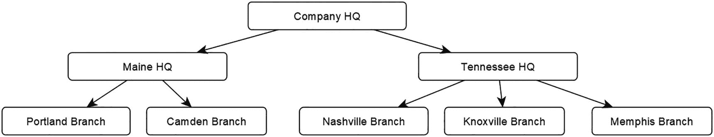
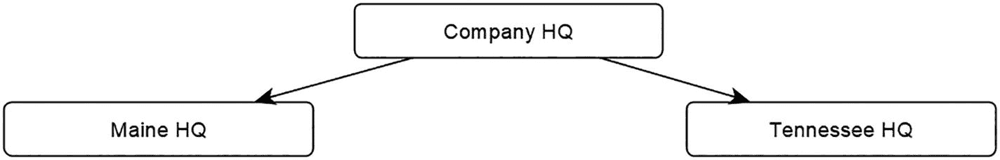
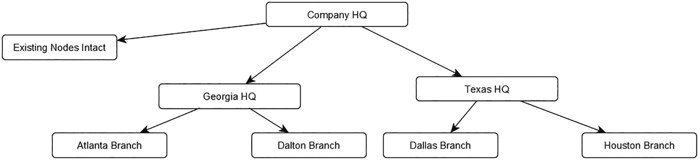

# 5. 树数据结构

树是你将使用 SQL Server 数据库实现的较为典型的图形结构之一。正如第 1 章所介绍的，树是一种有向无环图 (DAG)，其中每个节点只能有一个父关系。换句话说，该节点只能作为 `to` 端参与零个或一个关系。在第 7 章中，你将实现一个通用的 DAG 结构，但在利用这些数据结构时，它将与树有某些相似之处。

树结构之所以常见，主要有两个原因。首先，它们是一种满足几乎所有公司都有的需求的数据结构：能够将活动（例如销售额）从执行工作的人员汇总到管理或协调该工作的人员，然后再汇总到执行该工作的区域。例如，像微软这样的公司需要知道其全年的总收入。该信息还必须按业务部门、单个产品、该产品的单个销售组等进行细分。微软可能还有一个树结构，可以按区域、产品线和颜色等细分数据。树结构固有地禁止重复，因此非常适合汇总货币归属。

其次，由于树的形状相对固定，多年来实现树一直是合理的。即使对于非常庞大的数据集，也有可能对树查询进行性能调优（这在可能同时向许多不同方向增长的循环图结构上则不那么合理）。

我第一次接触这个话题是在 20 多年前，当时我参加了一个由 David Rozenshtein 博士主讲的研讨会。他写了我职业生涯中最具影响力的书籍之一 (*The Essence of SQL*)，并且当时正在写一本关于树的书，研讨会结束后他把那本书给了我们。我认为他实际上并没有完成那本书 (*Tree and Graph Processing in SQL*)，因为即使到今天，它在亚马逊上仍被列为“预览版”。遗憾的是，由于这发生在更换了三份工作、25 年和五所房子之前，我已经没有这些书了，但那堂课上教授的一些技术至今仍在使用。

那堂课开启了我对树结构及其多种实现方式的长期着迷。在第 6 章中，当我介绍另一种实现图以实现高性能访问的方法时，我会进一步讨论这一点。

在本章中，我将提供使用 SQL Server 的图形数据库结构实现一个可用的树结构所需的基础代码。这包括创建对象、维护节点和边的所有代码，然后创建在大多数实现中非常常见的代码（在下一章中，我将使用该代码对结构进行一些测试。）本章的输出是一组实现第 2 章介绍并在图 5-1 中表示的数据结构的对象和数据。



一种数据结构。公司总部划分为缅因州总部和田纳西州总部。缅因州总部包括波特兰分部和卡姆登分部。田纳西州总部包括纳什维尔、诺克斯维尔和孟菲斯分部。

**图 5-1** 用于演示图形对象的小型数据集

在本章中，我将介绍管理此数据结构所需的基本技术，例如添加、删除和移动节点，然后查询节点以从父节点到子节点汇总活动。

## 创建数据结构

首先，让我们创建一个数据库、一个架构以及保存数据所需的表。在本书的 GitHub 仓库第 5 章中，有一个名为 `0000-Create The GraphDBTests Database.sql` 的脚本，其中包含可填充参数，用于创建名为 `GraphDBTests` 的数据库。它生成了一个足够大的数据库，用于执行第 6 章中的所有示例。

### 基础表结构

要开始此过程，请创建一个架构。架构名称代表此特定示例的算法/模式。在后面的示例中，当我为树的不同实现方法改变模式时，我会用代表这些算法的架构名称来区分示例代码。这让我可以构建相同的示例结构和加载脚本，唯一的区别是架构的名称。

```sql
CREATE SCHEMA SqlGraph;
```

`Company` 节点是一个基本对象，只包含名称和代理键值列。可以将此对象视为任何数据库中典型的客户表，只是在构建真实数据库时可能希望对象具有的许多其他属性方面有所缺失。在某些设计中，你可能有一个关系型的 `Company` 表，当你希望将其与其他 `Company` 行进行比较/定位时，再连接到 `Company` 节点表。

`Company` 表中的两列都有唯一性约束，代理整数键 (`CompanyId`) 是聚集键（也可以对 `$node_id` 伪列进行聚集，如果你需要通过 `$node_id` 获取许多列，这可能很有用）。与简单的邻接表（可能包含名为“`ParentCompanyId`”的列来指示层次结构）不同，正如你在前面章节中使用 SQL Graph 对象所看到的，图形结构位于定义为边的单独表中。

```sql
CREATE TABLE SqlGraph.Company
(
    CompanyId INT IDENTITY(1, 1) CONSTRAINT PKCompany PRIMARY KEY,
    Name VARCHAR(20) NOT NULL CONSTRAINT AKCompany_Name UNIQUE,
    RootNodeFlag bit CONSTRAINT DFLTCompany_RootNodeFlag DEFAULT(0)
) AS NODE;
```

`RootNodeFlag` 在处理树时有时非常有用，因为它会给你一个无需计算（或在查询中严格知道节点名称）的起始点。默认约束将使你只需在创建那个根节点时在 DML 中考虑它。为此，你添加以下索引以确保只有一个根节点：

```sql
CREATE UNIQUE INDEX rootNode ON SqlGraph.Company (RootNodeFlag)
WHERE RootNodeFlag = 1;
```

这条边中没有额外的列，但在真实的表中，你可能希望至少包含行创建时间以及关系建立时间。它们可能是相同的时间，但很可能不应该是相同的列，因为关系可能在行创建之前就已建立。

即使数据是实时传入的（例如，从 Web 界面），你也可能希望数据在插入主数据库之前经过一些工作流处理。保持此示例简单只是为了……保持示例简单（废话！），因此它基本上涵盖了我们关心的一个方面……实现树。当我将其他算法与此进行比较时，最重要的是我们为其他对象做同样的事情。

创建树的边（就像几乎任何有向无环图一样）都将是从一个节点到同一类型节点的链接，因此我将包含边约束以确保。显然，在像这样只有一个节点表的数据库中，这是隐含的，但当你想要测试性能和功能时，最好让你的结构尽可能遵循最佳设计实践。

```sql
CREATE TABLE SqlGraph.ReportsTo
(
    CONSTRAINT EC_ReportsTo$DefinesParentOf
    CONNECTION (SqlGraph.Company TO SqlGraph.Company)
    ON DELETE NO ACTION
) AS EDGE;
```

接下来，让我们添加一些索引来支持你将执行的查询类型。


### 树结构索引与维护

第一个索引是聚集索引，对于此结构，你将基于 `$to_id` 值对表进行聚集。这是因为最常见（且昂贵）的查询将是基于 `$to_id` 获取行。虽然你不需要为自己编写树的广度优先查询，但在内部这正是将要发生的事情，而 `$to_id` 所代表的列是所有这些查询的引导。将其设为 `UNIQUE` 约束，因为要使此对象成为严格的树，每个 `$to_id` 在结构中应该只出现一次。

请注意，你可以通过为特定结构在对象中添加名称并将其包含在唯一索引中，从而在同一对象中实现多个树结构。我不会将其作为具体示例，因为代码基本相同，只是需要过滤你正在处理的树段。

```
ALTER TABLE SqlGraph.ReportsTo
ADD CONSTRAINT AKReportsTo UNIQUE CLUSTERED ($to_id);
```

第二个索引实际上是在 `$from_id` 列上。当你对节点的父节点执行任何查询时，此索引将很有用。

```
CREATE INDEX FromId ON SqlGraph.ReportsTo($from_id);
```

我将使用一些特定的性能演示来比较算法，这两者都反映了你可能需要用于许多实际树对象的活动。

其中之一是汇总子对象的活动。这类似于一家公司在多个区域有销售额，你需要查看每个区域的销售额。当然，像通常情况一样，区域可以有子区域，如此类推直到不同的地点。没有要求树具有任何特定的形状。一个区域可以单独存在，另一个可以分解成数百个不同的子区域。

在简单情况下，你将从一个非常平衡的树开始，但你将看到如何修改它使其不平衡。在下一章中，表将填充相当大的随机生成的数据集，因此它们不会完全平衡，只是为了给示例增加一些现实感。

## 销售结构演示

以下对象实际上不是图本身的一部分，但用于生成一些公司销售数据。你将使用一个直接的算法来生成这些数据，因此相同的销售行总是为测试者生成。

为此，使用一个 `SEQUENCE` 对象为每个客户分配递增的销售数量（但为了简便，销售数量设置为 5）。`SEQUENCE` 对象使过程比使用列上的标识属性要简单得多，因为你可以将其放在存储过程中，如果你想使用不同的方法，替换起来要容易得多。

```
CREATE SEQUENCE SqlGraph.CompanyDataGenerator_SEQUENCE
AS INT
START WITH 1;
GO
CREATE TABLE SqlGraph.Sale
(
SalesId int NOT NULL IDENTITY(1, 1)
CONSTRAINT PKSale PRIMARY KEY,
TransactionNumber varchar(10) NOT NULL
CONSTRAINT AKSale UNIQUE,
Amount            numeric(12, 2) NOT NULL,
CompanyId         int            NOT NULL
CONSTRAINT FKSale$Ref$Company
REFERENCES SqlGraph.Company(CompanyId),
INDEX XCompanyId (CompanyId, Amount)
);
```

`SqlGraph.Sale` 表在此处用于当你执行聚合时使情况更“真实”。请注意，代码使用来自 `SEQUENCE` 对象的序列号作为 `Amount` 乘以 .25。

这是用于创建测试销售数据的存储过程：

```
CREATE PROCEDURE SqlGraph.Sale$InsertTestData
@Name     varchar(20),
--注意：所有过程都使用自然键以方便手动操作。
--如果你正在为工具实现此功能以进行操作，
--请尽可能使用代理键。
@RowCount int = 5
--如果需要，可以更改销售数量
AS
BEGIN
SET NOCOUNT ON;
WHILE @RowCount > 0
BEGIN
INSERT INTO SqlGraph.Sale(TransactionNumber, Amount,
CompanyId)
--两个 NEXT VALUE FOR 语句在同一代码中返回相同的值。
SELECT CAST(NEXT VALUE FOR
SqlGraph.CompanyDataGenerator_SEQUENCE
AS varchar(10)),
.25 * CAST(NEXT VALUE FOR
SqlGraph.CompanyDataGenerator_SEQUENCE
AS numeric(12, 2)),
--获取代理键
(   SELECT Company.CompanyId
FROM   SqlGraph.Company
WHERE  Company.Name = @Name);
SET @RowCount = @RowCount - 1;
END;
END;
```

在本章后面，你将看到执行此代码的输出。

## 树维护核心代码

在本节中，你将构建一个编码对象，用于在节点表中创建新行。如果你正在构建一个真实系统，此代码对于重用很有意义。请注意，为了演示清晰，我忽略了一些错误处理，但我已尝试在大多数代码中包含事务和 `TRY CATCH` 块，因此该代码对于即使是生产系统也是最低限度可接受的。

你在第 4 章中研究的一些技术（例如包含触发器对象以使处理更自然）本章不会使用，因为此代码将模拟更真实的过程，即客户可能在真实客户活动中一次创建一行。树结构通常是在线事务处理 (OLTP) 系统的一部分，数据在其他人使用时可能会被修改。

与“真实代码”的一个不同之处在于，在所有呈现的代码中，你对参数使用自然键值，因此脚本不必关心内部实现是什么。如果你正在为应用程序构建存储过程接口，通常应该使用主键，但在构建临时操作的接口时，对用户有意义的自然键要容易处理得多。

注意

在生产级代码中，尽可能让你的代码通过聚集键访问数据是最佳做法。它消除了对表的不必要书签查找读取。有关性能调整的更多信息，我建议参考 Grant Fritchey 的 *《SQL Server 2022 查询性能调优：故障排除和优化查询性能（第六版）》*。


## 创建新节点的代码

### 创建新节点至关重要

创建新节点是实现树结构（或任何面向数据的系统）所需的基本代码片段。在本书前几章中，我主要讨论了批量加载数据的技术。这些技术仍然适用于加载树，但在本章中，我想构建一个更贴近现实的例子，模拟用户创建数据。（如果你的对象中用户每小时创建 20,000 个节点，那么你将很快需要比我正在使用的服务器大得多的服务器！）

在树中，由于典型的要求是每棵树只有一个根节点，因此插入过程将包括将新节点链接到树中另一个节点的方法。

一次插入一行数据更接近你在现实世界中看到的情况，因为数据会随时间变化。了解生成数千行数据需要多长时间，可能是决定在构建树结构时使用哪种算法的重要因素。这实际上取决于你的个人需求。图形节点，尤其是树结构中那些以自然的、逐个方式存在的节点，添加到数据结构中的速度未必像独立于其他行的普通行那样快。

```sql
CREATE OR ALTER PROCEDURE SqlGraph.Company$Insert
(
@Name VARCHAR(20),
--使用自然键值使其更自然一些
@ParentCompanyName VARCHAR(20)
--并且确保在演示代码中代理值不必总是相同的
)
AS
BEGIN
SET NOCOUNT ON;
BEGIN TRY
BEGIN TRANSACTION
--获取节点的父节点
DECLARE @ParentNode NVARCHAR(1000) =
(SELECT $node_id
FROM SqlGraph.Company
WHERE name = @ParentCompanyName);
IF @ParentCompanyName IS NOT NULL
AND @ParentNode IS NULL
THROW 50000, 'Invalid ParentCompanyName', 1;
ELSE
BEGIN
--插入操作仅通过使用父节点的名称
--来获取父节点的键...
IF @ParentNode IS NULL
BEGIN
--在某些情况下，知道哪个节点是根节点是有利的，
--特别是因为我们通常只想要一个根节点。
INSERT INTO SqlGraph.Company
(Name, RootNodeFlag)
SELECT @Name,1;
END
ELSE
BEGIN
INSERT INTO SqlGraph.Company(Name)
SELECT @Name;
DECLARE @ChildNode nvarchar(1000) =
(SELECT $node_id
FROM SqlGraph.Company
WHERE name = @Name);
INSERT INTO SqlGraph.ReportsTo
($from_id, $to_id)
VALUES (@ParentNode, @ChildNode);
END;
END
COMMIT TRANSACTION
END TRY
BEGIN CATCH
IF XACT_STATE() <> 0
ROLLBACK TRANSACTION;
THROW; --重新抛出错误
END CATCH;
END;
GO
```

### 插入初始数据

在以下脚本中，你将插入第一组节点以实现图 5-2 所示的子图。



一个数据结构。公司总部划分为缅因州总部和田纳西州总部。

图 5-2

首次插入后的结构

```sql
EXEC SqlGraph.Company$Insert @Name = 'Company HQ',
@ParentCompanyName = NULL;
EXEC SqlGraph.Company$Insert @Name = 'Maine HQ',
@ParentCompanyName = 'Company HQ';
EXEC SqlGraph.Company$Insert @Name = 'Tennessee HQ',
@ParentCompanyName = 'Company HQ';
```

### 查看插入的数据

查看刚刚插入的数据：

```sql
SELECT CAST($node_id AS VARCHAR(64)) AS [$node_id],
CompanyId,
Name
FROM SqlGraph.Company;
SELECT CAST($edge_id as varchar(64)) as [$edge_id],
CAST($from_id as varchar(64)) as [$from_id],
CAST($to_id as varchar(64)) as [$to_id]
FROM   SqlGraph.ReportsTo;
```

你将看到数据在书中很难显示（实际上在你处理时也不那么容易查看！在这个例子中我只是让它自动换行）。

```
$node_id                                                     CompanyId   Name
------------------------------------------------------------ ---------- -----------
{"type":"node","schema":"SqlGraph","table":"Company","id":0}  1         Company HQ
{"type":"node","schema":"SqlGraph","table":"Company","id":1}  2         Maine HQ
{"type":"node","schema":"SqlGraph","table":"Company","id":2}      3          Tennessee HQ
```

以及边：


```
$edge_id                                                         $from_id                                                                 $to_id

{"type":"edge","schema":"SqlGraph","table":"ReportsTo","id":0}   {"type":"node","schema":"SqlGraph","table":"Company","id":0}     {"type":"node","schema":"SqlGraph","table":"Company","id":1}
{"type":"edge","schema":"SqlGraph","table":"ReportsTo","id":1}   {"type":"node","schema":"SqlGraph","table":"Company","id":0}     {"type":"node","schema":"SqlGraph","table":"Company","id":2}
```

与其尝试输出数据并以其自然风格进行格式化，不如在本书大部分需要展示内部结构的地方，我会使用以下函数，这些函数在本章下载资料的一个工具文件中可用：

```sql
SELECT Tools.Graph$NodeIdFormat($node_id,0) AS [$node_id],
CompanyId,
Name
FROM SqlGraph.Company;
SELECT Tools.Graph$EdgeIdFormat($edge_id,0) AS [$edge_id],
Tools.Graph$NodeIdFormat($from_id,0) AS [$from_id],
Tools.Graph$NodeIdFormat($to_id,0) AS [$to_id]
FROM SqlGraph.ReportsTo;
```

由于页面空间有限，这样能以更紧凑的方式返回相同的详细信息。我在函数调用中将第二个参数设为 `0`，以在此示例中不包含架构（schema）来节省空间，因为涉及的所有表都在同一架构中。

```text
$node_id        CompanyId   Name
--------------- ----------- --------------------
Company id:0    1           Company HQ
Company id:1    2           Maine HQ
Company id:2    3           Tennessee HQ
$edge_id         $from_id        $to_id
---------------- --------------- --------------
ReportsTo id:0   Company id:0    Company id:1
ReportsTo id:1   Company id:0    Company id:2
```

你会看到你有三个节点和两个边。假设在此过程中没有任何错误/重试（我遇到过很多次并重新开始以获得理想输出），`CompanyHQ` 的内部 id 值是 `0`。这些内部值即使对我的示例来说也不是那么重要，因此当你执行此代码时看到的内部值不一定是这些，这并非强制要求。

接下来，你将添加你的第一个叶节点。为了使整个示例更简单，我只在根节点上放置了销售数据。在现实世界的许多情况下，这也是一个非常合理的预期。即使将销售数据附加到非根节点也不会真正影响结果，但典型情况是商店或销售人员有销售数据，而区域的销售数据仅基于商店或销售人员。

```sql
EXEC SqlGraph.Company$Insert @Name = 'Nashville Branch',
@ParentCompanyName = 'Tennessee HQ';
EXEC SqlGraph.Sale$InsertTestData @Name = 'Nashville Branch';
```

执行该代码后，你可以在这里看到插入的销售数据：

```sql
SELECT *
FROM   SqlGraph.Sale;
```

这将返回

```text
SalesId  TransactionNumber Amount    CompanyId
-------- ----------------- --------- -----------
1        1                 0.25      4
2        2                 0.50      4
3        3                 0.75      4
4        4                 1.00      4
5        5                 1.25      4
```

目标是每次生成此数据集（以及稍后构建此测试数据库的其他版本时），`Nashville Branch` 的销售额始终是相同的 `$3.75`。显然，这不是一个非常实际的金额（并且每个新节点都会有五个始终递增的新销售记录），但保持值和行数相同对于性能和正确性测试很有帮助。

示例中的值相匹配这一事实多次在测试树算法时拯救了我（正如你将在下一章看到的，这些算法有时可能相当棘手）。我将这组数据用作所有这些算法的单元测试。使用此查询，你可以查看表中的值：

```sql
SELECT Name, SUM(amount)
FROM   SqlGraph.Sale
JOIN SqlGraph.Company
ON Company.CompanyId = Sale.CompanyId
GROUP BY Name;
```

这只会显示一行：

```text
Name
-------------------- ---------------------------------------
Nashville Branch     3.75
```

现在插入图表的其余数据，为所有叶节点添加销售记录：

```sql
EXEC SqlGraph.Company$Insert @Name = 'Knoxville Branch',
@ParentCompanyName = 'Tennessee HQ';
EXEC SqlGraph.Sale$InsertTestData @Name = 'Knoxville Branch';
EXEC SqlGraph.Company$Insert @Name = 'Memphis Branch',
@ParentCompanyName = 'Tennessee HQ';
EXEC SqlGraph.Sale$InsertTestData @Name = 'Memphis Branch';
EXEC SqlGraph.Company$Insert @Name = 'Portland Branch',
@ParentCompanyName = 'Maine HQ';
EXEC SqlGraph.Sale$InsertTestData @Name = 'Portland Branch';
EXEC SqlGraph.Company$Insert @Name = 'Camden Branch',
@ParentCompanyName = 'Maine HQ';
EXEC SqlGraph.Sale$InsertTestData @Name = 'Camden Branch';
GO
```

现在让我们以非常易于人类阅读的形式查看数据。SQL 图查询的一个有趣之处在于，没有简单的方法使用语法进行 `OUTER` 风格的连接/关联。因此，如果你想列出树中的所有数据，你需要做的不仅仅是 `MATCH` 查询来获取输出中的根节点。表中的根节点是那些 `$node_id` 没有在边中作为 `$to_id` 出现的节点。

这也是你在任何图中都需要做的事情，但在构建树时，它是过程中非常重要的一部分。为了避免该查询，这就是为什么我在我的对象中添加了 `RootNodeFlag` 列。

以下查询将为你提供包含根节点的树中的节点：

```sql
--get the root
SELECT Company.CompanyId, Company.Name, NULL AS ParentCompanyId
FROM  SqlGraph.Company
WHERE  RootNodeFlag = 1
UNION ALL
--get all the children of the root. Our tree can only have the one root since we have a UNIQUE constraint on the $to_id column
SELECT Company.CompanyId, Company.Name, ParentCompany.CompanyId AS ParentCompanyId
FROM   SqlGraph.Company,
SqlGraph.ReportsTo,
SqlGraph.Company AS ParentCompany
WHERE MATCH(Company<-(ReportsTo)-ParentCompany);
```

这将返回

```text
CompanyId   Name                 ParentCompanyId
----------- -------------------- ---------------
1           Company HQ           NULL
2           Maine HQ             1
3           Tennessee HQ         1
4           Nashville Branch     3
5           Knoxville Branch     3
6           Memphis Branch       3
7           Portland Branch      2
8           Camden Branch        2
```

在下载资料中，我将其编译成一个名为 `SqlGraph.CompanyClean` 的视图，以使对这些结构的后续查询更易于处理。

接下来是一些关于如何以半图形方式查看数据的操作。在以下查询中，你将数据输出为层次结构，显示通过树的路径（我注释掉了 `Name` 列，因为它也作为层次结构中的最后一个值表示）：

```sql
--the first node in a query will typically not show up in
--the output, so we have to include it seperately
SELECT 0 AS Level, Company.Name AS Hierarchy --,Company.Name
FROM  SqlGraph.Company
WHERE  RootNodeFlag = 1
UNION ALL
SELECT    COUNT(ReportsToCompany.CompanyId)
WITHIN GROUP (GRAPH PATH) ,
Company.NAME + '->' +
STRING_AGG(ReportsToCompany.name, '->')
WITHIN GROUP (GRAPH PATH) AS Friends
--,LAST_VALUE(ReportsToCompany.name)
--       WITHIN GROUP (GRAPH PATH) AS LastNode
FROM    SqlGraph.Company AS Company,
SqlGraph.ReportsTo FOR PATH AS ReportsTo,
SqlGraph.Company FOR PATH AS ReportsToCompany
WHERE MATCH(SHORTEST_PATH(Company(-(ReportsTo)
->ReportsToCompany)+))
AND  Company.RootNodeFlag = 1
```

此查询的输出给出如下：


## 处理层次结构数据

```
Level       Hierarchy
----------- ---------------------------------------------------
0           公司总部
1           公司总部->缅因州总部
1           公司总部->田纳西州总部
2           公司总部->田纳西州总部->纳什维尔分部
2           公司总部->田纳西州总部->诺克斯维尔分部
2           公司总部->田纳西州总部->孟菲斯分部
2           公司总部->缅因州总部->波特兰分部
2           公司总部->缅因州总部->卡姆登分部;
```

使用此输出（并包含`Name`列），你可以将其构建为一个公共表表达式（CTE），然后使用`Level`列对每个项进行缩进，并使用`Hierarchy`列进行排序：

```
WITH BaseRows AS
(
SELECT 0 AS Level, Company.Name AS Hierarchy ,Company.Name
FROM  SqlGraph.Company
WHERE RootNodeFlag = 1
UNION ALL
SELECT  COUNT(ReportsToCompany.CompanyId)
WITHIN GROUP (GRAPH PATH) ,
Company.NAME + '->' +
STRING_AGG(ReportsToCompany.name, '->')
WITHIN GROUP (GRAPH PATH) AS Friends
,LAST_VALUE(ReportsToCompany.name)
WITHIN GROUP (GRAPH PATH) AS LastNode
FROM  SqlGraph.Company AS Company,
SqlGraph.ReportsTo FOR PATH AS ReportsTo,
SqlGraph.Company FOR PATH AS ReportsToCompany
WHERE MATCH(SHORTEST_PATH(Company(-(ReportsTo)
->ReportsToCompany)+))
AND Company.RootNodeFlag = 1
)
SELECT REPLICATE('--> ',Level) + Name AS HierarchyDisplay
FROM   BaseRows
ORDER BY Hierarchy;
```

该查询返回以下输出：

```
HierarchyDisplay

公司总部
--> 缅因州总部
--> --> 卡姆登分部
--> --> 波特兰分部
--> 田纳西州总部
--> --> 诺克斯维尔分部
--> --> 孟菲斯分部
--> --> 纳什维尔分部
```

寻找以可读格式输出层次结构的方法是处理图功能时的重要部分，因为确实没有简单的方法可以图形化输出数据。`SHORTEST_PATH`对于树结构非常有效，因为每个节点在输出中只能出现一次。在本书的最后两章中，我将讨论在循环图中必须处理的`SHORTEST_PATH`的局限性，但对于树来说它是完美的，因为从一个节点到另一个节点的最短路径，根据定义，始终是一条路径。

在下载文件中，我将其创建为一个名为`SqlGraph.CompanyHierarchyDisplay`的视图，我将在本章的其余部分使用它来输出示例。在其中，我包含了`Hierarchy`、`Level`和`Name`列，以便在有用的地方提供更多信息（`Hierarchy`列也用于对输出进行排序）。

### 重新指定父节点

一旦将数据构建成树结构，一个常见的操作是将一个节点移动成为另一个节点的子节点。这在管理关系对象中是很典型的操作。

使用邻接表类型的结构（如 SQL Graph 那样在简单的从-到对象中存储边）来重新指定树中节点的父节点通常很简单。只需将`$from_id`值从一个父节点修改为另一个即可。

这与使用 SQL Graph 边实现的方式相同，只是你不能修改边对象的`$from_id`或`$to_id`值，因此你需要删除原始边并创建一个新的。如果你在边对象中存储了数据，你也需要在代码中处理这些数据（当然，如果数据在将行重新父级化后仍然有意义的话）。

对于 T-SQL 代码中的多步操作，使用存储过程总是好的，这使得以安全的方式使用事务变得容易得多，因为你知道它会被提交或回滚。在临时风格的代码中多次执行此操作比使用存储过程要麻烦得多，并且更容易出现忘记提交事务而丢失工作等错误。

在接下来的代码中，你将为`Company`对象实现重新父级化的代码。使用邻接表结构重新父级化可以被视为一种边更新操作，但我通常将其与通用的更新过程分开实现，因为我通常希望独立地更新有关两个节点连接的说明，而不是将它们移动到树中的不同位置。因此，重新父级化操作的安全权限可能与正常更新不同。

以下代码实现了重新父级化的操作。（如果你的边对象上有任何列，你需要确保在代码中也复制那些属性，因为重新父级化需要你删除现有的边并重新插入行。）

```
CREATE OR ALTER PROCEDURE SqlGraph.Company$Reparent
(
@Name varchar(20), --again using natural key values
@NewParentCompanyName varchar(20)
)
AS
BEGIN
SET NOCOUNT ON;
BEGIN TRY;
BEGIN TRANSACTION;
--get the new location you wish to change to
--the from is what is changing
DECLARE @FromId nvarchar(1000),
@ToId nvarchar(1000) --to id will not change
--use the natural key values to fetch the $from_id/$to_id
SELECT @FromId = $node_id
FROM   SqlGraph.Company
WHERE  name = @NewParentCompanyName;
SELECT @ToId = $node_id
FROM   SqlGraph.Company
WHERE  name = @Name;
--Delete the old edge, and since this isn't changing
--it will remain the same (note, $to_id is unique, so
--no need to worry with the old $from_id value
DELETE SqlGraph.ReportsTo
WHERE  $to_id = @ToId;
--create a new edge
INSERT INTO SqlGraph.ReportsTo($From_id, $to_id)
VALUES (@FromId, @ToId);
--finish up
COMMIT TRANSACTION;
END TRY
BEGIN CATCH
IF XACT_STATE() <> 0
ROLLBACK TRANSACTION;
THROW; --just rethrow the error
END CATCH;
END;
```

现在，让我们查看当前的树结构：

```
SELECT HierarchyDisplay
FROM SqlGraph.CompanyHierarchyDisplay
ORDER BY Hierarchy;
```

返回结果：

```
HierarchyDisplay

公司总部
--> 缅因州总部
--> --> 卡姆登分部
--> --> 波特兰分部
--> 田纳西州总部
--> --> 诺克斯维尔分部
--> --> 孟菲斯分部
--> --> 纳什维尔分部
```

现在，让我们将`缅因州总部`重新指定为`田纳西州总部`的子节点：

```
EXEC SqlGraph.Company$Reparent @Name = '缅因州总部',
@NewParentCompanyName = '田纳西州总部';
```

执行后，查看代码，你现在可以看到`缅因州总部`是`田纳西州总部`的子节点。查询该视图现在返回：

```
HierarchyDisplay

公司总部
--> 田纳西州总部
--> --> 诺克斯维尔分部
--> --> 缅因州总部
--> --> --> 卡姆登分部
--> --> --> 波特兰分部
--> --> 孟菲斯分部
--> --> 纳什维尔分部
```

另请注意，`缅因州总部`的所有子行也随之移动。我不会在这里实现，但你可以“相对不那么容易地”只将节点从树中移除并将其插入到结构中。这需要将要移除项的所有子节点都转移到其父节点下。这是一个不太常见的用例，可以在需要时使用多次重新父级化来完成。（删除代码将实现类似的功能，因为在这种场景下很典型，所以如果需要，你可以调整该代码。）

现在使用以下代码将`缅因州总部`放回原处：

```
EXEC SQLGraph.Company$Reparent @Name = '缅因州总部',
@NewParentCompanyName = '公司总部';
```

然后请自行验证它是否已回到正确的位置。


### 删除节点

接下来，你将实现删除节点的功能。删除比重新设定父节点更有趣，因为如果你要删除结构中有子节点的节点，该怎么办？是直接尝试删除该节点，还是删除其所有子节点？在本节中，你将实现一个处理三种可能性的过程：

1.  如果节点是叶节点，则直接删除，没有问题。
2.  如果节点是其他节点的父节点，则执行以下操作之一：
    1.  删除所有子节点。
    2.  将子节点移动到被删除节点的父节点。与重新设定父节点不同，删除节点**确实**感觉需要处理单项删除（例如，如果删除了经理 X，其员工会被移动到经理 X 的经理下，直到找到新的经理）。

> 注意
>
> 你也可以轻松设置其他可能性，例如替换节点或将子行移动到参数中另一个变量表示的节点。这可以添加到提供的存储过程中，但为了简洁起见，我不会添加。

这些可能性通过三个参数实现：要删除的节点的名称、一个指定是否尝试删除子节点的参数，以及一个指定是否重新设定任何存在的子节点的父节点的参数。这段代码很长，但有注释解释删除操作是如何完成的。

```sql
CREATE OR ALTER PROCEDURE SqlGraph.Company$Delete
@Name   varchar(20),
@DeleteChildNodesFlag bit = 0,
@ReparentChildNodesToParentFlag BIT = 0
AS
BEGIN
SET NOCOUNT ON;
BEGIN TRY;
IF @DeleteChildNodesFlag = 1 AND
@ReparentChildNodesToParentFlag = 1
THROW 50000,'Both @DeleteChildNodesFlag and (wrap)
@ReparentChildNodesToParentFlag cannot be set to 1', 1;
IF @DeleteChildNodesFlag = 1
BEGIN
--use this to get all the children of
--node to be deleted
--we need not only the direct descendants (which we
--will use for reparenting the
--child rows), but their descendants too so we can
--delete everything.
SELECT  LAST_VALUE(ReportsTo.$to_id)
WITHIN GROUP (GRAPH PATH) AS  CompanyNodeId
INTO    #deleteThese
FROM    SqlGraph.Company AS Company,
SqlGraph.ReportsTo FOR PATH AS ReportsTo,
SqlGraph.Company FOR PATH
AS ReportsToCompany
WHERE MATCH(SHORTEST_PATH(Company(-(ReportsTo)
->ReportsToCompany)+))
AND Company.Name = @name
--this is the node that was originally requested to
--be deleted
INSERT INTO #deleteThese
SELECT $node_id
FROM SqlGraph.Company
WHERE name = @Name;
--Now remove all traces of the parent and children
--as a from or a to in a relationship, then remove the
--company rows.
BEGIN TRANSACTION;
DELETE SqlGraph.ReportsTo
WHERE  $from_id IN (SELECT CompanyNodeId
FROM #deleteThese);
DELETE SqlGraph.ReportsTo
WHERE  $to_id IN (SELECT CompanyNodeId
FROM #deleteThese);
DELETE SqlGraph.Company
WHERE  $Node_id IN (SELECT CompanyNodeId
FROM  #deleteThese);
COMMIT TRANSACTION;
END;
ELSE IF @ReparentChildNodesToParentFlag = 1
BEGIN
--fetch the direct decendents of the row to reparent
SELECT $to_id AS ToId
INTO   #reparentThese
FROM   SqlGraph.ReportsTo
WHERE  $from_id = (SELECT $node_Id
FROM  SqlGraph.Company
WHERE  Name = @Name)
--this gets the parent row where you will move the child rows
--to. Would not work to remove the root
DECLARE @NewFromId NVARCHAR(1000) = (
SELECT $from_id
FROM   SqlGraph.ReportsTo
WHERE  $to_id= (SELECT $node_Id
FROM  SqlGraph.Company
WHERE  Name = @Name));
--delete the reporting rows for the rows to be
-- reparented
DELETE FROM SqlGraph.ReportsTo
WHERE  $to_id IN (SELECT ToId FROM #reparentThese)
--delete reporting rows for the row to be deleted
DELETE FROM SqlGraph.ReportsTo
WHERE  $to_id IN (SELECT $node_Id
FROM  SqlGraph.Company
WHERE  Name = @Name)
--if the parent is not null, create new rows
IF @NewFromId IS NOT NULL
INSERT INTO SqlGraph.ReportsTo
(
$from_id, $to_id
)
SELECT @NewFromId, ToId
FROM   #reparentThese
ELSE
THROW 50000,
'The parent row did not exist, operation fails'
,1;
--delete the company
DELETE FROM SqlGraph.Company
WHERE  $node_id = (SELECT $node_Id
FROM  SqlGraph.Company
WHERE  Name = @Name)
END
ELSE
BEGIN
--we are trusting the edge and foreign key constraint
--to make sure that there are no orphaned rows
DECLARE @CompanyNodeId nvarchar(1000)
--fetch the node id of the company
SELECT @CompanyNodeId = $node_id
FROM   SqlGraph.Company
WHERE  name = @Name
--try to delete it
BEGIN TRANSACTION
DELETE SqlGraph.ReportsTo
WHERE  $to_id = @CompanyNodeId;
DELETE SqlGraph.Company
WHERE $node_id = @CompanyNodeId;
COMMIT TRANSACTION
END;
END TRY
BEGIN CATCH
IF XACT_STATE()  0
ROLLBACK TRANSACTION;
THROW; --just rethrow the error
END CATCH;
END;
```

### 测试代码

要测试此代码，请在图形结构中添加新节点，如图 5-3 所示。



*一个数据结构。公司总部 (Company H Q) 划分为现有的完整节点：乔治亚总部 (Georgia H Q) 和德克萨斯总部 (Texas H Q)。乔治亚总部包括亚特兰大 (Atlanta) 和道尔顿 (Dalton) 分支。德克萨斯总部包括达拉斯 (Dallas) 和休斯顿 (Houston) 分支。*

图 5-3

*将添加到数据结构中的新节点*

