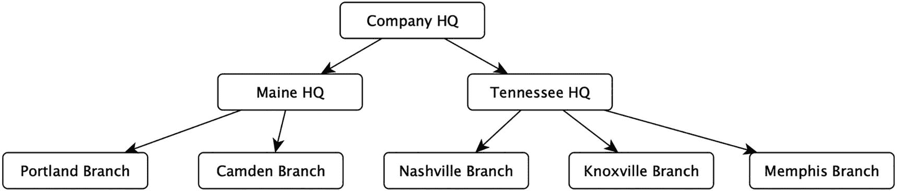
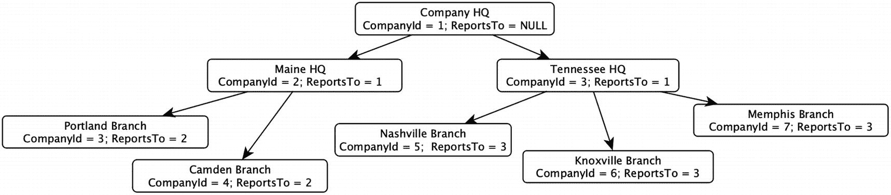
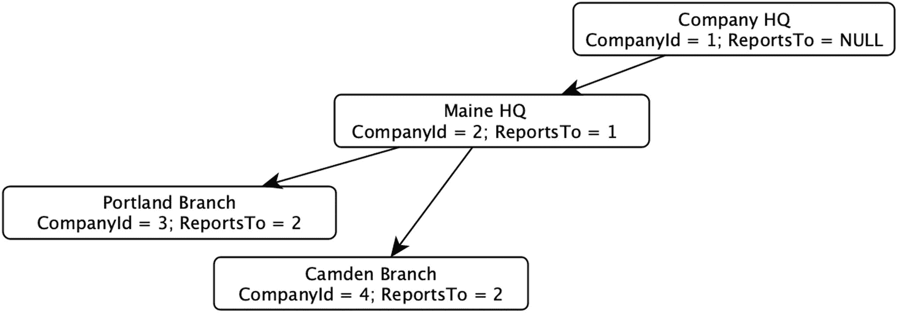

# 6. 树结构、算法与性能

我们讨论过的图（graph）最普遍有用的版本之一（尤其是在第 5 章）是树（tree）。它出现在销售组织中，区域（regions）汇总到地区（districts），地区再汇总到站点（sites），然后到各个销售人员（salespersons）。按年比较每个层级的汇总销售情况是许多组织最重要的报告之一。按区域汇总销售也将是我将在单独章节中介绍的每种树实现方法的主要演示之一，这些章节将更详细地涵盖这些方法。

到目前为止，我还没有过多讨论使用 SQL 图对象可以处理多少数据。在本章中，你不仅将测试 SQL 图对象，还将学习在 SQL Server 中创建树对象的其他几种方法，并深入了解它们的性能表现。

对于数据结构配置（除了在第 5 章介绍的 SQL Graph 之外），你将看到该方法工作原理的基本算法、插入数据的代码，以及如何复制在第 5 章为 SQL Graph 构建的查询。（下载内容包含与上一章创建的 SQL Graph 对象相匹配的完整实现细节，以及其他几种实现。）

在探索算法之后，你将使用一些测试数据脚本来加载不同规模的数据样本，然后比较 SQL Graph 与其他算法在查询大量行和创建大量行方面的表现。

## 替代的树实现

到目前为止我们讨论的所有图都是邻接表（adjacency list）主题的变体。我们有一个表来保存两个对象（节点）之间的关系（边），并且根据我们对关系键值设置的限制，我们得到一个循环图或非循环图。对于除了严格树结构之外的几乎所有图配置，这都是一种最优实现。

在关系表（甚至图结构）中使用邻接表/广度优先算法可能会有一些性能限制（你必须获取的每个层级都会增加成本，对于非常大的树，由于存储成本，这种增加会相当快）。某些树的使用需要极低延迟的访问（例如，当你登录计算机系统时，你可能属于多个安全组，而这些安全组本身也是其他安全组的成员，你肯定不希望用户等待数秒来获取他们的安全权限）。因此，你将学习几种性能友好的方法来提升特定类型的性能（代价是略高的维护成本，因为魔法确实是有代价的）。

幸运的是，树是非常特定的结构，与其他图的用途相比是刚性的。为了帮助解决性能问题，一些富有进取心的人定义了几种在关系数据库中实现树的方法，这些方法使用了本书迄今为止讨论的邻接表方法之外的其他方法。

在本章中，你将使用与第 5 章完全相同的树结构，如图 6-1 所示（这与第 5 章的图 5-1 相同）。在比较算法时，保持查询输出的一致性至关重要，无论是对于性能还是解决方案的适用性都是如此。在本章后面，我将介绍五组固定数据用于性能测试，完善这些算法的一个重要部分就是确保它们在回答相同问题时输出相同的答案。



一个树结构图。公司总部（Company H Q）分为缅因州总部（Maine H Q）和田纳西州总部（Tennessee H Q）。缅因州总部包括波特兰分公司（Portland Branch）和卡姆登分公司（Camden Branch）。田纳西州总部包括纳什维尔分公司（Nashville Branch）、诺克斯维尔分公司（Knoxville Branch）和孟菲斯分公司（Memphis Branch）。

图 6-1：树结构示例

这五组随机生成的数据将有助于衡量加载树和处理树所需的时间。“处理树”是指，你将编写代码来测试对树执行的常见操作（使用第 5 章介绍的对象），例如汇总树中每个节点的数据。每个根节点将被分配一定数量的销售数据，然后你将展示每个分公司、地方总部和公司总部的销售额输出。每种实现树的方法执行此操作的方式会有所不同。

到目前为止我谈到了邻接表，并在图 6-2 中展示了其可能的构建结构。你知道到目前为止使用的 SQL Graph 数据结构的内部与此类似，其中有一个单独的表存储 `Company` 和 `ReportsTo` Company。



一个层级组织结构图，公司总部（Company H Q）Company l d = 1，Reports To = NULL 位于顶部，有两个子公司：缅因州总部（Maine H Q）Company l d = 2，Reports To = 1 和田纳西州总部（Tennessee H Q）Company l d = 3，Reports To = 1，它们各自拥有自己的分公司。

图 6-2：邻接表示例

在本章中，你将学习另外两种将图数据存储在永久表中的方法，它们相对于 SQL Graph/邻接表方法具有一些优势或辅助作用。

### 路径技术

不是在图中存储相邻成员，而是将从节点到树根的路径以格式化的文本字符串形式存储。这是一种查询非常简单、维护难度中等的方法，能提供惊人的性能。

### 添加辅助表

添加在结构中充当索引的表，并预计算数据，以允许查询者跳过处理树时所需的一些迭代操作。

还有其他几种方法我想简要提及，但不会在本书中完全实现。第一种是使用 SQL Server 中的 `hierarchyid` 数据类型。虽然不算差，但 SQL Graph 总体上是更好的实现，应该是在处理图时的首选方式。

第二种方法非常有趣，但就我能想到的几乎所有实现而言，其痛点大于价值。这就是嵌套集（nested sets），但其局限性和成本让我决定在本书中省略它。对我来说有两个限制因素。一是逐行加载嵌套集结构非常耗时。它相对于其他一些方法的性能提升令人痛苦。二是以层次化视图查看数据对该方法来说并不自然。然而，它在查找图中任何大小的行的子节点和父节点方面极其高效。

嵌套集是由 Michael J. Kamfonas 在 1992 年 10/11 月期的 *The Relational Journal* 上一篇题为 "Recursive Hierarchies: The Relational Taboo!" 的文章中提出的。它也是 Joe Celko 钟爱的方法，他写了一本关于层次结构的书《*Joe Celko’s Trees and Hierarchies in SQL for Smarties*》（Morgan Kaufmann，2004 年）；如需进一步了解此方法及其他类型的层次结构，请参阅该书（现在已有第二版，2012 年）。

（注：在我的 `drsqlgithub` 仓库的 `GraphBook1` 项目中，有额外代码实现了远超本书所包含的内容。它在我的 GitHub 仓库上，因为随着时间推移它还会继续增长。）


### 路径技术

路径技术接收一个文本形式的路径表示并将其存储，从而使数据访问变得快速。图 6-3 展示了带有路径值的示例图。


一个层级组织结构，其中总公司（Company H Q Company l d = 1, path= 1）位于顶端，拥有两个子公司：缅因州总部（Maine H Q Company l d = 2, path= 1, 2）和田纳西州总部（Tennessee H Q Company l d = 3, path= 1, 3），每个子公司又各自拥有其子分支机构。

图 6-3

标有路径的示例图结构

我其实并不知道这种方法最初是谁提出的，但我是多年前从保罗·尼尔森那里学来的，当时我们正在讨论我最近才听说的嵌套集合方法。他强调的是这种方法是多么简单快捷。它确实如此。一旦你存储了数据，你就拥有了这个易于查询的结构，可以通过简单的 SQL 查询来访问，无需循环。

这种方法的基础是存储从根节点到每个节点的完整路径。有了这个信息，查询子节点或父节点就变得像使用`LIKE`表达式一样简单。通常，层次结构中的每个路径标签会使用代理键作为路径中的键值。关键在于，这个值需要是相对不可变的（因为更改键值需要修改所有使用它的路径值的行），并且要小（这不是 100%必需的，但值越长，字符串中能容纳的可索引的值就越少）。SQL Server 2016 及更高版本在非聚集索引中有 1700 字节的限制，对于一棵非常深的树来说这个限制是足够的，因为一个整数总是能放入 10 个字符内。

回顾图 6-3，`Knoxville Branch`行的路径是`\1\3\6\`。`CompanyId`是 6，这给出了当前节点的值。然后 3 是下一个父节点，1 是根父节点。

路径以这种方式形成并存储后，你可以使用简单的`LIKE`表达式来查找一个节点的所有子节点。例如，要获取`Maine HQ`节点的子节点，你可以使用一个`WHERE`子句，如`WHERE Path LIKE '\1\2\%'`来获取子节点，或者如果你不想在路径值中包含尾部分隔符，可以使用`LIKE '\1\2[⁰-9]%'`。`^`确保你字符串之后的下一个字符不是数字，并且父节点的路径也直接包含在路径中。因此，路径为`'\1\2\4\'`的`Portland Branch`的父节点是`'\1\2\'`和`'\1\'`。在 SQL Server 2016 及更高版本中，使用`STRING_SPLIT(PathValue,'\'`)，这同样是一个相当简单且更重要的、非迭代的过程，通过一个相当简单的查询即可获取父节点。

路径方法的一大优点是，对于大多数查询，它都能很好地利用索引，因为大多数时候它会使用字符串的左侧部分和/或来自实际行主键的值。即使你查询该结构，你也可以相当容易地获取一个按代理键值排序的、层次结构分明的数据视图。你的代码也可以调整为包含一个用户可读的层次结构来对输出进行排序，而且这个路径可以更大，因为你理想情况下不会在这些数据上进行搜索。

请记住，你可以为非常深的路径建立索引，因为在 1700 字节内，通常最多可以达到大约 150-170 级深度，前提是任何整数都能放入 10 个字符，并且存在分隔符。然而，一旦你的路径长度达到这个范围，每个数据页可能只能容纳四个键，这种情况下无论如何性能都不会太好。

与邻接表类型的方法相比，使用路径方法维护结构在某种程度上是一个缺点。对一个节点父节点的任何更改都可能意味着同时修改该行的子节点，因为它们也携带了你节点的路径。在树操作中，这被称为**重新父节点化**。如果你的路径是`\1\2\3\4\`，并且键值为 2 的节点被重新父节点化到节点 6 之下，那么 2 的路径需要更改为`\1\6\2\`，同时 2 的所有子节点路径也需要更改，在某些情况下这可能涉及数百甚至数百万行。

这通常可以通过使用`REPLACE`函数来完成，但最大的问题不在于算法编码有多难，而在于它将如何影响性能。你需要修改的行越多，就需要锁定更多的行，因为你会希望在一个显式事务中执行对树结构的修改，以防出错。

使用这种方法最大的顾虑可能是数据自我保护能力较差。在 SQL Graph 的邻接表模型中，保持结构为正确树的主要关注点是确保每个节点在某种程度上都与根节点有关系。但路径只是一个字符串，没有简单的方法可以确保你不会将路径更新为`'fred'`或`'10000'`，或者更糟的是`'\1\2\30000\432\'`，而实际上不存在键为 30000 或 2 的节点。如果此时你有数百万行数据，你可能会陷入困境。

对于重新父节点化甚至删除操作，子行会发生什么很重要。你不能在删除或重新父节点化路径为`'\1\2\3\4\'`的行之前删除路径为`'\1\2\3\'`的节点，否则你会在这个结构中留下孤立行。与树结构不同，在树中，没有父节点的节点默认会成为一个根节点，而使用路径方法，它只会变得无效，因为路径中引用的节点并非全部存在。

##### 代码

在本节中，你将看到展示如何使用路径方法完成插入操作的代码。首先是表结构。请注意，`CompanyId`列不是带有标识属性的列。因为路径将使用`CompanyId`值，所以使用`SEQUENCE`对象生成该值要容易得多。像往常一样，我会为代码添加注释，希望能让它的作用清晰明了。

##### 表创建脚本

创建脚本非常简单，只需要代理键、一个标识符和路径（我将路径的最大大小设为非聚集索引所能容纳的最大值）。此代码位于第[6 章的下载文件`1300-Path Method-Objects.sql`中。

```
CREATE SCHEMA PathMethod;
CREATE TABLE PathMethod.Company
(
CompanyId INT  NOT NULL CONSTRAINT PKCompany PRIMARY KEY,
Name VARCHAR(20)  NOT NULL CONSTRAINT AKCompany_Name UNIQUE,
Path VARCHAR(1700) NOT NULL INDEX Path
);
--索引最大为 1700 字节。允许至少 1600+级的深度，
--这对大多数用途来说已经非常深了，但这是一个限制。
--移除索引可能会严重损害性能。
```

#### 插入新行

对于插入操作，基本上是先获取父节点的路径，然后在数据结构中将其用作新节点的路径前缀：

```
CREATE PROCEDURE PathMethod.Company$Insert
@Name              varchar(20),
@ParentCompanyName varchar(20)
AS
BEGIN
--获取路径，路径格式类似 \CompanyId\CompanyId\...
DECLARE @ParentPath varchar(1700) =
COALESCE((  SELECT Company.Path
FROM   PathMethod.Company
WHERE  Company.Name =
@ParentCompanyName), '\');
--使用了 SEQUENCE 而不是 identity，因为这使
--在单个语句中完成下一步操作变得更容易，
--因为代理键是路径值的一部分。
--如果你愿意，可以先用 SCOPE_IDENTITY() 执行插入，
--然后再更新路径。
DECLARE @NewCompanyId int = NEXT VALUE FOR
PathMethod.Company_SEQUENCE;
--将新的 id 追加到父节点的 Path 后面
INSERT INTO PathMethod.Company(CompanyId, Name, Path)
SELECT @NewCompanyId, @Name,
@ParentPath + CAST(@NewCompanyId AS varchar(10)) + '\';
END;
```

下载内容中包含序列对象和过程`PathMetho.Sale$InsertTestData`，用于加载示例值，就像在第 5 章中一样。


### 层次结构路径方法

#### 返回层次结构

使用 `Path` 方法返回层次结构主要涉及格式化输出，因为路径已经存储其中：

```sql
CREATE OR ALTER FUNCTION PathMethod.Company$ReturnHierarchy
@CompanyName varchar(20)
RETURNS @Output TABLE (CompanyId int, Name varchar(20),
Level int, Hierarchy nvarchar(4000),
IdHierarchy nvarchar(4000),
HierarchyDisplay nvarchar(4000))
AS
BEGIN
DECLARE @CompanyId int,
@CompanyPath varchar(12),
@CompanyPathReplace varchar(12)
--获取你想要获取其子行的项目的 CompanyId 和路径
SELECT @CompanyId = CompanyId,
@CompanyPath = CONCAT('\',CompanyId,'\'),
@CompanyPathReplace = Path --用于格式化
--输出时不带前缀
FROM   PathMethod.Company
WHERE  Name = @CompanyName;
WITH BaseRows AS
(
--使用简单的 like 表达式来获取子行
--获取路径以父节点开头的子行
SELECT CompanyId, Name,
--使路径看起来像是从搜索节点开始的
REPLACE(path,@CompanyPathReplace,@CompanyPath)
AS IdHierarchy
FROM   PathMethod.Company
WHERE  Path LIKE @CompanyPathReplace + '%'
)
--输出行
INSERT INTO @Output
(
CompanyId,
Name,
Level,
Hierarchy,
IdHierarchy,
HierarchyDisplay
)
SELECT Baserows.CompanyId, BaseRows.Name,
LEN(IdHierarchy)
- LEN(REPLACE(BaseRows.IdHierarchy,'\',''))-1 AS Level,
'不可行', --可以用替换操作实现，
--如果必需，在插入时创建这个
BaseRows.IdHierarchy,
--为简单输出加上箭头
REPLICATE('--> ',LEN(IdHierarchy) -
LEN(REPLACE(BaseRows.IdHierarchy,'\',''))-2) + Name
AS HierarchyDisplay
FROM BaseRows;
RETURN;
END;
```

#### 检查子节点

检查一个节点是否是另一个节点的子节点是一个非常清晰的过程。你只需要查看两个项目在同一路径中的位置。因此，要查看公司 1 是否是公司 5 的父节点，你只需要找到看起来像 `'%\1\5%'` 或 `'%\1\%\5\%'` 的行。很酷的一点是，仅凭两个路径值你就可以判断它是否是子节点，因为父节点的路径将是任何子节点行路径的一部分。

```sql
CREATE OR ALTER FUNCTION PathMethod.Company$CheckForChild
(
@CompanyName varchar(20),
@CheckForChildOfCompanyName varchar(20)
)
RETURNS Bit
AS
BEGIN
DECLARE @output bit = 0;
--获取传入项的 companyId
DECLARE @CompanyPath varchar(1700)
SELECT  @CompanyPath = Path
FROM   PathMethod.Company
WHERE  Name = @CompanyName;
--获取子节点的公司 id
DECLARE @CheckForChildOfCompanyPath varchar(1700)
SELECT  @CheckForChildOfCompanyPath = Path
FROM   PathMethod.Company
WHERE  Name = @CheckForChildOfCompanyName;
--如果该项是待检查公司的子节点，则
--路径将包含父公司。无需返回表查询。
IF REPLACE(@CompanyPath,@CheckForChildOfCompanyPath, '') 
<> @CompanyPath
SET @output = 1;
RETURN @output;
END;
```

#### 报告销售数据

最后是聚合对象。这与 SQL Graph 示例的工作原理非常相似，但有一些将在代码中介绍的重要区别。

```sql
CREATE OR ALTER  PROCEDURE [PathMethod].[Company$ReportSales]
(
@DisplayFromNodeName varchar(20)
)
AS
BEGIN
--展开层次结构...
WITH ExpandedHierarchy
AS (SELECT Company.CompanyId AS ParentCompanyId,
ChildRows.CompanyId AS ChildCompanyId
--将表与自身连接，使用 LIKE 中的通配符查找匹配路径的行
FROM   PathMethod.Company
JOIN PathMethod.Company AS ChildRows
--注意这里是 %，意味着该行将在连接中
--匹配自身。
ON ChildRows.Path LIKE Company.Path + '%'
),
--添加格式化代码并筛选
FilterAndSweeten AS (
SELECT ExpandedHierarchy.*,
CompanyHierarchyDisplay.IdHierarchy,
CompanyHierarchyDisplay.HierarchyDisplay
FROM  ExpandedHierarchy
--返回层次结构函数为我们提供了
--用于连接的 companyId
JOIN  PathMethod.[Company$ReturnHierarchy]
(@DisplayFromNodeName) AS CompanyHierarchyDisplay
ON CompanyHierarchyDisplay.CompanyId =
ExpandedHierarchy.ParentCompanyId
)
,
--获取每个公司的汇总总计
CompanyTotals AS
(
SELECT CompanyId, SUM(Amount) AS TotalAmount
FROM   PathMethod.Sale
GROUP BY CompanyId
),
--为公司聚合每个公司的数据
Aggregations AS (
SELECT FilterAndSweeten.ParentCompanyId,
SUM(CompanyTotals.TotalAmount) AS TotalSalesAmount,
MAX(FilterAndSweeten.IdHierarchy) AS IdHierarchy,
MAX(FilterAndSweeten.HierarchyDisplay)
AS HierarchyDisplay
FROM   FilterAndSweeten
LEFT JOIN CompanyTotals
ON CompanyTotals.CompanyId =
FilterAndSweeten.ChildCompanyId
GROUP  BY FilterAndSweeten.ParentCompanyId)
--显示数据...
SELECT Company.CompanyId, Company.Name,
Aggregations.TotalSalesAmount,
Aggregations.HierarchyDisplay
FROM   PathMethod.Company
JOIN Aggregations
ON Company.CompanyID = Aggregations.ParentCompanyID
ORDER BY Aggregations.IdHierarchy
END;
```

这段代码与第 5 章中的 SQL Graph 方法的主要区别在于这个块：

```sql
--将表与自身连接，使用 LIKE 中的通配符查找匹配路径的行
FROM   PathMethod.Company
JOIN PathMethod.Company AS ChildRows
--注意这里是 %，意味着该行将在连接中
--匹配自身。
ON ChildRows.Path LIKE Company.Path + '%'
```

这非常酷，因为你将第一组行（表中的每一行）与自身基于模式进行连接。

> 注意
>
> 在第 6 章名为 `1301-PathMethod-Extended.sql` 的文件中，我实现了 `reparent` 和 `delete` 过程。

### 辅助表

迄今为止所讨论的技术（使用 SQL Graph、路径和嵌套集）的一个共同点是，当你使用它们时，通常是以迭代方式处理行或进行基于非相等的比较。这有时处理成本很高，尤其是在处理非常大的数据集时。在本节中，你将探索几种有助于优化这些过程的辅助表，特别是当数据集变得非常大，并且你可以容忍一定程度的处理延迟时。

公平地说，这些技术的核心思想是我在写作和家庭聚会中经常抱怨的（尽管没人在吃火鸡和填料时听），那就是`反规范化`。其理念是将迄今为止我们动态计算的一些内容进行持久化和预计算。

主要需要理解的是，与任何涉及数据复制的反规范化一样，当基础数据发生变化时，你也必须确保数据的副本与之匹配，才能为查询提供正确的答案。在我的示例中，我假设你可以离线重建数据集，并对这些副本表进行完全重建。（在某些情况下，进行更有针对性的刷新可能是有利的。）

这种刷新过程可能使并发执行变得困难，因此很多因素取决于你的数据修改频率以及实际使用中遇到的性能问题。修改以下代码并不困难，可以将数据保存在临时表中，并在需要时将其与实时表合并。

我将演示构建两张这样的表：

-   `Kimball 辅助表`：此表将扩展层级的概念具象化为一个表。这显然使聚合更快，但它也有助于其他过程（对于新手 SQL 程序员来说也明显更容易理解）。正如本章前面提到的，此方法以 Ralph Kimball 命名，他多年来为数据仓库社区做出了许多杰出贡献。
-   `层次结构显示辅助表`：在你作为销售汇总代码一部分构建的 `FilterAndSweeten` CTE 中，你使用了一个函数来获取数据。你将创建的表会预先构建那个显示表。在很多方面，你所做的只是复制邻接表中的路径方法表，让你可以使用更简单的 SQL Graph 表来管理层次结构，然后生成一个在查询时更易于使用的表，特别是如果你需要对这些对象进行任何报表处理的话。

#### Kimball 辅助表

这种方法实现起来相对简单，因为你之前或多或少已经创建了代码。该方法旨在处理数据仓库/读取密集型设置中，处理大量数据的报表系统中的层次结构。尽管它是为静态数据设计的（通常是每日刷新），但如果层次结构不经常变化，并且与该表的物理资源没有太多争用，它在 OLTP 环境中也可能是有用的。

回到邻接表的实现，图 6-4 展示了邻接表实现的一个子图。



一个层次化的组织结构，其中公司总部 `Company H Q Company l d = 1, Reports To = NULL` 位于顶部，有 1 个子公司 `Maine H Q Company l d = 2, Reports To = 1`，该子公司有 2 个分支机构：波特兰和卡姆登分支，公司 ID 分别为 3 和 4，`Reports To = 2`。

图 6-4

用于邻接表示例的子图，其值在 Kimball 辅助表方法中重复使用

要实现此方法，你将使用一个描述层次结构的数据表，其中对于层次结构的每个级别，每个父子关系占一行。因此，会有 `Company HQ` 到 `Maine HQ`、`Company HQ` 到 `Portland Branch`、`Maine HQ` 到 `Portland Branch` 的行，甚至每个节点自身也有行，比如 `Portland Branch` 到 `Portland Branch` 和 `Company HQ` 到 `CompanyHQ`。辅助表提供了从父到子的距离详细信息，以及其他有用的信息，例如它是否是根节点或叶节点。因此，对于树中最左边的四个项（`1`、`2`、`4`、`5`），你将得到如下表所示的行：

| `ParentId` | `ChildId` | `Distance` | `RootNodeFlag` | `LeafRowFlag` |
| --- | --- | --- | --- | --- |
| `1` | `1` | `0` | `1` | `0` |
| `1` | `2` | `1` | `0` | `0` |
| `1` | `3` | `2` | `0` | `0` |
| `1` | `3` | `2` | `0` | `0` |
| `2` | `2` | `0` | `0` | `0` |
| `2` | `3` | `1` | `0` | `1` |
| `2` | `4` | `1` | `0` | `1` |
| `3` | `3` | `0` | `0` | `1` |
| `4` | `4` | `0` | `0` | `1` |

这项技术的强大之处在于，现在你可以简单地通过查找 `WHERE ParentId = 1` 来请求 `1` 的所有子节点，或者通过 `WHERE ParentId = 2 and Distance = 1` 来查找 `2` 的直系后代。你可以通过查询 `WHERE ParentId = 1 and ChildLeafNode = 1` 来查找父节点的所有叶节点。

这种方法的明显缺点是它必须被维护，如果结构修改频繁，它可能不是一个合理的通用解决方案。老实说，Kimball 提出该方法是为了优化数据仓库中层次结构的关联关系使用，这些层次结构通常由 ETL 维护并每天刷新。对于此类用途，此方法应该是最快的，因为所有查询几乎完全基于简单的关系查询。

在所有方法中，这种方法应该对用户来说最自然。我知道一些公司就使用类似的解决方案来处理公司层次结构，例如用于行级安全性，因为这类数据变化极少，并且用户对延迟极为敏感。（关于 Kimball 方法的讨论摘自我写的 `Pro SQL Server 2012 Relational Database Design and Implementation` 一书（Apress, 2012）。）

注意

你可以将此方法扩展到任何图结构，甚至是循环图，但它会变得非常庞大和复杂。然而，根据结构的大小和利用率，它可能仍然有价值。

##### 代码

本节包含可用于使用 Kimball 辅助表的代码。


##### 表创建脚本

该表的结构与前面示例中介绍的结构一致：

```
--this table gives us the expanded hierarchy we used earlier to
--make aggregation and lookup easier
CREATE SCHEMA Helper;
GO
CREATE TABLE Helper.CompanyHierarchyHelper
(
ParentCompanyId    int,
ChildCompanyId     int,
Distance           int,
ParentRootNodeFlag bit
CONSTRAINT DFLTCompanyHierarchyHelper_ParentRootNodeFlag
DEFAULT 0,
ChildLeafNodeFlag  bit
CONSTRAINT DFLTCompanyHierarchyHelper_ChildLeafNodeFlag
DEFAULT 0,
--The primary key is from parent to child.
CONSTRAINT PKCompanyHierarchyHelper PRIMARY KEY(
ParentCompanyId,
ChildCompanyId),
--this index assists when looking for parent rows.
INDEX ChlldToParent UNIQUE (
ChildCompanyId,
ParentCompanyId
),
);
```

请注意，主键建立在 `ParentCompanyId` 和 `ChildCompanyId` 上。你不希望相同的组合出现多次。以下代码片段用于维护数据：

```
CREATE OR ALTER PROCEDURE Helper.CompanyHierarchyHelper$Rebuild
AS
BEGIN
SET NOCOUNT ON;
--delete all the data in the fastest way possible
TRUNCATE TABLE Helper.CompanyHierarchyHelper;
WITH ExpandedHierarchy (ParentCompanyId,
ChildCompanyId, Distance)
AS (
--gets all of the nodes of the hierarchy because the
--MATCH doesnt include the self relationship
SELECT Company.CompanyId AS ParentCompanyId,
Company.CompanyId AS ChildCompanyId,
0 as Distance
FROM SqlGraph.Company
UNION ALL --Not recursive. Just need both sets
--get the parent and child rows, along with the distance
--from the root
SELECT FromCompany.CompanyId AS ParentCompanyId,
LAST_VALUE(ToCompany.CompanyId)
WITHIN GROUP (GRAPH PATH) ,
COUNT(ToCompany.Name)
WITHIN GROUP (GRAPH PATH) AS Distance
FROM SqlGraph.Company AS FromCompany,
SqlGraph.ReportsTo FOR PATH as ReportsTo,
SqlGraph.Company FOR PATH AS ToCompany
WHERE MATCH(SHORTEST_PATH(FromCompany(-(ReportsTo)
->ToCompany)+))
)
INSERT INTO  Helper.CompanyHierarchyHelper(ParentCompanyId,
ChildCompanyId, Distance)
SELECT ParentCompanyId, ChildCompanyId, Distance
FROM   ExpandedHierarchy
OPTION (MAXDOP 1);
--set the special flags
--root nodes are never children
UPDATE  Helper.CompanyHierarchyHelper
SET    ParentRootNodeFlag = 1
WHERE  ParentCompanyId NOT IN (SELECT ChildCompanyId
FROM Helper.CompanyHierarchyHelper
WHERE  parentCompanyId 
ChildCompanyId)
--LEAF nodes are never parents
UPDATE  Helper.CompanyHierarchyHelper
SET    ChildLeafNodeFlag = 1
WHERE  ChildCompanyId NOT IN (SELECT ParentCompanyId
FROM Helper.CompanyHierarchyHelper
WHERE parentCompanyId 
ChildCompanyId)
END;
GO
```

需要刷新数据的用户只需执行此对象，表就会被清空并重新加载。请确保在加载数据时，用户没有并发查询该对象。

#### 检查子节点

此辅助表的一个有用场景是在检查子节点时。一旦你拥有两个 ID 值，只需查看是否存在包含父 ID 和子 ID 值的行即可。例如，如果你正在构建一个安全系统，除非用户变更非常频繁，否则可以使用辅助表使安全检查变得非常快速。

```
CREATE OR ALTER FUNCTION Helper.Company$CheckForChild
(
@CompanyName varchar(20),
@CheckForChildOfCompanyName varchar(20)
)
RETURNS bit
AS
BEGIN
DECLARE @output BIT = 0,@CompanyId int,
@CheckForChildOfCompanyId int
--translate the child companyId from parameter
SELECT  @CompanyId = CompanyId
FROM   SQLGraph.Company
WHERE  Company.Name = @CompanyName;
--translate the potential parentId from parameter
SELECT  @CheckForChildOfCompanyId = CompanyId
FROM  SQLGraph.Company
WHERE  Company.Name = @CheckForChildOfCompanyName;
--look for a row with the corresponding id values.
SELECT @Output = 1
FROM   Helper.CompanyHierarchyHelper
WHERE  ParentCompanyId = @CheckForChildOfCompanyId
AND  ChildCompanyId = @CompanyId
RETURN @OutPut
END;
```

#### 层级显示辅助表

在本章中，当使用 `SqlGraph.Company$ReportSales` 对象时，你使用 `SqlGraph.CompanyHierarchyDisplay` 视图来为你的输出数据集添加文本数据以丰富内容。在本节中，你将简单地获取该视图所表示的数据，并将其存储在一个表中。

##### 代码

此辅助表只是你通过使用在第 5 章实现的 `CompanyHierarchyDisplay` 视图对象执行 `SELECT INTO` 查询所获得的结构的副本，并添加了一些索引（真实情况）。

##### 表创建脚本

```
CREATE TABLE Helper.HierarchyDisplayHelper(
--one row per company
CompanyId int NOT NULL
CONSTRAINT PKHerarchyDisplayHelper PRIMARY KEY,
HierarchyDisplay varchar(8000) NULL,
Level int NOT NULL,
Name varchar(20) NOT NULL
CONSTRAINT AKHierarchyDisplayHelper UNIQUE,
Hierarchy varchar(8000) NOT NULL
) ON [PRIMARY]
GO
```

现在创建以下过程来加载数据。你基本上只是按原样查询视图并插入到表中。我在末尾包含了一个 `OPTION(MAXDOP 1)`，因为并行处理 SQL Graph 对象可能会有问题，并且对于较大的数据集，单线程处理表现更好。（截至本文撰写时，基于 SQL Server 2022，通常最好在与 SQL Graph 表处理大量数据的编码对象中添加此选项，你将在接下来的两章处理大型数据集时用到。）

```
CREATE PROCEDURE Helper.HierarchyDisplayHelper$Rebuild
AS
BEGIN
TRUNCATE TABLE [Helper].[HierarchyDisplayHelper];
INSERT INTO Helper.HierarchyDisplayHelper
(CompanyId, HierarchyDisplay, Level, Name, Hierarchy)
SELECT CompanyId, HierarchyDisplay, Level, Name, Hierarchy
FROM   SqlGraph.CompanyHierarchyDisplay
OPTION(MAXDOP 1); --when queries get complex, it is often
--better to use single threaded processing
--with sql graph
END;
```

#### 使用辅助对象

最后，让我们将这些结合起来，通过使用新创建的表替换扩展层级和筛选、丰富数据的代码，在 `Company$ReportSales` 存储过程中使用这些辅助表。


## 销售报告

```sql
CREATE OR ALTER PROCEDURE Helper.Company$ReportSales
@DisplayFromNodeName varchar(20)
AS
BEGIN
SET NOCOUNT ON;
-- 根据名称获取你查找节点的层级结构
-- 我们将像使用路径方法对象一样使用它
DECLARE @NodeHierarchy varchar(8000) = (
SELECT Hierarchy
FROM Helper.HierarchyDisplayHelper
WHERE Name = @DisplayFromNodeName);
-- 展开的层级结构现在是一个表
-- 显示版本也是如此。
WITH FilterAndSweeten AS
(
SELECT ExpandedHierarchy.*,
HierarchyDisplayHelper.Hierarchy,
HierarchyDisplayHelper.HierarchyDisplay
FROM  Helper.CompanyHierarchyHelper AS ExpandedHierarchy
JOIN Helper.HierarchyDisplayHelper
ON ExpandedHierarchy.ParentCompanyId =
HierarchyDisplayHelper.CompanyId
-- 将搜索过滤到以我们传入的路径开始
-- 之后的 `+` 确保过滤器能获取所有
-- 类似于我们获取的节点的内容，只要它没有
-- 后续的数字。
WHERE  HierarchyDisplayHelper.Hierarchy
LIKE @NodeHierarchy + '[⁰-9]%'
-- 包含查询的根节点，而非字符。
OR   HierarchyDisplayHelper.Hierarchy = @NodeHierarchy
)
,-- 获取每个公司的汇总数据
CompanyTotals
AS (SELECT CompanyId,
SUM(CAST(Amount AS decimal(20,2))) AS TotalAmount
FROM SqlGraph.Sale
GROUP BY CompanyId),
-- 为公司聚合数据
Aggregations AS
(SELECT FilterAndSweeten.ParentCompanyId,
SUM(CompanyTotals.TotalAmount) AS TotalSalesAmount,
MAX(Hierarchy) AS hierarchy,
MAX(HierarchyDisplay) AS HierarchyDisplay
FROM FilterAndSweeten
JOIN CompanyTotals
ON CompanyTotals.CompanyId =
FilterAndSweeten.ChildCompanyId
GROUP BY FilterAndSweeten.ParentCompanyId)
-- 显示数据...
SELECT Aggregations.ParentCompanyId,
Aggregations.hierarchyDisplay,
Aggregations.TotalSalesAmount
FROM Aggregations
ORDER BY Aggregations.hierarchy;
END;
```

现在你可以使用以下代码来利用这个层级结构。首先，刷新你的两个对象。（在真实系统中，如果你同时使用两者，你可能会创建另一个过程来调用两者，但为了我们的目的，没有这个必要。）

```sql
EXEC Helper.HierarchyDisplayHelper$Rebuild;
EXEC Helper.CompanyHierarchyHelper$Rebuild;
```

这完成后（在你的少量表的情况下，显然是瞬间完成的，但在下载中使用非常大的表时，可能需要几分钟），运行

```sql
EXECUTE Helper.Company$ReportSales 'Company HQ';
```

然后你将看到可能之前见过的集合：

```
ParentCompanyId hierarchyDisplay           TotalSalesAmount
--------------- -------------------------- --------------------
1               Company HQ                 81.25
2               --> Maine HQ               51.25
8               --> --> Camden Branch      28.75
7               --> --> Portland Branch    22.50
3               --> Tennessee HQ           30.00
5               --> --> Knoxville Branch   10.00
6               --> --> Memphis Branch     16.25
4               --> --> Nashville Branch   3.75
```

当然，这个数据集非常小，但在下一节中，你将对此进行测试。

## 性能比较

到目前为止，我在本书中没有过多谈论性能，但在这里，我想测试 SQL 图设计，以及路径方法和辅助表。

为此，我创建了五个测试数据集来生成数据。这些脚本使用了我们前两章一直使用的相同格式。有一个 `SqlGraph.SmallSet` 对象，它将该工作集复制为一个小型基线。每个脚本一次创建一行数据，并为每个叶节点创建五个销售行。这五个脚本为测试目的创建了一组可处理的行：

| **名称** | **行数** |
| --- | --- |
| 小 | 8 |
| 大 | 3400 |
| 宽 | 55301 |
| 深 | 42101 |
| 巨大 | 298001 |

如果你需要更大的数据集，下载中提供了数据生成器脚本生成器文件，你可以根据需要自定义数据集的外观。你可以调整每层大约想要的行数和层数。例如，`WideSet` 设置为提供 5 层层级结构，而 `Deepset` 设置为提供 15 层，但又不会大或深到使脚本运行很长时间。

我在本地测试机器上运行了这些脚本和测试，这绝不是服务器级设备，而且技术已有几年历史。（我从亚马逊购买的。标题是：*Intel NUC 9 NUC9i7QNX (Intel 6-Core i7-9750H, 64GB RAM, 2TB PCIe SSD, 2 x Thunderbolt, WiFi 6, HDMI, Win 10 Pro) Ghost Skull Canyon Extreme Gaming Box Elite*）。但它是一台强大的本地测试计算机，只运行着 SQL Server 2022 的 RTM 版本。

我运行测试脚本的方式是通过我的 `TestRig` 文件。数据加载完成后，我只需选择包含对象的模式，然后运行三个测试：

1.  将所有子节点获取到临时表两次，一次从根节点，一次从另一个非根节点。
2.  在一个语句中运行三个使用固定节点名称的子节点示例检查。
3.  运行两次 `Report Sales`，一次针对根节点，另一次针对与获取所有子节点相同的硬编码节点值。

那么，来看性能数字。较小的数据集通常都非常快，没有真正的区别。参见表 6-1。

**表 6-1：不同图工具的加载时间（秒）**

| 名称 | 行数 | SQL 图 | 路径 | 辅助表* |
| --- | --- | --- | --- | --- |
| 小 | 8 | 0.014 | 0.013 | 0.007 |
| 大 | 3400 | 3.53 | 4.00 | 0.37 |
| 宽 | 55301 | 51 | 48 | 7 |
| 深 | 42101 | 32 | 29 | 16 |
| 巨大 | 298001 | 227 | 222 | 523 |

* 辅助表加载时间仅指加载两个辅助表的时间。完整的加载时间也应包括 SQL 图的加载时间。

这部分最有趣的是辅助对象的加载时间。随着它们变得非常大，所需时间迅速增加。部分原因在于需要从单个文件以单线程运行代码。

真正的问题是，当我使用 SQL 图方法来处理树时，辅助表的价值有多大。这些值在表 6-2 中列出。

**表 6-2：两次聚合节点销售的近似时间（秒）**

| *聚合树时间* | | | | |
| --- | --- | --- | --- | --- |
| 名称 | 行数 | SQL 图 | 路径 | 辅助表 |
| --- | --- | --- | --- | --- |
| 小 | 8 | 0.016 | 0.003 | 0.18 |
| 大 | 3400 | 0.375 | 0.143 | 0.109 |
| 宽 | 55301 | 8.69 | 5.65 | 0.8 |
| 深 | 42101 | 9.31 | 3.2 | 0.7 |
| 巨大 | 298001 | 96.3 | 13.6 | 5.9 |

观察表 6-2 中的处理时间，你可以看到一些有趣的现象。首先，花时间创建辅助表对于任何类型的报表应用程序查询结构都非常值得，尤其是随着数据量的增长。路径方法更快，部分原因是其中一个辅助表的结构本质上与路径表类似。


