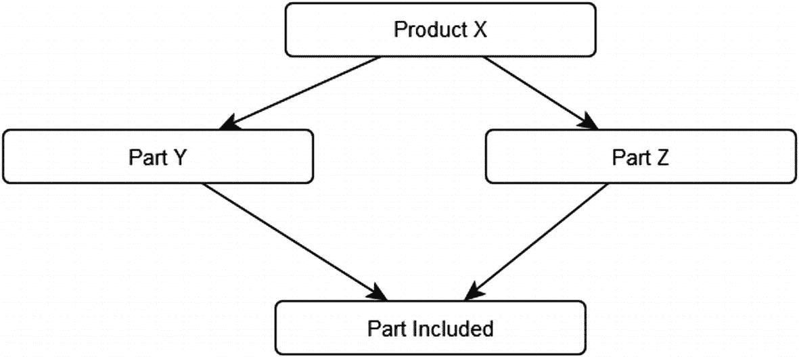
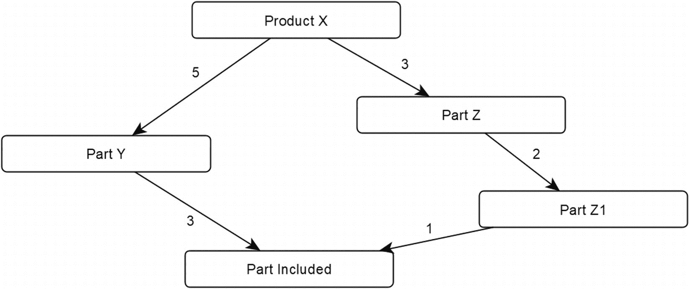
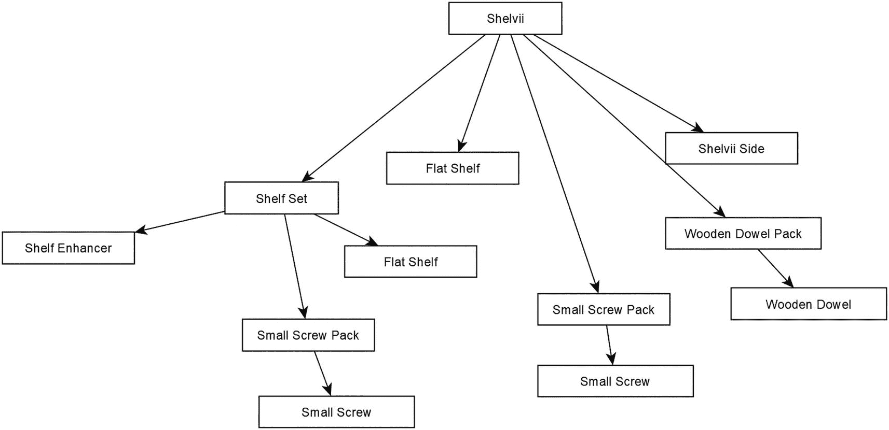
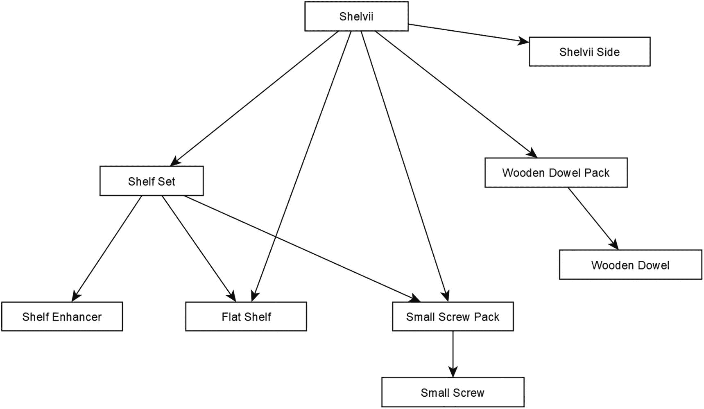
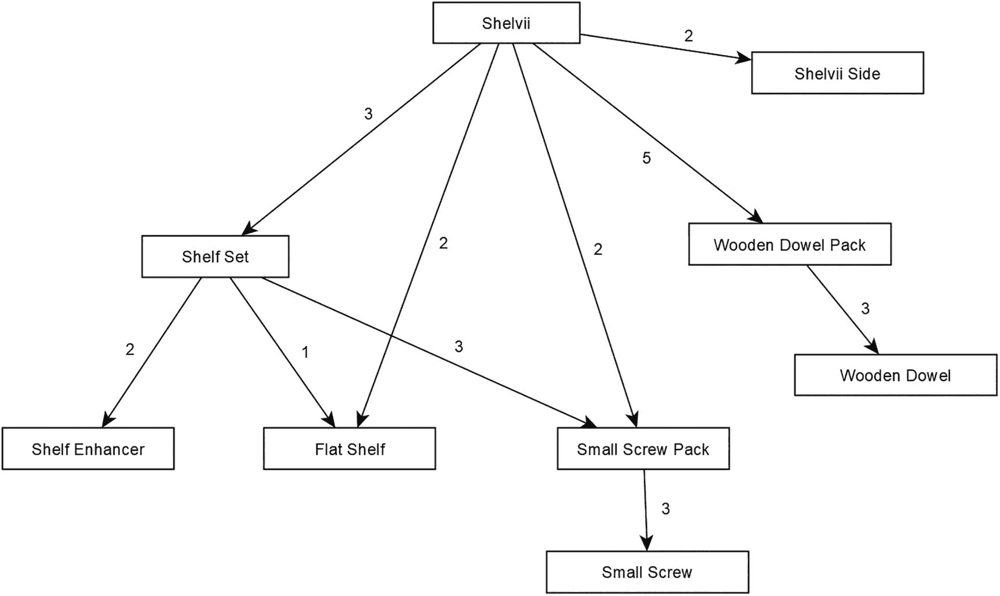
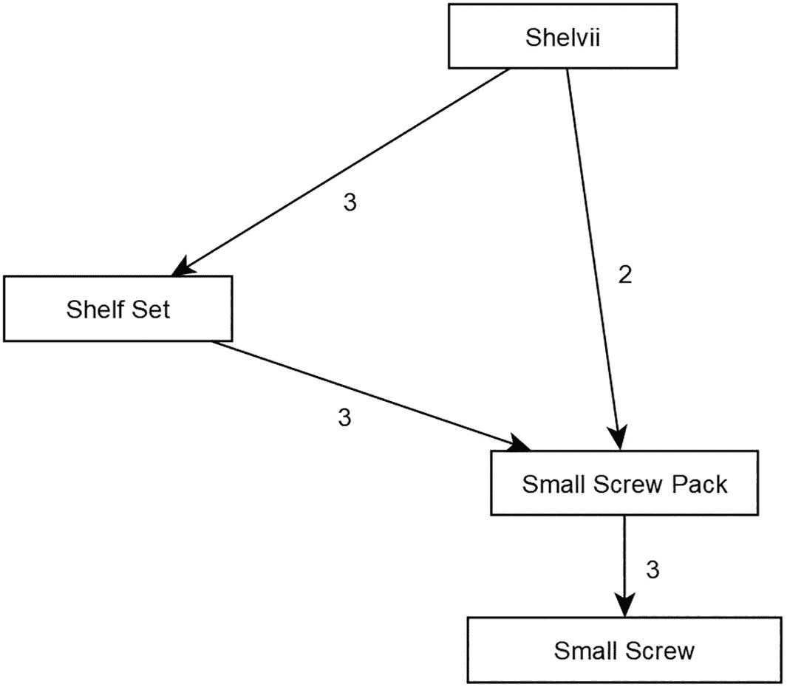
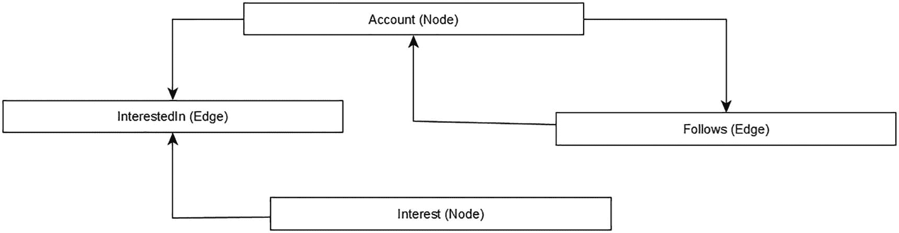
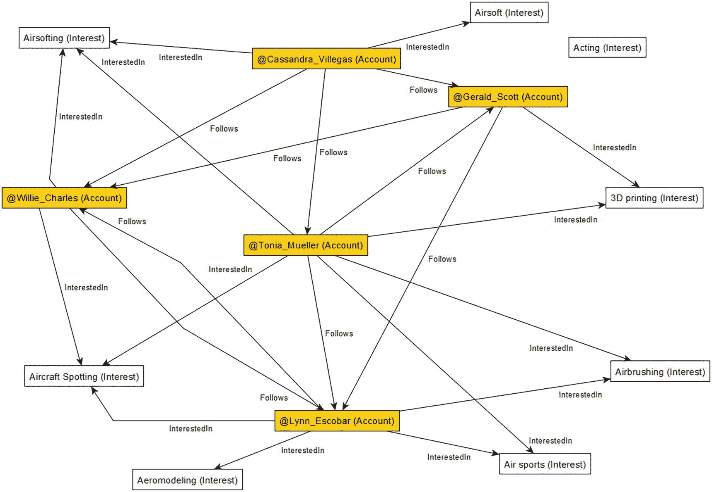

# 7. 其他有向无环图

在本章中，我想提供一个相对简短的示例和讨论，关于那些不是树的有向无环图（DAG）。早在第 1 章，我就将它们命名为多重层级结构，而非层次结构。

与树不同，在本章我要讨论的结构中，多重层级结构中的一个节点可以拥有任意多你想要和需要的入边/父关系。这将使结构的验证和编程变得有些更有趣，因为 SQL Server 实现的内置代码并未涵盖图的所有用途。

## 问题集

当处理不是树的 DAG 时，许多常见处理将是用于处理树的算法的子集。在每种情况下，你都是从结构中的某个节点开始，并沿着结构向下处理，通常使用与之前相同的 `SHORTEST_PATH` 代码。

只是 `SHORTEST_PATH` 的工作方式有一个小问题。它只会找到每个节点一次。对于树，由于每个节点只能有一个父节点，因此总是保证它在路径中只被找到一次。所以，没有问题。

但请看图 7-1 中的图。



图结构。产品 X 分为零件 Y 和零件 Z，两者都指向“included part”。

图 7-1

简单的多重层级结构

如果你使用 `SHORTEST_PATH` 来查看产品 X 是否包含零件“included part”，它将显示为与零件 Y 或零件 Z 相关，但不会同时与两者相关。因此，如果你只想知道零件“included part”*在某处*属于产品 X 的一部分，`SHORTEST_PATH` 工作良好。

但在这种图中（通常称为物料清单），你通常想知道该零件被包含的所有位置，甚至可能想知道在整个结构中包含了该零件的多少数量。

接下来考虑图如果实际如图 7-2 中的那样。



图结构。产品 X 通过数量 5 连接到零件 Y，通过数量 3 连接到零件 Z。零件 Z 通过数量 2 连接到零件 Z1。零件 Y 通过数量 3 和零件 Z1 通过数量 1 都导向“included part”。

图 7-2

扩展的物料清单示例组

如果你在这个图上使用 `SHORTEST_PATH` 来确定零件“included part”被用在何处，它只会显示为是零件 Y 的一部分，除非你从零件 Z 开始遍历。当你开始研究解决此问题的代码时，这种思路在一定程度上指明了你必须如何在代码中处理此问题：一次遍历树的一层并获取所有节点。幸运的是，SQL 提供了 CTE（公用表表达式）结构，使得这相对容易实现（尽管与 `SHORTEST_PATH` 相比并不简单）。

在物料清单中，你通常还会在边上具有数量。以一盒甜甜圈为例。假设盒子里包含两个原味、三个巧克力涂层和八个奶油夹心。如果你要从甜甜圈盒结构中汇总销售额，你有四个节点：一个代表盒子，三个相邻节点代表每种甜甜圈。边上有数量。而每张收据都是日销售结构中的一个节点，每张收据是独立的，但它们包含的产品是相同的。

正如前一章所演示的，在树中汇总边值相当简单。然而在这里，你会遇到 `SHORTEST_PATH` 的问题。任何聚合值都会被丢弃，因为节点在结构中多次出现。因此，如果你试图通过 `SHORTEST_PATH` 汇总当天所有枫糖培根甜甜圈的销量，你可能会发现只卖出了 12 个。（它们很美味。）

因此，你需要稍微改变处理数据的方法，我将在本章中展示这一点。


## 示例

在本章中，你将实现一个非常简单的物料清单（重复出现时缩写为 BOM）。此示例展示了一个你可能从最喜爱的肉丸供应商（这个参考对示例本身没有意义，但如果你知道，你就知道）购买的简单货架系统。

一个看起来巨大的整体货架，实际上是由大约 1000 个零件包装而成。其中一些零件在货架的多个区域被重复使用。从螺丝、木钉到货架板和玻璃板，所包含的零件中存在重复是非常普遍的。任何可以在产品之间重复使用的部件都会被重复使用。



一张树状图展示了“谢尔维”货架系统的组件和组装过程，其中包括一个货架套件、一个平板货架、一个带木螺丝的木钉包以及一个谢尔维侧板。货架套件包含一个货架增强器、一个小螺丝包和平板货架。每个小螺丝包包含小螺丝。

### 图 7-3 虚构的谢尔维货架系统分解图

在图 7-3 中，我绘制了我称之为“谢尔维”的树状表示图。请注意，结构中找到的名称存在一些重复，因为`小螺丝包`和`小螺丝`节点出现了不止一次。存在一些作为整个产品系统关键值的标识符，因为像`木钉包`这样的东西很可能也出现在其他产品中，比如“塔布里”系统，并且可能包含不同尺寸的钉包。这个例子的复杂程度仅够展示基本问题。将其推广到多个产品、产品线等并不困难。

主系统中还有一个重复的`平板货架`。思路是相同的`平板货架`用于顶部和底部，只是不需要货架增强器，所以它是独立的。同时请注意，在此讨论中我完全忽略了包装。只包括了构成货架的部件，我忽略了诸如该部件是否也可以单独销售等细节。

在不将此变成模块化家具设计文章的前提下，我希望能包含一个相对现实的示例，因为有一些你几乎肯定想对此数据执行的操作，它们不像树结构那样简单。在图 7-4 中，我重新建模了这个图，并将相同的节点合并成一个有向无环图。在第一张图中，有两个`小螺丝包`节点；现在只有一个节点，但有两个关系连接到那个节点。



一张结构图展示了谢尔维的组件，包括货架套件、平板货架、小螺丝包、木钉包和谢尔维侧板。货架套件包含货架增强器、平板货架和小螺丝包。小螺丝包包含小螺丝，木钉包包含木钉。

### 图 7-4 表示结构中物品重用的有向无环图

现在这个图显示，`谢尔维`节点和`货架套件`节点都是`小螺丝包`节点的父节点。这告诉需要取用这些物品的人员，如果他们一次性组装整个产品，需要取（至少）两个`小螺丝包`袋子。

我看到有流程为每个节点创建匹配的包装。因此，有存放`货架增强器`、`平板货架`、`小螺丝`、`木钉`和`谢尔维侧板`的料箱。向上查看列表，还有流程来包装`货架套件`、`小螺丝包`和`木钉包`，并且还有更多的料箱来存放它们。其中一些包装可能用于不同的货架系统，有些则不。如果一个系统需要 20 个小螺丝，另一个需要 2 个，那么就会有不止一种`小螺丝包`规格。为了简洁起见，请在我的示例中给我一定的余地以保持其简单。

最后，为了完成设置，我们需要数量。在图 7-5 中，我添加了每个货架系统所需每种物品的数量。



一张结构图展示了谢尔维的组件，包括 3 个货架套件、2 个平板货架、2 个小螺丝包、5 个木钉包和 2 个谢尔维侧板。货架套件包含 2 个货架增强器、1 个平板货架和 3 个小螺丝包。小螺丝包包含 3 个小螺丝，木钉包包含 3 个木钉。

### 图 7-5 谢尔维项目的完整图示

在本章的下载资料中，我包含了此结构的典型对象以及用于构建节点表和边表的查询。我只保留了表示有向无环图所需的必要数据。有一个`PartsSystem.Part`节点表（带有一个防止循环的触发器）和一个`PartsSystem.Includes`边表。我还包含了一个接口视图，这样你就可以使用简单的`INSERT`、`UPDATE`和`DELETE`语句来操作数据。

这个边有一个`IncludeCount`列。我还构建了一个`PartsSystem_UI`模式，使我们能够非常容易地插入新的`Parts`关系（如第 4 章所述）。所有这些代码都在下载资料中，位于第 7 章的名为`0001-CreateObjects.sql`的文件中。数据使用`0002-LoadData.sql`文件加载。

以下查询显示了在执行上述文件中的查询后系统中的数据：

```
SELECT *
FROM   PartsSystem_UI.Part_Includes_Part;
```

这返回以下数据（与图 7-5 匹配）：

```
PartName                 IncludeCount IncludesPartName
------------------------ ------------ -------------------------
Shelvii                  3            Shelf Set
Shelvii                  2            Flat Shelf
Shelvii                  5            Small Wooden Dowel Pack
Shelvii                  2            Shelvii Side
Shelvii                  2            Small Screw Pack
Shelf Set                2            Shelvii Shelf Enhancer
Shelf Set                1            Flat Shelf
Shelf Set                3            Small Screw Pack
Small Screw Pack         3            Small Screw
Small Wooden Dowel Pack  3            Wooden Dowel
```

在本章的剩余部分，你将实现几种通常需要对物料清单执行的查询类型：

*   确定某个部件是否用于构建中

*   为某个构建挑选物品，例如螺丝包的螺丝或货架套件的货架板

*   打印并汇总构建的零件清单


## 判断某零件是否用于构建

这是使用 `SHORTEST_PATH` 查询可以轻松完成的任务之一。由于你只是想了解哪些零件被使用了，只需要它们在列表中出现一次即可。因此，你可以执行以下简单使用 `SHORTEST_PATH` 的查询：

```sql
--被连接到的项。结果将是唯一的
SELECT LAST_VALUE(IncludesPart.PartName)
WITHIN GROUP (GRAPH PATH) AS ConnectedItem,
--显示我们得到此连接的路径
STRING_AGG(IncludesPart.PartName, '->') WITHIN GROUP
(GRAPH PATH) AS Path
FROM   PartsSystem.Part AS Part,
PartsSystem.Includes FOR PATH AS Includes,
PartsSystem.Part FOR PATH AS IncludesPart
WHERE  Part.PartName = 'Shelvii'
AND   MATCH(SHORTEST_PATH(Part(-(Includes)->IncludesPart)+))
ORDER BY ConnectedItem;
```

我将其包含在输出中以显示选择的路径，纯粹是出于好奇。实际上，你并不真正需要输出中的这个路径，因为你想要的是组成 Shelvii 系统的零件。

```text
ConnectedItem            Path
------------------------ -------------------------------------
Flat Shelf               Flat Shelf
Shelf Set                Shelf Set
Shelvii Shelf Enhancer   Shelf Set->Shelvii Shelf Enhancer
Shelvii Side             Shelvii Side
Small Screw              Small Screw Pack->Small Screw
Small Screw Pack         Small Screw Pack
Small Wooden Dowel Pack  Small Wooden Dowel Pack
Wooden Dowel             Small Wooden Dowel Pack->Wooden Dowel
```

需要注意的一点是，你只是部分回答了问题。这个查询为你提供了完整的列表，包括容器。Shelf Set 实际上不是一个物理实体；它是一组你必须收集的物理实体（加上一个纸箱，但如前所述，在此示例中我们忽略它）。这是否重要取决于你的观点。

```sql
WITH BaseRows AS
(
SELECT LAST_VALUE(IncludesPart.PartName)
WITHIN GROUP (GRAPH PATH) AS ConnectedItem,
STRING_AGG(IncludesPart.PartName, '->')
WITHIN GROUP (GRAPH PATH) AS Path,
--捕获 node_id 以便我们可以排除非叶节点
LAST_VALUE(IncludesPart.$node_id)
WITHIN GROUP (GRAPH PATH) AS ConnectedItemNodeId
FROM   PartsSystem.Part AS Part,
PartsSystem.Includes FOR PATH AS Includes,
PartsSystem.Part FOR PATH AS IncludesPart
WHERE  Part.PartName = 'Shelvii'
AND MATCH(SHORTEST_PATH(Part(-(Includes)->IncludesPart)+))
)
--筛选掉在结构中作为父节点的行
SELECT ConnectedItem, Path
FROM BaseRows
WHERE NOT EXISTS (SELECT *
FROM   PartsSystem.Includes
WHERE  $from_id = ConnectedItemNodeId)
ORDER BY ConnectedItem;
```

现在只返回

```text
ConnectedItem            Path
------------------------ --------------------------------------
Flat Shelf               Flat Shelf
Shelvii Shelf Enhancer   Shelf Set->Shelvii Shelf Enhancer
Shelvii Side             Shelvii Side
Small Screw              Small Screw Pack->Small Screw
Wooden Dowel             Small Wooden Dowel Pack->Wooden Dowel
```

回顾图 7-5，你会看到叶节点确实在此查询中显示出来了，这应该代表你需要组装一个 Shelvii 套件所需的原材料类型。

你也可以从对象中的任何层级开始处理。通过将过滤条件从 Shelvii 改为 Shelf Set 来开始：

```sql
WHERE  Part.PartName = 'Shelf Set':
```

现在你将看到它只返回三行：

```text
ConnectedItem       Path
------------------- ----------------------------------
Flat Shelf          Flat Shelf
Shelf Enchancer     Shelf Enchancer
Small Screw         Small Screw Pack->Small Screw
```

## 为构建选取物品

现在让我们反向操作。你不再关心每个零件在物理上由什么组成；你想要组装或包装一个架子。你被给予一定数量的给定包来构建，而某个地方有一个拣货清单（它告诉你应该从架子上取什么）。

拣货清单查询**应该**相当简单，因为你只需要向下遍历树一级来获取要输出的数据。因此，如果你要收集零件来组装一个 Shelvii，你只需要获取组成它的零件（捆绑的或原材料）：

```sql
SELECT IncludesPart.PartName, Includes.IncludeCount
FROM   PartsSystem.Part AS Part,
PartsSystem.Includes AS Includes,
PartsSystem.Part AS IncludesPart
WHERE  Part.PartName = 'Shelvii'
AND MATCH(Part-(Includes)->IncludesPart);
```

这返回

```text
PartName                  IncludeCount
------------------------  ------------
Shelf Set                 3
Flat Shelf                2
Small Wooden Dowl Pack    5
Shelvii Side              2
Small Screw Pack          2
```

这种构建的思路是，架子套件和紧固件包已经在另一个流程中预先包装好（以简化包装过程）。显然，这是一项繁琐的工作，但它比必须在组装整个包装之前先组合每个包装要快。如果你有多个订单都需要 Small Screw Packs，理想情况下，你应该制作相应数量的 Small Screw Packs。然后你继续处理 Shelf Sets（它包含了 Small Screw Packs），依此类推。

因此，你拿着这个清单（以及本章未包含的货位和其他你可能需要的数据片段），去拿取你需要的部件，并将它们放入你正在构建的包装中，就像之前有人处理 Small Screw Pack 时那样：

```sql
SELECT IncludesPart.PartName, Includes.IncludeCount
FROM   PartsSystem.Part AS Part,
PartsSystem.Includes AS Includes,
PartsSystem.Part AS IncludesPart
WHERE  Part.PartName = 'Small Screw Pack'
AND MATCH(Part-(Includes)->IncludesPart);
```

这返回以下内容：

```text
PartName                       IncludeCount
------------------------------ ------------
Small Screw                    3
```

在下一节中，你将使用那个 `IncludeCount` 列来确定组装整个架子需要多少螺丝。


## 打印构建的部件列表

查看构成产品的所有部件明细可能不太为组装人员所需，但对于订购未来产品的人来说却非常重要。我们需要多少？它们在哪些产品中以及如何使用？

这就是我们在基础语法上遇到问题的地方。`SHORTEST_PATH`无法满足需求，因为它只给出从根节点（子图或图的根）到子节点的单条路径。因此，如果你想打印整个构建所需的部件清单，你必须使用不同的方法。为了使你的物料清单查询无损，你基本上需要访问每个节点，查看它们包含哪些项目，然后查看它们的子行包含什么，直到你到达基础项目（即叶节点）。

### 解决方案：递归 CTE

解决方案是掌握广度优先搜索。为此，你使用一个递归 CTE。在查询的每一层，你只需使用一个`MATCH`表达式来获取构成一个构建的项目，然后获取构成下一个构建的项目，如此反复。例如，要查看构成`Shelvii`的所有部件、它们的用途以及所需数量，你可以使用以下查询。查询的工作方式记录在代码中。

```sql
WITH BaseRows
AS (
    --CTE 锚点只是你想要查看其明细的
    --起始节点
    SELECT Part.$node_id AS PartNodeId,
           Part.$node_id  AS RelatedToPartNodeId,
           Part.PartName,
           1 AS IncludeCount,
           --包含我们在所有示例中构建的可读路径的路径
           CAST('' AS NVARCHAR(4000)) AS Path,
           0 AS level --层级
    FROM PartsSystem.Part
    WHERE Part.Partname = 'Shelvii'
    UNION ALL
    --非常典型的单层图查询：
    SELECT Part.$node_id AS ItemId,
           IncludesPart.$node_id AS RelatedToItemId,
           IncludesPart.PartName,
           Includes.IncludeCount,
           BaseRows.Path + ' > ' + IncludesPart.PartName,
           BaseRows.level + 1
    FROM PartsSystem.Part,
         PartsSystem.Includes,
         PartsSystem.Part AS IncludesPart,
         BaseRows --这正是使其递归的原因。与名为 BaseRows 的集合进行连接。
    WHERE MATCH(Part-(Includes)->IncludesPart)
      --这将锚点与查询的递归部分连接起来
      AND BaseRows.RelatedToPartNodeId = Part.$node_id
)
SELECT PartName, IncludeCount as IncCt, BaseRows.Path
FROM BaseRows
WHERE BaseRows.PartName <> 'Shelvii'
ORDER BY Path
GO
```

### 初始结果与解读

这返回以下未聚合的结果：

```
PartName                 IncCt Path
------------------------ ----- ----------------------------------
Flat Shelf               2      > Flat Shelf
Shelf Set                3      > Shelf Set
Flat Shelf               1      > Shelf Set > Flat Shelf
Shelvii Shelf Enhancer   2      > Shelf Set > Shelvii Shelf ...
Small Screw Pack         3      > Shelf Set > Small Screw Pack
Small Screw              3      > Shelf Set > Small Screw Pac...
Shelvii Side             2      > Shelvii Side
Small Screw Pack         2      > Small Screw Pack
Small Screw              3      > Small Screw Pack > Small Screw
Small Wooden Dowel Pack  5      > Small Wooden Dowel Pack
Wooden Dowel             3      > Small Wooden Dowel Pack > ...
```

这为你提供了部件的细分、它们与什么相连以及每一层级的数量。你可以看到`Flat Shelf`出现了几次，因此下一步是汇总你的`Shelvii`所需的原材料数量。但虽然你`确实`在一包中有三个`Small Screw`，实际需要的数量是基于每包的数量，以及沿着查询锚点行的每条边上的数量来确定的。

考虑图 7-6 中展示的子图。`Shelvii`需要三个`Shelf Set`，每个使用两个`Small Screw Pack`，而每个`Small Screw Pack`又包含三个`Small Screw`。`Shelvii`系统本身直接使用两包。你需要计算的整个`IncludeCount`不应仅仅是一包中的数量，而应是所有层级的累积值，为此你需要使用乘法。


该结构图展示了 Shelvii 的组件，包括 3 个货架套件和 2 个小螺丝包。一个货架套件包含 3 个小螺丝包。一个小螺丝包包含 3 个小螺丝。

**图 7-6**
展示小螺丝包和小螺丝使用情况的子图

### 调整累计计数

要调整所使用的查询，在 CTE 的递归部分，将这行代码

```sql
Includes.IncludeCount,
```

改为

```sql
BaseRows.IncludeCount * Includes.IncludeCount,
```

这样修改查询后，在每一层，它都会将该层级的物品数量与下一层级的数量相乘。所以，如果你有 3 包，每包 3 个螺丝，你将使用 (`3 * 3`) = 9 个螺丝。

现在的输出如下所示：

```
PartName                 IncCt Path
------------------------ ----- ----------------------------------
Flat Shelf               2      > Flat Shelf
Flat Shelf               3      > Shelf Set > Flat Shelf
Shelf Set                3      > Shelf Set
Shelvii Shelf Enhancer   6      > Shelf Set > Shelvii Shel...
Shelvii Side             2      > Shelvii Side
Small Screw              6      > Small Screw Pack > Small Screw
Small Screw              27     > Shelf Set > Small Screw Pac...
Small Screw Pack         9      > Shelf Set > Small Screw Pack
Small Screw Pack         2      > Small Screw Pack
Small Wooden Dowel Pack  5      > Small Wooden Dowel Pack
Wooden Dowel             15     > Small Wooden Dowel Pack > ...
```

考虑到货架，你顶部和底部需要两个，内部搁板需要三个。你可以在输出中看到这一点。

对于螺丝，`Shelvii`中的三个`Shelf Set`需要(`3 * 3 * 3`)个，基础的`Shelvii`构建需要(`2 * 3`)个，你可以在输出中看到分别是 27 和 6。最后，你过滤掉非叶节点，以便输出对读者来说更清晰易懂。

### 最终聚合查询

```sql
WITH BaseRows
AS (
    --CTE 锚点只是你想要查看明细的
    --起始节点
    SELECT Part.$node_id AS PartNodeId,
           Part.$node_id  AS RelatedToPartNodeId,
           Part.PartName,
           1 as IncludeCount,
           --包含我们在所有示例中构建的可读路径的路径
           CAST('' AS NVARCHAR(4000)) AS Path,
           0 AS level --层级
    FROM PartsSystem.Part
    WHERE Part.Partname = 'Shelvii'
    UNION ALL
    --非常典型的单层图查询：
    SELECT Part.$node_id AS ItemId,
           IncludesPart.$node_id AS RelatedToPartNodeId,
           IncludesPart.PartName,
           BaseRows.IncludeCount * Includes.IncludeCount,
           BaseRows.Path + ' > ' + IncludesPart.PartName,
           BaseRows.level + 1
    FROM PartsSystem.Part,
         PartsSystem.Includes,
         PartsSystem.Part AS IncludesPart,
         BaseRows --这正是使其递归的原因
    WHERE MATCH(Part-(Includes)->IncludesPart)
      --这将锚点与查询的递归部分连接起来
      AND BaseRows.RelatedToPartNodeId = Part.$node_id
)
SELECT PartName, SUM(IncludeCount) AS IncludeCountTotal
FROM BaseRows
WHERE BaseRows.PartName <> 'Shelvii'
    --过滤掉非叶节点
    AND RelatedToPartNodeId NOT IN (SELECT $from_id
                                    FROM   PartsSystem.Includes)
GROUP BY PartName
ORDER BY PartName;
```

这返回

```
PartName                       IncludeCountTotal
------------------------------ -----------------
Flat Shelf                     5
Shelvii Shelf Enhancer         6
Shelvii Side                   2
Small Screw                    33
Wooden Dowel                   15
```

如果你回头参考图 7-5，你将能够核对预期的项目数量。


## 总结

在本章中，你了解了在构建非树状的有向无环图时可能遇到的一些常见问题类型。其代码与你在本书中反复使用的基础代码非常相似，这是有充分理由的。所有基于邻接表结构的图数据结构行为都相似。

DAG 与树结构非常相似，因为你通常在结构中从父节点到子节点来查找数据。在某些方面，所有 DAG 的工作方式都类似，但在需要查看或计算所有行值的某些用例中，它们的行为差异很大。使用 `SHORTEST_PATH` 可以做一些事情（例如查询 DAG 中的内容），但如果你不小心，查询可能会以不太明显的方式丢失信息。

## 8. 一个用于测试的图

这是最后一章。在本章中，你将看到一个相当简单但常见的图示例，你可以用它来探索如何查询循环图。在下载资源中，有一个代码生成器，它能让你根据精确的尺寸需求调整示例，并查看当数据量非常大时会发生什么。

这个工具能让你设定一个想要在典型消费级硬件或超级计算机上测试的图尺寸。该示例可以轻松适应你想要的任何大型行集。

本章中的几乎所有技术都在前面的章节中介绍过（尤其是第 3 章），所以其中应该没有什么全新的内容，但它应该既能作为复习，也能作为构建你自己的性能测试装置的一种方式。

## 示例

对于这个模型，我决定保持其非常简单。只有 `Account`, `Follows`, `InterestedIn` 和 `Interests`。图 8-1 展示了该模型的概念数据模型。



数据模型流程的表示。账户和兴趣节点通过“感兴趣于”边连接。账户节点和“关注”边是循环的。

图 8-1

示例概念模型

### 创建表

表设计延续了极简主义方法，每个节点只有一个文本列作为你将使用的自然键值。对于账户，它是 `AccountHandle`（在数据中格式为 `@ + 名称`。）

```sql
CREATE SCHEMA SocialGraph;
GO
CREATE TABLE SocialGraph.Account (
AccountHandle nvarchar(30)
CONSTRAINT AKAccount_Handle UNIQUE,
--在 Node_id 列上集群。大多数获取操作
--将基于 node_id 进行，而 Handle 通常只在
--获取第一行时使用
CONSTRAINT PKAccount PRIMARY KEY ($node_id)
) AS NODE;
```

请注意，本示例中 `$node_id` 伪列上有 `PRIMARY KEY` 约束。这是为了确保对图内部键的任何查找都会一并带出所有其他列。`AccountHandle` 列上有一个 `UNIQUE` 约束，因为 1）它需要是唯一的，2）你几乎在每个示例中都会用它来查找一行或几行。

由于表在 `$node_id` 上集群，组成该键的列也会出现在该索引的每一行中，这实质上使它们对于使用这些索引的任何查询都成为覆盖索引。

`Follows` 边只包含 `FollowTime`。我没有在任何查询中显示它（出于空间原因），但你也可以基于边表列来筛选行。

```sql
CREATE TABLE SocialGraph.Follows (
FollowTime datetime2(0)
CONSTRAINT DFLTFollows_FollowTime DEFAULT SYSDATETIME(),
--不能为 $from_id 和 $to_id 列添加 PRIMARY KEY，
--因为它们允许 NULL 值。因此使用 UNIQUE
--CLUSTERED 索引
CONSTRAINT AKFollows_UniqueNodes UNIQUE CLUSTERED
( $to_id, $from_id),
--相同的列，顺序相反，用于当你根据 $to_id 获取时
--例如获取关注你的人，而不是你关注的人
CONSTRAINT AKFollows_FromTO UNIQUE ( $from_id, $to_id),
--仅允许从账户到账户的连接
CONSTRAINT ECFollows_AccountToAccount
CONNECTION (SocialGraph.Account TO
SocialGraph.Account) ON DELETE NO Action
) AS EDGE;
```

接下来是 `Follows` 边上的一个触发器，用于确保你没有任何自引用关系。当你为测试生成数据时，拥有良好的约束是最重要的时刻之一。我个人主张在所有情况下都使用它们，但随机数据往往比用户生成的数据稍微“脏”一些。（自引用关系并不总是坏的，但在关注关系中通常是没有意义的。）

```sql
CREATE TRIGGER SocialGraph.Follows_IU_Trigger ON SocialGraph.Follows
AFTER INSERT, UPDATE
AS
BEGIN
IF EXISTS (SELECT *
FROM   inserted
WHERE  $from_id = $to_id)
BEGIN
ROLLBACK;
THROW 50000,'修改后的数据引入了自引用',1;
END;
END;
GO
```

接下来，创建 `Interest` 和 `InterestedIn` 边。它们的配置与前两个对象非常相似（除了在不同对象的两个节点之间实现关系时，你不必担心自引用关系）：

```sql
CREATE TABLE SocialGraph.Interest (
InterestName nvarchar(30)
CONSTRAINT AKInterest_InterestName UNIQUE,
CONSTRAINT PKInterest PRIMARY KEY ($node_id)
) AS NODE;
CREATE TABLE SocialGraph.InterestedIn
(
CONSTRAINT AKInterestedIn_UniqueNodes
UNIQUE CLUSTERED ($from_id, $to_id),
CONSTRAINT AKInterestedIn_ToFrom UNIQUE ($to_id, $from_id),
CONSTRAINT ECInterestedIn_AccountToInterestBoth
CONNECTION (SocialGraph.Account TO SocialGraph.Interest)
ON DELETE NO ACTION
)
AS EDGE;
```

在第 8 章的下载资源中，`0001 - Create Tables.sql` 文件里还有用于账户和兴趣的暂存表。然后有用于暂存数据的 .SQL 文件（100000 个 `账户` 和 434 个 `兴趣`。）使用这些行，你可以将数据集的大小定制得相当大，并且你可以轻松地向暂存表中添加更多账户，从而大幅提升数量。加载文件包含 `:SETVAR` 命令，可让你定制数据集的大小。如果你使用相同的种子，每次执行都可以得到相同的数据集。（关于生成可重复数据集的更多细节，我写的这篇博文对此进行了介绍：[`www.red-gate.com/simple-talk/blogs/generating-repeatable-sets-of-test-rows/`](http://www.red-gate.com/simple-talk/blogs/generating-repeatable-sets-of-test-rows/)）。

在下载地址 [`https://github.com/drsqlgithub/GraphBook1`](https://github.com/drsqlgithub/GraphBook1) 中，出版后的一段时间，将会提供实现其他几种测试数据集的工具，包括一个基于 IMDB 数据的数据集，如果你想要一个真正庞大且真实的数据集的话。拥有数百万个节点和连接，其规模可能带来管理挑战，但这是一个有趣的数据集。

### 加载数据

在本节中，我将简要说明如何加载随机数据。在第 8 章的下载文件中，有两个用于加载随机数据集的文件。每个文件都包含多个`:SETVAR`命令，用于创建`SQLCMD`变量。第一个文件将数据加载到表中，以实现如图 8-2 所示的数据。



一张网络图，显示了通过共同兴趣和社交联系连接起来的具有不同兴趣的人们。兴趣包括：软气枪、软气枪运动、表演、3D 打印、飞机观测、喷笔绘画、航空模型和航空运动，这些兴趣连接到 5 个账户。

图 8-2

本章示例查询的图表

颜色较深的节点（如果是电子书则为黄色）是`Account`（账户）节点，未着色的是`Interest`（兴趣）节点（在电子书中仍未着色！）。我使用以下参数生成了这些数据：

```
:SETVAR SeedValue 259906607
--最大值 100000
:SETVAR AccountCount 5
--最大值 434
:SETVAR InterestCount 8
:SETVAR FollowsCount 20
:SETVAR MaxInterestPerAccount 8
```

如果使用相同的`SeedValue`和参数，每次运行该文件中的查询，你都会得到相同的输出。如果更改这些值，结果会不同。我建议，通常如果要更改值，最好也更改种子值。否则，你的数据可能在多次测试中包含相似之处，从而造成混淆。

关于关注和兴趣，`AccountCount`和`InterestCount`值用于调整节点数量。`FollowsCount`告诉你会创建多少行`Follows`边，而`MaxInterestPerAccount`则调整每个账户可能具有的`Interests`数量。如果该值为 10，那么每个账户将有 0 到 10 个兴趣。

如果你直接执行随机数据脚本中的整个批处理，有几处输出有助于你感受数据集。例如，其中一个输出如下（为清晰起见，我从输出中删除了`$node_id`列）：

```
AccountHandle                  Froms       Tos
------------------------------ ----------- -----------
@Cassandra_Villegas            3           0
@Tonia_Mueller                 2           1
@Gerald_Scott                  2           2
@Lynn_Escobar                  1           3
@Willie_Charles                1           3
```

这让你可以看到，有三个账户，其中`@Cassandra_Villegas`正在关注其他账户（这使它成为许多查询的一个很好的锚点节点）。当我加载大型随机集后执行此查询时，前五行（共 100,000 行）如下所示：

```
AccountHandle                  Froms        Tos
------------------------------ ------------ ------
@Bryant_Huber                  10           10
@Sheila_Sherman                9            11
@Stacy_Charles                 13           7
@Angelica_O'Neill              7            12
@Armando_Swanson               9            10
```

这构成了一个相当有趣的图来进行处理。下载文件中包含一组我用于本章非性能测试部分的参数，这些参数只有与图 8-1 匹配的几个账户。

### 查询

在接下来的章节中，我将介绍一系列你可能希望在循环图中对高度连接的数据执行的查询。这些也是测试框架中执行的查询，用于测试具有大量数据的数据结构。

#### 查找与特定节点相连的所有节点

在图 8-1 中，你可以看到一些有趣的关系。`@Cassandra_Villegas`直接连接到另外三个账户，并通过所有其他路径连接到另一个存在的账户节点。在下面的查询中，你可以看到这一点：

```
--1 在测试框架中（对应于测试框架文件中的查询，
--可用于使用你想要尝试的参数运行所有查询
--被搜索项所连接到的项
SELECT LAST_VALUE(Account2.AccountHandle)
WITHIN GROUP (GRAPH PATH) AS ConnectedToAccountHandle,
--在结构中的距离
COUNT(Account2.AccountHandle)
WITHIN GROUP (GRAPH PATH) AS LEVEL,
--所采取的路径
STRING_AGG(Account2.AccountHandle, '->')
WITHIN GROUP (GRAPH PATH) AS ConnectedPath
FROM   SocialGraph.Account AS Account1
,SocialGraph.Account FOR PATH AS Account2
,SocialGraph.Follows FOR PATH AS Follows
WHERE  MATCH(SHORTEST_PATH(Account1(-(Follows)->Account2)+))
AND  Account1.AccountHandle = '@Cassandra_Villegas'
ORDER BY ConnectedPath
OPTION (MAXDOP 1); --较大的数据集可能导致使用 MATCH（尤其是 SHORTEST_PATH）的查询
--在并行处理发生时持续旋转。
```

正如你在本书到目前为止的许多结果中所见，`@Lynn_Escobar`只出现一次，因为`SHORTEST_PATH`只给你一条路径。查看图 8-2，节点之间存在多条连接。

```
ConnectedToAccountHandle  LEVEL  ConnectedPath
------------------------- ------ -------------------------------
@Gerald_Scott             1      @Gerald_Scott
@Tonia_Mueller            1      @Tonia_Mueller
@Lynn_Escobar             2      @Tonia_Mueller->@Lynn_Escobar
@Willie_Charles           1      @Willie_Charles
```

在本章后面，我将演示如何获取所有路径，这与第 7 章中的方法类似，但对于循环数据结构略有不同。然而，这种方法通常更适用于当你已知两个节点是相连的，并且现在想查看它们有哪些连接方式的情况。

例如，假设`@Cassandra_Villegas`正试图向`Lynn_Escobar`出售某物。如果出于某种原因他们不想通过`Tonia_Mueller`，那么查看所有路径可能有用。对于非常大的图（尤其是当你不只是想测试系统处理能力时），最好将`MATCH(SHORTEST_PATH)`条件中的`+`改为比“所有”更小的范围。在高度连接的图中，你可能很容易与几乎所有人相连。（例如，在 LinkedIn 上查看每个人是否都与其他人相连会很有趣，当然即使是在 100 层之外。）

在我能想到的几乎所有场景中，即使在学术上，知道一个用户通过二十或五十个节点的路径与另一个用户相连，也没有任何实际价值。

请注意，我在查询中添加了`OPTION (MAXDOP 1)`。这是在使用 SQL Server 图功能调整查询时可能需要做的主要事项之一。即使在 SQL Server 2022 中，当`SHORTEST_PATH`查询访问大量行时，性能也可能出现问题。显然，在本章前半部分，数据规模较小，但当你尝试访问更多行的查询时（下载中包含一个用于加载此架构并包含大量数据的脚本），如果不设置`MAXDOP 1`，某些查询可能运行 24 小时也没有进展。

在本书提供的所有建议中，如果你使用的是 SQL Server 2022 之后的版本，这个提示是需要检查的一点。

### 检查一个节点是否与另一个节点相连

在接下来的查询中，我们首先探索一下如何过滤你的查询，以查看两个节点是否相连。最典型的方式是使用一个 CTE 来表示到某个账户的所有连接，然后在 CTE 中对其进行过滤：

```sql
--2 测试框架中
WITH BaseRows AS (
SELECT Account1.AccountHandle + '->' +
STRING_AGG(Account2.AccountHandle, '->')
WITHIN GROUP (GRAPH PATH) AS ConnectedPath,
LAST_VALUE(Account2.AccountHandle)
WITHIN GROUP (GRAPH PATH) AS ConnectedToAccountHandle,
COUNT(Account2.AccountHandle)
WITHIN GROUP (GRAPH PATH) AS Level
FROM   SocialGraph.Account AS Account1
,SocialGraph.Account FOR PATH AS Account2
,SocialGraph.Follows FOR PATH AS Follows
WHERE  MATCH(SHORTEST_PATH(Account1(-(Follows)->Account2)+))
--起始点
AND  Account1.AccountHandle = '@Cassandra_Villegas'
)
SELECT *
FROM   BaseRows
--起始点是否连接到：
WHERE  ConnectedToAccountHandle = '@Lynn_Escobar'
OPTION (MAXDOP 1);
```

这将返回以下结果。（为了排版整洁，即使有更多列，在书中我只输出了 `ConnectedPath`。输出结果中的其余信息都可以从这个路径中直观地推断出来。）

```text
ConnectedPath

@Cassandra_Villegas->@Tonia_Mueller->@Lynn_Escobar
```

在某些情况下，我发现直接在查询中进行过滤可能会很麻烦。因此，像这样将 basrows 的内容保存到一个临时表中会很有用：

```sql
DROP TABLE IF EXISTS #hold
--3 测试框架中
SELECT Account1.AccountHandle + '->' +
STRING_AGG(Account2.AccountHandle, '->')
WITHIN GROUP (GRAPH PATH) AS ConnectedPath,
LAST_VALUE(Account2.AccountHandle)
WITHIN GROUP (GRAPH PATH) AS ConnectedToAccountHandle,
COUNT(Account2.AccountHandle)
WITHIN GROUP (GRAPH PATH) AS Level
INTO #hold
FROM   SocialGraph.Account AS Account1
,SocialGraph.Account FOR PATH AS Account2
,SocialGraph.Follows FOR PATH AS Follows
WHERE  MATCH(SHORTEST_PATH(Account1(-(Follows)->Account2)+))
AND  Account1.AccountHandle = '@Cassandra_Villegas'
ORDER BY ConnectedPath
OPTION (MAXDOP 1);
SELECT *
FROM   #hold
WHERE  ConnectedToAccountHandle = '@Lynn_Escobar';
```

它的输出结果与 CTE 版本相同，并且性能也可能一样。但就像任何 SQL 查询一样，当数据规模变得非常大时，帮助优化器一把，将查询拆分开可能会有所帮助。

测试框架中包含了这个查询的两个版本，以便比较它们的性能。

### 返回两个节点之间的所有路径

虽然通常知道你与某个人是连接的就很有用，但了解你们之间有哪些多种连接方式可能也很有趣。有几种方法可以实现这一点。

例如，对于前两级，你可以编写两个 `SELECT` 语句。一个是直接连接，另一个是第二级连接。用 `UNION` 将它们组合在一起，你就可以看到两级连接。

```sql
--4
SELECT  1 AS Level, '' AS ConnectedThrough, Account2.AccountHandle
FROM    SocialGraph.Account AS Account1,
SocialGraph.Follows,
SocialGraph.Account AS Account2
WHERE   MATCH(Account1-(Follows)->Account2)
AND   Account1.AccountHandle = '@Cassandra_Villegas'
AND   Account2.AccountHandle = '@Lynn_Escobar'
UNION ALL
SELECT  2 AS Level, Account2.AccountHandle AS ConnectedThrough, Account3.AccountHandle
FROM    SocialGraph.Account AS Account1,
SocialGraph.Follows,
SocialGraph.Account AS Account2,
SocialGraph.Follows AS Follows2,
SocialGraph.Account AS Account3
WHERE   MATCH(Account1-(Follows)->Account2-(Follows2)->Account3)
AND   Account1.AccountHandle = '@Cassandra_Villegas'
AND   Account3.AccountHandle = '@Lynn_Escobar'
ORDER BY AccountHandle;
```

这将返回

```text
Level       ConnectedThrough               AccountHandle
----------- ------------------------------ ---------------
2           @Tonia_Mueller                 @Lynn_Escobar
2           @Willie_Charles                @Lynn_Escobar
2           @Gerald_Scott                  @Lynn_Escobar
```

`@Cassandra_Villegas` 和 `@Lynn_Escobar` 之间没有一级连接，但有三个二级连接。

一方面，这种写法相当繁琐，特别是如果你需要这样做更多级的时候。另一方面，它的性能可能相当好，因为它实际上只是几个通过边进行的连接。我没有选择测试 10-20 级的路径，因为写起来太繁琐了。

如果你想查看所有级别的所有路径，你需要使用一个递归 CTE。这是一项相当重要的技能，因为通常你可能需要查看两个节点之间的所有路径，这在上一章使用有向无环图实现物料清单时也是需要的。

与前面例子最大的区别在于你正在处理一个循环结构。你必须在递归查询中添加的是，当在输出中遇到任何环时停止递归。回到图 8-1，你可以看到 `@Willie_Charles` 和 `@Lynn_Escobar` 互相关注。

请注意，这在第 3 章中已经介绍过，但我在这里再次提及是因为它很贴合，你会想用这个数据集来测试它。

你可以编写以下查询，筛选出你想查看其连接方式的那个特定账户。我还把输出限制在了五级：


### 优化查询与递归停止条件

执行以下代码：

```sql
--Getting the same answer as the last example
--5 in test rig
DECLARE @MaxLevel int =5,
@AccountHandle nvarchar(30) = '@Cassandra_Villegas',
@DetermineHowConnected nvarchar(30) =
'@Lynn_Escobar';
WITH BaseRows
AS (
--the CTE anchor is just the starting node
SELECT Account.AccountHandle AS AccountHandle,
Account.AccountHandle AS FollowsAccountHandle,
--the path that contains the readable path we have
--built in all examples with the anchor included
CAST('\' + Account.AccountHandle + '\'
AS nvarchar(4000)) AS Path,
0 AS level –the level
FROM SocialGraph.Account
WHERE Account.AccountHandle = @AccountHandle
UNION ALL
--pretty typical 1 level graph query:
SELECT  Account.AccountHandle,
FollowedAccount.AccountHandle
AS FollowsAccountHandle,
BaseRows.Path + FollowedAccount.AccountHandle + '\',
BaseRows.level + 1
FROM SocialGraph.Account,
SocialGraph.Follows,
SocialGraph.Account AS FollowedAccount,
BaseRows
WHERE MATCH(Account-(Follows)->FollowedAccount)
--this joins the anchor to the recursive
--part of the query
AND BaseRows.FollowsAccountHandle =
Account.AccountHandle
--this is the part that stops recursion, treating the
--string value like an array
AND NOT BaseRows.Path LIKE CONCAT('%\',
FollowedAccount.AccountHandle, '\%')
AND BaseRows.level < @MaxLevel
)
SELECT Path –for space reasons only
FROM BaseRows
WHERE FollowsAccountHandle = @DetermineHowConnected
ORDER BY Path;
```

执行此代码将返回以下结果：

```
Path
\@Cassandra_Villegas\@Gerald_Scott\@Lynn_Escobar\
\@Cassandra_Villegas\@Gerald_Scott\@Willie_Charles\@Lynn_Escobar\
\@Cassandra_Villegas\@Tonia_Mueller\@Gerald_Scott\@Lynn_Escobar\
\@Cassandra_Villegas\@Tonia_Mueller\@Gerald_Scott\@Willie_Charles
\@Lynn_Escobar\
\@Cassandra_Villegas\@Tonia_Mueller\@Lynn_Escobar\
\@Cassandra_Villegas\@Willie_Charles\@Lynn_Escobar\
```

可以看到，在结果中有三行是两跳远，这与之前`UNION`查询的结果一致，但还有更多的路径从你搜索的行连接到你正在匹配的行。

从那里，你可以使用`level`或`path`对输出进行过滤/排序。例如，将上一个查询的`where`子句更改为包含

```sql
AND Path like '_%\@Tonia_Mueller\%_'
```

现在，查询只获取经过`@Tonia_Mueller`的路径。

停止递归的代码部分是

```sql
AND NOT BaseRows.Path LIKE CONCAT('%\',
FollowedAccount.AccountHandle, '\%')
```

它通过将循环中的当前路径与`LIKE`表达式进行比较来实现这一点。该`LIKE`表达式获取查询中的当前节点，并在其周围添加字符，以便如果它在路径中，你就可以停止处理。因此，如果路径是`'\1\2\'`，下一个节点是 3，你会得到`'\1\2\3\' LIKE '%\3\%'`。这是关系数据库的局限性之一：没有数组（这是我唯一几次认为数组会有用的情况之一）。我知道其他关系数据库管理系统（RDBMS）有数组，但我预计它们在大多数使用中都会有问题。

缺乏数组意味着你将使用字符串中的数据作为分隔列表，并查看当前节点是否已存在于该路径中。

### 查找用户在任何层级上连接的所有具有共同兴趣的人

图查询语法真正开始大放异彩的地方是通过更多的节点发现更多的连接。在这种情况下，你希望找到在任何层级上相互连接、并且都对`Aircraft Spotting`（飞机观测）感兴趣的用户。Cassandra 目前没有记录这个兴趣，但在这个特定示例中，他们是否有此兴趣并不重要。这里的想法可能是 Cassandra 有兴趣开始从事`Aircraft Spotting`，并想看看是否有任何联系人已经对此感兴趣。

要实现这一点，使用`LAST_NODE`获取链中的最后一个节点，然后将这些节点与他们的兴趣进行匹配，以查看是否包含`Aircraft Spotting`：

```sql
--6 in test rig
----any level connection and connections have a specific interest
SELECT Account1.AccountHandle + '->' +
STRING_AGG(Account2.AccountHandle, '->')
WITHIN GROUP (GRAPH PATH) AS ConnectedPath,
LAST_VALUE(Account2.AccountHandle)
WITHIN GROUP (GRAPH PATH) AS ConnectedToAccountHandle,
COUNT(Account2.AccountHandle)
WITHIN GROUP (GRAPH PATH) AS LEVEL,
Interest.InterestName
FROM   SocialGraph.Account AS Account1
,SocialGraph.Account FOR PATH AS Account2
,SocialGraph.Follows FOR PATH AS Follows
,SocialGraph.InterestedIn
,SocialGraph.Interest
--This finds people that the searched for person follows
WHERE  MATCH(SHORTEST_PATH(Account1(-(Follows)->Account2)+)
--and this takes every matched node (the last node in the chain
--and sees if they are connected to Interest
AND LAST_NODE(Account2)-(InterestedIn)->Interest)
--The next two lines filter the results;
AND  Account1.AccountHandle = '@Cassandra_Villegas'
AND  Interest.InterestName = 'Aircraft Spotting'
ORDER BY ConnectedPath
OPTION (MAXDOP 1);
```

这将返回（出于空间原因仅包含路径）

```
ConnectedPath
@Cassandra_Villegas->@Tonia_Mueller
@Cassandra_Villegas->@Tonia_Mueller->@Lynn_Escobar
@Cassandra_Villegas->@Willie_Charles
```

在图 8-2 上追踪这些连接，你会发现这三个人都喜欢`Aircraft Spotting`（飞机观测），并且都关注了`@Cassandra_Villegas`。这类查询正是像营销人员这样的人可以开始精确定位目标群体的方式，通过与你相似的人、或你喜欢的人、以及共享兴趣或购买记录的人来吸引你，甚至可能匹配你搜索过的内容。

这类查询通常不会深入到结构的太深处，因为离锚节点越远，建议的吸引力就越小。（谁没有在亚马逊上收到过“与你相似的人”购买的、让你摸不着头脑的产品建议呢？）


#### 查找在任一层级与用户存在特定共同兴趣的连接用户

下一个查询与此非常相似，但也存在很大差异。这次，`LAST_NODE` 表达式要求节点共享一个兴趣：

```sql
WHERE  MATCH(SHORTEST_PATH(Account1(-(Follows)->Account2)+)
--Both Accounts interested in the same thing
AND LAST_NODE(Account2)-(InterestedIn)->Interest
<-(InterestedIn2)-Account1)
AND  Account1.AccountHandle = '@Cassandra_Villegas'
```

`MATCH` 表达式是相同的，因此你正在寻找在任何层级上相互关注的账户。现在，你取出最后一个节点，并通过 `Interest` 从最后一个节点账户连接到作为锚点的账户：

```sql
--8 in test rig
--any level connection and shared common interest
WITH BaseRows AS (
SELECT Account1.AccountHandle + '->' +
STRING_AGG(Account2.AccountHandle, '->')
WITHIN GROUP (GRAPH PATH) AS ConnectedPath,
LAST_VALUE(Account2.AccountHandle)
WITHIN GROUP (GRAPH PATH) AS ConnectedToAccountHandle,
COUNT(Account2.AccountHandle)
WITHIN GROUP (GRAPH PATH) AS LEVEL,
Interest.InterestName AS InterestName
FROM   SocialGraph.Account AS Account1
,SocialGraph.Account FOR PATH AS Account2
,SocialGraph.Follows FOR PATH AS Follows
,SocialGraph.InterestedIn
,SocialGraph.InterestedIn AS InterestedIn2
,SocialGraph.Interest
WHERE  MATCH(SHORTEST_PATH(Account1(-(Follows)->Account2)+)
--Both Accounts interested in the same thing
AND LAST_NODE(Account2)-(InterestedIn)->Interest
<-(InterestedIn2)-Account1)
AND  Account1.AccountHandle = '@Cassandra_Villegas'
)
SELECT InterestName, ConnectedPath
FROM   BaseRows
WHERE  ConnectedToAccountHandle = '@Tonia_Mueller'
ORDER BY ConnectedPath
OPTION (MAXDOP 1);
```

对输出进行筛选以过滤出 `@Tonia_Mueller`，结果仅返回：

```sql
InterestName  ConnectedPath
------------- ---------------------------------------------
Airsofting    @Cassandra_Villegas->@Tonia_Mueller
```

这告诉我们，他们是通过关注连接的，并且共享一个兴趣。你可以在图 8-2 中清晰地看到这一点。

如果你想筛选 `InterestName` 值，并查看为某个兴趣在任何层级上关注了哪些账户，你只需在 `WHERE` 子句中进行过滤即可，这是可行的，因为在 `LAST_NODE` 表达式中找到的边并未被声明为 `FOR PATH`。以下代码片段来自前一个查询的 CTE：

```sql
WHERE  MATCH(SHORTEST_PATH(Account1(-(Follows)->Account2)+)
AND LAST_NODE(Account2)-(InterestedIn)->Interest
<-(InterestedIn2)-Account1)
AND  Account1.AccountHandle = '@Cassandra_Villegas'
AND  Interest.InterestName =  'Airsofting'
```

完整查询执行时，与上一个查询输出相同：两行。如果移除外部查询的 `WHERE` 子句，不再将输出限制为 `@Tonia_Mueller`，那么你会看到 `@Willie_Charles` 也共享相同的兴趣。（请注意，此示例在测试框架和示例查询中编号为 9。）

```sql
ConnectedPath

@Cassandra_Villegas->@Tonia_Mueller
@Cassandra_Villegas->@Willie_Charles
```

#### 通过其他节点建立连接

在最后一组查询示例中，你将进行一种使用图数据库时最有趣类型的查询之一：即通过不同节点的关系来连接节点。

例如，在图中，我们不考虑通过 `Follows` 边建立的连接，而是考虑当他们共享一个兴趣时即连接起来。第一个查询通过 Airsofting 给出你一级连接：

```sql
--10 in test rig
SELECT Account1.AccountHandle,
Interest.InterestName,
Account2.AccountHandle
FROM   SocialGraph.Account AS Account1
,SocialGraph.Account AS Account2
,SocialGraph.InterestedIn AS InterestedIn1
,SocialGraph.InterestedIn  AS InterestedIn2
,SocialGraph.Interest AS Interest
WHERE  MATCH(Account1-(InterestedIn1)->Interest
<-(InterestedIn2)-Account2)
AND  Account1.AccountHandle = '@Cassandra_Villegas'
AND  Interest.InterestName = 'Airsofting'
OPTION (MAXDOP 1);
```

这会通过连接到 Airsofting 的边给出一级连接。这个结果并不令人惊讶，你之前在相隔一级时已经做过同样的事。

```sql
AccountHandle        InterestName   AccountHandle
-------------------- -------------- -----------------------
@Cassandra_Villegas  Airsofting     @Tonia_Mueller
@Cassandra_Villegas  Airsofting     @Willie_Charles
```

Cassandra 通过共同对 Airsofting 的兴趣与 Tonia 和 Willie 连接。但现在，Tonia 和 Willie 与其他人共享什么兴趣呢？嗯，事实上，你也可以在这些更复杂的 `MATCH` 表达式上使用 `SHORTEST_PATH`：

```sql
--11 in test rig
SELECT Account1.AccountHandle
+ '->' +
STRING_AGG(CONCAT('(',Interest.InterestName,')->',
Account2.AccountHandle) , '->')
WITHIN GROUP (GRAPH PATH) AS ConnectedPath,
LAST_VALUE(Account2.AccountHandle)
WITHIN GROUP (GRAPH PATH) AS ConnectedToAccountHandle,
COUNT(Account2.AccountHandle)
WITHIN GROUP (GRAPH PATH) AS Level
FROM   SocialGraph.Account AS Account1
,SocialGraph.Account FOR PATH AS Account2
,SocialGraph.InterestedIn FOR PATH AS InterestedIn1
,SocialGraph.InterestedIn FOR PATH AS InterestedIn2
,SocialGraph.Interest FOR PATH AS Interest
--only fetching 2 levels for testing reasons. This
--is where tests can get bogged down, so keeping it to
--only what you want/need is important
WHERE  MATCH(SHORTEST_PATH(Account1(-(InterestedIn1)->Interest
<-(InterestedIn2)-Account2){1,2}))
AND  Account1.AccountHandle = '@Cassandra_Villegas'
OPTION (MAXDOP 1);
GO
```

这将返回以下路径：

```sql
ConnectedPath

@Cassandra_Villegas->(Airsofting)->@Tonia_Mueller
@Cassandra_Villegas->(Airsofting)->@Cassandra_Villegas
@Cassandra_Villegas->(Airsofting)->@Willie_Charles
@Cassandra_Villegas->(Airsofting)->@Tonia_Mueller->(3D printing)
->@Gerald_Scott
@Cassandra_Villegas->(Airsofting)->@Tonia_Mueller->(Air sports)
->@Lynn_Escobar
```

在这种模型中，这种解决方案意义不大。同一兴趣的一级连接是有意义的，但二级连接的价值开始减弱，除非兴趣具有你在模型中未包含的共同点。你可能希望筛选到某个兴趣类别。为此，你需要在这里使用 CTE/派生表：

```sql
,SocialGraph.Interest FOR PATH AS Interest
```

并使用：

```sql
(SELECT *
FROM SocialGraph.Interest
WHERE InterestType IN ('Something','SomethingElse') as Interest
```

这种方法在你拥有像 IMDB 数据库这样的数据库时可能很有用。如果你想查看谁与谁合作过，你可能需要经过一条或多条边，这些边显示一个人以某种身份参与了一部作品（并且你可能希望将连接限制在作品类型，如电视剧、电影，甚至是恐怖、喜剧等流派）。你没有从人到人的直接连接，但你有这种指示共同经历的间接连接。

然而，需要注意的是，当你进行此类查询时，你正在处理一种创建的无向图，因为如果节点 1 与节点 2 共享一个兴趣，则节点 2 也必然与节点 1 共享该兴趣。这将导致广度优先处理迅速膨胀，因此，如果你的节点和边数量很大，最好将此输出限制在合理的跳数内。


## 性能调优结果

在下载文件中，我包含了名为 `0010 Load Large Random Data Set.sql` 和 `0011 - Test Rig (Queries With Timing Capture.sql` 的文件。假设您一直在跟进并构建表，并且已经加载了暂存表，这两个文件将加载一个相当大的测试数据集，并针对该数据集运行一组查询。（如果您没有跟进，同一章节目录中也有用于创建和加载对象的文件。）

正如我在之前进行树性能测试时所述，我的测试服务器购自亚马逊，描述为 Intel NUC 9 NUC9i7QNX（Intel 6 核 i7-9750H，64GB RAM，2TB PCIe SSD，2 x Thunderbolt，WiFi 6，HDMI，Win 10 Pro）Ghost Skull Canyon Extreme Gaming Box Elite）。它不是服务器级的机器，但对于测试来说是一台可靠的设备。

在测试装置中，配置了一些参数值，允许您运行相同的查询。表 8-1 显示了该批处理的输出。如您所见，大多数查询都非常快，但有一个主要的例外。请注意，每行对应于本章中的查询和部分。所选账户是随机选择的，但在测试装置下载中已记录/可更改。

### 测试结果

| 测试集名称 | 时间差（秒） | 影响行数 |
| --- | --- | --- |
| **1. 查找所有后代（简单）** | 3 | 94162 |
| **2. 使用 where 子句查找特定后代（简单）** | 1 | 1 |
| **3. 使用临时表查找特定后代（简单）** | 2 | 1 |
| **4. 仅使用 MATCH 查找两级连接** | 0 | 1 |
| **5. 使用 Follows 递归查找所有后代之间的路径** | 9 | 5 |
| **6. 任意级别关注者且具有特定兴趣** | 2 | 1518 |
| **7. 任意级别关注者且具有特定兴趣（使用临时表）** | 6 | 1518 |
| **8. 任意级别关注且共享兴趣（使用 CTE）** | 1 | 1 |
| **9. 任意级别连接且共享特定兴趣** | 4 | 1489 |
| **10. 查找通过特定兴趣直接连接的人** | 0 | 1582 |
| **11. 通过兴趣的连接路径（低基数，两级）** | 1163 | 93325 |
| **11a. 通过兴趣的连接路径（稍高基数，10 级）** | 2284 | 93325 |

即使返回了 93,000 行并且深度达到 12 层，查找锚定账户相关的所有行的查询也只用了 3 秒。几乎所有查询的表现都足够好，让我可以将此解决方案投入生产（理想情况下，测试时的行数大约是现在的一半！）。

唯一的例外是通过 `Interest` 关系而不是 `Follows` 关系进行连接。通过另一个节点执行 `SHORTEST_PATH` 绝对是昂贵的，这并不是因为结构本身太差，而是正如之前指出的，更有可能大幅增加处理的行数。在高基数关系上执行此操作成本很高。

该查询真正有趣的是，当我将其从 2 层增加到 10 层时，执行时间增加了一倍，但返回的行数完全相同，因此它实际上没有找到任何第三层的行。（如果真的有 10 层，并且匹配数量持续增长，可能需要几个月才能完成。）我尝试以多种方式重写它，每次执行时间都很长。我选择的参数大约有 18,000 个一级行。初始的第一级获取非常快。当我尝试单独进行第二次遍历（这基本上相当于同时处理所有 18,000 行）时，花费的时间太长，以至于不值得包含在内。

当然，在这个非常随机的数据集中，中间集合可能类似于 18000 X 18000 行，这是一个很大的数量，考虑到我的 CPU 只是移动级 CPU，我对所经历的一切大多感到满意。

虽然下载文件的官方更新将发布在 Apress GitHub 仓库 [`https://github.com/Apress/practical-graph-structures`](https://github.com/Apress/practical-graph-structures) 上，但非官方更新将发布在我对应的 GitHub 仓库中：[`https://github.com/drsqlgithub/GraphBook1`](https://github.com/drsqlgithub/GraphBook1)。我还将通过我的博客分享新的图技术：[`www.red-gate.com/simple-talk/author/louis-davidson/`](http://www.red-gate.com/simple-talk/author/louis-davidson/)。

## 性能调优总结

本书穿插了许多关于在 SQL Server 2022（以及 SQL Server 2019，因为它们在内部非常相似，语法也相同）中使用 SQL Graph 对象时调优查询的技巧。在本节中，我想在本书结束之前，最后一次回顾我分享的所有技巧。

### 测试

我能分享的最明显的技巧是在投入生产之前进行测试、测试、再测试。对于合理少量的数据，SQL Graph 对象上的查询速度极快。正如我在上一节所展示的，即使在有限的服务器上，大多数典型查询也非常快，即使返回大量行也是如此。使用 100,000 个账户，仅需几秒钟就能将几乎所有这些账户连接 12 层深。但有一些不易识别的陷阱（即使您遵循了这些部分的其他建议）。

通过加载比用户实际使用的多得多的数据到您的表中，并运行用户可能运行的所有查询，您可以避免一些可能对性能造成毁灭性影响的情况。

### 为内部列创建索引

尽管关于索引的一般建议是谨慎添加过多索引，但对于 SQL Graph 对象，在某种程度上不要吝啬使用它们（例如不要多次应用相同的索引！）。虽然伪列起初看起来有些神秘，但它们默认并未针对您可能执行的最常见操作进行索引。提醒一下，它们代表一个 4 字节整数（表的 `object_id`）和一个 8 字节整数值（内部图代理键值）。

创建节点和边对象时，对象上会有一些内部索引，但这通常是不够的。没有任何内部索引是聚集索引，因此在测试查询时，请考虑您常用的路径并相应地建立索引。

当您无法对索引进行聚类时，考虑在使用伪列的一些索引上使用 `INCLUDE`，以避免书签查找。我没有花时间在查询计划上，因为与关系对象上的查询计划相比，它们目前难以解读（计划看起来是线性的，但正如我所介绍的，算法实际上是迭代/递归的，并不很好地映射到当前的查询计划格式）。但是，在 `$to_id`（以及非树对象的 `$from_id`）上建立索引对于充分利用查询至关重要。

您还可以在节点对象上索引 `$node_id`，甚至可以根据数据的访问方式对其进行聚类。关键是要考虑您如何使用对象并相应地调整（当然，还要进行测试）。

### 采用最大并行度为 1

优化 SQL Graph 查询所需的最奇怪的事情之一是，当涉及大量数据时，需要消除并行性。我不太确定为什么在 SQL Server 2022 中没有将其设置为 SQL Graph 查询的默认值。但在我的测试中，我经常遇到查询运行 24 小时后除了让我的测试电脑风扇狂转外没有明显进展的情况。设置 `OPTION (MAXDOP 1)` 后，查询可能需要 20 秒或 20 分钟，但会在值得等待的时间内完成。这不是一个完美的解决方案，因为有时您仍然会遇到需要许多小时并且似乎无法完成的查询。


### 考虑拆分某些查询

一条通用的 SQL Server 性能调优建议是，当查询耗时很长且你无法找出原因时，尝试以某种方式重写它们，使其按你期望的方式工作。这将有助于你找到性能问题所在，并且在少数情况下，这本身就是最佳解决方案。

找到代码中可以快速执行的部分，并将结果保存到临时表中。有时你可能需要反复保存数百万行数据，但一旦数据被保存到临时表中，你可能会发现查询速度快了很多。有时这看起来像是需要保存大量数据，但 SQL Server 引擎实际上可能本来就在做同样的事情。

在本章前面，我给出了将过滤条件从主查询移到临时表中的例子。在我最近的例子中，这对性能的改变并不明显；事实上，在其中一些例子中还稍微慢了一点。但是，如果基础查询开始出现性能问题，你可以将其分解成几个部分，并尝试优化查询。

编写查询优化器是一件非常复杂的事情，为用户可能想到的每一种情况都进行优化也很复杂。不过，好的一面是，在典型的联机事务处理系统中使用的大多数查询，不需要遍历多级结构。你需要访问的数据越少，查询就可以越复杂，而不会变得过于复杂。

而数据仓库中的大多数查询，要么可以等待，要么你可以使用类似第 6 章介绍的辅助对象。

## 结束（还是开始？）

虽然我可能没有涵盖你将用图所做的所有事情，因为你会对图有许多我无法想象的不同用途，但这就是我在本书这一版中要涵盖的全部内容。

Microsoft SQL Server 实现图功能已有五年，并且每个版本都在逐步改进。SQL Server 2022 在表面上没有明显差异，但我了解到有一些内部变化（尽管没有说明这些变化是什么，或者未来是否会有更多变化。）

目前，该产品存在许多限制。仍然存在诸如在使用超大数据集时必须使用 `MAXDOP 1` 这样的问题，这些问题确实困扰着当前的实现。我在前面提到过语法上存在很多限制，如果你现在不记得它们，一旦开始编码你就会知道了。

SQL Server 的图实现尚未准备好替代纯粹的图形数据库，但它是一个非常好的扩展，可以扩展最好的关系引擎之一，帮助你为数据库添加图形元素，例如当简单的多对多关系不适用时，或者如果你想查看数据之间所有的多重连接时，通常通过将关系表转换为图表供分析师使用。

索引 A `无环` `无环图` `邻接表` `广度优先算法` 示例 `多重层级` 示例 `图` `树` `AdventureWorksLT` B `二叉树（简单树）` `广度优先算法` C `客户关系管理系统` `环` `有环` `有环图` `节点间关系` `无向` 产品或产品、客户销售系统示例 `图` `最短路径` 加权 `节点` D `数据结构` `无环图` `有环图` 实现 `DELETE 操作` `深度优先算法` `有向无环图` 确定零件，构建虚构的 Shelvii 架子系统 `拣货单查询` 打印零件清单，构建 `SHORTEST_PATH` `有向边` 有向 `图` 不连通 `图` 同构 `图` `空图` `drsqlgithub 仓库` E, F `边` 约束 G `图数据结构` 应用数学 `桥接边` 计算/有向图 连通/不连通图 有环/无环图 数据库定义 有向 `图` 不连通 `图` `边` `欧拉路径` 示例 `图` 对象 相同的 `图` 结构 同构 `图` 多对多关系 数学证明 `节点` `空图` 纯数学 SQL `子图` H `HASH JOIN 运算符` `辅助表` 数据处理 `反规范化` `层次结构` 显示 `Kimball` 对象 性能 I `完整性约束` 附加约束 边 `唯一性` J, K `JOIN 运算符` L `LAST_NODE 图函数` `LIKE 表达式` M `MATCH 表达式` 元数据 N `NODE_ID_FROM_PARTS 函数` O `联机事务处理系统` P `路径` `路径技术` 代码 检查子项 `CompanyId` 列 创建脚本 插入新行 报告销售 返回 `层次结构` `LIKE 表达式` `重新指定父级` 示例 `图` `多重层级` `PRIMARY KEY 约束` Q 查询数据，SQL 节点间查询 ANSI `join` 语法 过滤输出 `FROM 子句` `MATCH 表达式` 多个 `MATCH 表达式` 遍历可变层级路径 参见`SHORTEST_PATH 子句` R `关系递归` `REPLACE 函数` S `SELECT 语句` `SETVAR 命令` `SHORTEST_PATH 子句` `聚合` 检查连接，匹配项 控制深度，处理 显示最后一个 `节点` 过滤器 查找 `节点` 之间的路径 `MATCH 表达式` 加权 `图` 计算 `SQL 图/邻接表方法` SQL Server 的 `图表` 异构查询 `完整性约束` 接口层 创建 `边` 删除操作 插入 JSON 标签 元数据 `图列`, 类型 `图` 信息 工具 异构查询 列出 `图对象` `STRING_AGG 函数` `子图` T `表格数据流` 测试性能，`图` 概念数据模型 创建 `表` 数据仓库实现 索引 内部列 加载数据 并行性 性能调优 结果 查询 连接 `节点` `节点` 连接 返回两个 `节点` 之间的 `路径` 共同兴趣 两个 `节点` 连接 测试 `传递闭包` `树数据结构` `聚合` 平衡 基础 `表` 结构 创建新 `节点` 删除 `节点` 数量级 输出代码 聚合 子活动 子 `节点` 存在 过程返回零件 实际代码 重新指定 `节点` 父级 销售数据 对象集合 `SQL 图对象` 浅 `TRY CATCH 块` `T-SQL` 语言 创建数据 对象创建 U, V `UNION ALL 运算符` `唯一性约束` W, X, Y, Z `路径`
