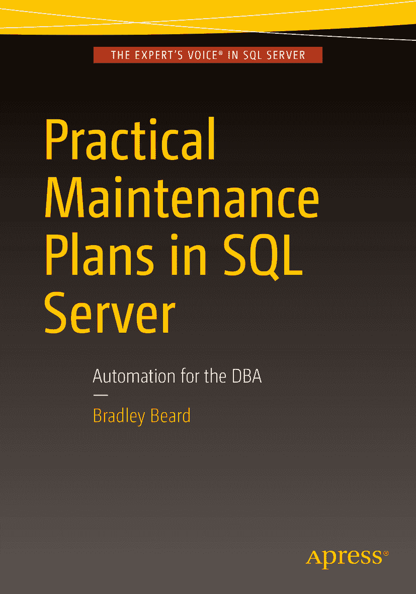

Bradley Beard Practical Maintenance Plans in SQL ServerAutomation for the DBA

本书作者引用的任何源代码或其他补充材料，读者均可访问 [`www.apress.com`](http://www.apress.com/) 获取。有关如何查找本书源代码的详细信息，请访问 [`www.apress.com/source-code/`](http://www.apress.com/source-code/)。 ISBN 978-1-4842-1894-5e-ISBN 978-1-4842-1895-2 DOI 10.1007/978-1-4842-1895-2 美国国会图书馆控制编号：2016938532 © Bradley Beard 2016 Practical Maintenance Plans in SQL Server 总监：Welmoed Spahr 主编：Jonathan Gennick 开发编辑：Douglas Pundick 技术审阅：Mike McQuillan 编委会：Steve Anglin, Pramila Balen, Louise Corrigan, Jim DeWolf, Jonathan Gennick, Robert Hutchinson, Celestin Suresh John, Michelle Lowman, James Markham, Susan McDermott, Matthew Moodie, Jeffrey Pepper, Douglas Pundick, Ben Renow-Clarke, Gwenan Spearing 协调编辑：Jill Balzano 文字编辑：Kim Burton-Weisman 排版：SPi Global 索引：SPi Global 美术：SPi Global 封面设计：Anna Ishchenko 有关翻译信息，请发送电子邮件至 `rights@apress.com`，或访问 [`www.apress.com`](http://www.apress.com)。Apress 和 friends of ED 的书籍可批量购买用于学术、企业或促销用途。大多数图书也提供电子书版本和许可。欲了解更多信息，请参考我们的批量销售–电子书许可专页 [`www.apress.com/bulk-sales`](http://www.apress.com/bulk-sales)。本书中出现的 Apress 标准商标名称、标识和图像均为其所有。为商标所有者利益考虑，仅以编辑方式使用这些名称、标识和图像，并无商标侵权之意。在本书中使用商品名称、商标、服务标识及类似术语，即使未特别标明，也不应被视为表达其是否受专有权约束的意见。尽管本书中的建议和信息在出版时被认为是真实准确的，但作者、编辑和出版商均不对任何可能存在的错误或遗漏承担法律责任。出版商对本出版物所含材料不作任何明示或暗示的担保。使用无酸纸印刷。本书由 Springer Science+Business Media New York 发行至全球图书贸易，地址：233 Spring Street, 6th Floor, New York, NY 10013。电话 1-800-SPRINGER，传真 (201) 348-4505，电子邮件 orders-ny@springer-sbm.com，或访问 www.springer.com。Apress Media, LLC 是一家在加利福尼亚州注册的有限责任公司，其唯一成员（所有者）是 Springer Science + Business Media Finance Inc (SSBM Finance Inc)。SSBM Finance Inc 是一家在特拉华州注册的公司。

献给你，我最亲爱的杰西卡

