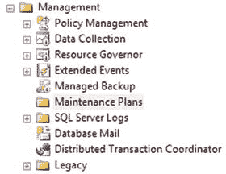
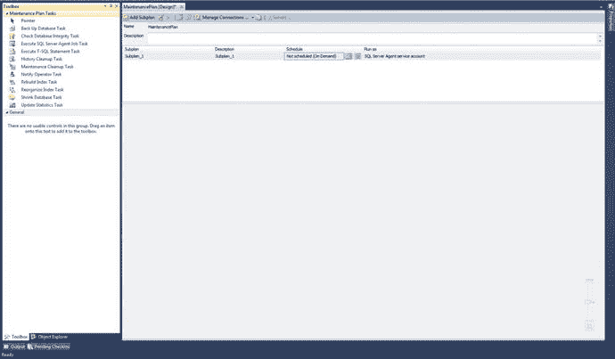
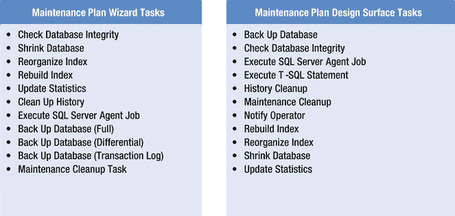

# 1. 维护计划简介

你听说过更快/更省/更好的悖论吗？它指出，任何事物都可以分为三类：更快得到、更省得到，或者更好得到……但你只能三选其一。所以总要有所牺牲：更快更省意味着不会更好，更省更好意味着不会更快。这是否让人觉得有点不切实际？为什么不能三者兼得呢？

合理的规划几乎可以隔离任何故障。正确配置资源可以降低几乎所有风险。数据库管理的核心，始终是面临提供这三大原则的挑战：更快的性能、更低的开销、更高质量的数据。若无法为雇佣你的组织提供这些，必将导致你失业。大多数时候，情况并非如此严重，但重点在于，你是负责安全处理公司最重要资产——其数据——的人。无论是专有数据、商业数据、政府机密，还是仅仅一个存储姓名和电话号码的简单数据库，你负责的数据对于需要访问它的人来说都至关重要。因此，我们作为 `DBA`，是确保正确维护数据库、为最终用户提供更高水平数据库完整性的最后一道防线，无论他们是我们的祖母、股票经纪人，还是任何其他级别的用户。

数据库管理最重要的部分，除了安装和实际开发之外，就是数据库的维护。这种持续的实践应该成为任何资深数据库管理员 (`DBA`) 日常工作的一部分。由于 `DBA` 是数据库的主要焦点，如果它在黑暗中“噗”的一声消失了，你最好希望这不是你的错。幸运的是，`SQL Server` 提供了丰富的工具，专门旨在以尽可能小的封装赋予 `DBA` 大量的权力，希望 `DBA` 使用这些工具来减轻他们所负责数据可能面临的任何风险。

毕竟，`DBA` 的主要职责是确保其数据的保护、完整性、一致性和可用性。遵循本书中的指示并实施一个完整的维护计划，将帮助你开始实现这些目标。

### 开始之前

我的文件结构有一个非常具体的方式。你可能有也可能没有，但我想解释一下，因为我在本书中会经常引用它。

我有一个逻辑上的 `E:\` 盘，用于存储我所有的 `SQL Server` 文件。不是安装文件，只是数据库文件。这个驱动器的根目录是 `E:\`，并且只有一个名为 `SQL Server` 的文件夹。因此，我所有数据库文件的主目录是 `E:\SQL Server`。在这个文件夹内，我有以下目录。

*   `Backups`：每个备份的 `.bak` 文件，按数据库存储在子文件夹中
*   `Data`：每个数据库的 `.mdf` 和 `.ldf` 文件，按数据库存储在子文件夹中
*   `Logs`：每个数据库的 `.trn` 文件，按数据库存储在子文件夹中

`SQL Server` 开发所需的一切都可以在这些文件夹中找到。这可能不适用于你的设置，但我希望它适用。如果不适用，只需根据各章中的示例调整你自己的特定文件夹结构。我将在后面的章节中向此结构添加文件夹，请继续阅读以了解它们将包含什么。

你还需要一个对数据库引擎具有 `sysadmin` 权限的 Windows 登录名，以及一个同样具有 `sysadmin` 权限的 `SQL Server` 登录名（通常，你的 `sa` 账户就可以）。这些账户在较新的 `SQL Server` 安装中非常常见，因此应该不成问题。本书的绝大部分内容将使用 Windows 登录名，因为该登录名通常要么拥有数据库，要么具有 `sysadmin` 权限，可以根据需要修改数据库。如果你没有拥有这些权限的账户，你可能无法针对需要维护的数据库创建和执行计划。在这种情况下，你实际上并不是 `DBA`，更像是“数据协调员”。作为 `DBA`，你应该有一个账户，让你完全、完全控制数据库。使用该账户来设置本书中的内容。

### 什么是维护计划？

当你创建一个维护计划时，`SQL Server` 会创建一个由 `SQL Server` Agent 执行的 Integration Services 包。维护计划的存在只有一个原因：通过自动化管理任务让 `DBA` 的生活更轻松。就是这样！通过一个精心设计的维护计划，你可以按照设定的时间表自动执行各种任务。

那么，你可能会问，维护计划中到底可以做哪些事情？首先，启动 `SQL Server Management Studio` 并展开 `管理` 部分。接着展开 `维护计划` 部分。在全新安装中，这里不会有任何内容，这很正常。希望这也是你阅读本书的原因。你可能会看到如图 1-1 所示的内容。

图 1-1. 维护计划文件夹为空！

从这里开始设置维护计划有两种方法。你可以使用向导，或者自己从头开始创建，使用所谓的 `维护计划设计面`。这两种选择之间的差异很小，但功能上并无真正的强弱之分。让我们看看区别。

右键单击 `维护计划` 并选择 `维护计划向导`。会弹出一个介绍屏幕，包含有关该向导的一般信息，因此只需单击 `Next` 继续。

然后你将看到向导的第一个“真正”屏幕。在这里只需单击 `Next`，因为我们在下一步之后会取消它。这只是为了让我们熟悉维护计划任务的选择。

### 维护计划向导任务选项

单击“下一步”后，您将看到以下选项，这些选项可以从向导界面中设置。

*   **检查数据库完整性**：`Check Database Integrity` 任务对数据库内的数据和索引页执行内部一致性检查。
*   **收缩数据库**：`Shrink Database` 任务通过移除空的数据和日志页，减少数据库和日志文件占用的磁盘空间。
*   **重组索引**：`Reorganize Index` 任务对表和视图上的聚集索引和非聚集索引进行碎片整理和压缩。这提高了索引扫描性能。
*   **重新生成索引**：`Rebuild Index` 任务通过重建索引来重新组织数据和索引页上的数据。这提高了索引扫描和查找的性能。此任务还优化了索引页上数据和可用空间的分布，允许未来更快地增长。
*   **更新统计信息**：`Update Statistics` 任务确保查询优化器拥有关于表中数据值分布的最新信息。这使优化器能够更好地判断数据访问策略。
*   **清除历史记录**：`History Cleanup` 任务删除有关备份和还原、SQL Server Agent 以及维护计划操作的历史数据。此向导允许您指定要删除的数据的类型和期限。
*   **执行 SQL Server Agent 作业**：`Execute SQL Server Agent Job` 任务允许您选择要作为维护计划一部分运行的 SQL Server Agent 作业。
*   **备份数据库（完整）**：`Back Up Database (Full)` 任务允许您指定源数据库、目标文件或磁带，以及数据库或事务日志完整备份的覆盖选项。
*   **备份数据库（差异）**：`Back Up Database` 任务允许您指定源数据库、目标文件或磁带，以及数据库或事务日志差异备份的覆盖选项。
*   **备份数据库（事务日志）**：`Back Up Database` 任务允许您指定源数据库、目标文件或磁带，以及数据库或事务日志备份的覆盖选项。
*   **维护清理任务**：`Maintenance Cleanup` 任务移除执行维护计划后遗留的文件。

现在请取消该屏幕。返回并再次右键单击“维护计划”，但这次选择“新建维护计划…”。

您需要做的第一件事是为其命名，但您可以在此处直接单击“确定”。再次说明，我们现在只是查看选项。一个全新的界面将会打开，左侧是工具箱，顶部是子计划信息。这就是维护计划设计表面。您现在看到的应该如图 1-2 所示。

图 1-2. 维护计划设计表面

**提示**：如果看不到工具箱，只需按 `Ctrl+Alt+X`，它就会显示出来。

## 维护计划设计表面选项

如果您查看左侧的工具箱，这里有一些不同的选择。您想知道这是为什么吗？我稍后会解释原因。我们先来看看这些选项。

*   **备份数据库**：`Back Up Database` 任务允许您指定源数据库、目标文件或磁带，以及数据库或事务日志完整备份的覆盖选项。
*   **检查数据库完整性**：`Check Database Integrity` 任务对数据库内的数据和索引页执行内部一致性检查。
*   **执行 SQL Server Agent 作业**：`Execute SQL Server Agent Job` 任务允许您选择要作为维护计划一部分运行的 SQL Server Agent 作业。
*   **执行 T-SQL 语句**：`Execute T-SQL` 任务允许您将 SQL 查询作为维护计划的一部分运行。
*   **清除历史记录**：`History Cleanup` 任务删除有关备份和还原、SQL Server Agent 以及维护计划操作的历史数据。此向导允许您指定要删除的数据的类型和期限。
*   **维护清理**：`Maintenance Cleanup` 任务移除执行维护计划后遗留的文件。
*   **通知操作员**：`Notify Operator` 任务允许在执行维护计划后从 SQL Server 发送电子邮件。这适用于成功和失败两种情况。
*   **重新生成索引**：`Rebuild Index` 任务通过重建索引来重新组织数据和索引页上的数据。这提高了索引扫描和查找的性能。此任务还优化了索引页上数据和可用空间的分布，允许未来更快地增长。
*   **重组索引**：`Reorganize Index` 任务对表和视图上的聚集索引和非聚集索引进行碎片整理和压缩。这提高了索引扫描性能。
*   **收缩数据库**：`Shrink Database` 任务通过移除空的数据和日志页，减少数据库和日志文件占用的磁盘空间。
*   **更新统计信息**：`Update Statistics` 任务确保查询优化器拥有关于表中数据值分布的最新信息。这使优化器能够更好地判断数据访问策略。

这些任务中的大多数看起来很熟悉，因为它们在两种界面之间大多是共享的。您可能会问，有什么不同呢？让我们来看看。图 1-3 比较了这两种类型的任务。

图 1-3. 向导与设计表面任务之间的差异

两个区域都有 11 个任务……但它们并不相同。区别基本上在于，您希望如何为您正在创建的维护计划工作流定义需求。正如您在图 1-3 中看到的，这两个部分之间其实并没有重大区别。或者说，真的有吗？

第一个区别是向导中缺少 `Execute T-SQL Statement` 任务，但如果需要执行 SQL，可以很容易地将其整合到 `Execute SQL Server Agent Job` 任务中。除此之外，它们几乎是一样的。

第二个区别是向导中缺少 `Notify Operator` 任务。不过，您始终可以在任务本身中设置通知，所以这实际上也不是问题。

图 1-3（实际上在任何一种界面中）显示的 11 个任务是数据库管理的核心。请注意，所有这些任务都可以在 SQL Server Management Studio 界面中单独手动完成。并非说这是唯一能找到此功能的地方。恰恰相反；按照 Microsoft 的标准操作规程，完成任何一项任务总是至少有两种方法。

同样值得指出的是，任意数量的这些任务都可以在同一个维护计划中连接起来，因此您确实可以自由地根据您的确切需求和目的完全自定义维护计划。将任务连接在一起形成一个有凝聚力的维护计划的过程，我称之为计划的“工作流”。没有它，第一个任务运行后就会停止。除非明确指示，否则不会执行其他任务。因此，为了解决这个问题，我们通过定义任务成功或失败的约束来实现；这样，如果出现问题，我们至少可以跟踪错误。

## 总结

让我们开始这次探索吧！您可以使用任何已安装 SSIS 的 SQL Server 实例。这意味着任何 SQL Server 2005 及之后的版本，并且必须是标准版、企业版或商业智能版。尽管本书是专门针对 SQL Server 2012 编写的，但我也在 SQL Server 2014 上运行了所有内容，除了界面略有不同外，没有任何问题。

