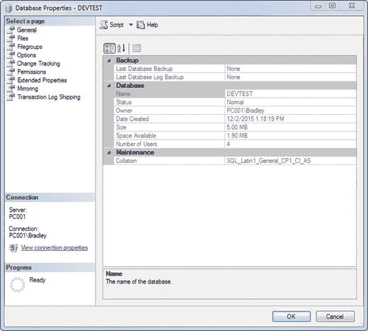
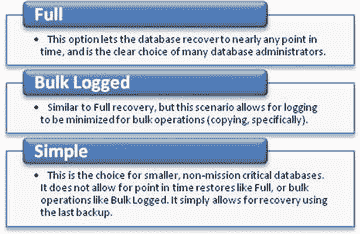
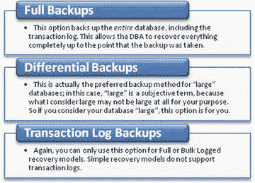
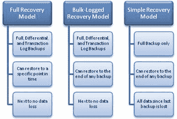
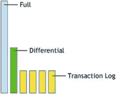
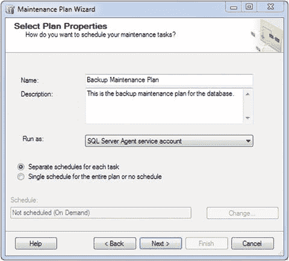
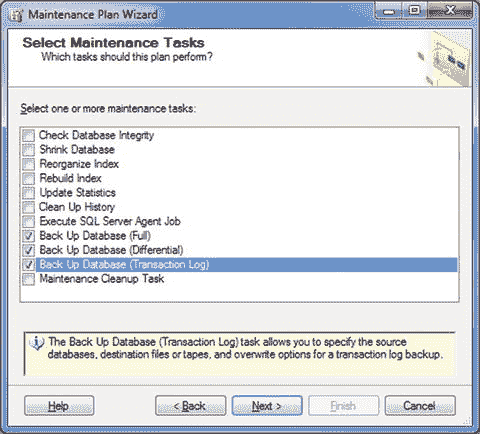
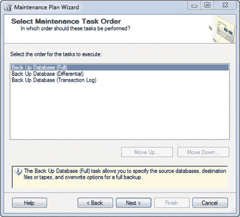
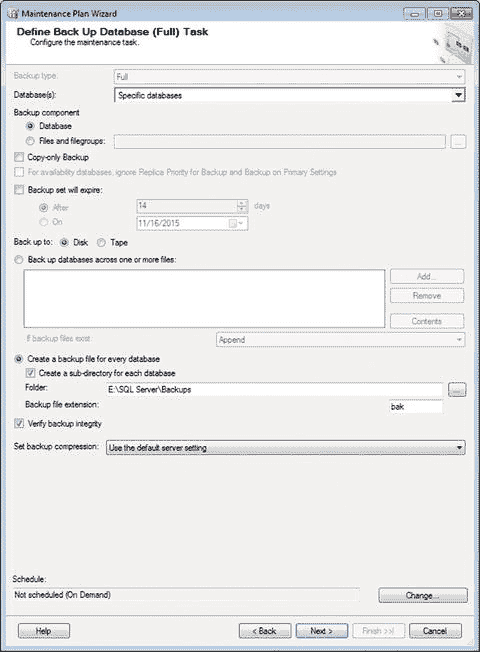

# 2. 数据库备份

备份数据库可以说是数据库管理中最重要的环节。没有备份，在数据丢失或损坏的情况下，你将无法恢复。你无法快速重建你最终负责的数据。你见过对备份不太在意的数据库管理员吗？我敢保证，那是因为他们要么是懒惰，要么从未经历过灾难性故障的恢复。这两种原因最糟糕的地方在于，一个是主观选择，一个是客观环境所致，但两者都可以通过一点前瞻性和规划来补救。

别误会我的意思；有时候，故障就是会发生。它就是会发生；墨菲定律就是这么说的。但这并不意味着我们不能成功地从中恢复，对吧？本章的目的不仅是解释定期备份的重要性，还要说明将这些备份构建成一个连贯且完整的维护计划的正确方法。

我希望你从本章带走的是一句简单的话：**不拥有`数据库备份`是完全说不通的**。

正如你所猜到的，`数据库备份`涉及多个不同的方面。在我解释实际任务本身之前，我们先来看看这些方面。

*   `恢复模型`：这是你的数据库为恢复丢失数据而设置的方式。通常在数据库引擎安装期间设置，但可以随时更改。
*   `备份类型`：某些类型的`恢复模型`允许特定类型的`备份`。根据需要备份的数据库的`恢复模型`设置，这也可以随时更改。

## 恢复模型

开始之前需要注意的一个重要点是，特定数据库的`恢复模型`在此处发挥作用。什么是`恢复模型`？简单地说，它告诉数据库如何恢复以及以什么方式恢复。`恢复模型`在数据库的初始设置和配置中确定，但也可以通过`右键单击数据库名称并选择属性`来访问。`从菜单选项中选择选项`，如`图 2-1`左侧所示，第二个选项将显示`恢复模式`。

`图 2-1.` 数据库属性窗口

让我们看看各种`恢复模型`之间的区别。`图 2-2` 显示了可用模型之间的基本区别，因此实际上取决于数据库管理员来确定实际需求或要求，以正确满足客户或应用程序的需求。

`图 2-2.` 恢复模型

#### 完整

使用`完整恢复模型`时，数据丢失是最少的，因为除非`事务日志`的尾部损坏，否则所有数据都可以恢复。`完整恢复模型`可以被视为故障安全模型解决方案，因为所有内容都包含在备份中。唯一的注意事项是`事务日志`扮演着重要角色，因为如果它损坏或不完整，完整备份将会失败。

#### 大容量日志记录

`大容量日志记录恢复模型`是一种快速恢复的方式，但数据只能从上次备份中恢复。如果备份之间的时间间隔较短，这可能不是问题。例如，使用`大容量日志记录恢复模型`时，上次备份是唯一真正可行的备份，因为那是唯一可以恢复的备份。这意味着如果备份周期设置为每 6 小时一次，那么最多可能丢失 6 小时的数据。

#### 简单

从上次备份到数据丢失事件之间的所有数据都将丢失。不推荐此选项，因为与其他两个模型相比，此模型导致数据丢失的可能性要高得多。

那么，`恢复模型`如何与`备份数据库`任务协同工作呢？这样想：如果你有一个使用`简单恢复模型`的数据库，但试图强制执行`事务日志备份`，它会失败。为什么？因为`简单恢复模型`不执行`事务日志备份`。这是一种巧妙的方式，让你思考是否需要稍微不同的做法；如果你想备份`事务日志`，那么你很可能需要有可备份的`事务日志`。有道理，对吧？那么，`备份类型`之间有什么区别呢？

### 备份类型

`图 2-3` 显示 `SQL Server` 中有三种`备份类型`，每种都是独特的，但都相互关联。如果使用得当，这三种类型可以协同工作，为用户提供更高级别的数据安全性。

`图 2-3.` 备份类型

#### 完整备份

`完整备份`备份数据库中的所有内容。这是需要记住的重要部分；换句话说，它不会备份 `SQL Server` 的单独设置或组件。

#### 差异备份

`差异备份`与`完整备份`相关，因为`差异备份`只包含自上次`完整备份`以来的数据。这可能是一个难以理解的概念。把`完整备份`想象成橄榄球场上的主要码线（10、20、30、40 等），而`差异备份`则是单个码线（11、12、13、14 等）。你能从 10 码线直接到达 30 码线吗？当然可以。但你也可以一码一码地到达那里。这就是`差异备份`给你的——一种“一码一码”的数据捕获方式。`差异备份`的美妙之处在于数据丢失被最小化，因为唯一丢失的是到最后一个`差异备份`为止的数据。它也快得多，因为备份的数据只是自上次`完整备份`以来添加或更改的数据。`差异备份`的缺点在于必须先恢复`完整备份`；然后`差异备份`才应用于基础数据。没有父`完整备份`的`差异备份`，实际上，是毫无用处的，因为它不能用于恢复任何东西。

#### 事务日志备份

事务日志是数据恢复概念的核心。它们可以根据需要频繁运行，直至达到物理磁盘的限制。备份间隔完全由数据库管理员决定，可以设置为每分钟备份一次，尽管这可能有点荒谬，因为你显然会每天生成 1，440 个日志。如果这是要求，当然可以实现；然而，如前所述，在这种情况下，存储将是一个主要的考虑因素。

请记住，事务日志备份间隔基本上是双方约定的最大数据丢失时间。对于某些公司来说，这是绝对零。对于某些公司，可能是 5 分钟、10 分钟或 20 分钟。无论约定的间隔是什么，这就是你被要求设置的任务。如果你遇到要求绝对为零的公司，那么额外的容错存储成本就需要添加到服务器配置中。更有可能的是，他们会认为可能接受 30 分钟的数据丢失，但应该尽可能减少。

提示

在 SQL Server 中，计划任务的最短时间间隔是 10 秒。如果你需要任务运行得比这更频繁，你可能需要考虑换成无咖啡因咖啡。

那么，这些概念就介绍完了。再次强调，我无法过分强调备份对数据库的重要性。可以认为这是数据库管理员负责的最重要的一件事。为了让你自己、你的公司和你的客户更轻松，要始终尝试比正在发生的事情多想两步。一个很好的帮助方法就是做好准备，而有什么比在发生灾难性故障时始终有一个新鲜、干净的数据副本可用于恢复更好的准备方式呢？

图 2-4 更详细地展示了这些恢复模型如何影响备份类型。

图 2-4.
恢复模型与备份类型

遵循图 2-4 中描述的逻辑，我建议采用完整备份、差异备份和事务日志备份。这样，事务日志将为差异备份提供支持，而差异备份则依赖于完整备份才能正确恢复。

图 2-5 展示了使用前面描述的三种类型的理想备份设置。

图 2-5.
理想备份设置

考虑图 2-6 所示的备份计划，它使用了图 2-5 中的颜色和引用。这就是我所说的“绝对理想”的情况。

图 2-6.
绝对理想的备份设置

完整备份启动备份集，第一个差异备份由事务日志备份支持。这些备份又会为差异备份提供支持，而差异备份则放置在完整备份之上。图 2-6 中需要注意的重要一点是，它没有时间限制。完全由你决定所有三种备份类型的时间间隔。例如，假设你希望每 10 分钟进行一次事务日志备份来支持每 30 分钟进行一次的差异备份，而差异备份源自每晚进行的完整备份。图 2-6 所示的图像是量化这一点的好方法，因为从图形上看，你只需要添加更多的绿色和黄色条（老实说，需要很多条）。

这为我们理解备份工作原理奠定了良好的基础。希望你能看到在紧急情况下正确备份数据的好处。

### 设置维护计划

我基本上会逐屏进行讲解，有时会以极其详尽的方式解释，那么我们开始吧！

#### 完整备份配置

右键单击“维护计划”并选择“维护计划向导”以开始。你看到的第一个界面是“选择计划属性”。在“名称”框中输入“备份维护计划”。接下来，输入简要描述。单击“每个任务单独计划”单选按钮。暂时将其余部分保留为默认值。图 2-7 应该是你现在看到的内容。

图 2-7.
选择计划属性

还记得我们查看数据库的恢复模型吗？希望你的设置是`完整`。有些情况下你不需要这个，这是可以理解的；但是，我强烈建议使用`完整`。

我为什么提起这个？这些信息引出了备份任务的选择。如果你的数据库处于`完整`恢复模型，那么我们可以创建一个更严格的维护计划，而这正是本书的目标。

当你在此屏幕上单击“下一步”时，你将看到我们之前讨论过的选项。选择所有三个备份选项，如图 2-8 所示。

图 2-8.
选择维护任务

现在，单击“下一步”来设置备份的三个部分。这有点多余，因为这三个部分会在不同的时间执行，原因也不同。回想一下本章前面，我说过完整备份由差异备份提供支持，而差异备份又由事务日志备份提供支持。当你看到图 2-9 所示的屏幕时，直接单击“下一步”即可。

图 2-9.
选择维护任务

从这里开始变得有趣了。出现的第一个界面是“定义备份数据库（完整）任务”屏幕。你完成的屏幕（除了“计划”部分）应该如图 2-10 所示。

图 2-10.
定义备份数据库（完整）任务 提示

此界面在 SQL Server 2014 和 SQL Server 2016 中略有不同，但任务的本质是相同的。

下拉“数据库”菜单，选择你想要备份的数据库。可以是任何单个数据库或你想要备份的一组数据库。本书使用的数据库名为`DEVTEST`，所以你可以使用该名称，也可以选择另一个名称。注意“为每个数据库创建备份文件”单选按钮已被选中。由于我们专门使用此选项来配置数据库完整备份的设置，请单击该选项下方的“为每个数据库创建子目录”复选框。这意味着，对于你选择备份的每个数据库，这些备份将保存在一个以数据库名称为目录名的目录中。在屏幕底部，单击`更改…`按钮以设置此任务的计划。

趁此机会，让我们定义一下我们的备份计划应该是什么样子以及何时运行。回想一下我们在本章前面讨论过的备份计划方案。我们可以将其作为一个很好的起点。让我们将其配置为 24 小时窗口，以最小化数据中断。如果完整备份设置在午夜，那么第一个差异备份也应设置在午零点，第一个事务日志备份同样如此。然后每 6 小时运行一个新的差异备份。在这些之间，事务日志备份将每小时运行一次。表 2-1 展示了我描述的时间块的一个相当准确的表示。

表 2-1.
24 小时备份计划示例

