# SQL Server 维护计划配置

## 备份时间表示例

| 时间 | 完整备份？ | 差异备份？ | 事务日志？ |
| --- | --- | --- | --- |
| 午夜 12:00 | X | X | X |
| 凌晨 1:00 |   |   | X |
| 凌晨 2:00 |   |   | X |
| 凌晨 3:00 |   |   | X |
| 凌晨 4:00 |   |   | X |
| 凌晨 5:00 |   |   | X |
| 早上 6:00 |   | X | X |
| 早上 7:00 |   |   | X |
| 早上 8:00 |   |   | X |
| 早上 9:00 |   |   | X |
| 上午 10:00 |   |   | X |
| 上午 11:00 |   |   | X |
| 中午 12:00 |   | X | X |
| 下午 1:00 |   |   | X |
| 下午 2:00 |   |   | X |
| 下午 3:00 |   |   | X |
| 下午 4:00 |   |   | X |
| 下午 5:00 |   |   | X |
| 晚上 6:00 |   | X | X |
| 晚上 7:00 |   |   | X |
| 晚上 8:00 |   |   | X |
| 晚上 9:00 |   |   | X |
| 晚上 10:00 |   |   | X |
| 晚上 11:00 |   |   | X |

使用此模型，我们可以恢复到给定日期的任何小时，这意味着最多会丢失 1 小时的数据。如果这是可以接受的，我们可以继续。如果不能，我们可以调整备份之间的时间。不过，我们现在将保持这个计划。图 2-11 显示了您现在屏幕上应该看到的内容。

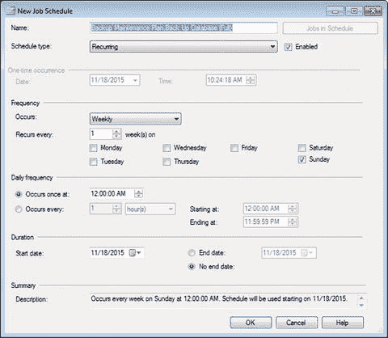

图 2-11. 新作业计划

请注意，默认值并不是我们进行完整备份所需要的。要使我们的计划可用，您只需下拉 `Occurs` 菜单并选择 `Daily`。就这样。注意 `Summary` 字段中的文本现在显示为 `Occurs every day at 12:00:00 AM. Schedule will be used starting on [DATE]`。这很完美！点击 `OK` 保存此计划。请注意，我们刚刚阅读的相同 `Summary` 已被转移到界面上的 `Schedule` 块中。完成的屏幕如图 2-12 所示。

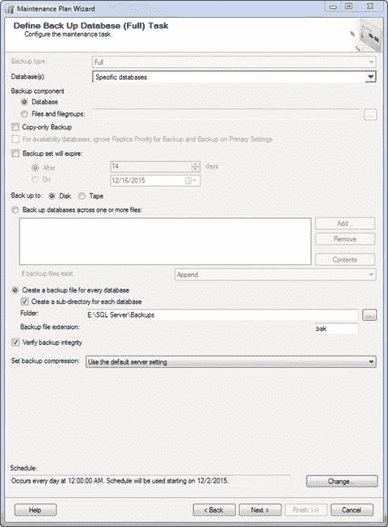

图 2-12. “定义备份数据库（完整）任务”界面，已完成

点击 `Next` 继续设置计划。

#### 差异备份配置

接下来，将显示“定义备份数据库（差异）任务”界面。与之前一样，从 `Database(s)` 下拉菜单中选择数据库，更新文件夹位置，并勾选 `Create a sub-directory for each database` 复选框。您也可以勾选 `Verify database integrity`，但这实际上也会在稍后的任务中完成，所以取决于您。再次点击屏幕底部的 `Change…` 来为此任务设置计划。

此区域的默认设置也不正确！哦，好吧，这就是我们在这里的原因。将 `Occurs` 选择更改为 `Daily`。在 `Daily frequency` 区域下，点击 `Occurs every` 单选按钮并在第一个框中输入 `6`。完成后，您的屏幕应如图 2-13 所示。

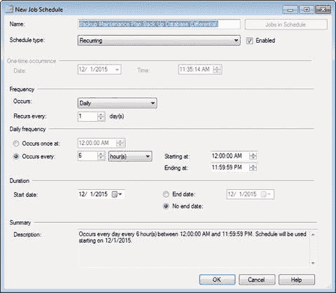

图 2-13. 新作业计划

这意味着我们的差异备份现在将每天每 6 小时运行一次。差异备份部分完成的界面应如图 2-14 所示。

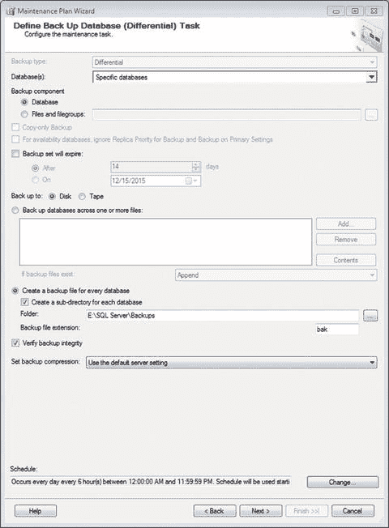

图 2-14. “定义备份数据库（差异）任务”界面，已完成

有趣的是，除了 `Schedule` 部分外，此屏幕与完整备份屏幕相同。

#### 事务日志备份配置

点击 `OK`，然后点击 `Next` 继续。打开的下一个屏幕是“定义备份数据库（事务日志）任务”屏幕。与前两个屏幕相同的常规设置：从 `Database(s)` 菜单中选择数据库，选择备份文件夹（应该是您的 `E:\SQL Server\Logs` 文件夹），并勾选 `Create a sub-directory for each database` 复选框。完成后，点击界面底部的 `Change…` 按钮来定义此计划。将 `Occurs` 值更改为 `Daily`，并确保 `Occurs every` 值设置为 `1 hour(s)`。此区域就这些了。您的屏幕现在应类似于图 2-15。

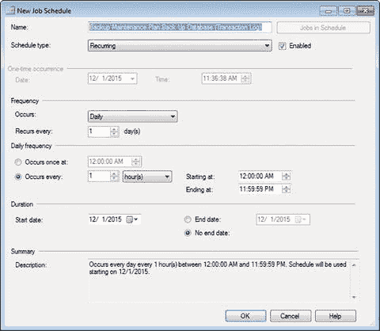

图 2-15. 新作业计划

计划完成后点击 `OK`。然后您应该看到图 2-16 所示的内容。

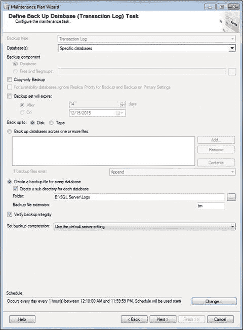

图 2-16. “定义备份数据库（事务日志）任务”界面，已完成

准备好后，点击 `Next`。

## 选择报告选项

打开的屏幕标题为“选择报告选项”。您现在应该看到图 2-17 所示的内容。

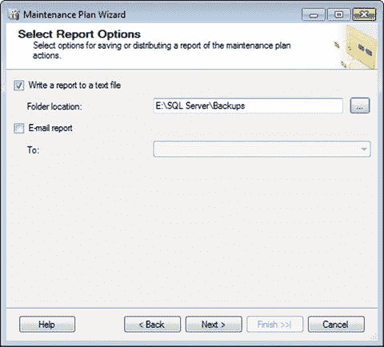

图 2-17. 选择报告选项

现在，这是相当不言自明的。如果您想将报告写入文本文件并放入文件系统，请点击该框。请注意，我选择了 `Backups` 目录，而不是 `Logs` 目录。这是因为我想将 `Logs` 目录保留用于我的事务日志。`Backups` 目录可用于存储维护文本文件，而 `Backups` 内的各个文件夹则存储实际的 `.bak` 文件，以防您需要恢复数据库。

您也可以选择通过电子邮件接收报告，但您必须定义一个 `Operator`（稍后会详细介绍）。如果您定义了 `Operator`，请在此处选择它以接收电子邮件。这样做的目的是让您通过电子邮件知道维护计划何时运行以及结果如何。目前，我们将只保留报告选项选中。点击 `Next` 继续。

## 完成向导

在下一个屏幕“完成向导”上，您会看到我们所做工作的摘要。展开界面中的选项将显示所做工作的完整细节，如图 2-18 所示。

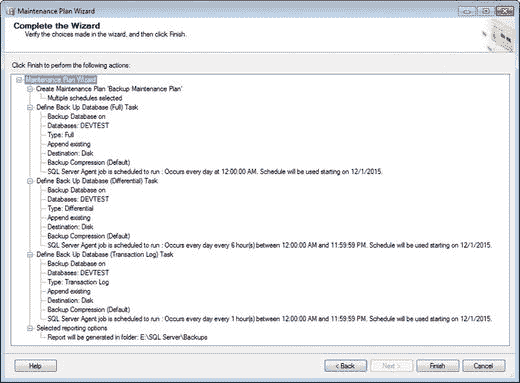

图 2-18. 完成向导

请注意，这些选项尚未保存。您可以在此处点击 `Cancel` 并销毁我们迄今为止所做的所有工作，但我们不要那样做。相反，检查我们所做的操作，当您准备好时，点击 `Finish`。希望您看到图 2-19 所示的内容。

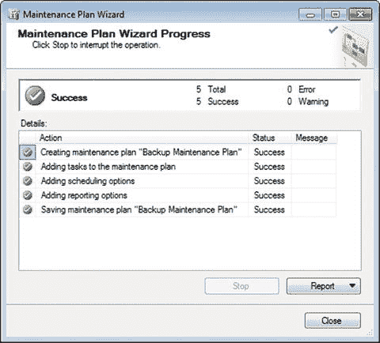

图 2-19. 维护计划向导进度

这总是一个好迹象！准备好后点击 `Close`。请注意，`Backup Maintenance Plan` 现在出现在 SSMS 的 `Maintenance Plans` 区域中。它现在已启用，并将按照我们定义的计划运行。

#### 配置作业

请注意，现在在 `SQL Server 代理` 的 `作业` 文件夹中有一些作业。这些名称不太具有描述性，不是吗？哪个是哪个？让我们马上来修正。双击 `Subplan_1`。您应该会看到图 2-20 所示的内容。

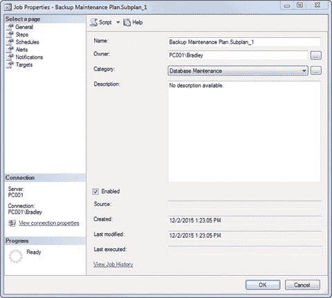

图 2-20. 作业属性，`常规` 选项卡

看到上面标有 `名称` 的第一个框了吗？只需将其末尾改为 `完整备份`，而不是 `Backup Maintenance Plan.Subplan_1`。注意它在 `类别` 选项中也被设置为 `数据库维护`。这很好，因为这正是我们正在做的事情。确保 `启用` 复选框被勾选——这个界面就全部设置好了。

我跳过的一件事是 `所有者` 选择。这通常应设置为数据库的所有者。

另外请注意，在屏幕左侧有菜单选项。您当前位于 `常规` 选项。如果单击 `步骤` 选项，您将看到图 2-21 所示的内容。

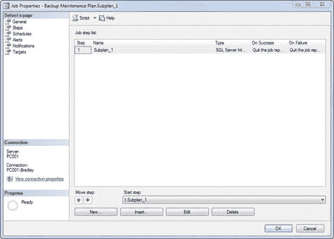

图 2-21. 作业属性，`步骤` 选项卡

请注意，菜单栏尚未显示我们的新名称。`作业步骤` 列表中的 `名称` 也未更新。真令人沮丧。让我们现在就来修复它。

双击文本 `Subplan_1`。`作业步骤属性` 窗口将打开，因此将“步骤名称”框更改为 `完整备份`，如图 2-22 所示。

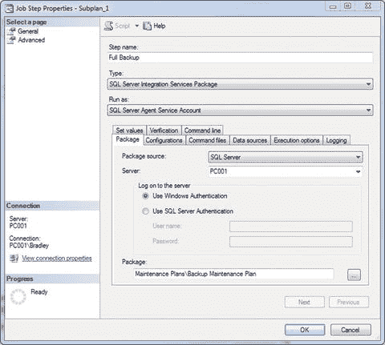

图 2-22. 作业属性，`步骤` 选项卡，`常规` 选项

暂时不要碰此屏幕上的其他任何内容，只需单击左侧的 `高级` 选项。将此屏幕调整为图 2-23 所示的设置。

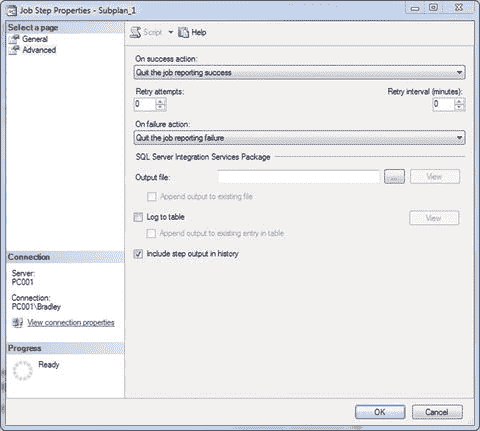

图 2-23. 作业属性，`步骤` 选项卡，`高级` 选项

完成后单击 `确定`，您将返回到 `作业属性` 屏幕，此时文本 `完整备份` 已替换 `Subplan_1`。图 2-24 是您现在应该看到的内容。

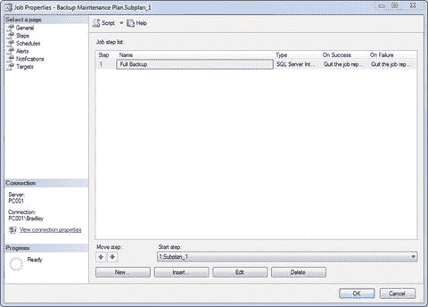

图 2-24. 作业属性，`步骤` 选项卡

单击左侧的 `计划` 选项，注意我们的计划就在那里，并且它是启用的，如图 2-25 所示。

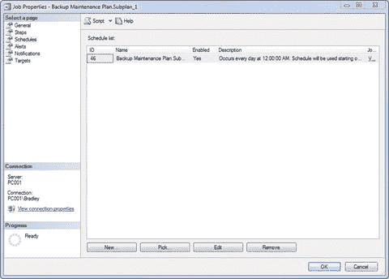

图 2-25. 作业属性，`计划` 选项卡

单击 `警报` 选项，您将看到一个空白屏幕。目前，这没问题。

单击 `通知` 选项，您将看到图 2-26 所示的内容。

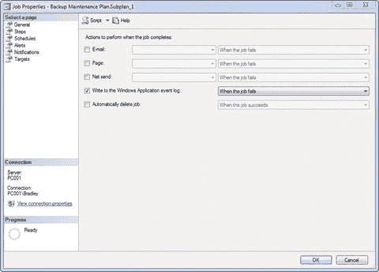

图 2-26. 作业属性，`通知` 选项卡

如果您已经设置了 `操作员`，请在 `电子邮件` 框中选择它。目前，我们将保持“写入 `Windows 应用程序` 事件日志”选项为选中状态，但我们要将下拉菜单更改为“当作业完成时”；这样，我们总能知道我们的作业发生了什么。稍后会详细介绍。

单击 `目标` 选项也将显示空白屏幕。这没问题，因为我们尚未定义任何目标。

完成 `目标` 选项并遵循此区域的说明后，单击 `确定`。然后您将看到 `作业` 文件夹已更改为图 2-27 所示的内容。

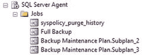

图 2-27. 已更新的 `SQL Server 代理` 作业

现在您可以清楚地看到这个作业是专门的 `完整备份` 作业。对另外两个作业执行前面列出的相同操作，并相应地标记它们。请记住，我们将完整备份定义为第一个任务，差异备份定义为第二个任务，事务日志备份定义为第三个任务。这些与这里的 `Subplan` 指定相对应。您最终应该得到图 2-28 所示的内容。

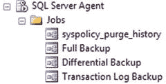

图 2-28. 已完成的 `SQL Server 代理` 作业

`syspolicy_purge_history` 也在里面，这没关系。那是 `SQL Server` 自己执行的作业。

好了，我的朋友，这就是如何设置数据库备份维护计划。

值得注意的是，您也可以从 `维护计划` 本身更新 `作业` 名称，方法是通过 `设计界面` 双击并编辑 `Subplan` 名称，然后保存计划。一旦您在设置维护计划方面经验丰富了，您可能会发现这种方法更快。

### 小结

这是内容庞大的一章，但我希望能涵盖所有真正深入了解任务细节所需的要点。

回顾一下，您学习了以下内容：

*   `完整`、`大容量日志` 和 `简单` 恢复模型
*   `完整`、`差异` 和 `事务日志` 备份
*   备份任务的配置选项

回想一下，我曾提到数据库备份可以说是数据库管理最重要的部分。我真诚地希望您在本章中已经了解了其中的确切原因。数据完整性是一个重要主题，数据保护、损失缓解以及许多其他数据库概念也是如此。所有这些概念的核心是一个非常重要的、绝对必须存在的要素：数据。保护这些数据是我们作为数据库管理员的工作。而正确维护的备份是提供这个关键拼图不可或缺的部分。

