# 3. 检查数据库完整性

成为一名数据库管理员意味着您需要身兼多职。对于不熟悉这个短语的人来说，它的意思是您一天中可能要做不同的事情，这些事情不一定相关。对于数据库管理员来说，有一件事永远不会改变：数据就是您的生命。没有它，您就没有工作。所以，对于我们这些以此谋生的人来说，这有点重要。我们不仅负责确保输入的数据是干净的，还必须确保数据保持干净。如果不是为了数据库完整性，这可能是一项相当艰巨的任务。

### 什么是数据库完整性？

数据库完整性是一个应在数据库设计阶段就应用的概念。表本身决定了是否有规则适用于向表中插入数据。这些规则将最终决定是构建出一个具备完整性的良好数据库，还是一个几乎没有或完全没有完整性的糟糕数据库。

数据库完整性是一个易于理解的概念。你需要尽可能地保证，这些数据就是它所声称的数据。我从小就告诉我的孩子们，完整性的定义是“即使无人监督，也做正确的事”。在这个语境下，作为数据库管理员，我们必须保证，委托给我们的数据将按照我们所知的最佳方式得到保护和维护。保证数据完整性的最佳方法，莫过于采取主动的日常维护方法，其中包含本书所发现的准则。

这如何应用于数据呢？想想看，如果一条记录被插入表中，其`UID`（唯一标识符）与另一条记录相同，然后查询数据库以获取该记录，会有什么影响。你将无法获得你预期的数据。这显然是糟糕的数据库设计。这怎么可能发生？如果`UID`字段没有被定义为唯一键，那么这种情况就会发生。重申一次，糟糕的设计导致糟糕的完整性。

关于数据库完整性的一个有趣之处是，即使是设计糟糕的数据库也可以保证数据的完整性。有没有听过“即使坏掉的时钟一天也能准两次”这句俗语？这里的情况与此类似。基本上，数据库将保证每次都会按照请求返回错误的数据。这理想吗？显然不是。

数据库完整性的另一个方面是表和索引的结构完整性。随着时间的推移，它们可能会损坏。制定灾难恢复计划是解决此问题的最佳方法，而该恢复计划的一个重要部分是确保恢复中的数据是完整且正确的。这只能通过数据库完整性来实现。

似乎总是有时间、金钱和资源在以后重做工作，但从来没有足够的时间、金钱或资源在第一次就把工作做对。任何你做的工作都值得做好，所以如果你要在一个项目上署名，请确保你**少承诺，多交付**。换句话说，你的个人完整性（在无人监督时做正确的事）会带来更高的数据完整性（数据的质量/可用性）。

**提示**

花时间第一次就把事情做对，而不是不得不重做，或者被迫使用一个设计糟糕的数据库。

### 数据库完整性原则的实际应用

你需要将此任务添加到你的维护计划中吗？简短的回答是“是”。不过，让我们来看看并找出原因。在 SQL Server Management Studio 中，右键单击你的数据库名称，转到“报告” ➤ “标准报告” ➤ `数据库一致性历史记录`。这将启动一个报告显示你发现的错误数量和修复的错误数量，如图 3-1 所示。

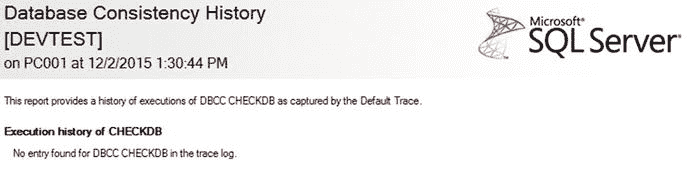
图 3-1. 无数据的数据库一致性历史记录报告

如果你在报告中没有看到任何数据，请打开一个新的查询窗口并输入以下内容：

```
DBCC CHECKDB([database_name]) WITH no_infomsgs
```

显然，将 `[database_name]` 替换为你的数据库名称。按 `F5` 运行查询。这将需要几秒钟。切换回报告并单击“刷新”图标。瞧！你就有了一条记录。图 3-2 显示了添加记录后的界面。

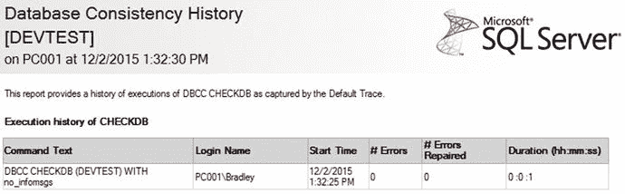
图 3-2. 包含数据的数据库一致性历史记录报告

**提示**

如果此时出现失败，最常见的原因是因为物理数据库文件（`MDF` 和 `LDF` 文件）位于使用 `FAT` 而非 `NTFS` 格式的分区上。数据库引擎此时尝试创建快照会失败，而 `DBCC` 命令正是针对该快照运行的（而非实际的数据库）。

那么……图 3-2 中的记录意味着什么？让我们分解来看。图 3-2 显示了由 `DBCC` 事务记录的数据。返回的列如下：

*   `命令文本`：此列仅显示数据库引擎解析并执行的 SQL。这应与之前写的完全一致。
*   `登录名`：这是执行 `命令文本` 的账户名称。不同的账户有不同的权限，因此如果命令失败，可能是因为没有具有运行 `DBCC` 命令权限的账户。在这种情况下，你需要使用管理员级别的账户登录；否则，这些操作都无法进行。
*   `开始时间`：我想知道这意味着什么……？哦！这是查询开始执行的时间。奇怪的是，没有 `结束时间` 列。不过，有一个 `持续时间` 列，所以需要由 DBA 来解析时间差。
*   `# 错误`：如果你在这里看到一个值，那你就麻烦了。这意味着某些地方开始出问题；没有进一步分析，将无法确定问题所在。
*   `# 已修复错误`：如果你在 `# 错误` 列看到一个值，但在此列中没有看到相同的值，那你即将面临严重问题。这意味着数据一致性中存在未解决的错误；你肯定还会再次遇到这个错误。
*   `持续时间 (hh:mm:ss)`：这只是查询运行所花费的时间。我运行此命令的数据库是一个全新的数据库，所以它只有大约 `8MB`，运行时间花了 `0` 秒。

如你所见，此报告在判断数据库是否“健康”方面极其有用。密切关注此报告有助于通过早期发现来缓解未来的问题。即使这条记录返回了 `0` 个错误，这并不意味着它不需要被添加到维护计划中。相反，我们在这里看到 `0` 这一事实表明，数据库完整性已经达到了数据一致性没有可报告错误的程度，这是一件非常好的事情。将数据库完整性作为任何维护计划的一部分是绝对必要的。

现在，让我们创建一个维护计划来涵盖数据库完整性。


### 设置维护计划

右键单击`维护计划`并选择`维护计划向导`，然后将其命名为`数据库完整性计划`。由于只有一个任务，您可以保留计划安排的单选按钮不变，但需单击`更改`按钮来定义整体计划安排，如图 3-3 所示。

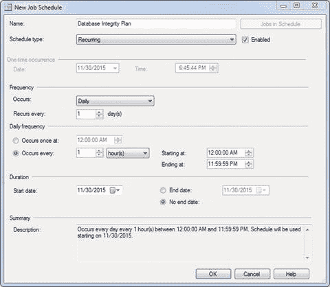
*图 3-3. 新建作业计划*

计划应设置为任务每小时运行一次，基本上与事务日志备份的计划相同。这是为什么呢？因为我们运行了备份，不希望在问题出现数小时后才担心出现数据完整性问题。我们希望尽快知晓；因此，为了实现这一点，我们在事务日志备份之后运行它。这样，任何完整性问题都会被立即报告。

在`新建作业计划`屏幕上单击`确定`。您将返回到`选择计划属性`屏幕，如图 3-4 所示。

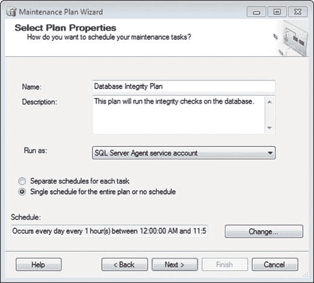
*图 3-4. 选择计划属性*

单击`下一步`继续。您应该会看到`选择维护任务`屏幕，如图 3-5 所示。选择`检查数据库完整性`复选框，然后单击`下一步`。

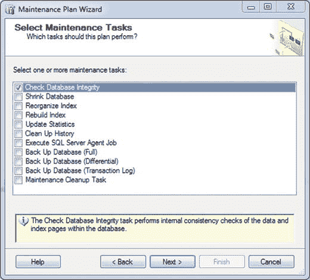
*图 3-5. 选择维护任务*

您应该会看到一个标题为`选择维护任务顺序`的屏幕，如图 3-6 所示。由于只有一个任务，这里直接单击`下一步`即可。

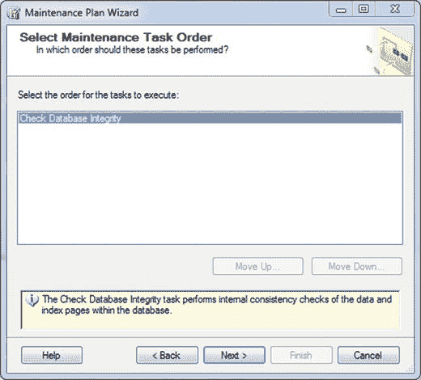
*图 3-6. 选择维护任务顺序*

接下来，会出现`定义数据库检查完整性任务`界面，如图 3-7 所示。从下拉菜单中选择您的数据库，保留“包括索引”为选中状态，单击`确定`，然后单击`下一步`。

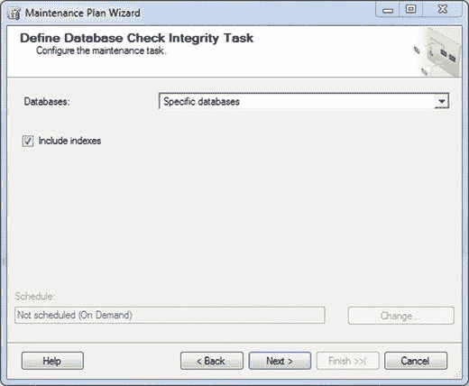
*图 3-7. 定义数据库检查完整性任务*

下一个屏幕是`选择报告选项`，如图 3-8 所示。保留报告选项的勾选状态，并再次输入备份位置。请记住，我们将维护日志写入此位置。准备好继续后，单击`下一步`。

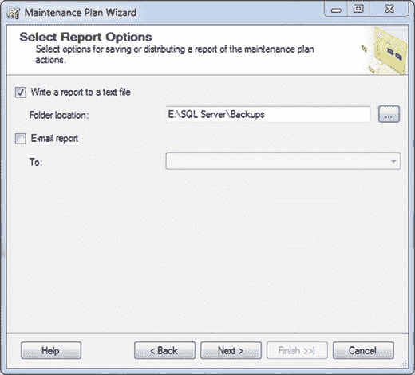
*图 3-8. 选择报告选项*

这将进入此区域的`摘要`部分，如图 3-9 所示。

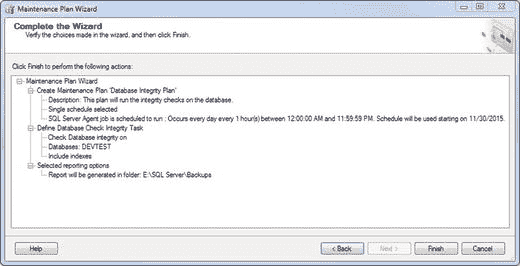
*图 3-9. 完成向导*

准备就绪后，单击`完成`。您应该会看到如图 3-10 所示的内容。

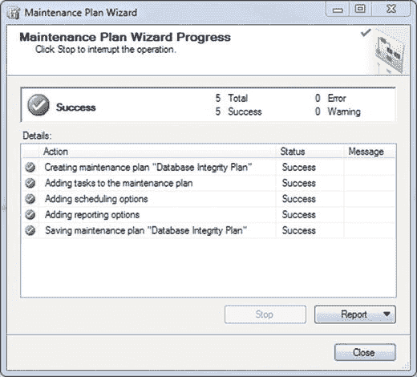
*图 3-10. 维护计划向导进度*

完成后单击`关闭`。请注意，图 3-11 所示的`维护计划`区域现在显示了`数据库完整性计划`。


*图 3-11. 维护计划*

您需要更新该作业，如第 1 章所定义。在`SQL Server Agent`内的`作业`文件夹中双击作业名称。将`作业名称`从`Database Integrity Plan.Subplan_1`更改为`Check Integrity`，然后继续后续步骤。具体步骤请参阅第 1 章。完成后，您的`作业`文件夹应如图 3-12 所示。

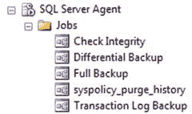
*图 3-12. SQL Server Agent 作业*

## 总结

让我们总结一下本章学到的内容。

*   我们了解了数据完整性及其重要性。
*   我们学习了如何使用 `DBCC CHECKDB` 检查数据库的一致性。
*   我们学习了如何设置维护计划，并在计划完成后更新作业。

在接下来的章节中，我们将深入更多内容。最好再准备些咖啡…

