# 4. 执行 SQL Server Agent 作业

啊，老牌好用的 `SQL Server Agent`。没有你我们该怎么办？嗯，这很简单；什么都做不了。至少在这本书里是这样。`SQL Server Agent` 的目的是执行计划的行政任务，所以没有它，我们就无法自动执行任何操作，必须手动完成所有工作。现在，别误会；所有这些都可以用 T-SQL 完成……但既然可以让可靠的 `SQL Server Agent` 完成它唯一的工作，何必自己动手呢？

现在，在继续之前，让我在这里停下来陈述一个显而易见的事实。你不能使用此任务来运行不存在的作业。我提出这一点并非怀疑读者的智力；恰恰相反。我尴尬地承认，我曾花费大量时间试图追踪任务失败的原因，结果发现分配给该任务的作业……其实……根本不存在。真是菜鸟错误，对吧？这种事时有发生。拍下额头，继续前进吧。

好的。那么，我们现在想要运行一个 `SQL Server Agent` 作业。我们有可用的作业吗？让我们检查一下。展开 `SQL Server Agent`，然后展开 `作业` 文件夹以显示您可能拥有的任何作业。您应该看到类似于图 4-1 的内容。

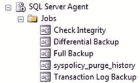
*图 4-1. SQL Server Agent 作业*

我们有自己创建的作业和默认的 `SQL Server` 作业。不过我并不想使用这些，因为它们在独立运行。这意味着我们需要从头创建一个。有趣！

### 来自数据库的电子邮件

在我们开始创建代理作业之前，让我们花时间配置 `SQL Server` 以发送电子邮件。这样，您就可以创建在完成时通知您的作业。毕竟，如果最终还需要手动检查，自动化又有什么用呢？

以下是一些关于从 `SQL Server` 发送电子邮件需要了解的事项：

*   `SQL Server` 只能通过 `SMTP` 发送电子邮件。它无法以任何方式接收电子邮件。
*   服务器必须已设置好 `SMTP`。请与系统管理员合作以确保 `SMTP` 已就位。

您现在的任务是为数据库配置电子邮件，发送测试电子邮件以确认配置，最后，在 `SQL Server Agent` 中启用邮件配置文件。


### 配置电子邮件

首先，展开 SQL Server 安装中的 `Management` 节点，如图 4-2 所示。你应该能看到 `Database Mail`。

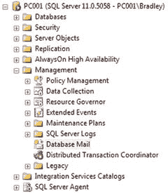
图 4-2. SSMS 中数据库邮件的位置

右键单击并选择 `Configure Database Mail`。你将看到如图 4-3 所示的信息。

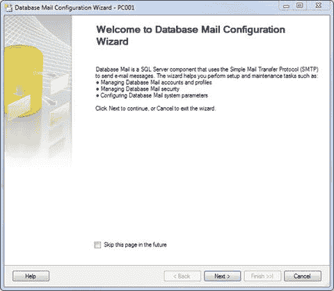
图 4-3. 数据库邮件配置向导

这是一个出色的小向导，它将逐步指导你完成数据库邮件的设置。一旦设置完成，我保证你会开始在日常工作中寻找应用数据库邮件的理由。它能为你带来什么便利呢？想象一下，如果在任务运行后，或者在数据库成功备份或恢复后，你能收到一封电子邮件，那该多么方便。又或者，当你期待收到一封邮件告知你的主数据库已备份，却始终未收到时，这可能是不祥之兆的预警。至少你会得到某种提示，知道出了问题，而不是被愤怒的用户或经理打个措手不及。对于数据库管理员来说，这是一个管理消息传递的绝佳工具，几乎在每个应用程序中都能发挥作用。

如果愿意，你可以勾选复选框以禁止以后显示此向导。我通常都会这么做。准备就绪后，单击 `Next` 继续。

接下来出现的屏幕，如图 4-4 所示，允许你选择要执行的操作：设置新账户、管理账户或更改参数。

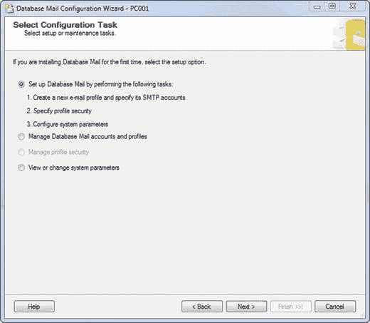
图 4-4. 选择配置任务

由于我们正在设置新用户，请保持默认选中的“`Set up Database Mail…`”，然后选择 `Next`。

如果收到提醒说 `Database Mail` 功能不可用，请选择 `Yes` 来启用它。考虑到已完成完整的 SQL Server 安装，你应该无需安装任何额外内容。

现在，你将进入 `New Profile` 界面，如图 4-5 所示。

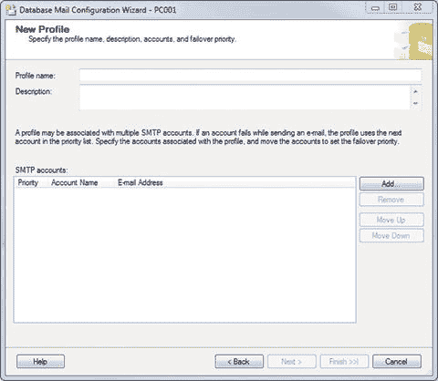
图 4-5. 新建配置文件（初始界面）

大部分工作将在这里完成。在文本框中输入配置文件名称和描述。这些有助于你区分不同的账户。我输入了如图 4-6 所示的值，但你可以随意输入。

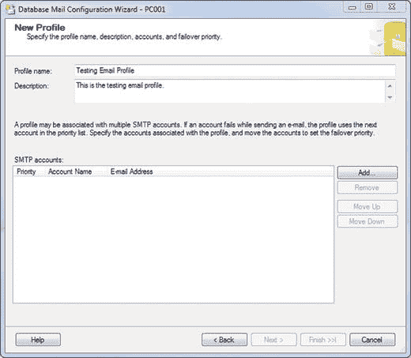
图 4-6. 新建配置文件，接近完成

对你输入的值满意后，按下界面右侧的 `Add` 按钮。这将允许你为数据库邮件添加一个新的配置文件。

另一个界面神奇地出现了，显示的信息如图 4-7 所示。我已经填写完毕，以便你了解需要输入什么。你可能需要从系统管理员那里获取部分信息。

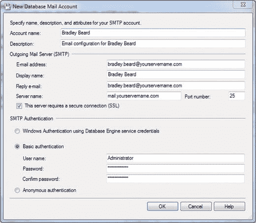
图 4-7. 新建数据库邮件账户设置

`Account Name` 和 `Description` 字段只是占位符，与上一个屏幕一样。外发邮件信息显然必须 100% 正确，否则会失败。其余部分应该相当明显。填写完所有内容后，单击 `OK` 返回上一个界面，此时你应在网格区域看到 `Account Name` 和 `E-mail Address`，如图 4-8 所示。

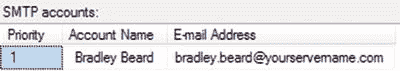
图 4-8. SMTP 账户

准备好继续后，选择 `Next`。

你将看到一个标题为 `Manage Profile Security` 的屏幕，包含两个选项卡：`Public Profiles` 和 `Private Profiles`。在本练习中，我们将专门处理 `Public Profile`，如图 4-9 所示。

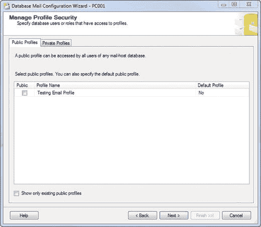
图 4-9. 新建数据库邮件账户设置

这意味着数据库邮件服务正在查找所输入对象的安全性。你可能认得 `Profile Name`，因为它是在上一个屏幕中输入的。我原以为这可能是从 `Active Directory` 或其他地方提取的，但在分布式数据库系统中，你可能没有 `Active Directory` 账户，但此功能仍然有效。因此，它必须是用户先前在界面中输入的值……在本例中，就是你。你可以在图 4-10 中查看它的显示方式。如果愿意，可以按 `Back` 并更改屏幕顶部的 `Profile Name`，然后按 `Next` 查看名称是否已更改。非常酷！你需要勾选此界面 `Public` 列中的复选框来启用它；否则，你将来所做的任何设置更改都将全局应用。此外，下拉 `Default Profile` 菜单并选择 `Yes`。在此情况下，你只想编辑这个特定用户。完成后的界面如图 4-10 所示。

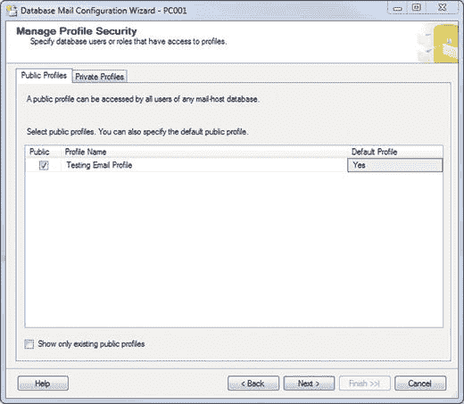
图 4-10. 管理配置文件安全性

准备好后，单击 `Next`。

哦，看，图 4-11 又显示了另一个界面。需要澄清的是，我经常使用“界面”这个词。如果这让你感到困惑，你随时可以用任何你认为合适的术语来替代“界面”，指代屏幕上呈现给用户、显示提示或决策的外观变化。我记得在远古时代学习 `Visual Basic 6` 入门课程时，我的教授称它们为“interfaces”。这个叫法就一直沿用下来了。

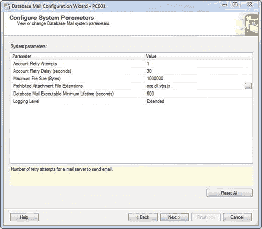
图 4-11. 配置系统参数

这就是你现在看到的界面。所有这些字段都是可编辑的，所以请自行承担风险进行操作。你可以自由做出任何选择，或保留默认值。无论你的环境或安全原则要求什么，都应该在这里强制执行。例如，我不建议更改 `Prohibited Attachment File Extensions`。列出的扩展名基本上是当前 SQL Server 可访问且能被操作系统执行的所有文件扩展名。它们不一定由 SQL Server 生成，但可以作为附件添加。

以下是此屏幕上可用的选项：

*   `Account Retry Attempts`：邮件服务器发送电子邮件的重试次数。
*   `Account Retry Delay (seconds)`：邮件服务器发送电子邮件的重试间隔（秒）。
*   `Maximum File Size (Bytes)`：邮件服务器发送电子邮件的附件最大文件大小（字节）。
*   `Prohibited Attachment File Extensions`：邮件服务器发送电子邮件的禁止附件文件扩展名。
*   `Database Mail Executable Minimum Lifetime (seconds)`：数据库邮件可执行文件的最小生存期（秒）。
*   `Logging Level`：确定哪些事件写入数据库邮件事件日志。

这些选项的定义直接来自图 4-11 所示的界面。这里有个有趣的事情要注意：如果你点击 `Reset All` 按钮，你会发现 `Account Retry Delay` 的值从 `60` 变成了 `5000`。因此，默认情况下，重试发送邮件不是等待 1 分钟，而是等待超过一个小时。想象一下在使用电子邮件报告灾难性故障时会发生什么。你是宁愿立即知道，还是在一个多小时后才知道事件发生？


我将为此界面选择默认选项，并点击 `下一步` 继续。接下来，你会看到如图 4-12 所示的界面，标题为 **完成向导**，其中包含所选设置的简要摘要。我们接下来就看看这些内容。

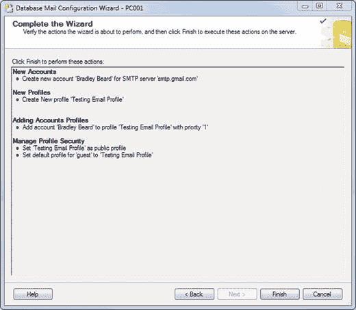

**图 4-12.**

**完成向导**

从上到下，我们看到之前输入的所有信息。它告诉我们创建了一个新账户和配置文件。它告诉我们已将该新账户添加到了那个新配置文件中。可以把配置文件想象成某种安全容器；要编辑账户，就必须先编辑配置文件。最后，它告诉我们已将配置文件设为公开。

看起来我们准备好实施了，对吧？点击 `完成` 见分晓。图 4-13 展示了你应该得到的结果。

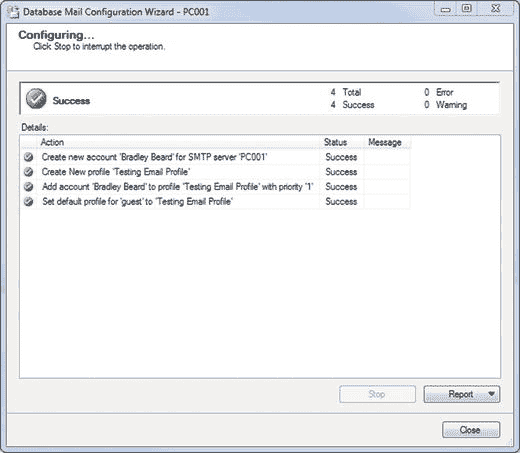

**图 4-13.**

**正在配置…**

哇哦！我总是喜欢看到所有那些绿色的复选框！如果你没得到这个结果，请回到本章开头重新开始。

## 发送测试电子邮件

如果你确实得到了那些绿色的复选框，恭喜！让我们继续前进，将 `数据库邮件` 实施为数据库维护计划的一部分。记住，使用电子邮件的目的是……？没错，是为了让我们数据库管理员了解数据库的任何潜在问题。在此特定情况下，我们将利用 `数据库邮件` 在查询成功运行时向我们发送状态报告。

再次右键单击 `数据库邮件`，然后选择 `发送测试电子邮件`。你会看到一个弹出的屏幕，其中包含信息，如图 4-14 所示。

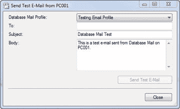

**图 4-14.**

**发送测试电子邮件**

在 `收件人` 框中填写一个有效的电子邮件地址，然后点击 `发送测试电子邮件`。邮件可能需要一点时间才能送达，但它应该会出现。如果没有，那么说明某些设置不正确，你可能需要回到开头，找出可能遗漏的步骤。

### 启用邮件配置文件

那么，现在我们的数据库可以发送邮件了，对吧？你可能会讨厌我这么说，但是……是也不是。你看，`SQL Server` 有一套关于安全原则的讲究，仅仅因为一个用户或登录账户有权限做某事，并不意味着所有用户和登录账户都有权限做同样的事。因此，必须强调一点：如果不进行额外的步骤，`Database Mail` 可能永远无法自行运行。

是的，数据库刚刚确实发送了测试邮件。但请记住这一点：当你登录到 `SQL Server` 时，你所做的任何操作都是在你的登录上下文下完成的。如果你被授予了执行某项操作的权限，猜猜看：你就能做。因此，如果你没有被授予该权限，你就不允许做。在大多数情况下，常规的 `SQL Server` 登录账户（特别是那些使用 `sa` 账户登录的）默认就有发送邮件的权限。有趣的是，`SQL Server Agent` 默认却没有发送邮件的权限。这不奇怪吗？

默认情况下不启用发送邮件功能可能有其充分的理由，但我实在想不出任何好的理由，所以我就把这个问题推给微软了。

我怎么强调都不为过的一点是，务必要在 `SQL Server Agent` 中启用邮件配置文件。首先，右键单击 `SQL Server Agent` 并选择 `属性`，如图 4-15 所示。

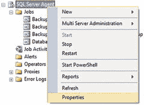

**图 4-15.**

**SQL Server Agent 属性**

打开后，在左侧，你会看到一些选项，可以让你选择进入 `SQL Server Agent` 配置的不同区域。先别在这里修改任何东西。说真的，你会后悔的。

点击 `警报系统` 选项。会弹出一个界面，如图 4-16 所示。

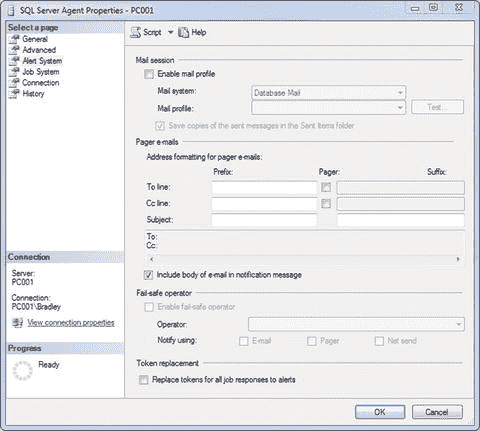

**图 4-16.**

**SQL Server Agent 属性（初始界面）**

那些狡猾的微软小开发者！注意，顶部的 `启用邮件配置文件` 旁边的复选框未被勾选。这简直就是阻止你从 `SQL Server` 发送自动化电子邮件的唯一原因。选中该复选框，确保选择了 `数据库邮件`，然后选择我们之前设置的邮件配置文件。如果你之前定义了操作员，可以在这里将他们设置为故障安全操作员；因此，勾选底部附近 `启用故障安全操作员` 旁边的复选框，并选择你的操作员。如果你还没有定义操作员，我们很快就会进行定义，然后你可以回到这里将其添加到这些属性中。还请务必选择 `电子邮件` 选项，以便通过电子邮件通知该人员。完成后的界面应类似于图 4-17。

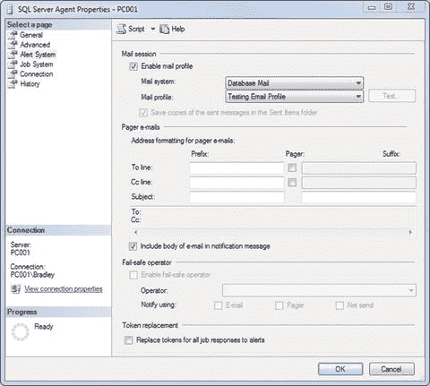

**图 4-17.**

**SQL Server Agent 属性（完成后的界面）**

所有这些都完成后，点击 `确定`，右键单击 `SQL Server Agent`，然后选择 `重新启动`。将弹出一个提示，询问你是否要重新启动，所以选择 `是`。这将重启服务，并启用 `SQL Server Agent` 内的 `数据库邮件` 子系统。

相信我。这正是以后会阻止你的地方。当你学完本章后，回去禁用邮件配置文件，看看会发生什么。没有邮件！

让我们花点时间回顾一下我们目前为此练习所做的工作。我们想做什么？我们想创建一个 `SQL Server Agent` 作业，该作业在运行 `SQL` 查询时发送电子邮件，并在该电子邮件中返回查询的状态。我们成功完成了吗？为什么成功或为什么没成功？还没有。我们还没有编写查询，也没有完成 `SQL Server Agent` 作业。下一步是什么？下一步是编写一个简单的查询，然后将该查询和 `数据库邮件` 整合到 `SQL Server Agent` 作业中进行测试。

现在我们有了路线图。首先，编写查询。其次，将查询和邮件移到作业的步骤中并开始测试。

## SQL 代理作业创建

现在电子邮件已配置好，你可以创建 `SQL Agent` 作业来执行查询等操作。这些可以是简单的 `SQL` 查询，也可以是 `T-SQL` 代码块。

### 创建示例表

如果你有想使用的查询，直接使用即可。为了本练习的目的，如果你还没有任何表并且想运行一个示例，只需执行以下两个查询。第一个查询创建表；第二个用数据填充它。

```sql
CREATE TABLE [dbo].Users NOT NULL,
[userid] varchar NOT NULL,
[lastname] varchar NOT NULL,
[firstname] varchar NOT NULL,
[email] varchar NOT NULL,
[phone] varchar NOT NULL,
[admin] [bit] NOT NULL
) ON [PRIMARY]
INSERT INTO [dbo].Users
VALUES ('beardbr1','Beard','Bradley','bradley.beard@gmail.com','555-555-5555',1);
GO
```

你可以向表中输入任意多的数据。不过我建议在表中放入多于一行的数据。这些信息只是一个占位符，以便让你知道要输入什么。最后一个字段 `admin` 用于确定用户是否为管理员级别用户。`0` 表示不是，`1` 表示是。如何在应用程序中实现这一点取决于你或软件开发人员。

请记住，前面的查询并不是我们将在示例 `SQL Server Agent` 作业中使用的内容。它们只是为了为我们设置一个包含数据的表以便查询。

接下来，让我们编写将要放入作业中的实际查询。查看我们数据中的列，事情似乎相当直白。按姓氏排序生成一个关于所有数据的漂亮小报告怎么样？听起来不错。这是一个非常容易编写的查询。


### 为作业编写查询

我们已经有了一个示例表和一些数据。现在，我们可以针对该数据编写查询，然后通过 SQL Server 代理作业安排查询的执行。

以下是我们将要执行的示例查询：

```sql
SELECT [userid],[firstname] + ' ' + [lastname] AS uname,[email],[phone],[admin]
FROM [dbo].[Users]
ORDER BY [lastname];
```

**提示：** 如果你在编写完全有效的 SQL 时，总是看到列名和表名带有下划线，那可能是你的 IntelliSense 缓存需要刷新了。按 `Ctrl+Shift+R` 可以刷新缓存，使其恢复正常显示。

我们快速过一遍这个查询，以确保每个人都明白它做了什么。我将 `firstname` 和 `lastname` 字段连接起来，作为一个名为 `uname` 的新字段。这样做是为了避免为每个姓名返回两个列（姓和名分开）。我更希望以一种清晰、可读的格式返回它们；因此，将它们连接起来就完成了。

好了，现在我们已经正确设置了数据库邮件，并且有一个可以正常工作的查询来返回数据。接下来，我们要做的就是把它们放到一个 SQL Server 代理作业里。

