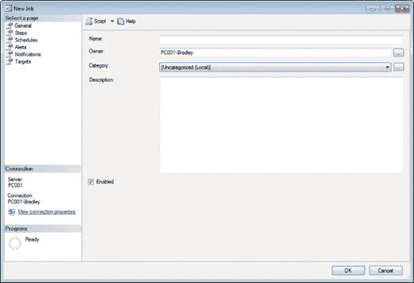
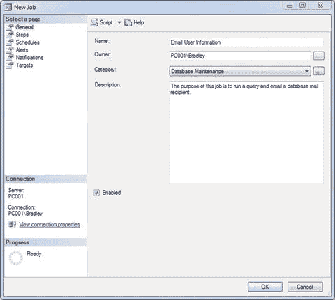

# 创建 SQL Server 代理作业

在 SQL Server Management Studio 中，展开 **SQL Server 代理**（位于最底部），右键单击 **作业** 文件夹，然后选择 **新建作业…**。在 **常规** 选项卡上首先要注意的是，**所有者** 框不一定显示你登录的用户名，而通常是你的 Windows 账户名（如果你使用的是 Windows 身份验证，通常就是你的姓和名）。你需要将其更改为你的实际 Windows 用户名，如图 4-18 所示，该用户很可能也是数据库的所有者。

*图 4-18. 新建作业（初始界面）*

你需要为作业添加一个名称，所以在 **名称** 字段中输入 `Email User Information`。

将 **类别** 更改为 **数据库维护**，并添加一个简单的描述。描述应该易于识别。你不需要在这里写长篇大论，但也不能只写“做点事情”。简短而准确是关键。

现在你的屏幕应该类似于图 4-19。

*图 4-19. 新建作业（更新后的界面）*

确保 **已启用** 复选框已被勾选；否则，作业将处于未启用状态，无法按预期运行。

