# SQL Server 代理选项

请注意界面左侧的菜单选项。这些是你在作业中需要设置的不同选项，正如你在前面章节中看到的。现在让我们来看看这些选项。先不要做任何更改，只需熟悉一下这些选项：

*   `常规`：这是你当前所在的选项卡。它用于设置常规选项，因此得名。
*   `步骤`：此选项用于定义作业将要执行的步骤。你还可以调整步骤的顺序，或者定义不同的起始步骤。和往常一样，一旦添加了步骤，你随时可以返回进行编辑或删除。
*   `计划`：此选项用于定义运行作业的计划。它的设置方式几乎可以随心所欲，所以花点时间在这个区域仔细检查，确保设置正确。
*   `警报`：此选项让你可以从 SQL Server 维护的众多警报中进行选择。点击屏幕底部的 **添加** 按钮。当你首次进入此选项时，会看到 **新建警报** 窗口的 **常规** 选项卡。

警报进一步细分如下：

*   `SQL Server 事件警报`：选择目标数据库以及要监视的严重级别或错误号。你还可以设置当任何消息返回特定文本（例如“error”或“failure”）时引发警报。
*   `SQL Server 性能条件警报`：这个很有趣。你可以在这里选择要监视的 **对象**、**计数器** 和 **实例**。例如，如果你想查看作业运行时发生的事务数量，可以选择 **数据库** 作为对象，**活动事务** 作为计数器，并将你的数据库名称作为实例。将“警报条件计数器”的值更改为“高于”，并将值设为 `0`，这样你就拥有了一个便捷的性能监视器。
*   `WMI 事件警报`：此区域使用鲜为人知的 WQL（Windows Management Instrumentation (WMI) 查询语言）来监视 SQL Server 事件。我认为这可能超出了本书的范围，因为我们可以用前两种方式完成所需的工作。

接下来是 **响应** 选项卡。在这里，你可以定义希望执行的作业。你还可以选择 **通知操作员**，方法是勾选复选框并选择 **新建操作员** 或选择一个预定义的操作员。只需根据需要填写界面就完成了！SQL Server 让这个管理变得非常容易，你不觉得吗？勾选 **电子邮件** 复选框，你就设置好了。这里需要重要说明，这并不是我们之前设置的内容。这不是作业的数据库邮件部分；这仅与此特定的 **警报** 区域相关。我们接下来会讲到数据库邮件部分。

#### 通知

这是我们添加数据库邮件的地方。当你首次打开此选项卡时，会看到右侧的 **电子邮件**、**寻呼** 等选项。勾选 **电子邮件** 复选框，然后点击其右侧的下拉菜单。你会看到你之前输入的操作员名称。现在先不管它，因为这只是对选项的介绍。

#### 目标

在这里，你可以选择要针对哪些服务器运行。你的选项是——准备好听答案—— **本地** 或 **多个**。注意，**多个** 选项可能是灰显的。这是因为没有其他服务器被添加为链接服务器，并且没有配置该服务器与其他任何服务器通信。

现在我们已经过了一遍这些选项，最后来设置作业吧！

#### 步骤选项卡

回到 **步骤** 选项卡。它现在应该是空的，意味着还没有列出任何步骤。在此 **步骤** 选项卡的屏幕底部，有一个标有 **新建** 的按钮。点击它以继续。

## 常规

你应该会看到如图 4-20 所示的界面打开。注意，你当前在此屏幕上位于 **常规** 选项卡。

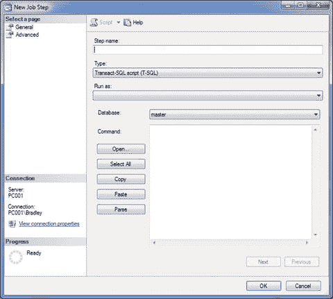
*图 4-20. 新建作业步骤，常规选项（初始界面）*

这是你此时看到的内容。在 **步骤名称** 框中输入 `Run SQL Query`。

巧合的是，**Transact-SQL 脚本 (T-SQL)** 选项已经被为我们选好了。这里还有其他选项可供选择，但我们暂时坚持使用这个。

这里有一个标为 **运行身份** 的下拉框。你可以保留其默认值（即为空）。此框用于当你已经设置了一个代理账户，并希望由该代理账户来执行此步骤，而不是由 SQL Server 代理账户执行。原因在于，运行作业的当前上下文始终是 SQL Server 代理，但当前步骤可以由不同的用户执行。你可以为特定任务设置不同的用户，我接下来会展示给你看，但这个可以保持默认。

从 **数据库** 下拉菜单中选择你的数据库名称；当前选中的是 **master**。

**命令** 框是你粘贴我们之前编写的 SQL 查询的地方，所以请将查询放进去。如果你想的话，可以点击 **解析**。此时界面应如图 4-21 所示。

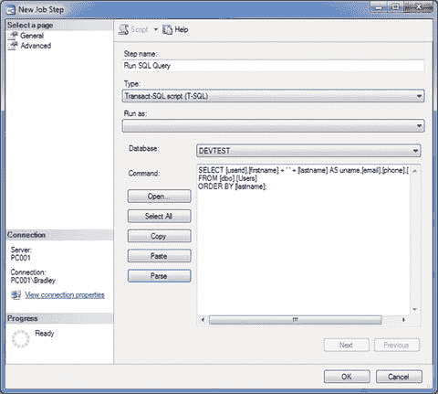
*图 4-21. 新建作业步骤，常规选项（更新后的界面）*

准备就绪后，点击 **高级** 选项卡继续。


## 高级

本屏幕的目的是为此步骤设置高级选项。初始界面如图 4-22 所示。

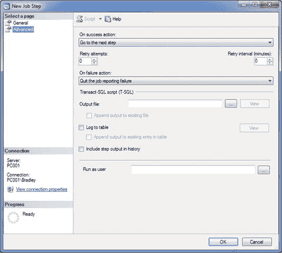

**图 4-22.**
新建作业步骤，高级选项（初始界面）

注意这里有一个`“Run as user”`框。我们刚才不是设置过了吗？嗯，是，也不是。这个字段的正确选项应该是你当前的 Windows 登录账户（如果你使用了 Windows 身份验证，并且该账户是数据库用户），或者数据库所有者（`dbo`）账户。原因是此步骤需要在用户账户的上下文中运行才能执行。通常，你可以使用`dbo`来完成几乎所有操作，因为它很可能就是拥有数据库的账户，因此可以无需额外权限执行大多数必要操作。

如果你想记录发生的事情，就在这里设置。你有`On Success`和`On Failure`选项，以及重试和间隔选项。如果你已为此区域选择了日志记录，那么请继续在此处设置。

你还可以选择输出 SQL 脚本、将 SQL 脚本追加到现有文件、记录到表（需要预先设置好表）以及在步骤历史记录中包含输出。实际上，我只想在历史记录中看到步骤输出，因此请继续选择此选项，如图 4-23 所示。

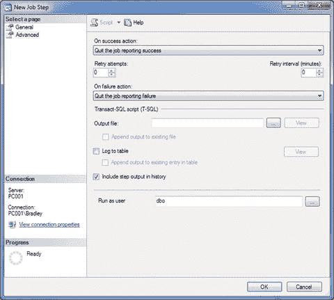

**图 4-23.**
新建作业步骤，高级选项（更新后的界面）

现在这一切都完成了，继续点击“确定”进入下一个区域，如图 4-24 所示。

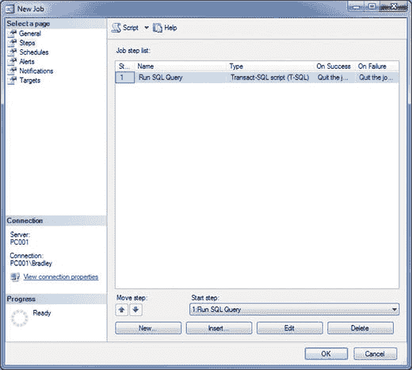

**图 4-24.**
新建作业步骤，高级选项（更新后的界面）

注意点击“确定”后，你会返回到“作业属性”窗口的“步骤”选项卡，现在可以在那里看到新输入的步骤。干得不错！

到目前为止一切顺利。注意“起始步骤”选项设置为唯一可用的值，也就是我们刚刚输入的步骤。你现在可以选择`Insert`、`Edit`或`Delete`步骤。请小心操作，因为如果意外删除某些内容，是不可恢复的。

#### 计划选项卡

在这里设置时间表。这是你需要决定希望作业运行频率的部分。你可以将其设置为几乎任何值，但要记住，如果你持续运行一个作业，将会大大消耗系统资源。这真的对你有帮助吗？请记住，此维护计划的目的是让你作为数据库管理员的工作更轻松，而不是更复杂。如果它让你的生活变得复杂，那你可能做错了。请花时间重新检查作业的要求，然后从那里实施解决方案。

“时间表”选项卡最初有两个选项，如图 4-25 所示。

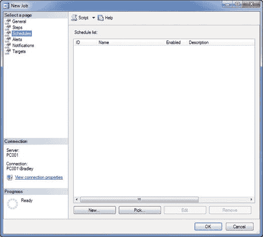

**图 4-25.**
作业属性，时间表选项卡

这些选项是`New`和`Pick`。`New`允许你从头开始创建一个全新的时间表。`Pick`让你从预先存在的时间表中选择。

非常直接。你可以在此处查看预定义的时间表，或者根据你的特定需求创建自己的时间表。在本练习中，我选择了`Pick`，并打算使用选项`CollectorSchedule_Every_6h`。此计划将全天候运行，每 6 小时一次，直到永远。选择该选项并点击“确定”后，屏幕上会显示该选项，如图 4-26 所示。

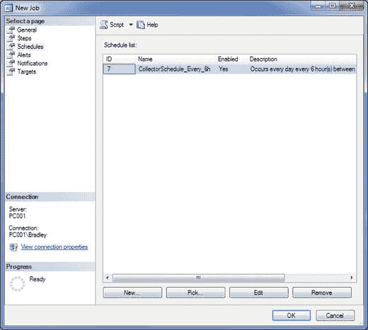

**图 4-26.**
作业属性，时间表选项卡（已更新）

所以一切都设置好了。继续前进！

#### 警报选项卡

接下来是“警报”选项卡。这里面有大量有用的信息，我们将详细介绍所有的菜单选项。让我们先看看按下`Add`之后会发生什么的概览。你可以随时参考前面的信息进行更简短的介绍，因为这将需要一些时间。

你首先注意到有三个选项卡：`General`、`Response`和`Options`。

### 常规

`General`选项卡让你决定要针对哪个事件。现在，尽管我们不会在作业中使用警报，但我仍然想介绍如何设置它，以便你以后需要时可以参考。

此区域仅用于捕获事件。可以捕获哪些类型的事件？

*   `SQL Server event alert`：选择目标数据库，或保留默认的`<all databases>`。然后选择将引发的警报；可以通过错误编号或严重性来选择，并有一个额外的设置，用于在选定“引发警报”复选框并在“消息文本”字段中输入字符串后，搜索任何返回值中是否包含特定字符串。
*   `SQL Server performance condition alert`：这个区域要复杂得多。这里有成千上万种数据字段组合，要概述每一个及其特定属性需要数千页的篇幅。对这个区域的简洁定义是：在特定性能条件发生时捕获它们。
*   `WMI event alert`：我从未使用过这个，所以我不会重点介绍它。如果你希望看到一些很酷的 WMI 内容，我很抱歉让你失望了！


#### 响应

首次点击菜单选项时，您会看到如图 4-27 所示的屏幕。

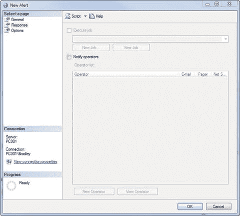

图 4-27.

##### 新建警报

如果已保存作业，您会看到`执行作业`复选框默认处于选中状态。这是因为，无论是否愿意，它都是此作业的一部分。如果尚未保存，它则尚未分配给作业，但仍将被禁用。不过，您仍有能力通知操作员，这一点很关键。在此步骤中，要通知操作员所针对的事件，必须选中此项并选择一个用户。您可以勾选`通知操作员`框并点击`新建操作员`，向 SQL Server Agent 的操作员区域添加一个新操作员。图 4-28 展示了一个示例。

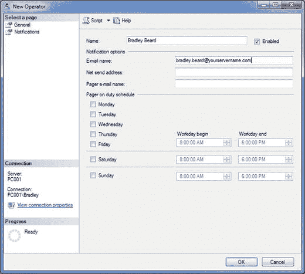

图 4-28.

##### 新建操作员

在此屏幕点击`确定`。请注意，如果您展开服务器名称，然后展开`SQL Server Agent`，再展开`操作员`，您将在此区域看到在此处指定的操作员。同时请注意，您无法从此界面（在作业属性内）删除操作员。如需删除操作员，必须通过 SSMS 在`操作员`部分进行操作。

如果您已经添加了一个操作员，我们会看到该操作员显示在界面中，其名称旁有一组复选框。选项包括`电子邮件`、`寻呼`和`网络发送`。如果您已为这些选项设置了值，请在此处选择它们（至少选择电子邮件）。如果愿意，点击`查看操作员`，注意左侧还有一个名为`历史记录`的选项。点击该选项会显示一个新界面，如图 4-29 所示。

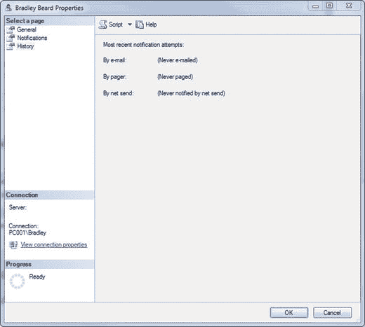

图 4-29.

##### 新建操作员，“历史记录”选项卡

一旦此作业有可用数据，即运行之后，这里就会有数据。由于它从未运行过，因此没有数据。点击`确定`返回`新建警报`界面。

您现在应该回到刚才离开的地方：`执行作业`选项已禁用，且未选择任何操作员，如图 4-30 所示。

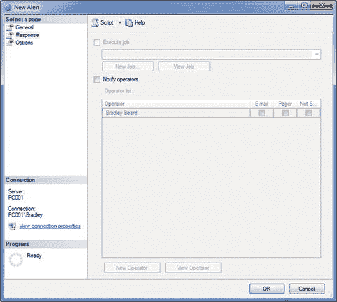

图 4-30.

##### 新建警报，“响应”选项卡

接下来，点击左侧的`选项`选项卡。您将看到如图 4-31 所示的界面。

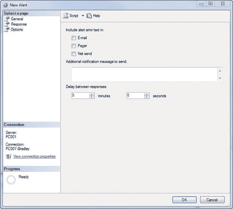

图 4-31.

##### 新建警报，“选项”选项卡（初始界面）

这使您可以选择将警报错误文本包含在电子邮件、寻呼或网络发送中。您还可以通过在文本框中输入来指定任何附加信息。您也可以在此处延迟响应。什么是延迟响应？简单来说，就是在指定时间范围内，对于同一事件的后续发生，执行一个休眠命令。假设您没有正确设置此选项，并且像我们现在的默认设置那样。这意味着，针对数据库引擎的每一个目标事件，都会创建一封电子邮件并发送给列出的操作员。您可以想象这将生成大量邮件，您的想法是对的。设置响应延迟——即 SQL Server 在响应下一个相同事件前等待的时间范围——可以解决这个问题。

这一切意味着什么？这里有一个很好的理解方式。

当指定的警报发生时，我希望通过电子邮件通知此人。我还想在电子邮件中添加文本“希望这不是一个永久性错误！”，所以我将在这里添加它。我不想了解此类型的所有错误，只想知道此错误已发生。我将为此设置一个延迟，这样，即使发生通常会触发此事件的相同事件，我也不希望该事件触发相同的作业。

明白它是如何工作的了吗？图 4-32 展示了一个包含建议值的更新界面。

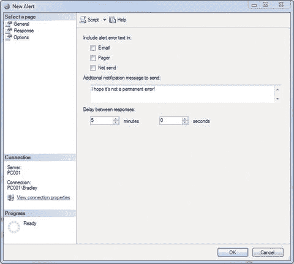

图 4-32.

##### 新建警报，“选项”选项卡（更新后的界面）

现在我们可以看到，我们将在邮件之间至少等待 5 分钟。

我们并不想实际使用这些值，因此只需按`取消`返回到作业属性页面。您应该看到一个空白的`警报`屏幕；请记住，我们并不想在此处设置任何警报。我们确实设置了一个操作员，这实际上是我们从该区域需要的全部。是的，还有其他几种方法可以做到这一点，但这种方式让您了解了此区域。

#### 通知

接下来是`通知`选项卡，如图 4-33 所示。请注意，没有任何选项被勾选，且下拉值为默认值。

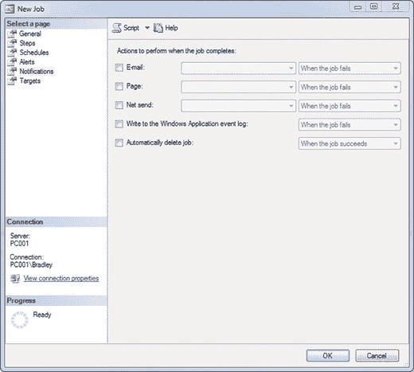

图 4-33.

##### 作业属性，“通知”选项卡

这里才是我们实际定义先前设置的数据库邮件选项的地方。以下是可用的联系选项：

*   电子邮件
*   寻呼
*   网络发送
*   写入 Windows 应用程序事件日志
*   自动删除作业

可以选择其中任何一个或全部，以便需要被通知的用户能够收到通知。我通常建议为数据库问题设置一个通用电子邮件，但这最终取决于您的设置和任何安全限制。无论如何，此区域确实没有理由留空（除了选择电子邮件，因为这是重点）。例如，为什么不希望作业状态写入 Windows 事件日志呢？

此屏幕本身相当直观，如图 4-34 所示，其中包含我推荐的选项和值。

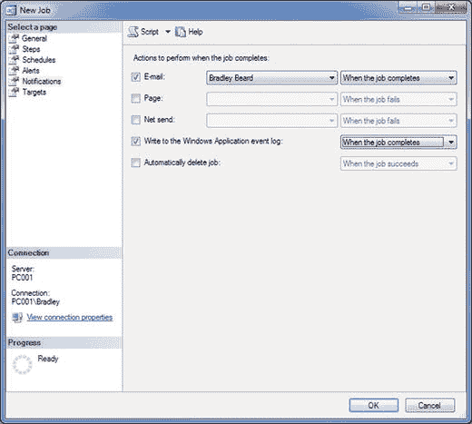

图 4-34.

##### 作业属性，“通知”选项卡（已更新）

**提示**

如果您在框中看不到您的电子邮件名称，请保存作业并重新打开。瞧！

注意我的账户名是如何出现在电子邮件字段中的吗？这是因为它是从我们之前所做的数据库邮件工作中填充在此处的。同时请注意下拉菜单有三个不同的选项：`当作业成功时`、`当作业失败时`和`当作业完成时`。图 4-35 说明了这一点。

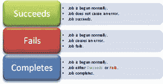

图 4-35.

##### 作业状态含义

这些是什么意思？它们之间有什么区别，我应该选择哪个？以下经验法则将有助于回答这些问题：

*   如果您想知道作业何时成功完成，请选择`当作业成功时`。
*   如果您想知道作业何时失败，请选择`当作业失败时`。
*   如果您想知道作业是成功还是失败，请选择`当作业完成时`。

这实际上就是这些选项之间唯一的区别。`完成`选项是一个全包含的选项，而`成功`和`失败`则取决于作业的通过或失败状态。可以将`完成`视为一个 AND 子句，而`成功`和`失败`则视为 OR 子句。

#### 目标

此屏幕通常可保留为默认的 `“目标本地服务器”` 选项。设置完成后点击“确定”。至此，SQL Server 代理作业已设置完毕！

> **注意**
>
> 这是内容非常丰富的重要章节。如果未能一次性成功完成所有步骤，请务必回头重新操作一遍。如果你已经跟到这里，请不要放弃！

测试新作业以确保其正常运行。右键单击该作业，然后选择 `从步骤开始作业…` 以启动它。图 4-36 显示了此时应出现的界面。

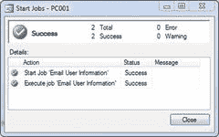
*图 4-36. 成功！*

成功！现在，请检查你的电子邮箱。看，你应该已经收到了一封类似图 4-37 所示的邮件。

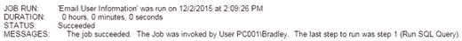
*图 4-37. 收到的邮件*

此时，我还需要补充一点……我设置的环境没有任何针对外部服务器的应急措施，因此建立连接轻而易举。但在现实世界中，情况可能要复杂得多，所以我建议在开始前确保“万事俱备”（打个比方）。我回头尝试使用 Gmail 来实现此功能，结果基本上搞砸了。有很多设置是 Gmail 特有的，必须在 Gmail 那边进行配置。这里假设你将在某种企业环境中工作，并能从系统或邮件管理员那里获取所需的 SMTP 信息。不过，我仍会提供一个简明的指南，说明如何连接 Gmail 并使用其 SMTP 服务。

### Gmail 的 SMTP

这实际上是一个相当复杂的过程。你需要配置一些非常具体的设置，才能让 Google：

*   允许访问其 SMTP 服务器
*   通过其 SMTP 服务器发送电子邮件

启用这些功能中的每一项都需要不同的步骤，我们稍后会逐一查看。首先，让我们来设置新的配置文件。

### 设置配置文件

在 `SSMS` 的 `管理` 文件夹内双击 `Database Mail`。你将看到如图 4-38 所示的界面。

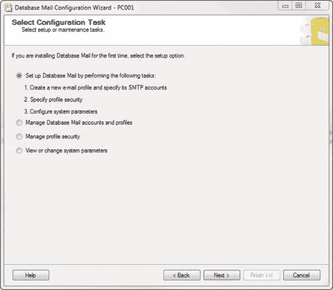
*图 4-38. 选择配置任务*

这是通用的起始屏幕，因此选择默认选项并点击“下一步”。

当看到图 4-39 所示的屏幕时，在配置文件名称中输入 `Gmail Profile`，并为描述填写一个简短明了的内容。

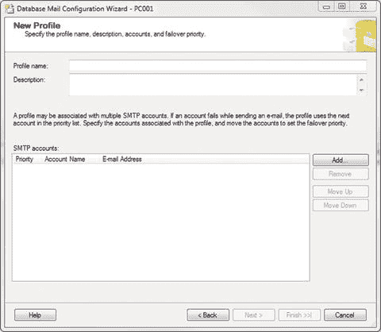
*图 4-39. 新建配置文件*

完成后，点击 `添加…` 继续。

现在你应该看到如图 4-40 所示的界面。注意我们旧的配置文件也在那里。那是另一个配置文件，不是新的 Gmail 配置文件。

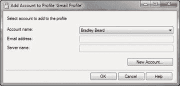
*图 4-40. 向配置文件添加账户*

因为我们正在设置新的配置文件，所以不想使用这个旧的配置文件。请点击 `新建账户…` 按钮。这将打开如图 4-41 所示的界面。

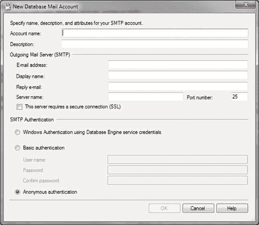
*图 4-41. 新建数据库邮件账户*

这与我们之前输入的内容完全相同，但现在让我们根据 Gmail 的特定设置进行更新。按照图 4-42 所示完成你的选择。

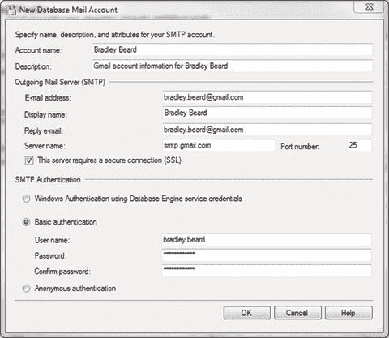
*图 4-42. 新建数据库邮件账户（已更新）*

关键点在于必须选中 `SSL` 复选框，并且你的账户信息显然需要正确。Gmail 的 SMTP 服务器是 `smtp.gmail.com`，端口号是 `25`。完成后点击“确定”。你将看到如图 4-43 所示的屏幕。

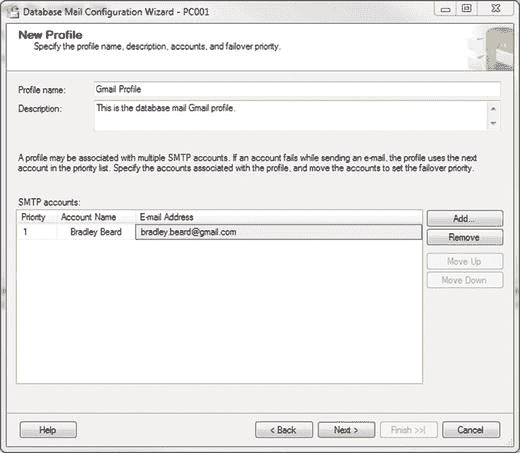
*图 4-43. 新建配置文件*

继续点击此处的“下一步”。你将看到 `管理配置文件安全性` 屏幕，如图 4-44 所示。

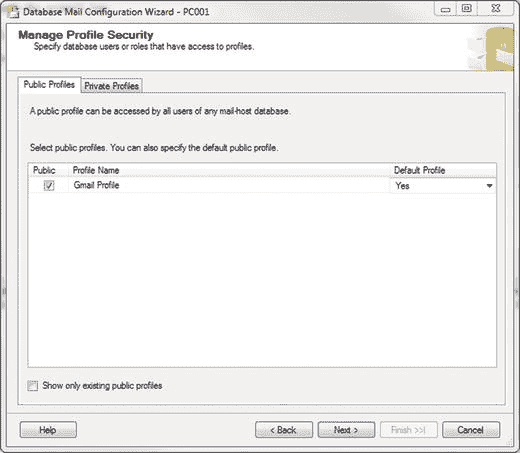
*图 4-44. 管理配置文件安全性*

注意我已经选中了 `公共` 复选框。我还将 `默认配置文件` 的值改为了 `是`。这是一个下拉菜单，因此请下拉并更改该值。你无需进入 `专用配置文件` 部分，所以不用担心那里。准备好继续后点击“下一步”。你将看到如图 4-45 所示的内容。

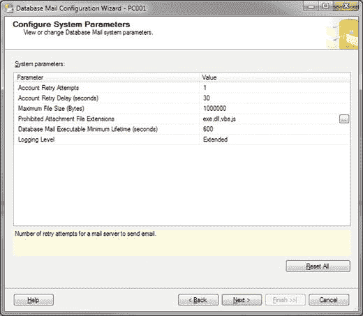
*图 4-45. 配置系统参数*

这是定义系统参数的屏幕。还记得之前设置的这些选项吗？现在它们是一样的，所以保持原样，点击“下一步”。

然后，你将看到 `完成该向导` 屏幕，如图 4-46 所示。

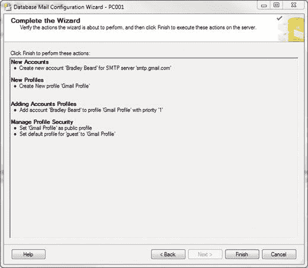
*图 4-46. 完成向导*

这些设置是我们为这个新配置文件所做的配置，完成后请直接点击“完成”。接下来，你应该会看到绿色的勾选框，如图 4-47 所示。

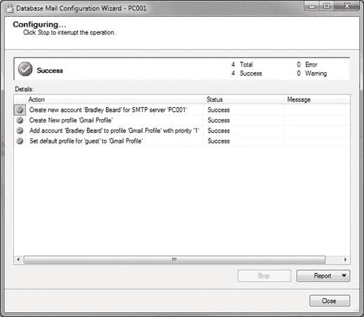
*图 4-47. 正在配置…*

### 测试电子邮件配置

至此，第一部分已完成。它可能还无法正常工作。要测试其功能，你可以通过右键单击 `Database Mail` 并选择 `发送测试电子邮件…` 来手动发送测试邮件，也可以使用以下脚本。

```sql
EXEC msdb.dbo.sp_send_dbmail
@profile_name='Gmail Profile',
@recipients = 'bradley.beard@gmail.com',
@subject='This is only a test. We control the horizontal. We control the vertical.',
@body='Testing the Gmail profile'
```

这封邮件也会被发送出去。两种方式都可以。运行之后，通过右键单击 `Database Mail` 并选择 `查看数据库邮件日志` 来检查 `数据库邮件日志`。然后你将看到如图 4-48 所示的屏幕。

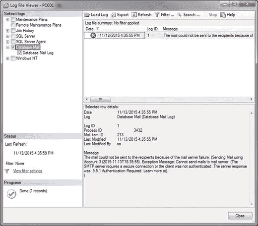
*图 4-48. 日志文件查看器*

看到那个错误了吗？让我们看看：“邮件无法发送给收件人，因为邮件服务器故障。（使用账户 3 发送邮件（2015-11-13T16:35:55）。异常消息：无法向邮件服务器发送邮件。（SMTP 服务器需要安全连接，或者客户端未通过身份验证。服务器响应为：5.5.1 需要身份验证。了解更多信息请访问）。”

有趣！这里最重要的部分是（我无法更加强调这一点）：**暂时不要更改任何设置**。相信我。SQL Server 的配置是正确的。你必须先完成 Google 那边的设置，一切才能正常工作。

现在，让我们来看看 Google 的设置。

## 允许访问谷歌的 SMTP 服务器

首先，我们需要做的是允许 SQL Server 访问 Gmail 的服务器。这看起来像是一项微不足道的任务，实际上也差不多，但你需要在谷歌那边更改一些设置。

首先，从你的浏览器登录谷歌并访问`https://myaccount.google.com/security`。这是谷歌的主要安全页面。你几乎可以从这里处理任何谷歌相关任务。

到达此页面后，你需要找到一个名为“允许安全性较低的应用”的部分。默认情况下，此设置为“关闭”。只需点击按钮将其更改为“开启”，如图`4-49`所示。

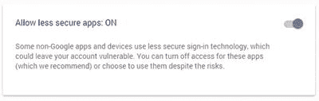

图 4-49. 允许安全性较低的应用

完成后，返回`SSMS`并再次检查数据库邮件日志。我只在那里看到另一个错误，它发生在第一个错误之后大约 1 秒钟。还记得我们将间隔设置为 5 分钟吗？我们现在必须等待那么长时间，才能看到它是否有效。

我还没看到任何东西，所以肯定还有别的原因！让我们想想…我们已经正确设置了数据库邮件任务（相信我），我们已经启用了安全性较低的应用与谷歌交互……还有什么？

### 启用 POP 电子邮件

还有什么？原来是 Gmail 深处一个必须启用的晦涩设置。打开你的 Gmail 账户并转到“设置”。然后转到“转发和 POP/IMAP”。你应该会看到如图`4-50`所示的屏幕。

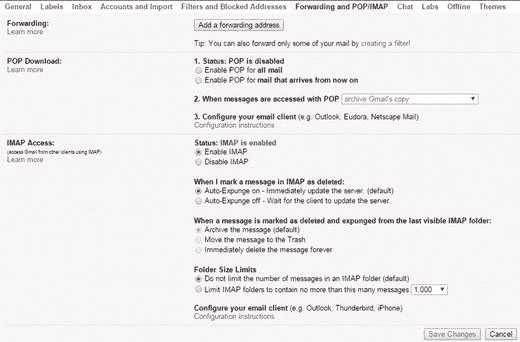

图 4-50. Gmail 设置

看到关于 POP 的那部分了吗？这就是我们接下来需要看的东西。突击测验：POP 和 SMTP 有什么区别？POP 接收电子邮件，而 SMTP 发送电子邮件。所以我的设置显示 POP 是禁用的，这意味着我无法通过 POP 接收电子邮件。将其更改为“对所有邮件启用 POP”，然后点击屏幕底部的“保存更改”。保存需要一两秒钟，然后你就回到了收件箱。

返回`SSMS`，使用之前的脚本再发送一封测试电子邮件。检查你的 Gmail 收件箱。你应该看到如图`4-51`所示的内容。

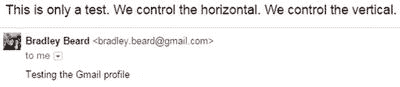

图 4-51. Gmail 已接收

我们现在可以向 Gmail 发送测试电子邮件了！

如果从这里连接到 Gmail 仍然有问题，请重新阅读本节内容。我听说 SSL 端口可能需要从`25`更改为`587`，但我的配置文件设置为`25`，而且它工作得很好。

## 总结

这是一个庞大的章节。如果你有什么没搞懂的，我强烈建议你再读一遍。如果一切不完全准确，很多事情都可能出错。我更希望你花时间去理解我们正在做的每件事，这样你就能看到所有部分是如何组合在一起的，而不是因为概念看起来晦涩或超出你的舒适区而在中途感到沮丧并放弃。我写这本书的原因之一就是让你走出舒适区，因为如果你不接触新的概念和想法，你就永远无法作为数据库管理员成长。有机会学习更多能加深你对某个概念理解的知识是多么令人兴奋！

## 5. 清理 SQL Server 代理历史记录

如果你一直在做练习，你可能已经注意到有很多存档数据，特别是在作业历史领域。这可能既是好事也是坏事，取决于你的观点。它可能是好事，因为如果作业失败，你希望了解其历史。

*   如果你的作业总是成功，那么除了你自己的知识积累，你其实不需要知道它。
*   如果你的作业总是失败，那么你真的需要了解它以便修复它。

考虑这个清理任务的一个好方法是，它会清理掉作业历史的杂乱，这样你只会看到你指定时间段内的信息。你可以定义任何你想要的时间段，但通常可能是类似三天这样的设置。换句话说，只保留三天的历史记录；否则，一个作业的历史记录将永远存在，并且不会真正给你带来任何价值。

如果你还记得，这些练习的总体目的是让你的生活更轻松。如果你是我的老板，如果你保留所有历史记录、记录一切，却没有设置任何清理任务，然后来找我要更多存储空间，因为你的硬盘都满了，那你的麻烦就大了。你第二天就得戴着傻瓜帽读这本书了！

本章的一个重要说明是，你在这里学到的任务是清理`SQL Server Agent`的日志——仅此而已。这些不是由维护计划生成的`.txt`文件；那是在第`6`章。本章任务的作用是清除`SQL Server Agent`保存的有关作业状态的日志。对于许多作业来说，这可能会迅速成为一个难以筛选的巨大问题。将其截断到三天，可以让你有足够的时间查看可能弹出的任何问题，考虑到你会检查电子邮件是否有任何问题。

### 设置维护计划

好了，言归正传。创建这个任务非常简单。继续在“管理”文件夹内右键单击“维护计划”文件夹，然后选择“维护计划向导”。你现在看到的通用界面（图`5-1`）应该是你熟悉的。

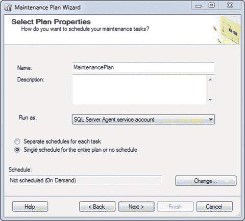

图 5-1. 选择计划属性

将其更新为如图`5-2`所示。

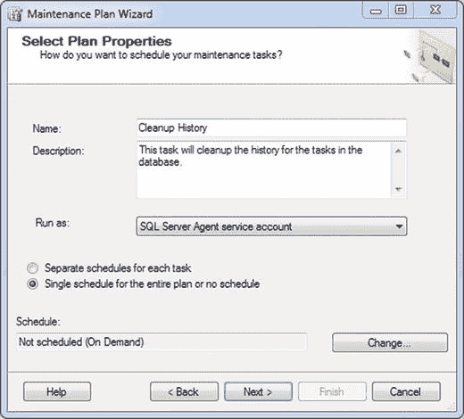

图 5-2. 选择计划属性（已更新）

这为我们进入下一节做好了准备，下一节是……？对了，是任务调度。记住，没有调度的任务毫无意义。这基本上意味着你打算手动运行任务，这完全违背了使用`SQL Server Agent`为你自动执行这些任务的初衷。

单击`更改...`按钮来设置计划。最初，计划是不正确的，所以让我们将其更改为如图`5-3`所示的设置。

*   发生频率：每天
*   发生时间：上午 12:00:00

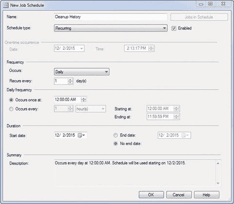

图 5-3. 新建作业计划

完成后，你应该会看到类似图`5-3`所示的结果。

告诉过你这很简单。点击“确定”继续。请注意，你会回到之前设置选项的屏幕，只是现在计划块已经填好了。点击“下一步”继续。


### 选择任务

现在我们需要实际选择要执行的任务，因为我们还没有进行这一步。图 5-4 显示了可供我们选择的任务。

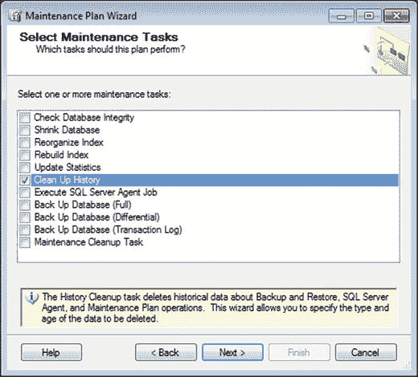
图 5-4：选择维护任务

显然，我们这里将选择 `Clean Up History`，然后点击下一步。

图 5-5 显示了下一个屏幕，您可以在其中选择任务的顺序。由于我们只有一个任务，我们可以点击“下一步”继续。然而，既然在这里，您可能想仔细看看，发现一个界面错误——虽然有点幽默，但也可能导致您丢失工作。

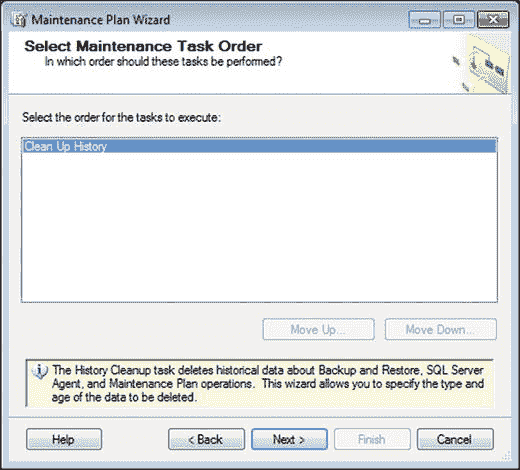
图 5-5：选择维护任务顺序

您现在看到的是图 5-6 中的屏幕吗？点击 `Clean Up History` 文本所在的区域。注意“下移…”按钮变为可用状态。

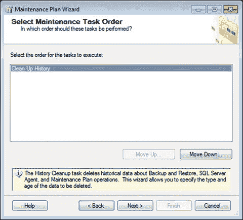
图 5-6：选择维护任务顺序

奇怪。现在点击“下移…”按钮吧。不会发生什么坏事，对吧？图 5-7 显示坏事确实发生了。

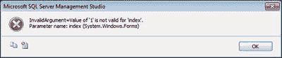
图 5-7：出错！

哎呀！`Microsoft` 欠我一个调试他们界面的感谢！我预计在未来的 `SSMS` 版本中会修复这个问题。

当您看到“定义历史记录清理任务”屏幕时，就可以继续了。

### 定义清理内容

下一步是定义我们想要清理的内容以及频率，如图 5-8 所示。

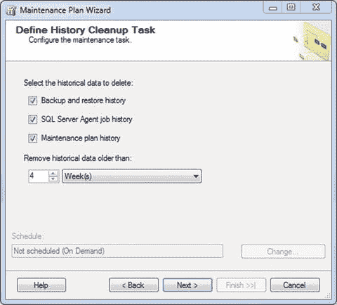
图 5-8：定义历史记录清理任务

图 5-8 最初显示的是您进入此屏幕时看到的内容。只需将值更改为“3 天”即可。保持那三个复选框选中，因为我们想要清理这三个区域。您更新后的界面应如图 5-9 所示。

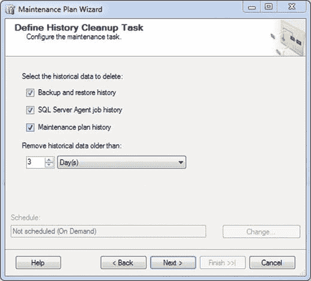
图 5-9：定义历史记录清理任务（已更新）

准备好继续后，点击下一步。

下一个屏幕为您提供报告选项。您可以写入报告、通过电子邮件发送报告，或者两者都做。我建议两者都选，以防您无法使用其中任何一个选项。如果要使用文本文件选项，请确保选择一个专门用于存储日志文件的文件夹位置。我通常倾向于使用在第 1 章描述的文件夹结构，并将所有维护日志指向 `Backup` 文件夹；这意味着只有事务日志会进入 `Logs` 文件夹。

如果选择通过电子邮件发送报告，请点击复选框，并选择我们在第 4 章数据库邮件讨论中设置的操作员。

您的界面现在应类似于图 5-10，其中包含您的值而非我的值。

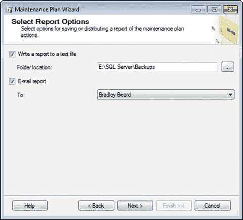
图 5-10：选择报告选项

### 复查

点击下一步，准备完成此任务。您将看到我们在此任务中迄今为止所做工作的摘要。展开所有内容。您应该看到图 5-11 中显示的信息。

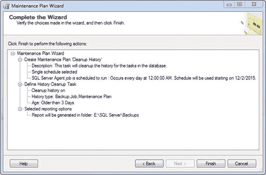
图 5-11：完成向导

要查看，请浏览“完成向导”屏幕中列出的操作，并确保一切符合您的需要。如果不符合，只需点击“上一步”按钮并修复您需要修复的任何内容。准备好实施时，点击“完成”。您应该会看到图 5-12 所示的内容。

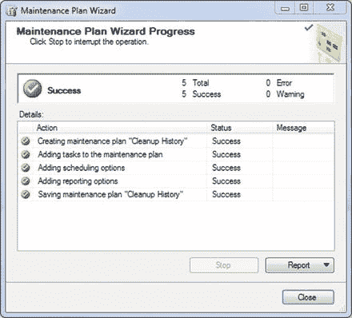
图 5-12：维护计划向导进度

我有没有提到我有多喜欢绿色复选框？它们告诉我们一切都检查通过，并且维护计划已添加到维护计划子系统中，由 `SQL Server Agent` 按设定的计划执行。

记得现在更改作业的默认名称！在 `SQL Server Agent` 的 `Jobs` 文件夹中双击作业名称，并将其更改为易于记忆的名称。如果您记得，我们将维护计划命名为 `Cleanup History`，因此我将作业也命名为 `Cleanup History`。完整名称现在是 `Cleanup History`，如图 5-13 所示。

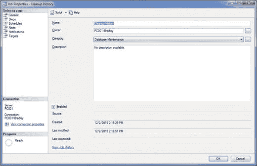
图 5-13：作业属性

记住像之前一样设置此“属性”区域中的其余选项。您的 `Jobs` 文件夹现在应如图 5-14 所示。

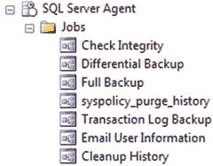
图 5-14：SQL Server Agent 作业

您的 `Maintenance Plans` 文件夹现在应如图 5-15 所示。

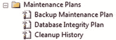
图 5-15：维护计划

### 小结

到目前为止，我们已经完成了五章和三个维护计划。请注意，我们没有为 `SQL Server Agent` 作业章节创建维护计划。这是有意设计的。我们不想为它创建维护计划，因为我只是想展示如何独立于维护计划创建作业。换句话说，作业和维护计划之间有明确的区分，您现在应该认识到这一点。

