# 6. 清理维护文件

与第 5 章内容非常相似的是维护清理任务。历史记录和维护任务本可以联系在一起，但我可以理解为什么它们是分开的。

### 历史记录与维护的分离

为什么历史记录和维护的清理任务是分开的？让我们看看这两个任务之间的区别。图 6-1 强调了需要注意的一些关键差异。

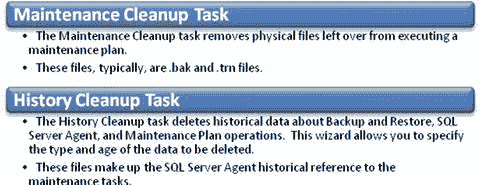
图 6-1：维护清理任务与历史记录清理任务之间的差异

这些差异用外行话来说意味着什么？以下是您需要了解的：

*   `Maintenance Cleanup Task` 清理执行维护计划后留下的物理文件。当您查看记录维护计划步骤的文件系统时，可能会看到相当多的文件。当运行 `Maintenance Cleanup Task` 时（取决于指定的时间段），这些文件将被删除。
*   `Maintenance Cleanup` 任务清理文件系统中的 `.bak` 和 `.trn` 文件，但您需要为每种文件类型设置两个单独的维护计划，因为我们的文件系统像我这样设置（意味着我们将 `.bak` 文件物理上与 `.trn` 文件分开存储）。
*   `History Cleanup Task` 清理任务本身的历史记录，而不是物理文件。当您右键单击一个作业并选择“查看历史记录”时，该历史记录会在运行 `History Cleanup Task` 时（取决于指定的时间段）消失，因为这些行已从 `msdb` 数据库中删除。

现在我们了解了两种清理任务之间的区别，让我们看看如何设置 `Maintenance Cleanup Task`。


### 设置维护计划

请记住，我们需要为此创建三个独立的任务：一个用于`.bak`文件，一个用于`.trn`文件，一个用于`.txt`文件。为什么？因为`SQL Server`要求你选择一个文件扩展名来查找并删除超出特定保留期限的文件，而数据库备份（`.bak`）和事务日志备份（`.trn`）在物理和逻辑上都是不同的。

我们将这些计划分别命名为`备份清理`、`日志清理`和`文本文件清理`。这样命名清晰明了，方便我们轻松区分各项任务。

我们将首先设置`备份清理`，然后是`日志清理`，最后是`文本文件清理`。请记住，如果维护任务出现问题，`文本文件清理`任务中引用的`.txt`文件是开始故障排查的好地方。

### 备份清理

清理备份的目的相当简单：你不希望文件系统中存储着大型数据库的多个副本，从而占用其他应用程序或操作系统功能可能需要的空间。因此，配置一个默认的保留期限并基于该期限自动清理备份要容易得多。`备份清理`任务使我们能够创建一个自动清理这些备份文件的方法。

右键单击`管理`文件夹下的`维护计划`文件夹，选择`维护计划向导`开始操作。在`名称`框中输入`备份清理`，在`描述`框中输入简短明了的说明，然后单击`更改…`按钮来设置计划。将`发生`下拉菜单改为`每天`，其余保持不变，然后单击`确定`。你的界面应类似于图 6-2。

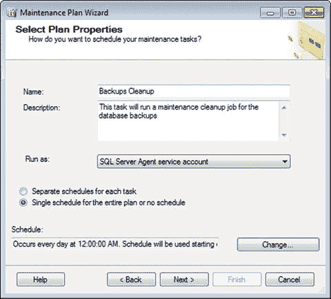
图 6-2. 选择计划属性

好的开始。所以，就像之前一样，我们为它指定了一个合适的`名称`和`描述`，将`运行身份`保留为默认设置，并将计划设置为每晚午夜触发。单击`下一步`，我们来设置下一部分，如图 6-3 所示。

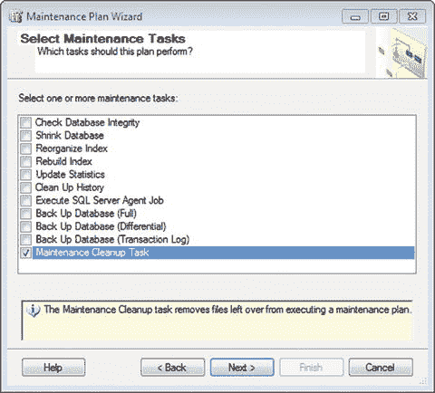
图 6-3. 选择维护任务

显然，你需要在这里选择`维护清除任务`，然后单击`下一步`。之后你将看到如图 6-4 所示的界面。

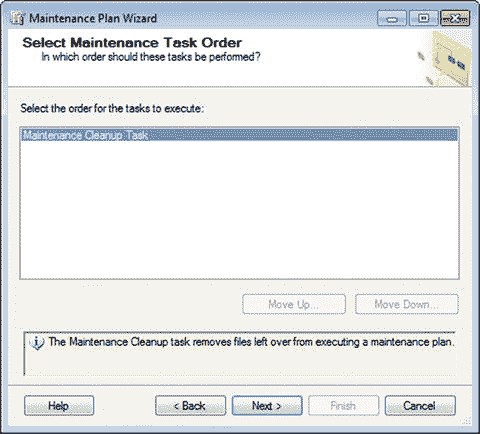
图 6-4. 选择维护任务顺序

你可以像第 4 章那样停下来生成界面错误，但如果你这么做就需要重新开始。准备好后，单击`下一步`。

下一个屏幕是本任务的核心部分。如果你是素食者，可以理解为豆腐和羽衣甘蓝。无论哪种情况，初始界面如图 6-5 所示。

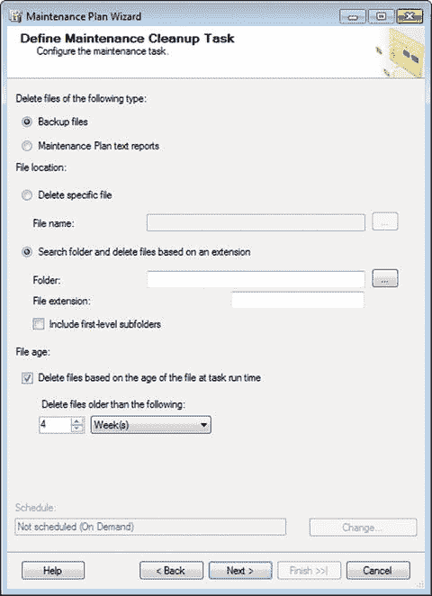
图 6-5. 定义维护清除任务

你首先会注意到屏幕顶部有一个单选选项，提供两个选择：“备份文件”和“维护计划文本报告”。这是否意味着你无法在同一任务中同时处理两者？简而言之，是的。如果你想两者都处理，需要为每种想要删除的文件类型设置两个维护计划或作业。原因在于，在一个区域中，你是在删除数据库的实际备份，而在另一个区域，你是在删除维护计划操作的文本报告。换句话说，它们是不同的清理任务，行为也不同。我希望微软在未来的`SQL Server`版本中能将这两项任务分开，但我对此不抱太大希望。

现在，让我们专注于“备份文件”选项。“维护计划文本报告”选项紧随其后。

#### 删除备份文件

你可以选择删除实际的数据库备份文件。请注意，如果你按照第 1 章所述设置了备份计划，那么你将运行完整备份，然后是差异备份，最后是事务日志备份。考虑到这一点，如果你要实施此解决方案，备份只会保留一段时间。但关键在于：从文件系统的角度来看，完整备份和差异备份之间没有区别。请再读一遍这部分。它们没有区别，因为默认情况下它们都具有`.bak`文件扩展名。因此，如果你删除了完整备份但没有删除差异备份，你将无法还原差异备份，因为它依赖于完整备份来进行还原。没有完整备份，差异备份就无法将数据还原到数据库中，实际上它就完全没用了。

```
提示
显然，任何时候删除数据都应非常谨慎。请花时间彻底了解此过程，以避免将来因意外删除可能需要的备份而带来麻烦。
```

好的，参照图 6-5，确保选择了“备份文件”。其下方的“文件位置”区域决定了你是要删除特定文件，还是要删除具有特定扩展名的文件夹中的所有文件。虽然这听起来直截了当，但还是让我们看看给出的两个选项。

#### 删除特定文件

假设你已将日志记录设置为“全部保存到同一文件”。我想象不出你为什么要这么做，但假设你有一个合理的理由。此选项会查找并删除特定位置中的特定文件。这有意义吗？它不会遍历目录来查找文件；它只会删除指定的文件。


### 基于扩展名的搜索与删除

与备份选项类似，此选项允许你删除特定位置（包括一级子文件夹）中的所有文件。为什么要包含一级子文件夹？因为此选项是在你很久以前（第 1 章）设置备份部分时提供的，他们希望你能妥善管理你的备份。让你将备份写入某个目录，却不赋予你管理该目录中备份的权限，这似乎不太合理。

牢记这两点宝贵见解，我们将保留默认的 `搜索文件夹并基于扩展名删除文件` 选项，并确保也勾选 `包括一级子文件夹`。默认文件扩展名仍应设置为 `bak`。文件夹位置需要设置为你定义的存储备份的位置。这个相同的位置也是我们将搜索备份文件并根据备份时间长短来删除它们的地方。此时你应该看到如图 6-6 所示的内容。

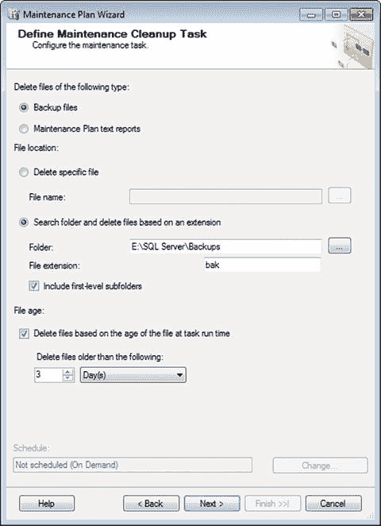
图 6-6. 定义维护清理任务（已完成）

最后一部分是 `文件存在时间`。你需要保持选中 `根据任务运行时文件的存在时间删除文件` 复选框。我努力遵循的标准是保留文件三天，所以请更新选项以符合这个标准或你的任何要求。

请谨慎对待此区域。正如我之前所说，这一点需要非常认真地对待。在此级别删除文件是无法撤销的。务必确保你完全理解删除这些文件的含义。做出选择后，点击 `下一步` 继续。

再次，你遇到了将选项设为 `将报告写入文本文件` 或 `通过电子邮件发送报告` 的选择。我建议选择这两个选项；这样，你就能在数据库发生状况时及时知晓。进行如图 6-7 所示的更改，并在电子邮件步骤中替换为你的操作员。

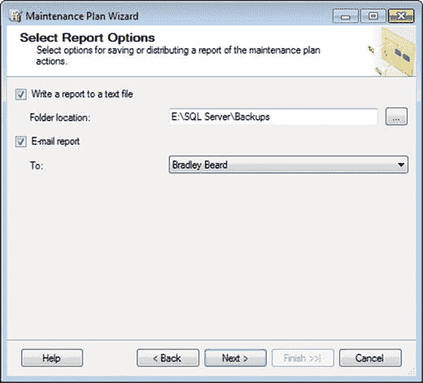
图 6-7. 选择报告选项

点击此处的 `下一步`，你将看到 `摘要` 页面。再次强调，这是你需要绝对确保设置正确的地方。图 6-8 显示了我的 `摘要` 页面的样子。

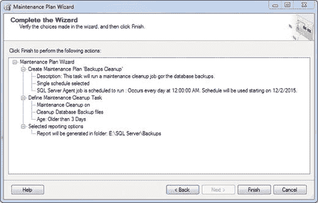
图 6-8. 完成向导

准备就绪后点击 `完成`。希望你会看到如图 6-9 所示的绿色方框。

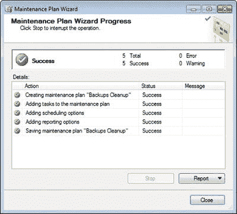
图 6-9. 维护计划向导进度

我看到全是绿色的复选框。非常好！

请确保使用前面章节中的技术来更新作业：双击 `SQL Server Agent` 下 `Jobs` 文件夹中的作业。我将其改为了 `bak 文件`，但如果你想，也可以选择其他名称。更新后，你的界面应该类似于图 6-10。

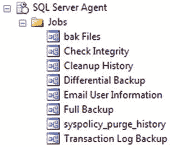
图 6-10. SQL Server Agent 作业

接下来，我们需要为 `.trn` 文件（事务日志备份）重新创建相同的作业。基本上，接下来的部分将是复制前面的信息，但更新为适用于 `.trn` 文件。

#### 日志清理

与之前类似，`日志清理` 任务将允许我们删除文件系统中存在的 `.trn` 文件。为什么要这样做？事务日志备份不重要吗？是的，它们很重要。但它们只有与当前备份集相关时才具有意义。回想一下，备份的事务日志只能恢复到差异备份。嗯，如果差异备份或完整备份文件已被删除，那么就没有理由保留该备份的事务日志了。这正是此任务赋予我们的灵活性：删除那些不再需要的事务日志。

像之前一样开始。右键单击 `Management` 下的 `Maintenance Plans` 文件夹，选择 `维护计划向导`。在 `名称` 框中输入 `日志清理`，在 `描述` 框中输入简短明了的描述，然后点击 `更改…` 按钮设置计划。将 `发生` 下拉菜单更改为 `每天`，其余保持不变，然后点击 `确定`。你的界面应类似于图 6-11。

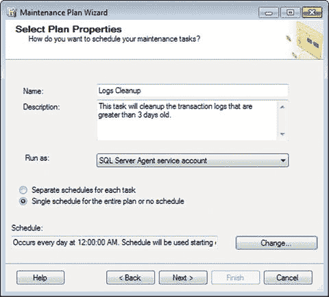
图 6-11. 选择计划属性

好的开始。所以，就像之前一样，我们提供了良好的 `名称` 和 `描述`，将 `运行身份` 保留为默认设置，并将计划设置为每晚午夜触发。点击 `下一步`。现在让我们设置下一部分，如图 6-12 所示。

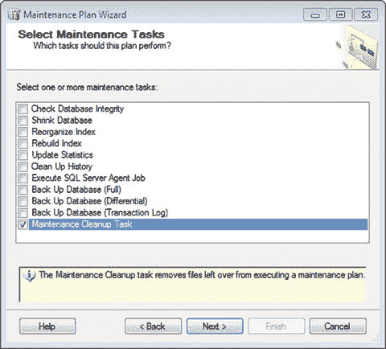
图 6-12. 选择维护任务

在此处选择 `维护清理任务`，然后点击 `下一步`。你将看到如图 6-13 所示的界面。

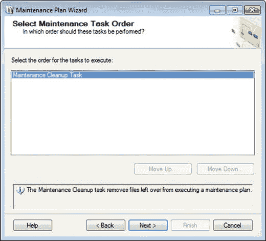
图 6-13. 选择维护任务顺序

准备就绪后点击 `下一步`，你应该看到如图 6-14 所示的内容。

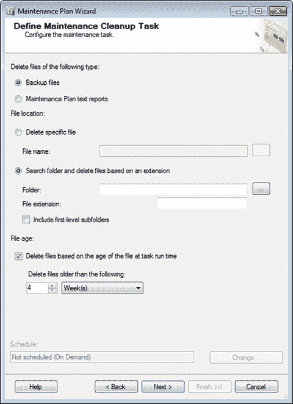
图 6-14. 定义维护清理任务

在此处选择 `备份文件` 选项。选择你的事务日志位置，并在 `文件扩展名` 字段中输入 `trn`。请注意，这次我们选择了日志位置，因为这是存储事务日志的地方。

此时你应该看到如图 6-15 所示的内容。

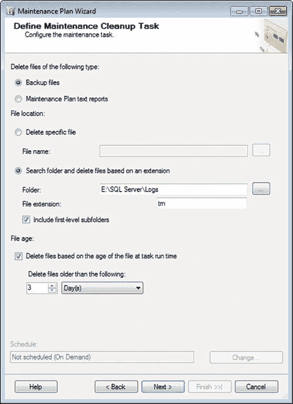
图 6-15. 定义维护清理任务（已完成）

请注意，我们选择了 `3 天`；与 `.bak` 选项相同。原因在于，没有相应的差异备份，你将无法恢复事务日志，因此我们将按天删除所有文件，以确保始终保持同步。你需要保持选中 `根据任务运行时文件的存在时间删除文件` 复选框。此时点击 `下一步`。

再次，你遇到了将选项设为 `将报告写入文本文件` 或 `通过电子邮件发送报告` 的选择。我建议选择这两个选项；这样，你就能在数据库发生状况时及时知晓。进行如图 6-16 所示的更改，并在电子邮件步骤中替换为你的操作员。

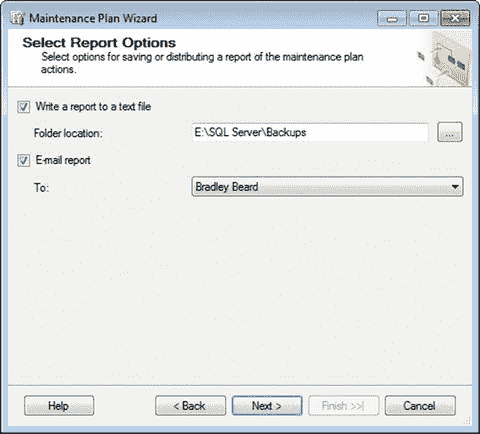
图 6-16. 选择报告选项

点击此处的 `下一步`。你将看到 `摘要` 页面。再次强调，这是你需要绝对确保设置正确的地方。图 6-17 显示了我的 `摘要` 页面的样子。

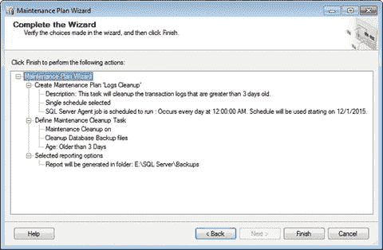
图 6-17. 完成向导

准备就绪后点击 `完成`。图 6-18 显示了此时你应该预期看到的内容。

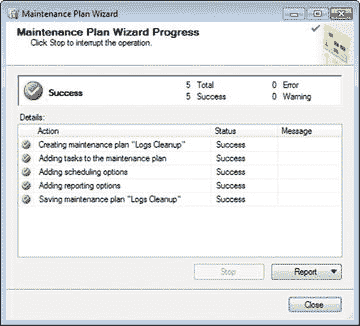
图 6-18. 维护计划向导进度

当你只看到绿色复选框时，你就已经成功配置了维护计划的这一部分。到目前为止，干得漂亮！


请确保通过双击`SQL Server Agent`下`Jobs`文件夹中的作业来更新作业。我已将我自己的作业名称改为`trn Files`，但你可以根据需要选择其他名称。更改后，你的界面应类似于图 6-19。

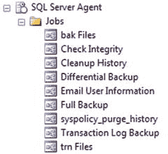

图 6-19.

`SQL Server Agent Jobs`

还记得我们在维护计划中创建了两个部分来删除文件吗？第一部分是`Backup Files`，用于删除`.bak`文件。第二部分是`Logs Cleanup`，用于删除`.trn`文件。接下来的部分是清理备份操作留下的文本文件。

### 文本文件清理

当`SQL Server`使用`SQL Server Agent`运行维护操作时，它会创建文本报告，用于故障排除或一般性查阅。我们将设置的`Text Files Cleanup`操作，将允许我们在一段时间后清理这些文件。这是可以的，因为一个维护良好的数据库会在出现故障时向数据库管理员发出警报，这正是保留任务生成的维护文本文件的唯一真正目的。

重新开始，只需右键单击`Management`下的`Maintenance Plans`文件夹，然后选择`Maintenance Plan Wizard`。在`Name`框中输入`Text Files Cleanup`，在`Description`框中输入简短描述，然后单击`Change…`按钮设置计划。将`Occurs`下拉菜单更改为`Daily`，其余保持不变，然后单击`OK`。你的界面应类似于图 6-20。

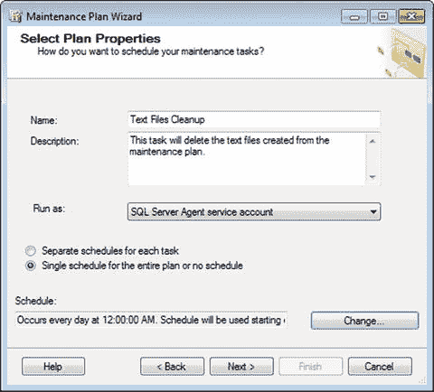

图 6-20.

`选择计划属性`

在此屏幕单击`Next`。你可以从界面中选择`Maintenance Cleanup Task`，如图 6-21 所示。

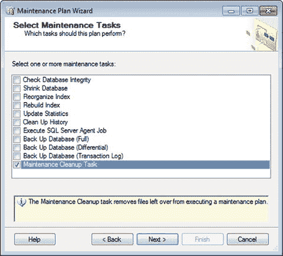

图 6-21.

`选择维护任务`

在此处选择`Maintenance Cleanup Task`，然后单击`Next`。你将看到如图 6-22 所示的界面。

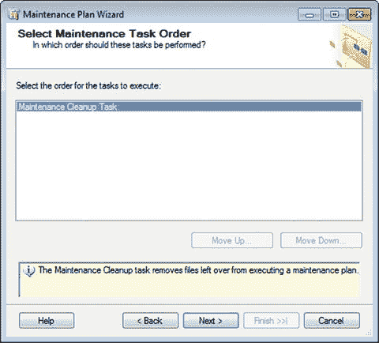

图 6-22.

`选择维护任务顺序`

因为我们只有一个任务，所以在此处单击`Next`。

之前，我们选择了`Backup files`。这次，我们将选择`Maintenance Plan text reports`。这是因为，如果你还记得，我们需要设置不同的任务来删除不同类型的文件。

我们将把此项指向我们的`Backups`目录，因为这就是我们保存维护计划文本报告的地方。这些报告存储为`.txt`文件（在 2 章中为报告选项定义）。完成时，你的完整界面应如图 6-23 所示。

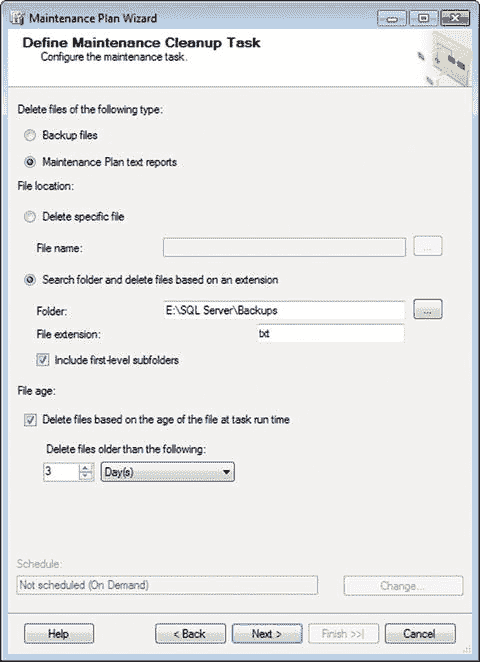

图 6-23.

`定义维护清理任务`

浏览选项，你可以看到文件夹定义为我们的`Backups`位置，并指定了`.txt`文件扩展名。请记住，这是`SQL Server`生成的文本报告的默认扩展名。另请注意，我将时间选择从四周改为三天。这意味着什么？这意味着我希望在运行任务时，删除`E:\SQL Server\Backups`目录及其一级子目录中所有超过三天的`.txt`文件。

当你准备好后，单击`Next`，你将看到如图 6-24 所示的`选择报告选项`界面。像之前一样修改它（将详细日志写入我们的`Backups`目录）并通过电子邮件提醒我们。

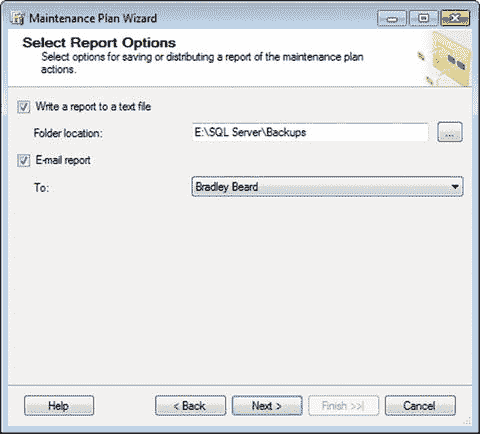

图 6-24.

`选择报告选项`

看到此界面后，单击`Next`并查看摘要。你应该看到如图 6-25 所示的内容。

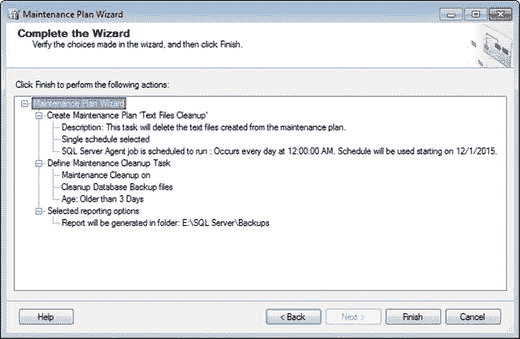

图 6-25.

`完成向导`

仔细查看这些选项。一切看起来都很好，所以再次单击`Finish`。你（希望）将看到如图 6-26 所示的内容。

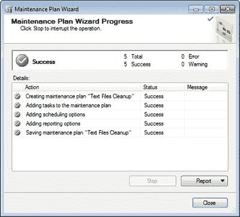

图 6-26.

`维护计划向导进度`

这真是一件赏心悦目的事。

再次，请确保如前所述更改作业名称——并顺便更新作业。我将其命名为`txt Files`。你可以根据自己的喜好命名，只要易于识别即可。完成后，你应该看到如图 6-27 所示的`作业`布局。

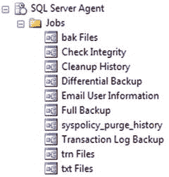

图 6-27.

`SQL Server Agent Jobs`

你的`Maintenance Plans`文件夹应如图 6-28 所示。

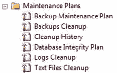

图 6-28.

`维护计划`

到目前为止，一切看起来都很不错。注意我们是如何将每个任务分离到其自己的维护计划或任务中的。这在后面的章节中将非常重要。

让我们回顾一下本章所做的事情，因为这一章可能是真正会搞砸你数据库的一章。

## 总结

我们了解到有两种不同类型的维护清理任务可以运行：一种用于清理恢复数据到数据库所必需的文件（`.bak`和`.trn`文件），另一种用于维护计划文本报告（`.txt`文件）。我们还创建了三个维护计划：`Backups Cleanup`（删除`.bak`文件）、`Logs Cleanup`（删除`.trn`文件）和`Text Files Cleanup`（删除`.txt`文件）。这三个维护计划将分别运行，并删除各个计划指定的文件。

如果本章有任何部分不清楚，我强烈建议你返回并重新操作练习，以便真正掌握正在发生的事情及其原因。我想再次花点时间强调，确切理解正在备份和删除的内容以及为何这样做，是*至关重要*的。一个持续失败的备份计划毫无意义，所以如果你的计划出现故障，请进行故障排除，直到找到问题所在。努力尽快解决它们，因为如果你无法恢复你受托保护的数据，你基本上就是多余的。这个概念对于任何数据库管理员的成功都*绝对至关重要*。

### 提示

理论很重要，但除非付诸实践，否则几乎毫无用处。


