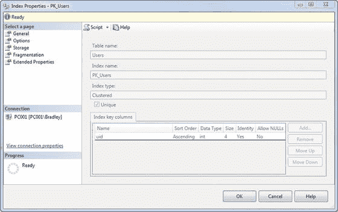
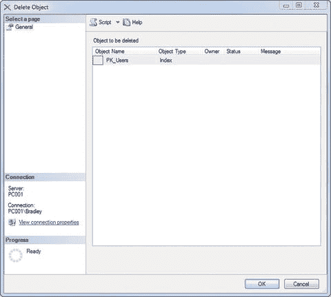
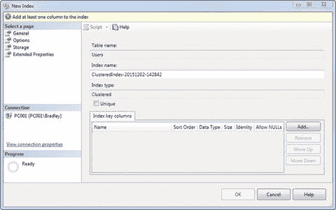
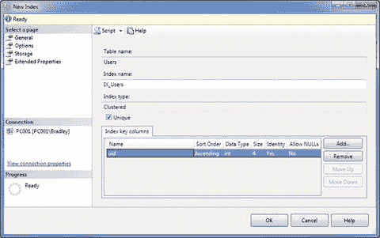
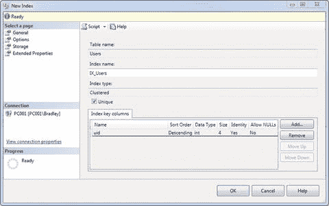
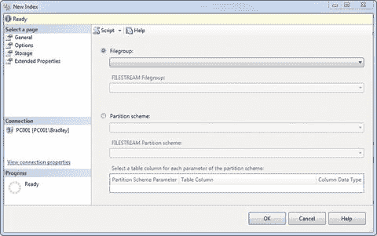

# 7. 重建索引

什么是索引？为什么需要重建索引？索引是 `SQL Server` 用来从表中检索行的机制。一个明显的类比是书的索引；如果你想了解某个主题，翻到书后检查索引，它会准确地告诉你去哪里找所需的内容。

你可以有没有定义索引的表。在这种情况下，它只是一堆数据，因此被称为 *堆表*。以堆的形式存储数据效率不高，因为为了返回查询请求的数据，必须扫描整个表。相反，当你使用索引时，数据的检索会更快、更高效。

如果你的数据库很小，是否值得在表上创建索引？简而言之，是的。总是值得的，因为数据库往往会增长。如果在开始时完成了管理工作，以后就不需要再做了。而且，如果你早期定义了索引，然后设置一个维护任务来自动重建这些索引，你就抢占了先机，因为随着时间的推移，索引会开始“漂移”。它们可能引用过时的数据，或者页面的大部分可能缺失。重建索引可以确保这些情况不会发生，因为它们都是有组织的（如果你问我妻子，这可不是我最大的优点）。

在本章的第一部分，我将简要介绍 `SQL Server` 中的索引。我说“简要”，是因为本书没有足够的空间解释每一个概念，所以我将假设你至少听说过索引。然后在本章的第二部分，我们将实际介绍用于维护索引的维护任务。

### 索引详解

也许你并不真正了解或理解索引是什么或它们如何工作。信不信由你，这没关系！虽然不是长久之计，但第一步是认识到问题，对吧？很可能，如果你不太熟悉索引，那么你要么是一个新的数据库管理员，要么是一个经验丰富的 `DBA`，只是没有时间或意愿深入探究索引的工作原理。

我能想到描述索引的最佳方式是，它们是 `SQL Server` 通过假设数据访问的某些方式来快速访问表数据的方法。你可以让一个表上没有任何索引；这完全是可以接受的。虽然效率不高，但是可以接受。想象一下，如果你想在这本书中搜索某个单词或短语，比如 *interface* 这个单独的词。我说过很多次这个词，对吧？你能想象为了找到“interface”一词出现的所有位置而翻阅这本书的每一页吗？那将花费很长时间！想象一下，如果你有一个索引，它能准确地告诉你这些出现的位置在哪里。这就是索引为你的数据库所做的事情。

从这一点来看，每个读者都有两件事。你们每个人都会落入以下两类之一：

*   你的表上已经有索引。你也需要管理它们，无论是自愿还是不情愿。
*   你目前没有索引，但认识到需要它们。

就是这样。要么你已经有了索引并想管理它们，要么你没有索引并想实现它们。在本节的剩余部分，我将基于你目前没有索引的假设进行讲解。如果你对索引及其工作原理有扎实的理解，请跳过这部分。

### 初识索引

让我们从头开始。你如何知道是否已经有索引？很简单。转到 `SQL Server Management Studio`，展开你的数据库。然后展开一个需要索引的表。看——有一个名为 `Indexes` 的文件夹。点击那里的小加号。如果它展开了，说明有索引，并且会向你显示类型。如果没有展开，则该表上没有索引。

此时，你可能会惊讶地发现你一直有一个索引。如果你继承了这个数据库，那么它很可能是由前一个 `DBA` 定义的自定义索引。更可能的是，它是一个主键。

如何判断它是否是主键索引？只需右键单击表名并选择 `Design`，然后在列名旁边查找小钥匙图标。那就是你的主键。

如果你有一个主键索引，那么让我们看看从这里你可以对它做什么。右键单击索引并选择 `Properties`。你应该会看到类似于图 7-1 的内容。

图 7-1. 索引属性

看！你在这个表上有一个聚集索引。看看上面写着“索引键列”的部分。它说 `UID` 作为整数按升序排序，它是一个标识字段，并且不允许 `NULL` 值。这告诉我们，有了这个索引，数据将按 `UID` 字段升序返回——从最小值到最大值。

假设你希望值按降序返回。你能做什么？你无法从这个屏幕编辑索引。你总是可以添加另一个索引，但你不能添加另一个聚集索引；它必须是非聚集索引（关于它们之间的区别稍后详述），所以那没有意义。最后一个选择是删除这个索引并创建一个新的。

如果 `索引属性` 屏幕仍然打开，请关闭它。在 `Indexes` 文件夹中右键单击索引并选择 `Delete`。你将看到一个类似于图 7-2 的屏幕。当它出现时，只需单击 `OK`。

图 7-2. 删除对象

它现在已被删除。

再次右键单击 `Indexes` 文件夹并选择 `New Index` → `Clustered Index`。你将得到一个如图 7-3 所示的界面。

图 7-3. 新建索引

这让你可以设置索引。当你选择主键时，这一切都是为你完成的。这种方式让你有稍微多一点的控制权，正如你将看到的。

你可以看到表名是自动为你添加的，但随后定义了一个又大又难看的 `Index name`。直接把它改成 `IX_Users`。同时勾选 `Unique` 复选框。接下来，单击右侧的 `Add` 按钮。你会看到表中列的列表，所以选择你想要索引的列，然后单击 `OK`。然后你应该会看到如图 7-4 所示的屏幕。

图 7-4. 新建索引（更新后）

我之前说过，我们希望显示按降序排序的值。这就是我们定义该值的地方。在图 7-4 所示的 `Sort Order` 列下拉菜单中选择 `Descending`。你现在应该看到如图 7-5 所示的内容。

图 7-5. 新建索引（更新后）

我们唯一要做的另一件事是定义索引应该存放在哪里，所以单击左侧的 `Storage` 选项。你现在应该看到如图 7-6 所示的内容。

图 7-6. 新建索引，存储选项

