# 理解 SQL Server 索引：创建与维护

由于我们必须为索引指定一个存放位置，请下拉`文件组`菜单并选择`PRIMARY`。这意味着我们将索引定义为在`PRIMARY`文件组上执行。定义索引而不指定要索引的内容是没有意义的。换句话说，仅仅定义表是不够的；我们必须实际指定文件组。为什么？因为你可以为多个数据库设置多个文件组。你也可以在此处选择分区方案，但我不想深入探讨这一点，而且老实说，我以前从未需要处理过这个选项。对于 99%的安装来说，反正你也不会使用这个选项。

一旦你选择了`PRIMARY`，点击确定，你的索引就创建好了。现在，针对你刚刚创建索引的表编写一个简单的查询。类似下面这样的简单语句应该就足够了。

```sql
SELECT uid FROM [dbo].[Users];
```

你注意到返回的`UID`值有什么特点了吗？它们按降序排列，没错。重要的是要注意，从现在开始，默认情况下针对此表的任何查询都将以`UID`值的降序返回结果。即使删除了该索引，在收到新索引的另行指示之前，它仍会以降序返回值。有趣吧！

那么，当你想再次返回升序排列的值时会发生什么？我将此留给读者作为练习，但这需要删除当前索引并建立另一个索引。回顾前面的步骤来着手完成此任务。你很可能希望这些数据按升序排列。

这是索引一个很好的起点。你可以看到它能为你和你的数据做什么，即为你组织数据，并且比使用堆更快地返回数据。当处理更大的表和连接时，你真的可以看到性能的提升。

那么，索引有不同的类型吗？当然有。到目前为止，我们只处理了聚集索引。还有一种称为非聚集索引的类型你也可以使用。它只是返回查询数据的一种略微不同的快速方式。我不会在本书中深入探讨这些索引的定义。如果你对此仍不清楚索引的目的，请继续阅读。

## B-树结构

如果不首先引入`B-Tree`（B-树）结构的概念，就无法真正讨论聚集和非聚集索引，该结构用于尽可能迅速地返回特定的行数据。

简而言之，`B-Tree`帮助索引将数据组织起来以供返回。参考图 7-7，它展示了该结构不同节点之间的关系。（如果你以前研究过索引，我肯定你见过很多次类似的东西。）从图中可以看出，页面构成了传统的`B-Tree`结构。顶级，1-200，存储了表的所有 200 行。下一级存储了原始值的一个子集，每一更低的层级存储进一步的子集，直到你实际到达物理数据行。

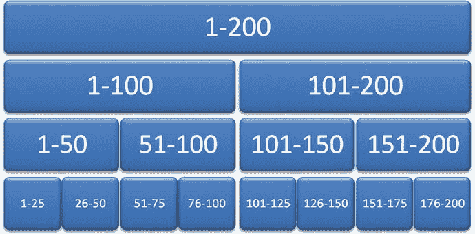

图 7-7. B-树结构示例

`B-Tree`结构是物理上理解数据库如何返回所需数据的绝佳方式。重要的是要注意，每个页面（或如图 7-7 所示的小方框）都引用更低级的页面，直到你到达数据。这些页面会随着时间的推移而损坏，因此重组和重建索引是数据库正确维护的理想做法。

你可以将`B-Tree`结构用于聚集索引和非聚集索引；两种索引的工作方式相同。然而，还有另外一件重要的事情要记住：一个表上不能有超过一个聚集索引，但一个表上可以有（几乎）任意多的非聚集索引。

> **提示**
>
> 请记住，虽然你可以创建多个索引，但**是否应该**创建才是最终的问题。

表上索引过多会导致性能下降，这是“好事过头反成坏事”的典型例子。是的，只要适度使用，索引肯定能提升你的查询性能。换句话说，不要仅仅为了索引而索引。

我本可以再写十页左右关于索引的不同类型和用法，但这确实有点超出了本书的范围。如果你此时对索引仍不清楚，你可能应该寻找一些关于该主题的补充阅读材料。对于一名优秀的 DBA 来说，透彻理解索引这个主题至关重要。

## 重建与重组

本章中，我们重点讨论重建索引。你可能已经注意到，有一个与重建非常相似的任务叫做`重组索引`。重建和重组之间的主要区别非常简单：`重建索引`任务在执行时会删除并重新创建索引，而`重组索引`任务只是重新整理索引以使其组织得更好。它们都会将未使用的空间返回给操作系统，它们都会压缩到最优大小，并且如果选择了相应选项，它们都会在操作期间保持索引可用。

由于它们非常相似，`重建索引`和`重组索引`几乎可以同等对待。不过，应该更多地考虑`重建`任务，因为正如我前面提到的，索引会被删除（销毁）并重新创建。这可能是最优的，因为这意味着索引没有机会变得碎片化或产生太多“漂移”，而仅运行了`重组`任务的索引则可能存在这种情况。`重组`任务本质上与数据库引擎执行`insert`、`update`和`delete`语句时的操作相同。从本质上讲，`重组`任务是此相同功能上的一个额外层。虽然它并非没有意义，但在我看来，它的权重低于`重建`任务。


### 设置维护计划

又来了！在 `SSMS` 的 `Management` 文件夹下右键单击 `Maintenance Plans`，然后选择 `Maintenance Plan Wizard`。你将看到如图 7-8 所示的界面。

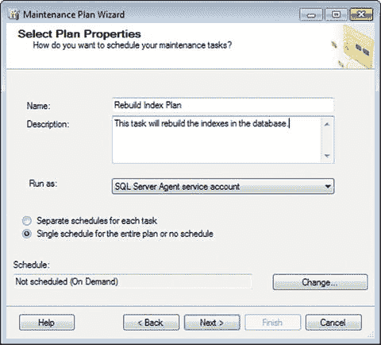
图 7-8.

选择 `Plan Properties`。

将默认值更改为图 7-8 所示的内容。单击 `Change…` 按钮以设置计划，如图 7-9 所示。

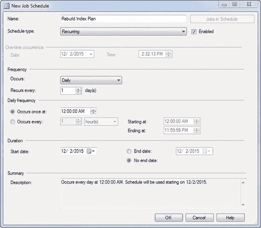
图 7-9.

新建作业计划。

你只希望它每天运行一次，因此将 `Occurs` 下拉菜单更改为 `Daily`，然后单击 `OK`。你的计划现在已设置为每天 `12:00AM` 运行。单击 `Next` 继续。

你现在会看到如图 7-10 所示的屏幕，你可以在其中选择要执行的任务。

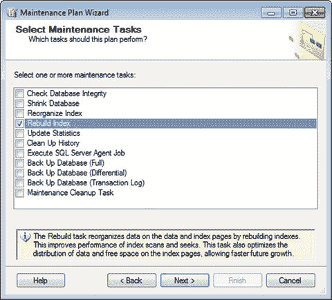
图 7-10.

选择维护任务。

勾选 `Rebuild Index` 复选框，并注意给出的定义：“重新生成任务通过重新生成索引来重组数据页和索引页上的数据。这提高了索引扫描和查找的性能。此任务还优化了索引页上数据和可用空间的分布，允许未来更快地增长。”

这与我们本章前面讨论的内容有何关联？那些索引最终会发生偏移；此任务通过从头重新生成索引使其恢复正常。这需要时间吗？是的。而且它也会消耗资源，因此这是一个需要密切关注的重要任务。幸运的是，我们可以做到这一点。

准备好继续后，单击 `Next`。你现在将看到如图 7-11 所示的屏幕。

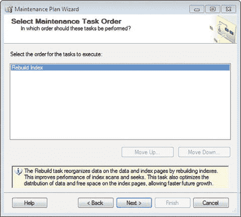
图 7-11.

选择维护任务顺序。

由于我们这里只有一个任务，所以不用担心；单击 `Next`。

然后你会看到定义任务的默认屏幕。它应该如图 7-12 所示。

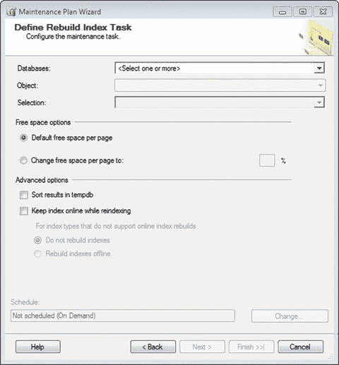
图 7-12.

定义重新生成索引任务。

现在这应该看起来很熟悉了。你首先需要从下拉菜单中选择你的数据库。然后你会看到 `Object` 选项，其值包括 `Tables`、`Views` 和 `Tables and Views`。选择你希望对其设置任务的对象，或者保留默认选中的 `Tables and Views`。这绝对是所有可以建立索引的内容：表和视图。

*   如果选择 `Tables`，则必须手动定义要重新生成索引的表。
*   如果选择 `Views`，则必须手动定义要重新生成索引的视图。
*   如果选择 `Tables and Views`，则所有索引都会自动重新生成。

在“可用空间选项”区域，保持“每页的默认可用空间”。这对数据库是最优的。

在 `Advanced options` 下，有两个选项：“在 tempdb 中排序结果”和“重新索引时保持索引联机”。这到底是什么……？

“在 tempdb 中排序结果”为你提供了一个选项，可以选择在 `tempdb` 中构建索引时保留它们，然后将完成并重新生成的索引输出到指定的文件组。除了直接在文件组中排序和存储它们之外，这并没有真正给你带来额外的好处。选择此选项会将排序结果存储在 `tempdb` 中，然后再存储到文件组。不选择它则仅针对文件组运行排序。差不多就是这样。

“重新索引时保持索引联机”选项从字面上看就很明显。你希望在重新生成索引时保持其联机吗？你很可能希望启用此功能；否则，索引在重新生成时将不可用。同时选择 `Rebuild indexes offline` 单选按钮，以防存在无法在联机时重新生成的索引。

完成时，你的屏幕应如图 7-13 所示。

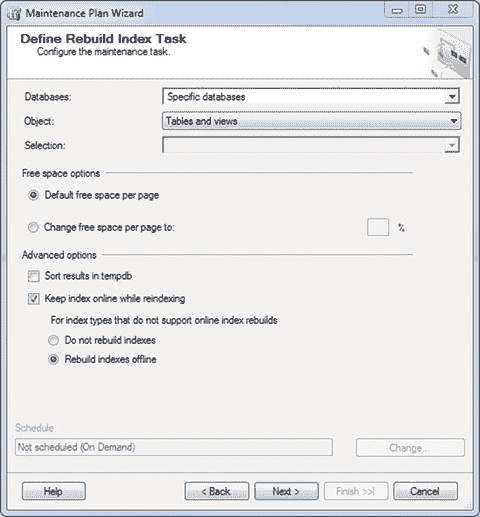
图 7-13.

定义重新生成索引任务（已完成）。

在此处单击 `Next`。现在我们来定义报告选项。继续设置你的文本文件报告位置以及我们之前已设置的操作员。你的屏幕现在应如图 7-14 所示。

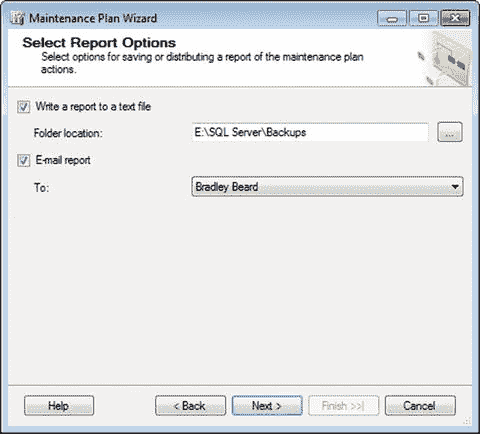
图 7-14.

选择报告选项。

为什么我选择 `E:\SQL Server\Backups` 作为文件夹位置？还记得第 5 章我们定义文本文件的维护清理任务时吗？我们已将此文件夹位置设置为我们想要清理的位置，因为我们已经在此区域写入文件。因此，如果我们继续在此区域写入，维护清理任务将清理我们留下的任何杂乱，这是理想的情况。

准备好后单击 `Next`。你将看到摘要屏幕，如图 7-15 所示。

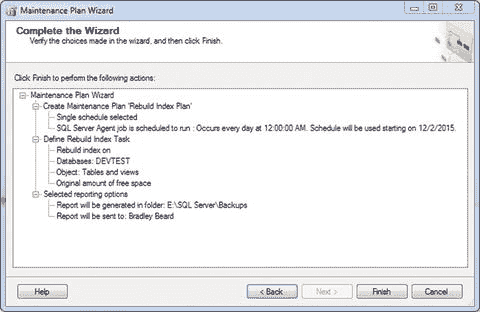
图 7-15.

选择报告选项。

祈祷好运。点击 `Finish`。应该会出现图 7-16，并且带有所有那些美妙的小绿色复选框。

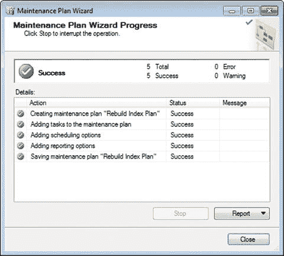
图 7-16.

维护计划向导进度。

完美。

在我们继续之前，请确保如前所述更新作业。我将我的命名为 `Rebuild Index`。你的 `Jobs` 文件夹现在应如图 7-17 所示。

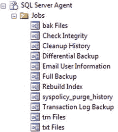
图 7-17.

SQL Server Agent 作业。

你的 `Maintenance Plans` 现在应如图 7-18 所示。

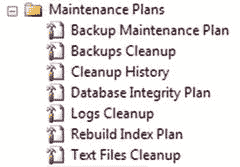
图 7-18.

维护计划。

## 总结

让我们快速回顾一下本章内容。

我们学习了如何在表上建立索引，并通过展示如何根据索引值按降序返回数据来证明索引的成功建立。

我们简要学习了索引和 B 树结构，现在我们理解了索引与数据检索相关的重要性。

顺便提一下，还有一点要记住：如果你有一个高容量的数据库，那么你可能应该至少每周重新生成一次索引。我知道我们在任务中将其设置为每天一次，只要符合你的需求，那也没问题。我在前面的章节中提到过，“高容量”是一个相对术语，我理解它对所有用户可能意义不同。为了消除这种模糊性，我只想说，对于本书大约 99% 的读者来说，每周一次就足够了。当然，你可以随心所欲地频繁执行此操作，但如果你确实有一个高容量的数据库，重新生成索引过于频繁会导致性能下降。

对于索引来说，这是一个相当坚实的开端。如果你仍然不清楚，我强烈推荐阅读 Mike McQuillan 的书 *Introducing SQL Server* (Apress, 2015) 作为此主题的补充阅读材料。

## 8. 重新组织索引

基于我们在第 7 章刚刚完成的操作，我们现在将重新组织我们的索引。既然它们刚刚被重新生成过，这有必要吗？让我们来看看找出答案。


## 重组与重建

想象一下酒店。它是一栋建好的漂亮建筑，矗立在那里。它有结构和多层楼，每层都有很多房间。你知道，你可以先进入正确的酒店，然后乘电梯到目标房间所在的楼层，最后找到具体的房间，就能直接到达你要去的房间。索引的工作原理正是如此。

考虑到酒店这个场景，是拆毁并重建整个酒店更有意义，还是仅仅重新规划找到目标房间的路径更合理？最终，这取决于你的解读和需求。可能没必要重建，但至少，重新规划是绝对必要的。有时候，你只需要更新目标房间的地图，而无需摧毁整个酒店。

**提示**

重组索引会保留现有索引的原样。重建索引则会每次都删除并重建索引。

显然，拆毁重建一个酒店与对索引做同样的事，在所需时间和精力上是有差异的。然而，其原理是相同的，而这正是需要理解的要点。换句话说，并非仅仅因为你能做某事，就意味着你总应该去做。

再次强调，根据你的具体场景，执行这两个选项中的任何一个，甚至同时执行两者，都可能是有利的。实际上，没有必要同时执行两者，因为它们都能达到清理索引的相同目标。

关于索引另一个有趣的点是，每当执行 `update`、`insert` 或 `delete` 查询时，索引都会自动维护。这会导致数据本身的修改，而这正是造成数据碎片化的原因。过度的碎片化会导致查询时间变长，因为数据在磁盘上是物理分离的，并不在连续的页面中。`重组` 和 `重建` 操作会将这些页面重新排序，从而使查询运行得更快，你的数据库表现更佳。

### 设置维护计划

创建维护计划的过程现在应该非常熟悉了。在 `SSMS` 中，右键单击 `Management` 下的 `Maintenance Plan` 选项，然后选择 `Maintenance Plan Wizard`。将你的界面调整为与图 `8-1` 所示一致。

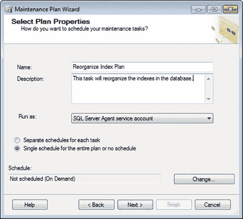

图 `8-1`。

选择 `Plan Properties`。

单击 `Change…` 按钮，像之前的章节一样，将计划设置为 `Daily`，然后单击 `OK`。如果可能的话，你确实不希望在使用时段重组索引，尽管这不会造成什么损害。准备好后，单击 `Next`。

现在你会看到可以在此选择任务的界面，因此请选择 `Reorganize Index`，如图 `8-2` 所示。

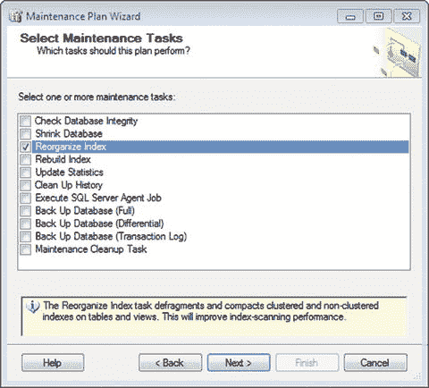

图 `8-2`。

选择 `Maintenance Tasks`。

注意 Microsoft 对 `Reorganize Index` 的定义：“`Reorganize Index` 任务对表和视图上的聚集索引和非聚集索引进行碎片整理和压缩。这将提高索引扫描性能。”

回想一下 `Rebuild Index` 的定义：“`Rebuild` 任务通过重建索引来重新组织数据和索引页上的数据。这提高了索引扫描和查找的性能。此任务还优化了索引页上数据和可用空间的分布，允许未来更快地增长。”

它们听起来有点相似，对吧？那么，为什么要有两个功能基本相同的不同选项呢？因为从数据库管理员（DBA）的角度来看，能够对一个带有索引的中小表执行一个任务并说“去重建那个索引”，比对一个拥有数十亿行的巨大表做同样的事更有意义。对于这样的庞大表，你可能只想重组这个索引，因为重建索引肯定需要运行一段时间。重建那个单独的庞大索引会花费一点时间，至少很可能是几秒钟，但请记住，在计算机时间里，这简直是永恒。

在“选择维护任务”屏幕（如图 `8-2` 所示）单击 `Next`，然后在“选择维护任务顺序”屏幕（如图 `8-3` 所示）再次单击 `Next`。

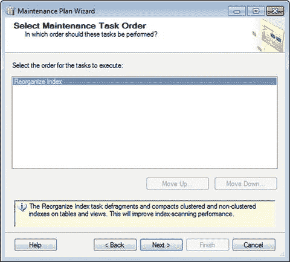

图 `8-3`。

选择 `Maintenance Task Order`。

然后你需要在“定义重组索引任务”屏幕定义任务。与第 `6` 章完全一样，选择你的数据库，并将 `Object` 保持设置为“表和视图”。其余保持原样。你应该看到如图 `8-4` 所示的内容。

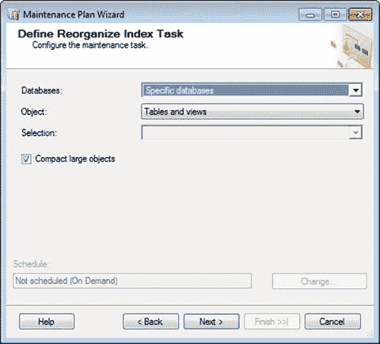

图 `8-4`。

定义 `Reorganize Index Task`。

在这里单击 `Next`，然后你可以开始设置报告选项。同样，与第 `7` 章完全一样，将文件夹位置更改为你写入日志的位置，并启用操作员，如图 `8-5` 所示。

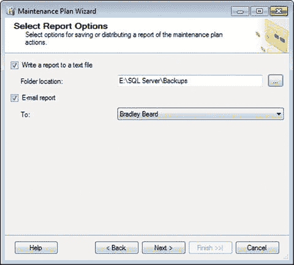

图 `8-5`。

选择 `Report Options`。

在此屏幕单击 `Next` 进入摘要屏幕，如图 `8-6` 所示。

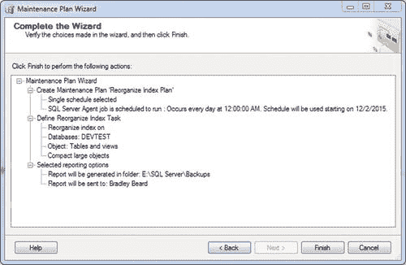

图 `8-6`。

完成向导。

这向我们展示了正在发生的事情的细目。一切都与第 `7` 章非常相似，所以单击 `Finish` 并等待那些绿色的复选框，如图 `8-7` 所示。

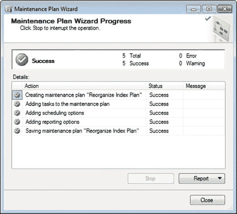

图 `8-7`。

维护计划向导进度。

干得漂亮！

别忘了像之前的章节那样更新作业。为此，双击名为 `Reorganize Index Plan.Subplan_1` 的作业，将其重命名为 `Reorganize Index`，然后进行其他必要的更改。你的 `Jobs` 文件夹现在应该如图 `8-8` 所示。

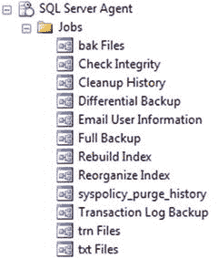

图 `8-8`。

SQL Server 代理作业。

你的 `Maintenance Plans` 应该如图 `8-9` 所示。

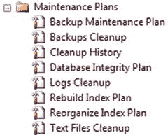

图 `8-9`。

维护计划。

## 总结

如果你已经读到这里，为你取得的进步表示祝贺！请继续阅读，了解其他酷炫的方法，我们可以用它们来操作数据库，以期实现提高数据完整性的终极目标。

