# 9. 收缩数据库和文件

是否曾感觉事情变得太大而难以掌控？是否想知道为什么你的数据库，看起来并不大，却突然比你记忆中大了很多？造成这种情况的原因有很多，更不用说里面只是有比你意识到的更多的数据而已。你需要在维护计划中添加一个收缩任务吗？让我们来看看并找出答案。

## 磁盘使用报告

右键单击数据库名称并选择 **报告** ➤ **标准报告** ➤ **磁盘使用情况**。它需要运行片刻，然后你会得到一个类似图 9-1 中展示的酷炫小图表。

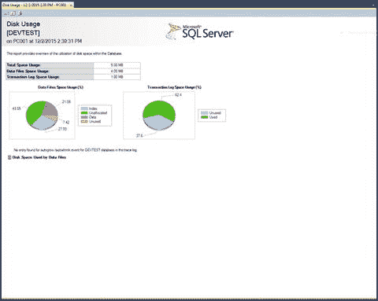
**图 9-1. 磁盘使用情况报告**

我首先注意到的是饼图。通过它们，你可以看到它们分别代表了数据文件和事务日志的空间使用百分比。正如我之前所说，我的数据库很小，只有一个表，所以这些结果可能与你的非常不同。不过，这些信息以及它能告诉你的东西仍然很重要。请仔细阅读这份报告。

> **提示**
> 信不信由你，你确实希望数据库中保留一点未使用的空间。

为什么你希望数据库中有未使用空间？这说不通！数据库应该尽可能精简，对吧？从某种意义上说，这是正确的。但数据库的主要目的是什么？当然是为数据提供一个有序的存放地。当你需要向一个极其紧凑的数据库添加更多数据时会发生什么？它必须从可用磁盘空间中分配更多空间。

### 磁盘空间考虑因素

创建数据库时，有一个设置可以选择是以数据库大小的因子添加存储空间，还是以百分比添加。当需要空间以保持数据库功能时，会调用此设置。右键单击数据库名称并选择 **属性**，然后在左侧选择 **文件** 选项，将显示 **自动增长/最大大小** 选项的设置。我的 `DEVTEST` 数据库的设置如图 9-2 所示。

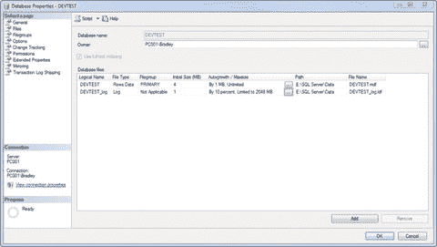
**图 9-2. 数据库属性**

请注意，我为 **PRIMARY** 文件组和事务日志都选择了 4MB 的初始大小。这是因为我不想把它设得太小，导致数据库几乎立即就需要申请更多空间。换句话说，我给它留了一些活动的余地。我的 **PRIMARY** 文件组将按需增长 1MB，增长无上限。由于我们设定了无上限增长，因此需要对此数据库进行仔细监控。事务日志将增长 5%，直到达到 2GB，然后将创建一个新的事务日志，这些日志将协同工作，直到日志被截断。另外请注意，我的 **路径和文件名** 部分设置为我实际希望存放数据的位置，而不是埋没在默认的 SQL 安装文件夹中。

请根据预期数据库用途的数据插入和检索速率，仔细考虑这些选项。

为了缓解数据库大小带来的问题，可以使用 **收缩数据库** 选项。它基本上是对数据库说：“好吧，事情是这样的。白天你可以想要多少磁盘空间就用多少，但到了晚上，你得节食了。我会收回你未使用的任何空间，并将其返回给文件系统。如果你以后需要它，你知道去申请，但你不能一直占着它。” 换句话说，数据库维护计划需要在夜间或系统上用户尽可能少的时候运行。当它运行时，它会获取先前由 SQL Server 占用的未使用空间，并将其返回给文件系统。如果数据库之后需要它，它会向文件系统申请该块空间，如果有可用空间，则取用。然后，在下次维护计划设置运行时重复此过程。

因此，在设置维护计划的 **收缩数据库** 选项时，有一个选项可以设置在数据库中保留的未使用空间量。重要的是要记住，此设置与确定实际授予文件系统上数据库多少空间的设置协同工作。

以一个 800GB 的数据库为例，当数据库被收缩并选择了 50% 的数据库大小时，我们的 800GB 数据库会保留 400GB，即 50% 的空间。所以，这个可能有 70GB 空闲空间的 800GB 数据库，结果变成了 730GB 的主数据库大小和 365GB 的备用空间。明白这是怎么运作的了吗？如果没有适当的管理和监督，这将迅速耗尽磁盘空间。这就是我们作为数据库管理员介入的地方。

### 事务日志

需要考虑的一个重要部分是事务日志如何作为数据库的一部分进行交互，特别是在数据库收缩如何进行方面。事务日志的目的是，嗯，记录数据库事务。它字面意义上记录了操作数据库的 **DML** 语句（`SELECT`、`UPDATE`、`INSERT`、`DELETE`）。如果你想象这将变得非常大，那么你绝对正确。在一个有很多事务的数据库中，这个日志可以很快变得巨大。收缩数据库时，你可以随意收缩它，但你永远无法触及事务日志的大小，除非你专门收缩事务日志。请记住，它是一个完全独立的实体，有单独的文件标识，需要像主数据文件一样给予同样的关注。尽管如此，它仍然是数据库的一部分，除非明确告知其收缩，否则无法被收缩。否则，你的日志要么会一直增长直到磁盘空间用完，要么达到其限制并导致错误。无论哪种情况，这都不是好事！

要缓解此问题，只需设置另一个数据库备份任务来收缩和截断事务日志。让我们看看如何执行此操作。

### 设置维护计划

说实话，这个计划算是比较容易设置的。它几乎与第 7 章和第 8 章中的计划完全一样，所以到这里，大部分内容应该开始看起来很熟悉了。

在 SSMS 的 `管理` 文件夹中，右键单击 `维护计划`，然后选择 `维护计划向导`。初始界面需要更改为如图 9-3 所示的界面。

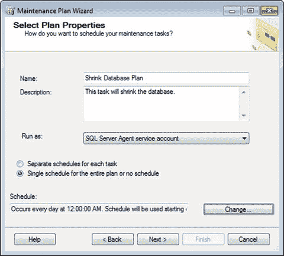

图 9-3. 选择计划属性

通过单击 `更改…` 按钮来修改计划，并将 `发生` 选项设置为 `每天`，使其每天运行一次。收缩数据库需要一些时间，所以我建议不要设置得比这更频繁。单击 `下一步` 继续。你将看到选择任务的页面，因此选择 `收缩数据库`，如图 9-4 所示。

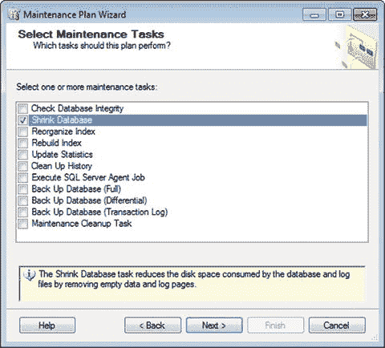

图 9-4. 选择维护任务

这里的定义也很有趣。它会移除空的数据和日志页。回想一下，这对于第 6 章和第 7 章讨论的索引意味着什么。重组和重建索引可能会使这个任务更有意义，你不觉得吗？如果维护计划不需要运行并查找空页，效率肯定会更高。

**注意：** `收缩数据库` 任务会收缩所选数据库的事务日志和数据文件。首先收缩事务日志，之后再收缩文件组。

单击 `下一步` 继续。你将进入 `选择维护任务顺序` 屏幕，如图 9-5 所示，由于我们只执行这一个任务，请在此处单击 `下一步`。

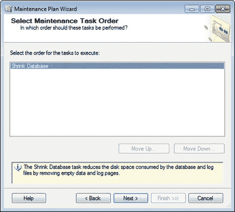

图 9-5. 选择维护任务顺序

看来我们总是绕过这个屏幕，但我们稍后肯定会用到任务排序的概念，你会看到它在何时变得相当重要。不过现在，只需在此屏幕单击 `下一步`，你将看到如图 9-6 所示的 `定义收缩数据库任务` 界面。

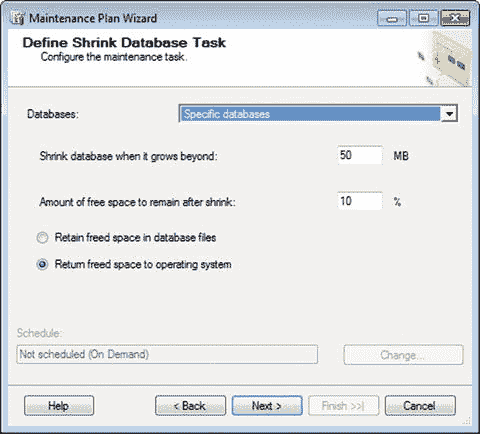

图 9-6. 定义收缩数据库任务

请从下拉列表中选择你的数据库，但保留其余选项不变。

这意味着你希望在数据库增长超过 50MB 时才进行收缩。否则，不执行任何操作。因此，即使维护任务运行，如果数据库大小为 49.9MB，它也不会执行。很有意思，对吧？所以请确保将其更改为你能接受的设置。

收缩后保留的可用空间量很重要。你不想将其设置为 0。那将很愚蠢，因为你的数据库首先要做的就是向操作系统请求空间。你可以将其保留为 10%，具体数值取决于数据库的大小，但通常不会太多。

单击 `下一步`，你将看到报告选项屏幕，和之前一样，将其设置为如图 9-7 所示的配置。

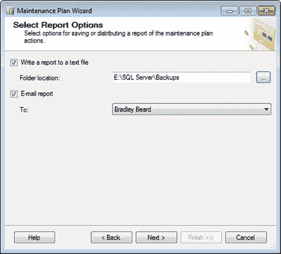

图 9-7. 选择报告选项

同样，文件夹位置设置为我们写入维护文本文件的地方，以便维护清理任务稍后可以为我们处理它们。

单击 `下一步` 将显示摘要，如图 9-8 所示。

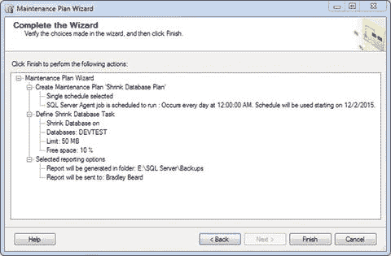

图 9-8. 完成向导

因此，我们定义了 `收缩数据库` 任务，使其在我们的 `DEVTEST` 数据库增长超过 50MB 时，于每晚午夜运行。我们希望保留 10%的可用空间，并将结果写入 `E:\SQL Server\Backups` 中的一个文件。看起来很不错！单击 `完成`，然后期待最好的结果，而巧的是，最好的结果如图 9-9 所示。

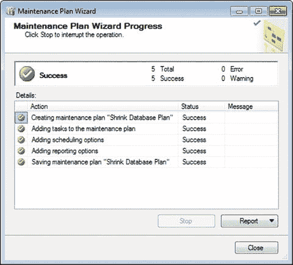

图 9-9. 维护计划向导进度

看到那些绿色的复选框总是让人高兴！

别忘了像前面章节那样更新作业。我将作业命名为 `收缩数据库`，如图 9-10 所示。

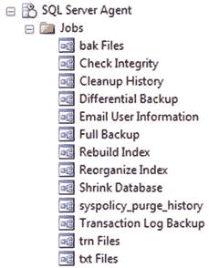

图 9-10. SQL Server 代理作业

你的 `维护计划` 文件夹现在应该看起来像图 9-11。

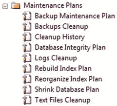

图 9-11. 维护计划

## 总结

本章简短而精炼，但内容其实很丰富。让我们快速回顾一下。

*   我们探讨了在最初设置数据库时，就空间需求而言是多么重要。
*   我们看到了大型数据库增长得有多快，以及拥有一个良好的维护计划来控制数据库大小是多么重要。
*   我们还设置了实际的维护计划来强制执行数据库收缩。

如果你已经读到这里，那么你做得非常好。我希望到目前为止，你从这本书中学到了一些东西，而不仅仅是知道点击哪里来让事情发生。

