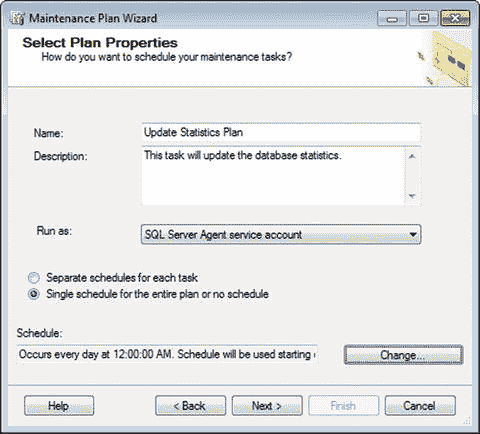
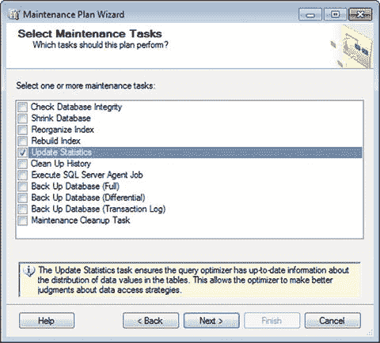
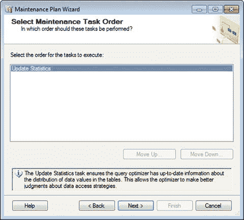
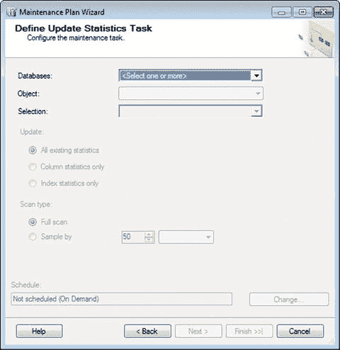
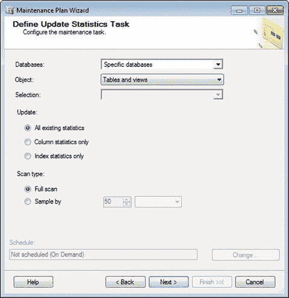
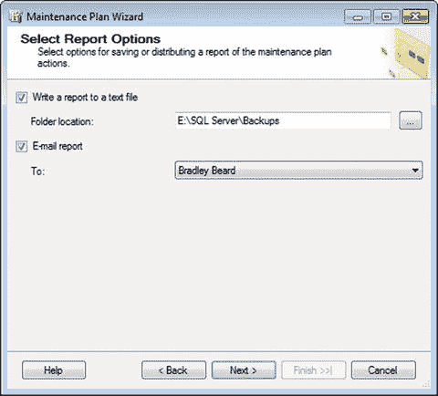
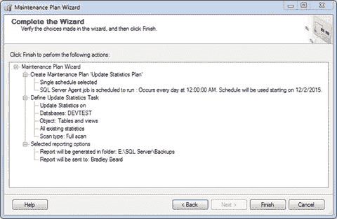
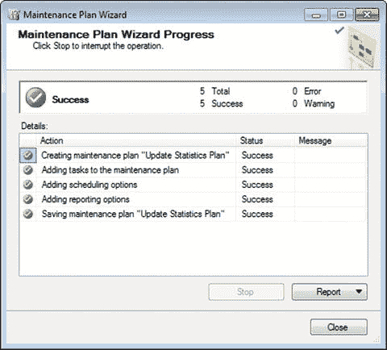
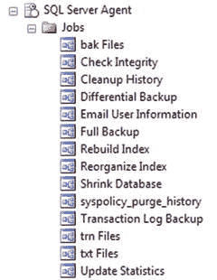
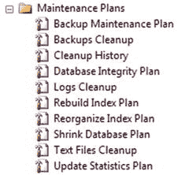

# 10. 更新对象统计信息

别担心；这本书其实不是关于数学的。我不会骗你去做任何统计作业之类的事情。当 SQL Server 提到统计信息时，那是什么意思？

这里的统计信息，指的是分布统计信息。

很好……那么这是什么意思？如果你还记得第 7 章和第 8 章，我们讨论了索引。还记得我们说过，对于 B-Tree 结构，有不同的层级，以及每个层级如何供给更高的层级吗？分布统计信息就是用来定义这些层级的。

### 分布统计信息详解

假设你有一个用于存储用户数据的表。几乎每个人的数据库里都有一个 `Users` 表。在开发阶段，你可能只有五到十个测试账户，用来测试不同角色下的功能。而当你切换到生产环境时，会发生什么？用户账户会突然大量涌入。但如果你的统计信息仍然显示记录数很少，而实际记录数却非常庞大，那么索引就会过时，返回正确信息实际上需要更长的时间。分布统计信息使 `SQL Server` 能够手动和自动地重新计算并优化这些索引的值，从而快速返回正确的信息。

我们在第 7 章讨论 `B-Tree` 结构时，有一张清晰的图展示了树的各个层级。还记得它们排列得多么整齐漂亮吗？那么，当记录被移动、删除、更新和插入时，会发生什么？物理文件会产生碎片，索引开始出现偏移。`SQL Server` 会自动采取措施来缓解这种情况吗？是的。当执行某些 `DML` 操作（`delete`、`update` 和 `insert`）时，`SQL Server` 会根据需要手动重新计算这些统计信息。这并不能解决碎片问题；如果还记得的话，那是我们的重组和重新构建任务要做的事。但这确实对索引进行了一次快速清理。

还记得你年轻的时候，公司会不请自来地拜访你那糟糕的公寓吗？（也许只有我这样。）你打扫得有多快，做得有多彻底？信不信由你，同样的原理也适用于这里。这不是一项完美的工作，不是 100% 完成，也不像专为此任务设计的维护任务那样彻底，但它足以让索引为下一次查询做好准备。

**提示**

关于统计信息，需要记住的重要一点是它们会不断变化。

在大型数据库中，统计信息不会长时间保持不变。为了提供尽可能高的数据完整性级别，我们需要能够快速、正确地返回请求的数据。定期重新计算和优化索引及表的统计信息，对于实现这一目标大有帮助。

### 设置维护任务

要设置更新数据库统计信息的任务，请照常开始。在 `SSMS` 中，右键单击 `Management` 文件夹下的 `Maintenance Plans`，然后选择 `Maintenance Plan Wizard`，如图 10-1 所示。

图 10-1.

选择计划属性

将默认值更改为图 10-1 中所示的内容，然后单击 `Change…` 按钮来设置计划。你只希望它每天运行一次，因此将 `Occurs` 下拉菜单更改为 `Daily`，并单击 `OK`。你的计划现在设置为每天 12:00AM 运行。单击 `Next` 继续。

现在你将看到一个屏幕，可以在其中选择要执行的任务。图 10-2 详细列出了任务并显示了此区域的正确选项。

图 10-2.

选择维护任务

选择 `Update Statistics` 选项，如图 10-2 所示，并注意其定义。正如我之前总结的，此任务“确保查询优化器拥有有关表中数据值分布的最新信息。”

准备好继续后，单击 `Next`。你将看到如图 10-3 所示的内容。

图 10-3.

选择维护任务顺序

由于我们这里只有一个任务，不用担心，直接单击 `Next`。

然后你会看到定义任务的默认屏幕。它应该如图 10-4 所示。

图 10-4.

定义更新统计信息任务

这是我们想要定义任务参数的地方。从下拉菜单中选择你的数据库，将 `Object` 设置为 `Tables` 和 `Views`。

如果你还记得第 6 和 7 章节，将 `Object` 设置为 `Tables` 和 `Views` 允许我们更新数据库中所有可用对象的统计信息。如果你愿意，也可以自由选择仅 `Tables` 或 `View`，但如果你以后想对维护计划进行任何更改，则需要进去修改此设置。

下面还有两个其他选项：

*   `Update` 允许你在 `All`、`Column` 或 `Index` 统计信息之间进行选择。保留默认值 `All`。
*   `Scan type` 允许你定义 `full scan`（推荐），也可以选择 `sample size` 来执行扫描。这意味着 `SQL Server` 获取指定数量的样本，并据此推断扫描范围。它不会进行完整扫描，但结果比较接近。`full scan` 选项扫描整个目录，而不仅仅是数据的样本，然后根据该扫描的结果更新统计信息。

我建议将这两个选项保留为默认值，如图 10-5 所示。

图 10-5.

定义更新统计信息任务（完成）

准备好继续后，单击 `Next`。

这是我们熟悉的定义报告选项的界面。按照图 10-6 所示进行设置，然后单击 `Next` 继续。

图 10-6.

选择报告选项

现在你看到如图 10-7 所示的摘要屏幕。和往常一样，检查一下，以确保没有遗漏什么。

图 10-7.

完成向导

当一切就绪时，单击 `Finish`，然后屏息等待图 10-8 的出现。

图 10-8.

维护计划向导进度

又一次，另一个维护计划设置完成了。

确保像前面的章节一样更新 `Job`。我将我的作业名称更新为 `Update Statistics`。你的 `Jobs` 文件夹现在应该如图 10-9 所示。

图 10-9.

SQL Server 代理作业

里面有好多作业！别担心，我知道现在看起来有点吓人，但我保证在不久的将来，这一切都会变得更加清晰。

你的 `Maintenance Plans` 文件夹也应该如图 10-10 所示。

图 10-10.

维护计划

## 总结

让我们快速回顾一下本章的内容。

*   我们学习了数据库如何使用统计信息来重新计算它对数据库的“了解”。
*   我们看到，在妥善管理的情况下，重新计算数据库统计信息与重建和重组索引协同工作，可以提供更高级别的数据完整性和查询完成时间。
*   我们学习了如何设置该任务，并详细了解了任务各部分的具体内容。

干得好！这一章很简短，但仍然非常重要。我们现在即将收尾，请继续努力，完成你的维护计划学习。

