# 11. 执行 T-SQL 语句

`执行 T-SQL 语句任务`是最容易设置的任务之一。你只需要准备好要运行的 SQL 查询，将其粘贴到框中——就完成了。

但是等等……如果查询在一个`.sql`文件中怎么办？如果那个文件可能会更改怎么办？这是否意味着每次查询更改时你都必须更新这个任务？

不。这正是 SQL Server 大显身手、拯救局面的一个绝佳例子。对于 SQL 查询，你可以选择直接输入、文件连接或变量输入。

我们将以不同于之前计划的方式设置此任务，因为此任务特定于 `SQL Server Integration Services (SSIS)` 子系统，而非 `SQL Server Agent` 子系统。尽管 `SQL Server Agent` 将执行这个以及所有其他作业，但这个特定任务（以及 `通知操作员任务`）只能在这里创建。

### 设置维护计划

由于我们将在设计界面而非向导界面中工作，因此设置此计划与你之前所见的不同。任务的本质是相同的，即我们在设置一个要运行的作业，并在呈现给我们的界面中定义该作业的特性。简单来说，我们无法在常规维护计划中运行 T-SQL 语句，除非进行大量额外工作，而这些工作实际上与原始维护计划无关。换句话说，它需要作为对现有计划的补充来运行，但这没有意义，因为我们希望将这些维护任务在逻辑上分开。在设计界面而非向导中创建此任务，使我们有机会专门创建一个 T-SQL 任务。

右键单击 `维护计划` 并选择 `新建维护计划…`，然后输入 `T-SQL 计划` 作为名称，如图 11-1 所示。

### 图 11-1.
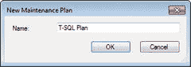

新建维护计划

单击 `确定`。你应该会看到如图 11-2 所示的界面。

### 图 11-2.
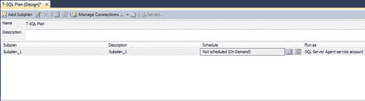

设计界面

此时，你可以在屏幕顶部的大框中输入描述。完成后，双击已创建的子计划 (`Subplan_1`) 并按图 11-3 所示填写。

### 图 11-3.
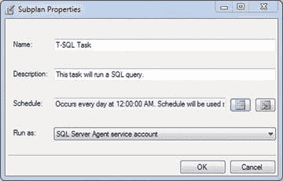

子计划属性

看起来有点熟悉，不是吗？这是输入任务的另一种方式。像我们在其他章节中所做的那样更改计划，并将“`运行方式选项`”保留为默认值。

正如我之前所说，这并不意味着它功能更强或更弱，也不意味着它做不同的事情，它只是以不同的方式完成基本相同的事情。在 `维护计划向导` 中，我们无法选择仅运行 SQL 查询而不进入 `SQL Server Agent 作业` 并从那里运行 SQL 脚本。

完成此屏幕后单击 `确定`。然后你会看到之前的界面，并填入了你输入的值。你应该看到类似于图 11-4 的内容。

### 图 11-4.
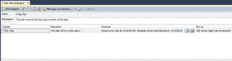

设计界面

我知道你在想什么。我们如何将 SQL 添加到这里？似乎没有任何地方可以添加任何内容。那是因为我们还没有显示 `工具箱`。还记得我们之前讨论过使用向导与使用设计界面设置维护计划的区别吗？这就是其中一个很大的区别。

在屏幕左侧，你应该会看到一个写着 `工具箱` 的菜单。如果没有，请按 `Ctrl+Alt+X` 显示它。图 11-5 显示了 `工具箱` 的样子。

### 图 11-5.
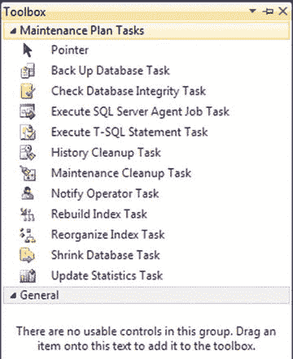

工具箱

那就是 `工具箱`。注意，其中的大部分内容都是我们已经介绍过的。

你在这里要做的是经典的“单击并拖拽”技术。单击 `执行 T-SQL 语句任务` 并将其拖到子计划信息下方的灰色区域。你将看到如图 11-6 所示的内容。

### 图 11-6.
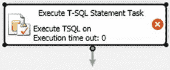

执行 T-SQL 语句任务（初始）

这是第一步，所以不用担心那里有一个红色的 X。那只是因为我们还没有完成设置。说到这个，继续双击 `执行 T-SQL 语句任务` 框的任意位置以进入下一步，如图 11-7 所示。

### 图 11-7.
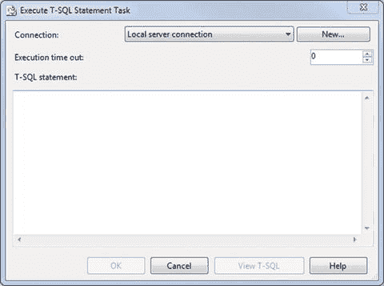

执行 T-SQL 语句任务详细信息


当你初次进入这个界面时，看到的就是这个。此屏幕允许您定义连接（如果您有多个连接的话），并输入 T-SQL 语句。您也可以在此处定义执行超时。该值以秒为单位，0 表示将一直运行直至完成。

我们将要输入的 T-SQL 语句会是简短而精炼的：

```sql
SELECT firstname + ' ' + lastname FROM users ORDER BY userid;
```

这会从数据库的 `Users` 表中给我们返回拼接后的用户名。

准备好后点击 `OK` 继续。注意，在图 11-8 中，红色的 X 消失了，界面看起来更完整了。


图 11-8. 执行 T-SQL 语句任务详情（已完成）

请注意，在这里您可以保留通用的 `Execute T-SQL Statement Task` 文本，也可以输入一个新值。操作方法是长按文本直至其可编辑，输入新值，然后按 `Enter`。我做了这个操作，并将其改为了 `Run Some SQL`，如图 11-9 所示。


图 11-9. 执行 T-SQL 语句任务详情（已更新）

现在设置好了，我们来看一下其中的一些设置。右键单击并选择 `Properties`。天哪，这么多属性。要逐一定义它们需要再写一整章，所以我们暂且假设这里的一切都没问题，直接看一个有趣的部分。

寻找名为 `SqlStatementSourceType` 的属性，如图 11-10 所示。

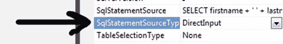

图 11-10. SqlStatementSourceType

这个属性是关键。`SqlStatementSourceType` 属性默认设置为 `DirectInput`。其他值是 `FileConnection` 和 `Variable`。在我们继续之前，先分别看看图 11-11 中的这些选项。

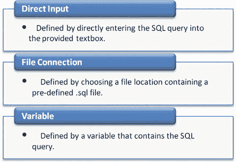

图 11-11. 源类型概述

明白了吗？这些是定义需要运行的 SQL 的三种方式。如果这三种方法都不能满足您的需求，那我也不知道该说什么了。老实说，我想不出其他可以运行的方式了；除非是存储过程，这可以通过将 `IsStoredProcedure` 的值从默认的 `False` 改为 `True` 来设置。

在本练习中，我们将坚持使用 `DirectInput`，但我强烈建议您，如果还没有尝试过，请务必探索另外两种执行此步骤的方法。

保存并关闭该计划，然后返回 `Maintenance Plans` 部分，刷新 `Maintenance Plans` 文件夹以查看该计划。

打开 `Jobs` 文件夹。该计划就在接近底部的位置。图 11-12 显示了这个新作业与其他作业在一起。

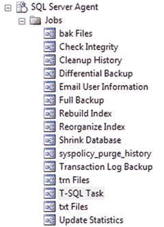

图 11-12. SQL Server Agent 作业

有趣！现在，我们有了一个作业……但它成功运行了吗？是失败还是成功？我们并没有以这种方式设置任何这些。还记得之前设置的所有那些选项吗？它们去哪儿了？

嗯，可以这样想。以这种方式创建任务让您有机会纯粹从任务侧进行操作，而不是从计划或报告侧。这种方式让我们能够专注于我们具体想做什么。实现它将是另一回事，但它并不像您想象的那么难。

### 实现维护计划

任务已经设置好了，现在让我们付诸实践。我们该怎么做呢？只需在 `SQL Server Agent` 下双击作业名称（我的是 `T-SQL Plan.T-SQL Task`），就行了，如图 11-13 所示。

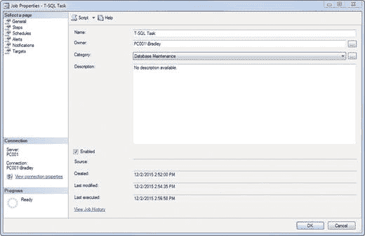

图 11-13. 作业属性，常规选项卡

哦，谢天谢地。我们终于回到了熟悉的领域！从这里开始，像往常一样进行设置；如果您愿意，可以给它一个新名称并更新描述。我将我的改为了 `T-SQL Task`。请注意，我们当前位于左侧的 `General` 选项卡。现在让我们逐步查看其他选项卡。

我们现在位于 `Steps` 选项卡。最初，此界面看起来类似于您在图 11-14 中看到的内容。

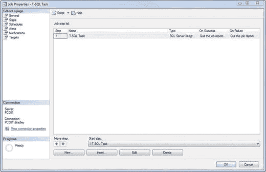

图 11-14. 作业属性，步骤选项卡

一切都为我们设置好了！不过，有几处小地方我想改动一下，所以请点击 `Edit`，然后点击 `Advanced`。此时您应该会看到如图 11-15 所示的界面。

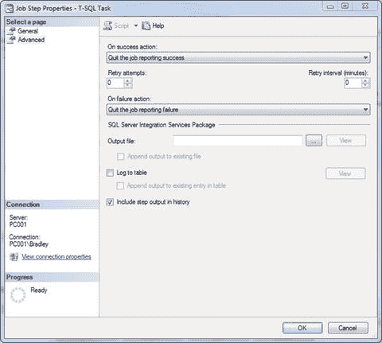

图 11-15. 作业属性，步骤选项卡，高级选项

只需选中“包含步骤输出在历史记录中”复选框即可。

在此区域完成操作后，点击 `OK`。

点击左侧的 `Schedules` 继续。此屏幕显示为任务定义的设置，即 `Daily` at `12:00 AM`。还记得之前设置的这个吗？除非您需要更改，否则可以保持原样。

接下来是 `Alerts` 选项卡，请点击它。我们其实不需要在此设置任何警报，因为我们只是运行一个简单的查询。同样，如果您需要在这里运行什么，请随意。毕竟，这是您的维护计划！

`Notifications` 是倒数第二个。这是重要的部分。确保您勾选 `E-mail` 框，选择我们的操作员，并将其设置为“当作业完成时”。图 11-16 显示了推荐的设置。

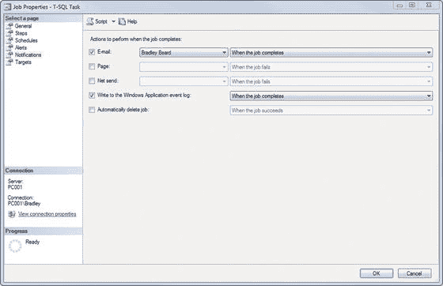

图 11-16. 作业属性，通知选项卡

在 `Targets` 选项卡上，保持所有内容空白即可。我们根本没有为此部分定义任何内容。

准备好后，点击 `OK` 以保存对此作业的更改。

如果您通读了第 4 章，这个设置流程应该很熟悉。如果您还没有读过，那么您绝对应该读一下，以便理解我们正在做什么以及为什么这样做。

还记得我问过我们如何知道它是否成功了吗？好吧，我们现在就来找出答案。


### 执行维护计划

右键单击作业，然后选择 `从步骤启动作业…` 来运行它。很可能，它会失败。我的就失败了！图 11-17 显示了这个失败。

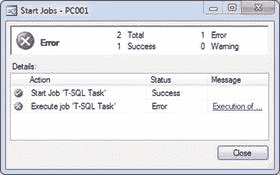

图 11-17. 启动作业

是时候进行一些故障排除了。单击此框右侧的超链接，您将看到图 11-18 所示的内容。

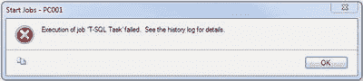

图 11-18. 启动作业错误

哇。谢谢，微软。这除了告诉我们去阅读历史日志外，没有任何有用的信息。好吧，那我们就去读一下。关闭显示失败的窗口，右键单击作业，然后选择 `查看历史记录`。这将打开图 11-19 所示的界面。

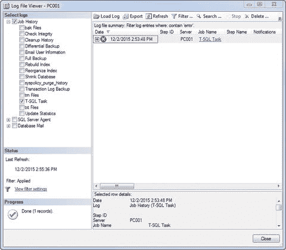

图 11-19. 日志文件查看器

有趣。展开此错误信息会显示“**无效的对象名 'users'**”。嗯。关闭此窗口并打开 `T-SQL 计划`，如图 11-20 所示。双击 `运行一些 SQL` 任务，同样如图 11-20 所示。

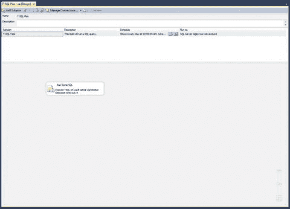

图 11-20. T-SQL 计划

既然错误明确指出 'users' 是一个无效的名称，那么让我们将查询修改为以下包含一个完全有效名称的形式：

```sql
SELECT firstname + ' ' + lastname FROM DEVTEST.dbo.users ORDER BY userid;
```

完成后单击 `确定`，然后保存维护计划。继续并右键单击 `T-SQL 任务` 作业，选择 `从步骤启动作业…` 来启动它。成功了吗？对我来说确实成功了。这是一个很好的教训，说明 `SQL Server 代理` 默认查看的是 `master` 数据库，而不是我们特定的数据库。

如果您的查询仍然失败，我在此给您一个重要的建议。您可以指定想要执行 SQL 的账户，而不是使用 `SQL Server 代理`，尽管在 `作业属性` > `步骤` > `编辑` > `运行身份` 中无法选择其他选项。想知道怎么做吗？

回想一下我们最初的查询如下：

```sql
SELECT firstname + ' ' + lastname FROM users ORDER BY userid;
```

然后我们将其更新为如下形式：

```sql
SELECT firstname + ' ' + lastname FROM DEVTEST.dbo.users ORDER BY userid;
```

这就是我们查询的全部修改。但它仍然失败。所以此时，我们有一个选择：要么去找系统管理员，要求在服务器上为 `SQL Server 代理` 账户提升权限，要么为 `SQL Server 代理` 创建另一个域账户来运行（同样具有提升的权限）。不过，也许还有第三种选择？告诉我，您能否单独成功运行这个查询？可以。那么为什么您不能被设置为“运行身份”的值呢？哦，但您是可以的！

双击 `T-SQL 计划` 维护计划，然后双击图 11-21 灰色区域中显示的 `运行一些 SQL` 任务。

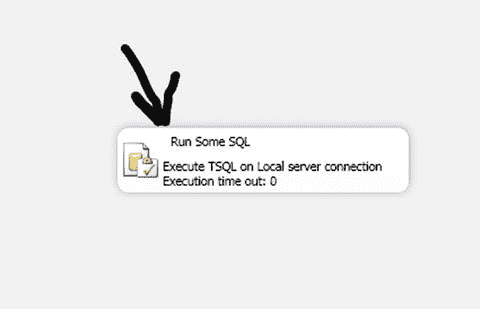

图 11-21. 运行一些 SQL

这将打开我们的 `T-SQL` 语句框，其中列出了之前的查询。我们将通过输入以下 SQL 稍微修改它。

```sql
USE DEVTEST
GO
SELECT firstname + ' ' + lastname FROM users ORDER BY userid
EXEC AS LOGIN = '[DOMAIN]\[USERNAME]';
```

看看第一部分……它本质上与我们之前定义 SQL 的方式相同，不是吗？没错。选择使用 `USE` 关键字或像之前那样在 SQL 中定义数据库，达到的是同一个目标。

这里需要注意的一个重要点是，包仍然由 `SQL Server 代理` 执行。任务是在我的用户账户上下文中执行的。这说得通吗？

保存并关闭此维护计划。右键单击作业并选择 `从步骤启动作业…`，看看图 11-22 中会发生什么，只需将该 SQL 查询更改为包含我的登录名即可。

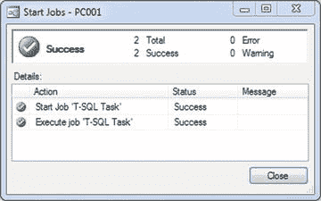

图 11-22. 成功！

我喜欢看到这个。

## 总结

我们来快速回顾一下……

*   我们使用“另一种”方式（设计界面）设置了另一个计划。
*   我们使用 `SQL Server 代理` 的 `作业属性` 编辑了该计划。
*   我们发现了查询中可能的失败，因此重写了查询，现在它工作了。

您的 `作业` 文件夹现在应该如图 11-23 所示。

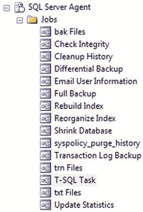

图 11-23. SQL Server 代理作业

您的 `维护计划` 文件夹现在应该如图 11-24 所示。

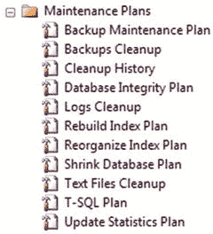

图 11-24. 维护计划

本章做得非常出色。请重读您不理解的部分，特别是关于如何使用您的用户账户而不是 `SQL Server 代理` 运行查询的那部分。接下来，我们将了解 `通知操作员任务`，然后为结束做准备。如果您已经走到这一步，做得太棒了！您即将拥有创建或维护自己的维护计划所需的工具和知识。

## 12. 通知数据库操作员

`通知操作员任务` 的目的是专门设置一个通知任务。它可以用于计划中的任何事件；也就是说，这是本节的关键点。它也不必绑定到任何特定的任务。您可以设想仅拥有此任务，它将做的只是通知一个操作员。那可能有什么好处呢？如果这个任务不与其他任何东西绑定，一个简单的通知能做什么呢？让我们看看如何设置它，我将在过程中解释这个问题的答案。


### 设置维护计划

右键单击 `维护计划` 并选择 `新建维护计划…` 以继续。输入 `通知操作员计划` 作为名称，如图 12-1 所示，然后单击 `确定`。

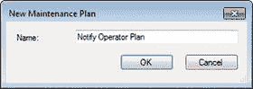
*图 12-1. 新建维护计划*

请确保此时 `工具箱` 已打开（`Ctrl+Alt+X`）。首先要做的就是更新该计划的默认选项，因此双击 `子计划` 名称（`Subplan_1`）并更新您的界面，如图 12-2 所示。

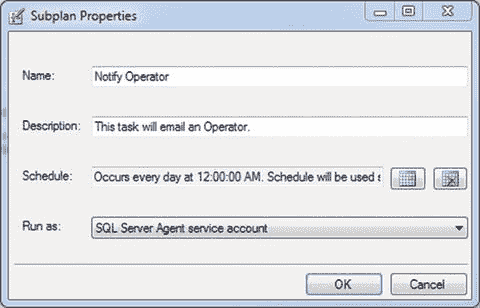
*图 12-2. 子计划属性*

请注意，`计划` 框尚未设置。将其更改为 `每天 12:00 AM`，在 `计划` 页面上单击 `确定`，然后在返回到 `属性` 窗口时再次单击 `确定`。这将引导我们进入更新后的界面，如图 12-3 所示。

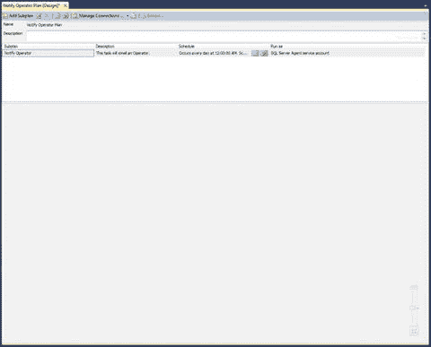
*图 12-3. “通知操作员计划”阶段*

此时，我们已准备好添加 `通知操作员任务`，因此从工具栏单击并拖动 `通知操作员任务` 到该阶段中。

### 配置任务并了解操作员要求

您首先注意到的是那个大红叉。就像在第 11 章中一样，我们需要定义此任务的参数。双击 `通知操作员任务`。您将看到如图 12-4 所示的内容。

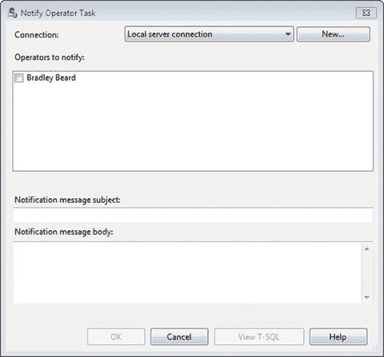
*图 12-4. 通知操作员任务*

猜猜我们这里必须做什么？值得庆幸的是，Microsoft 让这相当容易确定。您可以看到 `本地服务器连接` 已经选中，所以没问题。在那下面，是系统上可用的操作员。

请注意，您在这里没有选项来创建新操作员或编辑当前操作员。我认为这是设计使然，因为它显示了添加新操作员和使用现有操作员流程之间的明显脱节。将这两个任务分开，迫使用户理解其决定的后果，并强化了维护计划内正确流程的理念。我认为 Microsoft 可能说过这样的话：“你不能添加一个不存在的操作员，对吧？因此，你必须首先添加一个操作员。而且别以为我们会让你用微软简化版的方式来做。你必须从 SSMS 中的操作员区域来添加。一旦你完成了，然后才能回到这里添加操作员。” 这样有道理吗？可以将其视为微软在某种程度上迫使用户有意识地决定遵循使用此特定任务的规定方法。

在流程的这一点上，您需要选择我们已经设置好的操作员。在其下方，您可以看到有 `主题` 和 `正文` 框。听起来像是一封电子邮件，不是吗？确实如此。否则我们为什么要使用已经设置好的操作员呢？当然，在操作员设置中，我们可以指定电子邮件、网络发送或寻呼机通知。如果我们没有为操作员指定电子邮件地址，但选择在这里通知他们，会发生什么？简短的回答是：不行。此任务专用于电子邮件地址。想要证据吗？

### 演示电子邮件要求

让我们快速再设置两个操作员。取消当前打开的窗口，右键单击 `操作员`（在 `SQL Server Agent` 内；您可能需要单击屏幕底部的 `对象资源管理器` 来显示此项）并选择 `新建操作员…`。输入如图 12-5 所示的信息。我们称这个为 `网络发送操作员`，“`网络发送地址`”的格式为 `DOMAIN\username`。

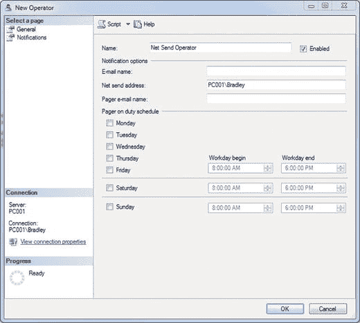
*图 12-5. 新建操作员*

完成后单击 `确定`，打开另一个 `新建操作员…` 窗口，并输入如图 12-6 所示的信息。我们称这个为 `寻呼机操作员`，并选中所有天数。

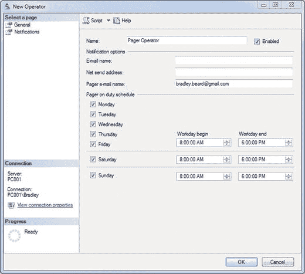
*图 12-6. 新建操作员，常规选项卡*

完成后单击 `确定`。此时，您应该有三个操作员，如图 12-7 所示。

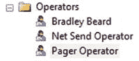
*图 12-7. 操作员*

够简单吧。那么，使用 `通知操作员` 任务，让我们确定应该选择通知这些操作员中的哪一个。

双击 `通知操作员任务`（它应该仍然在 SSMS 中打开着），并注意只有初始操作员被列出，如图 12-8 所示。

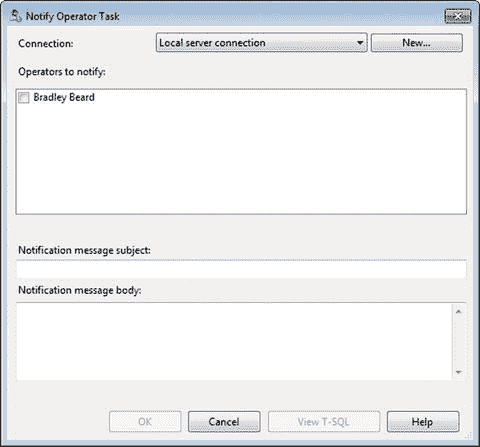
*图 12-8. 通知操作员任务*

嗯。这意味着在此上下文中，其他操作员都不是有效的操作员。想要更多证据吗？双击 `网络发送操作员` 或 `寻呼机操作员`，并注意电子邮件字段为空。我选择 `寻呼机操作员` 进行操作。将电子邮件地址复制并粘贴到 “`电子邮件名称`” 框中。您现在应该看到如图 12-9 所示的内容。

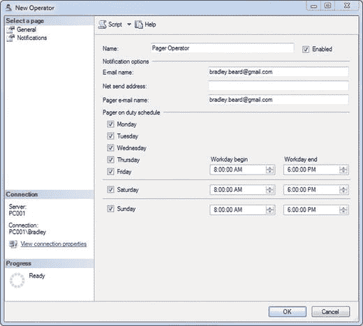
*图 12-9. 寻呼机操作员属性*

因此，现在我们为 `寻呼机操作员` 指定了一个电子邮件地址。单击 `确定`。返回到 `通知操作员任务` 并双击它。图 12-10 显示了更新后的界面。

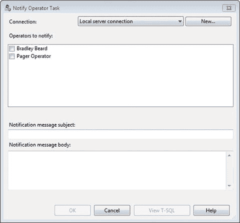
*图 12-10. 通知操作员任务（已更新）*

看看这个？`寻呼机操作员` 被添加进来了。

因此，我们可以肯定地断言，一个操作员必须指定有电子邮件地址，才能被包含在 `通知操作员任务` 中并担任任何角色。

现在，您可以通过右键单击并选择 `删除`，然后接受删除操作，来移除 `寻呼机操作员` 和 `网络发送操作员`。之后，您应该只剩下原始的操作员。

### 完成并测试任务

继续完成任务！我们停留在界面的指定处，因此将其更新为如图 12-11 所示。

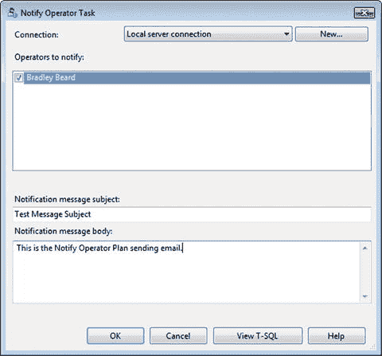
*图 12-11. 通知操作员任务（已更新）*

我们所做的只是添加了操作员并定义了一个通用的 `主题` 和 `正文`。此时单击 `确定`。

请注意，我们的界面已更改，显示如图 12-12 所示的信息。


*图 12-12. 通知操作员任务*

这表明我们正在使用 `本地服务器连接`，并且 `Bradley Beard` 是我们的操作员。

到目前为止一切顺利。那么接下来是什么？我们需要测试它。我们可以等到午夜，按我们计划的时间触发它，或者我们可以现在就运行它。让我们现在运行。

首先，您需要保存目前的计划。保存后，`Notify Operator Plan.Email Operator` 作业会出现在 SSMS 中的 `SQL Server Agent` ➤ `作业` 文件夹中，如图 12-13 所示。

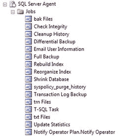
*图 12-13. SQL Server Agent 作业*

还有其他作业，但我现在只想关注这一个。右键单击它并选择 `从步骤开始作业…`，然后观察发生了什么。图 12-14 显示了预期的结果。

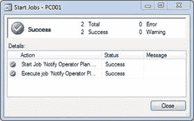
*图 12-14. 成功！*

成功！我喜欢这样。如果您收到了如图 12-15 所示的错误，请继续阅读。如果没有，请跳到本章末尾。

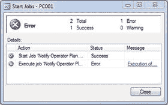
*图 12-15. 或者失败了…*

您说它失败了！？为什么它会失败呢？简而言之，它失败是因为我们尚未为该操作员设置配置文件。让我们现在来看看如何做。


### 创建操作员配置文件

我们需要为作业创建一个操作员配置文件才能使其运行。双击 `Database Mail`，然后点击“管理配置文件安全性”单选按钮，如图 12-16 所示的界面。

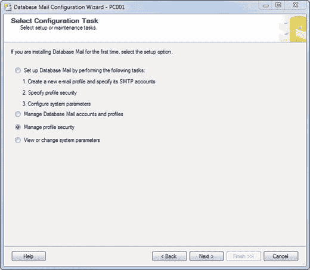

图 12-16. 选择配置任务

点击 `Next` 继续。

您将看到一个窗口，其顶部有 `公共配置文件` 和 `专用配置文件` 两个选项卡。默认显示的是 `公共配置文件`，如图 12-17 所示的界面。

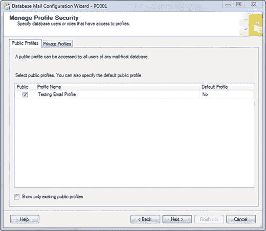

图 12-17. 管理配置文件安全性

此时，勾选 `公共` 复选框，并将 `默认配置文件` 选项更改为 `是`。您的界面应如图 12-18 所示。

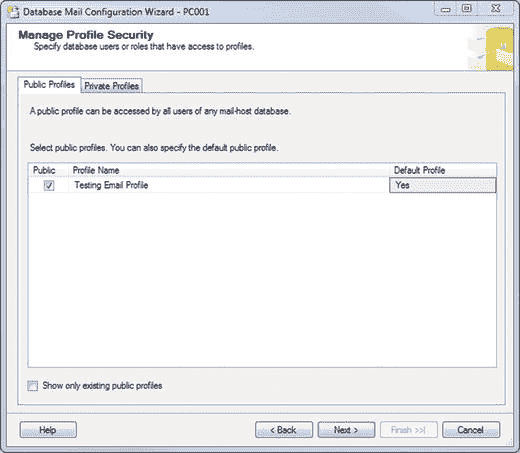

图 12-18. 管理配置文件安全性（已更新）

点击 `Next` 继续，然后点击 `Finish` 完成设置。您应该会收到一条 `成功` 消息，如图 12-19 所示。关闭窗口，再次右键单击该作业，选择 `从步骤开始作业…` 以查看接下来会发生什么。

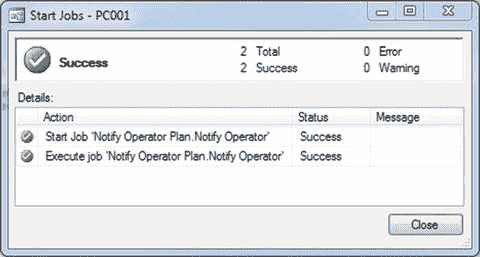

图 12-19. 成功！（再次）

现在检查您的收件箱。嘿，看那个！挺不错的吧？

继续将作业重命名为 `通知操作员`，并按照我们在前几章中的方式更新它。此时，您应该拥有如图 12-20 所示的所有作业。

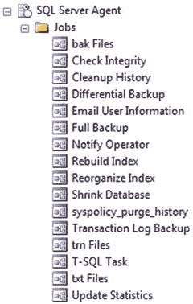

图 12-20. SQL Server Agent 作业

您的 `维护计划` 文件夹应如图 12-21 所示。

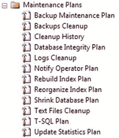

图 12-21. 维护计划

## 总结

让我们快速回顾一下本章内容。

*   我们学习了 `通知操作员任务`。
*   我们了解到，操作员必须有一个电子邮件地址才能使用 `通知操作员任务` 进行通知。
*   我们了解到，`Database Mail` 配置文件安全性需要启用才能正常工作。
*   我们通过收到一封电子邮件确认了我们的设置。

到目前为止做得非常好。真的，如果您能一次就走到这一步，那真是做得太棒了；如果您能一口气读到这里，那就更了不起了。继续前进，我们最终将通过创建自定义维护计划来圆满结束这一切。

## 13. 整合所有内容

至此，我们已经完成了创建每项任务的维护计划所需的所有具体任务。我们遵循了实践示例，引导我们走向本书的高潮，即让您——用户——创建属于您自己的维护计划。从现在开始，我们将从理论转向应用；我们将应用所学知识。

### 检查您的环境

如果您一直跟着操作，您的收件箱里可能已经收到了不少测试邮件。请删除它们，因为您不再需要它们了。

图 13-1 显示了 `SQL Server Agent` 中列出的作业。

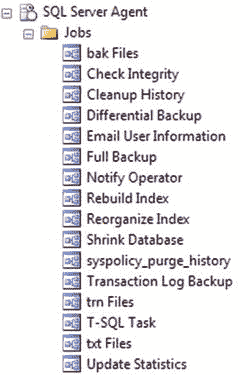

图 13-1. SQL Server Agent 作业

此外，我们应该拥有如图 13-2 所示的以下可用维护计划。

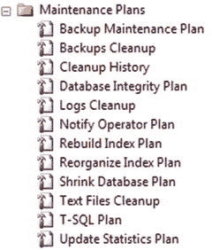

图 13-2. 维护计划

现在，这里重要的是，在很大程度上，我们已经完成了。没错！理论上，您可以将计划保持原样，就算大功告成。然而，关于维护计划有一些重要的考虑因素必须纳入，其中最重要的是要记住，某些任务需要在其他任务之前运行，而有些任务可能不需要每小时甚至每天运行。下一节将重点讨论哪些任务实际需要运行、何时运行以及运行的顺序。

### 维护任务的顺序

没错；维护任务有一个优先顺序。为什么？先备份数据库，然后再重建索引，这没有多大意义，对吧？任务必须有一个顺序，所以让我们围绕要运行的主要任务——备份数据库——来看看它们的顺序。

可以这样想。您不希望备份错误的数据，但同时您也希望提供一个长期有效的备份机制。为了实现这一点，您希望提前完成基础工作，即处理数据完整性的任务。备份之后，您需要进行清理。

查看图 13-3。理想情况下，这就是我构建新维护计划的方式。

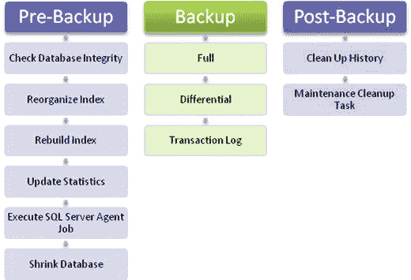

图 13-3. 维护计划结构

进一步总结，可以这样理解。

*   **备份前阶段** 由所有需要在数据库备份之前完成的事项组成。
*   **备份阶段** 是实际运行以备份数据的部分。
*   **备份后阶段** 由备份完成后需要处理的事项组成。

明白了吗？我们在备份前、备份中和备份后运行任务。结果是得到一个新鲜、干净的数据库备份，以及得到适当维护的任务和日志。

所以现在我们知道了需要按什么顺序运行任务。接下来，我们需要决定我们希望这个计划有多健壮。我们可以根据安全计划的需要，决定做多或做少。请记住，作为一名 `DBA`，您必须遵循有关数据保留和可用性的指导原则。您可能面临与我不同的要求，因此最好记住将本指南作为在您自身安全原则范围内创建数据库维护计划的参考。


## 确定维护计划的复杂度

正如我刚才所说，这件事可简可繁，完全取决于你的意愿。我倾向于尽可能保持简单，因此在这里，我也不会偏离这个逻辑太远。

数据库成熟度主要有四个阶段，如图 13-4 所示。

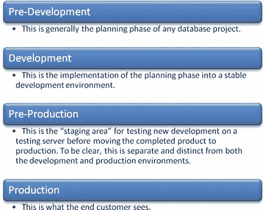

图 13-4. 数据库成熟度阶段

**提示**

数据库成熟度指的是一个新数据库从创建开始，直到被投入生产环境以处理交易、满足业务需求的发展过程。

无论你是创建一个仅用于存储用户和会话信息的数据库，还是一个每秒记录数十亿笔交易的数据库，你总是从一个全新的、干净的数据库开始。因此，这个数据库必须经历成熟过程，才能准备好按其预期用途被使用。它成熟的唯一途径是经历一系列流程，以确保其将满足应用程序乃至最终用户的需求。这些流程的一部分将包括需要对数据库执行哪些维护工作以及以何种频率执行。

这里有趣的部分是，理想情况下，数据库规划只应在阶段 1 进行。显然，这并不总是现实的，因为应用程序或数据库的需求可能会发生变化。在这种情况下，阶段 1 将重新开始。明白这是怎么运作的吗？任何时候进行新的开发，都必须从阶段 1 走到阶段 4，不能跳过任何步骤。这是确保系统绝对完整性和凝聚力的唯一方法。换句话说，当开发新功能时，它需要先在阶段 1 进行规划（如图 13-4 所示），然后通过工作流程推进，直至上线。

这对于你的需求来说可能有点过于复杂了。这是我在工作中处理事情的方式，所以我也习惯了这样做。你可能会找到另一种更适合你需求的处理方式，这完全可以。不过目前，我们将使用这种方法进行工作。

这并不意味着我们要创建四个不同的数据库或类似的东西。相反，我们将创建一个维护计划，然后我会向你展示如何将该维护计划背后的逻辑（即你从本书中学到的东西）移植到其他数据库中。

### 规划维护计划

规划计划？听起来像个计划。只要有可能，一定要提前规划。说真的。是的，这一段有很多头韵，但这个概念大多时候能为你省去不少麻烦。务必谨慎行事，尤其是在处理数据库时。这里有一条处理数据库的**首要准则**：如有疑问，先做备份。只需要发生一次你不小心搞砸了某件事却没有备份的情况。这很可能就足以让你成为尽可能频繁备份的坚定信徒。

**提示**

如有疑问，务必先做备份！

那么，你如何规划一个计划呢？你需要确定需要哪些步骤，然后规划如何实施它们。让我们看两个不同的场景，并从中确定实施维护计划的最佳方式。

在第一个场景中，假设你有一个小型数据库，一次处理的数据量不大。这可能适用于像家庭数据库这样的情况，用于记录孩子的家务或 CD 收藏。

在第二个场景中，假设你是一家中型或大型公司的 DBA，负责运行他们每小时处理相当大量交易的数据库。

#### 场景 1

第一个场景将针对一个不处理大量数据的小型数据库。由于这不是一个很大的数据库，而且可能并非任务关键型（意味着它可以快速轻松地恢复，并且在其缺失时不会影响任务的任何部分），那么我们可以将一些任务交给数据库引擎来运行。当遇到那三个神奇的 DML 语句时，`SQL Server` 会自动运行哪些任务？`重新生成索引`、`重新组织索引`和`更新统计信息`。在这个场景中，我们可以省略这些任务，因为我们实际上只是在重复 `SQL Server` 已经做过的事情。因此，场景 1 的维护计划可能如图 13-5 所示。

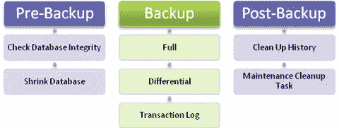

图 13-5. 场景 1 结构

这样是不是更精简了？记住，我们不一定需要运行所有可用的任务。我们可以不去管 `SQL Server` 本来就会执行的一些内部处理，只关注数据的完整性。我会称此为“仅含绝对必要任务的、最低限度”的维护计划。我认为这个场景可能并不适合很多企业，如果适合，很可能是因为 DBA 要么不理解维护计划，要么不愿意花时间学习。幸好你不是那样的 DBA；仅仅通过阅读本书，你就在采取积极的步骤来提升自己的知识。在实践时，你从本书中学到的工具无疑将帮助你实现更好的数据可用性和完整性。

正如我之前所说，这可能是家庭数据库或非关键重要数据库的最佳场景。如果你的业务运营依赖于数据，那么我认为这不会是你想要选择的场景。

相反，你会想要一个更强大的方案；一个能够执行 `SQL Server` 自动执行的任务，但作为维护计划的一部分执行时，能够执行得更彻底，而不仅仅是顺带一做的方案。还记得 `SQL Server` 如何在大多数查询后执行索引重组和更新数据库统计信息吗？这在这里很重要，因为我们是在手动告诉 `SQL Server`，在维护计划成功运行后，确保这些操作已准备好迎接下一批数据交互。


### 场景二

这个场景稍微复杂一些，但更接近我惯用的方式。对于此场景，你需要记住，我们不会像场景一那样走快速但粗糙的路径。这个过程实际上更接近我们即将构建的完整维护计划；它看起来如图 13-6 所示。

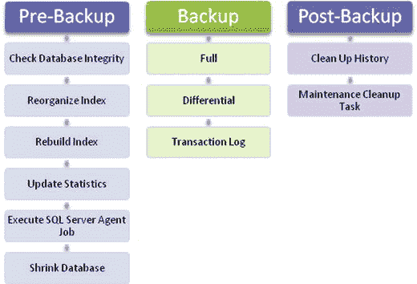

图 13-6. 场景二结构

看起来很眼熟？应该是的。这和之前的图是同一张。这清楚地暗示我们需要完成所有这些步骤。请记住，虽然我们已经定义了要运行哪些任务，但我们还需要知道何时运行它们。

请注意，在这两种情况下，我都保留了完整的备份计划不变。这是因为，即使你的数据库可能较小，但其中的数据对你的业务或最终用户来说同样重要。没有这些数据，你将丢掉工作。因此，无论数据库大小如何，数据库备份的概念都将保持不变。

我一直听到的规则是：维护工作需要在客户不使用数据库时进行。如果你的数据库是 7×24 小时使用的，那么你只需确定数据库使用最少的时间段，或者设置计划在 CPU 空闲时触发。请记住，`SQL Server` 为你提供了许多调度选项，对于你能想到的几乎任何调度问题，都会有解决方案。对于这个计划，我们将在每晚午夜触发。我们还将让不同的任务在不同的时间间隔运行，所有这些我很快会演示。

调度维护计划的另一个重要部分是，你始终可以为任务设置优先约束，我们稍后会深入讨论。这些简直是救星！它们的作用是，当你有一系列任务形成一个任务链时，你希望它们按特定顺序执行。你还可以设置任务失败、成功或完成时发生的情况。可以想象，我们将在这些步骤中设置报告和日志记录，以便我们了解任何可能影响最终用户的问题。

让我们快速看一些有趣的东西。在 `SQL Server 代理`中双击任何一个作业。我选择了 `bak Files`，但你可以选择任何一个。现在你应该看到图 13-7。

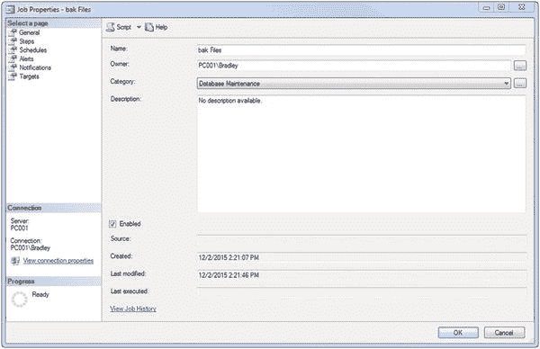

图 13-7. 作业属性

和以前一样，这有什么大不了的？点击左侧的 **步骤** 选项，并在作业步骤列表字段中展开列，如图 13-8 所示。注意到这里有什么特别之处吗？

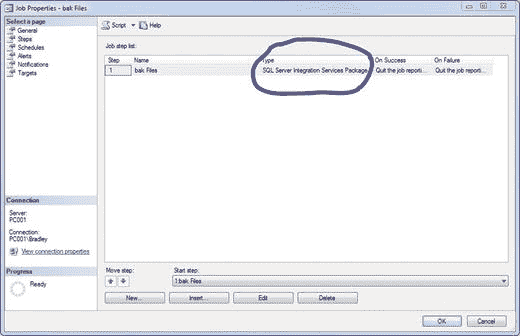

图 13-8. 作业属性，步骤选项卡

没错；这是一个 `SQL Server 集成服务` 包。我在开篇章节中简要提到过这一点。它就是这样保存在数据库中的，而我们甚至没有意识到。这开启了与数据库交互的一个全新层面，因为既然我们现在有了一个 `SSIS` 包，我们就可以把它们全部组合在一起，形成一个巨大的包。

在继续之前，我想补充一个告诫：此时你应该拥有详尽而完整的作业。我说的完整是什么意思？请仔细检查所有作业内的所有对象是否都填写了描述和名称，具体包括：

*   **常规** 选项卡：**描述** 框。
*   **步骤** 选项卡，**常规** 子选项卡：**名称** 框（点击 **编辑** 并更改“步骤名称”值）。
*   **步骤** 选项卡，**高级** 子选项卡：应选中“在历史记录中包括步骤输出”。
*   **计划** 选项卡：我们将在几分钟后删除这些，所以现在可以保留。
*   **警报** 选项卡：应为空白。
*   **通知** 选项卡：应选中 **写入 Windows 应用程序事件日志**，并选择“当作业完成时”。
*   **目标** 选项卡：应保持空白。

不应为单个任务选择通知；相反，我们将让子计划负责报告和日志记录。电子邮件是此功能的一部分，你很快就会看到。

猜猜我们接下来要做什么？

### 创建维护计划

终于到了！这是我们整本书一直在努力的目标。我们将创建一个包，作为我们从现在开始用于维护数据库的维护计划的实现。

谁认为我们会使用 `维护计划向导` 来创建这个维护计划的，请举手……？猜猜怎么着？我们不能将 `维护计划向罗` 用于此任务，因为向导专门用于创建新任务，而不是将它们组合成一个包。我们可以创建任意多的独立作业，但除非我们将它们全部放入一个包中并按不同的计划运行，否则它们永远不会协同工作。此外，让它们单独运行，而不是作为集成解决方案的一部分，无法让我们强制执行之前看到的优先约束；相反，我们只会按计划运行一个任务，并不关心或不知道它是否实际有效。

我们不会采用那种方法，而是将致力于实现健壮维护计划的定义；一个满足我们所有维护需求的一站式解决方案。这将需要对各个计划进行更多的调整，我们现在就来看一看。

### 编辑作业

鉴于这些是 `SSIS` 包，我们首先需要做的是规划包的部署。这是什么意思？这意味着每个包将作为更大包的一部分运行，内置优先约束和报告/日志记录功能，我们需要确保在将其发布到开发环境之前，所有这些都 100% 设置好。我们在将任何东西发布到生产环境之前都会进行大量测试，对吧？现在让我们看看各个作业，并根据我们的需要对它们进行调整。

回想一下，我们的作业列表如图 13-9 所示。


图 13-9. `SQL Server 代理` 作业

又是相当多的作业！这些作业中的每一个稍后都将成为包的一部分。不过现在，我们要编辑它们；所以从顶部开始，按照建议进行更改。

### 完成作业编辑

双击一个作业以显示 **常规** 页面。然后按照以下部分描述的步骤逐一进行，确保按说明进行更改。

#### 常规页面设置

**常规** 页面包含作业的所有“高级”设置。我的意思是，更抽象的属性在后续页面中进一步划分，但整个作业的通用设置都在这里。

*   **所有者** 字段应设置为数据库的所有者。
*   **类别** 应设置为 `数据库维护`。
*   输入一个简短的描述。
*   确保选中 **已启用** 复选框。

#### 步骤页面设置

点击屏幕底部的 **编辑** 按钮，在 **常规** 子选项卡上将 **步骤名称** 更改为任务名称（清理历史记录、文本文件、T-SQL 任务——作业名称，不是计划名称）。请注意，这个屏幕是新的且不同的，因为它严格涉及用于运行 `SSIS` 包的设置。目前还不需要在这里更改任何内容，所以先不用动这个区域。

点击左侧的 **高级**。这是我们定义包成功和失败操作的地方。单个包不需要输出文件，因为我们将在维护计划包级别而不是这个级别进行处理。确保选中“在历史记录中包括步骤输出”复选框。

准备好继续后，点击 **确定**。


#### 计划页面设置

通过点击屏幕底部的 **Remove** 按钮来删除计划。
执行此步骤时，你会看到如图 13-10 所示的错误。


图 13-10. 计划错误

这是预期中的情况。以下是我们将如何为未来的计划删除操作处理此问题。点击错误消息上的 **OK**，然后点击 **OK** 关闭作业界面。
首先，让我们通过运行以下查询来查看可用的计划。

```sql
SELECT * FROM msdb.dbo.sysschedules;
```

图 13-10 中的错误引用了`sysmaintplan_subplans.schedule_id`列，所以简单的答案是使用以下查询将这些值设置为`NULL`。

```sql
UPDATE msdb.dbo.sysmaintplan_subplans SET schedule_id = NULL;
```

关于这点就这些了。现在，当你去删除一个计划时，你将不会得到错误，因为所有的计划都已被移除。不过，它们仍然驻留在界面中。真烦人。

#### `sysjobschedules` 表

`msdb`数据库保存了大量关于我们作业的信息，包括分配给这些作业的计划。具体来说，我们要引用的表名为`sysjobschedules`。我们将编写一个查询来显示此表中的信息，以便我们可以在作业的上下文中查看计划及其工作原理。
这是我们用来查看该表内容的查询；请在一个新的查询窗口中运行它。

```sql
SELECT * FROM msdb.dbo.sysjobschedules ORDER BY schedule_id;
```

该查询将返回如图 13-11 所示的信息。


图 13-11. 查询结果

让我们对`sysjobschedules`和`sysjobs`表使用一点`INNER JOIN`技巧来展示正在发生的事情。为澄清起见，`sysjobschedules`保存了从`sysjobs`表引用的作业的调度信息。我们想要做的是显示`sysjobs`表中的`job_id`和`name`列，以及`sysjobschedules`表中的`schedule_id`列。以下是完整的查询。

```sql
SELECT msdb.dbo.sysjobs.job_id, msdb.dbo.sysjobs.name, sysjobschedules.schedule_id
FROM msdb.dbo.sysjobs
INNER JOIN msdb.dbo.sysjobschedules ON
sysjobschedules.job_id = msdb.dbo.sysjobs.job_id
ORDER BY msdb.dbo.sysjobs.name;
```

运行此查询。你将看到如图 13-12 所示的结果。


图 13-12. 查询结果

这样好多了！这为我们显示了剩下的可供删除的计划。让我们继续手动删除第一个计划“bak Files”，然后重新运行查询。图 13-13 显示了此查询的结果。


图 13-13. 查询结果

正如我们所想；它消失了！这说明了什么？它意味着这个表专门存储了作业的计划，因此得名`sysjobschedules`。它也告诉我们，我们现在可以清空`sysjobschedules`表的内容，这将移除我们所有的计划。
让我们快速看一下图 13-14 中`sysjobschedules`表的结构。


图 13-14. sysjobsschedules 结构

这些列中没有`IDENTITY`列，但我们可以看到那些阻止我们早先删除计划的外部约束（由 SSMS 生成的错误）。由于没有`IDENTITY`列需要担心，我建议我们使用`DELETE FROM`来清除此表。
这实际上引出了一个好点子。在从表中清除数据时，`TRUNCATE`和`DELETE FROM`有什么区别？基本上，当你使用`TRUNCATE`时，数据库引擎不处理整个事务日志，它只是清除表和页。`TRUNCATE`操作如果是事务的一部分，可以回滚。如果不是，除非从备份恢复，否则你无法取回该数据。`TRUNCATE`也会锁定表，因此不要在频繁使用的表上使用它。另一方面，`DELETE FROM`只是删除指定的信息并将其记录在事务日志中。`DELETE FROM`也不会“重启”一个表；如果你有一个带有`IDENTITY`列的表并使用`DELETE FROM`命令删除表中的所有内容，下一个插入表中的`IDENTITY`值将是下一个值——即使表中没有直接引用。这意味着如果你表中有 15 行数据；然后对该表运行`DELETE FROM`；然后插入一行新数据；`IDENTITY`列的值将是 16 而不是 1。`TRUNCATE`会“重启”该表，所以当你有 15 行数据然后`TRUNCATE`该表时，插入新行数据时`IDENTITY`列从 1 重新开始。这有很大的区别！
这并不是说你不能运行`DELETE FROM`命令并在下一行到来时将编号重置为 1。为此，在运行`DELETE FROM`语句后运行以下查询。

```sql
DBCC CHECKIDENT('[table_name].[column_name]', RESEED, 0);
```

此查询强制表将列重新设置为定义为`IDENTITY`限定符的值，在本例中为`0`。
因此，无论是在理论上还是在实践中，你都可以运行一个`DELETE FROM`语句，然后是前面的`DBCC`语句，以达到与`TRUNCATE`语句相同的结果（清除表并重置表中`IDENTITY`列的编号），不同之处在于我们能够将`DELETE FROM`和`DBCC`语句作为事务日志的一部分。
好的，让我们继续通过运行以下查询来删除`sysjobschedules`表的内容，但保留`syspolicy_purge_history`记录。从我们之前运行的`INNER JOIN`查询中获取作业 ID，并将其插入以下查询中运行。

```sql
DELETE FROM msdb.dbo.sysjobschedules WHERE job_id = 'F74BC679-83F7-4F20-B816-9E12A630EAF1';
```

这就是你需要做的全部。记住，没有`IDENTITY`列需要担心重新设置种子，所以该命令将完成我们对此表所需的一切：清除计划。如果你打开列表中的下一个作业“Cleanup History”，注意“计划”选项卡中明显缺少计划。打开任何一个检查一下；它们都消失了。干得好！

#### 警报页面设置

此页面应为空白。没关系，因为我们将从包中处理日志记录和报告，而不是从单个任务处理。

#### 通知页面设置

这是我们之前设置通知的地方。不过，现在应该像上面的“计划”部分一样被清空。我们不需要发送电子邮件，但我建议保留选中的 **Write to the Windows Application event log** 选项，并使用 **“When the job completes”** 值。这样，每当作业完成（无论是 **On Success** 还是 **On Failure**），它都会被输入到事件日志中。

#### 目标页面设置

此页面默认为空白。保持空白。


### 保存更改

点击“确定”以保存您所做的所有更改，这样就完成了作业的最终确定。为每个作业重复最终确定过程，除了名为 `E-mail User Information` 的作业。让那个作业保持原样。

我们不打算处理标题为 `E-mail User Information` 的作业，因为它专门用于展示 `SQL Server Agent` 作业任务的工作方式。为了防止此作业触发，只需右键单击它并选择 `禁用` 来禁用该任务。禁用后，您应该会看到如图 13-15 所示的界面。


**图 13-15.** 禁用作业

另请注意，该作业现在在 `作业` 文件夹中有一个红色的向下小箭头，如图 13-16 所示。


**图 13-16.** 显示已禁用作业的 `SQL Server Agent`

此图标可一目了然地显示该作业已禁用。

## 检查您的计划需求

我们已经配置了要添加到维护计划中的任务。让我们回顾一下维护计划的计划需求应该是什么样子（参见图 13-17）。请记住，我们也遵循方案 2，即我们将使用尽可能多的维护任务来对数据库进行适当的维护。


**图 13-17.** 方案 2 结构

正如您所见，我将两个 `索引` 任务都保留在里面了。还记得我之前说过在一个计划中不需要两者吗？我将在不同的时间运行它们；这就是为什么它们都像那样放在里面。

### 将任务添加到计划中

准备好开始组装您的计划了吗？我们开始吧！

展开 `维护计划` 文件夹并查找 `备份维护计划`。双击它，您应该会看到如图 13-18 所示的界面。


**图 13-18.** `备份维护计划` 设计面

遗憾的是，`子计划` 名称不会保留，而且由于我们删除了计划，我们需要快速更新这些信息。双击 `子计划` 名称以更新信息，并注意当您单击不同的 `子计划` 时设计面如何变化。这有助于您为它们适当地命名；`Subplan_1` 是 `备份数据库（完整）`，`Subplan_2` 是 `备份数据库（差异）`，`Subplan_3` 是 `备份数据库（事务日志）`。使用界面更新它们，然后输入计划。

还记得我们为备份设置的计划吗？完整备份在午夜进行，差异备份每 6 小时一次，事务日志备份每小时一次。将这三个任务的计划设置为这些值。您最终应该会看到如图 13-19 所示的界面。


**图 13-19.** `备份维护计划` 计划

请注意，计划现已设置好，`子计划` 名称已更新，并且它们都设置为以 `SQL Server Agent` 服务帐户运行。

我们现在要做的是将剩余的任务添加到此维护计划中。可以很有把握地说，我们将坚持使用图 13-19 中所示的三个备份计划作为我们备份的标准，并且我们所有的维护活动都将在那三个时间窗口内完成。并非所有维护任务，而是一些在不同时间出于不同原因执行的任务。因此，我们将把所需的任务添加到三个备份任务中的每一个，并强制执行优先级约束。

另外，当您保存 `备份维护计划` 时，作业名称会被更新。这太不方便了！我们稍后可以再次更新这些。

#### 完整备份维护活动

我们希望在午夜的完整备份中运行哪些任务？老实说，大部分都要运行。对于大多数安装来说，午夜可能是运行维护活动的好时机，因为用户在线的可能性微乎其微。

具体来说，我们希望按以下顺序运行以下作业：

*   `检查完整性`
*   `重建索引`
*   `收缩数据库`
*   `更新统计信息`
*   `备份维护计划.备份数据库（完整）`
*   `清理历史记录`
*   `bak` 文件
*   `txt` 文件
*   `trn` 文件

这些任务将在每晚午夜运行。将它们添加到现有的备份计划中在此时是微不足道的，因为它们已经创建好了。怎么做？`SQL Server` 为我们提供了在不同环境中做事的许多不同方法。在这种情况下，我们将把已经创建的作业添加到现有的 `备份维护计划` 中，并继续操作。这意味着几件事，所以在继续之前让我们快速回顾一下。

*   不要删除“旧”的维护计划。原始作业（将被添加到 `备份维护计划` 中）仍然链接到那些原始的维护计划。
*   不要删除作业。

换句话说，仅仅因为我们正在将作业添加到维护计划中，您不应该假设对原始计划的引用就不存在了。只要它的结构如我们所设，引用就会保留。稍后，我们将导出完成的计划并回顾如何恢复它们。然后您将确切看到这些引用如何协同工作以创建您现在所知的维护计划。

#### 添加检查完整性任务

单击如图 13-19 所示的 `备份数据库（完整）` 子计划。这将显示设计面上的 `备份数据库（完整）` 任务，也如图 13-18 所示。现在，从工具栏中单击并拖动 `执行 SQL Server Agent 作业` 到设计面上。此时，您应该会看到如图 13-20 所示的界面。


**图 13-20.** `备份维护计划` 设计面

这仅仅表明我们在那里有一个通用的 `SQL Server Agent` 作业任务，但我们尚未定义任务。为此，请双击设计面上的任务。猜猜会出现什么？图 13-21 是一个很大的提示。


**图 13-21.** `执行 SQL Server Agent 作业任务`

看哪！我们已经创建的所有作业都排列整齐，看起来美观大方（在我对作业名称列排序之后）。这有多酷？这意味着我们不必返回去重新创建已经完成的工作；我们可以直接在这里添加它们就完成了。您现在很高兴您付出了所有的努力吗？既然我已经对作业进行了排序，请继续单击 `检查完整性` 旁边的复选框，然后单击 `确定`。您现在应该看到如图 13-22 所示的内容。


**图 13-22.** 设计面阶段上的 `执行 SQL Server Agent 作业任务`

这向我们显示该任务已更新为现有的 `检查完整性` 任务。如果您在顶部的任务名称上长按单击，则可以将其更改为 `检查完整性`，如图 13-23 所示。


**图 13-23.** 设计面阶段上的 `执行 SQL Server Agent 作业任务`（已更新）

现在我可以轻松地看到这个任务是什么了。此时，您需要稍微重新组织一下您的设计面。看到备份任务在左上角很远的地方了吗？只需将其拖到更靠近中间的位置，然后将 `检查完整性` 任务拖到它上面。您最终应该看起来类似于图 13-24。


**图 13-24.** 设计面阶段上的 `执行 SQL Server Agent 作业任务`（已完成）


### 添加“重新生成索引”任务

和之前一样，从工具栏中点击并拖动 `执行 SQL Server 代理作业` 到设计界面，但这次，将其放在 `检查完整性` 任务和 `备份` 任务之间。最终结果应类似于图 13-25。


图 13-25. 设计界面阶段的 `执行 SQL Server 代理作业任务`

双击我们刚刚添加的任务，从列表中选择 `重新生成索引` 任务，然后单击“确定”。长按并更改任务的名称。完成后，你应该看到图 13-26。


图 13-26. 设计界面阶段的 `执行 SQL Server 代理作业任务`（已完成）

### 添加“收缩数据库”任务

从工具栏中点击并拖动 `执行 SQL Server 代理作业` 到设计界面，但这次，将其放在 `重新生成索引` 任务和 `备份` 任务之间。最终结果应类似于图 13-27。


图 13-27. 设计界面阶段的 `执行 SQL Server 代理作业任务`

双击我们刚刚添加的任务，从列表中选择 `收缩数据库` 任务，然后单击“确定”。通过长按并更新来修改任务的名称。完成后，你应该看到图 13-28。


图 13-28. 设计界面阶段的 `执行 SQL Server 代理作业任务`（已完成）

### 添加“更新统计信息”任务

从工具栏中点击并拖动 `执行 SQL Server 代理作业` 到设计界面，但这次，将其放在 `收缩数据库` 任务和 `备份` 任务之间。最终结果应类似于图 13-29。


图 13-29. 设计界面阶段的 `执行 SQL Server 代理作业任务`

双击我们刚刚添加的任务，从列表中选择 `更新统计信息` 任务，然后单击“确定”。通过长按并更新来修改任务的名称。完成后，你应该看到图 13-30。


图 13-30. 设计界面阶段的 `执行 SQL Server 代理作业任务`（已完成）

### 添加“清理历史记录”任务

从工具栏中点击并拖动 `执行 SQL Server 代理作业` 到设计界面，但这次，将其放在底部 `备份数据库（完整）` 任务之后。最终结果应类似于图 13-31。


图 13-31. 设计界面阶段的 `执行 SQL Server 代理作业任务`

双击我们刚刚添加的任务，从列表中选择 `清理历史记录` 任务，然后单击“确定”。通过长按并更新来修改任务的名称。完成后，你应该看到图 13-32。


图 13-32. 设计界面阶段的 `执行 SQL Server 代理作业任务`（已完成）

### 添加“bak 文件”任务

从工具栏中点击并拖动 `执行 SQL Server 代理作业` 到设计界面，但这次，将其放在底部。最终结果应类似于图 13-33。


图 13-33. 设计界面阶段的 `执行 SQL Server 代理作业任务`

双击我们刚刚添加的任务，从列表中选择 `bak 文件` 任务，然后单击“确定”。通过长按并更新来修改任务的名称。完成后，你应该看到图 13-34。


图 13-34. 设计界面阶段的 `执行 SQL Server 代理作业任务`（已完成）

### 添加“txt 文件”任务

从工具栏中点击并拖动 `执行 SQL Server 代理作业` 到设计界面，但这次，将其放在底部。最终结果应类似于图 13-35。


图 13-35. 设计界面阶段的 `执行 SQL Server 代理作业任务`

双击我们刚刚添加的任务，从列表中选择 `txt 文件` 任务，然后单击“确定”。通过长按并更新来修改任务的名称。完成后，你应该看到图 13-36。


图 13-36. 设计界面阶段的 `执行 SQL Server 代理作业任务`（已完成）

### 添加“trn 文件”任务

从工具栏中点击并拖动 `执行 SQL Server 代理作业` 到设计界面，但这次，将其放在底部。最终结果应类似于图 13-37。


图 13-37. 设计界面阶段的 `执行 SQL Server 代理作业任务`

双击我们刚刚添加的任务，从列表中选择 `trn 文件` 任务，然后单击“确定”。通过长按并更新来修改任务的名称。完成后，你应该看到图 13-38。


图 13-38. 设计界面阶段的 `执行 SQL Server 代理作业任务`（已完成）

我们稍后会重新整理这些，别担心。

#### 差异备份维护活动

除了每 6 小时运行一次的差异备份之外，我们还想运行哪些任务？我们希望这有点像一个刷新期；可以说是快速的饮水休息时间。

具体来说，我们想按以下顺序运行这些作业：

*   `检查完整性`
*   `重新组织索引`
*   `收缩数据库`
*   `更新统计信息`
*   `备份维护计划.差异备份`

等等。这大部分是相同的列表！是的，因为每次备份数据库时，都需要执行大部分相同的操作。主要区别在于我们使用的是 `重新组织` 任务，而不是 `重新生成` 任务，并且我们不清理维护文件或历史记录。这些只在午夜进行，以确保我们与备份计划保持同步。还记得重新组织和重新生成索引的区别吗？`重新组织` 保持酒店已建好，而 `重新生成` 则将其拆除并全新重建。当我们只需运行一个快速的 `重新组织` 任务然后继续时，不需要花时间去重建。这并没有牺牲什么，因为夜间重建已经处理了这个额外步骤。

添加这些任务将与上一部分非常相似，因此如有必要，请随意添加它们并继续前进。


### 添加完整性检查任务

如图 13-39 所示，单击 `备份数据库（差异）` 子计划。这将在设计图面上显示 `备份数据库（差异）` 任务，如图 13-39 所示。


图 13-39. 备份维护计划设计图面

现在，从工具栏单击并拖动 `执行 SQL Server 代理作业` 到设计图面上。此时，您应该看到图 13-40。


图 13-40. 执行 SQL Server 代理作业任务

双击设计图面上的任务，勾选 `数据库完整性计划.检查完整性` 旁边的复选框，然后单击 `确定`。通过长按任务来更新名称。如果您长按顶部的任务名称，可以将其更改为 `检查完整性`，如图 13-41 所示。


图 13-41. 设计图面上的执行 SQL Server 代理作业任务

此时，您需要稍微重新整理一下您的设计图面。看到备份任务远在左上角了吗？只需将其拖到更靠中间的位置，然后将 `检查完整性` 任务拖到它的上方。最终您看到的布局应与图 13-42 类似。


图 13-42. 设计图面上的执行 SQL Server 代理作业任务（已更新）

#### 添加重新组织索引任务

和之前一样，从工具栏单击并拖动 `执行 SQL Server 代理作业` 到设计图面上，但这次将其放置在 `检查完整性` 任务和备份任务之间。最终您看到的布局应与图 13-43 类似。


图 13-43. 设计图面上的执行 SQL Server 代理作业任务

双击我们刚刚添加的任务，从列表中选择 `重新组织索引` 任务，然后单击 `确定`。长按并更改任务的名称。完成后，您应该看到图 13-44。


图 13-44. 设计图面上的执行 SQL Server 代理作业任务（已更新）

#### 添加收缩数据库任务

从工具栏单击并拖动 `执行 SQL Server 代理作业` 到设计图面上，但这次将其放置在 `重建索引` 任务和备份任务之间。最终您看到的布局应与图 13-45 所示类似。


图 13-45. 设计图面上的执行 SQL Server 代理作业任务

双击我们刚刚添加的任务，从列表中选择 `收缩数据库` 任务，然后单击 `确定`。通过长按并更新来更改任务的名称。完成后，您应该看到图 13-46。


图 13-46. 设计图面上的执行 SQL Server 代理作业任务（已更新）

#### 添加更新统计信息任务

从工具栏单击并拖动 `执行 SQL Server 代理作业` 到设计图面上，但这次将其放置在 `收缩数据库` 任务和备份任务之间。最终您看到的布局应与图 13-47 类似。


图 13-47. 设计图面上的执行 SQL Server 代理作业任务

双击我们刚刚添加的任务，从列表中选择 `更新统计信息` 任务，然后单击 `确定`。通过长按并更新来更改任务的名称。完成后，您应该看到图 13-48。


图 13-48. 设计图面上的执行 SQL Server 代理作业任务（已更新）

#### 事务日志备份维护活动

我们想在每小时运行的事务日志备份之外，同时运行哪些任务呢？这是最难的部分，因为我们不想给服务器带来太大负担，但又希望能够执行必要的维护。

具体来说，我们希望按以下顺序运行以下任务：

*   `数据库完整性计划.检查完整性`
*   `重新组织索引计划.重新组织索引`
*   `收缩数据库计划.收缩数据库`
*   `更新统计信息计划.更新统计信息`
*   `备份维护计划.事务日志备份`

添加这些任务的过程将与上一部分非常相似，因此如果需要，您可以自行添加它们并跳过后续步骤。

### 添加完整性检查任务

如图 13-49 所示，单击 `备份数据库（事务日志）` 子计划。这将在设计图面上显示 `备份数据库（事务日志）` 任务，如图 13-49 所示。


图 13-49. 备份维护计划设计图面

现在，从工具栏单击并拖动 `执行 SQL Server 代理作业` 到设计图面上。此时，您应该看到图 13-50。


图 13-50. 设计图面上的执行 SQL Server 代理作业任务

双击设计图面上的任务，勾选 `数据库完整性计划.检查完整性` 旁边的复选框，然后单击 `确定`。通过长按任务来更新名称。如果您长按顶部的任务名称，可以将其更改为 `检查完整性`，如图 13-51 所示。


图 13-51. 设计图面上的执行 SQL Server 代理作业任务（已更新）

此时，您需要稍微重新整理一下您的设计图面。看到备份任务远在左上角了吗？只需将其拖到更靠中间的位置，然后将 `检查完整性` 任务拖到它的上方。最终您看到的布局应与图 13-52 类似。


图 13-52. 设计图面上的执行 SQL Server 代理作业任务（已完成）

#### 添加重新组织索引任务

和之前一样，从工具栏单击并拖动 `执行 SQL Server 代理作业` 到设计图面上，但这次将其放置在 `检查完整性` 任务和备份任务之间。最终您看到的布局应与图 13-53 类似。


图 13-53. 设计图面上的执行 SQL Server 代理作业任务

双击我们刚刚添加的任务，从列表中选择 `重新组织索引` 任务，然后单击 `确定`。长按并更改任务的名称。完成后，您应该看到图 13-54。


图 13-54. 设计图面上的执行 SQL Server 代理作业任务（已更新）


#### 添加收缩数据库任务

从工具栏中单击并拖动 `Execute SQL Server Agent Job` 到设计台面，但这次将其放置在“重新生成索引”任务和“备份”任务之间。最终结果应与图 13-55 类似。


图 13-55. 设计台面上的执行 SQL Server 代理作业任务

双击我们刚刚添加的任务，从列表中选择 `Shrink Database` 任务，然后单击“确定”。通过长按并更新来修改任务名称。完成后，您应该看到如图 13-56 所示的界面。


图 13-56. 设计台面上的执行 SQL Server 代理作业任务（已更新）

#### 添加更新统计信息任务

从工具栏中单击并拖动 `Execute SQL Server Agent Job` 到设计台面，但这次将其放置在“收缩数据库”任务和“备份”任务之间。最终结果应与图 13-57 所示内容类似。


图 13-57. 设计台面上的执行 SQL Server 代理作业任务

双击我们刚刚添加的任务，从列表中选择 `Update Statistics` 任务，然后单击“确定”。通过长按并更新来修改任务名称。完成后，您应该看到如图 13-58 所示的界面。


图 13-58. 设计台面上的执行 SQL Server 代理作业任务（已更新）

至此，维护计划的三个部分已就位。但我们还没有为刚刚添加的作业设置计划。维护计划如何知道何时执行这些包呢？

通过利用……

## 前置约束

什么是前置约束？基本上，前置约束是基于表达式或约束的结果来确定任务执行路径的机制。使用前置约束允许我们根据任务的执行状态分配通过、失败或成功值。

例如，假设我们为某个任务设置了一个“成功”约束和一个“失败”约束。我们可以将“失败”约束的结果定义为一个“通知操作员”任务，而将“成功”约束之后定义另一个任务，或者让它正常结束执行。在维护计划工作流中强制执行前置约束将极大地增强对正在运行的任务及其执行条件的可见性。

让我们从完整备份任务开始。首先，稍微分开您的任务，如图 13-59 所示。为自己留出一些工作空间。这里有九个任务，所以会占用相当大的空间。请注意黄色高亮部分，它展示了如何组织这些任务。


图 13-59. 完整备份前置约束映射

单击“检查完整性”，任务底部会出现一个绿色小箭头。单击该箭头并将其拖动到设计台面上的“重新生成索引”任务。完成后，您应该看到如图 13-60 所示的内容。


图 13-60. 完整备份前置约束（已更新）

当它连接到任务时，会有点吸附效果，不是吗？这样很好，可以让您清楚它指向哪里。

现在，如果您双击那条绿线，会看到图 13-61。


图 13-61. 前置约束编辑器

这被称为“前置约束编辑器”。让我们花点时间看看这些约束。

### 约束选项

约束选项允许我们定义要评估的操作，以及在发现已评估的约束时要采取的操作。我们需要选择一个约束和/或一个表达式进行评估，然后根据约束或表达式的值定义返回值，以便我们捕获条件并相应地进行计划。以下列表对此进行了更详细的说明。

*   评估操作
    *   `Constraint`
    *   `Expression`
    *   `Constraint and Expression`
    *   `Constraint or Expression`
*   值
    *   `Success`：作业成功执行，无错误
    *   `Failure`：作业失败并导致错误
    *   `Completion`：作业完成，无论成功或失败


### 多个约束

是的，任务上可以存在多个约束。这为我们解释任务提供了更大的灵活性，如下所列。

*   **逻辑与 (Logical AND)**：所有语句都必须评估为真 (TRUE)。
*   **逻辑或 (Logical OR)**：必须有一个约束评估为真 (TRUE)。

**逻辑与** 意味着我们可以在任务中定义大量约束，并且所有这些约束都必须评估为真。

**逻辑或** 意味着我们可以在任务中定义大量约束，且必须有任意一个约束评估为真。这意味着，在一个基于 N 个约束的列表中，1 到 N 个约束必须为真，但始终至少要有一个为真，否则任务失败。

老实说，大部分内容可以保持原样。我们需要一个 `Success` 约束，而默认设置正是如此。这并不是说您不能更新此区域以实现所需功能，但就本目的而言，我们不需要更新任何内容，因此单击“确定”。

看起来您也可以添加多个约束。单击 `Check Integrity` 任务，会出现另一个小绿色箭头。将其拖到 `Rebuild Index` 任务上。您应该看到如图 13-62 所示的内容。


*图 13-62. 优先约束错误*

好吧，看起来不行。这引发了一个疑问：为什么 SSMS 一开始就给我们这个选项，但那是另一个话题了。不过没关系，因为我们已经设置好了我们的约束。

现在，对完整备份计划中的每个任务都执行此操作，如图 13-63 所示。请记住，您唯一需要的约束是 `Success` 约束。


*图 13-63. 完整备份优先约束*

图 13-64 展示了您的差异备份计划应有的样子。


*图 13-64. 差异备份优先约束*

而图 13-65 展示了您的事务日志备份计划应有的样子。


*图 13-65. 事务日志备份优先约束*

我们可以看到，每个任务现在都有了一个字面上的工作流。每个任务都导向下一个任务，如果失败，则会被记录。

说到日志记录，对于此维护计划的报告和日志记录，我们有哪些选项？很高兴您问这个问题！单击任务栏中的 `Reporting and Logging` 按钮，如图 13-66 所示。


*图 13-66. 报告和日志记录按钮*

单击该按钮会打开如图 13-67 所示的界面。


*图 13-67. 报告和日志记录*

这是默认屏幕。看；当维护计划操作运行时，我们可以生成新的文本文件报告，并且可以如图 13-68 所示向操作员发送电子邮件。


*图 13-68. 报告和日志记录（已更新）*

这非常方便！更新界面后，单击“确定”继续。现在保存您的工作，沉浸在即将完成的维护计划的荣耀中。

请注意，由于我们已进行设置，这些报告和日志记录设置将强制应用于备份维护计划中的所有子计划。这是一件好事，因此我们无需反复设置。或者，这也意味着，如果您需要在这些限制之外进行报告或日志记录，则必须创建一个具有不同报告和日志记录设置的新维护计划。

让我们快速回顾一下我们已完成的工作。

*   我们将相关任务添加到了现有的备份维护计划中。
*   我们按照之前决定的顺序在任务上添加了优先约束。
*   我们向维护计划添加了报告和日志记录。

这简单地意味着，备份维护计划的子计划在其计划时间运行，从第一个任务开始，到最后一个任务结束。完成后，将发送一封附有维护文本报告的电子邮件。`SQL Server Agent` 也会在其历史日志中记录此信息。无论失败还是成功，操作员都会收到警报。

### 测试维护计划

现在一切就绪，让我们对其进行一些测试。我们已将操作员设置为接收通知，因此我们应该能够直接运行维护计划，然后等待通知。

请记住，这将按任务顺序运行所有内容，即所有任务。我们希望从完整备份开始，然后运行差异备份，最后运行事务日志备份。您不能直接右键单击“维护计划”，因为其中有三个子计划。相反，在 `SQL Server Agent` 的“作业”文件夹中，右键单击 `Backup Maintenance Plan.Backup Database (Full)` 作业，选择“在步骤…开始作业”，并观察如图 13-69 所示的内容。


*图 13-69. 开始作业*

到目前为止看起来不错。

退一步，现在运行差异作业，查看如图 13-70 所示的内容。


*图 13-70. 开始作业*

让我们运行事务日志作业，查看如图 13-71 所示的内容。


*图 13-71. 开始作业*

干得漂亮。如果您已按照步骤操作，那么您可能已经收到了相当多的详细描述维护活动的电子邮件。花几分钟时间熟悉这些电子邮件，并知道您要查找什么。这样，在未来，您可以快速扫描电子邮件以获取所需信息。您还可以决定是否利用在维护活动完成时发送电子邮件的便利性，或者完全绕过此通知。最终，作为数据库管理员，这是您的选择。幸运的是，您刚刚学会了如何快速调整维护计划的设置以包含或移除步骤和通知！

这证明我们现在已经实现了在数据库中创建完整维护计划的目标，该计划将处理几乎所有日常维护活动。请记住，这些作业可以通过从 `SQL Server Agent` 运行随时执行。或者，您也可以使用脚本运行作业，这可能更适合您。为此，让我们先查看脚本，然后理解它的作用。

## 从 T-SQL 脚本启动作业

启动作业的脚本相对简单，大致如下：

```
EXEC msdb.dbo.sp_start_job @job_name=N'Backup Maintenance Plan.Backup Database (Transaction Log)';
```

在这个例子中，我想要启动事务日志作业。在“新建查询”窗口中输入此查询并按 F5 执行，你将看到如下状态。


关于这个脚本的一点说明：它是一个存储过程，针对 `msdb` 数据库中的 `sysjobs` 表运行启动命令。要查看这个表，只需在“新建查询”窗口中输入以下查询并按 F5。

```
SELECT * FROM msdb.dbo.sysjobs;
```

图 13-72 展示了该查询返回的结果。


图 13-72. 查询结果

看起来很熟悉吧？这就是我们创建的所有作业，还有一些详细信息。挺酷的！

现在，打开 SQL Server 代理中的“作业活动监视器”。图 13-73 展示了此时你应该看到的内容。


图 13-73. 作业活动监视器

嗯，我们所有的作业都在这里，排列整齐，告诉我们各种无用的信息。你可以看到除了 `E-mail User Information`，其他所有作业都已启用。它们都处于 `空闲` 状态，意味着当前没有在运行。它们上次运行时都成功了。如果你向右滚动，会看到 `上次运行` 和 `下次运行` 列。猜猜这些告诉你什么？这是快速查看你的作业是否正常运行的好方法。如果作业有问题，就在这里可以发现。你可以在这里右键单击任何作业并进行一些破坏性操作，所以请清楚自己在做什么。

> **提示**
> 需要注意的是，你不应删除额外的维护计划。它们与所包含的作业是绑定的，如果你删除了维护计划，就会连带删除对应的作业。猜猜那时会发生什么？笨蛋帽子。你猜对了。

在我们结束之前，还有一件事。在 `SSMS 对象资源管理器` 中，单击 `连接` 并连接到 `Integration Services`。如果你无法连接到 `Integration Services`，那么只需以管理员身份启动 `SSMS`，应该就可以了。

展开 `存储的包` 文件夹，然后是 `MSDB`，接着是 `维护计划`。此时你应该看到如图 13-74 所示的内容。


图 13-74. Integration Services 维护计划

右键单击我们的 `Backup Maintenance Plan` 并选择 `导出包…`。随后将出现图 13-75。


图 13-75. 导出包

我们想将包路径更改为 `E:\SQL Server` 下的一个新文件夹，所以我们称它为 `DTSX`。这意味着我们的维护计划备份位置将是 `E:\SQL Server\DTSX\Backup Maintenance Plan.dtsx`，所以输入这个路径，然后单击 `确定`。其他所有设置保持原样即可。如果你检查那个目录，会看到那个文件现在就在里面。你甚至可以双击这些 `.dtsx` 文件来执行它们。

为所有其他维护计划也执行此操作，以防万一。现在，我们已经备份了我们完成的所有工作，以防原始文件发生意外。

让我们测试一下！哦，看，一个恶意用户闯入了数据库并删除了 `Update Statistics Plan` 维护计划。看图 13-76——它消失了！


图 13-76. 维护计划

真糟糕，图 13-77 显示作业也不见了！


图 13-77. SQL Server 代理作业

我们该怎么办呢？哦对了，我们做了备份。我们能轻松地把它加回来吗？能。


### **导出与导入维护计划包**

连接到 Integration Services 并检查“维护计划”文件夹。它也不见了。不过不用担心；只需右键单击此文件夹并选择“导入包…”，即可显示图 13-78。


**图 13-78. 导入包**

单击“包路径”旁边的省略号按钮，导航到我们的 `DTSX` 文件夹位置，`E:\SQL Server\DTSX`。选择 `Update Statistics Plan.dtsx` 继续。您的界面现在应该如图 13-79 所示。


**图 13-79. 导入包（已更新）**

单击“确定”并刷新此文件夹，我们的计划就回来了，如图 13-80 所示。


**图 13-80. Integration Services 维护计划**

去查看数据库引擎中的“维护计划”和“作业”文件夹。在图 13-81 或图 13-82 中看到什么有趣的东西了吗？


**图 13-82. SQL Server Agent 作业**


**图 13-81. 维护计划**

所以它添加了维护计划，但没有添加作业？是的。但我们还没完成。

再次回到 `Integration Services` 部分，右键单击 `Update Statistics Plan` 并选择“导出包…”，这将打开如图 13-83 所示的界面。


**图 13-83. 导出包**

我们不打算将其导出到文件系统；这对于我们要完成的任务没有意义。相反，更新您的界面以显示图 13-84 中的值。对于“包路径”值，单击省略号，展开 `MSDB`，单击“维护计划”，然后单击“确定”。


**图 13-84. 导出包（已更新）**

完成后单击“确定”。接下来，您将看到一个如图 13-85 所示的弹出窗口。


**图 13-85. 导出包警告**

在这里单击“是”，以便替换当前包。

回到数据库引擎实例，再次刷新您的“维护计划”文件夹。您可以在图 13-86 中看到计划回来了。


**图 13-86. 维护计划**

仍然没有作业。很奇怪，对吧？还有最后一步，年轻的绝地武士。

即使刷新“作业”文件夹，它也不会在那里。您需要先打开计划，然后从那里开始。双击“维护计划”中的 `Update Statistics Plan`，显示如图 13-87 所示的界面。


**图 13-87. 更新统计信息计划**

双击“子计划名称”并将其更新为图 13-88 所示的内容。


**图 13-88. 子计划属性**

现在保存计划，然后回去查看您的“作业”文件夹，如图 13-89 所示。


**图 13-89. SQL Server Agent 作业**

它在那里！不过，您需要将名称从 `Update Statistics Plan.Update Statistics` 更改为 `Update Statistics`。完成后，您应该会看到如图 13-90 所示的更新界面。


**图 13-90. SQL Server Agent 作业（已更新）**

让我们验证一下它是否已恢复到之前的状态。

双击 `Backup Maintenance Plan`，然后双击设计阶段中的“更新统计信息”任务。然后您应该看到如图 13-91 所示的界面。


**图 13-91. 执行 SQL Server Agent 作业任务**

就在最下面那里……太棒了！我们已成功恢复了保存的包。

### **总结**

哇！我们将本书过程中学到的所有知识整合成一个连贯的计划。让我们快速回顾一下本章向我们展示的内容。

*   我们为备份计划上的每个时间片创建了单独的维护计划，每个计划在不同的时间运行不同的任务。
*   我们在每个维护计划中的任务上强制实施了优先级约束。
*   我们设置了任务的报告和记录功能，并在每个任务完成时发送电子邮件。
*   我们学习了如何用脚本启动作业。
*   我们简要了解了“作业活动监视器”及其重要性。

在结束之前，让我们研究几件事：

*   我们本可以在不设置各章中的计划的情况下完成本书的所有练习，但这不会引导您了解本章中计划如何与查询协同工作的知识。我希望您，作为读者，理解这些计划不仅仅是任意值，而是整体维护策略的一部分，应如此对待。
*   我们也可以主要在设计图面上使用“备份维护计划”来完成本书的大部分内容，但这同样不会让您获得关于“为什么”而不仅仅是“如何”的知识。您当然可以这样做——如果您愿意，可以回到设计图面来完成——因为那在您的空闲时间会是一个很好的练习。但最终，您需要回到 SQL Server Agent 的作业部分来配置实际的作业，这就是为什么我让您像我们这样完成它的原因。

恭喜！您现在已经完成了本书的核心内容（豆腐和羽衣甘蓝）。我希望您现在已经建立了一个功能齐全的维护计划，并且已经开始梦想如何扩展这些新获得的知识。


## 索引

## A, B

*   备份清理任务
*   基于扩展名特定文件维护任务计划属性删除备份文件
*   备份数据库任务
*   B-树结构
*   大容量日志恢复模型

## C

*   检查数据库完整性任务

## D

*   数据库管理员 (DBA)
*   数据库备份
    *   备份类型 绝对理想 差异 完全 理想 设置 vs. 恢复模型
    *   事务日志 维护计划
    *   差异备份配置
    *   完全备份配置 作业属性
    *   事务日志备份配置
    *   恢复模型 vs. 备份类型 大容量日志 完全 简单 恢复模型
*   数据库一致性历史报告
*   数据库完整性
    *   数据库一致性报告定义 维护计划
    *   检查完整性任务 作业计划
    *   维护任务 计划属性 报告选项 SQL Server Agent 向导
    *   结构完整性
*   数据库成熟度 DEVTEST
*   差异备份
*   分布统计信息
    *   描述 维护任务 计划属性 报告选项
    *   扫描类型 SQL Server Agent 作业
    *   任务顺序 更新统计信息任务
    *   更新类型 向导进度

## E

*   执行 SQL Server Agent 作业任务
*   执行 T-SQL 任务

## F, G

*   完全备份
*   完全恢复模型

## H

*   堆表
*   历史清理任务

## I, J, K

*   索引
    *   B-树结构 类别
    *   聚集索引 定义
    *   删除对象 维护计划 新索引
    *   非聚集索引 主键索引 属性
    *   重建 vs. 重组 存储选项
*   接口

## L

*   日志清理任务
    *   维护任务 计划属性 报告选项 SQL server agent 作业 向导进度

## M, N

*   维护清理任务
    *   备份清理任务 vs. 历史清理任务
    *   日志清理任务 维护计划
    *   文本文件清理任务
*   维护计划
    *   备份阶段 复杂性 创建
    *   数据库备份 差异备份配置 完全备份配置 作业属性 事务日志备份配置
    *   数据库完整性 检查完整性任务 作业计划 维护任务 计划属性 报告选项 SQL Server Agent 向导
    *   数据库成熟度 DBA 描述
    *   设计界面 任务选项 vs. 向导界面
    *   DML 语句 索引 规划
    *   备份后阶段 备份前阶段 优先级约束 约束选项 编辑器 完全备份 多个约束 原则
    *   重组索引
    *   设置 SQL Server Agent 作业
    *   SQL Server Integration Services 包结构 测试
    *   T-SQL 脚本 导出包 导入包
*   Integration Services 维护计划
*   作业活动监视器
*   查询结果
*   SQL Server Agent 作业 子计划属性
*   更新统计信息计划
*   向导界面 任务

## O

*   通知数据库操作员
    *   维护计划 本地服务器连接 Net Send 操作员
    *   通知操作员任务
    *   寻呼机操作员 SQL Server Agent 作业 子计划属性
    *   操作员 配置文件 配置任务 维护计划 配置文件 安全 SQL Server Agent 作业
    *   通知操作员任务

## P, Q

*   寻呼机操作员
*   优先级约束
*   主键索引

## R

*   重建索引任务
*   重建索引
*   重组索引任务
*   重组索引 维护计划 计划属性 报告选项 SQL server agent 作业 任务顺序 向导进度 vs. 重建

## S

*   收缩数据库任务
    *   磁盘空间考虑事项 磁盘使用情况报告
    *   维护计划 计划属性 报告选项 SQL Server Agent 作业 任务顺序 向导进度
    *   事务日志
*   简单恢复模型
*   SQL Server Agent 作业
    *   高级选项 警报选项
    *   SQL Server 事件警报
    *   SQL Server 性能条件警报
    *   WMI 事件警报
    *   警报页面设置 警报选项卡
    *   常规选项 响应
    *   备份 维护计划 差异备份 检查完整性任务 重组索引任务 收缩数据库任务 更新统计信息任务 禁用作业
    *   分布统计信息 编辑 电子邮件帐户设置 配置任务 配置向导 启用邮件配置文件 界面选项 新配置文件 配置文件安全 发送测试电子邮件 SMTP 帐户 在 SSMS 中 系统参数
    *   完全备份 bak 文件任务 检查完整性任务 清理历史任务 重建索引任务 收缩数据库任务 trn 文件任务 txt 文件任务 更新统计信息任务
    *   常规选项 常规页面设置 Gmail 的 SMTP 帐户设置 配置向导 数据库邮件帐户 转发和 POP/IMAP 管理配置文件安全 配置文件设置 服务器访问 系统参数 配置 测试
    *   作业创建 通知 通知页面设置 通知数据库操作员
    *   查询 计划需求 计划页面设置 计划选项
    *   收缩数据库 步骤选项 步骤页面设置
    *   sysjobschedules 表创建 目标 目标页面设置
    *   事务日志备份 检查完整性任务 收缩数据库任务 更新统计信息任务 事务日志备份 重组索引任务
*   执行 `TRUNCATE` 和 `DELETE FROM` T-SQL 语句
*   SQL Server Agent 日志，清理历史 清理任务 维护作业计划 计划属性 向导进度 报告选项 任务 维护任务顺序 维护任务

## T

*   文本文件清理操作 维护任务 计划属性 报告选项 SQL server agent 作业 向导进度
*   事务日志
*   事务日志备份
*   T-SQL 语句执行 点击和拖拽技术 维护计划 警报选项卡 设计界面 作业属性 日志文件查看器 通知选项卡 计划选项卡 源类型 SQL Server Agent 作业 `SqlStatementSourceType`
*   启动作业 步骤选项卡 子计划属性 目标选项卡 工具箱 T-SQL 计划

## U, V

*   更新统计信息任务

## W, X, Y, Z

*   Windows Management Instrumentation (WMI)
